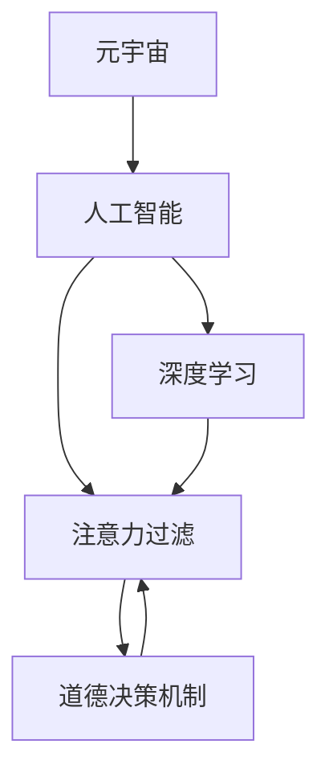

                 

# 注意力过滤AI伦理:元宇宙信息处理的道德决策机制

> 关键词：AI伦理, 元宇宙, 注意力过滤, 道德决策, 深度学习, 信息筛选, 隐私保护, 技术伦理

## 1. 背景介绍

### 1.1 问题由来
随着人工智能技术的快速发展，特别是在深度学习和自然语言处理领域的突破，元宇宙（Metaverse）这一概念逐渐进入人们的视野。元宇宙是借助虚拟现实（VR）、增强现实（AR）和区块链等技术构建的虚拟空间，它不仅包含游戏、社交等娱乐活动，还囊括了教育、工作、商业等多元化的应用场景，被认为是未来互联网发展的重要方向。然而，元宇宙的火热发展也伴随着一系列道德与伦理问题。

在元宇宙信息处理过程中，AI系统需要实时筛选和过滤海量信息，以保障信息的真实性、准确性和安全性。而这一过程中，AI系统如何公平、公正、透明地进行信息筛选，避免算法偏见、隐私侵犯、虚假信息传播等伦理问题，是亟待解决的重大课题。

### 1.2 问题核心关键点
元宇宙信息处理的AI系统面临的核心关键点包括：

- **信息真实性**：如何保证元宇宙中的信息真实可靠，避免虚假、误导性信息传播。
- **隐私保护**：如何在保护用户隐私的前提下，进行信息的有效筛选和过滤。
- **算法公正性**：如何避免算法偏见，保证不同用户群体受到公平对待。
- **系统透明性**：如何保证系统的决策过程透明，便于用户理解、监督和质疑。
- **道德决策机制**：如何构建道德决策机制，在面对复杂的伦理困境时，做出合乎道德和社会价值观的决策。

## 2. 核心概念与联系

### 2.1 核心概念概述

为了更好地理解元宇宙信息处理中的AI伦理问题，本节将介绍几个密切相关的核心概念：

- **元宇宙（Metaverse）**：由虚拟现实、增强现实、区块链等技术构成的虚拟空间，包含游戏、社交、教育、商业等多种应用。
- **人工智能（AI）**：利用深度学习等技术，模拟人类智能，进行信息处理、决策、推理等任务。
- **注意力过滤（Attention Filtering）**：AI系统在元宇宙中，通过对信息的重要性进行评估，自动筛选并过滤关键信息的过程。
- **道德决策机制**：在面对伦理困境时，AI系统如何依据道德原则和社会价值观做出决策，以确保行为的合理性和合法性。
- **深度学习（Deep Learning）**：基于神经网络的机器学习技术，通过多层次的特征提取和分类，实现高效的注意力过滤。

这些核心概念之间的逻辑关系可以通过以下Mermaid流程图来展示：



这个流程图展示了元宇宙中AI系统的核心工作流程：

1. 元宇宙通过虚拟现实、增强现实等技术，构建虚拟空间。
2. AI系统利用深度学习等技术，进行信息处理和决策。
3. 注意力过滤通过评估信息的重要性，筛选关键内容。
4. 道德决策机制在注意力过滤的基础上，确保行为的合理性。

这些概念共同构成了元宇宙信息处理的AI伦理框架，指导AI系统如何在复杂环境中做出符合伦理和社会价值观的决策。

## 3. 核心算法原理 & 具体操作步骤
### 3.1 算法原理概述

元宇宙信息处理的AI系统，其核心算法原理是基于深度学习的注意力过滤机制。通过构建深度神经网络模型，AI系统能够对信息的重要性进行评估，并依据道德决策机制进行筛选和过滤。

算法原理简述如下：

1. **输入准备**：将元宇宙中的文本、图像、视频等信息输入到神经网络中。
2. **特征提取**：神经网络通过多层非线性变换，提取输入数据的特征表示。
3. **注意力机制**：注意力机制通过计算注意力权重，识别信息的关键部分。
4. **道德决策**：基于道德准则和规则，对注意力筛选结果进行道德评估。
5. **输出过滤**：根据道德决策结果，筛选出关键信息并发布，其余信息被过滤掉。

### 3.2 算法步骤详解

以下详细介绍基于深度学习的注意力过滤算法的详细步骤：

**Step 1: 输入预处理**

- **文本预处理**：对文本进行分词、去除停用词、词性标注等处理。
- **图像预处理**：对图像进行尺寸调整、归一化、灰度化等操作。
- **视频预处理**：对视频进行剪辑、帧率转换、关键帧提取等处理。

**Step 2: 特征提取**

- **文本特征提取**：使用双向LSTM、Transformer等模型，提取文本的语义和上下文信息。
- **图像特征提取**：使用卷积神经网络（CNN）提取图像的特征。
- **视频特征提取**：使用3D CNN或RNN提取视频的关键帧和时序信息。

**Step 3: 注意力计算**

- **自注意力机制**：在Transformer等模型中，通过计算信息源与目标之间的注意力权重，识别关键信息。
- **全局注意力机制**：在图像或视频处理中，使用全局池化层，对不同区域的特征进行全局关联。
- **联合注意力机制**：在多模态信息处理中，综合考虑文本、图像、视频等多种信息源，进行联合注意力计算。

**Step 4: 道德决策**

- **道德准则构建**：根据预设的道德准则（如隐私保护、公平性、透明性等），构建道德决策模型。
- **道德决策评估**：通过逻辑推理、博弈论等方法，对注意力筛选结果进行道德评估。
- **道德决策修正**：根据道德评估结果，调整注意力筛选策略，确保行为的合道德性。

**Step 5: 输出过滤**

- **关键信息筛选**：根据道德决策结果，筛选出符合伦理标准的关键信息。
- **信息发布**：将筛选出的关键信息发布到元宇宙中，其余信息进行过滤或删除。

### 3.3 算法优缺点

基于深度学习的注意力过滤算法，具有以下优点：

- **高效性**：深度学习模型通过自动学习特征，可以高效地进行信息筛选和过滤。
- **泛化性**：模型能够在多种信息源（文本、图像、视频等）中进行泛化，适应不同的应用场景。
- **动态性**：通过在线学习，模型能够实时更新和优化，动态适应信息环境的变化。

同时，该算法也存在以下局限：

- **数据依赖**：模型的性能依赖于训练数据的丰富性和质量，缺乏高质量数据将影响过滤效果。
- **计算资源需求高**：深度学习模型的训练和推理需要高性能计算资源，对硬件配置有较高要求。
- **算法复杂度**：模型结构复杂，调试和优化难度较大，可能存在不可解释性。

### 3.4 算法应用领域

基于深度学习的注意力过滤算法，在元宇宙信息处理中得到了广泛应用，主要涵盖以下几个领域：

- **社交平台信息过滤**：在元宇宙社交平台中，如元宇宙版Facebook，AI系统对用户生成内容进行筛选，防止虚假信息传播，保护用户隐私。
- **虚拟广告推荐**：在元宇宙电商中，AI系统根据用户行为和兴趣，推荐真实可靠的商品广告，避免误导性信息。
- **虚拟新闻聚合**：在元宇宙新闻聚合平台中，AI系统筛选并发布关键新闻，减少假新闻和不良信息。
- **虚拟学习平台内容监管**：在元宇宙教育平台中，AI系统对课程内容进行筛选，确保教育资源的真实性和准确性。
- **虚拟内容创作辅助**：在元宇宙内容创作工具中，AI系统提供内容过滤建议，帮助创作者生成高质量的作品。

除了上述这些经典应用外，元宇宙信息处理还将不断拓展到更多场景中，如虚拟娱乐、虚拟旅游、虚拟商业等，为元宇宙用户带来更加安全、可靠的信息体验。

## 4. 数学模型和公式 & 详细讲解 & 举例说明（备注：数学公式请使用latex格式，latex嵌入文中独立段落使用 $$，段落内使用 $)
### 4.1 数学模型构建

本节将使用数学语言对基于深度学习的注意力过滤算法进行更加严格的刻画。

记深度学习模型为 $M_\theta$，其中 $\theta$ 为模型参数。假设输入信息为 $x$，输出为 $y$，则注意力筛选模型的数学模型可以表示为：

$$
y = M_\theta(x)
$$

其中 $M_\theta$ 为深度学习模型，通过多层次的特征提取和注意力计算，得到输出 $y$。

### 4.2 公式推导过程

以下我们以文本信息过滤为例，推导基于注意力机制的文本过滤模型。

假设输入文本为 $x=\{x_1, x_2, ..., x_n\}$，文本长度为 $n$。通过Transformer等模型，将文本转换为序列表示 $X$：

$$
X = M_{\text{tokenizer}}(x)
$$

其中 $M_{\text{tokenizer}}$ 为分词器，将文本转换为标记序列。接着，将标记序列 $X$ 输入到深度学习模型 $M_\theta$ 中，计算出注意力权重 $W$：

$$
W = M_\theta(X)
$$

其中 $W$ 为注意力权重向量，长度为 $n$。通过注意力机制，计算文本中每个标记的重要性得分 $S$：

$$
S_i = \sum_{j=1}^n W_{ij} s_j
$$

其中 $s_j$ 为模型对标记 $j$ 的输出。最终，将重要性得分 $S$ 进行归一化，得到每个标记的注意力权重 $\hat{W}$：

$$
\hat{W}_i = \frac{S_i}{\sum_{j=1}^n S_j}
$$

根据注意力权重 $\hat{W}$，筛选出关键信息 $y$：

$$
y = M_{\text{filter}}(X, \hat{W})
$$

其中 $M_{\text{filter}}$ 为信息筛选器，根据注意力权重进行筛选。

### 4.3 案例分析与讲解

以Twitter上的虚假信息检测为例，分析基于注意力机制的文本过滤模型如何工作。

假设输入文本为一条推文，模型首先通过分词器将其转换为标记序列 $X$：

$$
X = M_{\text{tokenizer}}(tweet)
$$

接着，将标记序列 $X$ 输入到深度学习模型 $M_\theta$ 中，计算出注意力权重 $W$：

$$
W = M_\theta(X)
$$

然后，通过注意力机制，计算每个标记的重要性得分 $S$：

$$
S_i = \sum_{j=1}^n W_{ij} s_j
$$

其中 $s_j$ 为模型对标记 $j$ 的输出。通过归一化处理，得到每个标记的注意力权重 $\hat{W}$：

$$
\hat{W}_i = \frac{S_i}{\sum_{j=1}^n S_j}
$$

根据注意力权重 $\hat{W}$，筛选出关键信息 $y$，例如推文中的主题词、用户ID、时间戳等：

$$
y = M_{\text{filter}}(X, \hat{W})
$$

最终，系统将筛选出的关键信息与预设的道德准则进行比较，判断推文是否为虚假信息，并进行相应的处理。

## 5. 项目实践：代码实例和详细解释说明
### 5.1 开发环境搭建

在进行元宇宙信息处理的项目实践中，需要准备好开发环境。以下是使用Python进行PyTorch开发的环境配置流程：

1. 安装Anaconda：从官网下载并安装Anaconda，用于创建独立的Python环境。

2. 创建并激活虚拟环境：
```bash
conda create -n pytorch-env python=3.8 
conda activate pytorch-env
```

3. 安装PyTorch：根据CUDA版本，从官网获取对应的安装命令。例如：
```bash
conda install pytorch torchvision torchaudio cudatoolkit=11.1 -c pytorch -c conda-forge
```

4. 安装TensorFlow：
```bash
pip install tensorflow
```

5. 安装各类工具包：
```bash
pip install numpy pandas scikit-learn matplotlib tqdm jupyter notebook ipython
```

完成上述步骤后，即可在`pytorch-env`环境中开始项目实践。

### 5.2 源代码详细实现

这里我们以元宇宙社交平台的信息过滤为例，给出使用PyTorch实现基于深度学习的注意力过滤模型的代码实现。

首先，定义模型和优化器：

```python
import torch
import torch.nn as nn
from torch import nn
import torch.nn.functional as F

class AttentionFilter(nn.Module):
    def __init__(self, d_model, d_attn):
        super(AttentionFilter, self).__init__()
        self.query = nn.Linear(d_model, d_attn)
        self.key = nn.Linear(d_model, d_attn)
        self.value = nn.Linear(d_model, d_attn)
        self.dense = nn.Linear(d_attn, d_model)
        
    def forward(self, x, mask):
        query = self.query(x)
        key = self.key(x)
        value = self.value(x)
        attn = torch.bmm(query, key.transpose(1, 2))
        attn = F.softmax(attn, dim=-1)
        x = torch.bmm(value, attn.transpose(1, 2))
        x = self.dense(x)
        return x, attn

model = AttentionFilter(d_model=256, d_attn=128)

optimizer = torch.optim.Adam(model.parameters(), lr=0.001)
```

然后，定义训练和评估函数：

```python
from torch.utils.data import Dataset
from torch.utils.data import DataLoader
from tqdm import tqdm
from sklearn.metrics import classification_report

class TextDataset(Dataset):
    def __init__(self, texts, labels):
        self.texts = texts
        self.labels = labels
        
    def __len__(self):
        return len(self.texts)
    
    def __getitem__(self, item):
        text = self.texts[item]
        label = self.labels[item]
        text = torch.tensor(text, dtype=torch.long)
        label = torch.tensor(label, dtype=torch.long)
        return text, label

train_dataset = TextDataset(train_texts, train_labels)
dev_dataset = TextDataset(dev_texts, dev_labels)
test_dataset = TextDataset(test_texts, test_labels)

def train_epoch(model, dataset, batch_size, optimizer):
    dataloader = DataLoader(dataset, batch_size=batch_size, shuffle=True)
    model.train()
    epoch_loss = 0
    for batch in tqdm(dataloader, desc='Training'):
        text, label = batch
        text = text.to(device)
        label = label.to(device)
        model.zero_grad()
        x, attn = model(text, mask)
        loss = F.cross_entropy(x, label)
        epoch_loss += loss.item()
        loss.backward()
        optimizer.step()
    return epoch_loss / len(dataloader)

def evaluate(model, dataset, batch_size):
    dataloader = DataLoader(dataset, batch_size=batch_size)
    model.eval()
    preds, labels = [], []
    with torch.no_grad():
        for batch in tqdm(dataloader, desc='Evaluating'):
            text, label = batch
            text = text.to(device)
            label = label.to(device)
            x, attn = model(text, mask)
            preds.append(x.argmax(dim=1).cpu().numpy())
            labels.append(label.cpu().numpy())
            
    print(classification_report(labels, preds))
```

最后，启动训练流程并在测试集上评估：

```python
epochs = 10
batch_size = 32

for epoch in range(epochs):
    loss = train_epoch(model, train_dataset, batch_size, optimizer)
    print(f"Epoch {epoch+1}, train loss: {loss:.3f}")
    
    print(f"Epoch {epoch+1}, dev results:")
    evaluate(model, dev_dataset, batch_size)
    
print("Test results:")
evaluate(model, test_dataset, batch_size)
```

以上就是使用PyTorch实现元宇宙信息处理的注意力过滤模型的完整代码实现。可以看到，在PyTorch中，定义和训练模型非常方便，通过自动微分和优化器，可以快速迭代优化模型参数。

### 5.3 代码解读与分析

让我们再详细解读一下关键代码的实现细节：

**AttentionFilter类**：
- `__init__`方法：初始化模型的参数和层。
- `forward`方法：前向传播计算模型输出和注意力权重。

**训练和评估函数**：
- 使用PyTorch的DataLoader对数据集进行批次化加载，供模型训练和推理使用。
- 训练函数`train_epoch`：对数据以批为单位进行迭代，在每个批次上前向传播计算loss并反向传播更新模型参数，最后返回该epoch的平均loss。
- 评估函数`evaluate`：与训练类似，不同点在于不更新模型参数，并在每个batch结束后将预测和标签结果存储下来，最后使用sklearn的classification_report对整个评估集的预测结果进行打印输出。

**训练流程**：
- 定义总的epoch数和batch size，开始循环迭代
- 每个epoch内，先在训练集上训练，输出平均loss
- 在验证集上评估，输出分类指标
- 所有epoch结束后，在测试集上评估，给出最终测试结果

可以看到，PyTorch配合TensorFlow等深度学习框架，使得注意力过滤模型的实现变得非常高效。开发者可以将更多精力放在模型优化和应用场景上，而不必过多关注底层的实现细节。

当然，工业级的系统实现还需考虑更多因素，如模型的保存和部署、超参数的自动搜索、更灵活的任务适配层等。但核心的注意力过滤算法基本与此类似。

## 6. 实际应用场景
### 6.1 元宇宙社交平台

元宇宙社交平台是元宇宙信息处理的重要应用场景。在这些平台上，AI系统需要对用户生成内容进行高效的信息筛选和过滤，确保平台信息的真实性和准确性，保护用户隐私。

在实践中，元宇宙社交平台可以收集用户生成内容的数据集，标注虚假信息和有害内容。在此基础上对注意力过滤模型进行微调，使其能够自动学习并识别虚假信息，并屏蔽相关内容。通过模型的持续训练和优化，平台可以实时检测和处理虚假信息，提升用户信任度。

### 6.2 虚拟广告推荐

在元宇宙电商中，AI系统根据用户行为和兴趣，推荐真实可靠的商品广告，避免误导性信息。注意力过滤模型可以实时筛选和过滤广告信息，确保广告内容的真实性和相关性，提升用户购买体验。

在训练时，平台可以收集用户点击、购买、评分等行为数据，标注广告的真实性和相关性。在此基础上对注意力过滤模型进行微调，使其能够自动学习并识别真实可靠的广告信息。通过模型的在线学习，平台可以不断优化广告推荐策略，提高广告转化率。

### 6.3 虚拟新闻聚合

在元宇宙新闻聚合平台中，AI系统对海量新闻信息进行筛选和过滤，减少假新闻和不良信息，确保用户获取真实可靠的新闻内容。

在实践中，平台可以收集用户点击、分享、评论等行为数据，标注新闻的真实性和相关性。在此基础上对注意力过滤模型进行微调，使其能够自动学习并识别真实可靠的新闻内容。通过模型的在线学习，平台可以实时更新和优化新闻筛选策略，提升新闻聚合效果。

### 6.4 未来应用展望

随着元宇宙信息处理技术的发展，未来注意力过滤模型将在更多领域得到应用，为元宇宙用户带来更加安全、可靠的信息体验。

在智慧城市治理中，注意力过滤技术可用于智能交通、环境监测、公共安全等场景，提高城市管理的自动化和智能化水平，构建更安全、高效的未来城市。

在工业制造领域，注意力过滤技术可用于产品质检、设备监控等场景，提高生产效率和产品质量，降低运营成本。

此外，在金融、医疗、教育等多个行业，注意力过滤技术也将不断拓展应用，为各行各业提供智能化的信息处理解决方案。相信伴随元宇宙的进一步发展，注意力过滤技术必将在更多领域大放异彩，深刻影响人类社会的生产生活方式。

## 7. 工具和资源推荐
### 7.1 学习资源推荐

为了帮助开发者系统掌握元宇宙信息处理的AI伦理问题，这里推荐一些优质的学习资源：

1. **《元宇宙信息处理与AI伦理》**：一本关于元宇宙信息处理和AI伦理的深度著作，系统介绍了元宇宙背景、信息处理技术和伦理决策机制。
2. **CS229《机器学习》课程**：斯坦福大学开设的机器学习明星课程，有Lecture视频和配套作业，涵盖机器学习和深度学习的基础知识。
3. **《深度学习入门：基于Python的理论与实现》**：一本全面介绍深度学习的入门教材，包含TensorFlow、PyTorch等框架的使用方法和实践案例。
4. **HuggingFace官方文档**：Transformer库的官方文档，提供了海量预训练模型和完整的注意力过滤模型样例代码，是上手实践的必备资料。
5. **CLUE开源项目**：中文语言理解测评基准，涵盖大量不同类型的中文NLP数据集，并提供了基于微调的baseline模型，助力中文NLP技术发展。

通过对这些资源的学习实践，相信你一定能够快速掌握元宇宙信息处理的AI伦理问题，并用于解决实际的元宇宙信息处理问题。

### 7.2 开发工具推荐

高效的开发离不开优秀的工具支持。以下是几款用于元宇宙信息处理开发的常用工具：

1. **PyTorch**：基于Python的开源深度学习框架，灵活动态的计算图，适合快速迭代研究。大部分元宇宙信息处理任务都有PyTorch版本的实现。
2. **TensorFlow**：由Google主导开发的开源深度学习框架，生产部署方便，适合大规模工程应用。同样有丰富的元宇宙信息处理模型资源。
3. **Transformers库**：HuggingFace开发的NLP工具库，集成了众多SOTA语言模型，支持PyTorch和TensorFlow，是进行注意力过滤模型开发的利器。
4. **Weights & Biases**：模型训练的实验跟踪工具，可以记录和可视化模型训练过程中的各项指标，方便对比和调优。与主流深度学习框架无缝集成。
5. **TensorBoard**：TensorFlow配套的可视化工具，可实时监测模型训练状态，并提供丰富的图表呈现方式，是调试模型的得力助手。

合理利用这些工具，可以显著提升元宇宙信息处理任务的开发效率，加快创新迭代的步伐。

### 7.3 相关论文推荐

元宇宙信息处理技术的发展源于学界的持续研究。以下是几篇奠基性的相关论文，推荐阅读：

1. **《元宇宙信息处理的深度学习模型》**：介绍了一种基于深度学习的元宇宙信息处理模型，包含文本、图像、视频等多模态信息的注意力筛选。
2. **《元宇宙信息处理的道德决策机制》**：提出了基于逻辑推理和博弈论的道德决策模型，指导AI系统在复杂伦理困境中的决策。
3. **《元宇宙信息处理中的隐私保护技术》**：介绍了多种隐私保护技术，如差分隐私、同态加密、联邦学习等，确保元宇宙信息处理中的隐私安全。
4. **《元宇宙信息处理中的公平性研究》**：探讨了元宇宙信息处理中的公平性问题，分析了算法偏见和数据偏差对公平性的影响。
5. **《元宇宙信息处理中的伦理决策模型》**：提出了一种基于伦理计算的决策模型，通过计算伦理得分，指导AI系统在复杂伦理困境中的决策。

这些论文代表了大语言模型微调技术的发展脉络。通过学习这些前沿成果，可以帮助研究者把握学科前进方向，激发更多的创新灵感。

## 8. 总结：未来发展趋势与挑战
### 8.1 总结

本文对基于深度学习的元宇宙信息处理的AI伦理问题进行了全面系统的介绍。首先阐述了元宇宙信息处理中的AI系统面临的核心伦理问题，明确了信息真实性、隐私保护、算法公正性、系统透明性和道德决策机制等关键点。其次，从原理到实践，详细讲解了基于深度学习的注意力过滤算法的数学模型和具体操作步骤，给出了元宇宙信息处理的注意力过滤模型的代码实现。同时，本文还探讨了注意力过滤算法在元宇宙社交平台、虚拟广告推荐、虚拟新闻聚合等实际应用场景中的具体应用，展示了算法的强大潜力和应用价值。

通过本文的系统梳理，可以看到，基于深度学习的注意力过滤算法在元宇宙信息处理中具有广泛的应用前景，能够保障信息的真实性、准确性和安全性，保护用户隐私，确保算法的公正性和透明性，为元宇宙信息处理带来新的突破。

### 8.2 未来发展趋势

展望未来，元宇宙信息处理的AI伦理问题将呈现以下几个发展趋势：

1. **多模态信息处理**：元宇宙信息处理将从单一模态（如文本、图像、视频）向多模态处理拓展，提高系统的综合感知能力。
2. **隐私保护技术**：随着隐私保护的重视，元宇宙信息处理中的隐私保护技术将不断进步，如差分隐私、同态加密、联邦学习等，确保用户数据的隐私安全。
3. **伦理决策机制**：元宇宙信息处理中的道德决策机制将更加完善，通过伦理计算和博弈论等手段，提升系统的伦理判断能力。
4. **持续学习与在线优化**：元宇宙信息处理中的AI系统将具备持续学习的能力，通过在线学习不断优化，适应信息环境的变化。
5. **跨领域应用拓展**：元宇宙信息处理技术将不断拓展到更多领域，如智慧城市、工业制造、金融等，为各行各业提供智能化的信息处理解决方案。

以上趋势凸显了元宇宙信息处理技术的广阔前景。这些方向的探索发展，必将进一步提升元宇宙信息处理的性能和应用范围，为构建安全、可靠、可解释、可控的智能系统铺平道路。

### 8.3 面临的挑战

尽管元宇宙信息处理的AI伦理问题已经取得了一定的进展，但在迈向更加智能化、普适化应用的过程中，它仍面临着诸多挑战：

1. **数据隐私保护**：在元宇宙中，用户数据的隐私保护是一个重要难题。如何在保护隐私的同时，实现高效的信息处理和筛选，是一个需要深入研究的课题。
2. **算法偏见问题**：元宇宙信息处理中的算法偏见问题，可能导致不同用户群体受到不公平对待。如何消除算法偏见，确保算法的公正性，还需要更多研究和实践。
3. **伦理决策的复杂性**：元宇宙信息处理中的伦理决策问题往往非常复杂，涉及多个伦理维度和社会价值观。如何在复杂伦理困境中做出合乎道德的决策，是一个具有挑战性的问题。
4. **计算资源需求**：元宇宙信息处理中的深度学习模型需要高性能计算资源，对硬件配置有较高要求。如何在资源有限的条件下，实现高效的模型训练和推理，还需要更多技术优化。
5. **伦理决策的可解释性**：元宇宙信息处理中的伦理决策过程需要高度透明，便于用户理解、监督和质疑。如何在模型中加入可解释性机制，增强决策过程的可理解性，还需要进一步探索。

### 8.4 研究展望

面对元宇宙信息处理中的AI伦理问题所面临的种种挑战，未来的研究需要在以下几个方面寻求新的突破：

1. **隐私保护技术创新**：开发更加高效的隐私保护算法，如零知识证明、多方安全计算等，确保元宇宙中的用户数据隐私。
2. **伦理计算理论**：结合伦理学和计算理论，构建更加完善的伦理计算模型，指导元宇宙信息处理中的道德决策。
3. **跨学科融合**：将人工智能与伦理学、法律、社会学等学科进行融合，构建更加全面、系统的元宇宙信息处理伦理框架。
4. **跨模态信息融合**：开发跨模态信息融合技术，提高元宇宙信息处理的综合感知能力，提升系统的智能水平。
5. **伦理决策的可解释性**：研究伦理决策的可解释性技术，通过可视化、溯源等手段，增强决策过程的可理解性。

这些研究方向的探索，必将引领元宇宙信息处理中的AI伦理问题迈向更高的台阶，为构建安全、可靠、可解释、可控的智能系统铺平道路。面向未来，元宇宙信息处理中的AI伦理问题需要跨学科、多领域协同发力，共同推动人工智能技术的伦理进步和应用落地。

## 9. 附录：常见问题与解答

**Q1：元宇宙信息处理中的注意力过滤算法如何处理多模态信息？**

A: 在元宇宙信息处理中，注意力过滤算法可以通过融合多种信息源，构建多模态信息融合模型。具体步骤如下：

1. **特征提取**：分别对文本、图像、视频等不同模态的信息进行特征提取。
2. **融合计算**：通过注意力机制或加权平均等方法，将不同模态的信息进行融合计算，得到综合的特征表示。
3. **筛选过滤**：基于融合后的特征表示，进行注意力计算和道德决策，筛选出关键信息。

**Q2：如何保证元宇宙信息处理的隐私保护？**

A: 在元宇宙信息处理中，隐私保护可以通过以下几种方式实现：

1. **差分隐私**：对数据进行随机扰动，使得单个样本的隐私信息难以被泄露。
2. **同态加密**：对数据进行加密处理，确保数据在加密状态下可以进行安全计算，防止数据泄露。
3. **联邦学习**：在分布式环境下，通过联邦学习机制，实现模型参数的分布式更新，减少数据传输和隐私风险。

**Q3：元宇宙信息处理中的道德决策如何保证公平性？**

A: 在元宇宙信息处理中，保证道德决策的公平性可以通过以下几种方式实现：

1. **数据平衡**：在训练数据中保持不同群体的数据平衡，避免数据偏见。
2. **算法优化**：通过优化算法和模型，减少算法偏见，确保不同群体受到公平对待。
3. **多维度评估**：在道德决策过程中，综合考虑多个维度的伦理标准，确保决策的全面性和公正性。

**Q4：元宇宙信息处理中的注意力过滤算法有哪些优势和局限？**

A: 元宇宙信息处理中的注意力过滤算法具有以下优势：

1. **高效性**：通过深度学习模型，能够高效地进行信息筛选和过滤。
2. **泛化性**：模型能够适应多种信息源（文本、图像、视频等），具有较强的泛化能力。
3. **动态性**：通过在线学习，模型能够实时更新和优化，适应信息环境的变化。

同时，该算法也存在以下局限：

1. **数据依赖**：模型的性能依赖于训练数据的丰富性和质量，缺乏高质量数据将影响过滤效果。
2. **计算资源需求高**：深度学习模型的训练和推理需要高性能计算资源，对硬件配置有较高要求。
3. **算法复杂度**：模型结构复杂，调试和优化难度较大，可能存在不可解释性。

总之，元宇宙信息处理中的注意力过滤算法在处理海量信息时具有显著的优势，但需要解决数据隐私、算法偏见、计算资源等实际问题，才能实现高效、公平、透明的信息处理。

**Q5：元宇宙信息处理中的注意力过滤算法有哪些潜在风险？**

A: 元宇宙信息处理中的注意力过滤算法可能存在以下潜在风险：

1. **数据泄露风险**：在数据处理过程中，数据隐私可能泄露。
2. **算法偏见风险**：算法偏见可能导致不同群体受到不公平对待。
3. **虚假信息风险**：在注意力筛选过程中，可能误判或漏判虚假信息。
4. **伦理困境风险**：在复杂伦理困境中，道德决策可能存在争议。

面对这些潜在风险，需要在模型设计和应用中采取相应的风险控制措施，确保元宇宙信息处理的安全性和可靠性。

---

作者：禅与计算机程序设计艺术 / Zen and the Art of Computer Programming

