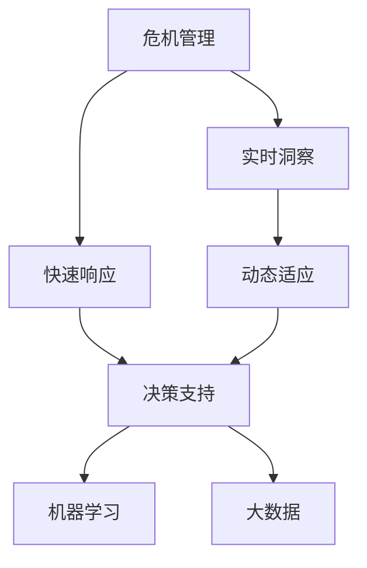

                 

# 洞察力与危机管理：快速反应与适应的能力

> 关键词：危机管理, 快速反应, 洞察力, 适应能力, 动态系统, 机器学习, 大数据, 决策支持, 风险评估, 网络安全

## 1. 背景介绍

### 1.1 问题由来

在现代社会的快速发展中，企业、组织乃至整个社会都面临着越来越多的不确定性和风险。自然灾害、市场波动、网络攻击、公共卫生事件等危机事件，不仅对组织的稳定性构成直接威胁，还可能引发更大范围的社会连锁反应。在这种背景下，企业需要构建一套高效、稳健的危机管理体系，以提升其在复杂环境中的快速反应和适应能力。

危机管理涉及的决策和应对过程，是一个高度动态且信息密集型的系统。传统的危机管理方式往往依赖于专家经验和手动操作，难以在短时间内做出快速且有效的决策。而近年来，机器学习、大数据分析等技术的发展，为危机管理带来了新的思路和工具。本文将围绕洞察力与危机管理，探讨如何利用先进技术提升组织的快速反应与适应能力。

### 1.2 问题核心关键点

危机管理的核心在于如何在信息不确定、资源有限、时间紧迫的环境下，快速识别并响应潜在的威胁，以最小化损失、最大化生存和恢复。为此，本文将从以下几个核心关键点入手：

- **快速响应**：如何利用自动化工具和算法，在危机事件发生时迅速生成初步应急方案。
- **实时洞察**：如何通过大数据和机器学习技术，持续监测环境变化，提前预测潜在危机。
- **动态适应**：如何根据实时数据和反馈信息，动态调整应急策略，实现最优的危机管理效果。
- **模型学习**：如何构建和训练危机管理模型，提升其在不同情景下的适应性和准确性。

## 2. 核心概念与联系

### 2.1 核心概念概述

为更好地理解基于机器学习的危机管理方法，本节将介绍几个密切相关的核心概念：

- **危机管理**：指在识别、预警、响应和恢复危机事件全过程中，实施的有效管理策略和行为。
- **快速响应**：指在危机事件发生后，迅速采取行动，以减少损害和影响。
- **实时洞察**：指通过数据分析和预测模型，持续监测环境变化，提前预警潜在危机。
- **动态适应**：指根据实时数据和反馈信息，不断调整和优化危机管理策略。
- **机器学习**：指通过数据驱动的学习过程，自动提升模型性能和预测能力。
- **大数据**：指利用收集的大量数据，进行深度分析和挖掘，发现潜在趋势和模式。
- **决策支持系统**：指利用计算机技术辅助决策者，提供信息和建议，支持决策过程。

这些核心概念之间的逻辑关系可以通过以下Mermaid流程图来展示：



这个流程图展示了几者之间的内在联系：

1. 危机管理作为一个整体，通过快速响应、实时洞察和动态适应，实现对危机的有效管理。
2. 决策支持系统作为危机管理的辅助工具，通过机器学习和数据分析，提供科学的决策依据。
3. 实时洞察和动态适应依赖于机器学习和大数据技术，进行精准的预测和调整。

## 3. 核心算法原理 & 具体操作步骤
### 3.1 算法原理概述

基于机器学习的危机管理方法，本质上是通过数据驱动的技术手段，提升危机管理系统的响应速度、准确性和适应能力。其核心思想是：利用大数据和机器学习技术，构建一个能够持续监测、预警和响应的动态系统。

在危机管理中，算法可以分为以下几个主要部分：

- **数据收集与预处理**：收集和清洗危机相关的数据，包括历史案例、实时监控数据、社交媒体信息等。
- **数据分析与建模**：利用统计学、机器学习等方法，对数据进行建模和分析，提取有价值的模式和特征。
- **预测与预警**：使用预测模型，根据历史数据和实时信息，提前预测潜在危机，并生成预警信息。
- **应急决策与响应**：基于预警信息，结合领域知识和专家经验，制定应急方案并执行。
- **效果评估与优化**：对危机管理过程进行评估，不断调整模型参数和策略，提升应对效果。

### 3.2 算法步骤详解

基于机器学习的危机管理方法一般包括以下几个关键步骤：

**Step 1: 数据收集与预处理**
- 从各个渠道收集与危机相关的数据，包括历史事件记录、实时监控数据、社交媒体、新闻报道等。
- 对数据进行清洗和预处理，如去除噪声、填补缺失值、标准化等，确保数据质量。

**Step 2: 数据分析与建模**
- 利用统计学方法（如回归分析、时间序列分析等），提取历史事件的模式和规律。
- 使用机器学习算法（如随机森林、支持向量机、神经网络等），构建预测模型，用于预测未来危机事件的发生概率和严重程度。
- 对模型进行训练和验证，确保其预测准确性。

**Step 3: 预测与预警**
- 实时收集环境数据，输入到预测模型中，计算未来一定时间内发生危机的概率。
- 根据预测结果，生成预警信息，通知相关决策者。

**Step 4: 应急决策与响应**
- 根据预警信息，结合领域知识和专家经验，制定初步应急方案。
- 将应急方案提交给相关决策者审批，并执行应急措施。

**Step 5: 效果评估与优化**
- 对应急措施的效果进行评估，如减少损失、缩短响应时间等。
- 根据评估结果，调整模型参数和应急策略，不断优化危机管理效果。

### 3.3 算法优缺点

基于机器学习的危机管理方法具有以下优点：
1. 高效快速：能够自动处理大量数据，实时预警和响应，大大提升危机管理的速度。
2. 数据驱动：利用大数据和机器学习技术，提升预测准确性和决策科学性。
3. 动态适应：能够根据实时数据和反馈信息，动态调整策略，增强适应能力。
4. 知识复用：通过构建和训练预测模型，积累并复用已有经验，提升应对复杂情景的能力。

同时，该方法也存在一些局限性：
1. 依赖数据质量：预测模型的效果依赖于数据的质量和多样性，如果数据存在偏差，模型可能产生误判。
2. 高初始成本：构建和训练预测模型需要大量的数据和计算资源，初始成本较高。
3. 复杂性高：模型构建和调整过程复杂，需要较高的技术和资源投入。
4. 可解释性不足：机器学习模型往往被视为"黑盒"系统，难以解释其决策逻辑。
5. 伦理风险：预测模型可能存在偏见和歧视，引发伦理问题。

尽管存在这些局限性，但就目前而言，基于机器学习的危机管理方法仍然是大规模、高复杂性危机管理的重要手段。未来相关研究的重点在于如何进一步降低数据依赖，提高模型的可解释性，同时兼顾效率和效果。

### 3.4 算法应用领域

基于机器学习的危机管理方法，在多个领域得到了广泛应用，例如：

- **企业风险管理**：对企业内部和外部的各种风险进行识别、评估和控制。利用机器学习模型预测市场波动、供应链风险、员工流失等事件。
- **公共卫生应急**：利用大数据和机器学习技术，监测和预测疾病爆发，提前采取防控措施。
- **自然灾害预警**：通过实时监控气象、地质数据，预测地震、洪水、台风等自然灾害的发生，减少损失。
- **网络安全防护**：使用机器学习算法识别异常网络行为，防止黑客攻击和数据泄露。
- **金融风险管理**：预测市场走势、识别欺诈行为、风险评估等，提升金融机构的风险控制能力。
- **政府应急响应**：利用大数据和机器学习技术，快速响应自然灾害、恐怖袭击等突发事件，提升政府应急响应能力。

这些领域的应用展示了机器学习在危机管理中的巨大潜力，推动了危机管理的现代化和智能化进程。

## 4. 数学模型和公式 & 详细讲解  
### 4.1 数学模型构建

本节将使用数学语言对基于机器学习的危机管理过程进行更加严格的刻画。

设危机管理模型为 $M$，其输入为 $x$（如历史数据、实时数据），输出为 $y$（如危机发生概率、预警信号）。模型的目标是最小化预测误差，即：

$$
\min_{M} \mathbb{E}[(\hat{y}-y)^2]
$$

其中，$\hat{y}$ 为模型预测的输出，$y$ 为真实标签。

模型的预测过程可以表示为：

$$
\hat{y} = f(x, \theta)
$$

其中，$f$ 为模型函数，$\theta$ 为模型参数。

### 4.2 公式推导过程

以下我们以金融风险预测为例，推导机器学习模型的训练和预测过程。

假设模型的输入为 $x=(t,\Delta t)$，其中 $t$ 为时间点，$\Delta t$ 为时间间隔。输出为 $y$，表示在 $[t, t+\Delta t]$ 期间发生金融危机的概率。

模型的训练过程如下：
1. 收集历史金融数据 $(x_i, y_i)$，其中 $x_i$ 为时间点和时间间隔，$y_i$ 为是否发生金融危机的标签。
2. 将数据集分为训练集和验证集，对训练集进行模型训练。
3. 使用损失函数（如均方误差）计算预测误差。
4. 使用梯度下降等优化算法更新模型参数 $\theta$，直至误差最小。

模型的预测过程如下：
1. 输入新的时间点 $t$ 和时间间隔 $\Delta t$，计算模型输出 $\hat{y}$。
2. 根据阈值判断是否发生金融危机，如 $\hat{y} \geq \tau$，则预测发生金融危机。

其中，$\tau$ 为预警阈值，需根据实际情况设定。

### 4.3 案例分析与讲解

假设某金融机构希望构建一个金融危机预测模型。他们收集了2006年至2020年的全球金融市场数据，包括股票指数、汇率、利率等。这些数据被分为训练集和测试集。

**训练过程**：
1. 对数据进行标准化处理，移除异常值。
2. 使用随机森林算法对数据进行建模，计算不同特征的重要性。
3. 使用交叉验证方法，选择最优的模型参数。
4. 在验证集上测试模型，计算均方误差。
5. 使用梯度下降算法优化模型参数，直至均方误差最小。

**预测过程**：
1. 输入新的金融数据 $x=(t,\Delta t)$。
2. 将数据输入训练好的模型，计算预测值 $\hat{y}$。
3. 如果 $\hat{y} \geq \tau$，则通知决策者采取紧急措施。

在实际应用中，模型的效果会根据数据质量和模型复杂度等因素而变化。金融机构还需根据具体情况，调整模型参数和预警阈值，以确保预测的准确性和及时性。

## 5. 项目实践：代码实例和详细解释说明
### 5.1 开发环境搭建

在进行机器学习项目实践前，我们需要准备好开发环境。以下是使用Python进行Scikit-Learn开发的环境配置流程：

1. 安装Anaconda：从官网下载并安装Anaconda，用于创建独立的Python环境。

2. 创建并激活虚拟环境：
```bash
conda create -n ml-env python=3.8 
conda activate ml-env
```

3. 安装Scikit-Learn：
```bash
pip install scikit-learn
```

4. 安装各类工具包：
```bash
pip install numpy pandas scikit-learn matplotlib tqdm jupyter notebook ipython
```

完成上述步骤后，即可在`ml-env`环境中开始机器学习实践。

### 5.2 源代码详细实现

这里我们以金融风险预测为例，给出使用Scikit-Learn对随机森林模型进行训练的Python代码实现。

```python
from sklearn.ensemble import RandomForestClassifier
from sklearn.model_selection import train_test_split
from sklearn.metrics import mean_squared_error
import numpy as np

# 准备数据集
X = np.loadtxt('financial_data.csv', delimiter=',')
y = np.loadtxt('financial_crisis.csv', delimiter=',')

# 数据标准化处理
from sklearn.preprocessing import StandardScaler
scaler = StandardScaler()
X = scaler.fit_transform(X)

# 划分训练集和测试集
X_train, X_test, y_train, y_test = train_test_split(X, y, test_size=0.2, random_state=42)

# 训练模型
model = RandomForestClassifier(n_estimators=100, max_depth=5)
model.fit(X_train, y_train)

# 预测并评估模型
y_pred = model.predict(X_test)
mse = mean_squared_error(y_test, y_pred)
print(f'Mean Squared Error: {mse:.2f}')

# 进行金融风险预测
new_data = np.array([[2019, 6], [2020, 9]])  # 新输入的数据
new_data = scaler.transform(new_data)
prediction = model.predict(new_data)
if prediction[0] > 0.5:
    print('Financial crisis predicted.')
```

以上就是使用Scikit-Learn对随机森林模型进行金融风险预测的完整代码实现。可以看到，Scikit-Learn提供了简单易用的接口，可以快速构建和训练机器学习模型。

### 5.3 代码解读与分析

让我们再详细解读一下关键代码的实现细节：

**数据准备**：
- 使用`numpy`加载历史金融数据和危机标签。
- 使用`StandardScaler`对数据进行标准化处理，保证模型训练的稳定性。

**模型训练**：
- 使用`RandomForestClassifier`构建随机森林模型，设置参数`n_estimators`和`max_depth`。
- 使用`train_test_split`函数划分训练集和测试集。
- 调用`fit`函数训练模型。

**预测与评估**：
- 使用`predict`函数进行测试集的预测，并计算均方误差。
- 使用`predict`函数对新数据进行预测，并根据阈值判断是否发生金融危机。

**模型优化**：
- 在实际应用中，模型可能需要进一步优化，如调整参数、使用交叉验证等。
- 可以通过调参、特征工程、模型融合等手段，提升模型的预测准确性和鲁棒性。

在实际项目中，数据分析、模型训练、预测评估等步骤需要根据具体业务场景进行调整，以确保模型的有效性和可靠性。

## 6. 实际应用场景
### 6.1 企业风险管理

基于机器学习的危机管理方法，可以广泛应用于企业风险管理。传统风险管理往往依赖于专家经验和手动操作，难以在短时间内做出快速且有效的决策。利用机器学习算法，企业可以自动化地分析历史数据，预测未来风险，从而提升风险管理的效率和准确性。

在技术实现上，可以收集企业内部的历史数据，如财务报表、市场数据、员工行为等，构建机器学习模型，进行风险预测和预警。例如，某公司可以利用机器学习模型预测市场波动，提前采取资产配置策略，降低投资风险。

### 6.2 公共卫生应急

在公共卫生领域，机器学习技术可以用于监测和预测疾病爆发，提前采取防控措施。利用大数据和机器学习技术，可以实时收集和分析医疗数据、社交媒体信息、交通数据等，构建疾病预测模型。

例如，某医院可以利用机器学习模型监测流感病例，根据实时数据预测疫情爆发，提前制定应对措施，减少传播风险。

### 6.3 自然灾害预警

在自然灾害预警方面，机器学习技术可以用于监测气象、地质数据，预测地震、洪水、台风等自然灾害的发生，减少损失。例如，某气象局可以利用机器学习模型分析气象数据，预测极端天气事件，提前发布预警信息。

### 6.4 未来应用展望

随着机器学习和大数据技术的发展，基于机器学习的危机管理方法将呈现以下几个发展趋势：

1. **自适应学习**：利用强化学习等方法，使模型能够根据实时数据和反馈信息，动态调整策略，增强适应能力。
2. **多模态融合**：将图像、视频、语音等多模态数据与文本数据结合，提升预测准确性和决策科学性。
3. **联邦学习**：通过分布式计算和数据加密技术，实现跨组织的数据共享和模型训练，提升协作效率和数据隐私保护。
4. **实时监控与分析**：利用实时数据流处理技术，如Apache Kafka、Apache Flink等，实现对危机的实时监控和分析。
5. **异常检测与诊断**：利用深度学习算法，如卷积神经网络、循环神经网络等，实现对异常行为的自动识别和诊断。
6. **跨领域应用**：将机器学习技术应用于更多行业，如金融、交通、农业等，提升各行业的应急响应能力和决策效率。

以上趋势凸显了机器学习在危机管理中的巨大潜力，将进一步推动危机管理的智能化和自动化进程。

## 7. 工具和资源推荐
### 7.1 学习资源推荐

为了帮助开发者系统掌握机器学习在危机管理中的应用，这里推荐一些优质的学习资源：

1. 《机器学习实战》系列博文：由机器学习专家撰写，系统介绍了机器学习的基本概念和算法，适用于初学者和进阶者。
2. Coursera《机器学习》课程：斯坦福大学开设的机器学习课程，涵盖广泛的概念和算法，适合系统学习。
3. 《Python机器学习》书籍：机器学习与Python编程的结合，适合编程和算法背景的读者。
4. Kaggle：机器学习竞赛平台，提供丰富的数据集和模型，适合实战练习。
5. TensorFlow官方文档：深度学习框架的官方文档，提供丰富的教程和样例，适合深入学习。

通过对这些资源的学习实践，相信你一定能够快速掌握机器学习在危机管理中的应用，并用于解决实际的危机管理问题。

### 7.2 开发工具推荐

高效的开发离不开优秀的工具支持。以下是几款用于机器学习开发的常用工具：

1. Jupyter Notebook：交互式编程环境，支持Python、R等多种语言，适合代码测试和数据分析。
2. TensorFlow：由Google主导开发的深度学习框架，支持多种算法和模型，适合大规模工程应用。
3. PyTorch：由Facebook主导开发的深度学习框架，灵活高效，适合研究和实验。
4. Scikit-Learn：基于Python的机器学习库，功能丰富，适合快速原型开发和模型评估。
5. H2O.ai：集成化的机器学习平台，支持多种算法和模型，适合快速开发和部署。
6. Apache Kafka：实时数据流处理平台，适合大规模数据监控和分析。

合理利用这些工具，可以显著提升机器学习项目的开发效率，加快创新迭代的步伐。

### 7.3 相关论文推荐

机器学习在危机管理中的应用源于学界的持续研究。以下是几篇奠基性的相关论文，推荐阅读：

1. "Anomaly Detection with Deep Learning"：介绍深度学习在异常检测中的应用，利用卷积神经网络和循环神经网络识别异常行为。
2. "A Survey on Feature Engineering Techniques for Machine Learning"：综述机器学习中的特征工程方法，详细介绍了如何提取和构造有效的特征。
3. "Machine Learning in Disaster Management: A Review"：综述机器学习在灾害管理中的应用，介绍了各种模型和技术。
4. "Distributed Machine Learning: A Survey"：综述分布式机器学习的方法和工具，介绍了联邦学习等技术。
5. "A Survey of Trends in Machine Learning Applications"：综述机器学习在各领域的应用，介绍了最新的进展和趋势。

这些论文代表了大规模机器学习在危机管理中的应用脉络，为进一步研究提供了坚实的基础。

## 8. 总结：未来发展趋势与挑战
### 8.1 总结

本文对基于机器学习的危机管理方法进行了全面系统的介绍。首先阐述了机器学习在危机管理中的重要性，明确了其快速响应、实时洞察和动态适应等关键能力。其次，从原理到实践，详细讲解了机器学习在危机管理中的应用步骤，给出了完整的代码实例。同时，本文还探讨了机器学习在企业风险管理、公共卫生应急、自然灾害预警等诸多实际应用场景中的应用前景，展示了机器学习在危机管理中的巨大潜力。最后，本文精选了机器学习的各类学习资源，力求为读者提供全方位的技术指引。

通过本文的系统梳理，可以看到，基于机器学习的危机管理方法正在成为企业风险管理、公共卫生应急、自然灾害预警等领域的重要手段。这些技术的普及和应用，将显著提升危机管理的智能化和自动化水平，保障社会的稳定和安全。

### 8.2 未来发展趋势

展望未来，机器学习在危机管理领域将呈现以下几个发展趋势：

1. **智能决策支持**：利用深度学习和强化学习技术，提升决策支持系统的智能化水平，实现更加精准的决策支持。
2. **实时数据融合**：将多源异构数据融合到统一的数据平台中，实现对危机的实时监控和分析。
3. **自适应学习**：通过自适应学习算法，使模型能够根据实时数据和反馈信息，动态调整策略，增强适应能力。
4. **跨领域应用**：将机器学习技术应用于更多行业，如金融、交通、农业等，提升各行业的应急响应能力和决策效率。
5. **联邦学习**：通过分布式计算和数据加密技术，实现跨组织的数据共享和模型训练，提升协作效率和数据隐私保护。
6. **边缘计算**：利用边缘计算技术，在数据产生端进行实时分析和预测，减少数据传输和计算延迟。

这些趋势展示了机器学习在危机管理中的广阔前景，推动了危机管理的现代化和智能化进程。

### 8.3 面临的挑战

尽管机器学习在危机管理中取得了显著成效，但在应用推广和实践中，仍面临以下挑战：

1. **数据质量问题**：高质量、多样性的数据是机器学习的基础，但实际应用中数据获取和处理成本高，数据质量难以保证。
2. **模型鲁棒性不足**：机器学习模型容易受到数据偏差和噪声的影响，可能产生误判。
3. **高初始成本**：构建和训练预测模型需要大量的数据和计算资源，初始成本较高。
4. **算法复杂性高**：模型构建和调整过程复杂，需要较高的技术和资源投入。
5. **可解释性不足**：机器学习模型往往被视为"黑盒"系统，难以解释其决策逻辑。
6. **伦理风险**：机器学习模型可能存在偏见和歧视，引发伦理问题。

尽管存在这些挑战，但通过技术进步和实践探索，相信机器学习在危机管理中的应用将逐步克服这些难题，发挥更大的作用。

### 8.4 研究展望

面对机器学习在危机管理中面临的挑战，未来的研究需要在以下几个方面寻求新的突破：

1. **数据自动化获取**：探索自动数据采集和清洗技术，降低数据获取和处理的成本。
2. **模型自适应学习**：开发自适应学习算法，提升模型对新数据的适应能力和泛化能力。
3. **联邦学习**：研究分布式计算和数据加密技术，实现跨组织的数据共享和模型训练。
4. **可解释性增强**：开发可解释性算法，提升模型的透明性和可解释性。
5. **伦理导向**：在模型训练和应用过程中，引入伦理导向的评估指标，确保模型的公平性和安全性。

这些研究方向将推动机器学习在危机管理中的应用不断深入，提升模型的预测准确性和决策科学性，为构建安全、可靠、可解释、可控的危机管理系统奠定基础。

## 9. 附录：常见问题与解答

**Q1：机器学习在危机管理中是否适用于所有场景？**

A: 机器学习在危机管理中适用于大多数场景，但也有一些特定情况需要注意。例如，对于一些需要高度情境判断和领域知识的场景，机器学习可能需要与专家系统结合使用。此外，对于一些高风险、高敏感度的场景，如医疗、金融等，机器学习模型需要经过严格的验证和审核，确保其公正性和安全性。

**Q2：机器学习模型在危机管理中如何避免过拟合？**

A: 过拟合是机器学习模型面临的主要挑战之一。为了减少过拟合，可以采取以下措施：
1. 数据增强：通过数据扩充、增强等手段，提升数据的多样性和丰富性。
2. 正则化：使用L1、L2正则化、Dropout等方法，防止模型过拟合。
3. 交叉验证：使用交叉验证方法，评估模型在不同数据集上的泛化能力。
4. 模型集成：通过集成多个模型的预测结果，提升模型的鲁棒性和泛化能力。

**Q3：机器学习模型在危机管理中的可解释性不足如何应对？**

A: 可解释性不足是机器学习模型的常见问题，但可以通过以下方法缓解：
1. 特征选择：选择具有代表性和解释性的特征，提升模型的可解释性。
2. 模型可视化：使用可视化工具展示模型的决策过程，帮助理解和解释模型的输出。
3. 模型解释技术：开发和应用模型解释技术，如LIME、SHAP等，提升模型的透明性和可解释性。
4. 模型融合：通过融合多个模型的预测结果，提升模型的鲁棒性和可解释性。

**Q4：如何确保机器学习模型在危机管理中的公平性和安全性？**

A: 确保机器学习模型的公平性和安全性是危机管理中的重要问题。可以采取以下措施：
1. 数据清洗：清洗数据中的偏见和噪声，确保模型训练数据的公正性。
2. 公平性评估：使用公平性评估指标，如F1分数、ROC曲线等，评估模型的公平性。
3. 模型监控：实时监控模型的输出，发现和纠正可能的偏见和歧视。
4. 透明性要求：要求模型具有较高的透明性，确保决策过程的可解释和可审计。

通过这些措施，可以提升机器学习模型在危机管理中的公平性和安全性，确保其可靠性和可信赖性。

**Q5：机器学习在危机管理中如何应对高初始成本问题？**

A: 高初始成本是机器学习在危机管理中面临的主要挑战之一。可以采取以下方法缓解：
1. 云计算：利用云平台提供的计算资源和存储服务，降低初始成本。
2. 开源工具：使用开源机器学习工具和框架，减少开发和维护成本。
3. 分布式计算：利用分布式计算技术，提升计算效率和资源利用率。
4. 联邦学习：通过联邦学习技术，实现跨组织的数据共享和模型训练，降低数据获取和处理成本。

通过这些方法，可以显著降低机器学习在危机管理中的初始成本，提升模型的可操作性和实用性。

---

作者：禅与计算机程序设计艺术 / Zen and the Art of Computer Programming

