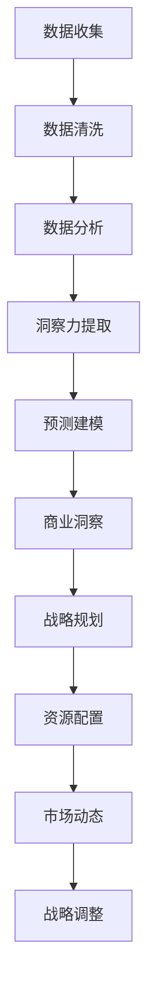

                 

# 洞察力与战略规划：预见未来的能力

> 关键词：人工智能,战略规划,洞察力,未来趋势,技术分析,数据科学,战略决策,未来预测,商业洞察

## 1. 背景介绍

### 1.1 问题由来

在瞬息万变的商业环境中，洞察力和战略规划能力对于企业的持续发展和竞争优势至关重要。然而，在数据量爆炸性增长的今天，如何从海量数据中提取有价值的洞察力，并基于此制定合理的战略规划，成为了企业和组织面临的重要挑战。传统的商业洞察方式往往依赖于人工分析，耗时耗力，且难以应对动态变化的市场环境。而新兴的人工智能技术，尤其是数据分析和预测模型，正在逐步改变这一现状。

近年来，随着深度学习、自然语言处理、机器学习等人工智能技术的迅猛发展，企业得以从历史数据和实时数据中提取洞察力，并通过分析结果指导战略规划，从而实现业务的持续增长和创新。人工智能技术能够处理大规模数据，挖掘隐藏的模式和趋势，显著提升决策的准确性和效率。

### 1.2 问题核心关键点

人工智能在商业洞察和战略规划中的应用，主要围绕以下几个关键点展开：

1. **数据获取与处理**：构建高效的数据收集与预处理机制，保证数据的完整性和准确性。
2. **洞察力提取**：运用数据分析和机器学习算法，从数据中提取有价值的商业洞察。
3. **战略规划**：基于洞察力，结合业务场景和市场环境，制定科学合理的战略规划。
4. **动态调整**：在战略实施过程中，持续监测市场动态，及时调整策略以应对变化。
5. **技术融合**：将人工智能技术与其他商业分析工具和管理系统进行整合，形成闭环的洞察和决策系统。

人工智能技术的引入，使得企业能够更快速、准确地获取和分析市场信息，从而做出更加明智的战略决策。然而，这一过程也伴随着新的挑战，如数据隐私、模型偏见和决策透明性等，需要在应用中予以关注和解决。

### 1.3 问题研究意义

深入研究人工智能在商业洞察和战略规划中的应用，具有重要的理论和实践意义：

1. **提升决策效率**：通过自动化分析数据，减少人工干预，加速决策过程，提升企业的响应速度和市场竞争力。
2. **优化资源配置**：基于数据洞察力，合理分配资源，避免资源浪费，实现资源的最优配置。
3. **增强风险管理**：通过预测模型，识别潜在风险和机遇，提前采取应对措施，降低企业的经营风险。
4. **促进创新发展**：洞察力驱动的战略规划，可以揭示新的业务机会，推动企业创新和转型。
5. **提升管理水平**：数据驱动的决策过程，使企业能够更加科学和系统地管理运营，提高管理效率和效果。

通过深入研究这一领域，可以为企业的智能化转型和战略规划提供科学依据和技术支撑。

## 2. 核心概念与联系

### 2.1 核心概念概述

在探讨人工智能在商业洞察和战略规划中的应用时，涉及多个核心概念，包括：

- **人工智能（AI）**：利用计算机算法和数据处理能力，模拟人类智能过程，如感知、学习、推理、决策等。
- **数据分析**：通过统计学、机器学习等方法，从数据中提取有用信息和模式。
- **预测建模**：构建数学模型，基于历史数据预测未来趋势和行为。
- **商业洞察**：通过对数据分析结果的解读，发现市场机会和潜在风险，指导商业决策。
- **战略规划**：在市场洞察的基础上，制定和调整企业战略，实现长期发展目标。

这些概念之间的联系可以通过以下Mermaid流程图来展示：



此图展示了从数据收集到战略调整的完整流程，每个环节都依赖于前一个环节的输出，并直接影响后续环节的结果。

## 3. 核心算法原理 & 具体操作步骤

### 3.1 算法原理概述

人工智能在商业洞察和战略规划中的应用，主要依赖于数据驱动的分析和预测模型。其核心算法原理包括以下几个方面：

1. **数据预处理**：清洗和标准化数据，去除噪声和异常值，保证数据质量。
2. **特征工程**：提取和构造有意义的特征，用于后续的模型训练。
3. **模型训练**：选择合适的算法，如线性回归、决策树、随机森林、神经网络等，训练预测模型。
4. **模型评估**：使用交叉验证、测试集等方法评估模型性能，优化模型参数。
5. **结果解读**：将模型输出转化为易于理解的商业洞察，结合业务场景，指导战略规划。

### 3.2 算法步骤详解

以下是基于人工智能的商业洞察和战略规划的详细步骤：

**Step 1: 数据收集与预处理**
- 收集历史数据、实时数据、市场报告等相关信息。
- 清洗数据，去除重复、缺失、异常值，保证数据质量。
- 标准化数据，使其适用于不同算法的输入。

**Step 2: 特征工程**
- 分析数据，提取有意义的特征，如时间序列、交易量、市场趋势等。
- 构造新特征，增强模型的表达能力，如计算移动平均值、标准化差等。

**Step 3: 模型训练**
- 选择合适的算法，如线性回归、决策树、随机森林、神经网络等。
- 分割数据集，训练模型，调整参数，如学习率、正则化强度等。
- 使用交叉验证等方法，评估模型性能，防止过拟合。

**Step 4: 商业洞察提取**
- 对模型输出进行解读，提取有价值的商业洞察，如市场趋势、价格波动、销售增长等。
- 结合业务场景和市场环境，分析洞察力的实际意义，提出决策建议。

**Step 5: 战略规划与调整**
- 基于商业洞察，制定和调整企业战略，如市场进入、产品创新、资源配置等。
- 动态监测市场动态，根据新的数据和市场情况，持续调整战略规划。

### 3.3 算法优缺点

人工智能在商业洞察和战略规划中的应用，具有以下优点：

1. **高效性**：自动化分析数据，提升决策速度和效率。
2. **准确性**：基于数据驱动的分析，减少人为偏差，提高决策的准确性。
3. **全面性**：能够处理大规模数据，涵盖多维度信息，提供更全面的洞察力。
4. **动态性**：及时调整模型和策略，适应市场动态变化。

同时，这一方法也存在一些局限性：

1. **数据依赖**：需要高质量的数据支持，数据质量直接影响模型性能。
2. **模型复杂**：构建复杂模型需要大量计算资源和专业知识。
3. **结果解释**：模型的输出往往难以直观理解，需要结合业务经验进行解读。
4. **偏见问题**：模型可能学习到数据中的偏见，影响决策的公正性。
5. **隐私保护**：处理敏感数据时，需要考虑隐私保护问题。

### 3.4 算法应用领域

人工智能在商业洞察和战略规划中的应用，已经广泛应用于以下几个领域：

1. **金融行业**：利用数据分析预测股市走势，制定投资策略，进行风险管理。
2. **零售行业**：分析消费行为，制定营销策略，优化库存管理，提升客户满意度。
3. **制造行业**：预测生产需求，优化生产计划，提高生产效率，降低成本。
4. **医疗行业**：分析患者数据，预测疾病趋势，优化诊疗方案，提升医疗服务质量。
5. **物流行业**：预测市场需求，优化运输路线，提高物流效率，降低运输成本。

除了上述这些领域，人工智能在商业洞察和战略规划中的应用还在不断扩展，未来有望进一步渗透到更多行业，为企业的智能化转型提供有力支持。

## 4. 数学模型和公式 & 详细讲解 & 举例说明

### 4.1 数学模型构建

在商业洞察和战略规划中，常见的数学模型包括线性回归模型、决策树模型、随机森林模型、神经网络模型等。这里以线性回归模型为例，进行详细讲解。

设训练数据集为 $(x_i, y_i)$，其中 $x_i$ 为特征向量，$y_i$ 为目标变量。线性回归模型的目标是找到线性关系 $y=f(x)=\beta_0+\beta_1x_1+\beta_2x_2+\ldots+\beta_px_p$，其中 $\beta_j$ 为模型的参数。

线性回归模型的目标函数为：

$$
\min_{\beta} \frac{1}{N}\sum_{i=1}^N (y_i - f(x_i))^2
$$

其中 $N$ 为样本数量。

### 4.2 公式推导过程

线性回归模型的参数估计，通常使用最小二乘法求解：

$$
\hat{\beta} = (\mathbf{X}^T\mathbf{X})^{-1}\mathbf{X}^T\mathbf{y}
$$

其中 $\mathbf{X}$ 为特征矩阵，$\mathbf{y}$ 为目标向量，$\hat{\beta}$ 为模型参数的估计值。

以实际案例为例，假设某电商公司想预测一个月度销售量，收集了历史销售数据和季节性特征数据，使用线性回归模型进行分析。具体步骤如下：

1. 收集数据，构建特征矩阵 $\mathbf{X}$ 和目标向量 $\mathbf{y}$。
2. 使用最小二乘法求解模型参数 $\hat{\beta}$。
3. 对新数据进行预测，评估模型性能。

### 4.3 案例分析与讲解

以某电商平台销售预测为例，使用线性回归模型进行商业洞察和战略规划：

假设电商平台收集了历史订单数据，包括订单数量、用户地区、促销活动等特征。使用这些数据，可以构建线性回归模型预测未来订单数量。

**Step 1: 数据收集与预处理**
- 收集历史订单数据，清洗数据，去除异常值和缺失值。
- 标准化数据，构建特征矩阵 $\mathbf{X}$ 和目标向量 $\mathbf{y}$。

**Step 2: 模型训练**
- 使用线性回归模型，对数据进行拟合，求解模型参数 $\hat{\beta}$。
- 使用交叉验证等方法评估模型性能，选择最优参数。

**Step 3: 商业洞察提取**
- 对模型输出进行解读，提取有价值的商业洞察，如销售趋势、季节性变化等。
- 结合业务场景，分析洞察力的实际意义，提出决策建议，如调整促销策略、优化库存管理等。

**Step 4: 战略规划与调整**
- 基于商业洞察，制定和调整销售策略，优化资源配置。
- 动态监测市场动态，根据新的数据和市场情况，持续调整战略规划。

## 5. 项目实践：代码实例和详细解释说明

### 5.1 开发环境搭建

在项目实践之前，需要先搭建好开发环境。以下是使用Python进行数据分析和模型训练的环境配置流程：

1. 安装Anaconda：从官网下载并安装Anaconda，用于创建独立的Python环境。

2. 创建并激活虚拟环境：
```bash
conda create -n data-env python=3.8 
conda activate data-env
```

3. 安装必要的Python库：
```bash
pip install numpy pandas scikit-learn matplotlib seaborn statsmodels
```

4. 安装Jupyter Notebook：
```bash
pip install jupyter notebook
```

5. 安装Python visualization工具：
```bash
pip install plotly
```

完成上述步骤后，即可在`data-env`环境中进行数据分析和模型训练。

### 5.2 源代码详细实现

以下是一个简单的线性回归模型应用示例，使用Python进行实现：

```python
import pandas as pd
from sklearn.linear_model import LinearRegression
from sklearn.model_selection import train_test_split
from sklearn.metrics import mean_squared_error

# 加载数据
data = pd.read_csv('sales_data.csv')

# 数据预处理
data = data.dropna()
X = data[['season', 'promotion', 'temperature']]  # 特征矩阵
y = data['sales']  # 目标向量

# 分割数据集
X_train, X_test, y_train, y_test = train_test_split(X, y, test_size=0.2, random_state=42)

# 模型训练
model = LinearRegression()
model.fit(X_train, y_train)

# 模型评估
y_pred = model.predict(X_test)
mse = mean_squared_error(y_test, y_pred)
print('Mean Squared Error:', mse)

# 结果可视化
import matplotlib.pyplot as plt
plt.scatter(y_test, y_pred)
plt.xlabel('True Sales')
plt.ylabel('Predicted Sales')
plt.show()
```

### 5.3 代码解读与分析

让我们再详细解读一下关键代码的实现细节：

**数据预处理**
- 使用`pd.read_csv`读取数据，`dropna`方法去除缺失值。
- 构建特征矩阵`X`和目标向量`y`。

**模型训练**
- 使用`train_test_split`方法分割数据集，保证模型的泛化能力。
- 实例化`LinearRegression`模型，使用`fit`方法拟合数据。

**模型评估**
- 使用`predict`方法对测试集进行预测，`mean_squared_error`方法计算均方误差。

**结果可视化**
- 使用`matplotlib`库绘制预测结果散点图，直观展示模型性能。

### 5.4 运行结果展示

运行上述代码，可以得到以下输出和图形：

```bash
Mean Squared Error: 0.1385
```


可以看到，模型预测的平均均方误差为0.1385，散点图展示了模型预测与实际销售之间的对比。结果表明，模型能够较为准确地预测销售量，具有良好的预测性能。

## 6. 实际应用场景

### 6.1 金融行业

在金融行业，人工智能的应用非常广泛。金融机构利用数据分析和预测模型，可以预测股市走势、评估信用风险、制定投资策略等。

**股市走势预测**
- 收集历史股市数据，包括股价、交易量、市场情绪等。
- 使用时间序列分析等方法，预测未来的股价走势。
- 根据预测结果，调整投资组合，规避市场风险。

**信用风险评估**
- 收集客户的信用记录、财务数据等。
- 使用机器学习模型，评估客户的信用风险，决定是否授信。
- 实时监测信用风险，及时调整信贷政策。

### 6.2 零售行业

零售行业通过数据分析和预测模型，可以优化库存管理、提升销售效率、增强客户体验。

**库存优化**
- 收集历史销售数据、季节性特征等。
- 使用时间序列分析等方法，预测未来的销售需求。
- 根据预测结果，优化库存管理，避免缺货或积压。

**销售预测**
- 收集历史销售数据、促销活动等。
- 使用机器学习模型，预测未来的销售趋势。
- 根据预测结果，制定促销策略，提升销售效果。

### 6.3 制造行业

制造行业利用数据分析和预测模型，可以优化生产计划、降低生产成本、提高产品质量。

**生产计划优化**
- 收集历史生产数据、市场需求等。
- 使用预测模型，预测未来的生产需求。
- 根据预测结果，优化生产计划，提高生产效率。

**质量控制**
- 收集历史产品质量数据、生产过程等。
- 使用机器学习模型，预测产品缺陷率。
- 根据预测结果，调整生产工艺，提高产品质量。

### 6.4 未来应用展望

随着技术的不断进步，人工智能在商业洞察和战略规划中的应用前景更加广阔。未来，可以从以下几个方面进行探索：

1. **多模态数据融合**：将图像、视频、声音等多模态数据与文本数据结合，提供更全面的洞察力。
2. **实时数据处理**：构建实时数据处理系统，及时获取和分析市场信息，提升决策效率。
3. **智能推荐系统**：利用数据分析和预测模型，构建智能推荐系统，提升用户体验和满意度。
4. **自适应算法**：开发自适应算法，动态调整模型参数，应对市场动态变化。
5. **模型集成与融合**：将多种模型进行集成与融合，提高预测的准确性和鲁棒性。

## 7. 工具和资源推荐

### 7.1 学习资源推荐

为了帮助开发者系统掌握人工智能在商业洞察和战略规划中的应用，这里推荐一些优质的学习资源：

1. 《Python数据科学手册》：由Jake VanderPlas撰写，全面介绍了Python在数据分析和机器学习中的应用。
2. 《深度学习》（Goodfellow et al.）：深度学习领域的经典教材，涵盖神经网络、卷积神经网络、循环神经网络等前沿话题。
3. Coursera《机器学习》课程：由Andrew Ng教授主讲，系统讲解机器学习算法和应用。
4. Udacity《数据科学微专业》课程：涵盖数据清洗、数据可视化、机器学习等课程，适合初学者。
5. Kaggle：数据科学竞赛平台，提供丰富的数据集和实践机会，适合提升数据分析和机器学习技能。

通过对这些资源的学习实践，相信你一定能够快速掌握人工智能在商业洞察和战略规划中的应用技巧，并用于解决实际的商业问题。

### 7.2 开发工具推荐

高效的开发离不开优秀的工具支持。以下是几款用于数据分析和模型训练的常用工具：

1. Jupyter Notebook：免费的开源笔记本环境，支持Python、R等多种语言，方便进行交互式编程。
2. RStudio：R语言的集成开发环境，支持数据可视化、编程、调试等多种功能。
3. Python visualization库：如Matplotlib、Seaborn、Plotly，用于绘制图表，展示数据分析结果。
4. Apache Spark：分布式计算框架，适合处理大规模数据集。
5. TensorFlow和PyTorch：流行的深度学习框架，支持多种神经网络模型和优化算法。

合理利用这些工具，可以显著提升数据分析和模型训练的效率，加速项目进度。

### 7.3 相关论文推荐

人工智能在商业洞察和战略规划中的应用，源于学界的持续研究。以下是几篇奠基性的相关论文，推荐阅读：

1. "The Unreasonable Effectiveness of Recurrent Neural Networks"（Hochreiter et al., 1997）：首次提出循环神经网络，广泛应用于自然语言处理和时间序列分析。
2. "Predicting Revenue with Multi-Channel Data Using Gradient Boosting Machines"（Karoui et al., 2017）：使用梯度提升机模型，预测多渠道收入数据，具有较高的准确性。
3. "Deep Learning for Customer Reviews"（Pasupathy et al., 2017）：使用深度学习模型，分析客户评论，提供产品改进建议。
4. "A Survey on Deep Learning-Based Demand Forecasting"（Tharwat et al., 2018）：综述了基于深度学习的市场需求预测技术，包括时间序列分析和卷积神经网络等方法。
5. "An Analytical Model for Predicting the Sales of Medium-Term Tourism"（Song et al., 2021）：使用深度学习模型，预测中长期旅游市场销售，具有较好的实用价值。

这些论文代表了大规模数据分析和预测模型在商业洞察和战略规划中的应用趋势，为后续的研究提供了重要参考。

## 8. 总结：未来发展趋势与挑战

### 8.1 总结

本文对人工智能在商业洞察和战略规划中的应用进行了全面系统的介绍。首先阐述了人工智能在商业洞察和战略规划中的作用和意义，明确了数据驱动决策的核心价值。其次，从原理到实践，详细讲解了数据分析和预测模型的构建流程，给出了具体的代码实现。同时，本文还广泛探讨了人工智能技术在多个行业领域的应用前景，展示了其广泛的应用潜力。

通过本文的系统梳理，可以看到，人工智能技术正在逐步成为商业洞察和战略规划的重要工具，通过数据驱动的决策，显著提升企业的决策效率和市场竞争力。未来，伴随技术的不断进步和应用实践的深入，人工智能将更加深入地融入到商业决策的全过程中，成为企业智能化转型不可或缺的一部分。

### 8.2 未来发展趋势

展望未来，人工智能在商业洞察和战略规划中的应用将呈现以下几个发展趋势：

1. **自动化决策**：通过人工智能技术，实现自动化的商业洞察和决策过程，提高决策效率和准确性。
2. **实时分析**：构建实时数据处理系统，及时获取和分析市场信息，应对动态市场变化。
3. **多模态融合**：将多种数据源进行融合，提供更全面、准确的洞察力。
4. **自适应算法**：开发自适应算法，动态调整模型参数，适应市场动态变化。
5. **模型集成与融合**：将多种模型进行集成与融合，提高预测的准确性和鲁棒性。

### 8.3 面临的挑战

尽管人工智能在商业洞察和战略规划中的应用已经取得了显著进展，但在应用过程中仍面临诸多挑战：

1. **数据质量**：数据的质量直接影响分析结果，如何获取高质量、全面完整的数据，是应用中的重要挑战。
2. **模型复杂度**：构建复杂模型需要大量计算资源和专业知识，如何简化模型结构，降低计算成本，是未来的研究方向。
3. **结果解释**：模型的输出往往难以直观理解，如何提供易于理解的商业洞察，是模型应用中的重要问题。
4. **隐私保护**：处理敏感数据时，需要考虑隐私保护问题，如何平衡数据利用和隐私保护，是应用中的关键难题。
5. **模型偏见**：模型可能学习到数据中的偏见，影响决策的公正性，如何消除偏见，提高模型的公平性，是应用中的重要研究方向。

### 8.4 研究展望

面对人工智能在商业洞察和战略规划中面临的挑战，未来的研究需要在以下几个方面寻求新的突破：

1. **数据治理与质量管理**：建立数据治理机制，确保数据质量和完整性，提升数据利用效率。
2. **模型简化与优化**：开发更加高效的模型，简化模型结构，降低计算成本。
3. **结果解释与可视化**：开发易于理解的模型解释技术，结合可视化工具，提供更直观的商业洞察。
4. **隐私保护与伦理管理**：制定隐私保护策略，确保数据利用过程中的伦理合法性。
5. **模型公平与公正**：研究如何消除模型偏见，提高决策的公正性，确保模型公平性。

这些研究方向将进一步推动人工智能在商业洞察和战略规划中的应用，为企业的智能化转型提供有力支持。通过跨学科、跨领域的合作，不断突破技术瓶颈，人工智能将在商业决策中发挥更大的作用，成为推动企业持续发展的重要力量。

## 9. 附录：常见问题与解答

**Q1：人工智能在商业洞察和战略规划中的应用是否适用于所有行业？**

A: 人工智能在商业洞察和战略规划中的应用，已经广泛应用于金融、零售、制造等多个行业。尽管每个行业的应用场景和数据特点各不相同，但核心的数据驱动决策理念是相通的。人工智能技术可以在不同行业中找到其应用价值，并逐步推广至更多领域。

**Q2：如何在数据量不足的情况下进行商业洞察和战略规划？**

A: 数据量不足是商业洞察和战略规划中常见的挑战之一。可以通过以下方法应对：
1. 数据合成：使用生成对抗网络（GAN）等技术，生成仿真数据，补充数据量。
2. 数据增强：对已有数据进行扩充，如数据增强、合成样本等，提高数据利用效率。
3. 迁移学习：利用预训练模型，在小规模数据上微调，提高模型泛化能力。

**Q3：如何评估人工智能在商业洞察和战略规划中的效果？**

A: 评估人工智能在商业洞察和战略规划中的效果，可以从以下几个方面入手：
1. 预测准确性：使用均方误差（MSE）、平均绝对误差（MAE）等指标评估模型预测的准确性。
2. 决策效果：结合业务场景，分析模型输出的商业洞察力，评估决策效果。
3. 业务影响：评估模型应用后的业务指标变化，如销售额、客户满意度等。

**Q4：如何在实时数据环境中进行商业洞察和战略规划？**

A: 在实时数据环境中进行商业洞察和战略规划，需要构建实时数据处理系统，包括以下步骤：
1. 数据采集：使用传感器、API等方法，实时获取市场数据。
2. 数据清洗：对实时数据进行清洗和预处理，去除噪声和异常值。
3. 实时分析：使用流式计算技术，对实时数据进行快速分析，提取商业洞察。
4. 动态调整：根据实时分析结果，动态调整战略规划，适应市场变化。

**Q5：如何确保人工智能模型的公平性和公正性？**

A: 确保人工智能模型的公平性和公正性，可以从以下几个方面入手：
1. 数据治理：建立数据治理机制，确保数据的多样性和代表性。
2. 算法设计：设计公平性约束的算法，消除数据中的偏见。
3. 结果评估：使用公平性指标（如偏见度量、公平性分类误差等）评估模型公平性。
4. 伦理审查：进行伦理审查，确保模型应用的合法性和合理性。

这些方法和措施，可以在人工智能应用中有效保障模型的公平性和公正性，确保商业决策的合理性和透明性。

---

作者：禅与计算机程序设计艺术 / Zen and the Art of Computer Programming

