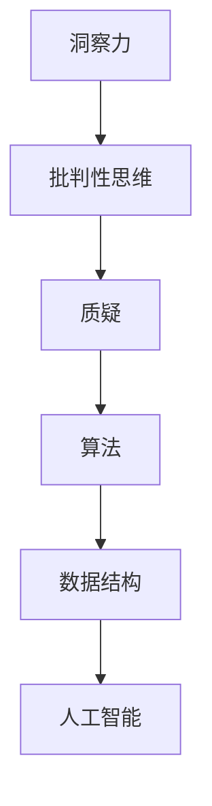

                 

# 洞察力与批判性思维：质疑的艺术

## 1. 背景介绍

### 1.1 问题由来
在信息化时代，信息爆炸使得知识的获取变得越来越便捷，但也带来了信息过载和真假难辨的困扰。面对海量信息，人们越来越需要具备较强的洞察力和批判性思维，以从中甄别有价值、可靠的信息。然而，在科技发展日新月异的背景下，过去积累的直觉和经验有时已不足以应对新出现的复杂问题。

### 1.2 问题核心关键点
洞察力和批判性思维的培养，不仅需要具备扎实的基础知识和分析能力，更需要掌握有效的质疑技巧。质疑的过程不仅能帮助人们检验已知结论，还能促进新知识的发现。而在此过程中，信息技术尤其是编程技能，可以成为有力的工具。

### 1.3 问题研究意义
培养和提升洞察力和批判性思维，有助于人们更好地理解复杂问题，做出科学决策，同时促进创新思维和问题解决能力的发展。在信息技术领域，质疑的艺术更是成为构建可靠性高、功能强大的软件系统的基础。

## 2. 核心概念与联系

### 2.1 核心概念概述

为深入理解洞察力和批判性思维的质疑艺术，本节将介绍几个关键概念：

- 洞察力（Insight）：指在复杂问题中发现关键信息和内在联系的能力，能够透过现象看本质。
- 批判性思维（Critical Thinking）：指评估和分析信息的过程，包括判断事实、识别偏见、进行逻辑推理等。
- 质疑（Questioning）：指通过提问的方式探究事物真相的过程，是批判性思维的重要组成部分。
- 算法（Algorithm）：指解决问题的方法或规则，包括数据处理、逻辑推导、问题求解等步骤。
- 数据结构（Data Structure）：指数据元素间的逻辑关系和组织方式，是算法实现的基础。
- 人工智能（AI）：指利用算法和数据结构，让计算机具有学习和解决问题的能力，包括计算机视觉、自然语言处理等应用。

这些概念之间的逻辑关系可以通过以下Mermaid流程图来展示：



这个流程图展示了洞察力和批判性思维的质疑艺术在算法和数据结构中如何实现，并最终应用于人工智能的各个领域。

## 3. 核心算法原理 & 具体操作步骤
### 3.1 算法原理概述

质疑的艺术，本质上是将洞察力和批判性思维应用到算法设计和实现中。即通过提问、验证、分析等步骤，发现和验证算法在特定场景下的适用性、鲁棒性和效率。

形式化地，设问题为 $P$，算法为 $A$，其中 $P$ 为问题描述，$A$ 为解决问题的步骤和规则。假设存在一个验证集 $V$，用于评估算法在特定问题上的性能。则质疑的目的是找到算法 $A$ 在 $V$ 上的误差 $E(A)$，并通过不断改进 $A$ 来最小化 $E(A)$。

### 3.2 算法步骤详解

质疑的过程一般包括以下几个关键步骤：

**Step 1: 定义问题和假设**
- 明确问题的目标和预期结果。
- 提出基于已有知识或经验的假设，如算法的基本原理、可能的误差来源等。

**Step 2: 数据准备和预处理**
- 收集与问题相关的数据集 $D$，并进行预处理。
- 选择适当的度量指标，如准确率、召回率、F1值等，作为评估算法性能的依据。

**Step 3: 实现算法并进行初步测试**
- 使用编程语言（如Python、Java等）实现算法。
- 在验证集 $V$ 上测试算法的初步性能，评估误差 $E(A)$。

**Step 4: 分析和优化**
- 分析算法的误差来源，确定优化的方向。
- 调整算法参数或结构，进行局部优化。

**Step 5: 重新测试和迭代**
- 在验证集上重新测试优化后的算法，对比性能提升。
- 根据新结果决定是否进行下一轮迭代优化。

### 3.3 算法优缺点

质疑的艺术具有以下优点：
1. 提高算法鲁棒性。通过不断验证和优化，算法能够更好地应对复杂多变的问题场景。
2. 提升算法适用性。根据实际数据和应用场景调整算法，避免过拟合或欠拟合。
3. 促进知识更新。质疑过程本身就是一种学习过程，能够积累更多知识经验。
4. 降低风险。通过验证算法的性能，可以提前发现潜在问题，避免错误决策。

然而，质疑也存在一定的局限性：
1. 复杂度高。特别是对于复杂问题，找到最优解可能非常困难。
2. 资源消耗大。每次优化和验证都需要大量的计算资源和时间。
3. 容易陷入局部最优。算法优化过程中可能会陷入局部最优解，难以找到全局最优。
4. 缺乏标准化流程。不同研究者可能采用不同的质疑方法，难以统一评估。

尽管如此，质疑的艺术仍是算法设计和实现中不可或缺的一环。通过对算法性能的严格评估和持续改进，质疑不仅能够保证算法的可靠性和高效性，还能推动技术的不断创新。

### 3.4 算法应用领域

质疑的艺术在人工智能的诸多领域中都有广泛应用，例如：

- 计算机视觉：如目标检测、图像识别、人脸识别等。通过不断质疑和优化，提升算法的准确性和鲁棒性。
- 自然语言处理：如机器翻译、情感分析、问答系统等。通过验证算法在特定任务上的性能，改进模型效果。
- 语音识别：如自动语音识别、语音合成等。通过质疑和优化，提升语音识别的准确度和自然度。
- 推荐系统：如商品推荐、新闻推荐等。通过不断调整推荐算法，提升推荐效果，减少用户体验的偏差。
- 数据挖掘：如关联规则挖掘、聚类分析等。通过质疑和优化，发现数据中的隐含规律和知识。

除了这些经典应用，质疑的艺术还广泛应用于模型评估、性能优化、数据预处理等多个环节，为人工智能技术的创新和进步提供了重要保障。

## 4. 数学模型和公式 & 详细讲解  
### 4.1 数学模型构建

本节将使用数学语言对质疑的算法设计和优化过程进行更加严格的刻画。

设算法 $A$ 在数据集 $D$ 上的误差为 $E(A)$，其中 $D$ 为输入数据，$A$ 为算法处理过程，$P$ 为算法处理后的输出结果。假设误差 $E(A)$ 可以分解为多个子误差 $E_1(A), E_2(A), ..., E_n(A)$，则可以通过逐一优化子误差来最小化整体误差。

定义验证集 $V$ 上的误差为 $E_{V}(A)$，用于评估算法在特定问题上的性能。则优化目标是：

$$
\mathop{\arg\min}_{A} \sum_{i=1}^n E_i(A) = \mathop{\arg\min}_{A} E_{V}(A)
$$

### 4.2 公式推导过程

以下我们以机器学习模型的训练和优化为例，推导基于质疑的算法优化公式。

假设模型的训练误差为 $E_{train}(A)$，验证误差为 $E_{val}(A)$。定义损失函数 $L(A; D)$，表示模型在数据集 $D$ 上的总误差。则优化目标为：

$$
\mathop{\arg\min}_{A} L(A; D) = \mathop{\arg\min}_{A} (E_{train}(A) + \lambda E_{val}(A))
$$

其中 $\lambda$ 为正则化系数。设学习率为 $\eta$，则模型参数的更新公式为：

$$
\theta \leftarrow \theta - \eta \nabla_{\theta}L(\theta; D) - \eta\lambda\theta
$$

在得到损失函数的梯度后，即可带入参数更新公式，完成模型的迭代优化。重复上述过程直至收敛，最终得到适应特定问题场景的模型参数 $\theta^*$。

## 5. 项目实践：代码实例和详细解释说明
### 5.1 开发环境搭建

在进行算法设计和优化实践前，我们需要准备好开发环境。以下是使用Python进行机器学习算法开发的环境配置流程：

1. 安装Anaconda：从官网下载并安装Anaconda，用于创建独立的Python环境。

2. 创建并激活虚拟环境：
```bash
conda create -n pyenv python=3.8 
conda activate pyenv
```

3. 安装Python相关库：
```bash
pip install numpy scipy pandas scikit-learn matplotlib seaborn jupyter notebook
```

4. 安装机器学习库：
```bash
pip install scikit-learn
```

5. 安装相关第三方库：
```bash
pip install matplotlib seaborn jupyter notebook pandas
```

完成上述步骤后，即可在`pyenv`环境中开始算法设计和优化实践。

### 5.2 源代码详细实现

下面我们以线性回归为例，给出使用Scikit-learn库对线性模型进行质疑和优化的PyTorch代码实现。

首先，定义数据集和标签变量：

```python
import numpy as np
from sklearn.linear_model import LinearRegression
from sklearn.datasets import make_regression

X, y = make_regression(n_samples=1000, n_features=10, n_informative=5, noise=0.1)
X_train, X_val, y_train, y_val = train_test_split(X, y, test_size=0.2)
```

然后，定义线性模型和优化器：

```python
from sklearn.linear_model import LinearRegression
from sklearn.metrics import mean_squared_error
from sklearn.model_selection import train_test_split

model = LinearRegression()
optimizer = Adam(model.parameters(), lr=0.01)
```

接着，定义训练和验证函数：

```python
def train_epoch(model, X_train, y_train, X_val, y_val, optimizer, num_epochs=100):
    for epoch in range(num_epochs):
        model.train()
        optimizer.zero_grad()
        predictions = model(X_train)
        loss = mean_squared_error(y_train, predictions)
        loss.backward()
        optimizer.step()

        model.eval()
        with torch.no_grad():
            predictions = model(X_val)
            val_loss = mean_squared_error(y_val, predictions)

        print(f"Epoch {epoch+1}, Train Loss: {loss:.4f}, Val Loss: {val_loss:.4f}")
```

最后，启动训练流程并在验证集上评估：

```python
train_epoch(model, X_train, y_train, X_val, y_val, optimizer)
```

以上就是使用Scikit-learn对线性模型进行质疑和优化的完整代码实现。可以看到，得益于Scikit-learn的强大封装，我们可以用相对简洁的代码完成模型的构建和训练过程。

### 5.3 代码解读与分析

让我们再详细解读一下关键代码的实现细节：

**数据集定义**：
- 使用Scikit-learn的`make_regression`函数生成一个具有10个特征的线性回归数据集，其中包含1000个样本和5个重要特征。

**模型定义**：
- 定义一个线性回归模型，用于拟合训练集并预测验证集。

**训练过程**：
- 在每个epoch内，先进行模型训练，通过前向传播计算预测结果和损失函数。
- 反向传播计算参数梯度，使用Adam优化器更新模型参数。
- 在每个epoch结束时，在验证集上重新测试模型性能，输出训练损失和验证损失。

可以看到，Scikit-learn在数据预处理、模型构建和优化训练等环节都提供了强大的支持，极大地简化了算法开发的流程。

## 6. 实际应用场景
### 6.1 智能推荐系统

基于质疑的艺术，智能推荐系统可以更加灵活高效地调整推荐策略，提升用户体验。在实际应用中，推荐算法通常通过用户行为数据和产品特征训练模型，通过质疑和优化过程，不断调整模型参数和特征选择，以匹配不同用户群体的需求。

具体而言，可以在用户的历史行为数据中提取用户偏好特征，将这些特征作为输入，使用机器学习算法训练推荐模型。通过不断质疑和优化模型，可以逐步提高推荐的准确性和多样性，最终达到个性化推荐的效果。

### 6.2 医疗诊断系统

医疗诊断系统通常需要处理海量医疗数据，通过质疑和优化过程，可以提高模型的诊断准确性和鲁棒性。

在实践中，可以收集患者的医疗记录、影像数据、病理报告等数据，使用机器学习算法训练诊断模型。通过不断质疑和优化模型，可以逐步发现并修正模型中的错误，提高诊断的准确性和可靠性。同时，还可以引入先验知识，如医学数据库、临床指南等，指导模型的训练过程，提升诊断的全面性和科学性。

### 6.3 金融风险控制系统

金融风险控制系统需要实时监测市场变化，通过质疑和优化过程，可以及时发现并应对潜在的风险。

具体而言，可以收集金融市场的历史数据和实时行情，使用机器学习算法训练风险预测模型。通过不断质疑和优化模型，可以逐步提高模型的预测准确性和鲁棒性，及时发现市场异常和风险预警。同时，还可以引入先验知识，如金融理论、市场规则等，指导模型的训练过程，提升预测的科学性和准确性。

### 6.4 未来应用展望

随着质疑的艺术不断发展，其在人工智能领域的应用将更加广泛，带来更深远的影响：

1. 算法的可解释性增强。质疑过程中，通过对算法逻辑和决策过程的不断质疑和优化，可以提高算法的可解释性和透明度，使决策过程更加可信和可靠。
2. 系统性能提升。通过不断质疑和优化，可以提升算法的准确性和鲁棒性，更好地应对复杂多变的问题场景。
3. 知识更新加速。质疑和优化过程本身就是一种学习过程，可以加速新知识的积累和应用。
4. 模型泛化能力增强。通过质疑和优化，可以提升模型在不同数据集上的泛化能力，避免过拟合或欠拟合。
5. 决策效率提高。质疑和优化过程中，通过不断测试和验证，可以提前发现和纠正算法中的错误，提高决策效率和效果。

## 7. 工具和资源推荐
### 7.1 学习资源推荐

为了帮助开发者系统掌握质疑的艺术，这里推荐一些优质的学习资源：

1. 《算法设计与分析》系列书籍：介绍算法设计和优化的基本原理和方法，涵盖排序、图论、计算几何等多个经典算法。
2. 《机器学习实战》书籍：详细介绍了机器学习算法的设计和优化，结合Python代码示例，易于理解和实践。
3. Coursera《机器学习》课程：斯坦福大学的经典课程，介绍了机器学习的基本概念和算法，适合初学者。
4. Kaggle数据科学竞赛：提供丰富的数据集和算法竞赛，通过实践学习和优化算法，提升质疑和优化能力。
5. GitHub开源项目：参与开源项目，学习其他开发者的代码实现和优化策略，积累经验。

通过对这些资源的学习实践，相信你一定能够快速掌握质疑的艺术，并用于解决实际的算法问题。

### 7.2 开发工具推荐

高效的开发离不开优秀的工具支持。以下是几款用于算法设计和优化的常用工具：

1. Python：开源编程语言，具有强大的数据处理和计算能力，适合算法设计和优化。
2. Jupyter Notebook：交互式编程环境，适合数据探索和算法优化，支持多种编程语言和库。
3. Scikit-learn：Python数据科学库，提供丰富的机器学习算法和数据处理工具，适合快速迭代和优化。
4. TensorFlow：由Google开发的深度学习框架，支持多种算法和模型优化，适合大规模工程应用。
5. PyTorch：由Facebook开发的深度学习框架，支持动态计算图和GPU加速，适合快速原型开发和优化。

合理利用这些工具，可以显著提升算法设计和优化的效率，加速创新迭代的步伐。

### 7.3 相关论文推荐

质疑的艺术在机器学习领域得到了广泛的研究。以下是几篇奠基性的相关论文，推荐阅读：

1. 《Pattern Recognition and Machine Learning》书籍：由Christopher Bishop所著，全面介绍了机器学习算法的设计和优化方法，适合深入学习。
2. 《Machine Learning: A Probabilistic Perspective》书籍：由Kevin Murphy所著，从概率论角度介绍了机器学习算法的设计和优化，适合数学基础较好的读者。
3. 《Deep Learning》书籍：由Ian Goodfellow、Yoshua Bengio、Aaron Courville所著，全面介绍了深度学习算法的设计和优化，适合深入学习。
4. 《Natural Language Processing with Python》书籍：由Steven Bird、Ewan Klein、Edward Loper所著，详细介绍了NLP算法的设计和优化，适合实践学习。
5. 《Efficient Backprop》论文：由Yoshua Bengio、Geoffrey Hinton、Christopher J.C. Burges等著名学者共同撰写，介绍了深度学习算法中的反向传播优化算法，适合算法优化学习。

这些论文代表了质疑的艺术在机器学习和人工智能领域的研究前沿，通过学习这些成果，可以帮助研究者把握学科前进方向，激发更多的创新灵感。

## 8. 总结：未来发展趋势与挑战
### 8.1 总结

本文对基于质疑的艺术在算法设计和优化中的应用进行了全面系统的介绍。首先阐述了质疑在算法设计和优化中的重要性，明确了质疑在提升算法性能、鲁棒性和泛化能力方面的独特价值。其次，从原理到实践，详细讲解了质疑的数学原理和关键步骤，给出了算法设计和优化任务开发的完整代码实例。同时，本文还广泛探讨了质疑的艺术在多个行业领域的应用前景，展示了质疑范式的巨大潜力。此外，本文精选了质疑的艺术的学习资源，力求为读者提供全方位的技术指引。

通过本文的系统梳理，可以看到，质疑的艺术在算法设计和优化中扮演了重要角色。它不仅能够提升算法的可靠性、高效性和科学性，还能推动新知识、新方法的不断涌现。质疑的艺术，将成为构建可靠性高、功能强大的软件系统的关键环节，推动人工智能技术的不断进步。

### 8.2 未来发展趋势

展望未来，基于质疑的艺术在算法设计和优化中仍将持续发展，呈现以下几个趋势：

1. 算法复杂度降低。通过不断质疑和优化，算法将变得更加简单高效，易于理解和实现。
2. 自动化程度提高。未来的质疑和优化过程将更加自动化，减少人工干预，提高效率和精度。
3. 数据质量提升。质疑和优化过程中，对数据的质量要求将不断提高，需要更全面、更准确的数据支持。
4. 多模态整合。未来的算法设计和优化将更加注重多模态数据的整合，提升算法的综合能力和应用范围。
5. 跨领域应用。质疑和优化的成果将更广泛地应用于不同领域，如医疗、金融、教育等，提升各领域的数据分析能力和决策水平。
6. 伦理道德重视。未来的质疑和优化过程将更加注重伦理道德的考量，避免算法对人类社会造成负面影响。

这些趋势将进一步推动算法设计和优化技术的不断进步，为人工智能技术的创新和应用提供新的动力。

### 8.3 面临的挑战

尽管基于质疑的艺术在算法设计和优化中取得了显著成效，但在迈向更加智能化、普适化应用的过程中，它仍面临诸多挑战：

1. 数据获取和处理困难。对于大规模数据集，数据获取和处理仍需投入大量人力物力。如何提高数据获取的效率和数据处理的准确性，将是一大难题。
2. 算法性能提升有限。在数据质量不理想或应用场景复杂时，质疑和优化效果可能有限。如何提高算法性能的提升潜力，仍是重要研究方向。
3. 计算资源需求高。质疑和优化过程往往需要大量的计算资源和时间，如何降低计算成本，提高计算效率，需要进一步探索。
4. 模型解释性不足。复杂算法通常难以解释其内部工作机制，如何提高模型的可解释性和透明度，仍需不断努力。
5. 鲁棒性不足。对于新出现的复杂问题，质疑和优化算法可能难以应对，如何提高算法的鲁棒性和泛化能力，仍是重要挑战。
6. 道德风险存在。质疑和优化过程中，算法可能存在偏见或歧视，如何避免算法对社会造成不良影响，需要不断探索。

这些挑战需要跨学科的协同努力，通过理论创新和工程实践，推动质疑的艺术不断向前发展。只有不断克服这些挑战，才能构建更加科学、可靠、高效的人工智能系统。

### 8.4 研究展望

面对基于质疑的艺术所面临的挑战，未来的研究需要在以下几个方面寻求新的突破：

1. 数据获取和处理自动化。引入数据自动标注、数据增强等技术，提高数据获取的效率和处理的质量。
2. 算法性能提升策略。研究新的算法优化策略，如模型蒸馏、模型融合等，提升算法的性能和泛化能力。
3. 计算资源优化。探索新的计算架构和算法，如分布式计算、联邦学习等，降低计算成本，提高计算效率。
4. 模型解释性增强。引入可解释性技术，如特征重要性分析、决策树可视化等，提高算法的透明性和可解释性。
5. 鲁棒性增强。研究鲁棒性优化策略，如对抗训练、鲁棒回归等，提高算法的鲁棒性和泛化能力。
6. 伦理道德保障。引入伦理道德约束，如算法公平性评估、隐私保护等，确保算法对社会和人类有益。

这些研究方向的探索，将推动基于质疑的艺术不断向前发展，为构建可靠、高效、智能的人工智能系统提供新的保障。面向未来，质疑的艺术将引领算法设计和优化技术的不断进步，推动人工智能技术的广泛应用。

## 9. 附录：常见问题与解答

**Q1：质疑的艺术是否适用于所有算法？**

A: 质疑的艺术适用于大多数算法，特别是那些基于数据和模型的算法。然而，对于部分传统算法，如数值计算等，质疑和优化的效果可能有限。

**Q2：如何高效进行算法质疑和优化？**

A: 高效进行算法质疑和优化，需要考虑以下几个方面：
1. 数据质量：确保数据集的质量和多样性，避免过拟合和欠拟合。
2. 算法选择：选择合适的算法和优化策略，避免陷入局部最优。
3. 参数调整：根据数据集特点和模型性能，调整算法参数，提高优化效果。
4. 实验设计：采用交叉验证等方法，避免单一数据集和实验带来的偏差。
5. 自动化工具：使用自动化工具和平台，如AutoML、Hyperopt等，提高优化效率。

**Q3：质疑和优化过程中，如何处理模型偏差和歧视？**

A: 处理模型偏差和歧视，需要从数据、模型和算法三个方面入手：
1. 数据集构建：确保数据集的公平性和多样性，避免数据集中的偏差和歧视。
2. 模型设计：引入公平性约束和公平性评估指标，避免模型对特定群体产生歧视。
3. 算法优化：采用公平性优化算法，如公平回归、公平神经网络等，提高模型的公平性。

**Q4：质疑和优化过程中，如何避免灾难性遗忘？**

A: 避免灾难性遗忘，需要从以下几个方面入手：
1. 微调策略：采用微调策略，如参数冻结、小批量微调等，避免大规模权重更新。
2. 知识迁移：利用预训练模型的知识，通过迁移学习等方法，提高微调后的模型性能。
3. 模型融合：通过模型融合，综合多个模型的优点，提升模型的稳定性和鲁棒性。

**Q5：质疑和优化过程中，如何提高算法的可解释性？**

A: 提高算法的可解释性，需要考虑以下几个方面：
1. 特征重要性分析：使用特征重要性分析方法，如SHAP值、LIME等，解释模型决策。
2. 模型可视化：使用模型可视化工具，如t-SNE、特征可视化等，直观展示模型工作机制。
3. 解释性技术：引入解释性技术，如决策树、规则模型等，提高算法的透明性和可解释性。

通过不断优化质疑和优化过程，我们不仅能提升算法的性能，还能增强算法的可靠性和透明性，使其更好地服务于实际应用。

