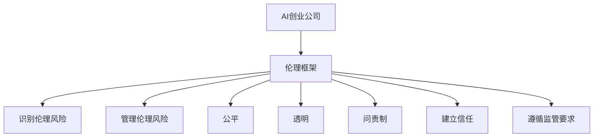

                 

**人工智能伦理、AI创业公司、伦理框架、数据隐私、偏见、透明度、问责制、监管**

## 1. 背景介绍

随着人工智能（AI）技术的飞速发展，AI创业公司如雨后春笋般涌现，为各行各业带来了颠覆性的变化。然而，AI的广泛应用也引发了各种伦理挑战，如数据隐私、偏见、透明度和问责制等。本文将探讨AI创业公司如何建立有效的人工智能伦理框架，以负责任地开发和部署AI技术。

## 2. 核心概念与联系

### 2.1 人工智能伦理的定义

人工智能伦理是指指导AI开发和部署的道德准则和原则，旨在确保AI技术的负责任使用，并最大限度地减少其对人类和环境的负面影响。

### 2.2 伦理框架的作用

伦理框架为AI创业公司提供了指南，帮助他们识别和管理伦理风险，确保AI系统的公平、透明和问责制。它还有助于建立信任，提高AI系统的可接受性，并遵循监管要求。



## 3. 核心算法原理 & 具体操作步骤

### 3.1 伦理风险评估算法原理

伦理风险评估算法旨在识别AI系统中的伦理风险。它基于预定义的伦理准则，分析AI系统的输入、输出和环境，并评估其潜在的伦理影响。

### 3.2 伦理风险评估步骤

1. 定义伦理准则：确定AI系统应该遵循的道德准则和原则。
2. 分析输入：评估AI系统的输入数据，识别潜在的偏见和不平等。
3. 分析输出：评估AI系统的输出结果，识别任何不公平或不合理的行为。
4. 分析环境：评估AI系统的运行环境，识别潜在的伦理风险，如数据隐私和安全问题。
5. 评估影响：根据伦理准则，评估AI系统的潜在伦理影响，并确定其严重程度。

### 3.3 伦理风险评估优缺点

优点：

* 有助于识别和管理伦理风险
* 提高AI系统的可接受性
* 遵循监管要求

缺点：

* 可能需要大量的人力和时间
* 可能无法识别所有伦理风险
* 伦理准则的选择可能会受到主观因素的影响

### 3.4 伦理风险评估应用领域

伦理风险评估适用于所有AI创业公司， particularly those developing AI systems that may have significant ethical implications, such as autonomous vehicles, facial recognition, and AI-driven decision-making systems.

## 4. 数学模型和公式 & 详细讲解 & 举例说明

### 4.1 数学模型构建

数学模型用于量化AI系统的伦理风险。一个简单的数学模型可以表示为：

$$R = f(I, O, E, P)$$

其中：

* $R$ 是伦理风险的严重程度
* $I$ 是AI系统的输入数据
* $O$ 是AI系统的输出结果
* $E$ 是AI系统的运行环境
* $P$ 是伦理准则的权重

### 4.2 公式推导过程

推导过程如下：

1. 为每个因素（$I$, $O$, $E$, $P$)定义一个权重，$w_I$, $w_O$, $w_E$, $w_P$。
2. 为每个因素定义一个评分函数，$S_I(I)$, $S_O(O)$, $S_E(E)$, $S_P(P)$。
3. 计算每个因素的贡献，$C_I = w_I \cdot S_I(I)$, $C_O = w_O \cdot S_O(O)$, $C_E = w_E \cdot S_E(E)$, $C_P = w_P \cdot S_P(P)$。
4. 计算伦理风险的严重程度，$R = C_I + C_O + C_E + C_P$.

### 4.3 案例分析与讲解

假设一家AI创业公司正在开发一个基于面部识别的安保系统。伦理风险评估模型可以如下设置：

* $I$：面部图像数据集
* $O$：识别结果
* $E$：系统部署环境（如公共场所还是私人场所）
* $P$：伦理准则（如公平性、隐私保护、问责制）

权重可以设置为：

* $w_I = 0.4$
* $w_O = 0.3$
* $w_E = 0.2$
* $w_P = 0.1$

评分函数可以根据数据集的质量、识别准确性、环境的敏感性和伦理准则的满足情况进行定义。通过计算每个因素的贡献并将其加权求和，可以得出伦理风险的严重程度。

## 5. 项目实践：代码实例和详细解释说明

### 5.1 开发环境搭建

为伦理风险评估算法开发环境，需要安装Python、NumPy、Pandas和Scikit-learn等库。

### 5.2 源代码详细实现

以下是伦理风险评估算法的伪代码：

```python
def ethical_risk_analysis(I, O, E, P, w_I, w_O, w_E, w_P):
    # Define scoring functions
    S_I = score_input_data(I)
    S_O = score_output_result(O)
    S_E = score_environment(E)
    S_P = score_ethical_standards(P)

    # Calculate contributions
    C_I = w_I * S_I
    C_O = w_O * S_O
    C_E = w_E * S_E
    C_P = w_P * S_P

    # Calculate ethical risk
    R = C_I + C_O + C_E + C_P

    return R
```

### 5.3 代码解读与分析

该算法接受输入数据、输出结果、环境和伦理准则作为输入，并返回伦理风险的严重程度。它首先定义评分函数，然后计算每个因素的贡献，最后计算伦理风险的严重程度。

### 5.4 运行结果展示

运行算法后，可以得到伦理风险的严重程度分数。根据分数，AI创业公司可以采取相应的措施来管理伦理风险。

## 6. 实际应用场景

### 6.1 当前应用

伦理风险评估算法目前已被一些AI创业公司采用，用于识别和管理AI系统中的伦理风险。例如，IBM的AI伦理工具包就包括伦理风险评估工具。

### 6.2 未来应用展望

随着AI技术的不断发展，伦理风险评估算法的应用将变得越来越重要。未来，它可能会被集成到AI开发平台中，作为AI系统开发的标准流程之一。

## 7. 工具和资源推荐

### 7.1 学习资源推荐

* "Artificial Intelligence: A Guide for Thinking Humans" by Melanie Mitchell
* "Superintelligence: Paths, Dangers, Strategies" by Nick Bostrom
* "Life 3.0: Being Human in the Age of Artificial Intelligence" by Max Tegmark

### 7.2 开发工具推荐

* IBM AI Ethics Toolkit
* Google AI Principles
* Microsoft AI Principles

### 7.3 相关论文推荐

* "Ethical Challenges in Artificial Intelligence" by Stuart Armstrong and Roman V. Yampolskiy
* "The Ethics of Autonomous Vehicles" by Patrick Lin, Ryan Calo, and A. Michael Froomkin
* "Ethics Guidelines for Trustworthy AI" by European Commission

## 8. 总结：未来发展趋势与挑战

### 8.1 研究成果总结

本文介绍了AI创业公司如何建立人工智能伦理框架，并详细讨论了伦理风险评估算法的原理、步骤、优缺点和应用领域。此外，还提供了数学模型、代码实例和实际应用场景。

### 8.2 未来发展趋势

未来，AI伦理将成为AI创业公司的核心竞争力之一。伦理风险评估算法将变得越来越重要，并被集成到AI开发平台中。

### 8.3 面临的挑战

AI伦理面临的挑战包括伦理准则的选择、伦理风险的识别和管理、透明度和问责制等。

### 8.4 研究展望

未来的研究将关注伦理风险评估算法的改进、伦理准则的自动化选择、AI伦理的国际标准化等。

## 9. 附录：常见问题与解答

**Q1：伦理风险评估算法是否能够识别所有伦理风险？**

**A1：不能。伦理风险评估算法旨在识别和管理AI系统中的伦理风险，但它可能无法识别所有伦理风险。人类判断和专业意见仍然至关重要。**

**Q2：伦理风险评估算法是否需要大量的人力和时间？**

**A2：是的，伦理风险评估算法可能需要大量的人力和时间， particularly when defining ethical standards and scoring functions. However, the process can be streamlined with the use of automated tools and machine learning techniques.**

**Q3：伦理风险评估算法是否适用于所有AI创业公司？**

**A3：是的，伦理风险评估算法适用于所有AI创业公司， particularly those developing AI systems that may have significant ethical implications.**

## 作者：禅与计算机程序设计艺术 / Zen and the Art of Computer Programming

