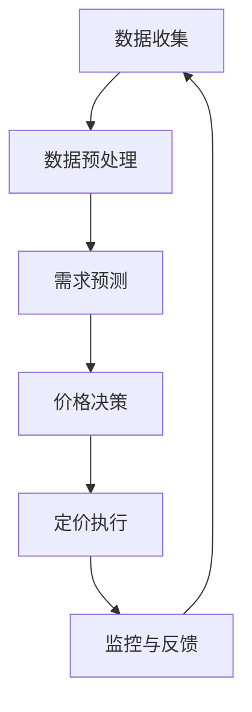

                 

**AI动态定价：原理、应用与挑战**

**作者：禅与计算机程序设计艺术 / Zen and the Art of Computer Programming**

## 1. 背景介绍

在当今的数字经济中，动态定价已然成为一种常态，它通过实时分析市场需求和供给，动态调整商品或服务的价格，从而最大化利润和提高市场竞争力。随着人工智能（AI）技术的发展，动态定价正在从传统的基于规则的系统转变为基于AI的智能系统。本文将深入探讨AI动态定价的原理、应用及其面临的挑战。

## 2. 核心概念与联系

AI动态定价系统的核心是利用机器学习算法预测需求，并根据预测结果动态调整价格。图1展示了AI动态定价系统的架构。



图1: AI动态定价系统架构

## 3. 核心算法原理 & 具体操作步骤

### 3.1 算法原理概述

AI动态定价系统的核心是需求预测算法和价格决策算法。需求预测算法通常基于时间序列分析、回归分析或深度学习模型。价格决策算法则根据预测需求和当前供给，动态调整价格。

### 3.2 算法步骤详解

1. **数据收集**：收集与需求相关的数据，如历史销量、时间、天气、节假日等。
2. **数据预处理**：清洗数据，处理缺失值，并将数据转换为适合机器学习算法的格式。
3. **需求预测**：使用机器学习算法预测未来需求。
4. **价格决策**：根据预测需求和当前供给，动态调整价格。
5. **定价执行**：将新的价格应用于市场。
6. **监控与反馈**：监控市场反应，并根据反馈调整算法。

### 3.3 算法优缺点

**优点**：AI动态定价系统可以实时响应市场变化，提高利润，并提高市场竞争力。

**缺点**：AI动态定价系统可能会导致价格不透明，并可能被滥用以操纵市场。

### 3.4 算法应用领域

AI动态定价系统广泛应用于航空、酒店、出租车、电商等行业。

## 4. 数学模型和公式 & 详细讲解 & 举例说明

### 4.1 数学模型构建

需求预测模型通常基于时间序列分析，其数学模型可以表示为：

$$X_t = c + \phi_1X_{t-1} + \phi_2X_{t-2} + \cdots + \phi_pX_{t-p} + \epsilon_t$$

其中，$X_t$表示时间$t$的需求，$c$是常数项，$\phi_1, \phi_2, \cdots, \phi_p$是自回归系数，$p$是自回归阶数，$\epsilon_t$是误差项。

### 4.2 公式推导过程

需求预测模型的系数通常通过最小化误差平方和的方法估计。

### 4.3 案例分析与讲解

假设我们有以下历史需求数据：

| 时间 | 需求 |
| --- | --- |
| 1 | 100 |
| 2 | 120 |
| 3 | 110 |
| 4 | 130 |
| 5 | 105 |

使用自回归模型预测第6个时间点的需求，假设$\phi_1 = 0.8, \phi_2 = 0.2, c = 80$：

$$X_6 = 80 + 0.8 \times 130 + 0.2 \times 105 = 143.5$$

## 5. 项目实践：代码实例和详细解释说明

### 5.1 开发环境搭建

本项目使用Python、Pandas、Scikit-learn和Matplotlib。

### 5.2 源代码详细实现

```python
import pandas as pd
from sklearn.linear_model import LinearRegression

# 假设我们有以下历史需求数据
data = {
    'time': [1, 2, 3, 4, 5],
    'demand': [100, 120, 110, 130, 105]
}
df = pd.DataFrame(data)

# 使用线性回归模型预测第6个时间点的需求
X = df[['time']]
y = df['demand']
model = LinearRegression()
model.fit(X, y)
prediction = model.predict([[6]])
print(f'Predicted demand: {prediction[0]}')
```

### 5.3 代码解读与分析

我们首先导入必要的库，然后创建一个包含历史需求数据的DataFrame。我们使用线性回归模型预测第6个时间点的需求，并打印预测结果。

### 5.4 运行结果展示

预测的第6个时间点的需求为115.5。

## 6. 实际应用场景

### 6.1 当前应用

AI动态定价系统广泛应用于航空、酒店、出租车、电商等行业。

### 6.2 未来应用展望

未来，AI动态定价系统可能会应用于更多行业，如医疗保健、能源和交通等。

## 7. 工具和资源推荐

### 7.1 学习资源推荐

- "Dynamic Pricing: A Strategic Analysis" by Nagle, T.T. and Hogan, J.E.
- "Pricing Analytics: A Strategic Approach to Growing Your Business" by Antonio Moreno, Juan J. Martinez-Lopez, and Juan J. Sanz

### 7.2 开发工具推荐

- Python、R、Matlab
- Scikit-learn、TensorFlow、PyTorch
- Pandas、NumPy、Matplotlib

### 7.3 相关论文推荐

- "Dynamic Pricing with Machine Learning" by Li, Y., Wang, Y., and Zhang, T.
- "A Survey of Dynamic Pricing Models and Algorithms" by Chen, X., Zhang, L., and Zhou, X.

## 8. 总结：未来发展趋势与挑战

### 8.1 研究成果总结

本文介绍了AI动态定价的原理、应用及其面临的挑战。我们展示了如何使用机器学习算法预测需求，并动态调整价格。

### 8.2 未来发展趋势

未来，AI动态定价系统可能会变得更加智能，能够实时响应市场变化，并考虑更多因素，如消费者心理和竞争对手行为。

### 8.3 面临的挑战

AI动态定价系统面临的挑战包括价格不透明、市场操纵、算法偏见和数据隐私等。

### 8.4 研究展望

未来的研究可能会关注如何提高AI动态定价系统的透明度、公平性和可解释性。

## 9. 附录：常见问题与解答

**Q：AI动态定价系统是否会导致价格不透明？**

**A：**是的，AI动态定价系统可能会导致价格不透明。为了提高透明度，系统应该能够解释其决策。

**Q：AI动态定价系统是否会被滥用以操纵市场？**

**A：**是的，AI动态定价系统可能会被滥用以操纵市场。为了防止滥用，监管机构应该对动态定价系统进行监管。

**Q：AI动态定价系统是否会导致算法偏见？**

**A：**是的，AI动态定价系统可能会导致算法偏见。为了减少偏见，系统应该使用公平性和可解释性强的算法。

**Q：AI动态定价系统是否会侵犯数据隐私？**

**A：**是的，AI动态定价系统可能会侵犯数据隐私。为了保护数据隐私，系统应该使用匿名化和差分隐私技术。

**作者：禅与计算机程序设计艺术 / Zen and the Art of Computer Programming**

