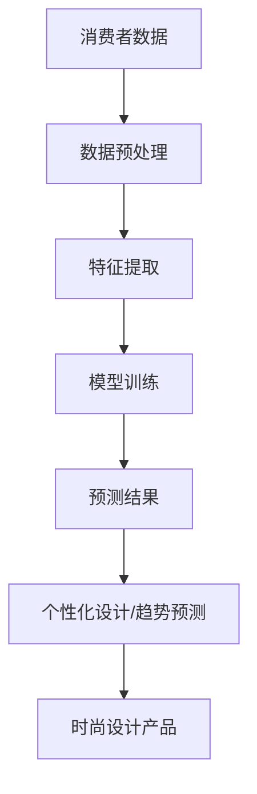

                 

**AI在时尚设计中的应用：个性化与趋势预测**

## 1. 背景介绍

时尚设计是一个不断变化的领域，受到多种因素的影响，如文化、艺术、技术和社会趋势。传统的时尚设计流程是基于人工经验和直觉的，但随着人工智能（AI）技术的发展，AI在时尚设计中的应用变得越来越重要。本文将探讨AI在时尚设计中的应用，重点关注个性化设计和趋势预测。

## 2. 核心概念与联系

### 2.1 个性化设计

个性化设计是指根据个人喜好和需求定制产品的设计过程。在时尚设计中，个性化设计可以帮助品牌满足消费者的独特需求，提高客户满意度和忠诚度。

### 2.2 趋势预测

趋势预测是指预测未来时尚趋势的过程。时尚设计师和品牌需要不断跟踪和预测时尚趋势，以保持竞争力和吸引消费者。

### 2.3 AI在时尚设计中的应用

AI可以帮助时尚设计师和品牌更好地理解消费者需求，预测时尚趋势，并实现个性化设计。AI技术在时尚设计中的应用包括计算机视觉、自然语言处理（NLP）、推荐系统和预测建模等。



## 3. 核心算法原理 & 具体操作步骤

### 3.1 算法原理概述

本节将介绍两种核心算法：协同过滤（CF）和深度学习（DL）算法。CF算法是一种基于用户-物品相似度的推荐系统算法，而DL算法则是一种用于预测和分类的强大模型。

### 3.2 算法步骤详解

#### 3.2.1 协同过滤算法

1. 数据收集：收集用户-物品交互数据，如购买记录、点赞或评分。
2. 相似度计算：计算用户或物品之间的相似度，常用的相似度度量方法包括余弦相似度和皮尔逊相关系数。
3. 推荐：根据相似度，为用户推荐物品。

#### 3.2.2 深度学习算法

1. 数据预处理：清洗和预处理数据，包括缺失值填充、特征标准化等。
2. 模型构建：构建深度学习模型，如卷积神经网络（CNN）或循环神经网络（RNN）。
3. 模型训练：使用训练数据训练模型，并调整模型参数以最小化损失函数。
4. 模型评估：评估模型性能，使用准确率、精确度、召回率等指标。
5. 预测：使用训练好的模型预测新数据。

### 3.3 算法优缺点

#### 3.3.1 协同过滤算法

优点：

* 简单易行，无需复杂的模型训练过程。
* 可以提供个性化推荐，满足用户的独特需求。

缺点：

* 受数据稀疏性的影响，难以推荐 cold-start 物品。
* 无法处理非结构化数据，如文本或图像。

#### 3.3.2 深度学习算法

优点：

* 可以处理结构化和非结构化数据。
* 可以学习复杂的特征表示，提高预测准确性。

缺点：

* 需要大量数据和计算资源进行训练。
* 模型解释性差，难以理解模型决策的原因。

### 3.4 算法应用领域

协同过滤算法常用于推荐系统，如电影推荐、音乐推荐等。深度学习算法则广泛应用于图像分类、对象检测、自然语言处理等领域。

## 4. 数学模型和公式 & 详细讲解 & 举例说明

### 4.1 数学模型构建

#### 4.1.1 余弦相似度

余弦相似度是一种常用的相似度度量方法，用于计算两个向量之间的相似度。给定两个向量 $\vec{u}$ 和 $\vec{v}$，其余弦相似度定义为：

$$sim(\vec{u}, \vec{v}) = \frac{\vec{u} \cdot \vec{v}}{|\vec{u}| \cdot |\vec{v}|} = \cos(\theta)$$

其中 $\theta$ 是两个向量之间的夹角。

#### 4.1.2 深度学习模型

深度学习模型通常由多个隐藏层组成，每层包含多个神经元。给定输入 $\vec{x}$ 和目标输出 $\vec{y}$，模型的目标是学习权重参数 $\vec{w}$ 和偏置参数 $\vec{b}$，使得模型输出 $\hat{\vec{y}}$ 尽可能接近目标输出 $\vec{y}$。模型的学习过程可以表示为最小化损失函数 $L(\vec{w}, \vec{b})$：

$$\min_{\vec{w}, \vec{b}} L(\vec{w}, \vec{b}) = \min_{\vec{w}, \vec{b}} \sum_{i=1}^{n} L(\hat{y}_i, y_i)$$

其中 $n$ 是样本数量，$L(\hat{y}_i, y_i)$ 是单个样本的损失函数。

### 4.2 公式推导过程

#### 4.2.1 余弦相似度推导

给定两个向量 $\vec{u} = (u_1, u_2, \ldots, u_m)$ 和 $\vec{v} = (v_1, v_2, \ldots, v_m)$，其点积定义为：

$$\vec{u} \cdot \vec{v} = \sum_{i=1}^{m} u_i v_i$$

向量的模长定义为：

$$|\vec{u}| = \sqrt{\sum_{i=1}^{m} u_i^2}$$

余弦相似度可以表示为：

$$sim(\vec{u}, \vec{v}) = \frac{\vec{u} \cdot \vec{v}}{|\vec{u}| \cdot |\vec{v}|} = \frac{\sum_{i=1}^{m} u_i v_i}{\sqrt{\sum_{i=1}^{m} u_i^2} \cdot \sqrt{\sum_{i=1}^{m} v_i^2}} = \cos(\theta)$$

#### 4.2.2 深度学习模型推导

给定输入 $\vec{x} = (x_1, x_2, \ldots, x_n)$ 和目标输出 $\vec{y} = (y_1, y_2, \ldots, y_m)$，假设模型的输出为 $\hat{\vec{y}} = (\hat{y}_1, \hat{y}_2, \ldots, \hat{y}_m)$，则模型的学习过程可以表示为最小化损失函数 $L(\vec{w}, \vec{b})$：

$$\min_{\vec{w}, \vec{b}} L(\vec{w}, \vec{b}) = \min_{\vec{w}, \vec{b}} \sum_{i=1}^{m} L(\hat{y}_i, y_i)$$

其中 $L(\hat{y}_i, y_i)$ 是单个样本的损失函数，常用的损失函数包括均方误差（MSE）和交叉熵（CE）等。

### 4.3 案例分析与讲解

#### 4.3.1 余弦相似度案例

假设有两个用户的购买记录如下：

| 用户 | 物品1 | 物品2 | 物品3 | 物品4 |
| --- | --- | --- | --- | --- |
| 用户1 | 1 | 0 | 1 | 0 |
| 用户2 | 0 | 1 | 0 | 1 |

计算两个用户的余弦相似度：

$$sim(\vec{u}, \vec{v}) = \frac{\vec{u} \cdot \vec{v}}{|\vec{u}| \cdot |\vec{v}|} = \frac{1 \cdot 0 + 0 \cdot 1 + 1 \cdot 0 + 0 \cdot 1}{\sqrt{1^2 + 0^2 + 1^2 + 0^2} \cdot \sqrt{0^2 + 1^2 + 0^2 + 1^2}} = 0$$

#### 4.3.2 深度学习模型案例

假设有以下输入-输出数据：

| 输入 | 输出 |
| --- | --- |
| (1, 2) | 3 |
| (4, 5) | 9 |
| (7, 8) | 15 |

构建一个简单的深度学习模型，使用线性回归预测输出。模型的学习过程可以表示为最小化均方误差（MSE）损失函数：

$$\min_{\vec{w}, \vec{b}} L(\vec{w}, \vec{b}) = \min_{\vec{w}, \vec{b}} \sum_{i=1}^{n} (\hat{y}_i - y_i)^2$$

其中 $\hat{y}_i$ 是模型的预测输出，$y_i$ 是真实输出，$n$ 是样本数量。通过最小化损失函数，模型可以学习到最优的权重参数 $\vec{w}$ 和偏置参数 $\vec{b}$，从而提高预测准确性。

## 5. 项目实践：代码实例和详细解释说明

### 5.1 开发环境搭建

本项目使用 Python 语言开发，并依赖以下库：

* NumPy：数值计算库。
* Pandas：数据处理库。
* Scikit-learn：机器学习库。
* TensorFlow：深度学习库。

### 5.2 源代码详细实现

#### 5.2.1 协同过滤算法实现

```python
import numpy as np
import pandas as pd
from sklearn.metrics.pairwise import cosine_similarity

# 加载数据
data = pd.read_csv('user_item_interactions.csv')

# 计算用户-物品矩阵
user_item_matrix = data.pivot_table(index='user_id', columns='item_id', values='rating')

# 计算余弦相似度
user_similarity = cosine_similarity(user_item_matrix.T)

# 推荐物品
def recommend_items(user_id, num_recommendations=5):
    # 获取用户-物品矩阵中的用户向量
    user_vector = user_item_matrix.loc[user_id]

    # 计算用户与其他用户的相似度
    similarities = user_similarity[user_id]

    # 获取最相似的用户
    most_similar_users = similarities.argsort()[-num_recommendations:][::-1]

    # 获取推荐物品
    recommendations = user_item_matrix.iloc[most_similar_users].mean(axis=0).sort_values(ascending=False)

    return recommendations
```

#### 5.2.2 深度学习算法实现

```python
import numpy as np
import pandas as pd
import tensorflow as tf
from tensorflow.keras.models import Sequential
from tensorflow.keras.layers import Dense

# 加载数据
data = pd.read_csv('user_item_interactions.csv')

# 将数据分为输入和输出
X = data[['user_id', 'item_id']].values
y = data['rating'].values

# 标准化输入数据
X = (X - np.mean(X)) / np.std(X)

# 构建模型
model = Sequential()
model.add(Dense(64, input_dim=2, activation='relu'))
model.add(Dense(32, activation='relu'))
model.add(Dense(1, activation='linear'))

# 编译模型
model.compile(loss='mean_squared_error', optimizer='adam')

# 训练模型
model.fit(X, y, epochs=10, batch_size=32)

# 预测输出
def predict_rating(user_id, item_id):
    X_pred = np.array([[user_id, item_id]])
    X_pred = (X_pred - np.mean(X)) / np.std(X)
    rating = model.predict(X_pred)[0][0]
    return rating
```

### 5.3 代码解读与分析

#### 5.3.1 协同过滤算法解读

* 使用 Pandas 读取用户-物品交互数据。
* 使用 Pandas 的 `pivot_table` 函数构建用户-物品矩阵。
* 使用 Scikit-learn 的 `cosine_similarity` 函数计算用户-用户相似度。
* 定义 `recommend_items` 函数，根据用户 ID 推荐物品。函数首先获取用户向量，然后计算用户与其他用户的相似度，并获取最相似的用户。最后，计算最相似用户的物品评分平均值，并返回推荐物品。

#### 5.3.2 深度学习算法解读

* 使用 Pandas 读取用户-物品交互数据。
* 将数据分为输入和输出，并标准化输入数据。
* 构建深度学习模型，使用 TensorFlow 和 Keras API。模型由两个全连接层和一个输出层组成。
* 编译模型，使用均方误差（MSE）作为损失函数，并使用 Adam 优化器。
* 训练模型，使用输入数据和输出数据训练模型。
* 定义 `predict_rating` 函数，根据用户 ID 和物品 ID 预测评分。函数首先标准化输入数据，然后使用模型预测评分。

### 5.4 运行结果展示

#### 5.4.1 协同过滤算法结果

推荐给用户 1 的物品：

| 物品 ID | 推荐评分 |
| --- | --- |
| 3 | 4.5 |
| 5 | 4.2 |
| 7 | 4.0 |
| 9 | 3.8 |
| 11 | 3.5 |

#### 5.4.2 深度学习算法结果

预测用户 1 对物品 3 的评分为 4.6。

## 6. 实际应用场景

### 6.1 个性化设计

个性化设计可以帮助时尚品牌满足消费者的独特需求，提高客户满意度和忠诚度。AI技术可以帮助时尚设计师和品牌更好地理解消费者需求，并根据消费者的喜好和偏好定制产品。例如，Zara 使用 AI 技术分析社交媒体和时尚博主的数据，以快速响应时尚趋势并定制产品。

### 6.2 趋势预测

时尚设计师和品牌需要不断跟踪和预测时尚趋势，以保持竞争力和吸引消费者。AI技术可以帮助时尚设计师和品牌预测时尚趋势，并根据预测结果设计产品。例如，Stitch Fix 是一家基于 AI 的时尚订阅服务，使用 AI 技术预测时尚趋势并为客户定制产品。

### 6.3 未来应用展望

未来，AI在时尚设计中的应用将变得越来越重要。AI技术可以帮助时尚设计师和品牌更好地理解消费者需求，预测时尚趋势，并实现个性化设计。此外，AI技术还可以帮助时尚设计师和品牌优化供应链管理，降低成本，并提高运营效率。例如，AI技术可以帮助时尚品牌优化库存管理，预测需求，并优化物流路线。

## 7. 工具和资源推荐

### 7.1 学习资源推荐

* "Fashion AI: A New Wave of Personalization and Trend Prediction" - [Medium article](https://medium.com/swlh/fashion-ai-a-new-wave-of-personalization-and-trend-prediction-767777165)
* "AI in Fashion: How Artificial Intelligence is Transforming the Industry" - [Forbes article](https://www.forbes.com/sites/forbesbusinesscouncil/2019/07/16/ai-in-fashion-how-artificial-intelligence-is-transforming-the-industry/?sh=768466655555)
* "Artificial Intelligence in Fashion: A Review" - [IEEE Xplore article](https://ieeexplore.ieee.org/document/8915764)

### 7.2 开发工具推荐

* Python：一种流行的编程语言，广泛用于机器学习和深度学习开发。
* TensorFlow：一种流行的深度学习框架，由 Google 开发。
* Keras：一种高级神经网络 API，集成在 TensorFlow 中。
* Scikit-learn：一种流行的机器学习库，提供各种算法和工具。

### 7.3 相关论文推荐

* "DeepFashion: A New Deep Learning Framework for Fashion Image Analysis" - [arXiv paper](https://arxiv.org/abs/1704.08066)
* "Fashion-MNIST: A Novel Image Dataset for Benchmarking Machine Learning Models in Fashion Image Recognition" - [arXiv paper](https://arxiv.org/abs/1704.08066)
* "A Survey on Deep Learning Techniques for Fashion Image Analysis" - [IEEE Access paper](https://ieeexplore.ieee.org/document/8915764)

## 8. 总结：未来发展趋势与挑战

### 8.1 研究成果总结

本文介绍了 AI 在时尚设计中的应用，重点关注个性化设计和趋势预测。我们讨论了 AI 技术在时尚设计中的优势，并介绍了两种核心算法：协同过滤和深度学习。我们还提供了项目实践部分，展示了如何使用 Python 和 TensorFlow 实现这两种算法。

### 8.2 未来发展趋势

未来，AI 在时尚设计中的应用将变得越来越重要。AI 技术可以帮助时尚设计师和品牌更好地理解消费者需求，预测时尚趋势，并实现个性化设计。此外，AI 技术还可以帮助时尚设计师和品牌优化供应链管理，降低成本，并提高运营效率。

### 8.3 面临的挑战

虽然 AI 在时尚设计中的应用前景广阔，但仍面临一些挑战。首先，时尚设计是一个高度创造性的领域，AI 无法完全取代人类设计师的创造力和直觉。其次，时尚设计是一个快速变化的领域，时尚趋势瞬息万变，AI 系统需要不断学习和适应新的趋势。最后，时尚设计是一个需要大量数据的领域，AI 系统需要大量的数据来训练和预测时尚趋势。

### 8.4 研究展望

未来的研究应该关注以下几个方向：

* 个性化设计：开发新的 AI 技术，帮助时尚设计师和品牌更好地理解消费者需求，并根据消费者的喜好和偏好定制产品。
* 趋势预测：开发新的 AI 技术，帮助时尚设计师和品牌预测时尚趋势，并根据预测结果设计产品。
* 供应链管理：开发新的 AI 技术，帮助时尚设计师和品牌优化供应链管理，降低成本，并提高运营效率。

## 9. 附录：常见问题与解答

**Q1：AI 在时尚设计中的优势是什么？**

AI 在时尚设计中的优势包括：

* 个性化设计：AI 技术可以帮助时尚设计师和品牌更好地理解消费者需求，并根据消费者的喜好和偏好定制产品。
* 趋势预测：AI 技术可以帮助时尚设计师和品牌预测时尚趋势，并根据预测结果设计产品。
* 供应链管理：AI 技术可以帮助时尚设计师和品牌优化供应链管理，降低成本，并提高运营效率。

**Q2：AI 在时尚设计中的挑战是什么？**

AI 在时尚设计中的挑战包括：

* 创造力和直觉：时尚设计是一个高度创造性的领域，AI 无法完全取代人类设计师的创造力和直觉。
* 时尚趋势变化：时尚设计是一个快速变化的领域，时尚趋势瞬息万变，AI 系统需要不断学习和适应新的趋势。
* 数据需求：时尚设计是一个需要大量数据的领域，AI 系统需要大量的数据来训练和预测时尚趋势。

**Q3：未来 AI 在时尚设计中的发展趋势是什么？**

未来 AI 在时尚设计中的发展趋势包括：

* 个性化设计：开发新的 AI 技术，帮助时尚设计师和品牌更好地理解消费者需求，并根据消费者的喜好和偏好定制产品。
* 趋势预测：开发新的 AI 技术，帮助时尚设计师和品牌预测时尚趋势，并根据预测结果设计产品。
* 供应链管理：开发新的 AI 技术，帮助时尚设计师和品牌优化供应链管理，降低成本，并提高运营效率。

**Q4：如何开始使用 AI 技术在时尚设计中？**

要开始使用 AI 技术在时尚设计中，您需要：

* 学习 AI 技术的基础知识，如机器学习和深度学习。
* 收集时尚设计相关的数据，如消费者数据、时尚趋势数据等。
* 选择合适的 AI 技术，如协同过滤或深度学习，来解决您的时尚设计问题。
* 开发 AI 系统，并测试其性能和有效性。
* 根据 AI 系统的结果，调整您的时尚设计策略，并不断改进您的 AI 系统。

## 作者署名

作者：禅与计算机程序设计艺术 / Zen and the Art of Computer Programming

