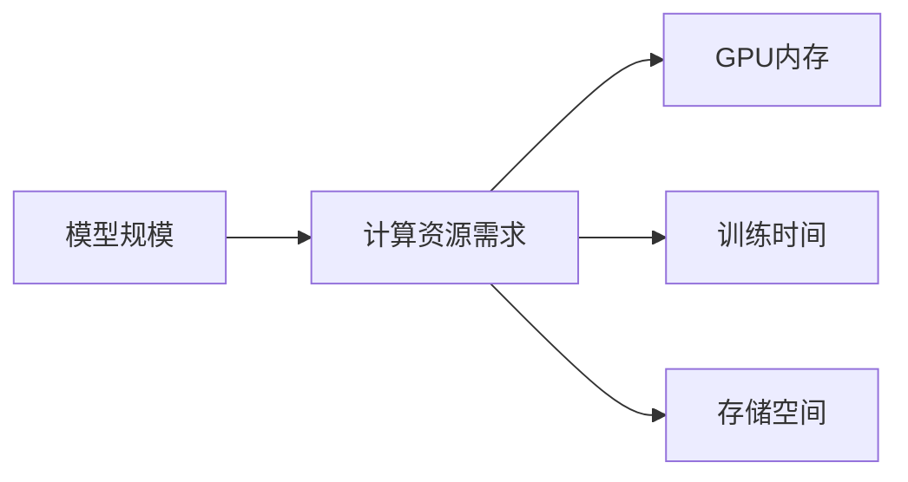

                 

**AI模型scaling：从参数到性能的关系**

**作者：禅与计算机程序设计艺术 / Zen and the Art of Computer Programming**

## 1. 背景介绍

随着深度学习的发展，模型规模的不断扩大已经成为一种趋势。然而，模型规模的扩大是否会带来性能的提升？是否存在一个最优模型规模？这些问题都是我们需要探讨的。

## 2. 核心概念与联系

### 2.1 模型规模与参数数量

模型规模通常是通过模型的参数数量来衡量的。例如，一个具有100万个参数的模型通常被认为是一个大模型，而一个只有1万个参数的模型则被认为是一个小模型。


### 2.2 模型规模与计算资源

模型规模的扩大会导致计算资源需求的增加。这包括GPU内存、训练时间、以及存储模型参数所需的空间。



### 2.3 模型规模与性能

模型规模的扩大是否会带来性能的提升？这是一个复杂的问题，取决于模型的架构、数据集的大小和复杂度等因素。


## 3. 核心算法原理 & 具体操作步骤

### 3.1 算法原理概述

模型scaling的核心原理是通过增加模型的参数数量来提高模型的表达能力。这通常是通过增加模型的层数、增加每层的神经元数量、或者使用更复杂的激活函数来实现的。

### 3.2 算法步骤详解

1. 确定模型的架构，包括层数、每层神经元数量、激活函数等。
2. 确定模型的参数初始化方式。
3. 选择优化器和学习率。
4. 训练模型，监控模型的性能指标。
5. 如果模型的性能指标不满意，则增加模型的参数数量，重复步骤4。
6. 如果模型的性能指标满意，则结束训练。

### 3.3 算法优缺点

优点：模型scaling可以提高模型的表达能力，从而提高模型的性能。缺点：模型scaling会导致计算资源需求的增加，并且模型的训练时间会变长。

### 3.4 算法应用领域

模型scaling广泛应用于计算机视觉、自然语言处理等领域。例如，在计算机视觉领域，模型scaling可以提高模型的分类精度；在自然语言处理领域，模型scaling可以提高模型的生成质量。

## 4. 数学模型和公式 & 详细讲解 & 举例说明

### 4.1 数学模型构建

模型scaling的数学模型可以表示为：

$$y = f(x; \theta)$$

其中，$y$是模型的输出，$x$是模型的输入，$\theta$是模型的参数。

### 4.2 公式推导过程

模型的参数$\theta$通常是通过梯度下降算法来学习的。梯度下降算法的公式为：

$$\theta_{t+1} = \theta_t - \eta \nabla L(\theta_t)$$

其中，$\eta$是学习率，$\nabla L(\theta_t)$是模型损失函数$L(\theta_t)$的梯度。

### 4.3 案例分析与讲解

例如，在图像分类任务中，模型的输入$x$是一张图像，$y$是图像的类别标签。模型的参数$\theta$通常是通过交叉熵损失函数来学习的。交叉熵损失函数的公式为：

$$L(\theta) = -\sum_{i=1}^{C}y_i \log(p_i)$$

其中，$C$是类别数，$p_i$是模型预测的第$i$类的概率。

## 5. 项目实践：代码实例和详细解释说明

### 5.1 开发环境搭建

模型scaling的开发环境通常包括GPU、深度学习框架（如PyTorch、TensorFlow）等。

### 5.2 源代码详细实现

以下是一个简单的模型scaling的代码实现示例：

```python
import torch
import torch.nn as nn

class Model(nn.Module):
    def __init__(self, num_layers, hidden_size):
        super(Model, self).__init__()
        self.layers = nn.ModuleList([nn.Linear(hidden_size, hidden_size) for _ in range(num_layers)])
        self.fc = nn.Linear(hidden_size, 10)

    def forward(self, x):
        for layer in self.layers:
            x = torch.relu(layer(x))
        x = self.fc(x)
        return x

model = Model(num_layers=10, hidden_size=100)
```

### 5.3 代码解读与分析

在上面的代码中，我们定义了一个具有10层全连接层的模型。每层的神经元数量为100。模型的最后一层是一个全连接层，用于输出10个类别的概率。

### 5.4 运行结果展示

模型的性能指标（如精确度、召回率等）可以通过训练集和验证集来评估。以下是一个简单的训练过程示例：

```python
criterion = nn.CrossEntropyLoss()
optimizer = torch.optim.Adam(model.parameters(), lr=0.001)

for epoch in range(10):
    for batch in train_loader:
        optimizer.zero_grad()
        outputs = model(batch['x'])
        loss = criterion(outputs, batch['y'])
        loss.backward()
        optimizer.step()
```

## 6. 实际应用场景

### 6.1 当前应用

模型scaling已经广泛应用于各种计算机视觉和自然语言处理任务中。例如，在图像分类任务中，模型scaling可以提高模型的分类精度；在自然语言生成任务中，模型scaling可以提高模型的生成质量。

### 6.2 未来应用展望

随着计算资源的不断增加，模型scaling将会继续成为一个重要的研究方向。未来，模型scaling可能会应用于更复杂的任务中，如自动驾驶、医学图像分析等。

## 7. 工具和资源推荐

### 7.1 学习资源推荐

推荐阅读以下论文和书籍：

* Deep Learning Book: <https://www.deeplearningbook.org/>
* "The Deep Learning Revolution" by Terrence J. Sejnowski and John H. Richards

### 7.2 开发工具推荐

推荐使用以下开发工具：

* PyTorch: <https://pytorch.org/>
* TensorFlow: <https://www.tensorflow.org/>

### 7.3 相关论文推荐

推荐阅读以下论文：

* "ImageNet Classification with Deep Convolutional Neural Networks" by Krizhevsky et al.
* "Attention Is All You Need" by Vaswani et al.

## 8. 总结：未来发展趋势与挑战

### 8.1 研究成果总结

模型scaling已经取得了显著的成果，在各种计算机视觉和自然语言处理任务中表现出色。

### 8.2 未来发展趋势

未来，模型scaling可能会朝着以下方向发展：

* 更大规模的模型
* 更复杂的模型架构
* 更有效的训练算法

### 8.3 面临的挑战

然而，模型scaling也面临着以下挑战：

* 计算资源需求增加
* 训练时间过长
* 模型泛化能力下降

### 8.4 研究展望

未来的研究方向可能包括：

* 更有效的模型压缩技术
* 更好的模型泛化能力评估方法
* 更复杂的模型架构设计

## 9. 附录：常见问题与解答

### 9.1 问题：模型scaling是否总是会带来性能提升？

**解答：**不一定。模型scaling是否会带来性能提升取决于模型的架构、数据集的大小和复杂度等因素。如果模型的架构已经足够复杂，那么增加模型的参数数量可能不会带来性能提升。

### 9.2 问题：模型scaling是否会导致模型泛化能力下降？

**解答：**可能会。模型scaling会导致模型的复杂度增加，从而可能导致模型泛化能力下降。因此，在模型scaling的过程中，需要注意模型的泛化能力评估。

**作者：禅与计算机程序设计艺术 / Zen and the Art of Computer Programming**

