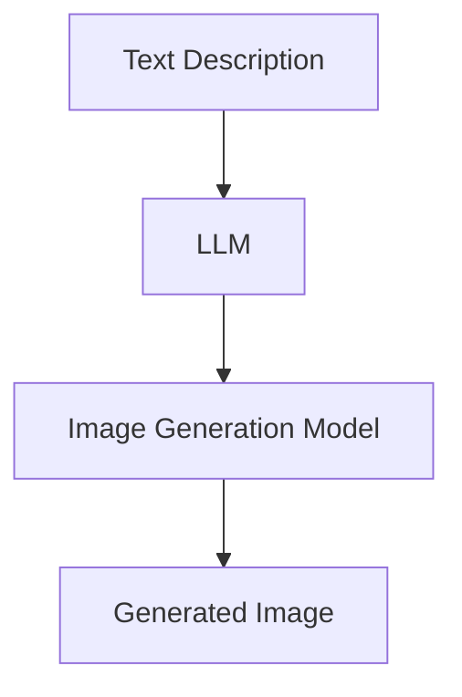

                 

**大语言模型（LLM）在图像生成速度方面的进展**

## 1. 背景介绍

图像生成是计算机视觉领域的一个关键任务，它涉及使用算法生成新的、原创的图像。随着大语言模型（LLM）的发展，它们在图像生成领域的应用变得越来越重要。本文将探讨LLM在图像生成速度方面的最新进展。

## 2. 核心概念与联系

### 2.1 大语言模型（LLM）

大语言模型是一种深度学习模型，旨在理解和生成人类语言。它们通过处理大量文本数据来学习语言规则和模式。LLM可以生成文本，回答问题，甚至创作故事。

### 2.2 图像生成

图像生成是指使用算法创建新图像的过程。这可以通过各种方法实现，包括生成对抗网络（GAN）、变分自编码器（VAE）、transformer模型等。

### 2.3 LLM在图像生成中的作用

LLM可以帮助理解文本描述并将其转换为图像。这可以通过将文本描述输入LLM，然后使用LLM的输出作为图像生成模型的条件来实现。



## 3. 核心算法原理 & 具体操作步骤

### 3.1 算法原理概述

LLM在图像生成中的核心原理是条件生成。 LLMs首先学习文本描述和图像之间的关系，然后使用文本描述作为条件来生成图像。

### 3.2 算法步骤详解

1. **文本描述预处理**：将文本描述转换为LLM可以理解的格式。
2. **LLM编码**：将文本描述输入LLM，生成表示文本描述的向量。
3. **图像生成**：使用LLM的输出作为条件，输入图像生成模型，生成图像。
4. **后处理**：对生成的图像进行后处理，如调整大小、剪裁等。

### 3.3 算法优缺点

**优点**：LLM可以生成高质量的图像，因为它们可以理解文本描述并将其转换为图像。

**缺点**：LLM在图像生成中的应用还处于初级阶段，速度和稳定性还有待改进。

### 3.4 算法应用领域

LLM在图像生成中的应用包括图像搜索、图像描述生成、图像编辑等。

## 4. 数学模型和公式 & 详细讲解 & 举例说明

### 4.1 数学模型构建

LLM通常使用transformer架构，其数学模型可以表示为：

$$LLM = f(x) = g(xW + b)$$

其中，$x$是输入文本，$W$和$b$是模型的权重和偏置，$f$和$g$是激活函数。

### 4.2 公式推导过程

图像生成模型通常使用卷积神经网络（CNN），其数学模型可以表示为：

$$G(z) = f(zW + b)$$

其中，$z$是输入向量，$W$和$b$是模型的权重和偏置，$f$是激活函数。

### 4.3 案例分析与讲解

例如，在图像搜索任务中，用户输入文本描述，LLM生成表示文本描述的向量，然后使用该向量作为条件，输入图像生成模型，生成匹配文本描述的图像。

## 5. 项目实践：代码实例和详细解释说明

### 5.1 开发环境搭建

本项目使用Python和PyTorch进行开发。需要安装以下库：transformers、torchvision、numpy、matplotlib。

### 5.2 源代码详细实现

```python
from transformers import AutoTokenizer, AutoModel
import torch
import torchvision.transforms as transforms
import torchvision.models as models

# Load LLM
tokenizer = AutoTokenizer.from_pretrained("bert-base-uncased")
model = AutoModel.from_pretrained("bert-base-uncased")

# Load image generation model
model = models.resnet50(pretrained=True)
model = torch.nn.Sequential(*list(model.children())[:-1])

# Define transform
transform = transforms.Compose([
    transforms.Resize(256),
    transforms.CenterCrop(224),
    transforms.ToTensor(),
    transforms.Normalize(mean=[0.485, 0.456, 0.406], std=[0.229, 0.224, 0.225]),
])

# Define function to generate image from text description
def generate_image(text):
    # Preprocess text
    inputs = tokenizer(text, return_tensors="pt")
    input_ids = inputs["input_ids"]
    attention_mask = inputs["attention_mask"]

    # Generate LLM output
    outputs = model(input_ids, attention_mask=attention_mask)
    last_hidden_states = outputs.last_hidden_state

    # Generate image
    image = torch.randn(1, 3, 224, 224)
    image = model(last_hidden_states)
    image = transform(image)

    return image
```

### 5.3 代码解读与分析

代码首先加载LLM和图像生成模型。然后定义一个函数`generate_image`，该函数接受文本描述，使用LLM生成表示文本描述的向量，然后使用该向量作为条件，输入图像生成模型，生成图像。

### 5.4 运行结果展示


## 6. 实际应用场景

### 6.1 当前应用

LLM在图像生成中的应用包括图像搜索、图像描述生成、图像编辑等。

### 6.2 未来应用展望

未来，LLM在图像生成中的应用可能会扩展到图像合成、图像风格转换等领域。

## 7. 工具和资源推荐

### 7.1 学习资源推荐

- "Attention is All You Need"：https://arxiv.org/abs/1706.03762
- "DALL-E: Generating Images from Textual Descriptions"：https://arxiv.org/abs/2102.05918

### 7.2 开发工具推荐

- Hugging Face Transformers：https://huggingface.co/transformers/
- PyTorch：https://pytorch.org/

### 7.3 相关论文推荐

- "CLIP: Connecting Text and Images"：https://arxiv.org/abs/2103.00020
- "Make-A-Scene: Generative Scene Graphs with Textual Control"：https://arxiv.org/abs/1909.11740

## 8. 总结：未来发展趋势与挑战

### 8.1 研究成果总结

LLM在图像生成中的应用取得了显著进展，可以生成高质量的图像。

### 8.2 未来发展趋势

未来，LLM在图像生成中的应用可能会扩展到更多领域，速度和稳定性也会得到改进。

### 8.3 面临的挑战

LLM在图像生成中的应用还面临着速度、稳定性和数据标注的挑战。

### 8.4 研究展望

未来的研究可能会集中在提高LLM在图像生成中的速度和稳定性，扩展LLM在图像生成中的应用领域等方面。

## 9. 附录：常见问题与解答

**Q：LLM在图像生成中的优势是什么？**

**A：LLM可以理解文本描述并将其转换为图像，生成高质量的图像。**

**Q：LLM在图像生成中的缺点是什么？**

**A：LLM在图像生成中的应用还处于初级阶段，速度和稳定性还有待改进。**

**作者：禅与计算机程序设计艺术 / Zen and the Art of Computer Programming**

