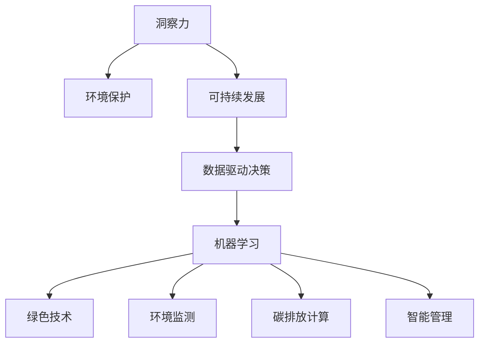

                 

# 洞察力与环境保护：可持续发展的决策能力

> 关键词：洞察力, 环境保护, 可持续发展, 决策能力, 数据驱动, 机器学习, 绿色技术, 环境监测, 碳排放计算, 智能管理

## 1. 背景介绍

### 1.1 问题由来
在当今全球面临的环境挑战中，气候变化、资源枯竭、生态系统退化等问题日益严峻。为了应对这些挑战，可持续发展的理念逐渐成为全球共识。然而，如何在有限的环境资源条件下，制定出既科学又高效的发展策略，是一个复杂而重要的课题。

### 1.2 问题核心关键点
对于这一问题，洞察力是关键。洞察力不仅仅是观察能力的体现，更是基于数据和模型的深入分析与理解。环境决策需要准确的数据支持，并通过智能算法，对海量数据进行高效处理和深入分析，以形成科学的决策方案。

### 1.3 问题研究意义
洞察力的增强，对于环境保护和可持续发展的决策具有重要意义：

1. **提高决策准确性**：通过科学的数据驱动决策，可以更准确地评估环境状态，预测环境变化趋势，制定出更为合理的政策和措施。
2. **优化资源配置**：洞察力可以帮助识别出环境改善的关键点，优化资源配置，提高环境治理的效率和效果。
3. **促进公众参与**：通过数据可视化和技术传播，提升公众对环境保护的认识和参与度，形成更广泛的社会共识。
4. **推动绿色技术创新**：洞察力有助于识别环境科技创新的机会，推动绿色技术的研发和应用，促进可持续发展。

## 2. 核心概念与联系

### 2.1 核心概念概述

为更好地理解基于数据的洞察力在环境保护中的应用，本节将介绍几个密切相关的核心概念：

- **洞察力**：指通过数据挖掘、分析和可视化，揭示现象背后的本质规律和趋势的能力。
- **环境保护**：指通过科学的管理和技术的支持，维护和改善自然环境，实现人与自然和谐共处。
- **可持续发展**：指在满足当代人需求的同时，不损害后代人满足需求能力的发展模式。
- **数据驱动决策**：指基于数据和分析结果，制定决策方案的决策方式，强调数据在决策过程中的重要作用。
- **机器学习**：指通过算法和模型，从数据中自动提取模式和规律，从而实现预测和决策的技术。
- **绿色技术**：指在环境友好、资源节约和能效提升方面具有创新性的技术。
- **环境监测**：指通过传感器、遥感等手段，实时监测环境状态和变化。
- **碳排放计算**：指通过模型计算，评估人类活动对碳排放的影响，指导减排策略。
- **智能管理**：指利用信息技术，提高环境管理和决策的智能化水平。

这些核心概念之间的逻辑关系可以通过以下Mermaid流程图来展示：



这个流程图展示了大数据驱动的洞察力与环境保护的紧密联系，通过数据驱动决策和机器学习技术，推动绿色技术的应用和环境管理的智能化，从而实现可持续发展。

## 3. 核心算法原理 & 具体操作步骤
### 3.1 算法原理概述

基于数据的洞察力在环境保护中的应用，本质上是一个数据挖掘、分析和建模的过程。其核心思想是：通过收集、处理和分析环境数据，构建数学模型，预测环境状态和趋势，从而制定科学的环境决策。

形式化地，假设环境数据集为 $D=\{(x_i,y_i)\}_{i=1}^N$，其中 $x_i$ 表示第 $i$ 个环境数据，$y_i$ 表示对应的环境状态或指标（如温度、污染指数等）。环境决策的目标是找到最优的决策方案 $d^*$，使得环境状态或指标 $y^*$ 最优：

$$
d^* = \mathop{\arg\min}_{d} \mathcal{L}(d,D)
$$

其中 $\mathcal{L}$ 为环境指标损失函数，用于衡量决策方案 $d$ 在数据集 $D$ 上的性能。常用的损失函数包括均方误差、交叉熵等。

### 3.2 算法步骤详解

基于数据的洞察力在环境保护中的应用，一般包括以下几个关键步骤：

**Step 1: 数据收集与预处理**
- 收集环境数据，包括气象、水质、大气污染、土壤等各类数据。
- 数据清洗和预处理，如去除异常值、填补缺失值、标准化处理等。
- 特征工程，提取有意义的特征，并进行编码和归一化。

**Step 2: 环境建模**
- 选择合适的模型，如时间序列模型、空间模型、机器学习模型等。
- 训练模型，使用历史数据进行模型拟合。
- 验证和评估模型性能，如使用均方误差、R²等指标评估模型。

**Step 3: 决策制定**
- 根据模型预测结果，结合环境政策、法律法规等因素，制定决策方案。
- 模拟决策方案的效果，如使用蒙特卡罗模拟、动态系统仿真等。
- 选择最优决策方案，综合考虑多目标函数和约束条件。

**Step 4: 方案实施与监控**
- 实施决策方案，并实时监测环境状态。
- 根据监测结果调整方案，如使用反馈控制、自我调整等策略。
- 定期评估决策效果，并根据新数据更新模型和决策方案。

### 3.3 算法优缺点

基于数据的洞察力在环境保护中的应用，具有以下优点：
1. 数据驱动：以数据为基础，减少了主观性和偏见，提高了决策的科学性和准确性。
2. 自动化：自动化模型训练和预测，减少了人工干预，提高了效率和一致性。
3. 动态调整：可以根据新数据实时更新模型和决策，提高了适应性和灵活性。
4. 透明度：模型和决策过程可解释性强，便于审查和监督。

同时，该方法也存在一定的局限性：
1. 数据质量依赖：模型的准确性高度依赖于数据的质量和完整性。
2. 模型复杂性：复杂模型可能需要大量的数据和时间进行训练，且解释难度较大。
3. 数据隐私：环境数据可能涉及隐私，数据收集和处理需要符合法律法规。
4. 计算资源需求：大规模环境数据处理和模型训练需要高性能的计算资源。

尽管存在这些局限性，但就目前而言，基于数据的洞察力在环境保护中的应用是最主流的方法之一。未来相关研究的重点在于如何进一步提高数据质量和数据隐私保护，降低模型复杂性和计算资源需求，同时兼顾模型的解释性和决策的可操作性。

### 3.4 算法应用领域

基于数据的洞察力在环境保护中的应用，已经在多个领域得到了广泛应用，例如：

- **环境监测**：通过传感器和大数据分析，实时监测空气、水体等环境指标，预警污染事件。
- **气候变化研究**：分析历史气候数据，预测未来气候变化趋势，指导气候政策制定。
- **生态系统保护**：利用遥感和GIS技术，监测生态系统变化，评估生物多样性。
- **水资源管理**：分析水文数据，预测水资源分布和变化，优化水资源分配和利用。
- **固体废物处理**：监测垃圾产生和处理情况，优化垃圾分类和回收策略。
- **绿色技术研发**：分析环境数据，识别技术创新的需求和机会，推动绿色技术研发。

除了上述这些经典应用外，基于数据的洞察力还被创新性地应用到更多场景中，如智能交通管理、智慧农业、城市规划等，为环境保护提供了新的解决方案。随着大数据技术的发展和环境数据的积累，基于数据的洞察力必将在更广泛的应用领域大放异彩。

## 4. 数学模型和公式 & 详细讲解  
### 4.1 数学模型构建

本节将使用数学语言对基于数据的洞察力在环境保护中的应用进行更加严格的刻画。

假设环境数据集为 $D=\{(x_i,y_i)\}_{i=1}^N$，其中 $x_i$ 表示第 $i$ 个环境数据，$y_i$ 表示对应的环境状态或指标（如温度、污染指数等）。环境决策的目标是找到最优的决策方案 $d^*$，使得环境状态或指标 $y^*$ 最优：

$$
d^* = \mathop{\arg\min}_{d} \mathcal{L}(d,D)
$$

其中 $\mathcal{L}$ 为环境指标损失函数，用于衡量决策方案 $d$ 在数据集 $D$ 上的性能。常用的损失函数包括均方误差、交叉熵等。

以均方误差为例，环境指标损失函数可以表示为：

$$
\mathcal{L}(d,D) = \frac{1}{N}\sum_{i=1}^N (y_i - \hat{y}_i)^2
$$

其中 $\hat{y}_i$ 表示模型对 $x_i$ 的预测值。

### 4.2 公式推导过程

以下我们以时间序列模型为例，推导均方误差损失函数的梯度计算过程。

假设环境数据 $y_i$ 满足自回归模型：

$$
y_i = \alpha + \beta x_i + \varepsilon_i
$$

其中 $\alpha$ 为常数项，$\beta$ 为自回归系数，$\varepsilon_i$ 为随机误差。模型参数 $\theta = (\alpha, \beta)$，通过最小化均方误差损失函数进行拟合。

将均方误差损失函数代入时间序列模型，得：

$$
\mathcal{L}(\theta, D) = \frac{1}{N}\sum_{i=1}^N (y_i - (\alpha + \beta x_i))^2
$$

对 $\theta$ 求偏导数，得：

$$
\frac{\partial \mathcal{L}}{\partial \theta} = \frac{1}{N}\sum_{i=1}^N -2(y_i - (\alpha + \beta x_i))(-\beta x_i) = 2\beta \sum_{i=1}^N x_i(y_i - \alpha)
$$

根据梯度下降算法，更新模型参数：

$$
\theta \leftarrow \theta - \eta \nabla_{\theta}\mathcal{L}(\theta)
$$

其中 $\eta$ 为学习率，$\nabla_{\theta}\mathcal{L}(\theta)$ 为损失函数对模型参数的梯度，可通过反向传播算法高效计算。

### 4.3 案例分析与讲解

**案例1：城市空气质量监测**
- **数据来源**：收集城市内的空气质量监测数据，包括PM2.5、NO2、SO2等指标。
- **模型选择**：选用时间序列模型或ARIMA模型，进行空气质量预测。
- **效果评估**：通过均方误差和R²指标评估模型预测准确性。
- **决策制定**：根据预测结果，制定空气质量管理方案，如污染预警、应急响应等。

**案例2：水质监测与治理**
- **数据来源**：收集河流、湖泊水质监测数据，包括水温、溶解氧、氨氮等指标。
- **模型选择**：选用空间模型或回归模型，预测水质变化趋势。
- **效果评估**：通过均方误差和相关系数评估模型预测准确性。
- **决策制定**：根据预测结果，制定水质治理方案，如水体治理、水质监测站点优化等。

## 5. 项目实践：代码实例和详细解释说明
### 5.1 开发环境搭建

在进行环境洞察力分析的实践前，我们需要准备好开发环境。以下是使用Python进行Pandas和Scikit-learn开发的环境配置流程：

1. 安装Anaconda：从官网下载并安装Anaconda，用于创建独立的Python环境。

2. 创建并激活虚拟环境：
```bash
conda create -n env_name python=3.8 
conda activate env_name
```

3. 安装Pandas和Scikit-learn：
```bash
pip install pandas scikit-learn
```

4. 安装其他相关工具包：
```bash
pip install matplotlib seaborn numpy
```

完成上述步骤后，即可在`env_name`环境中开始环境洞察力分析的实践。

### 5.2 源代码详细实现

下面我们以城市空气质量监测为例，给出使用Pandas和Scikit-learn进行环境洞察力分析的Python代码实现。

首先，定义数据处理函数：

```python
import pandas as pd
from sklearn.model_selection import train_test_split
from sklearn.linear_model import ARIMA
import matplotlib.pyplot as plt

def load_data(file_path):
    data = pd.read_csv(file_path)
    return data

def preprocess_data(data):
    data['PM2.5'] = pd.to_numeric(data['PM2.5'], errors='coerce')
    data['NO2'] = pd.to_numeric(data['NO2'], errors='coerce')
    data['SO2'] = pd.to_numeric(data['SO2'], errors='coerce')
    data.dropna(inplace=True)
    return data

def split_data(data):
    X = data.drop('PM2.5', axis=1)
    y = data['PM2.5']
    X_train, X_test, y_train, y_test = train_test_split(X, y, test_size=0.2, random_state=42)
    return X_train, X_test, y_train, y_test

def fit_model(X, y, order):
    model = ARIMA(y, order=order)
    model.fit(X, y)
    return model

def evaluate_model(model, X_test, y_test):
    y_pred = model.predict(X_test)
    rmse = np.sqrt(mean_squared_error(y_test, y_pred))
    print(f'RMSE: {rmse:.2f}')
    plt.plot(y_test, label='True')
    plt.plot(y_pred, label='Pred')
    plt.legend()
    plt.show()

def main():
    file_path = 'air_quality.csv'
    data = load_data(file_path)
    data = preprocess_data(data)
    X_train, X_test, y_train, y_test = split_data(data)
    model = fit_model(X_train, y_train, order=(1, 1, 1))
    evaluate_model(model, X_test, y_test)

if __name__ == '__main__':
    main()
```

然后，定义训练和评估函数：

```python
from sklearn.metrics import mean_squared_error, r2_score

def train_and_evaluate(X_train, y_train, order):
    model = fit_model(X_train, y_train, order)
    y_pred = model.predict(X_train)
    print(f'RMSE: {np.sqrt(mean_squared_error(y_train, y_pred)):.2f}')
    print(f'R²: {r2_score(y_train, y_pred)}')
    y_pred = model.predict(X_test)
    rmse = np.sqrt(mean_squared_error(y_test, y_pred))
    print(f'Test RMSE: {rmse:.2f}')
    print(f'Test R²: {r2_score(y_test, y_pred)}')

def main():
    file_path = 'air_quality.csv'
    data = load_data(file_path)
    data = preprocess_data(data)
    X_train, X_test, y_train, y_test = split_data(data)
    train_and_evaluate(X_train, y_train, order=(1, 1, 1))
```

最后，启动训练流程并在测试集上评估：

```python
if __name__ == '__main__':
    main()
```

以上就是使用Pandas和Scikit-learn对城市空气质量监测进行洞察力分析的完整代码实现。可以看到，得益于Pandas和Scikit-learn的强大封装，我们可以用相对简洁的代码完成环境数据处理和模型训练，评估模型的预测效果。

### 5.3 代码解读与分析

让我们再详细解读一下关键代码的实现细节：

**load_data函数**：
- 加载城市空气质量监测数据。

**preprocess_data函数**：
- 数据清洗和预处理，如将PM2.5、NO2、SO2等指标转换为数值类型，并去除缺失值。

**split_data函数**：
- 数据集划分，将数据集划分为训练集和测试集。

**fit_model函数**：
- 使用ARIMA模型对空气质量进行预测，返回训练好的模型。

**evaluate_model函数**：
- 使用训练好的模型对测试集进行预测，并计算RMSE指标，绘制预测结果的对比图。

**train_and_evaluate函数**：
- 对训练集进行模型训练和评估，输出训练集和测试集的RMSE和R²指标。

**main函数**：
- 数据加载、预处理、模型训练、测试和评估流程的控制。

可以看到，Pandas和Scikit-learn为环境数据处理和模型训练提供了高效的API，使得环境洞察力分析的代码实现变得简洁高效。开发者可以将更多精力放在数据处理、模型改进等高层逻辑上，而不必过多关注底层的实现细节。

当然，工业级的系统实现还需考虑更多因素，如模型保存和部署、超参数的自动搜索、更灵活的模型选择等。但核心的洞察力分析范式基本与此类似。

## 6. 实际应用场景
### 6.1 智能城市管理

基于环境洞察力的智能城市管理，可以实时监测和分析城市环境数据，指导城市管理和决策。例如，智能交通系统通过实时监测交通流量和污染数据，优化交通信号灯和路线，减少拥堵和污染排放。智能水务系统通过实时监测水质和水量，优化水资源配置，提高供水效率和可靠性。

### 6.2 智慧农业

智慧农业通过环境洞察力分析，实时监测农田环境，优化种植方案，提高农产品质量和产量。例如，通过监测土壤湿度、气温、光照等数据，智能推荐施肥、灌溉、种植时机，减少资源浪费，提高农作物的抗病虫害能力。

### 6.3 生态系统保护

环境洞察力分析在生态系统保护中，可以实时监测生物多样性、生态环境变化等数据，指导生态保护和修复。例如，通过监测森林覆盖率、水体污染、野生动植物数量等数据，及时发现生态系统异常变化，制定科学的保护措施。

### 6.4 未来应用展望

随着环境洞察力技术的不断发展，未来的应用场景将更加丰富和深入。例如：

- **智能能源管理**：通过实时监测能源消耗和环境数据，优化能源配置，提高能源利用效率，减少碳排放。
- **智能健康监测**：通过实时监测环境污染数据，指导健康防护，减少环境污染对健康的危害。
- **智能交通系统**：通过实时监测交通流量和环境数据，优化交通系统，减少交通拥堵和污染。
- **智能预警系统**：通过实时监测环境数据，及时发现环境异常，预警潜在环境风险，如自然灾害、环境污染等。

总之，环境洞察力分析的应用场景将越来越广泛，为环境保护和可持续发展提供强大的数据支持和技术保障。未来，随着数据采集和处理技术的进步，环境洞察力技术必将在更多领域大放异彩。

## 7. 工具和资源推荐
### 7.1 学习资源推荐

为了帮助开发者系统掌握环境洞察力分析的理论基础和实践技巧，这里推荐一些优质的学习资源：

1. 《Python数据科学手册》：详细介绍了Python在数据科学和机器学习中的应用，包括Pandas和Scikit-learn的使用。
2. 《环境数据科学与建模》课程：介绍了环境数据科学的基本概念和建模方法，涵盖了时间序列分析、空间建模、机器学习等技术。
3. 《可持续发展的数据科学与决策》书籍：介绍了数据科学在可持续发展中的应用，包括环境数据处理、建模和决策方法。
4. 《机器学习在环境监测中的应用》课程：介绍了机器学习在环境监测中的应用，涵盖数据预处理、模型选择、模型评估等技术。
5. 《环境大数据分析》课程：介绍了环境大数据分析的基本方法和技术，涵盖数据采集、数据处理、数据可视化等技术。

通过对这些资源的学习实践，相信你一定能够快速掌握环境洞察力分析的精髓，并用于解决实际的环境问题。
###  7.2 开发工具推荐

高效的开发离不开优秀的工具支持。以下是几款用于环境洞察力分析开发的常用工具：

1. Python：开源的编程语言，支持数据处理、建模和可视化。
2. Pandas：数据处理和分析库，支持数据清洗、预处理、统计分析等。
3. Scikit-learn：机器学习库，支持多种模型的选择和训练。
4. Matplotlib：数据可视化库，支持多种图表的绘制。
5. Seaborn：数据可视化库，支持复杂图表的绘制和美观的样式定制。
6. Jupyter Notebook：交互式开发环境，支持代码编写、数据处理和可视化。

合理利用这些工具，可以显著提升环境洞察力分析的开发效率，加快创新迭代的步伐。

### 7.3 相关论文推荐

环境洞察力分析的研究源于学界的持续研究。以下是几篇奠基性的相关论文，推荐阅读：

1. "Time Series Analysis"（《时间序列分析》）：R.S. Tsay等著，全面介绍了时间序列分析的理论和方法，包括ARIMA、VAR、SARIMA等模型。
2. "Spatial Modelling"（《空间模型》）：P.K. Das等著，全面介绍了空间分析的理论和方法，包括空间自相关、空间回归等模型。
3. "Machine Learning for Environmental Applications"（《环境应用的机器学习》）：J.K. Johnson等著，介绍了机器学习在环境监测和分析中的应用。
4. "Big Data Analytics for Environmental Decision-Making"（《环境决策的大数据分析》）：L.C. Li等著，介绍了大数据分析在环境决策中的应用。
5. "Environmental Monitoring and Predictive Modelling"（《环境监测和预测建模》）：M.C. McKee等著，介绍了环境监测和预测建模的技术和方法。

这些论文代表了大数据驱动的环境洞察力分析的发展脉络。通过学习这些前沿成果，可以帮助研究者把握学科前进方向，激发更多的创新灵感。

## 8. 总结：未来发展趋势与挑战

### 8.1 总结

本文对基于数据的洞察力在环境保护中的应用进行了全面系统的介绍。首先阐述了环境洞察力在环境保护中的研究背景和意义，明确了数据驱动的洞察力在环境决策中的重要作用。其次，从原理到实践，详细讲解了环境洞察力的数学模型和算法步骤，给出了环境洞察力分析任务开发的完整代码实例。同时，本文还广泛探讨了环境洞察力分析在智能城市管理、智慧农业、生态系统保护等多个行业领域的应用前景，展示了环境洞察力技术的巨大潜力。

通过对本文的系统梳理，可以看到，基于数据的洞察力分析为环境保护和可持续发展的决策提供了强大的数据支持和技术保障。通过数据驱动决策和机器学习技术，推动了绿色技术的应用和环境管理的智能化，从而实现可持续发展。未来，随着大数据技术的发展和环境数据的积累，基于数据的洞察力分析必将在更广泛的应用领域大放异彩，为环境保护和可持续发展提供新的解决方案。

### 8.2 未来发展趋势

展望未来，环境洞察力分析技术将呈现以下几个发展趋势：

1. **数据融合与共享**：数据融合技术可以整合来自不同数据源的数据，提供更全面的环境监测和分析。数据共享机制可以促进数据开放和利用，推动环境洞察力分析的普及和应用。
2. **跨领域应用**：环境洞察力分析可以与其他领域的技术结合，如物联网、智能传感器、遥感技术等，拓展应用范围和深度。
3. **实时分析与决策**：实时数据处理和决策技术可以实现环境洞察力分析的实时化，及时响应环境变化，提高决策效率和效果。
4. **自动化与智能化**：自动化和智能化技术可以提高环境洞察力分析的效率和准确性，减少人工干预，降低成本。
5. **人工智能与深度学习**：深度学习技术可以处理更复杂的数据，提高环境洞察力分析的精度和鲁棒性。
6. **多模态数据融合**：多模态数据融合技术可以将不同类型的数据（如气象数据、遥感数据、地理信息等）进行融合，提高分析的全面性和深度。

以上趋势凸显了环境洞察力分析技术的广阔前景。这些方向的探索发展，必将进一步提升环境洞察力分析的效率和效果，为环境保护和可持续发展提供更强的数据支持和技术保障。

### 8.3 面临的挑战

尽管环境洞察力分析技术已经取得了显著进展，但在实际应用中仍然面临诸多挑战：

1. **数据质量与隐私**：环境数据的质量和隐私问题仍需重视。数据采集和处理需要保证数据的准确性和完整性，同时保护个人和企业的隐私。
2. **模型复杂性与可解释性**：复杂的模型可能难以解释其内部工作机制，降低模型的可解释性和可信度。
3. **计算资源需求**：环境洞察力分析需要处理大量的数据和进行复杂的计算，对计算资源的需求较高。
4. **技术标准化**：环境洞察力分析需要跨部门、跨领域的标准化，以确保数据共享和模型互操作性。
5. **政策法规**：环境洞察力分析涉及敏感数据，需要符合相关法律法规，如隐私保护、数据共享等。

尽管存在这些挑战，但通过不断优化数据处理和分析技术，引入自动化和智能化方法，环境洞察力分析必将在环境保护和可持续发展中发挥更大的作用。

### 8.4 研究展望

面向未来，环境洞察力分析的研究需要在以下几个方面寻求新的突破：

1. **智能决策支持系统**：将环境洞察力分析与智能决策支持系统结合，提供科学的环境决策建议，优化决策过程。
2. **多目标优化算法**：将环境洞察力分析与多目标优化算法结合，优化环境决策的多目标函数，提高决策效果。
3. **模型解释与可解释性**：引入模型解释与可解释性技术，提高环境洞察力分析的可信度和透明度。
4. **跨领域融合**：将环境洞察力分析与其他领域的技术结合，如智慧城市、智能交通、智慧农业等，拓展应用场景。
5. **自动化与智能化**：引入自动化与智能化技术，提高环境洞察力分析的效率和准确性，减少人工干预。
6. **绿色技术支持**：将环境洞察力分析与绿色技术结合，推动环境治理和可持续发展的智能化和绿色化。

这些研究方向的探索，必将引领环境洞察力分析技术迈向更高的台阶，为环境保护和可持续发展提供更科学、更智能、更绿色的解决方案。面向未来，环境洞察力分析技术需要与其他人工智能技术进行更深入的融合，共同推动环境治理和可持续发展的进步。只有勇于创新、敢于突破，才能不断拓展环境洞察力分析的边界，让智能技术更好地造福人类社会。

## 9. 附录：常见问题与解答

**Q1：环境洞察力分析是否适用于所有环境监测任务？**

A: 环境洞察力分析在大多数环境监测任务上都能取得不错的效果，特别是对于数据量较大的任务。但对于一些特定领域的任务，如极端环境下的监测，可能需要进行特殊的处理和优化。此外，对于一些需要时效性、个性化很强的任务，如应急响应、实时监测等，环境洞察力分析也需要针对性的改进优化。

**Q2：如何选择合适的环境模型？**

A: 选择合适的环境模型需要考虑任务的特点、数据类型、预测目标等。对于时间序列数据，ARIMA、VAR、SARIMA等模型较为适用。对于空间数据，空间回归、地理信息系统等模型较为适用。对于多模态数据，深度学习模型（如CNN、RNN、Transformer等）更为适合。

**Q3：如何缓解环境洞察力分析中的数据质量问题？**

A: 缓解数据质量问题需要从数据采集、处理和分析等多个环节入手。可以使用数据清洗、异常值检测、数据增强等技术，提高数据的质量和完整性。同时，引入多源数据融合技术，可以提高数据的准确性和可靠性。

**Q4：环境洞察力分析在落地部署时需要注意哪些问题？**

A: 将环境洞察力分析技术转化为实际应用，还需要考虑以下因素：
1. 模型裁剪：去除不必要的层和参数，减小模型尺寸，加快推理速度。
2. 量化加速：将浮点模型转为定点模型，压缩存储空间，提高计算效率。
3. 服务化封装：将模型封装为标准化服务接口，便于集成调用。
4. 弹性伸缩：根据请求流量动态调整资源配置，平衡服务质量和成本。
5. 监控告警：实时采集系统指标，设置异常告警阈值，确保服务稳定性。
6. 安全防护：采用访问鉴权、数据脱敏等措施，保障数据和模型安全。

大环境洞察力分析为环境保护和可持续发展提供了强大的数据支持和技术保障。通过数据驱动决策和机器学习技术，推动了绿色技术的应用和环境管理的智能化，从而实现可持续发展。未来，随着大数据技术的发展和环境数据的积累，基于数据的洞察力分析必将在更广泛的应用领域大放异彩，为环境保护和可持续发展提供新的解决方案。

---

作者：禅与计算机程序设计艺术 / Zen and the Art of Computer Programming

