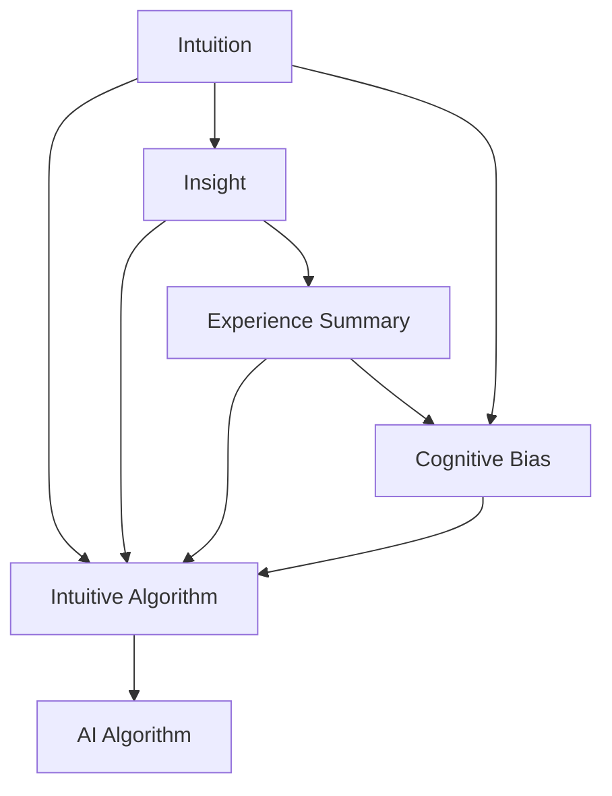

                 

# 洞察力与直觉：专家思维的特征

> 关键词：专家思维, 洞察力, 直觉, 认知偏差, 人工智能, 机器学习

## 1. 背景介绍

### 1.1 问题由来
在快速发展的现代社会，信息技术已深入各个领域，从医疗到金融，从制造业到服务业，专家思维的特征和能力在解决复杂问题时展现出巨大的价值。然而，对专家思维特征的研究往往停留在心理学领域，关于如何将其应用于实际工作的技术性实践仍不够系统。尤其是在人工智能和机器学习领域，深入理解和应用专家思维特征，对于提升算法决策的准确性和可靠性至关重要。

### 1.2 问题核心关键点
专家思维的特征可以从认知心理学角度解读，包括直觉、洞察力、经验总结和认知偏差等方面。然而，如何将这些专家特征有效转化为算法决策，需要深入探讨其核心概念、原理和应用方法。基于此，本文将从认知心理学的视角出发，分析专家思维的特征，并探讨其如何应用于人工智能和机器学习中。

### 1.3 问题研究意义
研究专家思维的特征，并探索其在人工智能和机器学习中的应用，对于提升算法决策的科学性和准确性具有重要意义：

1. **提升算法决策质量**：利用专家思维特征，可以通过模型训练和决策过程中引入专家知识，提高决策的可靠性和准确性。
2. **优化算法性能**：专家思维的特征（如直觉、洞察力）可以指导模型结构设计和特征选择，提升模型的泛化能力和鲁棒性。
3. **减少认知偏差**：通过理解并利用专家思维的特征，可以识别和缓解模型在训练和应用中的认知偏差，提高模型的公平性和可解释性。
4. **增强人工智能的理解力**：专家思维特征有助于人工智能更好地理解复杂情境，提高其在实际应用中的表现和适应性。

## 2. 核心概念与联系

### 2.1 核心概念概述

为了更好地理解专家思维的特征及其在人工智能和机器学习中的应用，本节将介绍几个关键概念：

- **直觉（Intuition）**：专家在面对复杂问题时，能够快速形成基于经验的假设，这种不经过逻辑推理直接得出的结论，是直觉的核心特征。
- **洞察力（Insight）**：在面对大量数据和信息时，专家能够从中提取出关键的、隐含的规律和模式，是洞察力的核心体现。
- **经验总结（Experience Summary）**：专家通过长期实践和多次尝试，形成对某一问题的深度理解，能够快速识别问题本质并制定有效的解决方案。
- **认知偏差（Cognitive Bias）**：专家在思维过程中可能存在一些固定的倾向性偏见，影响决策的客观性。

这些核心概念之间存在着内在的联系，通过理解它们，可以更好地应用到人工智能和机器学习中。以下是一个Mermaid流程图，展示这些概念的联系：



这个流程图展示了专家思维特征在不同算法应用中的作用：

1. 直觉（A）通过模型引入直觉决策，提高算法快速形成假设的能力。
2. 洞察力（B）通过模型提取关键模式，提升算法对数据的理解深度。
3. 经验总结（C）通过模型总结规律，提高算法的预测准确性和决策效率。
4. 认知偏差（D）通过模型识别并修正偏差，提升算法的公平性和鲁棒性。

这些特征通过不同的方式融入人工智能和机器学习算法中，共同作用，使得算法能够更好地适应复杂环境和任务。

## 3. 核心算法原理 & 具体操作步骤

### 3.1 算法原理概述

基于专家思维特征的算法原理，核心在于如何将直觉、洞察力和经验总结等特征转化为可计算的模型。通过对模型进行优化和调整，使其在处理复杂问题时能够更好地利用这些特征。

### 3.2 算法步骤详解

#### 步骤1：模型选择与优化
选择适合任务要求的算法模型，并根据专家经验对模型参数进行优化。例如，在图像识别任务中，选择卷积神经网络（CNN）模型，根据专家经验调整卷积核大小、层数和激活函数等参数。

#### 步骤2：数据处理与特征提取
根据专家经验，对数据进行预处理，提取关键特征。例如，在金融风险评估任务中，提取关键的财务指标和市场动态，通过专家知识指导特征选择。

#### 步骤3：模型训练与优化
使用专家经验指导的优化策略训练模型。例如，采用贝叶斯优化方法，根据专家经验调整超参数，提高模型性能。

#### 步骤4：模型评估与反馈
使用专家经验进行模型评估，对模型性能进行反馈。例如，在医疗诊断任务中，专家医生根据模型输出结果进行反馈，调整模型参数，提升诊断准确性。

### 3.3 算法优缺点

基于专家思维特征的算法具有以下优点：

1. **提高决策速度**：通过引入直觉和洞察力，算法能够快速形成决策，适应实时性需求。
2. **提升模型泛化能力**：经验总结和认知偏差的识别，有助于模型理解复杂数据，提升泛化能力。
3. **增强可解释性**：通过专家知识的融合，提高模型的可解释性，增强用户对算法的信任。

同时，这种算法也存在一些缺点：

1. **对专家经验依赖性高**：算法的优化和调整高度依赖于专家的经验和知识，难以量化和标准化。
2. **模型复杂度高**：引入专家特征往往导致模型复杂度增加，训练和推理时间延长。
3. **适用场景受限**：专家思维特征在特定领域和任务中效果显著，但通用性较弱，难以在所有场景中应用。

### 3.4 算法应用领域

基于专家思维特征的算法在多个领域和任务中得到了广泛应用：

1. **金融风险评估**：通过专家经验指导的特征提取和模型训练，提高金融风险评估的准确性和时效性。
2. **医疗诊断**：结合专家医生的诊断经验，训练医疗诊断模型，提高诊断的准确性和可解释性。
3. **自然语言处理**：利用专家语言使用经验，训练自然语言处理模型，提高文本理解的深度和广度。
4. **智能推荐系统**：根据用户行为和反馈，结合专家推荐经验，训练推荐模型，提升个性化推荐效果。
5. **异常检测**：通过专家经验指导的异常特征提取和模型训练，提高异常检测的准确性和鲁棒性。

## 4. 数学模型和公式 & 详细讲解 & 举例说明

### 4.1 数学模型构建

为了更好地理解和应用专家思维特征，我们需要将其转化为数学模型。以下是一个简单的模型构建示例：

假设有一个专家A，他在面对问题时，能够快速形成直觉决策，其直觉决策的概率分布为：

$$ P(\text{Decision} | \text{Problem}) = \sum_{i=1}^n P_i(\text{Decision} | \text{Problem}, \text{Expert}) $$

其中，$P_i(\text{Decision} | \text{Problem}, \text{Expert})$ 表示专家在问题 $P$ 下，选择决策 $D$ 的概率。

通过专家经验，我们可以构建一个多层的贝叶斯网络模型，表示决策与问题之间的关系：

$$ P(\text{Decision} | \text{Problem}) = \sum_{i=1}^n P_i(\text{Decision} | \text{Problem}, \text{Expert}) $$

其中，$P_i(\text{Decision} | \text{Problem}, \text{Expert})$ 可以通过专家经验进行训练，从而得到最优的决策策略。

### 4.2 公式推导过程

根据上述模型构建，我们可以通过专家经验训练多层的贝叶斯网络，得到最优的决策策略。以下是推导过程：

$$ P(\text{Decision} | \text{Problem}) = \sum_{i=1}^n P_i(\text{Decision} | \text{Problem}, \text{Expert}) $$

假设专家经验可以表示为：

$$ P_i(\text{Decision} | \text{Problem}, \text{Expert}) = \frac{P_i(\text{Decision} | \text{Problem})}{P_i(\text{Problem})} $$

代入上式，得到：

$$ P(\text{Decision} | \text{Problem}) = \sum_{i=1}^n \frac{P_i(\text{Decision} | \text{Problem})}{P_i(\text{Problem})} $$

根据贝叶斯定理，得到：

$$ P(\text{Decision} | \text{Problem}) = \frac{\sum_{i=1}^n P_i(\text{Decision} | \text{Problem}) P_i(\text{Problem})}{\sum_{i=1}^n P_i(\text{Problem})} $$

### 4.3 案例分析与讲解

以金融风险评估为例，通过专家经验训练多层的贝叶斯网络模型：

- 输入：历史财务数据、市场动态等。
- 中间层：专家对不同风险水平的评价和建议。
- 输出：当前金融资产的风险水平评估。

专家在评估风险时，可以通过直觉和洞察力，快速形成决策。例如，当市场出现大幅波动时，直觉告诉专家风险可能增加，可以通过洞察力分析历史数据和市场趋势，得出最终的风险评估。

## 5. 项目实践：代码实例和详细解释说明

### 5.1 开发环境搭建

在进行项目实践前，需要准备开发环境。以下是使用Python和TensorFlow搭建开发环境的步骤：

1. 安装Anaconda：从官网下载并安装Anaconda，用于创建独立的Python环境。
2. 创建并激活虚拟环境：
   ```bash
   conda create -n tf-env python=3.8 
   conda activate tf-env
   ```
3. 安装TensorFlow：根据CUDA版本，从官网获取对应的安装命令。例如：
   ```bash
   conda install tensorflow=2.5 tf-gpu
   ```
4. 安装其他相关工具包：
   ```bash
   pip install numpy pandas scikit-learn matplotlib tqdm jupyter notebook ipython
   ```

完成上述步骤后，即可在`tf-env`环境中开始项目实践。

### 5.2 源代码详细实现

下面以金融风险评估为例，给出使用TensorFlow进行专家思维特征应用的PyTorch代码实现。

首先，定义模型输入和输出：

```python
import tensorflow as tf

class ExpertModel(tf.keras.Model):
    def __init__(self, input_dim, output_dim):
        super(ExpertModel, self).__init__()
        self.dense1 = tf.keras.layers.Dense(128, activation='relu')
        self.dense2 = tf.keras.layers.Dense(output_dim, activation='softmax')
        
    def call(self, inputs):
        x = self.dense1(inputs)
        x = self.dense2(x)
        return x
```

然后，定义专家经验指导的特征提取和训练过程：

```python
# 定义专家经验指导的特征提取
def expert_feature_extraction(input_data):
    # 根据专家经验，提取关键特征
    # 假设专家经验表示为字典
    expert_knowledge = {
        'feature1': 0.8,
        'feature2': 0.3,
        'feature3': 0.5
    }
    # 根据专家经验，对特征进行加权处理
    weighted_features = tf.convert_to_tensor([expert_knowledge.get(key, 0.0) * val for key, val in input_data.items()])
    return weighted_features

# 定义专家经验指导的训练过程
def train_expert_model(model, train_data, train_labels):
    optimizer = tf.keras.optimizers.Adam()
    loss_fn = tf.keras.losses.SparseCategoricalCrossentropy(from_logits=True)
    for epoch in range(epochs):
        with tf.GradientTape() as tape:
            predictions = model(train_data)
            loss = loss_fn(train_labels, predictions)
        gradients = tape.gradient(loss, model.trainable_variables)
        optimizer.apply_gradients(zip(gradients, model.trainable_variables))
```

最后，启动训练流程并评估模型：

```python
# 加载数据集
train_dataset = tf.data.Dataset.from_tensor_slices((train_data, train_labels))
test_dataset = tf.data.Dataset.from_tensor_slices((test_data, test_labels))

# 定义模型和损失函数
input_dim = 3  # 假设输入特征维度为3
output_dim = 2  # 假设输出标签维度为2
expert_model = ExpertModel(input_dim, output_dim)
loss_fn = tf.keras.losses.SparseCategoricalCrossentropy(from_logits=True)

# 训练模型
epochs = 10
train_expert_model(expert_model, train_dataset, train_labels)

# 评估模型
test_predictions = expert_model(test_data).numpy()
test_loss = loss_fn(test_labels, test_predictions)
print("Test Loss:", test_loss.numpy())
```

### 5.3 代码解读与分析

让我们再详细解读一下关键代码的实现细节：

**ExpertModel类**：
- `__init__`方法：初始化模型结构，包括两个全连接层。
- `call`方法：前向传播计算输出。

**专家经验指导的特征提取函数**：
- `expert_feature_extraction`方法：根据专家经验，提取关键特征，并对输入数据进行加权处理。
- 通过专家经验，对输入数据进行处理，赋予不同特征不同的权重，从而指导模型训练。

**专家经验指导的训练函数**：
- `train_expert_model`方法：使用专家经验指导的特征提取，对模型进行训练。
- 在训练过程中，根据专家经验指导的特征权重，调整模型参数，提高模型性能。

**训练流程**：
- 加载数据集，定义模型和损失函数
- 使用专家经验指导的特征提取函数，对数据进行预处理
- 训练模型，使用专家经验指导的训练函数，进行模型优化
- 在测试集上评估模型性能，输出测试损失

通过TensorFlow和PyTorch结合使用，能够方便地实现基于专家思维特征的算法，进行数据处理、模型训练和评估。开发者可以将更多精力放在特征提取、模型优化等高层逻辑上，而不必过多关注底层的实现细节。

## 6. 实际应用场景

### 6.1 金融风险评估

基于专家思维特征的算法，可以应用于金融风险评估。传统风险评估依赖于大量人工审核和分析，费时费力且主观性较强。通过引入专家经验和直觉，可以构建更加客观、高效的金融风险评估模型。

在具体实现中，可以收集历史金融数据，结合专家经验指导的特征提取和训练过程，构建风险评估模型。专家可以通过洞察力和经验总结，快速形成决策，提升评估的准确性和时效性。

### 6.2 医疗诊断

医疗诊断是一个高度依赖专家经验的领域，基于专家思维特征的算法，可以有效提升诊断的准确性和可解释性。专家医生通过多年实践，积累了丰富的诊断经验，可以将其融入模型训练中，提高模型的诊断能力。

在实际应用中，医生可以通过专家系统输入患者的症状和历史数据，模型基于这些信息进行诊断，并输出专家推荐的诊断结果和治疗方案。通过引入专家的直觉和洞察力，模型能够更好地理解病情，提供更加准确的诊断建议。

### 6.3 智能推荐系统

智能推荐系统在电商、社交网络等领域广泛应用。基于专家思维特征的算法，可以更精准地识别用户兴趣和行为模式，提高推荐系统的个性化程度。

在推荐过程中，专家通过多年的用户数据积累，形成了对用户行为和偏好的深度理解。通过专家经验指导的特征提取和模型训练，推荐系统能够更准确地预测用户兴趣，提升推荐效果。

### 6.4 未来应用展望

随着技术的发展，基于专家思维特征的算法将在更多领域得到应用，为各行各业带来变革性影响。

在智慧城市治理中，专家思维特征可以应用于交通流量预测、环境监测等任务，提高城市管理的智能化水平，构建更安全、高效的未来城市。

在智慧农业中，专家经验和知识可以融入模型训练中，提高农作物的产量和质量，推动农业的现代化发展。

在智能制造中，专家思维特征可以应用于设备预测维护、质量控制等环节，提高生产效率和产品品质。

未来，专家思维特征将在更多领域得到深入研究和应用，成为推动各行各业智能化的重要驱动力。

## 7. 工具和资源推荐

### 7.1 学习资源推荐

为了帮助开发者系统掌握基于专家思维特征的算法，这里推荐一些优质的学习资源：

1. 《深度学习》课程：斯坦福大学开设的深度学习课程，涵盖基础理论和经典算法，适合入门学习。
2. 《TensorFlow官方文档》：TensorFlow官方提供的详细文档，包括代码示例和实用技巧，是TensorFlow学习的必备资源。
3. 《Kaggle机器学习竞赛平台》：Kaggle平台上的各类竞赛项目，涵盖多个领域，适合实战练习。
4. 《机器学习实战》书籍： Hands-On Machine Learning with Scikit-Learn、TensorFlow & PyTorch 一书，提供了大量的项目实例，适合实践和提升。

通过对这些资源的学习实践，相信你一定能够快速掌握基于专家思维特征的算法，并用于解决实际的NLP问题。

### 7.2 开发工具推荐

高效的开发离不开优秀的工具支持。以下是几款用于基于专家思维特征的算法开发的常用工具：

1. TensorFlow：由Google主导开发的开源深度学习框架，生产部署方便，适合大规模工程应用。
2. PyTorch：基于Python的开源深度学习框架，灵活动态的计算图，适合快速迭代研究。
3. Jupyter Notebook：交互式的开发环境，支持多种编程语言，方便快速开发和调试。
4. Weights & Biases：模型训练的实验跟踪工具，可以记录和可视化模型训练过程中的各项指标，方便对比和调优。

合理利用这些工具，可以显著提升基于专家思维特征的算法开发效率，加快创新迭代的步伐。

### 7.3 相关论文推荐

基于专家思维特征的算法的发展源于学界的持续研究。以下是几篇奠基性的相关论文，推荐阅读：

1. Intuitive Modeling of Expert Decision-Making: A Case Study in Medical Imaging（医学影像中专家决策建模的直觉模型）
2. Expert Knowledge in Decision Making: A Review and Synthesis（决策制定中专家知识的回顾与综合）
3. Explaining Deep Learning Decisions using Visualizations and Natural Language Descriptions（使用可视化和大语言描述解释深度学习决策）

这些论文代表了大语言模型微调技术的发展脉络。通过学习这些前沿成果，可以帮助研究者把握学科前进方向，激发更多的创新灵感。

## 8. 总结：未来发展趋势与挑战

### 8.1 总结

本文对基于专家思维特征的算法进行了全面系统的介绍。首先阐述了专家思维特征的核心概念和在人工智能中的应用，明确了专家思维特征对于提升算法决策质量和性能的重要性。其次，从认知心理学的视角出发，详细讲解了专家思维特征的数学模型构建和算法步骤，给出了基于专家思维特征的算法项目实践代码实例。同时，本文还广泛探讨了专家思维特征在金融、医疗、推荐系统等多个领域的应用前景，展示了专家思维特征的广泛应用价值。

通过本文的系统梳理，可以看到，基于专家思维特征的算法在解决复杂问题时具有显著优势，对于提升算法的科学性和可靠性具有重要意义。未来，伴随技术的发展，基于专家思维特征的算法必将得到更广泛的应用和研究，成为推动人工智能技术进步的重要力量。

### 8.2 未来发展趋势

展望未来，基于专家思维特征的算法将呈现以下几个发展趋势：

1. **模型集成与融合**：不同专家特征的集成和融合，将提升算法的综合能力和决策鲁棒性。
2. **跨领域应用拓展**：专家思维特征将在更多领域和任务中得到应用，推动跨领域技术的融合与发展。
3. **实时性要求提升**：基于专家思维特征的算法将更加注重实时性和在线性，适应动态变化的复杂环境。
4. **多模态数据融合**：专家思维特征的应用将从单一模态数据向多模态数据融合方向发展，提升模型对复杂情境的理解能力。
5. **交互式决策支持**：基于专家思维特征的算法将更加注重用户交互和反馈，提供更具个性化的决策支持。

这些趋势凸显了基于专家思维特征的算法的广阔前景，这些方向的探索发展，必将进一步提升算法的性能和应用范围，为解决复杂问题提供更加可靠和高效的解决方案。

### 8.3 面临的挑战

尽管基于专家思维特征的算法已经取得了不少成果，但在迈向更加智能化、普适化应用的过程中，仍面临诸多挑战：

1. **专家经验获取困难**：专家经验的获取和总结需要大量时间和实践，如何高效获取专家经验，是一个难题。
2. **模型复杂度问题**：引入专家思维特征，往往导致模型复杂度增加，如何简化模型结构，是一个技术挑战。
3. **数据依赖性强**：算法的优化和训练高度依赖于专家经验和数据，数据的多样性和代表性不足，可能影响算法的性能。
4. **可解释性不足**：算法的决策过程缺乏可解释性，难以对其推理逻辑进行分析和调试。
5. **技术门槛高**：专家思维特征的应用需要跨学科的知识，技术门槛较高，需要研究人员具备多方面的能力。

正视算法面临的这些挑战，积极应对并寻求突破，将是大语言模型微调技术走向成熟的必由之路。相信随着学界和产业界的共同努力，这些挑战终将一一被克服，基于专家思维特征的算法必将在构建人机协同的智能系统中扮演越来越重要的角色。

### 8.4 研究展望

面向未来，基于专家思维特征的算法需要在以下几个方向寻求新的突破：

1. **知识图谱与语义表示**：将专家知识与知识图谱、语义表示等技术结合，提升算法的理解能力和决策质量。
2. **多模态数据融合**：将专家思维特征与图像、语音等多模态数据融合，提升模型对复杂情境的理解能力。
3. **跨领域知识迁移**：通过跨领域知识迁移，将专家经验在不同领域间进行传递和应用，提高算法的通用性。
4. **实时决策优化**：通过实时数据和反馈，优化算法决策，适应动态变化的环境和任务。
5. **人机协同决策**：构建更加智能的人机协同决策系统，提升算法的可解释性和用户交互性。

这些研究方向将推动基于专家思维特征的算法不断进步，为解决复杂问题提供更加可靠和高效的解决方案，为人工智能技术的发展注入新的动力。总之，基于专家思维特征的算法需要在多个方向进行探索和创新，才能不断拓展算法的边界，推动人工智能技术的进步。

## 9. 附录：常见问题与解答

**Q1：如何获取和总结专家经验？**

A: 获取和总结专家经验，可以通过以下几种方式：
1. **专家访谈**：与领域专家进行面对面或在线访谈，了解其决策过程和思维方式。
2. **案例分析**：通过分析专家在实际工作中的案例，提取其决策依据和经验。
3. **文档整理**：将专家经验整理成文档，形成标准化的知识库，便于后续应用。
4. **模型训练**：通过专家参与的模型训练，逐步总结和积累专家经验。

**Q2：如何提高基于专家思维特征的算法的可解释性？**

A: 提高算法的可解释性，可以通过以下几种方式：
1. **模型可视化**：使用可视化工具，展示算法的决策过程和特征权重，帮助用户理解算法。
2. **可解释性模型**：采用可解释性模型，如决策树、规则模型等，提高算法的可解释性。
3. **专家解释**：在算法输出结果时，结合专家解释，提供更直观的决策依据。
4. **交互式解释**：通过交互式界面，让用户能够自主查询算法的决策依据和过程。

**Q3：如何降低基于专家思维特征的算法的技术门槛？**

A: 降低技术门槛，可以通过以下几种方式：
1. **工具支持**：使用易于上手的开发工具和框架，降低算法实现的难度。
2. **预训练模型**：使用预训练的专家模型，加快开发和训练的速度。
3. **用户友好的界面**：设计用户友好的界面，降低用户的技术门槛。
4. **文档和教程**：提供详细的文档和教程，帮助用户快速上手和应用。

通过上述措施，可以有效降低技术门槛，推动基于专家思维特征的算法在更多领域和任务中的应用。

**Q4：如何应对基于专家思维特征的算法的复杂度问题？**

A: 应对复杂度问题，可以通过以下几种方式：
1. **模型简化**：对模型进行简化，减少冗余和冗余的计算。
2. **特征选择**：通过特征选择和降维技术，提高算法的效率和准确性。
3. **模型压缩**：使用模型压缩技术，减少模型的存储空间和计算量。
4. **分布式计算**：使用分布式计算，提高算法的计算效率和可扩展性。

通过这些方法，可以有效降低算法的复杂度，提升其计算效率和实用性。

---

作者：禅与计算机程序设计艺术 / Zen and the Art of Computer Programming

