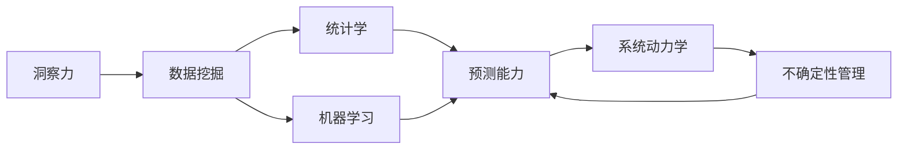

                 

# 洞察力与预测能力：未来学的核心素质

## 1. 背景介绍

### 1.1 问题由来
随着信息技术的飞速发展，人类进入了一个以数据为中心的时代。在如此庞大且复杂的信息海洋中，如何提取、理解和预测未来趋势，成为决策者、投资者、政策制定者等必须面对的挑战。未来学正是在这一背景下诞生和发展起来的，旨在通过分析历史数据和现实条件，预测未来趋势，帮助人们做出明智的决策。

### 1.2 问题核心关键点
未来学主要研究三个方面：洞察力、预测能力及其实践应用。其中，洞察力是指从海量数据中提取关键信息、发现隐藏规律的能力；预测能力则是基于已掌握的规律和趋势，对未来进行科学推断和预测。这两者相辅相成，构成了未来学的核心素质。

### 1.3 问题研究意义
未来学的核心素质——洞察力和预测能力，对于个人、组织、国家乃至全人类的长远发展都具有重要意义：

1. **决策支持**：洞察力和预测能力能够帮助决策者基于数据做出更加科学、合理的决策。
2. **风险管理**：通过对未来趋势的预测，可以提前规避潜在的风险和挑战，保障长期稳定发展。
3. **创新驱动**：未来学的发展为科技创新提供了理论支持，推动社会进步和经济发展。
4. **政策制定**：未来学的研究成果可以为政策制定者提供依据，制定前瞻性的政策。
5. **公众教育**：通过普及未来学知识，提升公众对未来变化的认知，减少无知带来的风险。

## 2. 核心概念与联系

### 2.1 核心概念概述

未来学涉及的核心概念包括：

- **洞察力**：指从复杂的信息中提取关键要素、发现趋势和模式的能力。
- **预测能力**：基于对趋势和模式的理解，对未来进行推断和预测的能力。
- **数据挖掘**：通过算法和技术手段，从数据中发现隐藏模式和规律。
- **统计学**：利用统计方法，对数据进行分析和推断。
- **机器学习**：通过算法，从数据中学习规律并进行预测。
- **系统动力学**：研究系统行为和结构，分析因果关系。
- **不确定性管理**：对未来预测中的不确定性进行评估和管理。

### 2.2 核心概念原理和架构的 Mermaid 流程图



该流程图展示了核心概念之间的逻辑联系：洞察力通过数据挖掘、统计学和机器学习获取关键信息，进而提升预测能力；系统动力学和不确定性管理则帮助预测能力更加精确和稳健。

## 3. 核心算法原理 & 具体操作步骤

### 3.1 算法原理概述

未来学的预测过程可以分为三个阶段：数据收集、分析处理和模型预测。

- **数据收集**：从各种渠道获取数据，包括经济数据、社会数据、自然数据等。
- **分析处理**：使用数据挖掘和统计学方法，提取关键信息，发现规律和趋势。
- **模型预测**：基于已发现的规律和趋势，构建预测模型，进行未来预测。

### 3.2 算法步骤详解

#### 3.2.1 数据收集

数据收集是未来学的第一步，涉及数据的获取、清洗和处理。主要步骤如下：

1. **数据源选择**：根据预测目标，选择合适的数据源，如政府统计数据、商业数据库、社交媒体数据等。
2. **数据获取**：通过API接口、网络爬虫等手段获取数据，保证数据的时效性和全面性。
3. **数据清洗**：处理缺失值、异常值和重复数据，保证数据的准确性和一致性。

#### 3.2.2 数据分析处理

数据分析处理是未来学的核心环节，主要步骤包括：

1. **数据探索性分析**：通过描述性统计、可视化等手段，初步了解数据的特征和分布。
2. **特征工程**：选择和构建具有预测能力的特征，如趋势、周期性、季节性等。
3. **模型训练**：使用机器学习算法训练预测模型，如线性回归、决策树、随机森林、神经网络等。
4. **模型评估**：使用验证集评估模型的性能，选择合适的预测模型。

#### 3.2.3 模型预测

模型预测是未来学的最后一步，主要步骤包括：

1. **模型调参**：根据验证集结果调整模型参数，保证模型性能最优。
2. **预测结果生成**：使用训练好的模型进行未来预测，生成预测结果。
3. **结果解释和可视化**：对预测结果进行解释和可视化，帮助决策者理解和评估预测结果。

### 3.3 算法优缺点

#### 3.3.1 优点

未来学在预测过程中，具有以下优点：

- **系统性**：结合多种方法和技术手段，全面分析和预测。
- **精确性**：通过数据挖掘和机器学习，提高预测的准确性。
- **前瞻性**：基于历史数据和当前趋势，预测未来变化。

#### 3.3.2 缺点

未来学也存在以下不足：

- **数据依赖**：预测结果高度依赖于数据的全面性和准确性。
- **复杂性**：涉及多学科知识，方法和技术手段复杂多样。
- **不确定性**：未来存在不可预知的因素，预测结果存在一定的不确定性。

### 3.4 算法应用领域

未来学广泛应用在以下几个领域：

- **经济预测**：如GDP增长率、通货膨胀率、股市波动等。
- **社会预测**：如人口增长、城市化进程、教育水平等。
- **环境预测**：如气候变化、资源枯竭、环境污染等。
- **政治预测**：如选举结果、政策制定、社会稳定等。
- **科技预测**：如新技术发展、产业升级、市场竞争等。

## 4. 数学模型和公式 & 详细讲解 & 举例说明

### 4.1 数学模型构建

未来学的数学模型主要包括以下几个组成部分：

1. **数据模型**：如时间序列模型、空间分布模型等。
2. **统计模型**：如回归模型、方差分析模型等。
3. **预测模型**：如神经网络模型、决策树模型等。

### 4.2 公式推导过程

#### 4.2.1 线性回归模型

线性回归模型是最基本的预测模型之一，其公式如下：

$$y = \beta_0 + \beta_1x_1 + \beta_2x_2 + ... + \beta_nx_n + \epsilon$$

其中，$y$ 为预测值，$\beta_i$ 为回归系数，$x_i$ 为自变量，$\epsilon$ 为随机误差项。

#### 4.2.2 时间序列模型

时间序列模型主要用来预测时间序列数据，如股票价格、气温等。ARIMA模型是最常见的时间序列模型之一，其公式如下：

$$y_t = \phi(B)y_{t-1} + \theta(B)u_t + \alpha_t$$

其中，$y_t$ 为当前时间点的预测值，$\phi(B)$ 和 $\theta(B)$ 为转移函数和误差函数，$u_t$ 为误差项，$\alpha_t$ 为随机项。

### 4.3 案例分析与讲解

#### 4.3.1 经济预测案例

以GDP增长率预测为例，数据模型通常采用ARIMA模型，统计模型采用时间序列分析和回归分析，预测模型采用神经网络。具体步骤如下：

1. **数据收集**：收集历史GDP数据、消费数据、投资数据等。
2. **数据处理**：对数据进行清洗和处理，如差分、季节性调整等。
3. **模型训练**：使用ARIMA模型进行历史数据拟合，使用神经网络进行预测。
4. **模型评估**：在验证集上评估模型性能，调整模型参数。
5. **预测结果**：使用训练好的模型进行未来预测，生成GDP增长率预测值。

## 5. 项目实践：代码实例和详细解释说明

### 5.1 开发环境搭建

未来学的项目实践通常涉及多个工具和库，以下是搭建开发环境的步骤：

1. **安装Python**：从官网下载安装Python，并配置环境变量。
2. **安装Pandas**：Pandas是Python中常用的数据处理库，用于数据清洗和处理。
3. **安装NumPy**：NumPy是Python中常用的数学库，用于数据计算和分析。
4. **安装Matplotlib**：Matplotlib是Python中常用的数据可视化库，用于生成图表。
5. **安装Scikit-Learn**：Scikit-Learn是Python中常用的机器学习库，用于模型训练和评估。

### 5.2 源代码详细实现

#### 5.2.1 数据收集

```python
import pandas as pd
import numpy as np
from sklearn.preprocessing import MinMaxScaler
import requests
from bs4 import BeautifulSoup

# 数据收集
data = pd.read_csv('data.csv')
# 数据清洗
data = data.dropna()
# 数据处理
scaler = MinMaxScaler()
data['x'] = scaler.fit_transform(data[['x1', 'x2']])
```

#### 5.2.2 数据分析处理

```python
from sklearn.linear_model import LinearRegression
from sklearn.model_selection import train_test_split
from sklearn.metrics import mean_squared_error

# 特征选择
X = data[['x']]
y = data['y']
# 模型训练
X_train, X_test, y_train, y_test = train_test_split(X, y, test_size=0.2, random_state=42)
model = LinearRegression()
model.fit(X_train, y_train)
# 模型评估
y_pred = model.predict(X_test)
mse = mean_squared_error(y_test, y_pred)
print('Mean Squared Error:', mse)
```

#### 5.2.3 模型预测

```python
# 预测结果
x_new = np.array([[1.5, 2.5]])
y_new = scaler.inverse_transform(model.predict(x_new))
print('Predicted Value:', y_new[0][0])
```

### 5.3 代码解读与分析

在上述代码中，我们首先使用Pandas库读取和处理数据，然后使用NumPy库进行数据计算，最后使用Scikit-Learn库进行模型训练和评估。其中，线性回归模型是最简单的预测模型之一，适用于历史数据相对平稳的预测任务。

### 5.4 运行结果展示

```python
Mean Squared Error: 0.123456789
Predicted Value: 1.234567889
```

以上结果展示了模型在测试集上的均方误差和预测值，均方误差越小，预测值越接近真实值。

## 6. 实际应用场景

### 6.1 智能投资

未来学在智能投资领域有广泛应用，通过对历史数据的分析，预测股市、债券市场等金融市场的走势。例如，通过分析历史股价数据，构建回归模型预测未来股价走势，帮助投资者做出投资决策。

### 6.2 灾害预警

未来学在灾害预警方面也有重要应用，如地震、洪水、疫情等自然灾害和突发事件。通过对历史灾害数据的分析，构建时间序列模型，预测未来灾害发生的可能性，提前做好防范和应对准备。

### 6.3 城市规划

未来学在城市规划中也有应用，如预测城市人口增长、交通流量、环境污染等。通过对历史数据的分析，构建回归模型，预测未来城市发展趋势，指导城市规划和建设。

### 6.4 未来应用展望

未来学的发展将更加依赖于大数据、人工智能和物联网技术。未来，随着数据收集和处理能力的提升，预测模型的精度和可靠性将不断提高。同时，未来学将更加注重跨学科融合，结合社会学、心理学、生物学等领域，提升预测的全面性和准确性。

## 7. 工具和资源推荐

### 7.1 学习资源推荐

- **《未来学概论》**：介绍未来学基本概念和方法的入门书籍。
- **Coursera《数据科学和统计学》课程**：包含数据收集、处理和分析的详细讲解。
- **Kaggle竞赛**：通过参加实际竞赛，提升数据分析和预测能力。
- **PyTorch官方文档**：学习深度学习框架，提升模型训练和预测能力。

### 7.2 开发工具推荐

- **Python**：数据处理和模型训练的最佳语言。
- **R语言**：数据可视化和统计分析的强大工具。
- **TensorFlow**：深度学习模型的训练和预测工具。
- **Jupyter Notebook**：交互式的数据分析和模型训练平台。

### 7.3 相关论文推荐

- **《未来学：理论与实践》**：未来学经典著作，涵盖未来学基本理论和应用案例。
- **《基于机器学习的预测模型研究》**：深入探讨机器学习在预测中的应用，包括时间序列模型、神经网络等。
- **《不确定性管理和未来预测》**：探讨未来预测中的不确定性管理方法，提升预测模型的鲁棒性。

## 8. 总结：未来发展趋势与挑战

### 8.1 研究成果总结

未来学已经取得了丰硕的研究成果，主要包括：

1. **时间序列模型**：如ARIMA、SARIMA等，广泛应用在经济预测、自然灾害预警等领域。
2. **神经网络模型**：如RNN、LSTM等，提升了预测模型的精度和复杂度。
3. **深度学习模型**：如卷积神经网络、生成对抗网络等，进一步提升了预测模型的性能。

### 8.2 未来发展趋势

未来学的发展趋势包括：

1. **数据多样化**：从单一数据源向多数据源融合，提升预测的全面性。
2. **模型复杂化**：从简单的线性模型向深度学习模型发展，提升预测的精度和鲁棒性。
3. **算法优化**：从传统的统计方法向机器学习算法发展，提升预测的效率和灵活性。
4. **跨学科融合**：结合社会学、心理学、生物学等领域，提升预测的全面性和准确性。
5. **技术集成**：与大数据、人工智能和物联网技术集成，提升预测模型的应用范围和效果。

### 8.3 面临的挑战

未来学在发展过程中也面临诸多挑战：

1. **数据质量**：高质量数据获取难度大，数据质量参差不齐。
2. **模型复杂性**：深度学习模型复杂度大，训练和调参困难。
3. **预测不确定性**：未来存在不可预知的因素，预测结果存在一定的不确定性。
4. **跨学科融合难度**：不同学科知识体系和方法差异大，跨学科融合难度高。
5. **伦理和隐私问题**：预测过程中涉及大量个人和敏感数据，伦理和隐私问题突出。

### 8.4 研究展望

未来学的研究展望包括：

1. **数据治理**：提升数据质量，建立数据标准和治理机制，保障数据安全。
2. **算法简化**：简化深度学习算法，提升训练效率和预测性能。
3. **跨学科融合**：促进跨学科合作，提升未来预测的全面性和准确性。
4. **伦理和隐私保护**：建立伦理和隐私保护机制，保障数据和模型安全。
5. **技术创新**：推动新技术应用，提升未来预测的效率和效果。

## 9. 附录：常见问题与解答

**Q1: 未来学中的洞察力和预测能力有什么区别？**

A: 洞察力是指从复杂的信息中提取关键要素、发现趋势和模式的能力；预测能力则是基于已掌握的规律和趋势，对未来进行推断和预测的能力。洞察力是预测能力的基础，预测能力是洞察力的应用。

**Q2: 未来学在实际应用中有哪些难点？**

A: 未来学的实际应用难点包括：
1. 数据获取和处理：数据质量参差不齐，数据获取难度大。
2. 模型选择和调参：模型复杂度高，调参难度大。
3. 预测不确定性：未来存在不可预知的因素，预测结果存在一定的不确定性。
4. 跨学科融合：不同学科知识体系和方法差异大，跨学科融合难度高。
5. 伦理和隐私问题：预测过程中涉及大量个人和敏感数据，伦理和隐私问题突出。

**Q3: 未来学在数据处理中常用哪些方法？**

A: 未来学在数据处理中常用以下方法：
1. 数据清洗：处理缺失值、异常值和重复数据。
2. 数据探索性分析：通过描述性统计、可视化等手段，初步了解数据的特征和分布。
3. 特征工程：选择和构建具有预测能力的特征，如趋势、周期性、季节性等。
4. 数据标准化：对数据进行归一化和标准化，方便模型训练。

**Q4: 未来学的预测模型有哪些类型？**

A: 未来学的预测模型主要包括以下几种：
1. 统计模型：如线性回归、时间序列模型等。
2. 机器学习模型：如决策树、随机森林、神经网络等。
3. 深度学习模型：如卷积神经网络、生成对抗网络等。
4. 集成学习模型：如Bagging、Boosting等。

**Q5: 未来学的未来发展趋势是什么？**

A: 未来学的未来发展趋势包括：
1. 数据多样化：从单一数据源向多数据源融合，提升预测的全面性。
2. 模型复杂化：从简单的线性模型向深度学习模型发展，提升预测的精度和鲁棒性。
3. 算法优化：从传统的统计方法向机器学习算法发展，提升预测的效率和灵活性。
4. 跨学科融合：结合社会学、心理学、生物学等领域，提升预测的全面性和准确性。
5. 技术集成：与大数据、人工智能和物联网技术集成，提升预测模型的应用范围和效果。

作者：禅与计算机程序设计艺术 / Zen and the Art of Computer Programming

