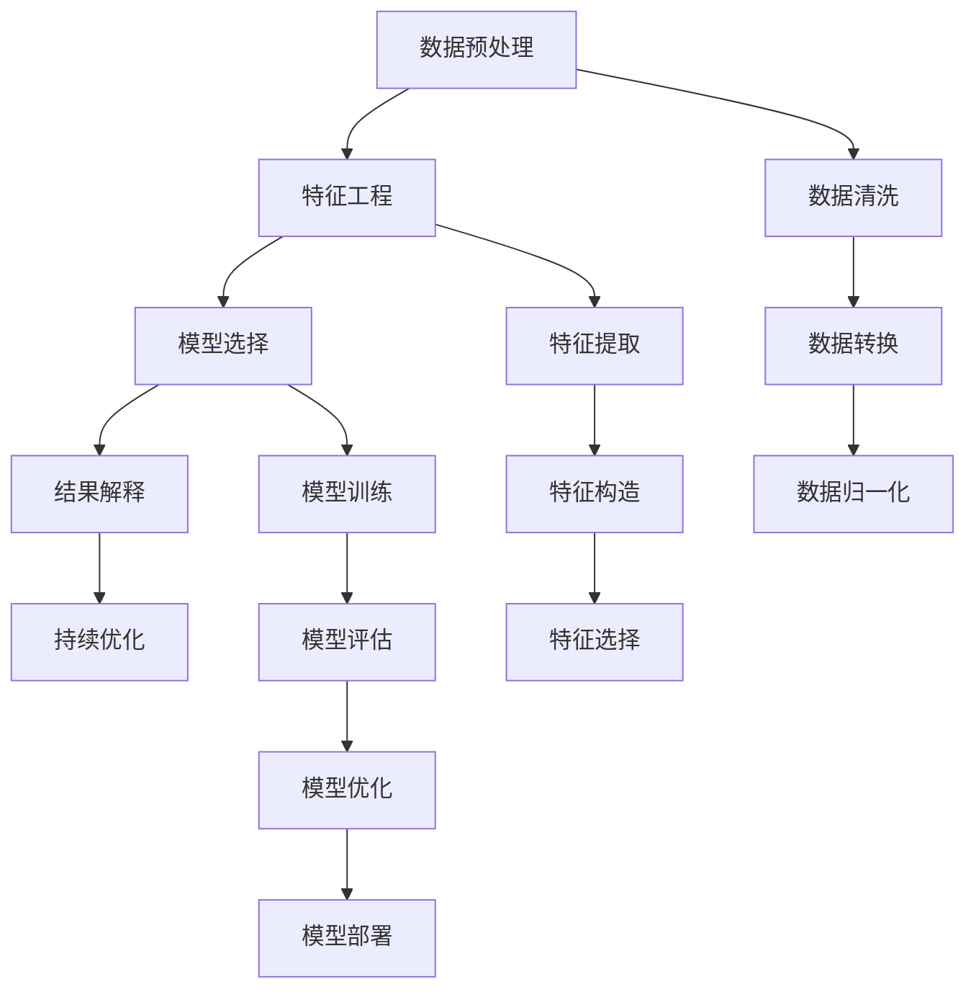

                 

# 洞察力训练：提升观察和分析能力

在当今数据驱动的世界中，洞察力（Insight）的获取与分析能力成为了企业竞争的关键。洞察力训练（Insight Training）是一种系统化的过程，旨在通过科学的方法和工具提升观察和分析的能力。本文将深入探讨洞察力训练的核心概念、算法原理、操作步骤以及实际应用场景，并分享一些具体的技术实现和开发工具推荐，以期帮助读者系统地掌握这一关键能力。

## 1. 背景介绍

### 1.1 问题由来

随着大数据和人工智能技术的飞速发展，数据的积累和处理能力达到了前所未有的水平。然而，数据本身并不能直接转化为洞察力，这需要依赖于高级的数据分析和建模能力。在实际应用中，洞察力训练成为了企业提高决策效率和竞争力的重要工具。

洞察力训练的核心在于从海量数据中提取有价值的信息，并进行系统的分析和建模，最终转化为对实际问题的深刻理解和解决方案。这一过程不仅需要高效的数据处理和分析工具，更需要具备数据洞察力的专业人才。

### 1.2 问题核心关键点

洞察力训练主要包括以下几个关键点：
- **数据预处理**：清洗、转换和归一化数据，确保分析的准确性。
- **特征工程**：提取和构造有意义的特征，提高模型的预测能力。
- **模型选择**：选择合适的模型算法，以适应不同的分析任务。
- **结果解释**：通过可视化和解释工具，将模型结果转化为易于理解的形式。
- **持续优化**：基于实际结果不断调整模型和参数，提升分析效果。

## 2. 核心概念与联系

### 2.1 核心概念概述

洞察力训练涉及多个核心概念，这些概念通过一系列紧密相连的步骤实现从数据到洞察力的转化：

- **数据预处理**：通过清洗、转换和归一化数据，确保分析的准确性。
- **特征工程**：提取和构造有意义的特征，提高模型的预测能力。
- **模型选择**：选择合适的模型算法，以适应不同的分析任务。
- **结果解释**：通过可视化和解释工具，将模型结果转化为易于理解的形式。
- **持续优化**：基于实际结果不断调整模型和参数，提升分析效果。

### 2.2 核心概念原理和架构的 Mermaid 流程图



这个流程图展示了洞察力训练的主要流程：从原始数据开始，经过一系列预处理、特征工程、模型选择和结果解释，最终进入持续优化的循环，形成闭环的数据洞察力提升过程。

## 3. 核心算法原理 & 具体操作步骤

### 3.1 算法原理概述

洞察力训练的算法原理可以概括为以下几个步骤：

1. **数据预处理**：通过清洗、转换和归一化数据，确保分析的准确性。
2. **特征工程**：提取和构造有意义的特征，提高模型的预测能力。
3. **模型选择**：选择合适的模型算法，以适应不同的分析任务。
4. **结果解释**：通过可视化和解释工具，将模型结果转化为易于理解的形式。
5. **持续优化**：基于实际结果不断调整模型和参数，提升分析效果。

### 3.2 算法步骤详解

#### 3.2.1 数据预处理

数据预处理是洞察力训练的第一步，主要包括以下几个环节：

- **数据清洗**：去除或修正数据中的错误、缺失值和不一致。
- **数据转换**：将数据从一种形式转换为另一种形式，便于后续分析。例如，将日期数据转换为时间戳，将文本数据转换为向量表示。
- **数据归一化**：将不同尺度的数据转换为同一尺度，避免某些特征对分析结果的过大影响。

#### 3.2.2 特征工程

特征工程是指从原始数据中提取和构造有意义的特征，以便更好地进行分析和建模。主要步骤包括：

- **特征提取**：使用统计、工程或机器学习方法从原始数据中提取特征，如平均值、方差、主成分等。
- **特征构造**：通过组合、变换等方法构造新的特征，如交叉项、多项式特征等。
- **特征选择**：选择最相关的特征进行建模，减少过拟合风险。

#### 3.2.3 模型选择

模型选择是指从多种算法中选择最适合当前任务和数据的模型。常见的模型包括线性回归、逻辑回归、决策树、随机森林、支持向量机、神经网络等。选择模型时，需要考虑数据特性、任务目标、计算资源等因素。

#### 3.2.4 结果解释

结果解释是将模型输出转化为易于理解的形式，以便进行可视化和报告。常见的解释方法包括特征重要性分析、局部解释模型、部分依赖图等。

#### 3.2.5 持续优化

持续优化是指基于实际结果不断调整模型和参数，以提升分析效果。常见的优化方法包括网格搜索、随机搜索、贝叶斯优化等。

### 3.3 算法优缺点

洞察力训练的优点包括：

- **灵活性高**：适用于多种数据类型和分析任务。
- **效果显著**：通过科学的方法和工具，可以显著提升分析结果的准确性和可靠性。
- **可解释性强**：通过可视化和解释工具，使分析结果更易于理解和应用。

然而，洞察力训练也存在一些缺点：

- **计算资源消耗大**：需要大量计算资源进行数据处理和模型训练。
- **技能要求高**：需要具备数据科学、机器学习等相关知识。
- **结果解释难度大**：复杂的模型结果可能难以解释，影响实际应用。

### 3.4 算法应用领域

洞察力训练在多个领域得到了广泛应用，包括但不限于：

- **金融风险管理**：通过数据分析识别金融市场的风险和机会。
- **医疗诊断和治疗**：利用医疗数据进行疾病诊断和治疗方案优化。
- **市场营销**：分析消费者行为，优化产品和服务。
- **物流优化**：通过数据分析优化物流链条，提高效率。
- **供应链管理**：分析供应链数据，优化资源配置和库存管理。

## 4. 数学模型和公式 & 详细讲解

### 4.1 数学模型构建

洞察力训练的数学模型构建主要包括以下几个步骤：

1. **数据表示**：将原始数据表示为向量或矩阵形式。
2. **特征表示**：将特征表示为向量或矩阵形式。
3. **模型表示**：选择合适的模型，如线性回归、神经网络等，并表示为数学公式。

### 4.2 公式推导过程

以线性回归为例，其数学模型可以表示为：

$$ y = \beta_0 + \beta_1 x_1 + \beta_2 x_2 + ... + \beta_p x_p + \epsilon $$

其中 $y$ 表示目标变量，$\beta_0$ 表示截距，$\beta_1, \beta_2, ..., \beta_p$ 表示特征系数，$x_1, x_2, ..., x_p$ 表示特征变量，$\epsilon$ 表示误差项。

### 4.3 案例分析与讲解

假设我们有一个房屋销售数据集，目标是预测房屋销售价格。通过数据预处理、特征工程和模型训练，我们可以得到一个线性回归模型。

首先，进行数据清洗和转换，将原始数据中的缺失值和异常值去除，并将日期转换为时间戳。接着，进行特征工程，提取房屋面积、地理位置、房屋状况等特征。最后，使用线性回归模型进行训练和预测，得到房屋价格的预测值。

## 5. 项目实践：代码实例和详细解释说明

### 5.1 开发环境搭建

在开始实践前，需要先搭建开发环境。常用的工具包括Python、R、Scikit-learn、TensorFlow等。以下是一个简单的Python环境搭建步骤：

1. 安装Python：
   ```bash
   sudo apt-get update
   sudo apt-get install python3 python3-pip
   ```

2. 安装必要的库：
   ```bash
   pip install pandas numpy scikit-learn matplotlib
   ```

### 5.2 源代码详细实现

以下是一个简单的线性回归模型的Python实现：

```python
import pandas as pd
from sklearn.linear_model import LinearRegression
from sklearn.metrics import mean_squared_error

# 加载数据
data = pd.read_csv('house_prices.csv')

# 数据预处理
data = data.dropna()
data['date'] = pd.to_datetime(data['date']).apply(lambda x: x.year)
X = data[['area', 'location', 'condition']]
y = data['price']

# 特征工程
X = pd.get_dummies(X)

# 模型训练
model = LinearRegression()
model.fit(X, y)

# 模型评估
y_pred = model.predict(X)
mse = mean_squared_error(y, y_pred)
print(f'Mean Squared Error: {mse}')
```

### 5.3 代码解读与分析

以上代码实现了从数据加载、预处理、特征工程、模型训练到模型评估的全流程。首先，使用Pandas加载数据，然后进行数据清洗和转换。接着，进行特征工程，将分类特征转换为哑变量。最后，使用线性回归模型进行训练和预测，并计算模型误差。

## 6. 实际应用场景

### 6.1 金融风险管理

金融风险管理是洞察力训练的重要应用场景之一。通过分析历史交易数据和市场趋势，洞察力训练可以帮助金融机构识别潜在的风险和机会，优化投资决策。

例如，可以使用洞察力训练对历史交易数据进行分析，识别出高风险的投资行为和市场异常，从而制定相应的风险管理策略。

### 6.2 医疗诊断和治疗

医疗诊断和治疗也是洞察力训练的重要应用领域。通过分析患者的电子病历和实验室检测数据，洞察力训练可以帮助医生进行精准诊断和治疗方案优化。

例如，可以使用洞察力训练分析患者的症状和病史，预测疾病的发生概率，并推荐最佳的治疗方案。

### 6.3 市场营销

市场营销是洞察力训练的另一个重要应用场景。通过分析消费者的购买行为和偏好，洞察力训练可以帮助企业优化产品和服务，提升用户体验和市场竞争力。

例如，可以使用洞察力训练分析消费者的购买历史和行为数据，识别出高价值客户和潜在客户，从而进行精准营销。

### 6.4 物流优化

物流优化也是洞察力训练的重要应用场景之一。通过分析物流链条中的各项数据，洞察力训练可以帮助企业优化资源配置和运输路线，提高物流效率。

例如，可以使用洞察力训练分析物流链条中的数据，识别出运输瓶颈和效率低下的环节，从而进行优化。

### 6.5 供应链管理

供应链管理也是洞察力训练的重要应用场景之一。通过分析供应链中的各项数据，洞察力训练可以帮助企业优化资源配置和库存管理，降低成本，提高效率。

例如，可以使用洞察力训练分析供应链中的数据，识别出库存不足和过量的问题，从而进行优化。

## 7. 工具和资源推荐

### 7.1 学习资源推荐

1. **Coursera**：提供多种数据分析和机器学习的课程，涵盖从基础到高级的内容。
2. **Kaggle**：提供大量公开数据集和竞赛，实践数据分析和机器学习技能。
3. **DataCamp**：提供交互式的学习平台，涵盖数据科学和机器学习的各种工具和技术。
4. **Udacity**：提供多种数据分析和机器学习的纳米学位课程，涵盖从基础到高级的内容。

### 7.2 开发工具推荐

1. **Python**：Python是数据分析和机器学习的主流语言，拥有丰富的第三方库和框架。
2. **R**：R是统计分析和数据科学的主流语言，拥有丰富的数据分析库。
3. **Jupyter Notebook**：Jupyter Notebook是一个交互式的数据分析和编程环境，支持Python和R等语言。
4. **Tableau**：Tableau是一个数据可视化的工具，支持多种数据源和图表类型。
5. **Power BI**：Power BI是微软的数据可视化工具，支持多种数据源和报表生成。

### 7.3 相关论文推荐

1. **《数据分析与统计建模》**：这是一本介绍数据分析和统计建模的入门书籍，适合初学者阅读。
2. **《机器学习实战》**：这是一本介绍机器学习算法和实现方法的书，适合实战练习。
3. **《Python数据科学手册》**：这是一本介绍Python数据科学库和方法的书籍，适合进阶学习。
4. **《深度学习》**：这是一本介绍深度学习理论和实践的书籍，适合深入学习。

## 8. 总结：未来发展趋势与挑战

### 8.1 研究成果总结

洞察力训练已经取得了显著的成果，特别是在金融、医疗、市场营销等领域得到了广泛应用。然而，仍然存在一些挑战需要解决：

1. **数据质量**：数据质量直接影响到分析结果的准确性和可靠性。需要进一步提升数据质量和清洗能力。
2. **模型复杂度**：复杂模型虽然能够提高分析效果，但难以解释，影响实际应用。需要进一步优化模型解释方法。
3. **计算资源消耗**：大规模数据分析和模型训练需要大量计算资源，需要进一步优化计算效率。

### 8.2 未来发展趋势

未来洞察力训练的发展趋势包括：

1. **自动化**：进一步提升数据分析和模型训练的自动化水平，减少人工干预。
2. **可解释性**：提高模型的可解释性，增强结果的可信度。
3. **跨领域应用**：拓展洞察力训练的应用领域，提升各行各业的决策效率。
4. **持续学习**：基于实际结果不断调整模型和参数，提升分析效果。

### 8.3 面临的挑战

洞察力训练面临的挑战包括：

1. **数据质量**：数据质量直接影响到分析结果的准确性和可靠性。需要进一步提升数据质量和清洗能力。
2. **模型复杂度**：复杂模型虽然能够提高分析效果，但难以解释，影响实际应用。需要进一步优化模型解释方法。
3. **计算资源消耗**：大规模数据分析和模型训练需要大量计算资源，需要进一步优化计算效率。

### 8.4 研究展望

未来的研究方向包括：

1. **自动化数据分析**：进一步提升数据分析和模型训练的自动化水平，减少人工干预。
2. **可解释性增强**：提高模型的可解释性，增强结果的可信度。
3. **跨领域应用拓展**：拓展洞察力训练的应用领域，提升各行各业的决策效率。
4. **持续学习优化**：基于实际结果不断调整模型和参数，提升分析效果。

## 9. 附录：常见问题与解答

**Q1: 什么是洞察力训练？**

A: 洞察力训练是一种系统化的过程，通过科学的方法和工具提升观察和分析能力，从海量数据中提取有价值的信息，并进行系统的分析和建模，最终转化为对实际问题的深刻理解和解决方案。

**Q2: 洞察力训练的流程是什么？**

A: 洞察力训练的流程包括数据预处理、特征工程、模型选择、结果解释和持续优化。

**Q3: 洞察力训练的优点和缺点是什么？**

A: 洞察力训练的优点包括灵活性高、效果显著、可解释性强。缺点包括计算资源消耗大、技能要求高、结果解释难度大。

**Q4: 洞察力训练在哪些领域得到应用？**

A: 洞察力训练在金融、医疗、市场营销、物流优化、供应链管理等多个领域得到应用。

**Q5: 洞察力训练的工具和资源有哪些？**

A: 常用的工具包括Python、R、Jupyter Notebook、Tableau、Power BI等。常用的学习资源包括Coursera、Kaggle、DataCamp、Udacity等。

作者：禅与计算机程序设计艺术 / Zen and the Art of Computer Programming

