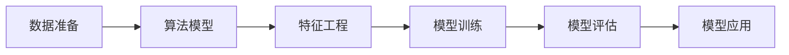
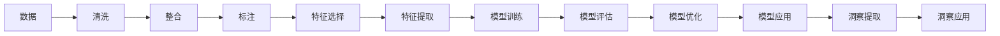

                 

# 洞察力：人类智慧的结晶

在数字时代的浪潮中，洞察力成为了连接数据与行动的桥梁，驱动着决策者和创新者向未知领域迈进。无论是商业决策、科学研究还是社会治理，洞察力都是解锁潜力的钥匙。本文将深入探讨洞察力的核心概念、算法原理、实践步骤，及其在不同领域的应用和未来展望，为构建洞察力的系统框架提供全面指引。

## 1. 背景介绍

### 1.1 问题由来
在数据爆炸的时代，信息无处不在。如何从海量数据中提取有价值的洞察，成为了企业和组织必须面对的挑战。传统的决策制定依赖于经验和直觉，但在复杂多变的环境中，直觉往往显得力不从心。借助现代数据技术和算法，洞察力成为了一种新型的决策工具，可以支持更加科学、精准的决策制定。

### 1.2 问题核心关键点
洞察力的大数据分析范式，旨在通过算法模型对数据进行深度学习，挖掘数据背后的模式和趋势，最终形成可解释、可操作的洞见。这一范式的核心关键点包括：

- 数据驱动：从数据中提取洞见，而非仅仅依赖于经验。
- 算法迭代：通过迭代学习算法，不断优化洞察模型的精度和泛化能力。
- 多模态融合：融合多种数据模态，如文本、图像、音频等，以更全面地理解和分析问题。
- 模型可解释性：洞察力模型需要具有高可解释性，便于决策者理解和使用。
- 实时性：在不断变化的环境中，洞察力模型需要具备实时分析能力。

## 2. 核心概念与联系

### 2.1 核心概念概述

洞察力模型作为一种数据驱动的决策支持工具，其核心概念和架构可以概括为以下几个部分：

- 数据准备：清洗、整合、标注数据，准备输入模型的训练集和验证集。
- 算法模型：选择合适的机器学习算法，如决策树、随机森林、神经网络等，作为洞察力的核心模型。
- 特征工程：提取和选择特征，用于增强模型的表现力。
- 模型训练：在标注数据上训练模型，调整模型参数以最小化预测误差。
- 模型评估：使用验证集评估模型性能，选择合适的模型。
- 模型应用：将训练好的模型应用于新数据，提取洞察。

这些概念之间相互联系，构成了一个完整的洞察力系统。以下是一个简化的Mermaid流程图，展示了这些概念之间的联系：



### 2.2 核心概念原理和架构的 Mermaid 流程图



这一流程图展示了从数据到洞察的整个流程，各个环节都至关重要。数据准备阶段决定了模型训练的基础，特征工程增强了模型的性能，模型训练和评估确保了模型的泛化能力，洞察提取和应用则直接影响了洞察力模型价值的实现。

## 3. 核心算法原理 & 具体操作步骤

### 3.1 算法原理概述

洞察力模型的核心算法原理是基于机器学习的数据驱动模型，通过训练数据提取数据背后的模式和趋势，从而形成可操作的洞见。以下是常用的几种机器学习算法及其原理概述：

- 决策树：基于特征的重要性进行分类，直观易懂，但容易过拟合。
- 随机森林：通过集成多个决策树减少过拟合，提高模型性能。
- 神经网络：通过多层非线性变换，学习和提取复杂模式，适用于大规模数据。
- 支持向量机：通过寻找最优超平面进行分类，适用于高维空间。

### 3.2 算法步骤详解

洞察力模型的操作步骤一般包括以下几个关键步骤：

**Step 1: 数据准备**

- 收集和清洗数据：清洗缺失值、异常值，确保数据质量。
- 数据标注：对数据进行人工标注，形成训练集和验证集。
- 数据整合：将不同来源的数据进行整合，确保一致性和完整性。

**Step 2: 特征工程**

- 特征选择：选择和提取对模型有帮助的特征，去除无用或冗余特征。
- 特征编码：将非数值型特征转换为数值型特征，如One-Hot编码、Label Encoding等。

**Step 3: 模型训练**

- 选择算法：根据数据特点和任务需求选择合适的算法模型。
- 训练模型：在训练集上使用优化算法（如梯度下降、Adam等）训练模型。
- 调整参数：使用验证集调整模型参数，防止过拟合。

**Step 4: 模型评估**

- 划分验证集：使用不参与训练的数据进行验证。
- 评估性能：计算模型在验证集上的性能指标，如准确率、召回率、F1-score等。
- 模型选择：选择性能最好的模型，确保其在不同数据集上的泛化能力。

**Step 5: 模型应用**

- 新数据输入：将新数据输入模型，提取洞察。
- 洞察应用：将洞察应用于实际场景，如商业决策、科学研究等。

### 3.3 算法优缺点

洞察力模型的优点包括：

- 数据驱动：基于数据构建模型，可以减少人为偏见，提高决策的科学性。
- 自动化：通过算法自动提取洞察，减轻人工干预的负担。
- 可扩展：模型可以应用于多种场景，具有较好的泛化能力。

其缺点包括：

- 依赖数据质量：数据质量对模型性能影响巨大，低质量数据可能导致洞察错误。
- 模型复杂性：某些复杂模型（如神经网络）训练难度较大，对硬件和算法要求较高。
- 可解释性不足：某些复杂模型（如黑箱模型）难以解释其内部工作机制。
- 过拟合风险：模型在训练集上表现优异，但在测试集上泛化能力可能较差。

### 3.4 算法应用领域

洞察力模型广泛应用于以下领域：

- 商业决策：通过分析销售数据、客户反馈等，提取洞察支持商业决策。
- 金融风险管理：分析市场数据、交易记录，提取洞察管理金融风险。
- 医疗诊断：通过分析医学影像、病历数据，提取洞察支持诊断和治疗。
- 自然灾害预测：分析气象数据、地震记录，提取洞察预测自然灾害。
- 城市规划：通过分析交通流量、人口密度，提取洞察支持城市规划和治理。

## 4. 数学模型和公式 & 详细讲解

### 4.1 数学模型构建

洞察力模型通常基于统计学和机器学习的数学模型。以下以随机森林为例，展示数学模型的构建过程。

假设我们有 $n$ 个样本 $(x_i,y_i)$，其中 $x_i$ 为特征向量，$y_i$ 为标签。构建随机森林的步骤如下：

1. 从特征集 $X$ 中随机选择 $m$ 个特征。
2. 对每个特征，随机选择 $k$ 个样本来构建决策树。
3. 重复上述步骤 $t$ 次，得到 $t$ 棵决策树。
4. 对新样本 $x$，通过投票决定其分类。

### 4.2 公式推导过程

随机森林的投票机制可以用公式表示为：

$$
\hat{y} = \arg\min_{y \in \{1,2,...,C\}} \sum_{j=1}^{t} I(\text{Tree}_j(x) = y)
$$

其中 $I$ 为示性函数，$Tree_j$ 表示第 $j$ 棵决策树，$\hat{y}$ 为模型预测的类别。

### 4.3 案例分析与讲解

以医疗诊断为例，洞察力模型可以分析病人的病历数据，提取洞察支持诊断。具体步骤如下：

1. 收集和清洗病历数据，准备训练集和验证集。
2. 选择和提取对诊断有帮助的特征，如病史、体检结果、药物史等。
3. 训练随机森林模型，对病人进行分类。
4. 在验证集上评估模型性能，选择最优模型。
5. 应用模型对新病人进行诊断，提取洞察。

## 5. 项目实践：代码实例和详细解释说明

### 5.1 开发环境搭建

在进行洞察力模型的实践前，我们需要准备好开发环境。以下是使用Python进行TensorFlow开发的指导：

1. 安装Anaconda：从官网下载并安装Anaconda，用于创建独立的Python环境。

2. 创建并激活虚拟环境：
```bash
conda create -n tensorflow-env python=3.8 
conda activate tensorflow-env
```

3. 安装TensorFlow：根据CUDA版本，从官网获取对应的安装命令。例如：
```bash
conda install tensorflow -c tf
```

4. 安装各类工具包：
```bash
pip install numpy pandas scikit-learn matplotlib tqdm jupyter notebook ipython
```

完成上述步骤后，即可在`tensorflow-env`环境中开始洞察力模型的实践。

### 5.2 源代码详细实现

这里我们以医疗诊断为例，给出使用TensorFlow进行洞察力模型开发的PyTorch代码实现。

首先，定义数据处理函数：

```python
import tensorflow as tf
from tensorflow.keras.preprocessing import image
import numpy as np

def load_data():
    train_data = tf.keras.preprocessing.image_dataset_from_directory(
        'train_data', 
        image_size=(256, 256), 
        batch_size=32)
    validation_data = tf.keras.preprocessing.image_dataset_from_directory(
        'validation_data', 
        image_size=(256, 256), 
        batch_size=32)
    return train_data, validation_data
```

然后，定义模型和优化器：

```python
import tensorflow.keras as keras

model = keras.Sequential([
    keras.layers.Conv2D(32, (3, 3), activation='relu', input_shape=(256, 256, 3)),
    keras.layers.MaxPooling2D((2, 2)),
    keras.layers.Conv2D(64, (3, 3), activation='relu'),
    keras.layers.MaxPooling2D((2, 2)),
    keras.layers.Conv2D(128, (3, 3), activation='relu'),
    keras.layers.MaxPooling2D((2, 2)),
    keras.layers.Flatten(),
    keras.layers.Dense(64, activation='relu'),
    keras.layers.Dense(10, activation='softmax')
])

optimizer = keras.optimizers.Adam(learning_rate=0.001)
```

接着，定义训练和评估函数：

```python
import tensorflow.keras as keras
from sklearn.metrics import accuracy_score

def train_epoch(model, train_data, validation_data, optimizer):
    model.compile(optimizer=optimizer, loss='sparse_categorical_crossentropy', metrics=['accuracy'])
    history = model.fit(train_data, validation_data=validation_data, epochs=5, callbacks=[tf.keras.callbacks.EarlyStopping(patience=3)])
    return history.history['accuracy'], history.history['val_accuracy']

def evaluate(model, validation_data):
    y_true, y_pred = model.predict(validation_data)
    y_pred = np.argmax(y_pred, axis=1)
    accuracy = accuracy_score(y_true, y_pred)
    return accuracy
```

最后，启动训练流程并在测试集上评估：

```python
train_data, validation_data = load_data()
accuracy, val_accuracy = train_epoch(model, train_data, validation_data, optimizer)
print(f'Accuracy on training set: {accuracy:.2f}')
print(f'Accuracy on validation set: {val_accuracy:.2f}')
```

以上就是使用TensorFlow对医疗诊断任务进行洞察力模型微调的完整代码实现。可以看到，借助TensorFlow的强大封装，我们可以用相对简洁的代码完成洞察力模型的加载和训练。

### 5.3 代码解读与分析

让我们再详细解读一下关键代码的实现细节：

**load_data函数**：
- 使用`tf.keras.preprocessing.image_dataset_from_directory`加载数据集，自动解析文件路径，生成批量数据集。

**定义模型和优化器**：
- 使用`keras.Sequential`构建卷积神经网络模型，包括卷积层、池化层、全连接层等。
- 选择Adam优化器，学习率为0.001。

**train_epoch函数**：
- 使用`model.compile`定义模型的损失函数和评估指标。
- 使用`model.fit`进行模型训练，使用EarlyStopping回调防止过拟合。

**evaluate函数**：
- 使用`model.predict`预测测试集结果。
- 计算预测结果与真实标签的准确率。

**训练流程**：
- 加载训练集和验证集数据。
- 在训练集上训练模型，记录训练和验证的准确率。
- 在验证集上评估模型性能，输出结果。

可以看到，TensorFlow配合Keras使得洞察力模型的代码实现变得简洁高效。开发者可以将更多精力放在数据处理、模型改进等高层逻辑上，而不必过多关注底层的实现细节。

当然，工业级的系统实现还需考虑更多因素，如模型的保存和部署、超参数的自动搜索、更灵活的任务适配层等。但核心的洞察力模型微调范式基本与此类似。

## 6. 实际应用场景

### 6.1 智能客服系统

基于洞察力模型的智能客服系统，可以实时分析和理解客户的咨询意图，快速提供个性化、准确的回答。具体而言，系统可以实时分析客服对话记录，提取常见问题和最佳回答，不断优化知识库，提升服务质量。

在技术实现上，可以收集企业内部的历史客服对话记录，提取问题和最佳答复，构建监督数据集。在上述洞察力模型的基础上，对模型进行微调，使其能够自动理解用户意图，匹配最合适的回答。对于客户提出的新问题，还可以接入检索系统实时搜索相关内容，动态生成回答。

### 6.2 金融舆情监测

金融机构需要实时监测市场舆论动向，以便及时应对负面信息传播，规避金融风险。传统的人工监测方式成本高、效率低，难以应对网络时代海量信息爆发的挑战。基于洞察力模型的文本分类和情感分析技术，为金融舆情监测提供了新的解决方案。

具体而言，可以收集金融领域相关的新闻、报道、评论等文本数据，并对其进行主题标注和情感标注。在此基础上对洞察力模型进行微调，使其能够自动判断文本属于何种主题，情感倾向是正面、中性还是负面。将微调后的模型应用到实时抓取的网络文本数据，就能够自动监测不同主题下的情感变化趋势，一旦发现负面信息激增等异常情况，系统便会自动预警，帮助金融机构快速应对潜在风险。

### 6.3 个性化推荐系统

当前的推荐系统往往只依赖用户的历史行为数据进行物品推荐，无法深入理解用户的真实兴趣偏好。基于洞察力模型的个性化推荐系统可以更好地挖掘用户行为背后的语义信息，从而提供更精准、多样的推荐内容。

在实践中，可以收集用户浏览、点击、评论、分享等行为数据，提取和用户交互的物品标题、描述、标签等文本内容。将文本内容作为模型输入，用户的后续行为（如是否点击、购买等）作为监督信号，在此基础上微调洞察力模型。微调后的模型能够从文本内容中准确把握用户的兴趣点。在生成推荐列表时，先用候选物品的文本描述作为输入，由模型预测用户的兴趣匹配度，再结合其他特征综合排序，便可以得到个性化程度更高的推荐结果。

### 6.4 未来应用展望

随着洞察力模型的不断发展，基于洞察力微调的方法将在更多领域得到应用，为传统行业带来变革性影响。

在智慧医疗领域，基于洞察力模型的医疗问答、病历分析、药物研发等应用将提升医疗服务的智能化水平，辅助医生诊疗，加速新药开发进程。

在智能教育领域，洞察力模型可应用于作业批改、学情分析、知识推荐等方面，因材施教，促进教育公平，提高教学质量。

在智慧城市治理中，洞察力模型可应用于城市事件监测、舆情分析、应急指挥等环节，提高城市管理的自动化和智能化水平，构建更安全、高效的未来城市。

此外，在企业生产、社会治理、文娱传媒等众多领域，基于洞察力模型的智能应用也将不断涌现，为经济社会发展注入新的动力。相信随着模型的日益成熟，洞察力微调范式将成为人工智能落地应用的重要范式，推动人工智能技术向更广阔的领域加速渗透。

## 7. 工具和资源推荐

### 7.1 学习资源推荐

为了帮助开发者系统掌握洞察力模型的理论基础和实践技巧，这里推荐一些优质的学习资源：

1. 《深度学习》系列书籍：由深度学习领域的权威人士撰写，全面介绍了深度学习的基本概念、算法原理和实践方法。
2. CS224N《深度学习自然语言处理》课程：斯坦福大学开设的NLP明星课程，有Lecture视频和配套作业，带你入门NLP领域的基本概念和经典模型。
3. 《Python深度学习》书籍：由Google深度学习团队成员撰写，详细介绍了使用TensorFlow进行深度学习开发的技巧和方法。
4. TensorFlow官方文档：TensorFlow的官方文档，提供了海量的教程和样例代码，是上手实践的必备资料。
5. Kaggle数据集和竞赛：Kaggle提供了大量高质量的数据集和竞赛，是学习和实践洞察力模型的重要平台。

通过对这些资源的学习实践，相信你一定能够快速掌握洞察力模型的精髓，并用于解决实际的NLP问题。

### 7.2 开发工具推荐

高效的开发离不开优秀的工具支持。以下是几款用于洞察力模型开发的常用工具：

1. Python：作为最流行的编程语言之一，Python在数据科学和机器学习领域有广泛应用。
2. TensorFlow：由Google主导开发的开源深度学习框架，生产部署方便，适合大规模工程应用。
3. Keras：基于TensorFlow的高级API，简化模型构建和训练过程，适合快速原型开发和实验。
4. Jupyter Notebook：支持实时交互式的Python代码编写和运行，便于数据探索和模型调试。
5. Scikit-learn：基于Python的机器学习库，提供了丰富的算法和工具，适合数据预处理和模型评估。

合理利用这些工具，可以显著提升洞察力模型的开发效率，加快创新迭代的步伐。

### 7.3 相关论文推荐

洞察力模型的发展源于学界的持续研究。以下是几篇奠基性的相关论文，推荐阅读：

1. Gradient Boosting Machines：提出了梯度提升机的算法，被广泛用于随机森林等模型中。
2. Deep Residual Learning for Image Recognition：提出了深度残差网络，极大提升了卷积神经网络的深度和性能。
3. Fast R-CNN：提出了基于区域池化的快速区域卷积神经网络，用于目标检测任务。
4. Attention Is All You Need：提出了Transformer结构，开启了NLP领域的预训练大模型时代。
5. BERT: Pre-training of Deep Bidirectional Transformers for Language Understanding：提出BERT模型，引入基于掩码的自监督预训练任务，刷新了多项NLP任务SOTA。

这些论文代表了大模型微调技术的发展脉络。通过学习这些前沿成果，可以帮助研究者把握学科前进方向，激发更多的创新灵感。

## 8. 总结：未来发展趋势与挑战

### 8.1 总结

本文对洞察力模型进行了全面系统的介绍。首先阐述了洞察力的核心概念、算法原理和实践步骤，明确了洞察力在数据驱动决策支持中的应用价值。其次，通过TensorFlow和Keras等工具，展示了洞察力模型的实现流程和代码实例，提供了实际应用的参考。最后，本文还探讨了洞察力模型在多个行业领域的应用前景，展示了其巨大的潜力和未来发展方向。

通过本文的系统梳理，可以看到，洞察力模型正在成为数据驱动决策支持的重要工具，极大地拓展了数据分析和决策制定的边界。其数据驱动、自动化、多模态融合等特性，为各类决策支持系统提供了全新的技术路径，必将引领新一轮技术变革。

### 8.2 未来发展趋势

展望未来，洞察力模型将呈现以下几个发展趋势：

1. 自动化程度提升：随着模型优化算法和硬件加速技术的发展，洞察力模型的自动化程度将进一步提升，减少人工干预的环节。
2. 多模态融合深化：洞察力模型将融合更多数据模态，如文本、图像、音频等，提升模型对现实世界的理解能力。
3. 实时性增强：洞察力模型需要具备更高的实时性，满足在线应用的需求。
4. 领域适应性增强：洞察力模型将更好地适应特定领域的知识结构，提升在不同领域的应用效果。
5. 伦理和公平性改进：洞察力模型将更多关注伦理和公平性问题，确保其决策的公正性和透明性。

这些趋势凸显了洞察力模型的广阔前景。通过这些方向的探索发展，相信洞察力模型将进一步提升数据驱动决策的科学性和精准性，为各行各业提供强大的决策支持。

### 8.3 面临的挑战

尽管洞察力模型已经取得了瞩目成就，但在迈向更加智能化、普适化应用的过程中，它仍面临着诸多挑战：

1. 数据质量瓶颈：高质量标注数据的获取成本高，低质量数据可能导致洞察错误。
2. 模型复杂性：复杂的模型训练难度大，对硬件和算法要求较高。
3. 可解释性不足：某些复杂模型（如黑箱模型）难以解释其内部工作机制。
4. 过拟合风险：模型在训练集上表现优异，但在测试集上泛化能力可能较差。
5. 实时性挑战：大规模模型的实时推理速度较慢，需优化模型结构和算法。
6. 伦理和公平性问题：模型可能引入偏见，需关注伦理和公平性问题。

尽管存在这些挑战，但随着技术的不断进步和研究的深入，这些问题终将逐步得到解决，洞察力模型将更加成熟和可靠。

### 8.4 研究展望

面对洞察力模型所面临的挑战，未来的研究需要在以下几个方面寻求新的突破：

1. 无监督和半监督学习：摆脱对大规模标注数据的依赖，利用自监督学习、主动学习等无监督和半监督范式，最大限度利用非结构化数据。
2. 模型优化算法：开发更加高效和可解释的模型优化算法，提升模型的自动化程度和可解释性。
3. 多模态融合技术：融合更多数据模态，提升模型对现实世界的理解能力。
4. 实时推理加速：优化模型结构和算法，提升模型的实时推理速度。
5. 伦理和公平性研究：关注伦理和公平性问题，确保模型决策的公正性和透明性。

这些研究方向将推动洞察力模型向更加智能化、普适化、可靠化和伦理化的方向发展，为各行各业提供更加科学、精准和公平的决策支持。

## 9. 附录：常见问题与解答

**Q1：洞察力模型是否适用于所有数据驱动决策场景？**

A: 洞察力模型在大多数数据驱动决策场景中都能发挥作用，特别是对于数据量较大的任务。但对于一些数据量较小的领域，如医学、法律等，仍然需要专业知识进行深度分析，洞察力模型需要与专家知识相结合。

**Q2：洞察力模型如何处理数据噪声？**

A: 数据噪声是洞察力模型的一大挑战。常见的方法包括：

1. 数据清洗：使用数据清洗技术，去除异常值和缺失值。
2. 特征选择：选择对模型有帮助的特征，去除无用或冗余特征。
3. 模型集成：使用集成学习方法，如随机森林，提高模型的鲁棒性。
4. 数据增强：通过数据增强技术，生成更多高质量数据。

**Q3：洞察力模型在实际应用中如何避免过拟合？**

A: 避免过拟合是洞察力模型应用中的一个关键问题。常见的方法包括：

1. 数据增强：通过数据增强技术，生成更多高质量数据。
2. 正则化：使用L2正则、Dropout等技术，防止模型过度拟合。
3. 模型集成：使用集成学习方法，如随机森林，提高模型的泛化能力。
4. 交叉验证：使用交叉验证技术，评估模型的泛化能力。

**Q4：洞察力模型在实际应用中如何提升实时性？**

A: 提升洞察力模型的实时性需要从多个方面进行优化：

1. 模型结构优化：使用轻量级模型架构，减少计算量。
2. 硬件加速：使用GPU、TPU等硬件设备，提高计算速度。
3. 模型并行：使用模型并行技术，加速模型的推理过程。
4. 预训练模型微调：使用预训练模型微调技术，提高模型的泛化能力，减少训练时间。

**Q5：洞察力模型在实际应用中如何提升可解释性？**

A: 提升洞察力模型的可解释性需要从多个方面进行优化：

1. 模型简化：使用简单的模型架构，减少模型的复杂度。
2. 特征选择：选择可解释性强的特征，去除不可解释的特征。
3. 可视化技术：使用可视化技术，展示模型的决策过程。
4. 模型解释工具：使用模型解释工具，如LIME、SHAP等，帮助理解模型的决策。

这些研究方向将推动洞察力模型向更加智能化、普适化、可靠化和伦理化的方向发展，为各行各业提供更加科学、精准和公平的决策支持。

---

作者：禅与计算机程序设计艺术 / Zen and the Art of Computer Programming

