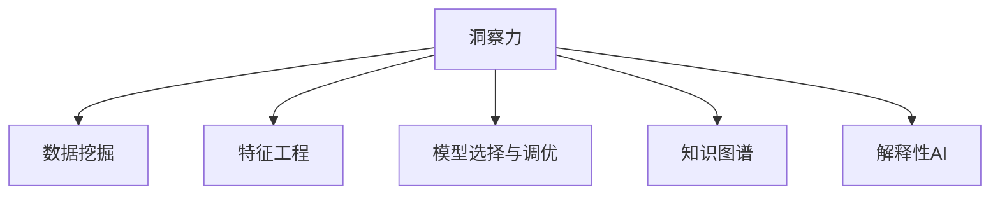

                 

# 洞察力：知识创新的驱动力

## 1. 背景介绍

### 1.1 问题由来
在当今信息爆炸的时代，数据与知识的形式和结构日趋复杂多样，从文字、图像到视频、音频，从静态数据到动态数据，再到用户行为数据，人类已经进入了一个“大爆炸”的知识时代。在这种背景下，如何从海量数据中提取、组织和利用知识，提升人类对世界的理解和认知，成为科技发展的核心任务。

知识的获取、组织和利用，不单纯依赖于技术手段，更需要深度理解和创新的洞察力。洞察力，即能够从复杂数据中识别、提炼和转化知识的能力，是驱动知识创新和应用的关键。本文将探讨洞察力的原理、方法和实践，助力人工智能和大数据时代下的知识创新。

### 1.2 问题核心关键点
洞察力的核心在于从数据中发现新的知识结构、趋势和关联，并将其转化为创新性的解决方案。其关键点在于：

1. **数据理解**：理解数据的语义、结构和背景，进行有效的数据预处理和特征工程。
2. **模式发现**：从数据中识别出潜在的模式、关联和趋势，这往往需要高度依赖于模型和算法。
3. **知识融合**：将不同来源和形式的知识进行融合，提升知识的广度和深度。
4. **解释和应用**：将知识转化为易于理解和应用的形式，推动知识创新和应用落地。

这些关键点共同构成了洞察力的工作原理，并指导着知识创新的方向。

## 2. 核心概念与联系

### 2.1 核心概念概述

为更好地理解洞察力的原理，本节将介绍几个密切相关的核心概念：

- **洞察力**：指能够从数据中发现新的知识结构、趋势和关联，并将其转化为创新性解决方案的能力。
- **数据挖掘**：指从原始数据中提取有价值的信息和知识的过程，是洞察力的基础。
- **特征工程**：指对数据进行预处理和特征提取，提升数据的质量和表现力。
- **模型选择与调优**：指选择最适合任务的模型，并通过参数调优等手段提高模型的表现。
- **知识图谱**：指通过图结构表示的知识网络，帮助理解和融合不同来源和形式的知识。
- **解释性AI**：指能够提供可解释性的模型和算法，帮助人类理解和信任AI决策。

这些核心概念之间的逻辑关系可以通过以下Mermaid流程图来展示：



这个流程图展示了一些核心概念之间的逻辑关系：

1. 洞察力以数据挖掘为基础，通过特征工程提升数据质量和表现力。
2. 模型选择与调优是洞察力的重要工具，用于发现数据中的模式和关联。
3. 知识图谱和解释性AI辅助洞察力的理解和应用，提供知识的融合与解释性。

这些概念共同构成了洞察力的基本框架，使我们从数据中提炼出有价值的知识，驱动创新应用。

## 3. 核心算法原理 & 具体操作步骤
### 3.1 算法原理概述

洞察力的实现基于数据挖掘、机器学习和人工智能等技术手段。其核心思想是：通过对数据的分析和理解，发现潜在的模式、关联和趋势，进而提炼出有价值的知识，推动知识创新。

形式化地，假设有一组数据 $D=\{(x_i,y_i)\}_{i=1}^N$，其中 $x_i$ 为输入特征，$y_i$ 为标签。洞察力的目标是从 $D$ 中发现模式和关联，构建新的知识模型 $M$。具体步骤如下：

1. **数据预处理**：对原始数据进行清洗、归一化和特征提取。
2. **模型选择**：选择合适的机器学习或深度学习模型，如决策树、随机森林、神经网络等。
3. **训练与调优**：使用 $D$ 进行模型训练，并通过参数调优等手段提升模型性能。
4. **知识发现**：从训练好的模型中提取新的知识结构，如关联规则、分类树、聚类结果等。
5. **知识应用**：将新知识转化为具体应用，如推荐系统、预测模型、决策支持系统等。

### 3.2 算法步骤详解

基于上述原理，本节将详细介绍洞察力的具体实现步骤：

**Step 1: 数据预处理**

数据预处理是洞察力的第一步，其主要目的是提高数据的质量和表现力。具体方法包括：

- 数据清洗：去除噪声、缺失值和异常值。
- 特征工程：对数据进行归一化、降维、编码等预处理，提升特征的表现力。
- 数据增强：通过数据增强技术，如合成数据、数据扩充等，丰富数据集。

**Step 2: 模型选择与调优**

选择合适的模型是洞察力的关键步骤。不同领域和任务适用的模型不同，一般根据以下原则选择：

- **任务类型**：回归、分类、聚类等任务分别对应不同的模型。
- **数据特征**：数据的结构、分布和规模会影响模型选择。
- **模型性能**：通过交叉验证等手段，选择表现最佳的模型。

模型调优的目的是提升模型性能，主要方法包括：

- 超参数优化：通过网格搜索、贝叶斯优化等方法，优化模型的超参数。
- 正则化：使用L2正则、Dropout等技术，避免过拟合。
- 集成学习：通过模型集成提升模型性能，如Bagging、Boosting等。

**Step 3: 知识发现**

知识发现是洞察力的核心步骤，主要通过以下方法实现：

- **关联规则挖掘**：使用Apriori、FP-Growth等算法，发现数据中的关联规则。
- **分类树构建**：使用决策树、随机森林等算法，生成分类树或决策树。
- **聚类分析**：使用K-Means、层次聚类等算法，发现数据中的聚类结构。
- **深度学习模型**：使用神经网络等深度学习模型，提取数据中的高层次特征和结构。

**Step 4: 知识应用**

知识应用是将洞察力转化为具体应用的过程，主要包括以下几个步骤：

- **模型评估**：在测试集上评估模型的性能，如精度、召回率、F1分数等。
- **模型部署**：将模型部署到实际应用系统中，如推荐系统、预测模型等。
- **持续学习**：根据新数据持续更新模型，保持其性能和实用性。

### 3.3 算法优缺点

洞察力算法具有以下优点：

1. **高效性**：通过自动化数据分析和模型训练，可以快速从数据中发现新的知识，提升决策效率。
2. **广泛适用**：适用于各种领域和任务，如金融、医疗、电商等。
3. **可解释性**：通过可视化、规则库等手段，可以提升模型的可解释性和透明度。

同时，该算法也存在一些局限性：

1. **数据依赖性强**：洞察力算法的效果很大程度上依赖于数据的质量和数量，数据质量较差或标注不足时效果不佳。
2. **模型复杂度高**：深度学习模型等复杂算法需要较多的计算资源和数据量，对硬件和数据的要求较高。
3. **模型可解释性差**：一些复杂的深度学习模型难以解释其内部工作机制，可能存在“黑盒”问题。
4. **应用场景限制**：某些复杂任务可能难以找到合适的模型或算法进行洞察，需要进一步探索新的方法。

尽管存在这些局限性，但整体而言，洞察力算法在数据驱动的决策和创新中发挥着重要作用，具有广阔的应用前景。

### 3.4 算法应用领域

洞察力的应用领域非常广泛，包括但不限于以下几个方面：

- **金融风险管理**：通过分析历史交易数据，发现潜在的市场趋势和风险点，提升风险预测和防范能力。
- **医疗诊断支持**：利用病历数据和临床实验数据，发现疾病特征和关联，提升诊断效率和准确性。
- **电商推荐系统**：通过分析用户行为数据，发现用户偏好和购买模式，提升推荐效果和用户满意度。
- **智能制造**：通过分析生产数据，发现生产流程中的瓶颈和优化点，提升生产效率和质量。
- **城市交通管理**：通过分析交通数据，发现交通模式和流量变化，提升交通管理和调度能力。

以上这些领域只是洞察力应用的一小部分，随着大数据和人工智能技术的不断发展，洞察力的应用场景将更加多样和深入。

## 4. 数学模型和公式 & 详细讲解 & 举例说明

### 4.1 数学模型构建

本节将使用数学语言对洞察力的实现过程进行更加严格的刻画。

假设有一组数据 $D=\{(x_i,y_i)\}_{i=1}^N$，其中 $x_i$ 为输入特征，$y_i$ 为标签。定义模型 $M$ 在输入 $x$ 上的输出为 $\hat{y}$。

洞察力的目标是从数据 $D$ 中发现模式和关联，构建新的知识模型 $M$。具体步骤如下：

1. **数据预处理**：对原始数据进行清洗、归一化和特征提取，得到预处理后的数据 $D_{pre}$。
2. **模型选择**：选择合适的机器学习或深度学习模型 $M$，如决策树、随机森林、神经网络等。
3. **训练与调优**：使用 $D_{pre}$ 进行模型训练，并通过参数调优等手段提升模型性能。
4. **知识发现**：从训练好的模型 $M$ 中提取新的知识结构，如关联规则、分类树、聚类结果等。
5. **知识应用**：将新知识转化为具体应用，如推荐系统、预测模型、决策支持系统等。

### 4.2 公式推导过程

以下我们以分类任务为例，推导分类树模型的构建和优化过程。

假设模型 $M$ 在输入 $x$ 上的输出为 $\hat{y}=M(x)$，表示样本属于不同类别的概率。真实标签 $y \in \{0,1\}$。则分类树的构建过程如下：

1. **选择最佳特征**：从输入特征中选择一个最优特征 $F$，将数据集 $D$ 划分为两个子集 $D_L$ 和 $D_R$。
2. **递归划分**：对每个子集 $D_L$ 和 $D_R$ 分别构建子树。
3. **剪枝优化**：对生成的分类树进行剪枝优化，减少过拟合。

分类树的构建和优化公式如下：

$$
M(x) = 
\begin{cases}
\begin{array}{ll}
M_L(x), & \text{if } x_F \leq \hat{F} \\
M_R(x), & \text{if } x_F > \hat{F}
\end{array}
\end{cases}
$$

其中 $F$ 为选择的最优特征，$\hat{F}$ 为其阈值，$M_L$ 和 $M_R$ 分别为左右子树的分类函数。

通过反复递归，直到无法进一步划分或达到预设的剪枝条件，即可得到最终的分类树模型。

### 4.3 案例分析与讲解

假设有一组金融市场数据 $D=\{(x_i,y_i)\}_{i=1}^N$，其中 $x_i$ 为市场特征（如股价、成交量、技术指标等），$y_i$ 为市场趋势（如上涨、下跌、横盘）。通过洞察力算法，可以构建一个决策树模型，用于预测市场趋势。

具体步骤如下：

1. **数据预处理**：对原始数据进行清洗、归一化和特征提取，得到预处理后的数据 $D_{pre}$。
2. **模型选择**：选择决策树模型，使用ID3或CART等算法进行构建。
3. **训练与调优**：使用 $D_{pre}$ 进行模型训练，并通过参数调优等手段提升模型性能。
4. **知识发现**：从训练好的模型中提取新的知识结构，如分类树。
5. **知识应用**：将分类树模型应用于实时市场数据，预测市场趋势，提供决策支持。

## 5. 项目实践：代码实例和详细解释说明
### 5.1 开发环境搭建

在进行洞察力项目实践前，我们需要准备好开发环境。以下是使用Python进行Scikit-learn开发的环境配置流程：

1. 安装Anaconda：从官网下载并安装Anaconda，用于创建独立的Python环境。

2. 创建并激活虚拟环境：
```bash
conda create -n sklearn-env python=3.8 
conda activate sklearn-env
```

3. 安装Scikit-learn：
```bash
pip install scikit-learn
```

4. 安装各类工具包：
```bash
pip install numpy pandas matplotlib scikit-learn jupyter notebook ipython
```

完成上述步骤后，即可在`sklearn-env`环境中开始项目实践。

### 5.2 源代码详细实现

这里我们以金融市场数据分类任务为例，给出使用Scikit-learn进行决策树模型微调的Python代码实现。

首先，定义数据预处理函数：

```python
from sklearn.preprocessing import StandardScaler
from sklearn.model_selection import train_test_split

def preprocess_data(data, target):
    # 数据标准化
    scaler = StandardScaler()
    data = scaler.fit_transform(data)
    
    # 划分训练集和测试集
    X_train, X_test, y_train, y_test = train_test_split(data, target, test_size=0.2, random_state=42)
    
    return X_train, X_test, y_train, y_test
```

然后，定义模型和优化器：

```python
from sklearn.tree import DecisionTreeClassifier
from sklearn.metrics import accuracy_score

# 定义决策树模型
model = DecisionTreeClassifier()

# 定义评估指标
metric = accuracy_score
```

接着，定义训练和评估函数：

```python
from sklearn.model_selection import cross_val_score
from sklearn.model_selection import GridSearchCV

def train_model(model, X, y):
    # 交叉验证评估模型性能
    scores = cross_val_score(model, X, y, cv=5, scoring='accuracy')
    print('Cross-Validation Scores:', scores)
    
    # 网格搜索调优超参数
    param_grid = {
        'criterion': ['gini', 'entropy'],
        'max_depth': [3, None],
        'min_samples_split': [2, 4, 6],
        'min_samples_leaf': [1, 2, 4]
    }
    grid_search = GridSearchCV(model, param_grid, cv=5, scoring='accuracy')
    grid_search.fit(X, y)
    print('Best Parameters:', grid_search.best_params_)
    
    return grid_search.best_params_
```

最后，启动训练流程并在测试集上评估：

```python
# 加载数据
X, y = load_data()

# 预处理数据
X_train, X_test, y_train, y_test = preprocess_data(X, y)

# 训练模型
best_params = train_model(model, X_train, y_train)

# 设置模型参数
model.set_params(**best_params)

# 训练模型
model.fit(X_train, y_train)

# 评估模型
print('Test Accuracy:', metric(model.predict(X_test), y_test))
```

以上就是使用Scikit-learn进行决策树模型微调的完整代码实现。可以看到，借助Scikit-learn的强大封装，我们可以用相对简洁的代码完成模型的构建和微调。

### 5.3 代码解读与分析

让我们再详细解读一下关键代码的实现细节：

**preprocess_data函数**：
- 数据标准化：使用`StandardScaler`对数据进行标准化处理，提升数据质量和表现力。
- 数据划分：将数据集划分为训练集和测试集，保证模型评估的公平性。

**train_model函数**：
- 交叉验证评估：使用交叉验证评估模型性能，提供模型在不同子集上的平均表现。
- 网格搜索调优：定义超参数搜索范围，使用`GridSearchCV`进行网格搜索，寻找最优超参数组合。

**训练流程**：
- 加载数据：使用自定义函数加载金融市场数据。
- 预处理数据：调用`preprocess_data`函数进行数据预处理。
- 训练模型：设置模型参数，使用`train_model`函数训练模型，并保存最优超参数。
- 评估模型：在测试集上评估模型性能，输出准确率。

可以看到，Scikit-learn提供的封装功能大大简化了模型的构建和微调过程，开发者可以专注于模型选择和参数调优等核心工作。

## 6. 实际应用场景
### 6.1 金融风险管理

金融市场变化多端，风险管理需要及时有效的决策支持。通过洞察力算法，可以构建基于历史数据和市场特征的分类模型，预测市场趋势和风险点，提供决策支持。

具体而言，可以收集历史交易数据和市场特征数据，将数据预处理和特征工程后，构建决策树模型，用于预测市场趋势。在实时市场数据上，利用训练好的模型进行趋势预测，及时调整投资策略，规避潜在风险。

### 6.2 医疗诊断支持

医疗领域数据复杂多样，需要结合多源数据进行综合诊断。通过洞察力算法，可以从电子病历、影像数据、实验室数据等多种来源中提取知识，构建多模态的诊断模型。

具体而言，可以收集电子病历、影像数据、实验室数据等多种类型的数据，进行数据预处理和特征工程后，构建集成学习模型（如随机森林、深度学习模型等），用于辅助诊断。在临床实验数据上，通过训练好的模型进行疾病预测和关联分析，提升诊断准确性和效率。

### 6.3 电商推荐系统

电商平台需要精准推荐商品，提升用户满意度和购买转化率。通过洞察力算法，可以从用户行为数据中发现购买偏好和行为模式，构建推荐模型。

具体而言，可以收集用户浏览、点击、购买等行为数据，进行数据预处理和特征工程后，构建推荐模型（如协同过滤、基于内容的推荐等），用于个性化推荐商品。通过训练好的模型进行实时推荐，提升用户购买意愿和满意度。

### 6.4 智能制造

智能制造需要实时监控生产数据，发现生产流程中的瓶颈和优化点。通过洞察力算法，可以从生产数据中提取知识，构建生产优化模型。

具体而言，可以收集生产数据（如设备状态、生产参数、质量数据等），进行数据预处理和特征工程后，构建预测模型（如时间序列预测、回归模型等），用于预测生产瓶颈和优化生产流程。通过训练好的模型进行实时监控和预测，提升生产效率和质量。

### 6.5 未来应用展望

随着大数据和人工智能技术的不断进步，洞察力的应用场景将更加多样和深入。

在智慧城市治理中，通过洞察力算法，可以从城市数据中发现交通模式和资源配置问题，构建智慧交通和智慧能源系统，提升城市管理和居民生活质量。

在智慧农业中，通过洞察力算法，可以从气象数据、土壤数据、作物数据中提取知识，构建智能农业系统，提升农业生产效率和资源利用率。

在智能安防中，通过洞察力算法，可以从监控数据中发现异常行为和潜在风险，构建智能安防系统，提升安全防范能力。

## 7. 工具和资源推荐
### 7.1 学习资源推荐

为了帮助开发者系统掌握洞察力的理论基础和实践技巧，这里推荐一些优质的学习资源：

1. 《Python数据科学手册》：全面介绍了数据科学领域的常用技术和工具，包括Scikit-learn、Pandas等。

2. 《机器学习实战》：以实际案例为主，详细讲解了机器学习的基本原理和实践方法。

3. Coursera的机器学习课程：由斯坦福大学教授主讲的经典课程，系统讲解了机器学习的基础理论和方法。

4. Kaggle数据科学竞赛：通过实际竞赛项目，锻炼数据处理、特征工程、模型调优等技能。

5. HuggingFace官方文档：提供了丰富的预训练模型和微调样例代码，是学习洞察力的重要参考资料。

通过对这些资源的学习实践，相信你一定能够快速掌握洞察力的精髓，并用于解决实际的NLP问题。

### 7.2 开发工具推荐

高效的开发离不开优秀的工具支持。以下是几款用于洞察力微调开发的常用工具：

1. Scikit-learn：基于Python的机器学习库，提供了丰富的模型选择和调优工具。

2. TensorFlow：由Google主导开发的深度学习框架，支持分布式训练和模型部署。

3. PyTorch：基于Python的深度学习框架，灵活的动态图设计，适用于快速迭代研究。

4. Weights & Biases：模型训练的实验跟踪工具，记录和可视化模型训练过程，方便对比和调优。

5. TensorBoard：TensorFlow配套的可视化工具，实时监测模型训练状态，提供丰富的图表展示。

6. Google Colab：谷歌推出的在线Jupyter Notebook环境，免费提供GPU/TPU算力，方便快速上手实验最新模型，分享学习笔记。

合理利用这些工具，可以显著提升洞察力微调任务的开发效率，加快创新迭代的步伐。

### 7.3 相关论文推荐

洞察力技术的发展源于学界的持续研究。以下是几篇奠基性的相关论文，推荐阅读：

1. 《C4.5: A Program for Multivalued Decision Making》：提出了决策树算法C4.5，是分类树模型的经典算法之一。

2. 《A Random Forest Toolbox for Python》：详细介绍了随机森林算法，是集成学习模型的重要参考。

3. 《Fear, Uncertainty and AI》：探讨了人工智能系统的可解释性和安全性，提供了对洞察力的伦理考量。

4. 《A Survey on Knowledge Discovery and Data Mining》：全面综述了数据挖掘和知识发现的方法和技术。

5. 《Deep Learning》：深度学习领域的经典教材，详细介绍了深度学习模型和算法。

这些论文代表了大语言模型微调技术的发展脉络。通过学习这些前沿成果，可以帮助研究者把握学科前进方向，激发更多的创新灵感。

## 8. 总结：未来发展趋势与挑战

### 8.1 总结

本文对洞察力的原理、方法和实践进行了全面系统的介绍。首先阐述了洞察力的背景和意义，明确了其在工作中的核心作用。其次，从原理到实践，详细讲解了洞察力的数学模型和算法步骤，给出了微调任务开发的完整代码实例。同时，本文还广泛探讨了洞察力在金融、医疗、电商等多个行业领域的应用前景，展示了其在知识创新中的巨大潜力。此外，本文精选了洞察力技术的各类学习资源，力求为读者提供全方位的技术指引。

通过本文的系统梳理，可以看到，洞察力技术在数据驱动的决策和创新中发挥着重要作用，有助于从海量数据中提炼出有价值的知识，驱动创新应用。随着大数据和人工智能技术的不断发展，洞察力技术将不断被应用于更多的领域，推动知识创新和应用落地。

### 8.2 未来发展趋势

展望未来，洞察力技术将呈现以下几个发展趋势：

1. **自动化程度提升**：随着自动化机器学习技术的发展，洞察力算法将变得更加自动化和智能化，减少人工干预，提升决策效率。

2. **多模态融合**：洞察力算法将更多地结合多模态数据，如文本、图像、声音等，提升数据的丰富性和表现力。

3. **解释性增强**：随着解释性AI技术的发展，洞察力算法将更加注重可解释性和透明度，增强人类对AI决策的理解和信任。

4. **领域知识融合**：洞察力算法将更多地融合领域知识，如专家规则、领域数据等，提升知识的广度和深度。

5. **实时性增强**：洞察力算法将更多地实现实时分析和预测，提供即时决策支持，提升决策响应速度。

这些趋势将推动洞察力技术在更多领域中的应用，提升决策效率和效果。

### 8.3 面临的挑战

尽管洞察力技术已经取得了一定的进展，但在迈向更加智能化、普适化应用的过程中，仍面临诸多挑战：

1. **数据质量和量级**：洞察力算法的性能很大程度上依赖于数据的质量和量级，数据质量较差或数据量不足时，效果不佳。
2. **模型复杂度**：一些复杂模型如深度学习模型，计算资源和数据量需求较高，对硬件和数据的要求较高。
3. **解释性难题**：一些复杂的深度学习模型难以解释其内部工作机制，存在“黑盒”问题，难以进行理解和调试。
4. **领域知识获取**：洞察力算法需要大量领域知识进行融合，获取和整合这些知识需要较高的成本和复杂度。

尽管存在这些挑战，但整体而言，洞察力技术在数据驱动的决策和创新中发挥着重要作用，具有广阔的应用前景。

### 8.4 研究展望

面对洞察力技术面临的挑战，未来的研究需要在以下几个方面寻求新的突破：

1. **自动化算法优化**：研究自动化机器学习技术，减少人工干预，提升算法效率和效果。

2. **多模态数据融合**：研究多模态数据融合技术，提升数据的丰富性和表现力。

3. **可解释性增强**：研究可解释性AI技术，增强模型的可解释性和透明度，提升人类对AI决策的理解和信任。

4. **知识获取和整合**：研究领域知识获取和整合技术，提升知识融合的广度和深度。

5. **实时性增强**：研究实时分析和预测技术，提供即时决策支持，提升决策响应速度。

这些研究方向将推动洞察力技术向更高的台阶发展，为构建安全、可靠、可解释、可控的智能系统铺平道路。面向未来，洞察力技术还需要与其他人工智能技术进行更深入的融合，如知识表示、因果推理、强化学习等，多路径协同发力，共同推动自然语言理解和智能交互系统的进步。只有勇于创新、敢于突破，才能不断拓展语言模型的边界，让智能技术更好地造福人类社会。

## 9. 附录：常见问题与解答

**Q1：洞察力算法是否适用于所有领域和任务？**

A: 洞察力算法在大多数领域和任务上都能取得不错的效果，特别是对于数据量较大的任务。但对于一些特定领域的任务，如医学、法律等，仅仅依靠通用语料预训练的模型可能难以很好地适应。此时需要在特定领域语料上进一步预训练，再进行微调，才能获得理想效果。

**Q2：如何选择最适合的洞察力算法？**

A: 选择洞察力算法主要取决于任务类型、数据特征和计算资源。一般建议根据以下原则选择：

1. 任务类型：回归、分类、聚类等任务分别对应不同的算法。
2. 数据特征：数据的结构、分布和规模会影响算法选择。
3. 计算资源：一些复杂算法需要较多的计算资源，需根据计算资源配置选择。

**Q3：洞察力算法在实际应用中需要注意哪些问题？**

A: 在实际应用中，洞察力算法需要注意以下问题：

1. 数据质量：洞察力算法的性能很大程度上依赖于数据质量，数据质量较差或标注不足时效果不佳。
2. 计算资源：一些复杂算法如深度学习模型，计算资源和数据量需求较高，需合理配置计算资源。
3. 模型解释性：一些复杂模型难以解释其内部工作机制，需注重可解释性和透明度。

**Q4：如何提高洞察力算法的泛化能力？**

A: 提高洞察力算法的泛化能力主要通过以下方法：

1. 数据扩充：通过数据扩充技术，如合成数据、数据增强等，丰富数据集。
2. 模型集成：通过模型集成提升模型性能，减少过拟合风险。
3. 正则化：使用L2正则、Dropout等技术，避免过拟合。
4. 跨领域融合：将领域知识融入洞察力算法，提升泛化能力。

这些方法可以显著提高洞察力算法的泛化能力和鲁棒性。

**Q5：洞察力算法在落地部署时需要注意哪些问题？**

A: 在实际应用中，洞察力算法需要注意以下问题：

1. 模型裁剪：去除不必要的层和参数，减小模型尺寸，提升推理速度。
2. 量化加速：将浮点模型转为定点模型，压缩存储空间，提高计算效率。
3. 服务化封装：将模型封装为标准化服务接口，便于集成调用。
4. 监控告警：实时采集系统指标，设置异常告警阈值，确保系统稳定性。
5. 安全性保障：采用访问鉴权、数据脱敏等措施，保障数据和模型安全。

合理利用这些工具，可以显著提升洞察力微调任务的开发效率，加快创新迭代的步伐。

---

作者：禅与计算机程序设计艺术 / Zen and the Art of Computer Programming

