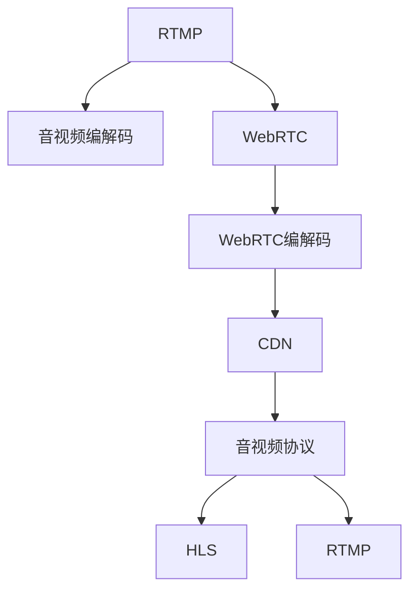

                 

# 流媒体技术栈：从RTMP到WebRTC

> 关键词：流媒体,RTMP,WebRTC,音视频,编解码,CDN,Web,实时通信

## 1. 背景介绍

### 1.1 问题由来
随着互联网技术的迅猛发展，流媒体技术在在线教育、远程会议、视频直播等领域得到了广泛应用。传统的流媒体传输技术以RTMP（Real-Time Messaging Protocol）为主流，但随着Web技术的发展，基于WebRTC（Web Real-Time Communications）的流媒体技术开始崭露头角。

### 1.2 问题核心关键点
流媒体技术栈的核心在于如何将音视频数据高效、稳定、安全地在客户端与服务器之间传输。RTMP是传统流媒体技术的主流，但WebRTC逐渐成为Web时代的主流选择。本文将深入介绍从RTMP到WebRTC的演变过程，以及两者在流媒体技术栈中的应用。

## 2. 核心概念与联系

### 2.1 核心概念概述

为更好地理解流媒体技术栈，本节将介绍几个密切相关的核心概念：

- RTMP: 实时消息传输协议，用于在Internet上传输音视频和数据流。RTMP由Adobe公司开发，广泛应用于Flash流媒体应用。
- WebRTC: 基于Web的实时通信技术，用于在Web浏览器中实现点对点的音视频通话、文件传输等功能。WebRTC由Google、Mozilla等公司主导开发。
- CDN: 内容分发网络，用于加速流媒体数据的传输，提高流媒体应用的稳定性和用户体验。
- 编解码: 音视频数据的编码和解码，是流媒体传输的基础。编解码技术的发展直接影响流媒体的传输质量和效率。
- 音视频协议: 用于在网络上传输音视频数据的协议，如HLS（HTTP Live Streaming）、RTMP、WebRTC等。

这些核心概念之间的逻辑关系可以通过以下Mermaid流程图来展示：



这个流程图展示了一些核心概念及其之间的关系：

1. RTMP与音视频编解码紧密相关，主要用于Flash流媒体应用。
2. WebRTC与音视频编解码紧密相关，用于Web浏览器中的音视频通话。
3. CDN用于加速音视频数据的传输，提高流媒体应用的稳定性和用户体验。
4. 音视频协议是流媒体传输的基础，HLS和RTMP是传统音视频协议的代表，而WebRTC是Web时代的新型协议。

## 3. 核心算法原理 & 具体操作步骤
### 3.1 算法原理概述

RTMP和WebRTC的原理各不相同，但都基于音视频编解码技术。

#### RTMP原理概述
RTMP基于TCP协议，采用RTP/UDP协议传输音视频数据，并使用RTMP协议在TCP上进行封装。RTMP通过流式传输的方式，将音视频数据分片传输到客户端。

#### WebRTC原理概述
WebRTC基于UDP协议，使用SRTP（Secure Real-Time Transport Protocol）协议加密音视频数据，并使用ICE（Interactive Connectivity Establishment）协议进行连接协商，最终使用STUN（Session Traversal Utilities for NAT）协议穿透NAT（Network Address Translation），实现点对点的音视频传输。

### 3.2 算法步骤详解

#### RTMP算法步骤详解
1. 编码：使用音视频编解码器对音视频数据进行编码。
2. 封装：使用RTMP协议将编码后的音视频数据封装成RTMP数据包。
3. 传输：使用TCP协议将RTMP数据包传输到服务器。
4. 解析：服务器接收RTMP数据包，解析出音视频数据。
5. 解码：使用音视频编解码器对音视频数据进行解码。
6. 播放：将解码后的音视频数据播放给用户。

#### WebRTC算法步骤详解
1. 编码：使用音视频编解码器对音视频数据进行编码。
2. 封装：使用RTP协议将编码后的音视频数据封装成RTP数据包。
3. 加密：使用SRTP协议对RTP数据包进行加密。
4. 连接协商：使用ICE协议进行连接协商，确定两端的网络地址。
5. 传输：使用UDP协议将加密后的RTP数据包传输到客户端。
6. 解密：客户端使用SRTP协议对接收到的RTP数据包进行解密。
7. 解析：客户端解析出音视频数据。
8. 播放：将解码后的音视频数据播放给用户。

### 3.3 算法优缺点

#### RTMP算法优缺点
- 优点：传输稳定，适合大规模流媒体应用。
- 缺点：对音视频编解码器的依赖较大，协议复杂，跨平台性差。

#### WebRTC算法优缺点
- 优点：传输效率高，跨平台性好，无须安装插件，适合Web应用。
- 缺点：对网络环境要求较高，连接协商过程复杂。

### 3.4 算法应用领域

#### RTMP应用领域
RTMP广泛应用于传统流媒体应用，如IPTV、在线教育、视频直播等。由于RTMP的稳定性高，适合大规模流媒体应用。

#### WebRTC应用领域
WebRTC广泛应用于Web浏览器中的音视频通话、文件传输等功能。由于WebRTC的跨平台性好，适合Web应用。

## 4. 数学模型和公式 & 详细讲解 & 举例说明

### 4.1 数学模型构建

RTMP和WebRTC都基于音视频编解码技术，而音视频编解码技术通常使用H.264/AVC、H.265/HEVC等标准进行编码，使用AAC、MP3等标准进行解码。以下以H.264编解码为例，介绍音视频编解码的数学模型。

#### H.264编解码数学模型
H.264使用离散余弦变换（DCT）和变长编码（VLC）进行压缩，其数学模型如下：

1. 离散余弦变换（DCT）
$$
X[k] = \frac{1}{\sqrt{N}} \sum_{n=0}^{N-1} x[n] \cdot e^{-j \frac{2\pi kn}{N}}
$$
其中，$X[k]$表示变换后的系数，$x[n]$表示输入的原始数据，$N$表示数据长度，$j$表示虚数单位。

2. 变长编码（VLC）
VLC使用哈夫曼编码（Huffman Coding）或算术编码（Arithmetic Coding）进行压缩。其数学模型如下：

$$
\text{VLC} = \text{Index} + \text{Bitstream}
$$
其中，$\text{Index}$表示哈夫曼树的索引，$\text{Bitstream}$表示变长编码的二进制流。

### 4.2 公式推导过程

#### RTMP编解码公式推导
RTMP编解码公式推导较为复杂，主要涉及音视频数据的压缩、封装和解压缩。

1. 压缩：将音视频数据使用H.264进行压缩。
$$
\text{Compressed Data} = \text{H.264 Encoding}(\text{Original Data})
$$
2. 封装：将压缩后的数据封装成RTMP数据包。
$$
\text{RTMP Packet} = \text{RTMP Header} + \text{Compressed Data}
$$
其中，$\text{RTMP Header}$表示RTMP数据包的头部信息。

3. 解压缩：接收方接收RTMP数据包，解析出压缩后的音视频数据。
$$
\text{Original Data} = \text{H.264 Decoding}(\text{Compressed Data})
$$

#### WebRTC编解码公式推导
WebRTC编解码公式推导同样复杂，主要涉及音视频数据的压缩、封装、加密、解密和解压缩。

1. 压缩：将音视频数据使用H.264进行压缩。
$$
\text{Compressed Data} = \text{H.264 Encoding}(\text{Original Data})
$$
2. 封装：将压缩后的数据封装成RTP数据包。
$$
\text{RTP Packet} = \text{RTP Header} + \text{Compressed Data}
$$
其中，$\text{RTP Header}$表示RTP数据包的头部信息。

3. 加密：对RTP数据包进行SRTP加密。
$$
\text{Encrypted Packet} = \text{SRTP Encryption}(\text{RTP Packet})
$$

4. 解密：接收方接收加密后的RTP数据包，进行SRTP解密。
$$
\text{RTP Packet} = \text{SRTP Decryption}(\text{Encrypted Packet})
$$

5. 解压缩：接收方解析出音视频数据。
$$
\text{Original Data} = \text{H.264 Decoding}(\text{Compressed Data})
$$

### 4.3 案例分析与讲解

#### RTMP案例分析
假设某在线教育平台使用RTMP进行流媒体传输，其原理如下：

1. 教师使用摄像头录制视频。
2. 视频经过H.264编解码器进行编码压缩。
3. 压缩后的视频数据封装成RTMP数据包，并通过TCP协议传输到服务器。
4. 服务器接收RTMP数据包，解析出压缩后的视频数据。
5. 服务器对视频数据进行解码，并输出到教室大屏。

#### WebRTC案例分析
假设某在线会议应用使用WebRTC进行音视频通话，其原理如下：

1. 参会者打开WebRTC客户端，并通过ICE协议进行连接协商。
2. 客户端使用H.264编解码器对音视频数据进行编码压缩。
3. 压缩后的音视频数据封装成RTP数据包，并进行SRTP加密。
4. 加密后的RTP数据包通过UDP协议传输到对方客户端。
5. 对方客户端接收到RTP数据包，进行SRTP解密。
6. 客户端解析出音视频数据，并进行解码。
7. 解码后的音视频数据输出到会议室的屏幕或扬声器。

## 5. 项目实践：代码实例和详细解释说明

### 5.1 开发环境搭建

在进行流媒体技术栈的实践前，我们需要准备好开发环境。以下是使用Node.js进行WebRTC开发的环境配置流程：

1. 安装Node.js：从官网下载并安装Node.js。
2. 安装npm：在Node.js环境下，npm自动安装，无需单独安装。
3. 安装webrtc.org提供的webrtc.js库。

```bash
npm install webrtc
```

### 5.2 源代码详细实现

下面是使用Node.js和webrtc.js库实现WebRTC音视频通话的代码实现：

```javascript
// 引入webrtc.js库
var webrtc = require('webrtc');

// 创建WebRTC客户端
var client = new webrtc.Client();

// 连接服务器
client.connect('wss://example.com/webrtc');

// 监听连接事件
client.on('connect', function() {
    console.log('Connected to server');
});

// 监听关闭事件
client.on('close', function() {
    console.log('Connection closed');
});

// 监听音视频通话事件
client.on('stream', function(stream) {
    var videoElement = document.getElementById('video');
    videoElement.srcObject = stream;
    videoElement.play();
});

// 监听错误事件
client.on('error', function(error) {
    console.log('Error: ' + error.message);
});

// 关闭客户端
client.close();
```

### 5.3 代码解读与分析

以下是关键代码的实现细节：

**webrtc.js库**：
- 提供了WebRTC的核心功能，包括连接、音视频流传输、ICE连接协商、STUN/NAT穿透等。
- 通过简单的API调用，即可实现WebRTC音视频通话。

**client对象**：
- 创建一个WebRTC客户端，并连接到服务器。
- 监听连接、关闭、错误等事件，处理连接状态和错误情况。
- 监听音视频流传输事件，并将音视频流输出到页面上的视频元素中。

**代码结构**：
- 通过webrtc.js库提供的API，实现WebRTC客户端的功能。
- 监听连接和音视频流传输等事件，并处理相应的回调函数。
- 关闭客户端时，调用close()方法。

通过上述代码实现，可以简单快速地实现WebRTC音视频通话功能。开发者可以在此基础上进行进一步的定制开发，实现更加复杂的功能和应用场景。

## 6. 实际应用场景

### 6.1 在线教育
在线教育领域广泛应用RTMP和WebRTC技术，实现了实时互动、远程课堂、直播授课等功能。

#### RTMP应用场景
RTMP在在线教育中的应用场景包括直播授课、课堂录制、远程辅导等。RTMP的高稳定性和低延迟性，适合大规模流媒体应用。

#### WebRTC应用场景
WebRTC在在线教育中的应用场景包括实时互动、课堂讨论、分组协作等。WebRTC的跨平台性和低延迟性，适合Web浏览器中的实时互动。

### 6.2 远程会议
远程会议领域广泛应用RTMP和WebRTC技术，实现了音视频通话、文件传输、屏幕共享等功能。

#### RTMP应用场景
RTMP在远程会议中的应用场景包括实时会议、网络研讨会、培训讲座等。RTMP的稳定性高，适合大规模流媒体应用。

#### WebRTC应用场景
WebRTC在远程会议中的应用场景包括点对点音视频通话、文件传输、屏幕共享等。WebRTC的跨平台性和低延迟性，适合Web浏览器中的实时互动。

### 6.3 视频直播
视频直播领域广泛应用RTMP和WebRTC技术，实现了实时互动、直播点播、广告插播等功能。

#### RTMP应用场景
RTMP在视频直播中的应用场景包括实时直播、点播视频、广告插播等。RTMP的高稳定性，适合大规模流媒体应用。

#### WebRTC应用场景
WebRTC在视频直播中的应用场景包括实时互动、直播点播、广告插播等。WebRTC的跨平台性和低延迟性，适合Web浏览器中的实时互动。

## 7. 工具和资源推荐

### 7.1 学习资源推荐

为了帮助开发者系统掌握流媒体技术栈的理论基础和实践技巧，这里推荐一些优质的学习资源：

1. WebRTC官方文档：webrtc.org提供的官方文档，详细介绍了WebRTC的核心功能和API使用。
2. RTMP官方文档：rtmp://提供的官方文档，详细介绍了RTMP的核心功能和API使用。
3. 《流媒体技术栈》书籍：深入浅出地介绍了流媒体技术栈的核心概念和实现原理，适合初学者入门。
4. 《音视频编码与解码》书籍：详细介绍了音视频编解码的标准和实现原理，适合深入研究。
5. 《WebRTC实战》课程：由Udacity提供的WebRTC实战课程，通过实战案例讲解WebRTC的开发和应用。

通过对这些资源的学习实践，相信你一定能够快速掌握流媒体技术栈的精髓，并用于解决实际的流媒体问题。

### 7.2 开发工具推荐

高效的流媒体开发离不开优秀的工具支持。以下是几款用于流媒体开发的常用工具：

1. OBS Studio：开源的流媒体混音器，支持多源输入、音频视频混合、实时预览等功能。
2. FFmpeg：开源的音视频处理工具，支持编解码、格式转换、流媒体传输等功能。
3. WebRTC-STUN/TURN服务器：WebRTC提供的STUN/NAT穿透服务器，用于连接协商和NAT穿透。
4. RTMP服务器：如Nginx-RTMP等，用于处理RTMP流媒体的传输和播放。

合理利用这些工具，可以显著提升流媒体开发和部署的效率，加速创新迭代的步伐。

### 7.3 相关论文推荐

流媒体技术栈的研究源于学界的持续研究。以下是几篇奠基性的相关论文，推荐阅读：

1. A Comparison of WebRTC and RTMP for Streaming Video on Mobile Devices：对比WebRTC和RTMP在移动设备上的流媒体应用效果。
2. RTMP Streaming Architecture and Protocol：介绍RTMP流媒体架构和协议。
3. WebRTC for Real-Time Video Communication：介绍WebRTC实时视频通信技术。
4. Real-Time Communication on WebRTC：介绍WebRTC实时通信技术的应用和实现。
5. Real-Time Video Streams on the Web：介绍WebRTC实时视频流的应用和实现。

这些论文代表了大规模流媒体技术的研究进展，通过学习这些前沿成果，可以帮助研究者把握学科前进方向，激发更多的创新灵感。

## 8. 总结：未来发展趋势与挑战

### 8.1 研究成果总结
本文对从RTMP到WebRTC的流媒体技术栈进行了系统介绍。首先阐述了RTMP和WebRTC的核心概念和应用场景，明确了两者的优缺点和适用领域。其次，从原理到实践，详细讲解了RTMP和WebRTC的算法原理和具体操作步骤，给出了完整的代码实例和详细解释说明。同时，本文还探讨了RTMP和WebRTC在实际应用中的场景，展示了流媒体技术的广泛应用。

通过本文的系统梳理，可以看到，从RTMP到WebRTC的流媒体技术栈正在逐步演进，成为Web时代的主流选择。未来，伴随技术的不断成熟，流媒体技术还将迎来更多的创新和突破，为流媒体应用带来更多的可能和价值。

### 8.2 未来发展趋势
流媒体技术栈的未来发展趋势如下：

1. 流媒体服务化：流媒体服务将变得更加普及和多样化，流媒体服务化将成为主流。
2. 流媒体标准化：流媒体技术将更加标准化，跨平台兼容性将得到提升。
3. 流媒体安全化：流媒体安全技术将更加成熟，安全性将得到进一步提升。
4. 流媒体智能化：流媒体技术将更加智能化，通过AI技术提升用户体验。
5. 流媒体云化：流媒体技术将更加云化，流媒体应用将更加灵活和便捷。

### 8.3 面临的挑战
尽管流媒体技术栈取得了巨大的进展，但在迈向更加智能化、云化应用的过程中，它仍面临诸多挑战：

1. 网络带宽瓶颈：流媒体应用的带宽需求高，对网络带宽的要求较高。
2. 音视频编解码效率：音视频编解码效率不高，影响流媒体应用的性能。
3. 音视频质量控制：流媒体应用中的音视频质量控制较为复杂，需要优化编解码参数和网络配置。
4. 跨平台兼容性：流媒体技术需要更好的跨平台兼容性，以满足不同设备和终端的需求。
5. 安全性问题：流媒体传输过程中存在诸多安全威胁，需要加强数据加密和传输安全。

### 8.4 研究展望
未来流媒体技术栈的研究方向将从以下几个方面进行突破：

1. 优化音视频编解码：通过优化编解码算法和参数，提高流媒体应用的音视频质量。
2. 改进流媒体服务：通过改进流媒体服务架构和协议，提升流媒体应用的稳定性和可靠性。
3. 强化流媒体安全：通过引入AI和机器学习技术，提升流媒体应用的安全性和鲁棒性。
4. 拓展流媒体应用：通过引入多媒体技术和跨领域知识，拓展流媒体应用的多样性和创新性。
5. 优化流媒体体验：通过优化流媒体应用的交互和体验，提升用户的使用便捷性和满意度。

这些研究方向将进一步推动流媒体技术的发展，为流媒体应用带来更多的可能和价值。

## 9. 附录：常见问题与解答

**Q1：流媒体技术栈包括哪些核心组件？**

A: 流媒体技术栈的核心组件包括音视频编解码、流媒体传输协议、流媒体服务器、流媒体客户端等。音视频编解码是流媒体技术的基础，流媒体传输协议用于在网络上传输音视频数据，流媒体服务器和客户端用于管理和播放流媒体数据。

**Q2：RTMP和WebRTC在音视频编解码方面有何不同？**

A: RTMP和WebRTC在音视频编解码方面有所不同。RTMP使用H.264编解码，WebRTC使用VP8、VP9、H.264等多种编解码标准。同时，RTMP在音视频封装、传输和播放过程中，需要额外的RTMP协议进行封装和解封装，而WebRTC则直接使用RTP协议进行音视频数据的封装和传输。

**Q3：RTMP和WebRTC在跨平台性方面有何不同？**

A: RTMP和WebRTC在跨平台性方面也有所不同。RTMP主要应用于Flash流媒体应用，而WebRTC则基于Web技术，可以在Web浏览器中进行实时互动。同时，WebRTC的跨平台性更好，支持多种设备和终端，而RTMP则需要额外的Flash插件才能在非Flash浏览器中运行。

**Q4：RTMP和WebRTC在实时性方面有何不同？**

A: RTMP和WebRTC在实时性方面也有所不同。RTMP的实时性较好，适合大规模流媒体应用，如IPTV、视频直播等。WebRTC的实时性也较好，但受网络环境影响较大，需要优化网络配置和数据传输。

**Q5：RTMP和WebRTC在安全性方面有何不同？**

A: RTMP和WebRTC在安全性方面也有所不同。RTMP的安全性较低，需要进行SSL/TLS加密才能保证传输安全。WebRTC则支持SRTP协议进行加密，并提供多种加密算法和密钥管理机制，安全性较高。

通过这些常见问题的解答，可以帮助开发者更好地理解RTMP和WebRTC技术栈的原理和应用，从而在实际开发中更加得心应手。

---

作者：禅与计算机程序设计艺术 / Zen and the Art of Computer Programming

