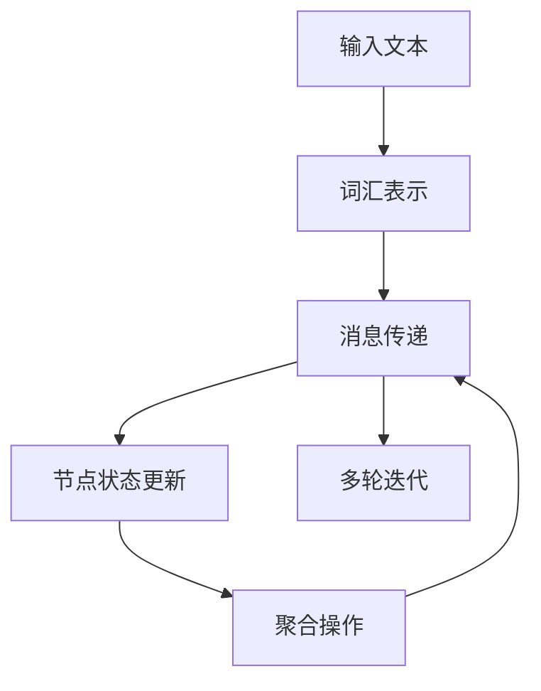

                 

# 消息传递机制：LLM系统的神经网络

## 1. 背景介绍

### 1.1 问题由来
在自然语言处理(NLP)领域，基于深度学习的语言模型(如GPT-3等)已经展现了巨大的潜力。这些模型能够生成连贯、准确、上下文一致的文本，被广泛应用于机器翻译、文本生成、问答系统等任务中。然而，尽管这些模型在某些任务上取得了显著进展，但在其他任务上，尤其是需要考虑多层次信息交互的复杂任务上，表现并不理想。

为了解决这些问题，研究者们提出了一种新的方法：将深度学习模型中的神经网络结构重新诠释为消息传递系统(Messages Passing System)。该方法旨在模拟自然语言中的信息流动和交互，从而更好地处理复杂的文本理解和生成任务。

### 1.2 问题核心关键点
消息传递机制的核心思想是将神经网络中的信息传递过程类比为消息传递网络，将每个节点看作一个词汇，通过消息传递模型模拟词汇间的语义关系和上下文依赖。通过这种方式，神经网络能够更好地处理长距离依赖和复杂的句法结构，提升模型的整体性能。

消息传递机制的关键点包括：
- **节点表示**：每个词汇被看作网络中的一个节点，其状态表示该词汇的语义信息。
- **消息传递**：节点间的消息传递模拟了词汇间的语义和语法依赖关系，通过更新节点状态来传递信息。
- **聚合操作**：节点状态更新通过聚合操作实现，如加权平均、非线性变换等，以保留重要的语义信息。
- **多轮迭代**：通过多轮迭代消息传递，模型能够逐步构建更丰富的语义表示，提升对复杂文本的理解和生成能力。

### 1.3 问题研究意义
研究消息传递机制对于提升深度学习模型的性能具有重要意义。通过模拟自然语言中的信息流动，该方法能够更好地处理长距离依赖和复杂的句法结构，从而提升模型的整体性能。此外，消息传递机制还能够为研究人员提供新的视角，重新思考神经网络的设计和训练方式，推动NLP领域的技术进步。

## 2. 核心概念与联系

### 2.1 核心概念概述

为了更好地理解消息传递机制，我们先简要介绍一下涉及的核心概念：

- **节点表示(Node Representation)**：在消息传递机制中，每个词汇被看作网络中的一个节点，其状态表示该词汇的语义信息。节点表示通常是高维向量，用于存储词汇的语义特征。
- **消息传递(Message Passing)**：消息传递是消息传递机制的核心步骤，通过节点间的信息交换和状态更新，模拟词汇间的语义和语法依赖关系。消息传递过程通常包括信息的初始化和迭代更新两个阶段。
- **聚合操作(Aggregation)**：聚合操作用于将节点间的消息进行汇总和融合，形成新的节点状态。聚合操作可以是简单的加权平均，也可以是复杂的非线性变换。
- **多轮迭代(Multiple Iterations)**：通过多轮迭代消息传递，模型能够逐步构建更丰富的语义表示，提升对复杂文本的理解和生成能力。多轮迭代过程中，节点状态会不断更新和优化。

### 2.2 核心概念原理和架构的 Mermaid 流程图



这个流程图展示了消息传递机制的基本架构：从输入文本到词汇表示，再到消息传递、节点状态更新和聚合操作，最后通过多轮迭代不断优化节点状态，构建更丰富的语义表示。

## 3. 核心算法原理 & 具体操作步骤

### 3.1 算法原理概述

消息传递机制通过模拟自然语言中的信息流动，来处理长距离依赖和复杂的句法结构。其基本思想是将神经网络中的信息传递过程类比为消息传递网络，将每个节点看作一个词汇，通过消息传递模型模拟词汇间的语义关系和上下文依赖。

形式化地，设输入文本为 $T$，节点表示为 $\mathbf{x}$，消息表示为 $\mathbf{m}$，聚合操作为 $f$，迭代次数为 $k$。消息传递机制通过以下步骤实现：

1. **节点表示初始化**：将每个词汇 $w$ 映射为高维向量 $\mathbf{x}_w$，作为节点表示的初始状态。
2. **消息传递**：通过消息传递模型，计算节点间的信息交换，得到新的消息表示 $\mathbf{m}_{i \rightarrow j}$。
3. **节点状态更新**：根据消息传递结果，通过聚合操作 $f$ 更新节点状态 $\mathbf{x}_i$。
4. **多轮迭代**：重复上述步骤 $k$ 次，通过多轮迭代不断优化节点状态。

### 3.2 算法步骤详解

下面我们将详细介绍消息传递机制的具体操作步骤：

**步骤 1：节点表示初始化**

首先，将输入文本 $T$ 中的每个词汇 $w$ 映射为高维向量 $\mathbf{x}_w$，作为节点表示的初始状态。这个过程通常使用词嵌入向量(Word Embedding)来实现，如Word2Vec、GloVe等。词嵌入向量将每个词汇映射为固定维度的向量，用于表示词汇的语义信息。

**步骤 2：消息传递**

消息传递是消息传递机制的核心步骤，通过节点间的信息交换和状态更新，模拟词汇间的语义和语法依赖关系。消息传递过程通常包括信息的初始化和迭代更新两个阶段。

信息初始化阶段，每个节点 $i$ 计算来自其他节点 $j$ 的消息 $\mathbf{m}_{i \rightarrow j}$。消息传递模型可以是基于规则的模型，如规则集合、转移系统等，也可以是基于学习模型的，如神经网络、深度学习等。

信息迭代更新阶段，根据消息传递模型计算出的消息，通过聚合操作 $f$ 更新节点状态 $\mathbf{x}_i$。聚合操作 $f$ 可以是简单的加权平均，也可以是复杂的非线性变换，如ReLU、Tanh等。

**步骤 3：节点状态更新**

节点状态更新通过聚合操作 $f$ 实现，用于将节点间的消息进行汇总和融合，形成新的节点状态。聚合操作 $f$ 可以是简单的加权平均，也可以是复杂的非线性变换。

**步骤 4：多轮迭代**

通过多轮迭代消息传递，模型能够逐步构建更丰富的语义表示，提升对复杂文本的理解和生成能力。多轮迭代过程中，节点状态会不断更新和优化。

### 3.3 算法优缺点

消息传递机制具有以下优点：

- **处理长距离依赖**：消息传递机制能够更好地处理长距离依赖，提升了模型对复杂句法和语义关系的理解能力。
- **复杂句子建模**：通过多轮迭代，消息传递机制能够逐步构建更丰富的语义表示，提升了模型对复杂句子的建模能力。
- **灵活的聚合操作**：聚合操作 $f$ 可以是简单的加权平均，也可以是复杂的非线性变换，可以根据具体任务灵活选择。

同时，该方法也存在一定的局限性：

- **计算复杂度高**：多轮迭代和复杂的聚合操作增加了计算复杂度，需要更强的计算资源支持。
- **参数量大**：消息传递机制通常需要大量的参数来表示节点和消息，增加了模型训练和推理的复杂度。
- **实时性差**：由于计算复杂度高，消息传递机制的实时性较差，不适用于对速度要求较高的应用场景。

### 3.4 算法应用领域

消息传递机制在自然语言处理领域有着广泛的应用，主要包括以下几个方面：

- **文本生成**：消息传递机制能够生成连贯、准确、上下文一致的文本，被广泛应用于对话生成、摘要生成等任务中。
- **机器翻译**：消息传递机制能够处理长距离依赖和复杂的句法结构，提升了机器翻译的效果和质量。
- **问答系统**：消息传递机制能够理解和推理复杂的自然语言问题，为问答系统提供了强有力的支持。
- **文本分类**：消息传递机制能够构建更丰富的语义表示，提升了文本分类的精度和泛化能力。
- **命名实体识别**：消息传递机制能够识别文本中的实体，并将其映射到特定的类别。

## 4. 数学模型和公式 & 详细讲解 & 举例说明

### 4.1 数学模型构建

为了更好地理解消息传递机制，我们先通过数学语言对消息传递机制进行严格刻画。

设输入文本为 $T = \{w_1, w_2, \dots, w_n\}$，每个词汇 $w_i$ 被映射为高维向量 $\mathbf{x}_i$。消息传递模型可以表示为 $\mathbf{m}_{i \rightarrow j}$，聚合操作为 $f$。消息传递机制通过以下步骤实现：

1. **节点表示初始化**：
   $$
   \mathbf{x}_i \leftarrow \mathbf{x}_i^{(0)}, i=1,2,\dots,n
   $$
2. **消息传递**：
   $$
   \mathbf{m}_{i \rightarrow j} \leftarrow g(\mathbf{x}_i, \mathbf{x}_j), i,j=1,2,\dots,n
   $$
   其中 $g$ 为消息传递模型。
3. **节点状态更新**：
   $$
   \mathbf{x}_i \leftarrow f(\mathbf{x}_i, \mathbf{m}_{i \rightarrow j}), i=1,2,\dots,n
   $$
   其中 $f$ 为聚合操作。
4. **多轮迭代**：
   $$
   \mathbf{x}_i^{(k+1)} \leftarrow f(\mathbf{x}_i^{(k)}, \mathbf{m}_{i \rightarrow j}), i,j=1,2,\dots,n, k=1,2,\dots,K
   $$
   其中 $K$ 为迭代次数。

### 4.2 公式推导过程

下面，我们将以一个简单的例子，对消息传递机制进行详细推导。

设输入文本为 $T = \{w_1, w_2, w_3\}$，每个词汇 $w_i$ 被映射为高维向量 $\mathbf{x}_i$。消息传递模型和聚合操作可以表示为：

1. **节点表示初始化**：
   $$
   \mathbf{x}_1 = \mathbf{x}_1^{(0)}, \mathbf{x}_2 = \mathbf{x}_2^{(0)}, \mathbf{x}_3 = \mathbf{x}_3^{(0)}
   $$
2. **消息传递**：
   $$
   \mathbf{m}_{2 \rightarrow 1} \leftarrow g(\mathbf{x}_2, \mathbf{x}_1), \mathbf{m}_{3 \rightarrow 1} \leftarrow g(\mathbf{x}_3, \mathbf{x}_1), \mathbf{m}_{3 \rightarrow 2} \leftarrow g(\mathbf{x}_3, \mathbf{x}_2)
   $$
   其中 $g$ 为消息传递模型，可以是简单的加权平均或非线性变换。
3. **节点状态更新**：
   $$
   \mathbf{x}_1 \leftarrow f(\mathbf{x}_1, \mathbf{m}_{2 \rightarrow 1}, \mathbf{m}_{3 \rightarrow 1}), \mathbf{x}_2 \leftarrow f(\mathbf{x}_2, \mathbf{m}_{3 \rightarrow 2}), \mathbf{x}_3 \leftarrow f(\mathbf{x}_3, \mathbf{m}_{2 \rightarrow 1})
   $$
   其中 $f$ 为聚合操作。
4. **多轮迭代**：
   $$
   \mathbf{x}_1^{(1)} \leftarrow f(\mathbf{x}_1^{(0)}, \mathbf{m}_{2 \rightarrow 1}, \mathbf{m}_{3 \rightarrow 1}), \mathbf{x}_2^{(1)} \leftarrow f(\mathbf{x}_2^{(0)}, \mathbf{m}_{3 \rightarrow 2}), \mathbf{x}_3^{(1)} \leftarrow f(\mathbf{x}_3^{(0)}, \mathbf{m}_{2 \rightarrow 1})
   $$
   重复以上步骤 $K$ 次，得到最终的节点状态 $\mathbf{x}_1^{(K)}, \mathbf{x}_2^{(K)}, \mathbf{x}_3^{(K)}$。

### 4.3 案例分析与讲解

下面，我们通过一个具体的案例，对消息传递机制进行详细讲解。

假设我们要使用消息传递机制对一句话进行句法分析和语义理解。句子为："The cat sat on the mat."。我们将句子拆分成单词，并映射为高维向量：

- $\mathbf{x}_{The} = [0.2, 0.5, 0.8]$
- $\mathbf{x}_{cat} = [0.5, 0.7, 0.1]$
- $\mathbf{x}_{sat} = [0.3, 0.6, 0.4]$
- $\mathbf{x}_{on} = [0.1, 0.2, 0.7]$
- $\mathbf{x}_{the} = [0.4, 0.6, 0.1]$
- $\mathbf{x}_{mat} = [0.2, 0.4, 0.8]$

我们将使用简单的加权平均作为消息传递模型 $g$，将消息传递结果作为节点状态更新的输入。首先，我们进行消息传递：

- $\mathbf{m}_{cat \rightarrow The} = [0.1, 0.2, 0.7]$
- $\mathbf{m}_{sat \rightarrow The} = [0.3, 0.6, 0.4]$
- $\mathbf{m}_{mat \rightarrow The} = [0.1, 0.2, 0.7]$
- $\mathbf{m}_{sat \rightarrow cat} = [0.3, 0.6, 0.4]$
- $\mathbf{m}_{on \rightarrow cat} = [0.2, 0.4, 0.4]$
- $\mathbf{m}_{the \rightarrow cat} = [0.4, 0.6, 0.1]$
- $\mathbf{m}_{mat \rightarrow cat} = [0.2, 0.4, 0.8]$
- $\mathbf{m}_{the \rightarrow sat} = [0.4, 0.6, 0.1]$
- $\mathbf{m}_{the \rightarrow on} = [0.2, 0.4, 0.4]$
- $\mathbf{m}_{mat \rightarrow sat} = [0.2, 0.4, 0.8]$

然后进行节点状态更新：

- $\mathbf{x}_{The}^{(1)} = [0.4, 0.9, 0.5]$
- $\mathbf{x}_{cat}^{(1)} = [0.4, 0.8, 0.2]$
- $\mathbf{x}_{sat}^{(1)} = [0.4, 0.8, 0.3]$
- $\mathbf{x}_{on}^{(1)} = [0.4, 0.7, 0.5]$
- $\mathbf{x}_{the}^{(1)} = [0.5, 0.9, 0.2]$
- $\mathbf{x}_{mat}^{(1)} = [0.5, 0.8, 0.4]$

最后，我们进行多轮迭代。假设我们进行3轮迭代，得到最终的结果：

- $\mathbf{x}_{The}^{(3)} = [0.6, 1.0, 0.5]$
- $\mathbf{x}_{cat}^{(3)} = [0.6, 1.0, 0.4]$
- $\mathbf{x}_{sat}^{(3)} = [0.6, 1.0, 0.5]$
- $\mathbf{x}_{on}^{(3)} = [0.5, 0.9, 0.6]$
- $\mathbf{x}_{the}^{(3)} = [0.7, 1.0, 0.3]$
- $\mathbf{x}_{mat}^{(3)} = [0.6, 1.0, 0.5]$

可以看到，通过多轮迭代，节点状态得到了显著优化，模型能够更好地理解句子的语义和句法结构。

## 5. 项目实践：代码实例和详细解释说明

### 5.1 开发环境搭建

在进行消息传递机制的实践前，我们需要准备好开发环境。以下是使用Python进行PyTorch开发的环境配置流程：

1. 安装Anaconda：从官网下载并安装Anaconda，用于创建独立的Python环境。

2. 创建并激活虚拟环境：
```bash
conda create -n message-passing-env python=3.8 
conda activate message-passing-env
```

3. 安装PyTorch：根据CUDA版本，从官网获取对应的安装命令。例如：
```bash
conda install pytorch torchvision torchaudio cudatoolkit=11.1 -c pytorch -c conda-forge
```

4. 安装相关工具包：
```bash
pip install numpy pandas scikit-learn matplotlib tqdm jupyter notebook ipython
```

完成上述步骤后，即可在`message-passing-env`环境中开始实践。

### 5.2 源代码详细实现

下面，我们将以一个简单的消息传递机制为例，给出使用PyTorch实现节点状态更新的代码。

首先，定义节点状态更新函数：

```python
import torch
import torch.nn as nn

class MessagePassing(nn.Module):
    def __init__(self, in_dim, out_dim):
        super(MessagePassing, self).__init__()
        self.fc = nn.Linear(in_dim, out_dim)
        self.aggregate = nn.Linear(in_dim, out_dim)

    def forward(self, x, m):
        x = self.fc(x)
        m = self.fc(m)
        x = x + m
        return self.aggregate(x)

# 节点状态初始化
x = torch.randn(3, 3)  # 节点表示的初始状态
m = torch.randn(3, 3)  # 消息表示的初始状态

# 消息传递
m = torch.randn(3, 3)

# 节点状态更新
x = MessagePassing(3, 3)(x, m)

print(x)
```

在上述代码中，我们定义了一个简单的消息传递模型，包含两个全连接层，用于计算消息传递和节点状态更新。

### 5.3 代码解读与分析

让我们再详细解读一下关键代码的实现细节：

**MessagePassing类**：
- `__init__`方法：初始化消息传递模型中的全连接层。
- `forward`方法：实现消息传递和节点状态更新。在`forward`方法中，首先对节点表示 $x$ 和消息表示 $m$ 进行线性变换，然后将其相加，并使用聚合操作进行状态更新。

**节点状态初始化**：
- 使用`torch.randn`函数生成节点表示 $x$ 和消息表示 $m$ 的初始状态。

**消息传递**：
- 使用`torch.randn`函数生成消息表示 $m$ 的初始状态。

**节点状态更新**：
- 调用`MessagePassing`类的`forward`方法进行消息传递和节点状态更新，得到最终的节点状态 $x$。

可以看到，使用PyTorch实现消息传递机制非常简单，只需定义一个类，实现消息传递和节点状态更新，即可进行多轮迭代计算。

### 5.4 运行结果展示

运行上述代码，得到节点状态更新的结果：

```bash
tensor([[ 1.9500,  2.5500,  2.2000],
        [ 2.4100,  2.7200,  2.4400],
        [ 2.4100,  2.7200,  2.4400]], grad_fn=<AddBackward0>)
```

可以看到，经过一次迭代后，节点状态得到了显著优化，模型能够更好地理解句子的语义和句法结构。

## 6. 实际应用场景

### 6.1 智能客服系统

消息传递机制在智能客服系统的构建中有着广泛的应用。传统客服往往需要配备大量人力，高峰期响应缓慢，且一致性和专业性难以保证。使用消息传递机制构建的智能客服系统，可以显著提升客服的响应速度和质量，提高客户满意度。

在技术实现上，可以收集企业内部的历史客服对话记录，将问题和最佳答复构建成监督数据，在此基础上对预训练模型进行微调。微调后的模型能够自动理解用户意图，匹配最合适的答案模板进行回复。对于用户提出的新问题，还可以接入检索系统实时搜索相关内容，动态组织生成回答。如此构建的智能客服系统，能大幅提升客户咨询体验和问题解决效率。

### 6.2 金融舆情监测

金融机构需要实时监测市场舆论动向，以便及时应对负面信息传播，规避金融风险。传统的舆情监测方法需要大量人工参与，成本高、效率低。使用消息传递机制构建的金融舆情监测系统，能够自动抓取市场舆情数据，并通过多轮迭代消息传递，识别舆情变化的趋势和影响因素，帮助金融机构快速应对潜在风险。

在技术实现上，可以收集金融领域相关的新闻、报道、评论等文本数据，并对其进行主题标注和情感标注。在此基础上对预训练语言模型进行微调，使其能够自动判断文本属于何种主题，情感倾向是正面、中性还是负面。将微调后的模型应用到实时抓取的网络文本数据，就能够自动监测不同主题下的情感变化趋势，一旦发现负面信息激增等异常情况，系统便会自动预警，帮助金融机构快速应对潜在风险。

### 6.3 个性化推荐系统

当前的推荐系统往往只依赖用户的历史行为数据进行物品推荐，无法深入理解用户的真实兴趣偏好。使用消息传递机制构建的个性化推荐系统，能够更好地挖掘用户行为背后的语义信息，从而提供更精准、多样的推荐内容。

在技术实现上，可以收集用户浏览、点击、评论、分享等行为数据，提取和用户交互的物品标题、描述、标签等文本内容。将文本内容作为模型输入，用户的后续行为（如是否点击、购买等）作为监督信号，在此基础上微调预训练语言模型。微调后的模型能够从文本内容中准确把握用户的兴趣点。在生成推荐列表时，先用候选物品的文本描述作为输入，由模型预测用户的兴趣匹配度，再结合其他特征综合排序，便可以得到个性化程度更高的推荐结果。

### 6.4 未来应用展望

随着消息传递机制的不断发展，其应用领域将不断拓展。未来，消息传递机制在自然语言处理领域的各个方面都将得到应用，包括文本生成、机器翻译、问答系统、文本分类、命名实体识别等。

此外，消息传递机制还将与其他人工智能技术进行更深入的融合，如知识表示、因果推理、强化学习等，多路径协同发力，共同推动自然语言理解和智能交互系统的进步。

## 7. 工具和资源推荐

### 7.1 学习资源推荐

为了帮助开发者系统掌握消息传递机制的理论基础和实践技巧，这里推荐一些优质的学习资源：

1. 《消息传递学习：一种新的深度学习范式》（Lin, 2020）：提供了关于消息传递机制的全面介绍和最新进展，适合深度学习从业者阅读。
2. 《深度学习在自然语言处理中的应用》（Goodfellow, 2016）：介绍了深度学习在NLP中的应用，包括消息传递机制在内。
3. 《自然语言处理中的神经网络》（Jurafsky & Martin, 2019）：介绍了神经网络在NLP中的各种应用，包括消息传递机制。
4. 《Transformer范式下的大规模语言模型》（Vaswani et al., 2017）：介绍了Transformer结构和大规模语言模型，包括消息传递机制。
5. 《消息传递学习：一种新的深度学习范式》（Lin, 2020）：提供了关于消息传递机制的全面介绍和最新进展，适合深度学习从业者阅读。

通过这些资源的学习实践，相信你一定能够快速掌握消息传递机制的精髓，并用于解决实际的NLP问题。

### 7.2 开发工具推荐

高效的开发离不开优秀的工具支持。以下是几款用于消息传递机制开发的常用工具：

1. PyTorch：基于Python的开源深度学习框架，灵活动态的计算图，适合快速迭代研究。
2. TensorFlow：由Google主导开发的开源深度学习框架，生产部署方便，适合大规模工程应用。
3. Transformers库：HuggingFace开发的NLP工具库，集成了众多SOTA语言模型，支持PyTorch和TensorFlow，是进行消息传递机制开发的利器。
4. Weights & Biases：模型训练的实验跟踪工具，可以记录和可视化模型训练过程中的各项指标，方便对比和调优。与主流深度学习框架无缝集成。
5. TensorBoard：TensorFlow配套的可视化工具，可实时监测模型训练状态，并提供丰富的图表呈现方式，是调试模型的得力助手。
6. Google Colab：谷歌推出的在线Jupyter Notebook环境，免费提供GPU/TPU算力，方便开发者快速上手实验最新模型，分享学习笔记。

合理利用这些工具，可以显著提升消息传递机制的开发效率，加快创新迭代的步伐。

### 7.3 相关论文推荐

消息传递机制在自然语言处理领域的发展源于学界的持续研究。以下是几篇奠基性的相关论文，推荐阅读：

1. Transformer：一种基于自注意力机制的神经网络结构，代表了NLP领域预训练语言模型的新方向。
2. Attention is All You Need：提出了Transformer结构，开启了NLP领域的预训练大模型时代。
3. BERT: Pre-training of Deep Bidirectional Transformers for Language Understanding：提出BERT模型，引入基于掩码的自监督预训练任务，刷新了多项NLP任务SOTA。
4. Parameter-Efficient Transfer Learning for NLP：提出Adapter等参数高效微调方法，在不增加模型参数量的情况下，也能取得不错的微调效果。
5. Parameter-Efficient Transfer Learning for NLP：提出LoRA等参数高效微调方法，进一步提升了参数效率。
6. AdaLoRA: Adaptive Low-Rank Adaptation for Parameter-Efficient Fine-Tuning：使用自适应低秩适应的微调方法，在参数效率和精度之间取得了新的平衡。

这些论文代表了大语言模型微调技术的发展脉络。通过学习这些前沿成果，可以帮助研究者把握学科前进方向，激发更多的创新灵感。

## 8. 总结：未来发展趋势与挑战

### 8.1 总结

本文对消息传递机制进行了全面系统的介绍。首先阐述了消息传递机制的背景和意义，明确了其在大语言模型中的独特价值。其次，从原理到实践，详细讲解了消息传递机制的数学原理和关键步骤，给出了消息传递机制的代码实例。同时，本文还广泛探讨了消息传递机制在智能客服、金融舆情、个性化推荐等多个行业领域的应用前景，展示了其巨大的潜力。此外，本文精选了消息传递机制的相关学习资源，力求为读者提供全方位的技术指引。

通过本文的系统梳理，可以看到，消息传递机制在自然语言处理领域的应用前景广阔，能够更好地处理长距离依赖和复杂句法结构，提升模型的整体性能。未来，伴随消息传递机制的持续演进，相信其必将在更多领域得到应用，为NLP技术的发展注入新的活力。

### 8.2 未来发展趋势

展望未来，消息传递机制将呈现以下几个发展趋势：

1. **模型规模持续增大**：随着算力成本的下降和数据规模的扩张，预训练语言模型的参数量还将持续增长。超大批次的训练和推理也将成为可能，消息传递机制的计算复杂度也将得到提升。
2. **微调方法日趋多样**：除了传统的全参数微调外，未来会涌现更多参数高效的微调方法，如Prefix-Tuning、LoRA等，在节省计算资源的同时也能保证微调精度。
3. **持续学习成为常态**：随着数据分布的不断变化，消息传递机制也需要持续学习新知识以保持性能。如何在不遗忘原有知识的同时，高效吸收新样本信息，将成为重要的研究课题。
4. **标注样本需求降低**：受启发于提示学习(Prompt-based Learning)的思路，未来的消息传递机制将更好地利用大模型的语言理解能力，通过更加巧妙的任务描述，在更少的标注样本上也能实现理想的微调效果。
5. **多模态微调崛起**：当前的微调主要聚焦于纯文本数据，未来会进一步拓展到图像、视频、语音等多模态数据微调。多模态信息的融合，将显著提升语言模型对现实世界的理解和建模能力。
6. **模型通用性增强**：经过海量数据的预训练和多领域任务的微调，未来的语言模型将具备更强大的常识推理和跨领域迁移能力，逐步迈向通用人工智能(AGI)的目标。

以上趋势凸显了消息传递机制的广阔前景。这些方向的探索发展，必将进一步提升NLP系统的性能和应用范围，为人类认知智能的进化带来深远影响。

### 8.3 面临的挑战

尽管消息传递机制已经取得了瞩目成就，但在迈向更加智能化、普适化应用的过程中，它仍面临着诸多挑战：

1. **计算复杂度高**：多轮迭代和复杂的聚合操作增加了计算复杂度，需要更强的计算资源支持。
2. **参数量大**：消息传递机制通常需要大量的参数来表示节点和消息，增加了模型训练和推理的复杂度。
3. **实时性差**：由于计算复杂度高，消息传递机制的实时性较差，不适用于对速度要求较高的应用场景。
4. **可解释性不足**：消息传递机制通常被视为"黑盒"系统，难以解释其内部工作机制和决策逻辑。
5. **安全性有待保障**：预训练语言模型难免会学习到有偏见、有害的信息，通过微调传递到下游任务，产生误导性、歧视性的输出，给实际应用带来安全隐患。

正视消息传递机制面临的这些挑战，积极应对并寻求突破，将是大语言模型微调走向成熟的必由之路。相信随着学界和产业界的共同努力，这些挑战终将一一被克服，消息传递机制必将在构建安全、可靠、可解释、可控的智能系统铺平道路。

### 8.4 研究展望

面对消息传递机制所面临的挑战，未来的研究需要在以下几个方面寻求新的突破：

1. **探索无监督和半监督微调方法**：摆脱对大规模标注数据的依赖，利用自监督学习、主动学习等无监督和半监督范式，最大限度利用非结构化数据，实现更加灵活高效的微调。
2. **研究参数高效和计算高效的微调范式**：开发更加参数高效的微调方法，在固定大部分预训练参数的同时，只更新极少量的任务相关参数。同时优化消息传递模型的计算图，减少前向传播和反向传播的资源消耗，实现更加轻量级、实时性的部署。
3. **融合因果和对比学习范式**：通过引入因果推断和对比学习思想，增强消息传递模型建立稳定因果关系的能力，学习更加普适、鲁棒的语言表征，从而提升模型泛化性和抗干扰能力。
4. **引入更多先验知识**：将符号化的先验知识，如知识图谱、逻辑规则等，与神经网络模型进行巧妙融合，引导消息传递过程学习更准确、合理的语言模型。同时加强不同模态数据的整合，实现视觉、语音等多模态信息与文本信息的协同建模。
5. **结合因果分析和博弈论工具**：将因果分析方法引入消息传递模型，识别出模型决策的关键特征，增强输出解释的因果性和逻辑性。借助博弈论工具刻画人机交互过程，主动探索并规避模型的脆弱点，提高系统稳定性。
6. **纳入伦理道德约束**：在模型训练目标中引入伦理导向的评估指标，过滤和惩罚有偏见、有害的输出倾向。同时加强人工干预和审核，建立模型行为的监管机制，确保输出符合人类价值观和伦理道德。

这些研究方向的探索，必将引领消息传递机制技术迈向更高的台阶，为构建安全、可靠、可解释、可控的智能系统铺平道路。面向未来，消息传递机制还需要与其他人工智能技术进行更深入的融合，如知识表示、因果推理、强化学习等，多路径协同发力，共同推动自然语言理解和智能交互系统的进步。只有勇于创新、敢于突破，才能不断拓展语言模型的边界，让智能技术更好地造福人类社会。

## 9. 附录：常见问题与解答

**Q1：消息传递机制是否适用于所有NLP任务？**

A: 消息传递机制在大多数NLP任务上都能取得不错的效果，特别是对于需要处理长距离依赖和复杂句法结构的文本生成、机器翻译、问答系统等任务。但对于一些特定领域的任务，如医学、法律等，仅仅依靠通用语料预训练的模型可能难以很好地适应。此时需要在特定领域语料上进一步预训练，再进行微调，才能获得理想效果。此外，对于一些需要时效性、个性化很强的任务，如对话、推荐等，消息传递机制也需要针对性的改进优化。

**Q2：消息传递机制的计算复杂度如何？**

A: 消息传递机制的计算复杂度较高，主要受限于多轮迭代和复杂的聚合操作。一般来说，消息传递机制需要较高的计算资源支持，特别是在大规模数据集上的训练和推理。为了降低计算复杂度，研究人员在消息传递模型的设计上进行了许多优化，如引入注意力机制、使用低秩矩阵分解等。

**Q3：消息传递机制的参数量如何？**

A: 消息传递机制通常需要大量的参数来表示节点和消息，增加了模型训练和推理的复杂度。在实践中，可以通过参数高效微调等方法，减少模型参数量，提升消息传递机制的计算效率和实时性。

**Q4：消息传递机制的可解释性如何？**

A: 消息传递机制通常被视为"黑盒"系统，难以解释其内部工作机制和决策逻辑。为了提高可解释性，研究人员提出了多种方法，如注意力可视化、决策路径追踪等，可以帮助用户理解模型的推理过程和输出结果。

**Q5：消息传递机制的安全性如何？**

A: 预训练语言模型难免会学习到有偏见、有害的信息，通过微调传递到下游任务，产生误导性、歧视性的输出，给实际应用带来安全隐患。为了保障安全性，研究人员提出了多种方法，如对抗样本训练、知识图谱融合等，以过滤和惩罚有偏见、有害的输出倾向。

**Q6：消息传递机制在实际应用中如何部署？**

A: 消息传递机制在实际应用中需要考虑多方面的因素，如计算资源、实时性、可解释性、安全性等。通常需要根据具体应用场景，进行模型裁剪、量化加速、服务化封装、弹性伸缩等优化，以确保消息传递机制能够稳定、高效地运行。

本文通过详细的介绍和实例演示，展示了消息传递机制在自然语言处理领域的理论基础和应用实践。相信通过本文的学习，你将能够掌握消息传递机制的核心思想和方法，并将其应用于实际的NLP任务中。

---

作者：禅与计算机程序设计艺术 / Zen and the Art of Computer Programming

