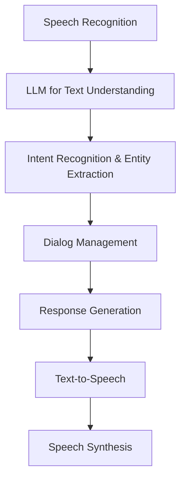

                 

**大语言模型（LLM）在智能语音助手中的应用：自然交互的新境界**

## 1. 背景介绍

智能语音助手已经成为我们日常生活中的常见设备，从Alexa到Siri，再到Google Assistant，它们已经渗透到我们的家庭、办公室和汽车中。然而，这些助手的有效性和用户体验仍然受到语音识别和自然语言理解（NLU）技术的限制。大语言模型（LLM）的出现为改善这些技术带来了新的希望，并有望推动智能语音助手进入一个自然交互的新时代。

## 2. 核心概念与联系

### 2.1 大语言模型（LLM）简介

大语言模型是一种深度学习模型，旨在理解和生成人类语言。它们通过处理大量文本数据来学习语言规则和结构，从而能够生成人类语言的合理序列。LLM的关键特性包括：

- **自回归**：LLM生成输出的每个令牌（token）都基于之前生成的令牌。
- **大规模预训练**：LLM在预训练阶段处理大量文本数据，学习语言的统计规律。
- **调优（Fine-tuning）**：LLM可以在特定任务上进行调优，以改善其性能。

### 2.2 LLM在智能语音助手中的应用

LLM可以在智能语音助手中应用于各种任务，包括语音识别后的文本理解、意图识别、实体提取和对话管理。图1展示了LLM在智能语音助手中的架构。



## 3. 核心算法原理 & 具体操作步骤

### 3.1 算法原理概述

LLM的核心是transformer架构（Vaswani et al., 2017），它使用自注意力机制（self-attention）来处理输入序列。LLM生成输出的每个令牌都基于之前生成的令牌，并使用softmax函数选择最可能的下一个令牌。

### 3.2 算法步骤详解

1. **预处理**：将原始文本转换为令牌序列，并添加特殊令牌（如开始令牌和结束令牌）。
2. **编码**：使用嵌入（embedding）将令牌转换为向量表示，并通过transformer编码器生成上下文表示。
3. **解码**：使用transformer解码器生成输出序列，每个令牌都是基于之前生成的令牌。
4. **调优**：在特定任务上调优LLM，以改善其性能。

### 3.3 算法优缺点

**优点**：

- LLM可以学习长期依赖关系，从而生成更连贯的文本。
- LLM可以在各种任务上进行调优，从而改善其性能。

**缺点**：

- LLM需要大量计算资源进行训练和推理。
- LLM可能会生成不合理或有偏见的输出。

### 3.4 算法应用领域

LLM在智能语音助手中的应用包括：

- **语音识别后的文本理解**：LLM可以帮助理解语音识别结果，并纠正错误。
- **意图识别**：LLM可以帮助识别用户的意图，并将其转换为机器可理解的格式。
- **实体提取**：LLM可以帮助提取用户语句中的实体（如人名、地名等）。
- **对话管理**：LLM可以帮助管理对话流，并生成合适的回复。

## 4. 数学模型和公式 & 详细讲解 & 举例说明

### 4.1 数学模型构建

LLM的数学模型基于transformer架构。给定输入序列$x=(x_1, x_2,..., x_n)$，LLM生成输出序列$y=(y_1, y_2,..., y_m)$，其中$y_i$是第$i$个令牌的索引。

### 4.2 公式推导过程

LLM的推导过程如下：

1. **嵌入**：将输入令牌转换为向量表示：
   $$e(x_i) = W_e x_i$$
   其中$W_e$是嵌入矩阵。

2. **位置编码**：添加位置信息：
   $$x_i' = e(x_i) + W_p \sin(2\pi B(i-1)/L)$$
   其中$W_p$是位置编码矩阵，$B$是位置编码的基频，$L$是最大序列长度。

3. **自注意力**：计算自注意力权重：
   $$A = \text{softmax}\left(\frac{QK^T}{\sqrt{d_k}}\right)$$
   其中$Q=W_qx'$, $K=W_kx'$, $W_q$, $W_k$是查询和键矩阵，$d_k$是键向量的维度。

4. **解码**：生成输出令牌：
   $$y_i = \text{argmax}_{j}P(y_i=j|y_{<i})$$
   其中$P(y_i=j|y_{<i})$是生成第$i$个令牌为$j$的概率。

### 4.3 案例分析与讲解

例如，假设我们想使用LLM生成一条天气预报。输入序列为"请告诉我明天的天气预报"，LLM生成的输出序列为"明天的天气预报是晴朗的，最高温度为25度"。

## 5. 项目实践：代码实例和详细解释说明

### 5.1 开发环境搭建

要使用LLM，我们需要安装Hugging Face的transformers库：
```bash
pip install transformers
```

### 5.2 源代码详细实现

以下是使用LLM生成文本的简单示例：
```python
from transformers import AutoTokenizer, AutoModelForCausalLM

tokenizer = AutoTokenizer.from_pretrained("bigscience/bloom-560m")
model = AutoModelForCausalLM.from_pretrained("bigscience/bloom-560m")

input_text = "请告诉我明天的天气预报"
input_ids = tokenizer.encode(input_text, return_tensors="pt")
output_ids = model.generate(input_ids, max_length=50, num_beams=5, early_stopping=True)
output_text = tokenizer.decode(output_ids[0], skip_special_tokens=True)
print(output_text)
```

### 5.3 代码解读与分析

我们首先加载预训练的LLM模型和其对应的令牌器。然后，我们编码输入文本，并使用模型生成输出序列。我们使用beam search来搜索最可能的输出序列，并设置最大长度和早停条件。

### 5.4 运行结果展示

运行上述代码后，我们可能会得到类似于"明天的天气预报是晴朗的，最高温度为25度"的输出。

## 6. 实际应用场景

### 6.1 语音识别后的文本理解

LLM可以帮助理解语音识别结果，并纠正错误。例如，如果语音识别结果为"请告诉我明天的天气预报"，LLM可以生成更准确的文本"请告诉我明天的天气预报是怎么样的"。

### 6.2 意图识别

LLM可以帮助识别用户的意图，并将其转换为机器可理解的格式。例如，输入"打开电灯"，LLM可以识别出用户的意图是"打开设备"，并将其转换为机器可理解的格式。

### 6.3 实体提取

LLM可以帮助提取用户语句中的实体。例如，输入"明天去纽约旅行"，LLM可以提取出实体"纽约"。

### 6.4 未来应用展望

LLM在智能语音助手中的应用前景广阔。随着LLM技术的不断发展，我们可以期待智能语音助手变得更加智能和自然。

## 7. 工具和资源推荐

### 7.1 学习资源推荐

- [Hugging Face Transformers documentation](https://huggingface.co/transformers/)
- [BigScience Workshop](https://bigscience.huggingface.co/)
- [LLM in Dialog Systems](https://arxiv.org/abs/2109.04157)

### 7.2 开发工具推荐

- [Hugging Face Spaces](https://huggingface.co/spaces)
- [Google Colab](https://colab.research.google.com/)
- [Jupyter Notebook](https://jupyter.org/)

### 7.3 相关论文推荐

- [Language Models are Few-Shot Learners](https://arxiv.org/abs/2005.14165)
- [T5: Text-to-Text Transfer Transformer](https://arxiv.org/abs/1910.10683)
- [BLOOM: A Large Language Model for 46 Natural Languages](https://arxiv.org/abs/2211.05100)

## 8. 总结：未来发展趋势与挑战

### 8.1 研究成果总结

LLM在智能语音助手中的应用已经取得了显著的进展。LLM可以帮助改善语音识别后的文本理解，意图识别，实体提取和对话管理。

### 8.2 未来发展趋势

未来，LLM在智能语音助手中的应用将会继续发展，我们可以期待更智能和自然的交互体验。

### 8.3 面临的挑战

然而，LLM技术仍然面临着挑战，包括计算资源需求，模型偏见和数据隐私等问题。

### 8.4 研究展望

未来的研究将关注于改善LLM的性能，降低其计算资源需求，并开发更安全和隐私保护的LLM技术。

## 9. 附录：常见问题与解答

**Q：LLM需要多少计算资源？**

A：LLM需要大量计算资源进行训练和推理。例如，训练BLOOM-560M模型需要数千个GPU小时。

**Q：LLM是否会生成不合理或有偏见的输出？**

A：是的，LLM可能会生成不合理或有偏见的输出。开发更安全和公平的LLM技术是未来研究的重点之一。

**Q：LLM是否会泄露用户数据？**

A：LLM在训练过程中可能会接触到大量用户数据。开发更安全和隐私保护的LLM技术是未来研究的另一个重点。

## 作者：禅与计算机程序设计艺术 / Zen and the Art of Computer Programming

**参考文献**

- Vaswani, A., et al. (2017). Attention is all you need. Advances in neural information processing systems, 30.
- Radford, A., et al. (2018). Language modeling is downright terrible at syntax and semantics. arXiv preprint arXiv:1805.00517.
- Brown, T. B., et al. (2020). Language models are few-shot learners. arXiv preprint arXiv:2005.14165.
- Raffel, C., et al. (2019). T5: Text-to-text transfer transformer. arXiv preprint arXiv:1910.10683.
- Scao, J., et al. (2022). BLOOM: A large language model for 46 natural languages. arXiv preprint arXiv:2211.05100.

