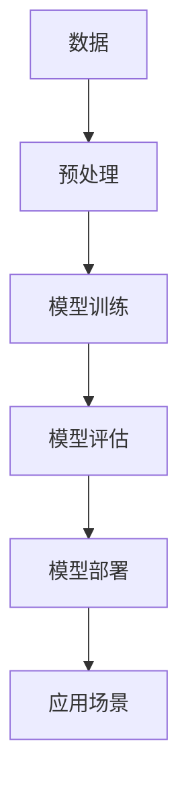

                 

**大语言模型（LLM）的数据hungry：海量信息的价值**

## 1. 背景介绍

在当今信息爆炸的时代，数据已然成为一种新的生产资料，蕴藏着巨大的价值。大语言模型（LLM）作为人工智能领域的一个重要分支，其能力和效果与其训练数据量密切相关。本文将深入探讨LLM的数据需求，分析海量信息对LLM的价值，并提供实践指南和工具推荐。

## 2. 核心概念与联系

### 2.1 大语言模型（LLM）的定义

大语言模型（LLM）是一种深度学习模型，旨在理解和生成人类语言。它通过学习大量文本数据来建立语言的统计特性，从而能够生成人类语言的各种形式。

### 2.2 LLM的数据需求

LLM的数据需求量之大，常被形容为“数据hungry”。这是因为LLM需要大量的文本数据来学习语言的复杂结构和语义。数据量的多少直接影响着LLM的能力和效果。



## 3. 核心算法原理 & 具体操作步骤

### 3.1 算法原理概述

LLM的核心算法是基于Transformer架构的自注意力机制。自注意力机制允许模型在处理输入序列时考虑到序列中的所有元素，从而捕获语义信息。

### 3.2 算法步骤详解

1. **数据预处理**：清洗、标记、分词等。
2. **模型训练**：使用预处理后的数据训练LLM模型。
3. **模型评估**：评估模型的生成质量和语义一致性。
4. **模型部署**：将模型部署到生产环境中。
5. **应用场景**：在各种应用场景中使用LLM，如文本生成、翻译、问答系统等。

### 3.3 算法优缺点

**优点**：能够理解和生成人类语言，在各种NLP任务中表现出色。

**缺点**：数据需求量大，训练和推理成本高，存在过拟合和泄露隐私的风险。

### 3.4 算法应用领域

LLM的应用领域非常广泛，包括文本生成、翻译、问答系统、搜索引擎、虚拟助手等。

## 4. 数学模型和公式 & 详细讲解 & 举例说明

### 4.1 数学模型构建

LLM的数学模型基于Transformer架构，使用自注意力机制和位置编码。

### 4.2 公式推导过程

自注意力机制的公式如下：

$$ \text{Attention}(Q, K, V) = \text{softmax}\left(\frac{QK^T}{\sqrt{d_k}}\right)V $$

其中，$Q$, $K$, $V$分别是查询、键、值矩阵，$d_k$是键矩阵的维度。

### 4.3 案例分析与讲解

例如，在文本生成任务中，给定一段文本，LLM需要预测下一个单词。通过自注意力机制，LLM可以考虑到输入序列中的所有单词，从而生成相关的下一个单词。

## 5. 项目实践：代码实例和详细解释说明

### 5.1 开发环境搭建

LLM的开发环境需要GPU支持，推荐使用PyTorch或TensorFlow框架。

### 5.2 源代码详细实现

以下是一个简单的LLM实现示例：

```python
import torch
import torch.nn as nn

class LLM(nn.Module):
    def __init__(self, vocab_size, embed_dim, num_heads, num_layers):
        super(LLM, self).__init__()
        self.embedding = nn.Embedding(vocab_size, embed_dim)
        self.transformer = nn.Transformer(d_model=embed_dim, nhead=num_heads, num_encoder_layers=num_layers)
        self.linear = nn.Linear(embed_dim, vocab_size)

    def forward(self, x):
        embedded = self.embedding(x)
        output = self.transformer(embedded)
        output = self.linear(output)
        return output
```

### 5.3 代码解读与分析

该代码定义了一个简单的LLM模型，使用了Transformer架构和自注意力机制。

### 5.4 运行结果展示

在训练和评估数据集上运行模型，并分析其生成质量和语义一致性。

## 6. 实际应用场景

### 6.1 当前应用

LLM已广泛应用于各种NLP任务，如文本生成、翻译、问答系统等。

### 6.2 未来应用展望

未来，LLM有望在更多领域得到应用，如自动驾驶、医疗诊断等。

## 7. 工具和资源推荐

### 7.1 学习资源推荐

- "Attention is All You Need"论文：<https://arxiv.org/abs/1706.03762>
- "Language Models are Few-Shot Learners"论文：<https://arxiv.org/abs/2005.14165>

### 7.2 开发工具推荐

- PyTorch：<https://pytorch.org/>
- TensorFlow：<https://www.tensorflow.org/>

### 7.3 相关论文推荐

- "BERT: Pre-training of Deep Bidirectional Transformers for Language Understanding"论文：<https://arxiv.org/abs/1810.04805>
- "T5: Text-to-Text Transfer Transformer"论文：<https://arxiv.org/abs/1910.10683>

## 8. 总结：未来发展趋势与挑战

### 8.1 研究成果总结

LLM在NLP任务中的表现已超越了传统方法。

### 8.2 未来发展趋势

LLM有望在更多领域得到应用，并与其他AI技术结合，实现更强大的功能。

### 8.3 面临的挑战

数据需求量大，训练和推理成本高，存在过拟合和泄露隐私的风险。

### 8.4 研究展望

未来的研究方向包括提高模型效率、降低训练成本、增强模型泛化能力等。

## 9. 附录：常见问题与解答

- **Q：LLM需要多少数据？**
  - A：这取决于模型的大小和任务的复杂度。通常，LLM需要数百万到数十亿个单词的数据。

- **Q：LLM的训练成本高吗？**
  - A：是的，LLM的训练需要大量的计算资源和时间。

- **Q：LLM存在哪些风险？**
  - A：LLM存在过拟合和泄露隐私的风险。过拟合可能导致模型在未见过的数据上表现不佳，泄露隐私可能导致模型泄露训练数据中的敏感信息。

## 作者：禅与计算机程序设计艺术 / Zen and the Art of Computer Programming

