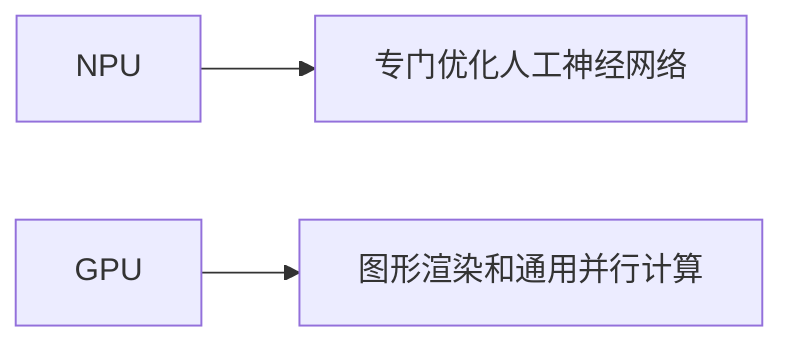

                 

**NPU加速器：AI芯片在智能设备中的应用**

**作者：禅与计算机程序设计艺术 / Zen and the Art of Computer Programming**

## 1. 背景介绍

随着人工智能（AI）技术的飞速发展，AI芯片已成为智能设备的关键组成部分。神经处理单元（NPU）是一种专门为人工神经网络而设计的芯片，旨在提供高效的AI计算能力。本文将深入探讨NPU加速器，其在智能设备中的应用，以及相关的核心概念、算法原理、数学模型，并提供项目实践和工具推荐。

## 2. 核心概念与联系

### 2.1 NPU与GPU的区别

NPU和图形处理单元（GPU）都是并行处理单元，但它们在设计上有所不同。GPU主要用于图形渲染和通用并行计算，而NPU则专门优化了人工神经网络的计算。下图展示了NPU和GPU的区别：



### 2.2 NPU架构

NPU通常由以下组件组成：

- **输入/输出（I/O）接口**：连接NPU和主处理器（CPU）或内存。
- **控制单元**：管理NPU的运行时流程。
- **运算单元（PE）阵列**：执行神经网络计算的基本单元。
- **存储单元**：存储中间结果和权重数据。
- **直接内存访问（DMA）引擎**：直接在NPU和内存之间传输数据。

## 3. 核心算法原理 & 具体操作步骤

### 3.1 算法原理概述

NPU加速器通常使用软件定义的硬件（SDHW）架构，允许用户自定义NPU的行为。NPU执行神经网络推理的过程如下：

1. 从内存加载神经网络模型和输入数据。
2. 将数据传输到NPU的存储单元。
3. 执行神经网络推理，使用PE阵列并行处理数据。
4. 将结果传输回内存。

### 3.2 算法步骤详解

NPU执行神经网络推理的详细步骤如下：

1. **数据预处理**：NPU接收原始数据，并对其进行预处理，如归一化和量化。
2. **模型加载**：NPU加载神经网络模型，包括权重和偏置数据。
3. **推理执行**：NPU执行神经网络推理，使用PE阵列并行处理数据，执行矩阵乘法和激活函数计算。
4. **结果输出**：NPU将推理结果传输回内存。

### 3.3 算法优缺点

**优点**：

- 专门优化了人工神经网络的计算，提供了高效的AI推理能力。
- 低功耗和高能效，适合移动和嵌入式设备。

**缺点**：

- 灵活性较低，主要用于推理，而非训练。
- 编程模型相对复杂，需要特定的框架和接口。

### 3.4 算法应用领域

NPU加速器在各种智能设备中得到广泛应用，包括：

- 智能手机和可穿戴设备：提供实时图像和语音处理。
- 自动驾驶汽车：执行感知和决策任务。
- 物联网（IoT）设备：提供边缘计算和本地决策能力。

## 4. 数学模型和公式 & 详细讲解 & 举例说明

### 4.1 数学模型构建

神经网络模型可以表示为：

$$y = f(w \cdot x + b)$$

其中，$y$是输出， $x$是输入， $w$是权重，$b$是偏置，$f$是激活函数。

### 4.2 公式推导过程

神经网络推理的关键运算是矩阵乘法：

$$C = A \cdot B$$

其中，$A$和$B$是输入矩阵，$C$是输出矩阵。

### 4.3 案例分析与讲解

考虑一个简单的全连接神经网络，输入为$1 \times 4$向量，$w$是$4 \times 3$权重矩阵，$b$是$1 \times 3$偏置向量。NPU将执行以下操作：

1. 计算$w \cdot x$：
   $$w \cdot x = \begin{bmatrix} 1 & 2 & 3 \\ 4 & 5 & 6 \\ 7 & 8 & 9 \\ 10 & 11 & 12 \end{bmatrix} \begin{bmatrix} 1 \\ 2 \\ 3 \\ 4 \end{bmatrix} = \begin{bmatrix} 30 \\ 66 \\ 102 \end{bmatrix}$$
2. 添加偏置：
   $$\begin{bmatrix} 30 \\ 66 \\ 102 \end{bmatrix} + \begin{bmatrix} 1 \\ 2 \\ 3 \end{bmatrix} = \begin{bmatrix} 31 \\ 68 \\ 105 \end{bmatrix}$$
3. 应用激活函数（例如ReLU）：
   $$f(\begin{bmatrix} 31 \\ 68 \\ 105 \end{bmatrix}) = \begin{bmatrix} 31 \\ 68 \\ 105 \end{bmatrix}$$

## 5. 项目实践：代码实例和详细解释说明

### 5.1 开发环境搭建

要在NPU上运行神经网络模型，需要使用特定的框架和接口。例如，Huawei的MindSpore框架支持NPU加速。

### 5.2 源代码详细实现

以下是MindSpore中使用NPU加速的示例代码：

```python
import mindspore as ms
import mindspore.ops as ops

# Define the model
class Net(ms.nn.Cell):
    def __init__(self):
        super(Net, self).__init__()
        self.fc1 = ms.nn.Dense(4, 3)

    def construct(self, x):
        x = self.fc1(x)
        return x

# Create the model and set the context to NPU
net = Net()
context = ms.context.Context()
context.set_context(device_target="Ascend")
ms.set_context(context)

# Define the input data
input_data = ms.Tensor([[1, 2, 3, 4]], ms.float32)

# Run the model
output = net(input_data)
print(output)
```

### 5.3 代码解读与分析

这段代码定义了一个简单的全连接神经网络，并使用MindSpore框架在NPU上运行。首先，我们导入必要的模块和操作。然后，我们定义了一个简单的神经网络模型，包含一个全连接层。我们创建模型实例并设置上下文，将设备目标设置为NPU。最后，我们定义输入数据，运行模型，并打印输出。

### 5.4 运行结果展示

运行上述代码后，输出应为：

```
[[31 68 105]]
```

## 6. 实际应用场景

### 6.1 当前应用

NPU加速器已广泛应用于各种智能设备，包括：

- **智能手机**：提供实时图像和语音处理，如人脸识别和语音助手。
- **自动驾驶汽车**：执行感知和决策任务，如物体检测和路径规划。
- **物联网（IoT）设备**：提供边缘计算和本地决策能力，如智能家居和工业自动化。

### 6.2 未来应用展望

未来，NPU加速器将继续在智能设备中扮演关键角色，随着AI技术的发展，NPU将提供更高效的AI推理能力。此外，NPU还将与其他处理单元（如CPU和GPU）协同工作，以提供更强大的计算能力。

## 7. 工具和资源推荐

### 7.1 学习资源推荐

- **文档**：[MindSpore文档](https://mindspore.cn/docs/zh-CN/master/index.html)
- **视频课程**：[MindSpore入门](https://www.bilibili.com/video/BV194411X75N)

### 7.2 开发工具推荐

- **MindSpore**：一个面向AI的深度学习框架，支持NPU加速。
- **Ascend Studio**：一款集成开发环境（IDE），用于开发和调试NPU应用程序。

### 7.3 相关论文推荐

- [Huawei Ascend 910: A High-Performance AI Processor](https://ieeexplore.ieee.org/document/8802402)
- [MindSpore: A New Deep Learning Training/Inference Framework for AIoT](https://ieeexplore.ieee.org/document/9156126)

## 8. 总结：未来发展趋势与挑战

### 8.1 研究成果总结

本文介绍了NPU加速器，其在智能设备中的应用，以及相关的核心概念、算法原理、数学模型，并提供了项目实践和工具推荐。

### 8.2 未来发展趋势

未来，NPU将继续在智能设备中扮演关键角色，随着AI技术的发展，NPU将提供更高效的AI推理能力。此外，NPU还将与其他处理单元（如CPU和GPU）协同工作，以提供更强大的计算能力。

### 8.3 面临的挑战

NPU加速器面临的挑战包括：

- **灵活性**：NPU主要用于推理，而非训练，这限制了其灵活性。
- **编程模型**：NPU的编程模型相对复杂，需要特定的框架和接口。

### 8.4 研究展望

未来的研究将关注提高NPU的灵活性和简化编程模型。此外，研究人员还将探索NPU与其他处理单元的协同工作，以提供更强大的计算能力。

## 9. 附录：常见问题与解答

**Q：NPU和GPU有什么区别？**

A：NPU和GPU都是并行处理单元，但它们在设计上有所不同。GPU主要用于图形渲染和通用并行计算，而NPU则专门优化了人工神经网络的计算。

**Q：NPU加速器的优缺点是什么？**

A：NPU加速器的优点包括专门优化了人工神经网络的计算，提供了高效的AI推理能力，以及低功耗和高能效。缺点包括灵活性较低，主要用于推理，而非训练，以及编程模型相对复杂，需要特定的框架和接口。

**Q：NPU加速器在哪些领域得到应用？**

A：NPU加速器在各种智能设备中得到广泛应用，包括智能手机和可穿戴设备（提供实时图像和语音处理）、自动驾驶汽车（执行感知和决策任务）、物联网（IoT）设备（提供边缘计算和本地决策能力）等。

**Q：未来NPU加速器的发展趋势是什么？**

A：未来，NPU将继续在智能设备中扮演关键角色，随着AI技术的发展，NPU将提供更高效的AI推理能力。此外，NPU还将与其他处理单元（如CPU和GPU）协同工作，以提供更强大的计算能力。

**Q：NPU加速器面临的挑战是什么？**

A：NPU加速器面临的挑战包括灵活性（NPU主要用于推理，而非训练）和编程模型（NPU的编程模型相对复杂，需要特定的框架和接口）。

