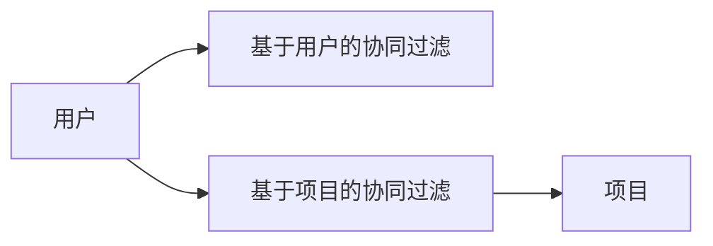

                 

## 1. 背景介绍

在当今信息爆炸的时代，推荐系统已成为各大平台的必备功能，它能够帮助用户从海量信息中发现感兴趣的内容。协同过滤（Collaborative Filtering）是推荐系统中最常用的算法之一，它通过分析用户的行为数据，如点赞、评分、购买等，来预测用户的兴趣。本文将介绍如何使用Python构建并优化协同过滤模型，以构建高效的推荐系统。

## 2. 核心概念与联系

### 2.1 协同过滤的类型

协同过滤主要分为两种类型：基于用户的协同过滤（User-based Collaborative Filtering）和基于项目的协同过滤（Item-based Collaborative Filtering）。二者的区别在于，前者是根据用户的行为数据来预测用户的兴趣，后者则是根据项目的行为数据来预测用户的兴趣。



### 2.2 协同过滤的优缺点

协同过滤的优点是能够提供个性化的推荐，缺点是数据稀疏性和冷启动问题。数据稀疏性是指用户对项目的行为数据往往是稀疏的，这会导致推荐结果不准确。冷启动问题是指新用户或新项目缺乏行为数据，难以进行推荐。

## 3. 核心算法原理 & 具体操作步骤

### 3.1 算法原理概述

基于用户的协同过滤的原理是，找到与目标用户兴趣相似的用户，并推荐给目标用户这些用户喜欢的项目。基于项目的协同过滤的原理是，找到与目标项目相似的项目，并推荐给目标用户这些项目。

### 3.2 算法步骤详解

#### 3.2.1 基于用户的协同过滤

1. 计算用户之间的相似度矩阵。
2. 找到与目标用户兴趣相似的用户。
3. 推荐给目标用户这些用户喜欢的项目。

#### 3.2.2 基于项目的协同过滤

1. 计算项目之间的相似度矩阵。
2. 找到与目标项目相似的项目。
3. 推荐给目标用户这些项目。

### 3.3 算法优缺点

基于用户的协同过滤的优点是能够提供个性化的推荐，缺点是计算量大，难以扩展。基于项目的协同过滤的优点是计算量小，易于扩展，缺点是推荐结果不够个性化。

### 3.4 算法应用领域

协同过滤广泛应用于推荐系统，如电影推荐、音乐推荐、商品推荐等。

## 4. 数学模型和公式 & 详细讲解 & 举例说明

### 4.1 数学模型构建

设用户集合为$U = \{u_1, u_2,..., u_m\}$, 项目集合为$I = \{i_1, i_2,..., i_n\}$, 用户$u_i$对项目$i_j$的评分为$r_{ij}$. 则用户-项目评分矩阵为$R = \{r_{ij}\}$.

### 4.2 公式推导过程

#### 4.2.1 基于用户的协同过滤

用户$u_i$和$u_j$之间的相似度可以使用余弦相似度公式计算：

$$sim(u_i, u_j) = \frac{\sum_{k=1}^{n} r_{ik} \cdot r_{jk}}{\sqrt{\sum_{k=1}^{n} r_{ik}^2} \cdot \sqrt{\sum_{k=1}^{n} r_{jk}^2}}$$

目标用户$u_i$对项目$i_j$的预测评分为：

$$\hat{r}_{ij} = \frac{\sum_{u_k \in N(u_i)} sim(u_i, u_k) \cdot r_{kj}}{\sum_{u_k \in N(u_i)} |sim(u_i, u_k)|}$$

其中$N(u_i)$是与用户$u_i$兴趣相似的用户集合。

#### 4.2.2 基于项目的协同过滤

项目$i_j$和$i_k$之间的相似度可以使用余弦相似度公式计算：

$$sim(i_j, i_k) = \frac{\sum_{u_i=1}^{m} r_{ij} \cdot r_{ik}}{\sqrt{\sum_{u_i=1}^{m} r_{ij}^2} \cdot \sqrt{\sum_{u_i=1}^{m} r_{ik}^2}}$$

目标用户$u_i$对项目$i_j$的预测评分为：

$$\hat{r}_{ij} = \frac{\sum_{i_k \in N(i_j)} sim(i_j, i_k) \cdot r_{ik}}{\sum_{i_k \in N(i_j)} |sim(i_j, i_k)|}$$

其中$N(i_j)$是与项目$i_j$相似的项目集合。

### 4.3 案例分析与讲解

例如，在电影推荐系统中，用户-电影评分矩阵如下：

|       | 电影1 | 电影2 | 电影3 |
|-------|-------|-------|-------|
| 用户1 | 5     | 4     | -     |
| 用户2 | 3     | -     | 5     |
| 用户3 | -     | 4     | 3     |

使用基于用户的协同过滤，计算用户1和用户2的相似度为0.5，则可以推荐给用户1电影3。使用基于项目的协同过滤，计算电影1和电影2的相似度为0.5，则可以推荐给喜欢电影1的用户电影2。

## 5. 项目实践：代码实例和详细解释说明

### 5.1 开发环境搭建

本项目使用Python作为开发语言，并使用NumPy、Pandas、Scikit-learn等库。

### 5.2 源代码详细实现

```python
import numpy as np
import pandas as pd
from sklearn.metrics.pairwise import cosine_similarity

# 用户-项目评分矩阵
R = np.array([[5, 4, 0],
              [3, 0, 5],
              [0, 4, 3]])

# 计算用户之间的相似度矩阵
user_sim = cosine_similarity(R)

# 计算项目之间的相似度矩阵
item_sim = cosine_similarity(R.T)

# 基于用户的协同过滤
def user_based_cf(user_id, item_id):
    # 找到与目标用户兴趣相似的用户
    similar_users = np.argsort(user_sim[user_id])[::-1][1:]
    # 推荐给目标用户这些用户喜欢的项目
    recommended_items = np.mean(R[similar_users, item_id])
    return recommended_items

# 基于项目的协同过滤
def item_based_cf(user_id, item_id):
    # 找到与目标项目相似的项目
    similar_items = np.argsort(item_sim[item_id])[::-1][1:]
    # 推荐给目标用户这些项目
    recommended_items = np.mean(R[user_id, similar_items])
    return recommended_items
```

### 5.3 代码解读与分析

在代码中，我们首先使用NumPy和Pandas构建用户-项目评分矩阵。然后，我们使用Scikit-learn的余弦相似度函数计算用户之间的相似度矩阵和项目之间的相似度矩阵。最后，我们定义了基于用户的协同过滤函数和基于项目的协同过滤函数，分别计算目标用户对目标项目的预测评分。

### 5.4 运行结果展示

运行代码，可以得到目标用户对目标项目的预测评分。

## 6. 实际应用场景

协同过滤模型广泛应用于各种推荐系统，如电影推荐、音乐推荐、商品推荐等。例如，Netflix使用基于用户的协同过滤算法来推荐电影，Amazon使用基于项目的协同过滤算法来推荐商品。

### 6.4 未来应用展望

随着大数据和人工智能技术的发展，协同过滤模型将会得到进一步的优化和扩展。例如，引入深度学习技术来改进协同过滤模型的准确性，或者结合内容过滤技术来提供更个性化的推荐。

## 7. 工具和资源推荐

### 7.1 学习资源推荐

推荐阅读《推荐系统实践》一书，该书详细介绍了推荐系统的原理和实现。

### 7.2 开发工具推荐

推荐使用Python作为开发语言，并使用NumPy、Pandas、Scikit-learn等库。

### 7.3 相关论文推荐

推荐阅读《The BellKor Prize: Winning the Netflix Challenge》一文，该文详细介绍了Netflix推荐系统的实现。

## 8. 总结：未来发展趋势与挑战

### 8.1 研究成果总结

本文介绍了协同过滤模型的原理和实现，并提供了代码实例和详细解释说明。

### 8.2 未来发展趋势

未来，协同过滤模型将会得到进一步的优化和扩展，并结合其他技术来提供更个性化的推荐。

### 8.3 面临的挑战

协同过滤模型面临的挑战包括数据稀疏性和冷启动问题。

### 8.4 研究展望

未来的研究方向包括引入深度学习技术来改进协同过滤模型的准确性，或者结合内容过滤技术来提供更个性化的推荐。

## 9. 附录：常见问题与解答

**Q：协同过滤模型的优缺点是什么？**

**A：协同过滤模型的优点是能够提供个性化的推荐，缺点是数据稀疏性和冷启动问题。**

**Q：协同过滤模型有哪些应用领域？**

**A：协同过滤模型广泛应用于各种推荐系统，如电影推荐、音乐推荐、商品推荐等。**

**Q：协同过滤模型的未来发展趋势是什么？**

**A：未来，协同过滤模型将会得到进一步的优化和扩展，并结合其他技术来提供更个性化的推荐。**

## 作者：禅与计算机程序设计艺术 / Zen and the Art of Computer Programming

