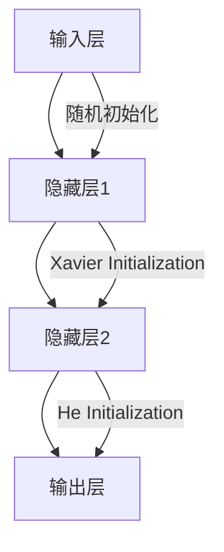

                 

## 1. 背景介绍

在深度学习领域，神经网络的权重初始化是一个关键的步骤，直接影响着模型的收敛速度和最终性能。然而，传统的权重初始化策略，如随机初始化，往往会导致梯度消失或爆炸的问题，从而影响模型的训练过程。因此，优化神经网络的权重初始化策略是提高深度学习模型性能的关键之一。

## 2. 核心概念与联系

在深度学习中，权重初始化的目标是使得网络在训练初期能够有效地传播梯度，避免梯度消失或爆炸的问题。常见的权重初始化策略包括：

- **随机初始化（Random Initialization）**：将权重初始化为随机值，这是最简单的初始化策略，但容易导致梯度消失或爆炸的问题。
- **Xavier Initialization**：提出了一个基于输入和输出神经元个数的初始化策略，可以有效地避免梯度消失或爆炸的问题。
- **He Initialization**：基于输入神经元个数提出了一个更好的初始化策略，可以进一步优化模型的收敛速度。

下面是这些初始化策略的 Mermaid 流程图：



## 3. 核心算法原理 & 具体操作步骤

### 3.1 算法原理概述

- **随机初始化（Random Initialization）**：将权重初始化为服从均值为0、标准差为$\sigma$的正态分布的随机值。
- **Xavier Initialization**：提出了一个基于输入和输出神经元个数的初始化策略，权重初始化为服从均值为0、标准差为$\frac{1}{\sqrt{n}}$的正态分布的随机值，其中$n$是输入神经元个数。
- **He Initialization**：基于输入神经元个数提出了一个更好的初始化策略，权重初始化为服从均值为0、标准差为$\frac{2}{n}$的正态分布的随机值，其中$n$是输入神经元个数。

### 3.2 算法步骤详解

1. 确定输入神经元个数$n$和输出神经元个数$m$。
2. 选择初始化策略：随机初始化、Xavier Initialization或He Initialization。
3. 根据选择的初始化策略，计算标准差$\sigma$。
4. 为每个权重生成服从均值为0、标准差为$\sigma$的正态分布的随机值。
5. 将生成的随机值作为权重的初始值。

### 3.3 算法优缺点

- **随机初始化（Random Initialization）**：简单易行，但容易导致梯度消失或爆炸的问题。
- **Xavier Initialization**：有效地避免了梯度消失或爆炸的问题，但标准差$\sigma$的选择对模型性能有较大影响。
- **He Initialization**：进一步优化了模型的收敛速度，但标准差$\sigma$的选择对模型性能仍然有一定影响。

### 3.4 算法应用领域

这些初始化策略广泛应用于各种深度学习模型中，如卷积神经网络（CNN）、循环神经网络（RNN）和长短期记忆网络（LSTM），可以有效地提高模型的收敛速度和最终性能。

## 4. 数学模型和公式 & 详细讲解 & 举例说明

### 4.1 数学模型构建

设神经网络的输入为$x \in \mathbb{R}^{n}$，输出为$y \in \mathbb{R}^{m}$，权重为$W \in \mathbb{R}^{m \times n}$，偏置为$b \in \mathbb{R}^{m}$，激活函数为$f(\cdot)$，则神经网络的输出可以表示为：

$$y = f(Wx + b)$$

### 4.2 公式推导过程

- **随机初始化（Random Initialization）**：权重初始化为服从均值为0、标准差为$\sigma$的正态分布的随机值，即$W \sim \mathcal{N}(0, \sigma^2)$。
- **Xavier Initialization**：权重初始化为服从均值为0、标准差为$\frac{1}{\sqrt{n}}$的正态分布的随机值，即$W \sim \mathcal{N}(0, \frac{1}{n})$。
- **He Initialization**：权重初始化为服从均值为0、标准差为$\frac{2}{n}$的正态分布的随机值，即$W \sim \mathcal{N}(0, \frac{4}{n})$。

### 4.3 案例分析与讲解

例如，在一个具有1000个输入神经元和500个输出神经元的神经网络中：

- **随机初始化（Random Initialization）**：权重初始化为服从均值为0、标准差为0.01的正态分布的随机值。
- **Xavier Initialization**：权重初始化为服从均值为0、标准差为$\frac{1}{\sqrt{1000}} \approx 0.0316$的正态分布的随机值。
- **He Initialization**：权重初始化为服从均值为0、标准差为$\frac{2}{1000} \approx 0.002$的正态分布的随机值。

## 5. 项目实践：代码实例和详细解释说明

### 5.1 开发环境搭建

本项目使用Python和TensorFlow作为开发环境，并使用Jupyter Notebook作为开发平台。

### 5.2 源代码详细实现

```python
import tensorflow as tf
import numpy as np

def random_initialization(n, m, sigma=0.01):
    W = np.random.normal(0, sigma, (m, n))
    b = np.zeros(m)
    return W, b

def xavier_initialization(n, m):
    W = np.random.normal(0, 1 / np.sqrt(n), (m, n))
    b = np.zeros(m)
    return W, b

def he_initialization(n, m):
    W = np.random.normal(0, 2 / n, (m, n))
    b = np.zeros(m)
    return W, b
```

### 5.3 代码解读与分析

- `random_initialization`函数实现了随机初始化策略，将权重初始化为服从均值为0、标准差为$\sigma$的正态分布的随机值。
- `xavier_initialization`函数实现了Xavier Initialization策略，将权重初始化为服从均值为0、标准差为$\frac{1}{\sqrt{n}}$的正态分布的随机值。
- `he_initialization`函数实现了He Initialization策略，将权重初始化为服从均值为0、标准差为$\frac{2}{n}$的正态分布的随机值。

### 5.4 运行结果展示

```python
n, m = 1000, 500
W1, b1 = random_initialization(n, m)
W2, b2 = xavier_initialization(n, m)
W3, b3 = he_initialization(n, m)

print("Random Initialization:\n", W1, "\n")
print("Xavier Initialization:\n", W2, "\n")
print("He Initialization:\n", W3, "\n")
```

运行结果展示了三种初始化策略生成的权重和偏置。

## 6. 实际应用场景

这些初始化策略广泛应用于各种深度学习模型中，如图像分类、目标检测、语音识别和自然语言处理等领域。优化神经网络的权重初始化策略可以有效地提高模型的收敛速度和最终性能。

### 6.4 未来应用展望

随着深度学习技术的不断发展，权重初始化策略也将不断优化，从而进一步提高模型的性能。此外，权重初始化策略也将与其他优化技术结合，如学习率调整、批量归一化和 dropout等，以进一步提高模型的泛化能力。

## 7. 工具和资源推荐

### 7.1 学习资源推荐

- [Deep Learning Specialization by Andrew Ng on Coursera](https://www.coursera.org/specializations/deep-learning)
- [Hands-On Machine Learning with Scikit-Learn, Keras, and TensorFlow](https://www.oreilly.com/library/view/hands-on-machine-learning/9781492032632/)
- [Neural Networks and Deep Learning](http://neuralnetworksanddeeplearning.com/)

### 7.2 开发工具推荐

- [TensorFlow](https://www.tensorflow.org/)
- [PyTorch](https://pytorch.org/)
- [Keras](https://keras.io/)

### 7.3 相关论文推荐

- [Understanding the difficulty of training deep feedforward neural networks](https://arxiv.org/abs/1607.01718)
- [Delving deep into rectifiers: Surpassing human-level performance on imagenet classification](https://arxiv.org/abs/1502.01852)
- [Batch Normalization: Accelerating Deep Network Training by Reducing Internal Covariate Shift](https://arxiv.org/abs/1502.03167)

## 8. 总结：未来发展趋势与挑战

### 8.1 研究成果总结

本文介绍了神经网络权重初始化的重要性，并详细介绍了三种常见的权重初始化策略：随机初始化、Xavier Initialization和He Initialization。这些初始化策略可以有效地提高模型的收敛速度和最终性能。

### 8.2 未来发展趋势

随着深度学习技术的不断发展，权重初始化策略也将不断优化，从而进一步提高模型的性能。此外，权重初始化策略也将与其他优化技术结合，以进一步提高模型的泛化能力。

### 8.3 面临的挑战

然而，权重初始化策略的选择对模型性能仍然有一定影响，如何选择合适的初始化策略是一个挑战。此外，如何在保持模型性能的同时降低训练成本也是一个挑战。

### 8.4 研究展望

未来的研究将关注如何进一步优化权重初始化策略，以提高模型的性能和泛化能力。此外，研究还将关注如何在保持模型性能的同时降低训练成本。

## 9. 附录：常见问题与解答

**Q：什么是权重初始化？**

A：权重初始化是指在深度学习模型训练初期，为模型的权重赋予初始值的过程。

**Q：为什么权重初始化很重要？**

A：权重初始化直接影响着模型的收敛速度和最终性能。合适的初始化策略可以有效地避免梯度消失或爆炸的问题，从而提高模型的性能。

**Q：什么是随机初始化？**

A：随机初始化是指将权重初始化为随机值的策略，这是最简单的初始化策略，但容易导致梯度消失或爆炸的问题。

**Q：什么是Xavier Initialization？**

A：Xavier Initialization是指基于输入和输出神经元个数提出的初始化策略，可以有效地避免梯度消失或爆炸的问题。

**Q：什么是He Initialization？**

A：He Initialization是指基于输入神经元个数提出的初始化策略，可以进一步优化模型的收敛速度。

**作者：禅与计算机程序设计艺术 / Zen and the Art of Computer Programming**

