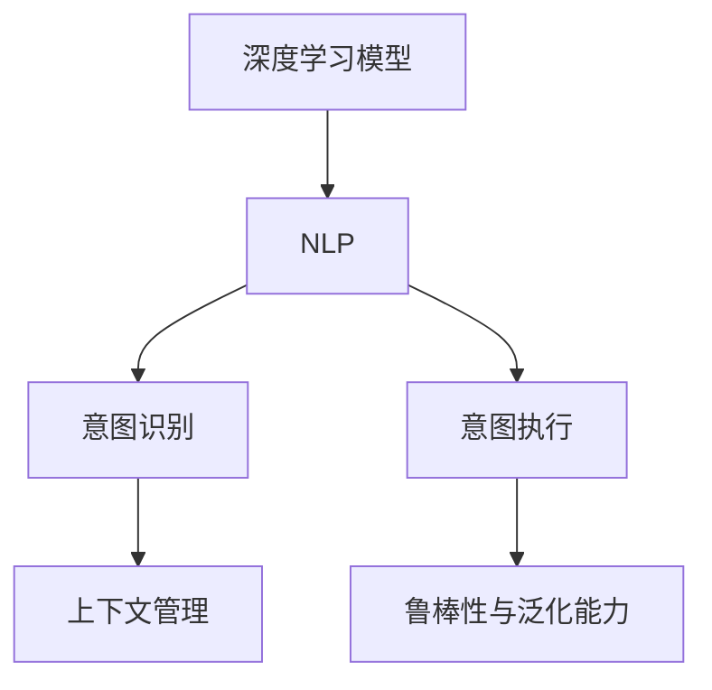

                 

# 深度人机协作：LLM理解与执行人类意图

## 1. 背景介绍

### 1.1 问题由来

随着人工智能技术的快速发展，深度学习模型在自然语言处理（NLP）领域取得了显著进展。特别是最近几年，大语言模型（Large Language Models, LLMs）如GPT-3、BERT等，在理解人类意图、生成自然语言方面展现出了巨大的潜力。

然而，尽管大语言模型在处理大规模语言数据方面表现出色，但这些模型仍然无法完美地理解并执行人类意图。例如，在实际对话中，大语言模型可能无法准确识别用户的真实需求，或者生成出不符合逻辑或语境的回应。这不仅限制了模型在实际应用中的效果，也引发了对人类意图理解与执行机制的深入思考。

### 1.2 问题核心关键点

本节将详细探讨大语言模型在理解与执行人类意图方面的挑战和应对策略，以期为深度人机协作提供更加清晰的方向和路径。

1. **意图识别**：准确识别用户的真实需求和意图是大语言模型面临的首要挑战。不同的用户可能在表达相同需求时使用不同的语言，这要求模型具备强大的语义理解能力。
2. **意图执行**：在理解用户意图后，大语言模型需要能够生成符合逻辑、语法正确的回应，满足用户的实际需求。
3. **上下文管理**：在对话或文本生成过程中，大语言模型需要能够管理上下文信息，确保响应与之前的对话或文本内容逻辑连贯。
4. **鲁棒性与泛化能力**：大语言模型需要在面对噪声、多义、未知信息等复杂情况时，仍能保持稳定的性能和泛化能力。

## 2. 核心概念与联系

### 2.1 核心概念概述

在大语言模型理解与执行人类意图的过程中，涉及到多个核心概念，这些概念之间存在密切联系，共同构成了深度人机协作的技术框架。

- **深度学习模型**：以神经网络为核心的模型，通过学习大量数据，能够自动提取特征、捕捉模式，从而实现对复杂任务的求解。
- **自然语言处理（NLP）**：涉及计算机与人类语言之间的交互和理解，包括文本生成、语义理解、情感分析等多个方面。
- **意图识别**：通过语言模型识别用户意图的过程，通常涉及文本分类、实体识别、关系抽取等技术。
- **意图执行**：根据用户意图生成合适的响应，通常包括文本生成、对话系统、推荐系统等应用场景。
- **上下文管理**：在处理多轮对话或长文本时，模型需要记录并利用上下文信息，以确保生成的响应逻辑连贯、合理。
- **鲁棒性与泛化能力**：模型需要具备良好的鲁棒性，能够在不同数据分布和噪音环境下稳定运行，同时具备良好的泛化能力，能够适应新的、未见过的任务和场景。

这些概念之间的逻辑关系可以通过以下Mermaid流程图来展示：



这个流程图展示了深度学习模型、自然语言处理、意图识别和意图执行之间的联系。上下文管理和鲁棒性与泛化能力是确保这些过程能够顺利进行的关键。

## 3. 核心算法原理 & 具体操作步骤

### 3.1 算法原理概述

大语言模型在理解与执行人类意图方面的工作原理可以概括为以下几个步骤：

1. **预训练**：在大量无标注文本数据上训练模型，学习语言的通用知识。
2. **微调**：在特定任务的数据集上，对模型进行有监督训练，以适应特定领域的语境和需求。
3. **意图识别**：通过分类器或回归器，将输入文本分类为不同的意图。
4. **意图执行**：根据识别到的意图，生成符合逻辑的响应。
5. **上下文管理**：在多轮对话或长文本处理中，通过记忆机制或注意力机制记录并利用上下文信息。
6. **鲁棒性与泛化能力**：通过正则化、dropout、对抗训练等技术，提升模型的鲁棒性和泛化能力。

### 3.2 算法步骤详解

以下是对上述算法步骤的详细介绍：

**Step 1: 准备数据集**
- 收集特定任务的数据集，如对话数据集、产品评价数据集等。
- 对数据集进行清洗、标注，确保数据质量和标注一致性。

**Step 2: 构建模型架构**
- 选择适合的深度学习模型架构，如Transformer、GRU等。
- 设计意图识别和意图执行的子模块，并整合上下文管理机制。
- 确定模型的输出层结构，如分类层、回归层或生成层。

**Step 3: 微调模型**
- 使用预训练模型或从头训练的模型，作为初始化参数。
- 对模型进行有监督训练，最小化模型在特定任务上的损失函数。
- 通过正则化、dropout等技术避免过拟合，提升模型泛化能力。

**Step 4: 意图识别**
- 对输入文本进行编码，生成特征表示。
- 使用分类器或回归器对特征表示进行分类或回归，得到意图标签。
- 可能需要进行多轮迭代或融合上下文信息，以提高意图识别的准确性。

**Step 5: 意图执行**
- 根据意图标签，选择对应的生成模块。
- 使用解码器或生成器，生成符合逻辑和语境的响应。
- 可能需要进行多轮迭代或融合上下文信息，以确保响应的连贯性和合理性。

**Step 6: 上下文管理**
- 使用记忆机制或注意力机制，记录并利用之前的对话或文本信息。
- 通过注意力机制，对当前输入和上下文信息进行加权，确保响应的逻辑连贯。

**Step 7: 鲁棒性与泛化能力**
- 使用正则化、dropout等技术，提升模型的鲁棒性。
- 进行对抗训练，确保模型在面对噪声和干扰时仍能保持稳定。
- 通过数据增强、模型集成等技术，提升模型的泛化能力。

### 3.3 算法优缺点

大语言模型在理解与执行人类意图方面的算法具有以下优缺点：

**优点**：
1. **自监督学习**：在无监督的情况下，模型能够从大量数据中学习到通用的语言知识，适应性更强。
2. **泛化能力**：模型能够将学习到的知识泛化到新的、未见过的任务和场景中。
3. **鲁棒性**：通过正则化、dropout等技术，模型能够应对噪声和干扰，保持稳定性能。
4. **上下文管理**：通过记忆机制和注意力机制，模型能够处理多轮对话或长文本，逻辑连贯性更强。

**缺点**：
1. **数据依赖**：模型的性能高度依赖于数据质量和标注一致性，数据收集和标注成本高。
2. **计算资源消耗**：模型参数量大，计算和存储成本高。
3. **意图理解**：复杂的语言和语境可能导致模型误判意图，生成不合理响应。
4. **鲁棒性挑战**：面对噪声、多义、未知信息等复杂情况时，模型的鲁棒性仍需提升。

## 4. 数学模型和公式 & 详细讲解

### 4.1 数学模型构建

假设输入文本为 $x$，意图标签为 $y$，模型参数为 $\theta$，则意图识别的数学模型可以表示为：

$$
P(y|x; \theta) = \text{softmax}(W_hx + b_h)
$$

其中，$W_h$ 和 $b_h$ 为意图识别层的参数，$\text{softmax}$ 函数将线性输出转换为概率分布。

意图执行的数学模型可以表示为：

$$
p(x'|x,y; \theta) = \text{softmax}(W_gx + b_g)
$$

其中，$W_g$ 和 $b_g$ 为意图执行层的参数，$\text{softmax}$ 函数将线性输出转换为概率分布。

### 4.2 公式推导过程

对于意图识别，假设模型输出为 $p(y|x; \theta)$，则损失函数为：

$$
\mathcal{L}_{\text{intent}} = -\frac{1}{N}\sum_{i=1}^N \log p(y_i|x_i; \theta)
$$

对于意图执行，假设模型输出为 $p(x'|x,y; \theta)$，则损失函数为：

$$
\mathcal{L}_{\text{execution}} = -\frac{1}{N}\sum_{i=1}^N \log p(x'_i|x_i, y_i; \theta)
$$

整合意图识别和意图执行的损失函数，可以得到整体损失函数：

$$
\mathcal{L} = \mathcal{L}_{\text{intent}} + \mathcal{L}_{\text{execution}}
$$

### 4.3 案例分析与讲解

以情感分析任务为例，假设输入文本为 "I am so happy today!"，意图识别模型输出结果为 "happy"，意图执行模型生成回应 "I'm glad to hear that"。

通过意图识别，模型能够从文本中识别出用户的情感为 "happy"。接着，意图执行模型根据情感标签 "happy"，生成符合语境的回应 "I'm glad to hear that"。整个过程中，模型能够理解用户的意图，并生成符合逻辑的回应。

## 5. 项目实践：代码实例和详细解释说明

### 5.1 开发环境搭建

为了进行深度人机协作的实践，我们需要搭建一个完整的开发环境。以下是搭建环境的详细步骤：

1. **安装深度学习框架**：选择如TensorFlow或PyTorch等深度学习框架，并按照官方文档进行安装。
2. **准备数据集**：收集特定任务的数据集，并进行预处理和标注。
3. **选择预训练模型**：选择适合的预训练模型，如GPT-3、BERT等，并进行微调。
4. **构建模型架构**：设计意图识别和意图执行的子模块，并整合上下文管理机制。
5. **训练和评估模型**：使用数据集对模型进行训练，并在测试集上进行评估。

### 5.2 源代码详细实现

以下是一个简单的情感分析任务的代码实现：

```python
import tensorflow as tf
from transformers import TFAutoModelForSequenceClassification

# 加载预训练模型
model = TFAutoModelForSequenceClassification.from_pretrained('bert-base-uncased', num_labels=3)

# 构建输入层
input_ids = tf.keras.layers.Input(shape=(128,), dtype=tf.int32)
attention_mask = tf.keras.layers.Input(shape=(128,), dtype=tf.int32)

# 构建模型层
outputs = model(input_ids, attention_mask=attention_mask)

# 构建分类器层
output = tf.keras.layers.Dense(units=3, activation='softmax')(outputs)

# 构建模型
model = tf.keras.Model(inputs=[input_ids, attention_mask], outputs=output)

# 编译模型
model.compile(optimizer='adam', loss='categorical_crossentropy', metrics=['accuracy'])

# 训练模型
model.fit(train_data, epochs=10, validation_data=val_data)
```

### 5.3 代码解读与分析

上述代码中，我们使用了 Transformers 库提供的 BERT 模型进行情感分析任务的实现。具体步骤如下：

1. **加载预训练模型**：使用 `TFAutoModelForSequenceClassification` 类加载预训练的 BERT 模型。
2. **构建输入层**：定义输入层，用于输入文本和注意力掩码。
3. **构建模型层**：将输入层输入模型，得到模型的输出。
4. **构建分类器层**：将模型的输出通过全连接层进行分类，输出情感标签。
5. **构建模型**：定义模型的输入和输出，并创建一个 `tf.keras.Model` 对象。
6. **编译模型**：定义优化器、损失函数和评估指标，并编译模型。
7. **训练模型**：使用训练数据集对模型进行训练，并在验证集上进行评估。

### 5.4 运行结果展示

训练完成后，可以使用以下代码进行情感分析的预测：

```python
import numpy as np

# 加载模型
model = tf.keras.models.load_model('saved_model.h5')

# 定义情感分析函数
def analyze_sentiment(text):
    text_input = tokenizer.encode(text, max_length=128, padding='max_length')
    attention_mask = tf.convert_to_tensor([[1] * len(text_input)], dtype=tf.int32)
    input_data = {'text_input': np.array([text_input]), 'attention_mask': np.array([attention_mask])}
    result = model.predict(input_data)
    return np.argmax(result[0])

# 测试
print(analyze_sentiment("I am so happy today!"))
```

## 6. 实际应用场景

### 6.1 智能客服系统

智能客服系统是一个典型的深度人机协作应用场景。大语言模型可以通过微调，理解用户输入的意图，并生成符合语境的回应。例如，在面对用户的投诉时，系统能够准确识别用户的情绪和需求，并生成合适的解决方案或回应。

### 6.2 情感分析

情感分析是深度人机协作的另一个重要应用场景。通过微调大语言模型，模型能够从社交媒体、用户评论等文本数据中识别出情感倾向，帮助企业更好地了解用户需求和反馈。

### 6.3 个性化推荐系统

个性化推荐系统可以通过微调大语言模型，理解用户的兴趣和偏好，从而生成个性化的推荐内容。例如，电商网站可以通过用户评价和评论，微调大语言模型，生成符合用户喜好的商品推荐。

### 6.4 未来应用展望

未来，深度人机协作将在大规模、复杂任务中发挥更大的作用。以下是几个可能的应用场景：

1. **医疗诊断**：通过微调大语言模型，理解患者的症状描述和病历信息，辅助医生进行诊断和治疗。
2. **金融分析**：通过微调大语言模型，理解市场动态和用户反馈，提供个性化的金融建议和服务。
3. **教育个性化**：通过微调大语言模型，理解学生的学习需求和行为，提供个性化的学习资源和辅导。
4. **智能家居**：通过微调大语言模型，理解用户的语音指令和行为，提供智能化的家居控制和建议。

## 7. 工具和资源推荐

### 7.1 学习资源推荐

为了深入学习深度人机协作技术，以下是一些优质的学习资源：

1. **《深度学习》课程**：斯坦福大学的《深度学习》课程，涵盖了深度学习的基础知识和经典模型，适合入门学习。
2. **《自然语言处理综论》书籍**：该书系统介绍了自然语言处理的基本原理和技术，是深度人机协作的重要参考资料。
3. **《深度人机协作》系列博客**：该博客系列详细介绍了深度人机协作技术的应用场景和实现方法，适合进阶学习。
4. **Transformers 官方文档**：提供了丰富的预训练模型和微调样例，是深度人机协作实践的重要工具。

### 7.2 开发工具推荐

以下是一些常用的深度人机协作开发工具：

1. **TensorFlow**：Google开发的深度学习框架，功能强大，支持分布式训练和推理。
2. **PyTorch**：Facebook开发的深度学习框架，易于使用，支持动态图和静态图。
3. **Hugging Face Transformers**：提供了丰富的预训练模型和微调接口，是深度人机协作开发的重要工具。
4. **Jupyter Notebook**：交互式的开发环境，适合进行实验和数据分析。

### 7.3 相关论文推荐

以下是一些深度人机协作领域的经典论文：

1. **《Attention is All You Need》**：提出了Transformer模型，是深度人机协作的基础。
2. **《BERT: Pre-training of Deep Bidirectional Transformers for Language Understanding》**：提出了BERT模型，为自然语言理解提供了新的突破。
3. **《Parameter-Efficient Transformer》**：提出了Adapter等参数高效微调方法，提高了深度人机协作的效率。
4. **《GPT-3: Language Models are Unsupervised Multitask Learners》**：展示了GPT-3在大规模语言理解方面的强大能力，为深度人机协作提供了新的思路。

## 8. 总结：未来发展趋势与挑战

### 8.1 研究成果总结

深度人机协作技术在理解和执行人类意图方面已经取得了显著进展，但仍然存在一些挑战和问题。

1. **数据质量和标注成本**：深度人机协作依赖于大量的标注数据，数据质量和标注成本成为制约其发展的主要瓶颈。
2. **模型复杂性和计算资源**：大语言模型参数量大，计算和存储成本高，如何优化模型结构和计算资源是当前的重要研究方向。
3. **意图理解和执行**：复杂的语言和语境可能导致模型误判意图，生成不合理响应，如何提升模型的意图理解能力是未来的重要研究方向。
4. **鲁棒性和泛化能力**：模型在面对噪声、多义、未知信息等复杂情况时，需要提升鲁棒性和泛化能力。

### 8.2 未来发展趋势

未来，深度人机协作技术将呈现以下几个发展趋势：

1. **自监督学习和半监督学习**：利用自监督学习和半监督学习方法，减少对标注数据的依赖，提升模型的泛化能力。
2. **参数高效和计算高效的微调方法**：开发更加参数高效和计算高效的微调方法，提升模型的可扩展性和效率。
3. **融合多模态信息**：将视觉、语音等多模态信息与文本信息进行融合，提升模型的理解和执行能力。
4. **深度学习与符号逻辑的结合**：将深度学习与符号逻辑结合，增强模型的可解释性和推理能力。
5. **跨领域和跨任务迁移学习**：研究跨领域和跨任务的迁移学习方法，提升模型的迁移能力和适应性。

### 8.3 面临的挑战

尽管深度人机协作技术已经取得了显著进展，但仍面临以下挑战：

1. **数据质量和标注成本**：大规模标注数据和高质量标注数据的获取成本较高，如何降低标注成本是未来的重要挑战。
2. **模型复杂性和计算资源**：大语言模型参数量大，计算和存储成本高，如何优化模型结构和计算资源是当前的重要研究方向。
3. **意图理解和执行**：复杂的语言和语境可能导致模型误判意图，生成不合理响应，如何提升模型的意图理解能力是未来的重要研究方向。
4. **鲁棒性和泛化能力**：模型在面对噪声、多义、未知信息等复杂情况时，需要提升鲁棒性和泛化能力。

### 8.4 研究展望

未来的深度人机协作技术需要在以下几个方面进行进一步研究：

1. **自监督学习和半监督学习方法**：利用自监督学习和半监督学习方法，减少对标注数据的依赖，提升模型的泛化能力。
2. **参数高效和计算高效的微调方法**：开发更加参数高效和计算高效的微调方法，提升模型的可扩展性和效率。
3. **融合多模态信息**：将视觉、语音等多模态信息与文本信息进行融合，提升模型的理解和执行能力。
4. **深度学习与符号逻辑的结合**：将深度学习与符号逻辑结合，增强模型的可解释性和推理能力。
5. **跨领域和跨任务迁移学习**：研究跨领域和跨任务的迁移学习方法，提升模型的迁移能力和适应性。

## 9. 附录：常见问题与解答

**Q1: 深度人机协作技术是否适用于所有NLP任务？**

A: 深度人机协作技术在大多数NLP任务上都能取得不错的效果，特别是对于数据量较小的任务。但对于一些特定领域的任务，如医学、法律等，仅仅依靠通用语料预训练的模型可能难以很好地适应。此时需要在特定领域语料上进一步预训练，再进行微调，才能获得理想效果。

**Q2: 如何在微调过程中选择合适的学习率？**

A: 微调的学习率一般要比预训练时小1-2个数量级，如果使用过大的学习率，容易破坏预训练权重，导致过拟合。一般建议从1e-5开始调参，逐步减小学习率，直至收敛。也可以使用warmup策略，在开始阶段使用较小的学习率，再逐渐过渡到预设值。需要注意的是，不同的优化器(如AdamW、Adafactor等)以及不同的学习率调度策略，可能需要设置不同的学习率阈值。

**Q3: 采用深度人机协作技术时需要考虑哪些资源瓶颈？**

A: 目前主流的预训练大模型动辄以亿计的参数规模，对算力、内存、存储都提出了很高的要求。GPU/TPU等高性能设备是必不可少的，但即便如此，超大批次的训练和推理也可能遇到显存不足的问题。因此需要采用一些资源优化技术，如梯度积累、混合精度训练、模型并行等，来突破硬件瓶颈。同时，模型的存储和读取也可能占用大量时间和空间，需要采用模型压缩、稀疏化存储等方法进行优化。

**Q4: 如何缓解深度人机协作过程中的过拟合问题？**

A: 过拟合是深度人机协作面临的主要挑战，尤其是在标注数据不足的情况下。常见的缓解策略包括：
1. 数据增强：通过回译、近义替换等方式扩充训练集
2. 正则化：使用L2正则、Dropout、Early Stopping等避免过拟合
3. 对抗训练：引入对抗样本，提高模型鲁棒性
4. 参数高效微调：只调整少量参数(如Adapter、Prefix等)，减小过拟合风险
5. 多模型集成：训练多个微调模型，取平均输出，抑制过拟合

这些策略往往需要根据具体任务和数据特点进行灵活组合。只有在数据、模型、训练、推理等各环节进行全面优化，才能最大限度地发挥深度人机协作的威力。

**Q5: 在实际应用中，如何进行深度人机协作系统的部署？**

A: 将深度人机协作模型转化为实际应用，还需要考虑以下因素：
1. 模型裁剪：去除不必要的层和参数，减小模型尺寸，加快推理速度
2. 量化加速：将浮点模型转为定点模型，压缩存储空间，提高计算效率
3. 服务化封装：将模型封装为标准化服务接口，便于集成调用
4. 弹性伸缩：根据请求流量动态调整资源配置，平衡服务质量和成本
5. 监控告警：实时采集系统指标，设置异常告警阈值，确保服务稳定性
6. 安全防护：采用访问鉴权、数据脱敏等措施，保障数据和模型安全

深度人机协作技术需要在数据、模型、工程、业务等多个维度进行全面优化，才能真正实现人工智能技术在垂直行业的规模化落地。总之，深度人机协作技术需要在各个环节进行不断迭代和优化，方能得到理想的效果。

---

作者：禅与计算机程序设计艺术 / Zen and the Art of Computer Programming

