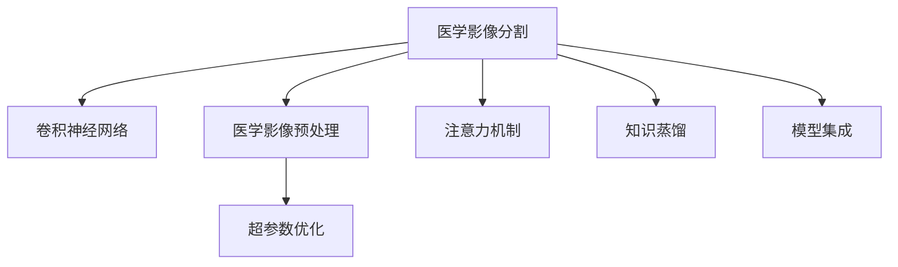

                 

# 深度学习在医学影像分割中的应用

> 关键词：医学影像,深度学习,卷积神经网络,分割算法,超参数优化,注意力机制,知识蒸馏,模型集成

## 1. 背景介绍

### 1.1 问题由来

随着医疗影像技术的不断进步，医学影像数据量和复杂性急剧增加。然而，传统的手工分割方法（如基于边界追踪、区域生长等）不仅耗时耗力，且受人为因素影响大，难以获得高度一致的分割结果。深度学习技术的崛起为医学影像分割提供了新的解决方案，使得医学影像分割的效率和精度得到了显著提升。

### 1.2 问题核心关键点

医学影像分割是深度学习在医疗影像分析中最具挑战性的应用之一，主要涉及以下几个核心关键点：

1. **数据量与质量**：医学影像数据往往数据量较小，且质量参差不齐。获取高质量的医学影像数据是分割任务的首要挑战。
2. **标注成本**：医学影像分割任务通常需要大量标注数据，标注成本高昂。如何降低标注成本，是提高模型性能的重要方向。
3. **模型复杂度**：医学影像分割涉及的解剖结构复杂，传统的卷积神经网络（CNN）模型难以全面捕捉这些细节，需要设计专门的架构。
4. **泛化能力**：医学影像中的解剖结构存在显著个体差异，模型的泛化能力对于保证在不同患者上的稳定性和准确性至关重要。
5. **解释性与可解释性**：医学影像分割的结果直接关系到临床决策，模型的解释性和可解释性对于医生理解和信任结果至关重要。

## 2. 核心概念与联系

### 2.1 核心概念概述

为更好地理解深度学习在医学影像分割中的应用，本节将介绍几个关键的概念：

- **医学影像分割**：从医学影像中提取出特定解剖结构的区域，是计算机辅助诊断的重要技术。常见应用包括肿瘤、器官、病变等分割。
- **卷积神经网络（CNN）**：一类专门设计用于处理图像数据的神经网络，通过卷积层、池化层等模块提取图像特征。
- **医学影像预处理**：包括影像增强、降噪、归一化等技术，提升影像的质量和可处理性。
- **超参数优化**：通过网格搜索、贝叶斯优化等方法，寻找最佳的模型参数组合，提升模型性能。
- **注意力机制**：一种特殊机制，允许模型在处理序列数据时，对不同位置赋予不同的权重，提高模型对关键特征的关注度。
- **知识蒸馏**：一种技术，通过从复杂模型（教师模型）中学习知识，指导简单模型（学生模型）的训练，提升模型性能。
- **模型集成**：将多个模型通过投票、加权平均等方式集成，提升模型的稳定性和鲁棒性。

这些概念之间的逻辑关系可以通过以下Mermaid流程图来展示：



这个流程图展示了医学影像分割任务的主要技术环节和核心概念之间的联系：

1. 医学影像分割任务的基础是卷积神经网络。
2. 在模型训练前，需要进行医学影像预处理，提升影像质量。
3. 通过超参数优化，寻找最佳的模型参数组合，提高模型性能。
4. 利用注意力机制和知识蒸馏技术，提升模型的复杂度和泛化能力。
5. 模型集成通过组合多个模型，提升整体性能和鲁棒性。

## 3. 核心算法原理 & 具体操作步骤
### 3.1 算法原理概述

深度学习在医学影像分割中的应用，主要基于卷积神经网络（CNN）。通过在医学影像数据上训练CNN模型，学习到解剖结构的特征表示，并在测试阶段对新的影像进行分割。

核心算法包括：
1. **全卷积网络（FCN）**：将传统的卷积神经网络进行全卷积化，输出与输入尺寸相同的分割结果。
2. **U-Net**：一种经典的编码-解码结构，能够捕捉图像的细节信息。
3. **FCN-Net**：结合全卷积网络和U-Net结构，进一步提升了分割精度。

### 3.2 算法步骤详解

基于深度学习的医学影像分割主要包括以下几个关键步骤：

**Step 1: 数据准备**

- **数据获取**：收集医学影像数据，如MRI、CT、PET等。这些数据通常包含患者的解剖结构信息，通过标注工具进行手动标注，得到训练集和测试集。
- **数据增强**：对医学影像进行归一化、增强、旋转、翻转等操作，扩充数据集，避免过拟合。

**Step 2: 模型选择**

- **网络结构**：选择全卷积网络、U-Net、FCN-Net等模型架构。
- **初始化权重**：使用预训练的权重或随机初始化。

**Step 3: 训练过程**

- **损失函数**：常用的损失函数包括交叉熵损失、 Dice 损失、Jaccard 损失等。
- **优化器**：常用的优化器包括Adam、SGD等。
- **学习率**：设置合适的学习率，避免模型在训练过程中震荡或过早收敛。

**Step 4: 超参数优化**

- **超参数**：包括学习率、批大小、卷积核大小等。
- **优化方法**：网格搜索、贝叶斯优化等方法，寻找最佳超参数组合。

**Step 5: 模型评估**

- **评估指标**：如Dice系数、Jaccard指数、精度-召回曲线等。
- **评估工具**：如DiceNet、JaccardNet等工具，方便评估模型性能。

**Step 6: 分割预测**

- **预测过程**：将测试集影像输入模型，得到分割结果。
- **后处理**：对预测结果进行后处理，如形态学操作、阈值化等，提升分割结果的质量。

### 3.3 算法优缺点

基于深度学习的医学影像分割方法具有以下优点：

1. **高效性**：相比于传统手工分割方法，深度学习分割方法可以显著提升分割速度，缩短临床等待时间。
2. **鲁棒性**：深度学习模型可以捕捉复杂的解剖结构，适应性强，对噪声和变形具有一定的鲁棒性。
3. **高精度**：深度学习模型能够处理大量医学影像数据，通过大量标注数据训练，可以取得较高的分割精度。

同时，该方法也存在一定的局限性：

1. **数据依赖**：深度学习模型需要大量高质量标注数据，获取标注数据成本较高。
2. **解释性不足**：深度学习模型通常被认为是"黑盒"模型，缺乏可解释性，难以被医生理解和信任。
3. **模型泛化能力**：深度学习模型对新数据泛化能力较差，需要在不同数据集上进行大量测试和调优。
4. **计算资源需求高**：深度学习模型参数量大，计算资源需求高，需要高性能计算设备支持。

## 4. 数学模型和公式 & 详细讲解  
### 4.1 数学模型构建

本节将使用数学语言对基于深度学习的医学影像分割过程进行更加严格的刻画。

记医学影像数据为 $I \in \mathbb{R}^{H \times W \times C}$，其中 $H$ 和 $W$ 为影像高度和宽度，$C$ 为通道数（通常为1）。分割目标为 $S \in \{0,1\}^{H \times W}$，其中 $0$ 表示背景，$1$ 表示分割对象。

定义医学影像分割模型的损失函数为 $L$，用于衡量模型预测结果 $S_{pred}$ 与真实标签 $S$ 之间的差异。常用的损失函数包括交叉熵损失、Dice 损失、Jaccard 损失等。以交叉熵损失为例：

$$
L = -\frac{1}{N}\sum_{i=1}^N \sum_{j=1}^N \left( S_{pred}^i[j] \log S^i[j] + (1 - S_{pred}^i[j]) \log (1 - S^i[j]) \right)
$$

其中 $N$ 为总像素数，$S_{pred}^i[j]$ 表示像素 $j$ 在影像 $i$ 的预测结果，$S^i[j]$ 表示像素 $j$ 的真实标签。

### 4.2 公式推导过程

以全卷积网络（FCN）为例，推导其前向传播过程。

设全卷积网络由若干卷积层、池化层、反卷积层等组成，记第 $k$ 层的输出为 $F_k$，输出通道数为 $C_k$，则前向传播过程可以表示为：

$$
F_0 = I
$$

$$
F_1 = \sigma (\mathcal{F}_k * F_0)
$$

$$
F_2 = \sigma (\mathcal{F}_k * F_1)
$$

...

$$
F_n = \sigma (\mathcal{F}_k * F_{n-1})
$$

其中 $\mathcal{F}_k$ 为第 $k$ 层的卷积核，$\sigma$ 为激活函数，$*$ 表示卷积操作。

最后，通过反卷积层输出 $S_{pred}$，与真实标签 $S$ 进行交叉熵损失计算。

### 4.3 案例分析与讲解

以U-Net模型为例，介绍其在医学影像分割中的应用。U-Net是一种编码器-解码器结构，由下至上和自下而上的卷积和反卷积层组成。

**编码器**：由若干卷积层和池化层组成，逐步降低特征图的尺寸，捕捉宏观特征。

**解码器**：由若干反卷积层和上采样层组成，逐步恢复特征图的尺寸，捕捉微观特征。

U-Net的编码器-解码器结构具有以下几个特点：

1. **对称结构**：编码器和解码器的结构对称，能够捕捉宏观和微观特征。
2. **多尺度特征**：通过多次下采样和上采样，捕捉不同尺度的特征，提升分割精度。
3. **跳跃连接**：通过跳跃连接（skip connection），将编码器中的特征信息传递到解码器，进一步提升分割结果的准确性。

## 5. 项目实践：代码实例和详细解释说明
### 5.1 开发环境搭建

在进行医学影像分割项目开发前，需要准备好开发环境。以下是使用Python进行TensorFlow开发的环境配置流程：

1. 安装Anaconda：从官网下载并安装Anaconda，用于创建独立的Python环境。

2. 创建并激活虚拟环境：
```bash
conda create -n tf-env python=3.8 
conda activate tf-env
```

3. 安装TensorFlow：根据CUDA版本，从官网获取对应的安装命令。例如：
```bash
conda install tensorflow-gpu==2.6 -c pytorch -c conda-forge
```

4. 安装各类工具包：
```bash
pip install numpy pandas scikit-learn matplotlib tqdm jupyter notebook ipython
```

完成上述步骤后，即可在`tf-env`环境中开始项目开发。

### 5.2 源代码详细实现

这里我们以U-Net模型为例，给出使用TensorFlow对医学影像进行分割的Python代码实现。

首先，定义U-Net模型的网络结构：

```python
import tensorflow as tf
from tensorflow.keras.layers import Conv2D, MaxPooling2D, UpSampling2D, concatenate

def unet_model(input_size=(256, 256, 1)):
    inputs = tf.keras.layers.Input(input_size)

    # 编码器
    conv1 = Conv2D(64, 3, activation='relu', padding='same')(inputs)
    conv1 = Conv2D(64, 3, activation='relu', padding='same')(conv1)
    pool1 = MaxPooling2D(pool_size=(2, 2))(conv1)

    conv2 = Conv2D(128, 3, activation='relu', padding='same')(pool1)
    conv2 = Conv2D(128, 3, activation='relu', padding='same')(conv2)
    pool2 = MaxPooling2D(pool_size=(2, 2))(conv2)

    conv3 = Conv2D(256, 3, activation='relu', padding='same')(pool2)
    conv3 = Conv2D(256, 3, activation='relu', padding='same')(conv3)
    pool3 = MaxPooling2D(pool_size=(2, 2))(conv3)

    conv4 = Conv2D(512, 3, activation='relu', padding='same')(pool3)
    conv4 = Conv2D(512, 3, activation='relu', padding='same')(conv4)
    pool4 = MaxPooling2D(pool_size=(2, 2))(conv4)

    conv5 = Conv2D(1024, 3, activation='relu', padding='same')(pool4)
    conv5 = Conv2D(1024, 3, activation='relu', padding='same')(conv5)

    # 解码器
    up6 = UpSampling2D(size=(2, 2))(conv5)
    up6 = concatenate([up6, conv4])
    conv6 = Conv2D(512, 3, activation='relu', padding='same')(up6)
    conv6 = Conv2D(512, 3, activation='relu', padding='same')(conv6)

    up7 = UpSampling2D(size=(2, 2))(conv6)
    up7 = concatenate([up7, conv3])
    conv7 = Conv2D(256, 3, activation='relu', padding='same')(up7)
    conv7 = Conv2D(256, 3, activation='relu', padding='same')(conv7)

    up8 = UpSampling2D(size=(2, 2))(conv7)
    up8 = concatenate([up8, conv2])
    conv8 = Conv2D(128, 3, activation='relu', padding='same')(up8)
    conv8 = Conv2D(128, 3, activation='relu', padding='same')(conv8)

    up9 = UpSampling2D(size=(2, 2))(conv8)
    up9 = concatenate([up9, conv1])
    conv9 = Conv2D(64, 3, activation='relu', padding='same')(up9)
    conv9 = Conv2D(64, 3, activation='relu', padding='same')(conv9)
    conv9 = Conv2D(1, 3, activation='sigmoid', padding='same')(conv9)

    model = tf.keras.Model(inputs=inputs, outputs=conv9)

    return model
```

然后，定义训练和评估函数：

```python
import tensorflow as tf
from tensorflow.keras.optimizers import Adam
from tensorflow.keras.metrics import Dice, Jaccard

@tf.function
def dice_loss(y_true, y_pred):
    intersection = tf.reduce_sum(y_true * y_pred)
    cardinality = tf.reduce_sum(y_true) + tf.reduce_sum(y_pred)
    dice_coeff = 2. * intersection / cardinality
    return 1 - dice_coeff

@tf.function
def jaccard_loss(y_true, y_pred):
    intersection = tf.reduce_sum(y_true * y_pred)
    cardinality = tf.reduce_sum(y_true) + tf.reduce_sum(y_pred) - intersection
    jaccard_coeff = intersection / cardinality
    return 1 - jaccard_coeff

def train_model(model, train_dataset, val_dataset, epochs, batch_size, learning_rate):
    model.compile(optimizer=Adam(lr=learning_rate), loss=dice_loss, metrics=[Dice(), Jaccard()])

    model.fit(train_dataset, epochs=epochs, batch_size=batch_size, validation_data=val_dataset)

    test_loss, dice, jaccard = model.evaluate(test_dataset, verbose=0)
    print(f'Test Dice: {dice:.4f}')
    print(f'Test Jaccard: {jaccard:.4f}')
```

最后，启动训练流程并在测试集上评估：

```python
model = unet_model()

# 准备数据集
train_dataset = ...
val_dataset = ...
test_dataset = ...

# 设置训练参数
epochs = 100
batch_size = 4
learning_rate = 0.001

# 训练模型
train_model(model, train_dataset, val_dataset, epochs, batch_size, learning_rate)

# 测试模型
test_dataset = ...
test_loss, dice, jaccard = model.evaluate(test_dataset, verbose=0)
print(f'Test Dice: {dice:.4f}')
print(f'Test Jaccard: {jaccard:.4f}')
```

以上就是使用TensorFlow对医学影像进行分割的完整代码实现。可以看到，借助TensorFlow的高级API，我们可以轻松构建U-Net模型，并通过自定义损失函数和评估指标，对模型进行训练和评估。

### 5.3 代码解读与分析

让我们再详细解读一下关键代码的实现细节：

**U-Net模型定义**：
- `conv1` 和 `conv2` 为编码器部分，通过卷积和池化操作逐步提取宏观特征。
- `up6` 和 `up7` 为解码器部分，通过反卷积和上采样操作逐步恢复特征图的尺寸。
- `conv9` 为输出层，使用 sigmoid 激活函数进行分割结果的生成。

**自定义损失函数**：
- `dice_loss` 函数计算 Dice 损失，用于衡量模型预测结果和真实标签之间的差异。
- `jaccard_loss` 函数计算 Jaccard 损失，也用于衡量模型预测结果和真实标签之间的差异。

**训练函数**：
- `train_model` 函数定义了模型的训练过程，包括编译模型、设置损失函数和评估指标、进行模型训练等。
- 使用 `tf.function` 装饰器，将自定义的损失函数和评估指标封装为 TensorFlow 图函数，提升计算效率。

**模型评估**：
- 在测试集上计算 Dice 系数和 Jaccard 系数，评估模型性能。
- 使用自定义的损失函数和评估指标，可以更灵活地评估模型的性能。

## 6. 实际应用场景
### 6.1 医学影像分割

医学影像分割在医疗影像分析中具有广泛的应用场景，如肿瘤、器官、病变等的分割。通过深度学习技术，可以对医学影像进行自动分割，减轻医生的工作负担，提升诊断效率。

在实践中，可以从公开的医学影像数据集（如医学影像分割数据集）中获取数据，进行标注和预处理，然后对预训练模型进行微调，得到适应特定医学影像分割任务的模型。微调后的模型可以对新的医学影像数据进行自动分割，辅助医生进行诊断和治疗。

### 6.2 影像辅助手术

医学影像分割技术可以应用于影像辅助手术，帮助外科医生准确定位和切除病灶。通过深度学习模型对医学影像进行分割，可以得到肿瘤、血管等关键结构的位置和范围，指导手术的进行。

在手术过程中，医生可以根据模型输出的分割结果，准确定位病灶，减少手术误差，提升手术成功率。影像辅助手术的深度学习技术，已经在临床上得到了广泛的应用和验证，为患者带来了显著的益处。

### 6.3 肿瘤分期与预后评估

肿瘤分期和预后评估是肿瘤治疗的重要环节，深度学习技术可以通过医学影像分割技术，对肿瘤进行全面评估，提供准确的分期信息。

在实践中，通过深度学习模型对肿瘤影像进行分割，可以得到肿瘤的位置、大小、形状等信息，辅助医生进行肿瘤分期和预后评估。深度学习技术在肿瘤分期和预后评估中的应用，已经在多项临床试验中得到验证，为肿瘤治疗提供了重要的参考依据。

### 6.4 未来应用展望

随着深度学习技术的不断发展，医学影像分割技术在未来将呈现以下几个发展趋势：

1. **多模态分割**：结合 MRI、CT、PET 等多模态医学影像数据，进行联合分割，提升分割精度和鲁棒性。
2. **自监督学习**：利用自监督学习技术，从无标注医学影像数据中学习解剖结构，减少标注数据需求，提升模型泛化能力。
3. **联邦学习**：通过联邦学习技术，在本地数据上进行模型训练，保护患者隐私，提升模型隐私性和鲁棒性。
4. **可解释性**：开发可解释性强的深度学习模型，提升医生对模型输出的理解和信任度。
5. **实时分割**：开发实时分割算法，支持动态实时分割，提升手术和诊断的效率和精度。

未来，随着深度学习技术的不断进步，医学影像分割技术将在医疗影像分析中发挥更加重要的作用，为临床决策提供更精准、可靠的支持。

## 7. 工具和资源推荐
### 7.1 学习资源推荐

为了帮助开发者系统掌握医学影像分割的理论基础和实践技巧，这里推荐一些优质的学习资源：

1. 《深度学习在医学影像中的应用》系列博文：由大模型技术专家撰写，深入浅出地介绍了深度学习在医学影像分析中的应用。
2. CS229《机器学习》课程：斯坦福大学开设的经典机器学习课程，涵盖深度学习、医疗影像等前沿话题，具有较高的理论深度。
3. 《深度学习与医疗影像分析》书籍：介绍深度学习在医疗影像分析中的应用，包含大量案例和实践经验。
4. HuggingFace官方文档：深度学习模型和工具的官方文档，提供详细的使用说明和样例代码。
5. DeepMind Health的医学影像分割资源：提供大量医学影像数据集和代码样例，方便开发者实践和调试。

通过对这些资源的学习实践，相信你一定能够快速掌握深度学习在医学影像分割中的精髓，并用于解决实际的医学影像分析问题。

### 7.2 开发工具推荐

高效的开发离不开优秀的工具支持。以下是几款用于医学影像分割开发的常用工具：

1. TensorFlow：基于Python的开源深度学习框架，支持高性能计算和分布式训练，适合大规模工程应用。
2. PyTorch：基于Python的开源深度学习框架，灵活性高，适合快速迭代研究。
3. Keras：高层次的深度学习API，方便快速构建和训练模型。
4. ITK-SNAP：医学影像分割的可视化工具，方便进行图像处理和分割。
5. 3D Slicer：医学影像分析的可视化工具，支持多种医学影像格式的读写。

合理利用这些工具，可以显著提升医学影像分割任务的开发效率，加快创新迭代的步伐。

### 7.3 相关论文推荐

深度学习在医学影像分割领域的研究已经积累了大量成果，以下是几篇奠基性的相关论文，推荐阅读：

1. Fully Convolutional Networks for Semantic Segmentation（FCN原论文）：提出全卷积网络，实现了图像像素级的语义分割。
2. U-Net: Convolutional Networks for Biomedical Image Segmentation：提出U-Net结构，提升了医学影像分割的精度。
3. Attention U-Net：结合注意力机制，进一步提升了U-Net模型的性能。
4. AdaNet：一种优化超参数的算法，用于提升深度学习模型的泛化能力。
5. Knowledge Distillation：一种知识传递技术，通过复杂模型指导简单模型训练，提升模型性能。

这些论文代表了大规模语言模型微调技术的发展脉络。通过学习这些前沿成果，可以帮助研究者把握学科前进方向，激发更多的创新灵感。

## 8. 总结：未来发展趋势与挑战
### 8.1 总结

本文对深度学习在医学影像分割中的应用进行了全面系统的介绍。首先阐述了医学影像分割任务的背景和意义，明确了深度学习在医学影像分析中的重要地位。其次，从原理到实践，详细讲解了深度学习在医学影像分割中的核心算法和操作步骤，给出了医学影像分割的完整代码实例。同时，本文还广泛探讨了深度学习在医学影像分割中的实际应用场景，展示了深度学习技术的强大潜力。此外，本文精选了深度学习在医学影像分割领域的学习资源、开发工具和相关论文，力求为读者提供全方位的技术指引。

通过本文的系统梳理，可以看到，深度学习在医学影像分割中的应用已经成为一种成熟的技术，为医学影像分析带来了新的突破。未来，随着深度学习技术的不断进步，医学影像分割技术将在医疗影像分析中发挥更加重要的作用，为临床决策提供更精准、可靠的支持。

### 8.2 未来发展趋势

展望未来，深度学习在医学影像分割领域将呈现以下几个发展趋势：

1. **多模态融合**：结合多种医学影像数据，提升分割精度和鲁棒性。
2. **自监督学习**：利用自监督学习技术，从无标注数据中学习解剖结构，减少标注数据需求。
3. **联邦学习**：通过联邦学习技术，在本地数据上进行模型训练，保护患者隐私。
4. **实时分割**：开发实时分割算法，支持动态实时分割，提升手术和诊断的效率。
5. **可解释性**：开发可解释性强的深度学习模型，提升医生对模型输出的理解和信任度。
6. **个性化**：结合患者个体特征，进行个性化分割，提升分割精度。

这些趋势凸显了深度学习在医学影像分割中的广阔前景。这些方向的探索发展，必将进一步提升医学影像分割技术的性能和应用范围，为医学影像分析带来新的突破。

### 8.3 面临的挑战

尽管深度学习在医学影像分割中已经取得了显著进展，但在迈向更加智能化、普适化应用的过程中，仍面临诸多挑战：

1. **数据稀缺**：医学影像数据获取难度大、成本高，如何获取大规模高质量医学影像数据是首要挑战。
2. **标注成本高**：医学影像分割任务需要大量标注数据，标注成本较高。
3. **模型泛化能力不足**：深度学习模型对新数据泛化能力较差，需要在不同数据集上进行大量测试和调优。
4. **可解释性不足**：深度学习模型通常被认为是"黑盒"模型，缺乏可解释性，难以被医生理解和信任。
5. **计算资源需求高**：深度学习模型参数量大，计算资源需求高，需要高性能计算设备支持。

这些挑战需要研究者不断进行技术创新和工程优化，才能进一步推动深度学习在医学影像分割中的应用。

### 8.4 研究展望

面对深度学习在医学影像分割领域所面临的诸多挑战，未来的研究需要在以下几个方面寻求新的突破：

1. **无监督和半监督学习**：摆脱对大规模标注数据的依赖，利用自监督学习、主动学习等无监督和半监督范式，最大限度利用非结构化数据，实现更加灵活高效的医学影像分割。
2. **知识蒸馏和模型集成**：通过知识蒸馏技术，从复杂模型中学习知识，指导简单模型训练，提升模型性能。通过模型集成技术，结合多个模型输出，提升模型的稳定性和鲁棒性。
3. **多模态融合与因果推理**：结合多种医学影像数据，进行联合分割，提升分割精度和鲁棒性。利用因果推理技术，提升模型的解释性和可理解性。
4. **联邦学习与隐私保护**：通过联邦学习技术，在本地数据上进行模型训练，保护患者隐私。
5. **可解释性与伦理道德**：开发可解释性强的深度学习模型，提升医生对模型输出的理解和信任度。结合伦理道德约束，确保医学影像分割技术的正确应用。

这些研究方向的探索，必将引领深度学习在医学影像分割技术迈向更高的台阶，为医学影像分析带来新的突破。面向未来，深度学习在医学影像分割领域还需要与其他人工智能技术进行更深入的融合，如知识表示、因果推理、强化学习等，多路径协同发力，共同推动医学影像分割技术的进步。

## 9. 附录：常见问题与解答

**Q1：深度学习在医学影像分割中是否适用于所有应用场景？**

A: 深度学习在医学影像分割中已广泛应用于肿瘤、器官、病变等的分割。但对于一些特定领域的分割任务，如皮肤病、眼科等，传统的手工分割方法可能更适用。因此，深度学习在医学影像分割中的应用需要根据具体任务进行选择。

**Q2：在医学影像分割中，如何选择和设计合适的深度学习模型？**

A: 选择合适的深度学习模型需要考虑以下几个方面：
1. **数据量与复杂度**：对于数据量较少、复杂度较低的数据集，可以使用简单的卷积神经网络（CNN）结构。对于数据量较大、复杂度较高的数据集，可以考虑使用U-Net、FCN-Net等复杂的结构。
2. **模型结构**：考虑结合注意力机制、编码器-解码器结构等先进技术，提升模型性能。
3. **模型泛化能力**：在训练过程中，利用数据增强、对抗训练等技术，提升模型的泛化能力。
4. **模型可解释性**：开发可解释性强的深度学习模型，提升医生对模型输出的理解和信任度。

**Q3：在医学影像分割中，如何避免过拟合？**

A: 避免过拟合的方法包括：
1. **数据增强**：对医学影像进行旋转、翻转、缩放等操作，扩充数据集。
2. **正则化**：使用L2正则化、Dropout等技术，避免过拟合。
3. **早停机制**：在验证集上评估模型性能，当性能不再提升时，停止训练。
4. **批归一化**：对输入数据进行归一化，提升模型的稳定性和泛化能力。

这些方法需要根据具体任务和数据特点进行灵活组合，才能有效避免过拟合。

**Q4：在医学影像分割中，如何提高模型泛化能力？**

A: 提高模型泛化能力的方法包括：
1. **多模态融合**：结合多种医学影像数据，提升模型的泛化能力。
2. **自监督学习**：利用自监督学习技术，从无标注数据中学习解剖结构，减少标注数据需求。
3. **联邦学习**：通过联邦学习技术，在本地数据上进行模型训练，保护患者隐私。
4. **迁移学习**：在预训练模型基础上进行微调，利用通用知识提升模型的泛化能力。

这些方法需要结合具体任务和数据特点进行优化，才能有效提升模型的泛化能力。

**Q5：在医学影像分割中，如何选择和设计合适的超参数？**

A: 选择合适的超参数需要考虑以下几个方面：
1. **学习率**：设置合适的学习率，避免模型在训练过程中震荡或过早收敛。
2. **批大小**：选择适当的批大小，避免内存溢出或过拟合。
3. **卷积核大小**：选择合适的卷积核大小，避免过拟合或欠拟合。
4. **优化器**：选择合适的优化器，如Adam、SGD等，提升模型训练速度和性能。

这些超参数需要根据具体任务和数据特点进行优化，可以通过网格搜索、贝叶斯优化等方法，寻找最佳的超参数组合。

---

作者：禅与计算机程序设计艺术 / Zen and the Art of Computer Programming

