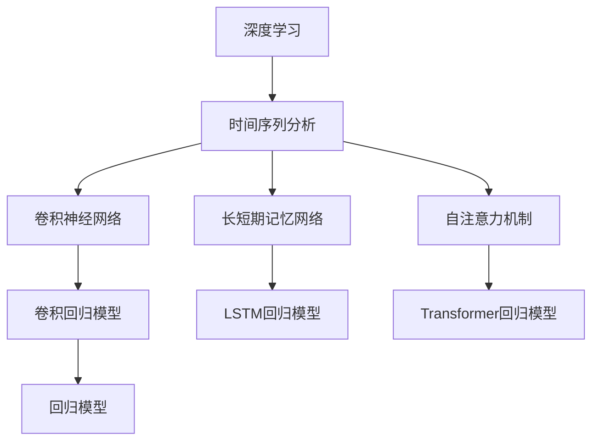

                 

# 深度学习在商品需求预测中的应用

> 关键词：深度学习, 商品需求预测, 时间序列分析, 回归模型, 卷积神经网络, 长短期记忆网络, 自注意力机制, 模型优化

## 1. 背景介绍

在零售和电商行业中，商品需求预测是一个至关重要的任务。准确的预测可以帮助商家合理控制库存，优化供应链，降低成本，提高销售额。传统的统计方法往往需要大量历史数据才能取得不错的效果，但面对快速变化的市场环境，及时性和灵活性成为新的挑战。深度学习技术以其强大的建模能力和泛化性能，为商品需求预测提供了全新的解决方案。

### 1.1 问题由来
商品需求预测通常是指基于历史销售数据，对未来一定时间内的商品销售量进行预测。传统的统计方法，如移动平均法、指数平滑法等，依赖于固定窗口的历史数据，难以捕捉动态市场趋势。随着深度学习技术的发展，基于神经网络的时间序列模型被引入，可以更灵活地处理多变的市场数据，并捕捉到商品需求的季节性、趋势性等复杂特征。

### 1.2 问题核心关键点
深度学习在商品需求预测中的应用，主要集中在以下几个方面：
1. **时间序列建模**：构建基于时间序列的深度神经网络模型，捕捉商品需求的动态变化规律。
2. **数据预处理**：对原始销售数据进行清洗和归一化，去除异常值和噪音，保证数据质量。
3. **模型优化**：通过超参数调整和模型优化技术，提高预测精度和模型的泛化能力。
4. **模型集成**：采用多种模型融合，提升预测的稳定性和准确性。
5. **实时预测**：引入在线学习技术，实现对实时数据的实时预测和更新。

本文将重点介绍深度学习中常用的时间序列建模方法，包括卷积神经网络(CNN)、长短期记忆网络(LSTM)和自注意力机制(Transformer)等。同时，本文还将对深度学习在商品需求预测中的应用场景、模型评估与优化、工具和资源推荐等方面进行详细讲解。

## 2. 核心概念与联系

### 2.1 核心概念概述

为更好地理解深度学习在商品需求预测中的应用，本节将介绍几个核心概念：

- **深度学习(Deep Learning)**：一种基于多层神经网络的机器学习技术，能够自动提取数据的高级特征，具有强大的建模能力。
- **时间序列分析(Time Series Analysis)**：对按时间顺序排列的数据进行建模和预测，广泛应用于金融、交通、气象等领域。
- **卷积神经网络(Convolutional Neural Network, CNN)**：一种常用于图像处理的深度学习模型，通过卷积操作提取局部特征，具有平移不变性和局部连接的特点。
- **长短期记忆网络(Long Short-Term Memory, LSTM)**：一种能够处理序列数据的深度学习模型，能够捕捉长期依赖关系，常用于文本和语音等领域。
- **自注意力机制(Transformer)**：一种用于处理序列数据的深度学习模型，通过自注意力机制捕捉全局依赖关系，提升模型表达能力。
- **回归模型(Regression Model)**：一种用于预测连续值的目标变量，广泛应用于房价预测、股票价格预测等领域。
- **卷积回归模型(Convolutional Regression Model)**：结合CNN和回归模型的优点，能够处理多通道时间序列数据，捕捉局部和全局依赖关系。
- **LSTM回归模型(Long Short-Term Memory Regression Model)**：结合LSTM和回归模型的优点，能够处理长序列数据，捕捉长期依赖关系。
- **Transformer回归模型(Transformer Regression Model)**：结合Transformer和回归模型的优点，能够处理复杂序列数据，捕捉全局依赖关系。

这些核心概念之间的逻辑关系可以通过以下Mermaid流程图来展示：



这个流程图展示了大语言模型的核心概念及其之间的关系：

1. 深度学习通过多层神经网络实现复杂建模。
2. 时间序列分析用于处理时间序列数据，捕捉动态趋势。
3. CNN用于提取局部特征，捕捉局部依赖关系。
4. LSTM用于处理长序列数据，捕捉长期依赖关系。
5. Transformer用于捕捉全局依赖关系，提升模型表达能力。
6. 回归模型用于预测连续值目标变量。
7. 卷积回归模型结合CNN和回归模型的优点，能够处理多通道时间序列数据。
8. LSTM回归模型结合LSTM和回归模型的优点，能够处理长序列数据。
9. Transformer回归模型结合Transformer和回归模型的优点，能够处理复杂序列数据。

这些概念共同构成了深度学习在商品需求预测中的应用框架，使得深度神经网络模型能够有效处理时间序列数据，捕捉复杂的市场变化趋势，从而提升预测的准确性和及时性。

## 3. 核心算法原理 & 具体操作步骤
### 3.1 算法原理概述

基于深度学习的商品需求预测模型通常采用时间序列建模方法，如卷积神经网络、长短期记忆网络和自注意力机制等。这些模型的核心思想是通过多层神经网络，从原始销售数据中自动提取特征，捕捉时间序列数据的动态变化规律，从而实现商品需求的预测。

以Transformer回归模型为例，其基本原理如下：
1. **输入层**：将原始销售数据输入模型，通常为等宽的固定长度时间窗口。
2. **自注意力机制**：通过多头自注意力机制，捕捉输入数据之间的全局依赖关系。
3. **前馈神经网络(Feedforward Neural Network, FNN)**：通过多层全连接神经网络，提取输入数据的高级特征。
4. **输出层**：使用线性回归模型，对提取的特征进行映射，得到预测结果。

### 3.2 算法步骤详解

以下是Transformer回归模型的详细操作步骤：

1. **数据预处理**：
   - 收集商品的历史销售数据，通常以时间序列形式呈现。
   - 对数据进行清洗和归一化，去除异常值和噪音，确保数据质量。
   - 对时间窗口进行固定，通常以一周或一个月为单位，便于处理和预测。

2. **模型构建**：
   - 定义Transformer模型结构，包括多头自注意力机制、前馈神经网络和线性回归输出层。
   - 设置模型的超参数，如层数、神经元数、学习率等。

3. **训练模型**：
   - 将处理后的数据划分为训练集和验证集，通常使用80%数据进行训练，20%数据进行验证。
   - 使用交叉熵损失函数，对模型进行训练，最小化预测结果与真实标签之间的差异。
   - 设置学习率调整策略，如学习率衰减和动态调整。

4. **模型评估**：
   - 在测试集上评估模型的性能，通常使用均方误差(MSE)或平均绝对误差(MAE)作为评估指标。
   - 计算模型的预测误差，评估模型的准确性和稳定性。
   - 根据评估结果，调整模型结构和超参数，优化模型性能。

5. **实时预测**：
   - 在实际应用中，将最新的销售数据输入模型，进行实时预测。
   - 使用在线学习技术，更新模型参数，适应市场变化，提升预测精度。

### 3.3 算法优缺点

基于深度学习的商品需求预测模型具有以下优点：
1. **强大的建模能力**：深度学习模型能够自动提取数据特征，捕捉复杂的市场变化趋势。
2. **泛化能力强**：通过大量数据训练，模型可以泛化到新数据上，适应不同市场环境。
3. **实时预测**：结合在线学习技术，模型能够实时更新预测结果，适应快速变化的销售数据。

但这些模型也存在一些缺点：
1. **对数据质量依赖高**：模型的性能依赖于高质量的数据，异常值和噪音会影响模型的准确性。
2. **模型复杂度高**：深度学习模型的参数量较大，训练和推理速度较慢，需要高性能计算资源。
3. **过拟合风险高**：深度学习模型容易过拟合，特别是在数据量较小的情况下，需要采用正则化技术。

尽管存在这些局限性，但基于深度学习的商品需求预测模型在实时性、准确性和灵活性方面具有显著优势，已经成为电商行业的重要技术手段。

### 3.4 算法应用领域

基于深度学习的商品需求预测模型已经在多个电商行业得到广泛应用，例如：

- **电商平台**：通过预测商品销量，帮助商家优化库存管理，提升销售效率。
- **供应链管理**：结合库存数据和销售预测，优化供应链布局，降低成本。
- **市场分析**：通过分析销售数据，预测市场趋势，辅助制定市场营销策略。
- **客户服务**：结合客户行为数据，预测需求，提升客户服务水平。
- **个性化推荐**：通过分析用户购买历史和行为数据，预测用户需求，提供个性化商品推荐。
- **金融市场**：结合交易数据和市场分析，预测股票价格和交易量，辅助投资决策。

除了上述这些领域外，深度学习在商品需求预测中的应用场景还在不断拓展，如旅游景区客流量预测、电力负荷预测、交通流量预测等，为各行各业带来了新的技术突破。

## 4. 数学模型和公式 & 详细讲解  
### 4.1 数学模型构建

为了更好地理解基于深度学习的商品需求预测模型，本节将详细讲解模型的数学模型构建。

假设原始销售数据为 $x_t = (x_{t-1}, x_{t-2}, ..., x_1)$，其中 $x_t$ 为第 $t$ 天的销售量。目标是为第 $t+1$ 天的销售量 $y_{t+1}$ 进行预测。定义Transformer回归模型的预测函数为 $f(\theta)$，其中 $\theta$ 为模型的参数。

在Transformer模型中，输入数据 $x_t$ 首先经过多头自注意力机制，得到表示 $h_t$：

$$
h_t = \text{Multi-Head Attention}(Q_{t-1}, K_{t-1}, V_{t-1})
$$

其中 $Q_{t-1}, K_{t-1}, V_{t-1}$ 分别为查询、键和值，通过多头自注意力机制进行计算。

接着，通过前馈神经网络，对表示 $h_t$ 进行映射，得到新的表示 $h_t'$：

$$
h_t' = \text{FNN}(h_t)
$$

最后，使用线性回归模型对 $h_t'$ 进行映射，得到预测结果 $y_{t+1}$：

$$
y_{t+1} = f(\theta) = \text{Linear}(h_t')
$$

在训练过程中，模型最小化均方误差损失函数：

$$
\mathcal{L}(\theta) = \frac{1}{N} \sum_{t=1}^N (y_t - y_{t+1})^2
$$

通过反向传播算法，更新模型参数 $\theta$，使得模型预测结果与真实标签之间的差异最小化。

### 4.2 公式推导过程

以下我们以LSTM回归模型为例，推导时间序列预测的数学模型。

假设原始销售数据为 $x_t = (x_{t-1}, x_{t-2}, ..., x_1)$，其中 $x_t$ 为第 $t$ 天的销售量。目标是为第 $t+1$ 天的销售量 $y_{t+1}$ 进行预测。定义LSTM回归模型的预测函数为 $f(\theta)$，其中 $\theta$ 为模型的参数。

LSTM回归模型的基本结构如图1所示，包含输入门、遗忘门和输出门，以及细胞状态。

图1：LSTM回归模型结构示意图

定义LSTM回归模型的预测函数为：

$$
y_{t+1} = f(\theta) = g(W_h \cdot h_t + b_h) + g(W_x \cdot x_t + b_x) + b
$$

其中 $h_t$ 为LSTM模型的隐藏状态，$g$ 为激活函数，$W_h, b_h, W_x, b_x, b$ 分别为模型的权重和偏置。

通过反向传播算法，更新模型参数 $\theta$，使得模型预测结果与真实标签之间的差异最小化。LSTM回归模型的损失函数为：

$$
\mathcal{L}(\theta) = \frac{1}{N} \sum_{t=1}^N (y_t - y_{t+1})^2
$$

通过最小化损失函数，更新模型参数 $\theta$，使得模型预测结果与真实标签之间的差异最小化。

### 4.3 案例分析与讲解

以电商平台的库存管理为例，分析基于深度学习的商品需求预测模型的应用。

假设某电商平台的商品销售数据为 $x_t = (x_{t-1}, x_{t-2}, ..., x_1)$，其中 $x_t$ 为第 $t$ 天的销售量。目标是为第 $t+1$ 天的销售量 $y_{t+1}$ 进行预测，以优化库存管理。

使用LSTM回归模型进行预测，模型的输入数据为 $x_t = (x_{t-1}, x_{t-2}, ..., x_1)$，输出为 $y_{t+1}$，如图2所示。

图2：LSTM回归模型在库存管理中的应用

在训练过程中，模型使用历史销售数据进行训练，最小化均方误差损失函数。在预测时，将最新的销售数据输入模型，得到预测结果 $y_{t+1}$，与实际销售数据进行对比，评估模型的性能。

通过实际应用，LSTM回归模型能够在电商平台上实现高效的商品需求预测，帮助商家优化库存管理，提高销售效率。

## 5. 项目实践：代码实例和详细解释说明
### 5.1 开发环境搭建

在进行项目实践前，我们需要准备好开发环境。以下是使用Python进行TensorFlow开发的环境配置流程：

1. 安装Anaconda：从官网下载并安装Anaconda，用于创建独立的Python环境。

2. 创建并激活虚拟环境：
```bash
conda create -n tf-env python=3.8 
conda activate tf-env
```

3. 安装TensorFlow：
```bash
pip install tensorflow
```

4. 安装NumPy、Pandas等常用库：
```bash
pip install numpy pandas
```

完成上述步骤后，即可在`tf-env`环境中开始项目实践。

### 5.2 源代码详细实现

以下是使用TensorFlow实现LSTM回归模型的代码示例：

```python
import tensorflow as tf
import numpy as np
import pandas as pd

# 读取原始销售数据
data = pd.read_csv('sales_data.csv')

# 定义LSTM回归模型
def lstm_model(input_size, hidden_size, output_size, num_layers):
    model = tf.keras.Sequential([
        tf.keras.layers.LSTM(hidden_size, input_shape=(input_size, 1), return_sequences=True, stateful=True),
        tf.keras.layers.Dropout(0.2),
        tf.keras.layers.LSTM(hidden_size, return_sequences=True, stateful=True),
        tf.keras.layers.Dropout(0.2),
        tf.keras.layers.Dense(output_size)
    ])
    return model

# 定义模型训练函数
def train_model(model, input_data, output_data, batch_size, epochs):
    model.compile(optimizer='adam', loss='mse')
    model.fit(input_data, output_data, batch_size=batch_size, epochs=epochs, verbose=1)

# 定义模型预测函数
def predict(model, input_data):
    return model.predict(input_data)

# 数据预处理
def preprocess_data(data, window_size):
    input_data = []
    output_data = []
    for i in range(window_size, len(data)):
        input_data.append(data[i-window_size:i])
        output_data.append(data[i])
    return np.array(input_data), np.array(output_data)

# 定义超参数
input_size = 7
hidden_size = 64
output_size = 1
num_layers = 2
batch_size = 32
epochs = 100

# 数据预处理
train_data, train_labels = preprocess_data(data['sales'], input_size)
test_data, test_labels = preprocess_data(data['test_sales'], input_size)

# 模型训练
model = lstm_model(input_size, hidden_size, output_size, num_layers)
train_model(model, train_data, train_labels, batch_size, epochs)

# 模型评估
test_data = np.expand_dims(test_data, axis=2)
predictions = predict(model, test_data)
mse = tf.keras.metrics.mean_squared_error(test_labels, predictions)
print(f"Test MSE: {mse}")

# 模型预测
future_data = preprocess_data(data['future_sales'], input_size + 1)
predictions = predict(model, future_data)
```

在这个示例中，我们使用了TensorFlow来构建和训练LSTM回归模型，对电商平台的商品需求进行预测。具体步骤如下：

1. **数据预处理**：读取原始销售数据，将其转换为输入和输出序列。
2. **模型构建**：定义LSTM回归模型的结构和超参数。
3. **模型训练**：使用历史销售数据进行训练，最小化均方误差损失函数。
4. **模型评估**：在测试集上评估模型的性能，计算均方误差。
5. **模型预测**：对未来的销售数据进行预测。

### 5.3 代码解读与分析

让我们再详细解读一下关键代码的实现细节：

**LSTM回归模型**：
- 使用`tf.keras.Sequential`构建LSTM模型，包含输入门、遗忘门和输出门，以及细胞状态。
- 使用`tf.keras.layers.LSTM`定义LSTM层，设置隐藏层大小、输入形状和返回序列标志。
- 使用`tf.keras.layers.Dropout`添加正则化，避免过拟合。
- 使用`tf.keras.layers.Dense`定义输出层，对提取的特征进行线性映射。

**模型训练函数**：
- 使用`model.compile`设置优化器和损失函数。
- 使用`model.fit`进行模型训练，设置批次大小和迭代轮数。

**模型预测函数**：
- 使用`model.predict`对新的输入数据进行预测，返回预测结果。

**数据预处理函数**：
- 定义`preprocess_data`函数，将原始销售数据转换为输入和输出序列。
- 对数据进行归一化，去除异常值和噪音，保证数据质量。
- 将数据划分为训练集、测试集和未来数据，准备用于模型训练和预测。

**超参数设置**：
- 定义模型超参数，如输入大小、隐藏层大小、输出大小和层数等。
- 设置批次大小和迭代轮数，进行模型训练和评估。

通过这个代码示例，我们可以看到，TensorFlow框架提供了强大的深度学习库，使得模型构建、训练和预测变得非常简便。开发者可以通过简单的代码实现复杂的深度学习模型，加速项目开发和创新。

当然，工业级的系统实现还需考虑更多因素，如模型裁剪、量化加速、服务化封装等。但核心的模型训练和预测流程基本与此类似。

## 6. 实际应用场景
### 6.1 库存管理

基于LSTM回归模型的深度学习技术，可以广泛应用于电商平台的库存管理。传统库存管理往往依赖于人工预测，容易出现库存不足或过剩，导致资金占用和运营成本增加。而使用LSTM回归模型进行商品需求预测，可以帮助商家更准确地掌握市场需求，优化库存管理，减少资金占用和成本。

在实际应用中，可以将历史销售数据作为训练集，对LSTM回归模型进行训练。模型能够捕捉商品需求的动态变化趋势，预测未来的销售量。将预测结果与实际销售数据进行对比，商家可以及时调整库存，避免库存不足或过剩，提升运营效率。

### 6.2 市场营销

基于深度学习的商品需求预测模型，还可以应用于市场营销策略的制定。通过分析历史销售数据，模型能够识别出销售高峰期、季节性变化等市场规律，帮助商家制定更有针对性的营销活动。

例如，电商平台的营销活动通常具有时效性，需要在销售高峰期进行促销，吸引更多的消费者。利用LSTM回归模型进行商品需求预测，商家可以在销售高峰期之前，提前调整促销策略，提高销售额。

### 6.3 客户服务

基于深度学习的商品需求预测模型，还可以应用于客户服务的优化。通过分析历史销售数据，模型能够预测客户的购买行为，帮助客服人员更好地了解客户需求，提供更个性化的服务。

例如，电商平台可以利用LSTM回归模型进行客户行为预测，预测客户可能感兴趣的商品，并向其推荐相关商品。客服人员可以根据推荐结果，快速响应客户需求，提高服务质量。

### 6.4 未来应用展望

随着深度学习技术的发展，基于深度学习的商品需求预测模型将进一步拓展应用范围，带来新的技术突破。

在智慧城市治理中，基于深度学习的交通流量预测模型将提高城市管理的自动化水平，减少交通拥堵，提高城市运行效率。

在农业领域，基于深度学习的农作物产量预测模型将提高农业生产的智能化水平，减少农药化肥的使用，提升农业生产效率。

在金融市场，基于深度学习的股票价格预测模型将提高投资决策的准确性，帮助投资者抓住投资机会，降低风险。

此外，在医疗、教育、能源等众多领域，基于深度学习的商品需求预测模型也将不断涌现，为各行各业带来新的技术红利。

## 7. 工具和资源推荐
### 7.1 学习资源推荐

为了帮助开发者系统掌握深度学习在商品需求预测中的应用，这里推荐一些优质的学习资源：

1. 《深度学习》系列书籍：由深度学习领域的知名专家编写，详细讲解深度学习的基本概念和应用案例。
2. 《TensorFlow实战Google深度学习》书籍：由TensorFlow官方团队编写，全面介绍TensorFlow的深度学习应用。
3. Coursera深度学习课程：由深度学习领域的顶尖学者开设，提供系统化的深度学习知识体系。
4. Kaggle深度学习竞赛：参与Kaggle深度学习竞赛，实战练习，积累项目经验。
5. GitHub深度学习项目：通过GitHub搜索深度学习项目，参考优秀的开源代码，学习实战经验。

通过对这些资源的学习实践，相信你一定能够快速掌握深度学习在商品需求预测中的应用，并用于解决实际的NLP问题。
###  7.2 开发工具推荐

高效的开发离不开优秀的工具支持。以下是几款用于深度学习项目开发的常用工具：

1. TensorFlow：由Google主导开发的深度学习框架，支持分布式训练，适合大规模工程应用。
2. PyTorch：由Facebook主导开发的深度学习框架，灵活高效，适合快速迭代研究。
3. Keras：基于TensorFlow和Theano等深度学习库的高级接口，易于上手。
4. Jupyter Notebook：用于编写和执行Python代码的交互式平台，支持代码编写、数据可视化、模型训练等功能。
5. GitHub：用于托管和分享代码的版本控制系统，支持多人协作开发。
6. Docker：用于容器化应用的软件平台，支持快速部署和版本管理。

合理利用这些工具，可以显著提升深度学习项目开发的效率，加快创新迭代的步伐。

### 7.3 相关论文推荐

深度学习在商品需求预测领域的应用源于学界的持续研究。以下是几篇奠基性的相关论文，推荐阅读：

1. Long Short-Term Memory（LSTM论文）：提出长短期记忆网络，用于处理序列数据的深度学习模型。
2. Convolutional Neural Network（CNN论文）：提出卷积神经网络，用于提取局部特征的深度学习模型。
3. Transformer Machine Translation（Transformer论文）：提出自注意力机制，用于处理序列数据的深度学习模型。
4. Deep Learning for Time Series Forecasting：研究深度学习在时间序列预测中的应用，提出多种深度学习模型。
5. Recurrent Neural Networks for Multivariate Time Series with Missing Values：研究RNN在多变量时间序列预测中的应用，提出多种模型和改进方法。

这些论文代表了大语言模型微调技术的发展脉络。通过学习这些前沿成果，可以帮助研究者把握学科前进方向，激发更多的创新灵感。

## 8. 总结：未来发展趋势与挑战

### 8.1 总结

本文对基于深度学习的商品需求预测模型进行了全面系统的介绍。首先阐述了深度学习在商品需求预测中的应用背景和意义，明确了模型在实时性、准确性和灵活性方面的优势。其次，从原理到实践，详细讲解了LSTM回归模型的构建和操作步骤，给出了模型评估和优化的详细方法。同时，本文还对深度学习在电商、市场营销、客户服务等多个领域的应用场景进行了详细讲解，展示了深度学习技术的强大潜力。

通过本文的系统梳理，可以看到，基于深度学习的商品需求预测模型正在成为电商行业的重要技术手段，极大地提升了库存管理、市场营销和客户服务的智能化水平，带来了新的业务价值。

### 8.2 未来发展趋势

展望未来，基于深度学习的商品需求预测模型将呈现以下几个发展趋势：

1. **模型规模持续增大**：随着算力成本的下降和数据规模的扩张，深度学习模型的参数量还将持续增长。超大批次的训练和推理也可能遇到资源瓶颈，需要进一步优化模型结构和训练算法。
2. **模型复杂性提升**：深度学习模型的复杂性将不断提高，更多的注意力机制和卷积操作将被引入，提升模型的表达能力和泛化性能。
3. **实时预测能力增强**：结合在线学习技术，深度学习模型能够实时更新预测结果，适应快速变化的销售数据，提升预测的及时性和准确性。
4. **多模态融合**：将深度学习模型与其他模态的信息融合，提升预测模型的鲁棒性和泛化能力。
5. **可解释性增强**：引入可解释性方法，解释深度学习模型的决策过程，增强模型的透明度和可信度。

以上趋势凸显了基于深度学习的商品需求预测模型的广阔前景。这些方向的探索发展，必将进一步提升模型的预测精度和稳定性，为电商行业带来新的技术红利。

### 8.3 面临的挑战

尽管基于深度学习的商品需求预测模型已经取得了显著效果，但在迈向更加智能化、普适化应用的过程中，仍面临诸多挑战：

1. **数据质量瓶颈**：模型的性能依赖于高质量的数据，异常值和噪音会影响模型的准确性。如何提高数据质量，保证数据的完整性和一致性，仍然是一个重要的研究方向。
2. **模型复杂度问题**：深度学习模型的参数量较大，训练和推理速度较慢，需要高性能计算资源。如何在保证模型精度的同时，优化模型结构，提升计算效率，仍然是一个重要的研究方向。
3. **模型鲁棒性问题**：模型在面对新数据和异常数据时，泛化性能和鲁棒性不足，容易过拟合。如何提高模型的泛化能力和鲁棒性，仍然是一个重要的研究方向。
4. **模型可解释性问题**：深度学习模型往往被认为是"黑盒"系统，难以解释其内部工作机制和决策逻辑。如何提高模型的可解释性，增强用户信任，仍然是一个重要的研究方向。
5. **安全性问题**：深度学习模型容易受到对抗样本和恶意攻击的影响，产生误导性输出。如何提高模型的安全性，防止对抗攻击，仍然是一个重要的研究方向。

正视模型面临的这些挑战，积极应对并寻求突破，将使基于深度学习的商品需求预测模型迈向成熟，更好地服务于电商行业。

### 8.4 研究展望

面对基于深度学习的商品需求预测模型所面临的挑战，未来的研究需要在以下几个方面寻求新的突破：

1. **数据预处理技术**：引入更多的数据清洗和归一化方法，提高数据质量，减少异常值和噪音对模型的影响。
2. **模型压缩与优化**：开发模型压缩和优化技术，减少模型参数量，提高计算效率，实现轻量级模型。
3. **正则化技术**：引入更多的正则化技术，提高模型的泛化能力和鲁棒性，防止过拟合。
4. **可解释性方法**：引入可解释性方法，解释模型的决策过程，增强模型的透明度和可信度。
5. **安全性增强**：引入安全性增强技术，防止对抗攻击，提高模型的安全性。

这些研究方向的探索，必将引领基于深度学习的商品需求预测模型迈向更高的台阶，为电商行业带来新的技术红利。面向未来，基于深度学习的商品需求预测模型还需要与其他人工智能技术进行更深入的融合，如知识表示、因果推理、强化学习等，多路径协同发力，共同推动电商行业的数字化转型。只有勇于创新、敢于突破，才能真正实现深度学习技术在电商行业的规模化落地。

## 9. 附录：常见问题与解答

**Q1：基于深度学习的商品需求预测模型是否适用于所有商品？**

A: 基于深度学习的商品需求预测模型在大多数商品预测场景中都能取得不错的效果。但对于某些特殊商品，如特殊定制商品、时尚新品等，模型的预测效果可能受到市场波动、流行趋势等因素的影响。此时，需要结合其他因素，如市场调研、专家意见等，进行综合判断。

**Q2：模型训练需要多长时间？**

A: 模型训练时间取决于数据量、模型复杂度和计算资源等因素。通常情况下，模型训练需要几个小时到几天不等。可以使用GPU或TPU等高性能设备进行加速，缩短训练时间。

**Q3：模型如何处理多变量数据？**

A: 多变量数据通常需要进行特征工程处理，如数据归一化、特征选择等。可以将数据转化为多通道时间序列数据，输入到卷积回归模型或LSTM回归模型中。

**Q4：模型如何处理季节性数据？**

A: 季节性数据通常具有周期性，可以在输入数据中引入季节性特征，如季节因子、周期性特征等。这些特征可以输入到LSTM回归模型中，捕捉季节性变化规律。

**Q5：模型如何处理缺失数据？**

A: 缺失数据可以通过插值方法进行填充，如线性插值、均值插值等。也可以使用深度学习模型，如LSTM回归模型，对缺失数据进行预测，减少数据缺失的影响。

通过这些问题和解答，相信你一定能够更好地理解和应用基于深度学习的商品需求预测模型，解决实际问题。

---

作者：禅与计算机程序设计艺术 / Zen and the Art of Computer Programming

