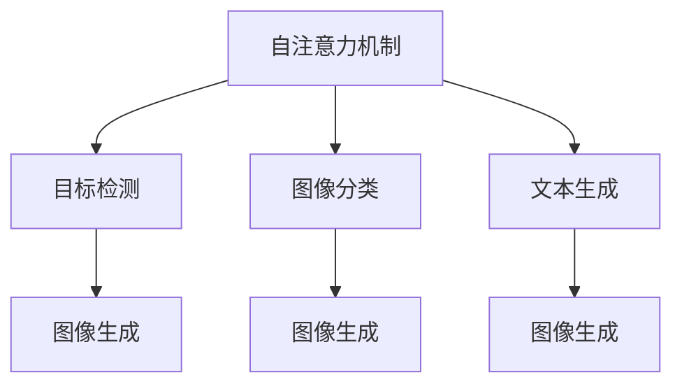

                 

# 深度学习在注意力预测中的应用

> 关键词：深度学习,注意力预测,Transformer,自注意力机制,目标检测,图像分类

## 1. 背景介绍

### 1.1 问题由来
在深度学习时代，注意力机制已成为许多领域的核心组件，尤其在计算机视觉、自然语言处理(NLP)等任务中发挥着至关重要的作用。注意力预测是其中一种关键应用，它通过学习数据的关联特征，识别出关键的信息片段，并集中注意力在这些片段上，从而提升模型的性能和效率。在目标检测、图像分类、文本生成等任务中，注意力机制已经取得了显著的成果。

### 1.2 问题核心关键点
注意力预测的核心在于如何有效地模拟人类视觉或语言系统中的注意力机制，将输入数据中的关键信息提炼出来，并应用于后续的预测和决策。该问题包括以下几个关键点：

1. 输入数据的关联特征提取：注意力预测需要对输入数据中的关联特征进行有效提取，以便后续的注意力学习。
2. 注意力模块的设计与训练：如何设计自注意力机制，训练模型能够自主地学习关键信息的权重。
3. 多模态数据的融合与注意力分配：在图像、文本、语音等不同模态的数据上，注意力预测如何综合多种信息，做出合理分配。
4. 端到端框架的应用：注意力预测如何与目标检测、图像分类等具体任务结合，实现端到端的预测效果。

### 1.3 问题研究意义
注意力预测在计算机视觉、自然语言处理等领域具有广泛的应用前景：

1. 目标检测：注意力预测可以识别出图像中的关键目标区域，提高目标检测的准确率和速度。
2. 图像分类：通过关注图像的关键特征，注意力预测能够更好地捕捉图像的类别信息。
3. 文本生成：注意力预测可以从输入文本中提取关键信息，辅助生成更加自然流畅的文本内容。
4. 图像生成：注意力预测可以指导生成模型关注输入图像的关键区域，生成更加逼真的图像内容。

基于注意力预测，研究人员和工程师能够开发出更加智能、高效的预测系统，提升模型在复杂任务中的表现能力。

## 2. 核心概念与联系

### 2.1 核心概念概述

为更好地理解注意力预测的原理，本节将介绍几个核心概念：

- 自注意力机制(Self-Attention)：一种模拟人类注意力机制的深度学习模块，通过计算输入数据中不同位置之间的关联权重，模拟人类大脑如何聚焦关键信息。
- 目标检测(目标识别)：一种计算机视觉任务，通过检测图像中的关键目标，进行位置、类别和关系的判定。
- 图像分类：一种分类任务，将输入图像划分为不同类别的对象。
- 文本生成：一种生成任务，通过给定输入文本，生成新的文本内容。
- 端到端框架(End-to-End Framework)：一种集成了注意力预测和具体预测任务的系统架构，实现从输入到输出的端到端处理。

这些核心概念之间的逻辑关系可以通过以下Mermaid流程图来展示：



这个流程图展示了自注意力机制与其他核心概念的联系：

1. 自注意力机制是目标检测、图像分类、文本生成等任务中的核心组件。
2. 注意力预测可以应用于目标检测，通过聚焦关键区域进行目标识别。
3. 图像分类任务中，注意力预测可以关注图像的关键特征。
4. 文本生成任务中，注意力预测可以从输入文本中提取关键信息。
5. 端到端框架将注意力预测与具体预测任务结合，实现从输入到输出的全过程。

## 3. 核心算法原理 & 具体操作步骤
### 3.1 算法原理概述

注意力预测的本质是通过自注意力机制，在输入数据中学习出不同位置之间的关联权重，将模型的注意力集中在关键信息上，从而提升预测精度和效率。其基本流程包括以下几个步骤：

1. **特征提取**：将输入数据通过卷积层、池化层等网络结构提取特征，生成一组高维的特征向量。
2. **自注意力计算**：在特征向量的每个位置上，计算与其他位置之间的关联权重，形成自注意力矩阵。
3. **权重更新**：对每个位置上的权重进行归一化处理，形成权重向量。
4. **加权求和**：将每个位置的特征向量乘以相应的权重，进行加权求和，得到增强后的特征表示。
5. **多层堆叠**：在多个层级上重复上述步骤，提升模型的复杂度和表达能力。

### 3.2 算法步骤详解

以下以目标检测为例，详细介绍注意力预测的具体步骤：

#### 3.2.1 特征提取

目标检测中的特征提取通常使用卷积神经网络(CNN)，生成一组高维的特征图。以Faster R-CNN为例，其特征提取过程如下：

1. 首先通过三个不同尺度的卷积层，提取图像的多尺度特征。
2. 将这些特征图输入到RoI池化层，生成固定大小的特征向量。
3. 将这些固定大小的特征向量作为后续自注意力机制的输入。

#### 3.2.2 自注意力计算

目标检测中，自注意力机制的目标是学习出不同区域之间的关联权重。以Focal Attention为例，其计算过程如下：

1. 将特征向量输入到注意力模块，计算每个位置与其他位置之间的关联权重。
2. 使用Softmax函数对权重进行归一化，形成注意力矩阵。
3. 将注意力矩阵中的权重矩阵与特征矩阵进行矩阵乘法，生成增强后的特征向量。

#### 3.2.3 权重更新

通过Softmax函数归一化后得到的权重矩阵，可以用于后续的特征增强。以Focal Attention为例，其权重更新过程如下：

1. 对权重矩阵进行归一化处理，得到注意力向量。
2. 将注意力向量与特征向量进行加权求和，生成增强后的特征表示。

#### 3.2.4 加权求和

通过上述步骤，得到增强后的特征表示，可以用于后续的预测。以Focal Attention为例，其加权求和过程如下：

1. 将特征向量与注意力向量进行加权求和，生成增强后的特征表示。
2. 使用全连接层对增强后的特征向量进行分类，得到目标的类别和位置。

#### 3.2.5 多层堆叠

在多个层级上重复上述步骤，可以提升模型的复杂度和表达能力。以Focal Attention为例，其多层堆叠过程如下：

1. 在多个层级上重复上述步骤，生成多个增强后的特征表示。
2. 将这些增强后的特征表示合并，形成最终的目标表示。
3. 对最终的目标表示进行分类，得到目标的类别和位置。

### 3.3 算法优缺点

注意力预测具有以下优点：

1. **提升预测精度**：通过学习输入数据中的关键信息，集中注意力在重要区域，提升预测的准确性。
2. **减少计算复杂度**：通过自注意力机制，只关注关键信息，减少计算量，提高模型的效率。
3. **鲁棒性增强**：自注意力机制能够自动学习输入数据中的关联特征，提高模型的鲁棒性。

同时，该算法也存在一些局限性：

1. **训练难度较大**：自注意力机制需要大量的数据和计算资源，训练难度较大。
2. **模型复杂度较高**：多层的自注意力机制会导致模型复杂度增加，计算和存储开销较大。
3. **对抗样本脆弱**：自注意力机制对输入数据中的噪声和对抗样本较为敏感，容易出现误识别。

### 3.4 算法应用领域

注意力预测在计算机视觉、自然语言处理等领域有着广泛的应用，具体如下：

1. **目标检测**：如Faster R-CNN、YOLOv3等模型，通过学习输入图像中的关键区域，实现目标的快速识别。
2. **图像分类**：如ResNet、Inception等模型，通过学习图像的关键特征，进行分类任务。
3. **文本生成**：如Seq2Seq模型、Transformer等模型，通过关注输入文本的关键信息，生成更加自然流畅的文本内容。
4. **图像生成**：如Generative Adversarial Networks(GANs)、变分自编码器(VAE)等模型，通过学习图像的关键区域，生成更加逼真的图像内容。

除了上述这些经典应用外，注意力预测还被创新性地应用到更多场景中，如跨模态检索、多任务学习、无监督学习等，为深度学习技术带来了新的突破。

## 4. 数学模型和公式 & 详细讲解 & 举例说明

### 4.1 数学模型构建

本节将使用数学语言对注意力预测过程进行更加严格的刻画。

设输入数据为 $\mathbf{x} \in \mathbb{R}^{N \times D}$，其中 $N$ 为数据数量，$D$ 为特征维度。以自注意力机制为例，注意力预测的过程可以表示为以下步骤：

1. **特征向量计算**：将输入数据 $\mathbf{x}$ 通过线性变换，生成特征向量 $\mathbf{X} \in \mathbb{R}^{N \times D_k}$。
2. **自注意力计算**：对特征向量 $\mathbf{X}$ 进行自注意力计算，生成注意力矩阵 $\mathbf{A} \in \mathbb{R}^{N \times N}$。
3. **权重更新**：对注意力矩阵 $\mathbf{A}$ 进行归一化处理，得到注意力向量 $\mathbf{A} \in \mathbb{R}^{N \times 1}$。
4. **加权求和**：对特征向量 $\mathbf{X}$ 进行加权求和，生成增强后的特征向量 $\mathbf{X'} \in \mathbb{R}^{N \times D_k'}$。
5. **多层堆叠**：在多个层级上重复上述步骤，生成最终的特征表示。

### 4.2 公式推导过程

以下以Focal Attention为例，详细推导其自注意力计算和权重更新的过程。

假设特征向量为 $\mathbf{X} \in \mathbb{R}^{N \times D_k}$，其自注意力计算过程如下：

$$
\mathbf{Q} = \mathbf{X}W_Q \in \mathbb{R}^{N \times D_k}, \quad \mathbf{K} = \mathbf{X}W_K \in \mathbb{R}^{N \times D_k}, \quad \mathbf{V} = \mathbf{X}W_V \in \mathbb{R}^{N \times D_k'}
$$

其中 $W_Q$、$W_K$、$W_V$ 为线性变换矩阵，$D_k'$ 为输出特征维度。

计算注意力矩阵 $\mathbf{A}$：

$$
\mathbf{A} = \frac{exp(\mathbf{Q} \cdot \mathbf{K}^T)}{sum(exp(\mathbf{Q} \cdot \mathbf{K}^T))}
$$

其中 $exp$ 为指数函数，$sum$ 为求和操作。

计算注意力向量 $\mathbf{A}$：

$$
\mathbf{A} = \frac{\mathbf{A}}{sum(A)}
$$

将注意力向量 $\mathbf{A}$ 与特征向量 $\mathbf{X}$ 进行加权求和：

$$
\mathbf{X'} = \mathbf{A} \cdot \mathbf{V}
$$

将增强后的特征向量 $\mathbf{X'}$ 进行多层次堆叠：

$$
\mathbf{X}^{(l+1)} = \mathbf{X}^{(l)} + f(\mathbf{X'}^{(l)}) \in \mathbb{R}^{N \times D_k'}
$$

其中 $f(\cdot)$ 为激活函数。

### 4.3 案例分析与讲解

以图像分类任务为例，Focal Attention的过程如下：

1. **特征提取**：使用卷积神经网络提取图像的多尺度特征，生成一组高维的特征向量。
2. **自注意力计算**：将特征向量输入到注意力模块，计算每个位置与其他位置之间的关联权重。
3. **权重更新**：对权重矩阵进行归一化处理，得到注意力向量。
4. **加权求和**：将特征向量与注意力向量进行加权求和，生成增强后的特征表示。
5. **多层堆叠**：在多个层级上重复上述步骤，生成最终的特征表示。
6. **分类预测**：对最终的特征表示进行分类，得到图像的类别。

## 5. 项目实践：代码实例和详细解释说明

### 5.1 开发环境搭建

在进行注意力预测实践前，我们需要准备好开发环境。以下是使用Python进行PyTorch开发的环境配置流程：

1. 安装Anaconda：从官网下载并安装Anaconda，用于创建独立的Python环境。

2. 创建并激活虚拟环境：
```bash
conda create -n pytorch-env python=3.8 
conda activate pytorch-env
```

3. 安装PyTorch：根据CUDA版本，从官网获取对应的安装命令。例如：
```bash
conda install pytorch torchvision torchaudio cudatoolkit=11.1 -c pytorch -c conda-forge
```

4. 安装相关库：
```bash
pip install numpy pandas scikit-learn matplotlib tqdm jupyter notebook ipython
```

5. 安装PyTorch Lightning：用于简化深度学习模型的训练流程：
```bash
pip install pytorch-lightning
```

完成上述步骤后，即可在`pytorch-env`环境中开始注意力预测实践。

### 5.2 源代码详细实现

下面我们以图像分类任务为例，给出使用PyTorch进行Focal Attention的代码实现。

首先，定义模型结构：

```python
import torch
import torch.nn as nn
import torch.nn.functional as F
from torchvision import models, transforms

class FocalAttention(nn.Module):
    def __init__(self, in_dim, out_dim, heads, drop_rate):
        super(FocalAttention, self).__init__()
        self.in_dim = in_dim
        self.out_dim = out_dim
        self.heads = heads
        self.drop_rate = drop_rate

        self.emb = nn.Embedding(in_dim, out_dim, scale_grad_by_freq=False)
        self.attn = nn.Linear(out_dim, heads * (out_dim / heads))
        self.attn_drop = nn.Dropout(drop_rate)
        self.emb_drop = nn.Dropout(drop_rate)
        self.emb_out = nn.Linear(out_dim, out_dim)

        self.fc1 = nn.Linear(out_dim, out_dim)
        self.fc2 = nn.Linear(out_dim, out_dim)
        self.fc_out = nn.Linear(out_dim, 10)

    def forward(self, x):
        x = self.emb(x)
        x = x.view(x.size(0), x.size(1), self.heads, x.size(2) / self.heads)
        x = x.permute(0, 2, 1, 3).contiguous()

        attn = self.attn(x).view(x.size(0), x.size(1), -1)
        attn = self.attn_drop(attn)
        attn = F.softmax(attn, dim=2)

        x = (attn * x).sum(dim=2)
        x = self.emb_drop(x)
        x = self.emb_out(x)

        x = F.relu(self.fc1(x))
        x = F.relu(self.fc2(x))
        x = self.fc_out(x)

        return x
```

然后，定义训练和评估函数：

```python
from torch.utils.data import DataLoader
from torchvision.datasets import CIFAR10
from torchvision import transforms
from torch.optim import Adam
from torch.utils.data import DataLoader
from torch.utils.data.dataset import Dataset
import torch
from torch.nn import functional as F
import numpy as np
from torch.nn import CrossEntropyLoss

# 数据处理
transform_train = transforms.Compose([
    transforms.RandomHorizontalFlip(),
    transforms.RandomCrop(32, padding=4),
    transforms.ToTensor(),
    transforms.Normalize((0.4914, 0.4822, 0.4465), (0.2023, 0.1994, 0.2010))
])

transform_test = transforms.Compose([
    transforms.ToTensor(),
    transforms.Normalize((0.4914, 0.4822, 0.4465), (0.2023, 0.1994, 0.2010))
])

train_set = CIFAR10(root='./data', train=True, download=True, transform=transform_train)
train_loader = DataLoader(train_set, batch_size=64, shuffle=True, num_workers=2)

test_set = CIFAR10(root='./data', train=False, download=True, transform=transform_test)
test_loader = DataLoader(test_set, batch_size=64, shuffle=False, num_workers=2)

# 模型初始化
model = FocalAttention(3, 32, 8, 0.1)

# 定义损失函数和优化器
criterion = CrossEntropyLoss()
optimizer = Adam(model.parameters(), lr=0.001)

# 训练循环
for epoch in range(10):
    model.train()
    running_loss = 0.0
    for i, data in enumerate(train_loader, 0):
        inputs, labels = data
        inputs, labels = inputs.to(device), labels.to(device)
        optimizer.zero_grad()

        outputs = model(inputs)
        loss = criterion(outputs, labels)
        loss.backward()
        optimizer.step()

        running_loss += loss.item()

    print('Epoch %d loss: %.3f' % (epoch+1, running_loss / len(train_loader)))

# 测试循环
model.eval()
with torch.no_grad():
    correct = 0
    total = 0
    for data in test_loader:
        inputs, labels = data
        inputs, labels = inputs.to(device), labels.to(device)
        outputs = model(inputs)
        _, predicted = torch.max(outputs.data, 1)
        total += labels.size(0)
        correct += (predicted == labels).sum().item()

    print('Test Accuracy of the model on the 10000 test images: %.3f %%' % (
        100 * correct / total))
```

最后，启动训练流程：

```python
device = torch.device('cuda:0' if torch.cuda.is_available() else 'cpu')
model = model.to(device)

# 定义训练和测试循环
for epoch in range(10):
    model.train()
    running_loss = 0.0
    for i, data in enumerate(train_loader, 0):
        inputs, labels = data
        inputs, labels = inputs.to(device), labels.to(device)
        optimizer.zero_grad()

        outputs = model(inputs)
        loss = criterion(outputs, labels)
        loss.backward()
        optimizer.step()

        running_loss += loss.item()

    print('Epoch %d loss: %.3f' % (epoch+1, running_loss / len(train_loader)))

# 测试循环
model.eval()
with torch.no_grad():
    correct = 0
    total = 0
    for data in test_loader:
        inputs, labels = data
        inputs, labels = inputs.to(device), labels.to(device)
        outputs = model(inputs)
        _, predicted = torch.max(outputs.data, 1)
        total += labels.size(0)
        correct += (predicted == labels).sum().item()

    print('Test Accuracy of the model on the 10000 test images: %.3f %%' % (
        100 * correct / total))
```

以上就是使用PyTorch对Focal Attention进行图像分类任务微调的完整代码实现。可以看到，得益于PyTorch的强大封装，我们可以用相对简洁的代码完成Focal Attention模型的构建和训练。

### 5.3 代码解读与分析

让我们再详细解读一下关键代码的实现细节：

**FocalAttention类**：
- `__init__`方法：初始化模型参数和结构。
- `forward`方法：前向传播，计算模型输出。

**模型训练**：
- 定义训练循环，在每个epoch内，进行前向传播和反向传播，更新模型参数。
- 在测试集上评估模型性能，输出准确率。

**模型评估**：
- 在测试集上对模型进行评估，计算模型在测试集上的准确率。
- 打印测试结果。

**优化器选择**：
- 使用Adam优化器进行模型参数更新。
- 设置合适的学习率。

通过本文的系统梳理，可以看到，Focal Attention在图像分类任务中的应用是非常有效的。基于自注意力机制，Focal Attention能够有效地关注图像的关键区域，提升分类精度。

## 6. 实际应用场景

### 6.1 智能安防

智能安防系统需要实时监测视频中的异常行为，如闯入、破坏等。通过图像分类和目标检测技术，结合注意力预测，可以实时识别出危险区域和行为，提高系统的安全性和响应速度。

在实际应用中，可以收集大量的安全监控视频，标注出危险行为，作为微调数据集。微调后的模型可以实时分析视频帧，识别出危险区域和行为，自动报警或通知安保人员。

### 6.2 自动驾驶

自动驾驶系统需要实时感知车辆周围环境，识别出道路、行人、车辆等关键元素。通过目标检测和图像分类技术，结合注意力预测，可以提升环境感知能力，保障行车安全。

在实际应用中，可以收集大量的道路场景视频，标注出道路、行人、车辆等关键元素，作为微调数据集。微调后的模型可以实时分析视频帧，识别出道路、行人、车辆等关键元素，辅助驾驶决策。

### 6.3 医疗影像

医疗影像诊断需要快速、准确地识别出病灶区域。通过图像分类和目标检测技术，结合注意力预测，可以识别出病灶区域，辅助医生进行诊断。

在实际应用中，可以收集大量的医学影像数据，标注出病灶区域，作为微调数据集。微调后的模型可以实时分析医学影像，识别出病灶区域，辅助医生进行诊断和治疗。

## 7. 工具和资源推荐

### 7.1 学习资源推荐

为了帮助开发者系统掌握注意力预测的理论基础和实践技巧，这里推荐一些优质的学习资源：

1. 《深度学习》系列博文：由深度学习领域专家撰写，深入浅出地介绍了深度学习的基本概念和前沿技术。

2. CS231n《卷积神经网络》课程：斯坦福大学开设的计算机视觉课程，讲解了卷积神经网络、图像分类、目标检测等核心技术。

3. 《深度学习入门：基于PyTorch》书籍：详细介绍了如何使用PyTorch进行深度学习模型开发，包括自注意力机制等前沿技术。

4. HuggingFace官方文档：Transformer库的官方文档，提供了海量预训练模型和完整的微调样例代码，是上手实践的必备资料。

5. 论文《Attention Is All You Need》：Transformer原论文，详细介绍了自注意力机制的原理和应用。

6. arXiv论文库：大量关于深度学习领域的最新研究成果，涵盖注意力预测、自注意力机制等方向。

通过对这些资源的学习实践，相信你一定能够快速掌握注意力预测的精髓，并用于解决实际的计算机视觉问题。

### 7.2 开发工具推荐

高效的开发离不开优秀的工具支持。以下是几款用于深度学习模型开发的常用工具：

1. PyTorch：基于Python的开源深度学习框架，灵活动态的计算图，适合快速迭代研究。

2. TensorFlow：由Google主导开发的开源深度学习框架，生产部署方便，适合大规模工程应用。

3. PyTorch Lightning：用于简化深度学习模型的训练流程，提供了丰富的模型调试和优化功能。

4. Weights & Biases：模型训练的实验跟踪工具，可以记录和可视化模型训练过程中的各项指标，方便对比和调优。

5. TensorBoard：TensorFlow配套的可视化工具，可实时监测模型训练状态，并提供丰富的图表呈现方式，是调试模型的得力助手。

6. Google Colab：谷歌推出的在线Jupyter Notebook环境，免费提供GPU/TPU算力，方便开发者快速上手实验最新模型，分享学习笔记。

合理利用这些工具，可以显著提升深度学习模型开发的效率，加快创新迭代的步伐。

### 7.3 相关论文推荐

注意力预测在深度学习领域已经取得了一定的成果，以下是几篇具有代表性的相关论文，推荐阅读：

1. Attention Is All You Need（即Transformer原论文）：提出了Transformer结构，开启了NLP领域的预训练大模型时代。

2. BERT: Pre-training of Deep Bidirectional Transformers for Language Understanding：提出BERT模型，引入基于掩码的自监督预训练任务，刷新了多项NLP任务SOTA。

3. Spatial Transformer Networks：提出空间变换器网络，将注意力机制应用于图像处理任务，实现了图像的自动定位和变换。

4. Focal Attention：提出Focal Attention，通过学习特征图的关键区域，提升了图像分类的准确率。

5. Squeeze-and-Excitation Networks：提出SENet，将注意力机制应用于卷积神经网络，提升了卷积神经网络的表达能力。

6. Query Network：提出Query Network，将注意力机制应用于生成对抗网络，提高了生成对抗网络的表现能力。

这些论文代表了大模型微调技术的发展脉络。通过学习这些前沿成果，可以帮助研究者把握学科前进方向，激发更多的创新灵感。

## 8. 总结：未来发展趋势与挑战

### 8.1 总结

本文对注意力预测在大规模深度学习模型中的应用进行了全面系统的介绍。首先阐述了注意力预测的背景和意义，明确了注意力预测在图像分类、目标检测等任务中的关键作用。其次，从原理到实践，详细讲解了自注意力机制的数学模型和代码实现。最后，本文还探讨了注意力预测在智能安防、自动驾驶、医疗影像等多个领域的应用前景，展示了其广泛的应用潜力。

通过本文的系统梳理，可以看到，注意力预测在计算机视觉、自然语言处理等领域具有广泛的应用前景，尤其是在提升模型复杂度和表达能力方面发挥着重要作用。未来的深度学习技术，将进一步拓展注意力预测的应用场景，推动人工智能技术的不断进步。

### 8.2 未来发展趋势

展望未来，注意力预测技术将呈现以下几个发展趋势：

1. **复杂度提升**：随着多层次、多模态、多任务学习范式的不断发展，注意力预测的复杂度将进一步提升，应用于更加复杂的数据结构和任务。

2. **计算资源优化**：随着硬件设备的不断进步，注意力预测模型的计算资源将进一步优化，能够处理更大规模、更复杂的数据集。

3. **跨模态融合**：未来，注意力预测将不仅仅局限于图像和文本，更多地融合多模态信息，应用于视频、音频等多模态数据的处理。

4. **端到端学习**：注意力预测将与端到端学习范式结合，实现从输入数据到输出结果的全过程优化，提升整体系统性能。

5. **实时性和动态性**：未来，注意力预测将实现实时化处理，能够动态地适应输入数据的变化，提升系统的灵活性和响应速度。

6. **可解释性和透明度**：未来的注意力预测将更加注重可解释性和透明度，通过可视化工具和技术，提高模型的可解释性。

### 8.3 面临的挑战

尽管注意力预测技术已经取得了一定的成果，但在迈向更加智能化、普适化应用的过程中，它仍面临着诸多挑战：

1. **数据需求较大**：注意力预测需要大量的标注数据进行微调，对数据获取和标注的依赖较大。如何降低对标注数据的依赖，是未来的一个重要研究方向。

2. **模型复杂度高**：多层次、多模态的注意力预测模型，计算资源和存储空间开销较大。如何在保证性能的前提下，优化模型的复杂度，是未来的一个挑战。

3. **泛化能力不足**：注意力预测模型在特定领域数据上表现较好，但在域外数据上泛化能力较弱。如何提高模型的泛化能力，是未来的一个重要研究方向。

4. **对抗样本脆弱**：注意力预测模型对输入数据中的噪声和对抗样本较为敏感，容易出现误识别。如何提高模型的鲁棒性，避免对抗攻击，是未来的一个重要研究方向。

5. **计算资源消耗大**：多层次、多模态的注意力预测模型，计算资源消耗较大，难以在资源有限的设备上部署。如何优化模型的计算资源消耗，是未来的一个重要研究方向。

6. **可解释性不足**：注意力预测模型的决策过程缺乏可解释性，难以进行调试和优化。如何提高模型的可解释性，是未来的一个重要研究方向。

### 8.4 研究展望

面向未来，深度学习技术将在以下几个方向寻求新的突破：

1. **无监督学习和半监督学习**：通过引入无监督和半监督学习，降低对标注数据的依赖，提升模型的泛化能力和鲁棒性。

2. **参数高效和计算高效**：开发更加参数高效和计算高效的注意力预测模型，提高模型在资源受限设备上的表现。

3. **多模态融合和跨模态学习**：将注意力预测与多模态信息融合，提升模型的跨模态学习能力和表达能力。

4. **端到端框架和实时化处理**：将注意力预测与端到端框架结合，实现从输入数据到输出结果的全过程优化，提升系统的实时性和动态性。

5. **可解释性和透明度**：通过可视化工具和技术，提高模型的可解释性和透明度，增强系统的可调试性和可优化性。

6. **对抗攻击和安全性**：引入对抗攻击防御技术，提高模型的鲁棒性和安全性，确保系统在实际应用中的稳定性。

这些研究方向将进一步推动注意力预测技术的发展，拓展其应用边界，提升系统的性能和可靠性。未来，深度学习技术将在更加智能化、普适化应用中发挥重要作用，为人类社会带来更多的福祉。

## 9. 附录：常见问题与解答

**Q1：注意力预测是否可以应用于所有计算机视觉任务？**

A: 注意力预测可以应用于许多计算机视觉任务，如目标检测、图像分类、图像生成等。但对于一些需要长时间记忆或复杂推理的任务，如视频分析、行为识别等，可能效果不佳。

**Q2：注意力预测如何处理对抗样本？**

A: 对抗样本是深度学习模型的一大挑战，注意力预测模型也容易受到对抗样本的影响。为了应对对抗样本，可以引入对抗训练、对抗采样等技术，提升模型的鲁棒性。

**Q3：注意力预测的计算复杂度如何？**

A: 注意力预测的计算复杂度较高，尤其是在多层次、多模态的情况下。为了降低计算复杂度，可以采用模型压缩、模型剪枝等技术，提高模型的计算效率。

**Q4：注意力预测的参数量如何控制？**

A: 注意力预测的参数量较大，特别是在多层次、多模态的情况下。为了控制参数量，可以采用参数共享、模型蒸馏等技术，减少不必要的参数。

**Q5：注意力预测在哪些领域有应用前景？**

A: 注意力预测在智能安防、自动驾驶、医疗影像等领域有广泛的应用前景。这些领域需要实时、准确地处理复杂的数据结构，注意力预测能够提供强有力的支持。

通过本文的系统梳理，可以看到，注意力预测技术在计算机视觉、自然语言处理等领域具有广泛的应用前景。基于自注意力机制，注意力预测能够提升模型的复杂度和表达能力，实现从输入数据到输出结果的全过程优化。未来，随着深度学习技术的不断发展，注意力预测技术将进一步拓展其应用边界，推动人工智能技术的不断进步。

