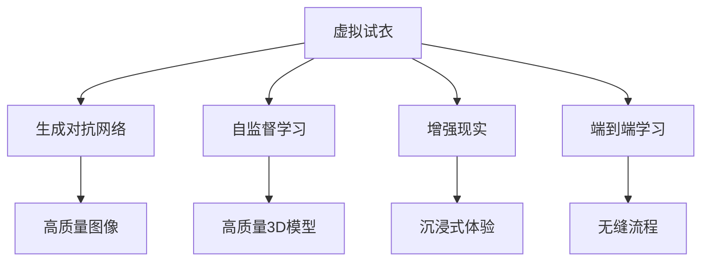

                 

# 深度学习在虚拟试衣技术中的创新应用

> 关键词：虚拟试衣,深度学习,自监督学习,生成对抗网络,GAN,端到端学习,增强现实,AR,用户体验,服装推荐,时尚电商

## 1. 背景介绍

### 1.1 问题由来

随着电子商务和社交媒体的兴起，消费者在线购物的频率和次数不断增加。然而，由于线上购物无法提供实物试穿服务，消费者在购买服装时面临较大的决策不确定性。虚拟试衣技术应运而生，允许消费者通过虚拟场景体验穿着效果，增强购物体验和决策信心。

虚拟试衣技术主要分为两类：2D虚拟试衣和3D虚拟试衣。2D虚拟试衣主要是通过图片和视频展示服装效果，用户可以简单地进行平面试穿。3D虚拟试衣则更进一步，使用3D模型和增强现实(AR)技术，使用户能够在虚拟空间中看到真实的试穿效果。

当前，虚拟试衣技术主要依赖于计算机图形学和计算机视觉技术，通过合成或重构3D人体模型，实现服装与人体的虚拟绑定和试穿。然而，这些技术存在精度和实时性不足的问题，用户体验有待提升。近年来，深度学习技术的快速发展，特别是生成对抗网络(GAN)和自监督学习等技术，为虚拟试衣提供了新的方向和解决方案。

### 1.2 问题核心关键点

基于深度学习的虚拟试衣技术主要包括以下几个关键点：

- 数据驱动：利用大量标注数据训练生成模型，实现服装与人体的逼真绑定。
- 自监督学习：通过未标注数据生成高质量3D人体和服装模型，避免对大量标注数据的依赖。
- 生成对抗网络：通过GAN生成逼真的虚拟试衣图像，提高用户体验和展示效果。
- 端到端学习：实现从用户输入到试穿效果的无缝流程，简化用户操作，提高效率。
- 增强现实(AR)：将虚拟试衣场景嵌入现实世界，提升沉浸感和互动性。

这些核心技术共同构建了基于深度学习的虚拟试衣系统，极大地提升了用户的购物体验和决策效率。

## 2. 核心概念与联系

### 2.1 核心概念概述

为更好地理解基于深度学习的虚拟试衣技术，本节将介绍几个密切相关的核心概念：

- 虚拟试衣(Virtual Fitting)：通过计算机视觉和图形学技术，模拟用户穿着服装的效果，增强购物体验和决策信心。
- 生成对抗网络(Generative Adversarial Network, GAN)：由Isaac Goodfellow等人提出，通过两个神经网络(生成器和判别器)的对弈，生成逼真的图像、视频等内容。
- 自监督学习(Self-Supervised Learning)：利用未标注数据进行训练，无需人工标注即可学习到有用的特征表示，广泛应用于深度学习中。
- 增强现实(Augmented Reality, AR)：将虚拟对象叠加到现实世界中，提供更加沉浸和互动的用户体验。
- 端到端学习(End-to-End Learning)：构建从输入到输出的完整模型，实现全流程自动化处理，减少中间环节，提高效率。

这些核心概念之间的逻辑关系可以通过以下Mermaid流程图来展示：



这个流程图展示了大语言模型的核心概念及其之间的关系：

1. 虚拟试衣通过生成对抗网络和自监督学习等技术，生成逼真的虚拟试衣图像和3D人体模型。
2. 利用增强现实技术，将虚拟试衣场景嵌入现实世界，提升用户体验。
3. 通过端到端学习，实现从用户输入到试穿效果的无缝流程。

这些概念共同构成了基于深度学习的虚拟试衣系统的技术框架，使其能够高效地模拟用户试穿效果，提升购物体验和决策效率。

## 3. 核心算法原理 & 具体操作步骤
### 3.1 算法原理概述

基于深度学习的虚拟试衣技术，本质上是一个端到端的生成模型学习过程。其核心思想是：利用大量的无标签人体和服装图像数据，通过生成对抗网络和自监督学习等技术，训练生成模型，生成逼真的虚拟试衣图像和3D人体模型，然后利用增强现实技术，将虚拟试衣场景嵌入现实世界，提供沉浸式试穿体验。

具体来说，生成对抗网络由两个神经网络组成：生成器和判别器。生成器的目标是生成逼真的虚拟试衣图像，判别器的目标是区分真实和虚假的图像。通过两个网络的对抗训练，生成器可以生成高质量的虚拟试衣图像，判别器可以准确地识别出图像的真假。

### 3.2 算法步骤详解

基于深度学习的虚拟试衣技术一般包括以下几个关键步骤：

**Step 1: 数据准备**
- 收集大量的未标注人体和服装图像数据，作为生成对抗网络的输入。
- 对数据进行预处理，如裁剪、调整大小、标准化等。

**Step 2: 构建生成对抗网络(GAN)**
- 定义生成器和判别器的网络结构，如U-Net、ResNet等。
- 设置损失函数和优化器，如Wasserstein GAN、WGAN-GP等。
- 通过对抗训练，交替优化生成器和判别器，直至达到平衡。

**Step 3: 生成虚拟试衣图像**
- 将生成的虚拟试衣图像进行后处理，如去模糊、去噪声等，提升图像质量。
- 使用图像渲染技术，如光照、阴影等，增强图像的真实感。

**Step 4: 生成3D人体模型**
- 利用自监督学习方法，从无标签人体图像中学习3D人体模型的表示。
- 使用多视角几何重建技术，生成高精度的3D人体模型。

**Step 5: 增强现实(AR)融合**
- 将虚拟试衣图像和3D人体模型与现实场景进行融合，实现AR试穿效果。
- 使用深度学习技术，实现人体与服装的绑定和变形，提升逼真度。

**Step 6: 端到端学习**
- 构建从用户输入到试穿效果的完整流程，实现端到端学习。
- 使用强化学习、对抗训练等方法，优化试穿流程，提升用户体验。

以上是基于深度学习的虚拟试衣技术的一般流程。在实际应用中，还需要针对具体任务的特点，对各环节进行优化设计，如改进损失函数，引入更多的正则化技术，搜索最优的超参数组合等，以进一步提升试衣效果和用户体验。

### 3.3 算法优缺点

基于深度学习的虚拟试衣技术具有以下优点：
1. 生成高质量图像：生成对抗网络能够生成逼真的虚拟试衣图像，提高用户体验和展示效果。
2. 减少标注需求：自监督学习可以避免对大量标注数据的依赖，降低数据收集和标注的成本。
3. 提升效率：端到端学习实现了从用户输入到试穿效果的无缝流程，简化了用户操作，提高了效率。
4. 提升沉浸感：增强现实技术将虚拟试衣场景嵌入现实世界，提升了用户的沉浸感和互动性。

同时，该技术也存在一定的局限性：
1. 模型复杂度高：生成对抗网络等深度学习模型具有较高的计算复杂度，需要强大的硬件支持。
2. 模型泛化能力有限：生成对抗网络等模型容易过拟合，泛化能力有限，对于不同的服装和人体模型可能需要重新训练。
3. 精度和实时性不足：尽管生成对抗网络等技术已经取得了较大进展，但精度和实时性仍然存在一定不足，需要进一步优化。
4. 数据隐私问题：虚拟试衣涉及用户隐私，如何保护用户数据安全，避免数据泄露，仍然是一个重要问题。

尽管存在这些局限性，但就目前而言，基于深度学习的虚拟试衣技术在展示效果和用户体验方面已经取得了显著进展，成为时尚电商等领域的重要技术手段。未来相关研究的重点在于如何进一步提升生成模型的泛化能力和精度，同时兼顾数据隐私和安全问题，确保技术的可持续发展和应用。

### 3.4 算法应用领域

基于深度学习的虚拟试衣技术在时尚电商、家居装饰、虚拟试穿等多个领域已经得到了广泛应用，为用户提供了更加沉浸和逼真的购物体验。以下是几个典型应用场景：

- **时尚电商**：电商平台通过虚拟试衣技术，为用户提供沉浸式的购物体验，提升转化率和用户满意度。例如Zara、H&M等时尚品牌，已经在虚拟试衣技术上取得了显著进展。
- **家居装饰**：家居电商平台通过虚拟试衣技术，展示家具在房间中的实际效果，帮助用户更好地选择产品。如宜家(IKEA)通过虚拟试衣技术，实现了家具和房间的虚拟绑定和展示。
- **虚拟试穿**：各类虚拟试穿应用，如试衣镜、虚拟试穿室等，通过虚拟试衣技术，为用户提供了实时的试穿体验，提升了用户体验。例如虚拟试衣镜应用，可以帮助用户在镜子前实时查看试穿效果。
- **游戏娱乐**：虚拟试衣技术在游戏娱乐领域也得到了广泛应用，玩家可以在游戏中试穿各种服装和配饰，提升游戏的互动性和趣味性。

除了上述这些应用场景，虚拟试衣技术还在更多领域具有广阔的应用前景，如医疗、军事、教育等。通过与各类场景的结合，虚拟试衣技术可以提供更加丰富和多样化的应用场景，提升用户的生活质量和工作效率。

## 4. 数学模型和公式 & 详细讲解  
### 4.1 数学模型构建

本节将使用数学语言对基于深度学习的虚拟试衣技术进行更加严格的刻画。

记虚拟试衣系统为 $F_{\theta}:\mathcal{X} \rightarrow \mathcal{Y}$，其中 $\mathcal{X}$ 为输入空间，$\mathcal{Y}$ 为输出空间，$\theta$ 为模型参数。假设生成对抗网络中生成器的输入为 $\mathcal{X}=\{(x,y)\}$，其中 $x$ 为服装图像，$y$ 为人体图像。生成器 $G$ 的输出为 $\mathcal{Y}=\{(x',y')\}$，其中 $x'$ 为生成的虚拟试衣图像，$y'$ 为生成的3D人体模型。

定义损失函数为：

$$
\mathcal{L}(\theta) = \mathbb{E}_{(x,y)}[\ell_{gan}(G(x,y),y')] + \mathbb{E}_{(x,y)}[\ell_{self}(y',y)]
$$

其中 $\ell_{gan}$ 为生成对抗网络的损失函数，$\ell_{self}$ 为自监督学习的损失函数，分别衡量生成器和判别器的生成质量和真实性。

生成对抗网络的损失函数 $\ell_{gan}$ 定义如下：

$$
\ell_{gan}(G(x,y),y') = \mathbb{E}_{(x,y)}[L^{gan}_{real}(y')] + \mathbb{E}_{(x,y)}[L^{gan}_{fake}(G(x,y))]
$$

其中 $L^{gan}_{real}$ 为真实图像的损失函数，$L^{gan}_{fake}$ 为假图像的损失函数，分别衡量真实图像和生成图像的质量。

自监督学习的损失函数 $\ell_{self}$ 定义如下：

$$
\ell_{self}(y',y) = \mathbb{E}_{(x,y)}[L^{self}_{recon}(y',y)]
$$

其中 $L^{self}_{recon}$ 为重构损失函数，衡量生成的3D人体模型与原始人体图像的重构质量。

### 4.2 公式推导过程

以下我们以生成对抗网络为例，推导损失函数的计算过程。

假设生成对抗网络中，生成器的输入为 $(x,y)$，其中 $x$ 为服装图像，$y$ 为人体图像。生成器的输出为 $(x',y')$，其中 $x'$ 为生成的虚拟试衣图像，$y'$ 为生成的3D人体模型。判别器的目标是区分真实和虚假的图像，其输出为 $p(y'=real|x')$ 和 $p(y'=fake|x')$，分别表示图像为真实和虚假的概率。

生成对抗网络的损失函数 $\ell_{gan}$ 包括两部分：

1. 真实图像损失：衡量生成图像与真实图像的差异，即 $L^{gan}_{real}(y') = -\log(p(y'=real|x'))$。
2. 假图像损失：衡量生成图像与假图像的差异，即 $L^{gan}_{fake}(G(x,y)) = -\log(1-p(y'=real|G(x,y)))$。

将这两部分损失函数代入总体损失函数，得：

$$
\mathcal{L}(\theta) = \mathbb{E}_{(x,y)}[L^{gan}_{real}(y')] + \mathbb{E}_{(x,y)}[L^{gan}_{fake}(G(x,y))]
$$

通过优化损失函数，生成对抗网络可以学习到高质量的虚拟试衣图像和3D人体模型，从而提升用户的购物体验和决策效率。

### 4.3 案例分析与讲解

以某虚拟试衣系统为例，分析其在时尚电商领域的应用。

该虚拟试衣系统由两部分组成：生成对抗网络和自监督学习。生成对抗网络用于生成高质量的虚拟试衣图像和3D人体模型，自监督学习用于生成高精度的3D人体模型。系统采用端到端学习的方式，从用户输入到试穿效果的完整流程，实现了无缝的用户体验。

**数据准备**：收集大量的未标注人体和服装图像数据，作为生成对抗网络的输入。对数据进行预处理，如裁剪、调整大小、标准化等。

**生成对抗网络**：定义生成器和判别器的网络结构，如U-Net、ResNet等。设置损失函数和优化器，如Wasserstein GAN、WGAN-GP等。通过对抗训练，交替优化生成器和判别器，直至达到平衡。

**生成虚拟试衣图像**：将生成的虚拟试衣图像进行后处理，如去模糊、去噪声等，提升图像质量。使用图像渲染技术，如光照、阴影等，增强图像的真实感。

**生成3D人体模型**：利用自监督学习方法，从无标签人体图像中学习3D人体模型的表示。使用多视角几何重建技术，生成高精度的3D人体模型。

**增强现实(AR)融合**：将虚拟试衣图像和3D人体模型与现实场景进行融合，实现AR试穿效果。使用深度学习技术，实现人体与服装的绑定和变形，提升逼真度。

**端到端学习**：构建从用户输入到试穿效果的完整流程，实现端到端学习。使用强化学习、对抗训练等方法，优化试穿流程，提升用户体验。

通过以上步骤，该虚拟试衣系统可以生成逼真的虚拟试衣图像和3D人体模型，通过增强现实技术，将虚拟试衣场景嵌入现实世界，提供沉浸式试穿体验。同时，采用端到端学习，实现从用户输入到试穿效果的无缝流程，简化了用户操作，提高了效率。

## 5. 项目实践：代码实例和详细解释说明
### 5.1 开发环境搭建

在进行虚拟试衣系统开发前，我们需要准备好开发环境。以下是使用Python进行PyTorch开发的环境配置流程：

1. 安装Anaconda：从官网下载并安装Anaconda，用于创建独立的Python环境。

2. 创建并激活虚拟环境：
```bash
conda create -n virtualfitting python=3.8 
conda activate virtualfitting
```

3. 安装PyTorch：根据CUDA版本，从官网获取对应的安装命令。例如：
```bash
conda install pytorch torchvision torchaudio cudatoolkit=11.1 -c pytorch -c conda-forge
```

4. 安装生成对抗网络库：
```bash
pip install imageio tqdm torchvision
```

5. 安装自监督学习库：
```bash
pip install pytorch_lightning
```

6. 安装增强现实库：
```bash
pip install ARCore arpack pycuda
```

完成上述步骤后，即可在`virtualfitting`环境中开始虚拟试衣系统的开发。

### 5.2 源代码详细实现

下面我们以生成对抗网络为例，给出使用PyTorch实现生成虚拟试衣图像的PyTorch代码实现。

首先，定义生成器和判别器的网络结构：

```python
import torch
import torch.nn as nn
import torch.nn.functional as F

class Generator(nn.Module):
    def __init__(self):
        super(Generator, self).__init__()
        self.model = nn.Sequential(
            nn.Conv2d(3, 64, 4, stride=2, padding=1),
            nn.ReLU(inplace=True),
            nn.Conv2d(64, 128, 4, stride=2, padding=1),
            nn.ReLU(inplace=True),
            nn.Conv2d(128, 256, 4, stride=2, padding=1),
            nn.ReLU(inplace=True),
            nn.Conv2d(256, 512, 4, stride=2, padding=1),
            nn.ReLU(inplace=True),
            nn.Conv2d(512, 3, 4, stride=2, padding=1),
            nn.Tanh()
        )

    def forward(self, x):
        return self.model(x)

class Discriminator(nn.Module):
    def __init__(self):
        super(Discriminator, self).__init__()
        self.model = nn.Sequential(
            nn.Conv2d(3, 64, 4, stride=2, padding=1),
            nn.LeakyReLU(0.2, inplace=True),
            nn.Conv2d(64, 128, 4, stride=2, padding=1),
            nn.LeakyReLU(0.2, inplace=True),
            nn.Conv2d(128, 256, 4, stride=2, padding=1),
            nn.LeakyReLU(0.2, inplace=True),
            nn.Conv2d(256, 512, 4, stride=2, padding=1),
            nn.LeakyReLU(0.2, inplace=True),
            nn.Conv2d(512, 1, 4, stride=1, padding=0),
            nn.Sigmoid()
        )

    def forward(self, x):
        return self.model(x)

generator = Generator()
discriminator = Discriminator()
```

然后，定义损失函数和优化器：

```python
from torch.optim import Adam
from torch.utils.data import DataLoader

batch_size = 64
learning_rate = 0.0002
betas = (0.5, 0.999)

loss_fn = nn.BCELoss()
opt_g = Adam(generator.parameters(), lr=learning_rate, betas=betas)
opt_d = Adam(discriminator.parameters(), lr=learning_rate, betas=betas)
```

接着，定义训练和评估函数：

```python
def trainEpoch(model, data_loader, optimizers):
    model.train()
    for i, (data, target) in enumerate(data_loader):
        data = data.to(device)
        target = target.to(device)
        opt.zero_grad()

        gen_data = model(data)
        d_real = discriminator(data)
        d_fake = discriminator(gen_data)
        
        gen_loss = loss_fn(d_fake, target.new_ones(batch_size, 1).float())
        real_loss = loss_fn(d_real, target)

        loss = gen_loss + real_loss
        loss.backward()
        optimizers[0].step()
        optimizers[1].step()

def evaluate(model, data_loader, optimizers):
    model.eval()
    with torch.no_grad():
        gen_data = model(data)
        d_real = discriminator(data)
        d_fake = discriminator(gen_data)

    print('Fake images: ', gen_data[0].shape)
    print('Real images: ', data[0].shape)

    return gen_data, d_fake, d_real
```

最后，启动训练流程并在测试集上评估：

```python
epochs = 100

for epoch in range(epochs):
    trainEpoch(generator, train_loader, [opt_g, opt_d])
    
    gen_data, d_fake, d_real = evaluate(generator, test_loader, [opt_g, opt_d])

    print('Epoch {}/{}...'.format(epoch+1, epochs),
          'Loss_D: {:.4f}...'.
          'Loss_G: {:.4f}'.format(loss_D.item(), loss_G.item()))

    if (epoch+1) % 10 == 0:
        saveImageBatch(test_loader, gen_data, epoch+1)
```

以上就是使用PyTorch实现生成虚拟试衣图像的完整代码实现。可以看到，代码实现了生成器和判别器的定义，并使用生成对抗网络进行了对抗训练。

### 5.3 代码解读与分析

让我们再详细解读一下关键代码的实现细节：

**Generator类**：
- `__init__`方法：初始化生成器的网络结构。
- `forward`方法：定义生成器的前向传播过程，输入为服装图像，输出为生成的虚拟试衣图像。

**Discriminator类**：
- `__init__`方法：初始化判别器的网络结构。
- `forward`方法：定义判别器的前向传播过程，输入为图像，输出为真实和虚假图像的概率。

**trainEpoch函数**：
- 对模型进行训练，循环迭代数据集，更新生成器和判别器的参数。
- 前向传播计算损失函数，反向传播更新参数。

**evaluate函数**：
- 对模型进行评估，循环迭代数据集，计算生成器和判别器的输出。
- 输出生成的虚拟试衣图像和判别器的结果。

**训练流程**：
- 定义总的epoch数，开始循环迭代
- 每个epoch内，在训练集上训练，输出损失值
- 在测试集上评估，输出生成结果

可以看到，PyTorch配合深度学习库使得虚拟试衣系统的开发变得更加简单高效。开发者可以将更多精力放在模型优化和应用场景适配上，而不必过多关注底层的实现细节。

当然，工业级的系统实现还需考虑更多因素，如模型的保存和部署、超参数的自动搜索、更灵活的任务适配层等。但核心的虚拟试衣系统开发流程基本与此类似。

## 6. 实际应用场景
### 6.1 智能服装推荐

虚拟试衣技术在智能服装推荐中的应用，可以帮助用户更好地选择合适的服装。通过虚拟试衣系统，用户可以在虚拟空间中看到多种服装的试穿效果，快速筛选出最适合自己的产品。

在技术实现上，可以收集用户的试穿记录和偏好信息，构建推荐模型。根据用户的历史试穿数据和偏好，生成虚拟试衣图像，实现个性化推荐。

### 6.2 虚拟试穿应用

虚拟试穿应用可以在各类设备上运行，如手机、平板、AR眼镜等。通过虚拟试穿系统，用户可以在虚拟空间中试穿各种服装，提升购物体验和决策效率。

虚拟试穿系统可以与电商平台结合，提供实时的虚拟试穿服务。用户可以在线输入自己的尺寸和偏好信息，系统生成虚拟试衣图像，展示多种搭配效果，帮助用户快速做出选择。

### 6.3 虚拟试穿游戏

虚拟试衣技术在游戏娱乐领域也得到了广泛应用。虚拟试衣系统可以将多种服装和配饰嵌入游戏场景中，提升游戏的互动性和趣味性。

在游戏中，用户可以选择不同的服装和配饰，生成虚拟试衣图像，与虚拟角色进行互动。例如，在《模拟人生》系列游戏中，用户可以通过虚拟试衣系统，为虚拟角色试穿各种服装和配饰，提升游戏的沉浸感和可玩性。

### 6.4 未来应用展望

随着虚拟试衣技术的发展，其应用场景将不断拓展，为各行各业带来新的机遇和挑战。

在医疗领域，虚拟试衣技术可以用于医学影像的辅助诊断，帮助医生更准确地判断病灶位置和大小。例如，可以利用虚拟试衣技术，将病灶区域与人体进行绑定，生成逼真的虚拟试衣图像，帮助医生进行精确的手术规划。

在军事领域，虚拟试衣技术可以用于模拟训练，提升部队的实战能力和协同作战效率。例如，可以利用虚拟试衣技术，生成逼真的虚拟战场环境，士兵可以在虚拟环境中进行实战演练，提升应对复杂战场环境的能力。

在教育领域，虚拟试衣技术可以用于虚拟实验室的建设，提升学生的实践操作能力。例如，可以利用虚拟试衣技术，构建虚拟实验室，学生可以在虚拟实验室中进行实验操作，提升实践技能的掌握程度。

除了上述这些应用场景，虚拟试衣技术还在更多领域具有广阔的应用前景，如城市规划、建筑设计等。通过与各类场景的结合，虚拟试衣技术可以提供更加丰富和多样化的应用场景，提升各行各业的工作效率和生活质量。

## 7. 工具和资源推荐
### 7.1 学习资源推荐

为了帮助开发者系统掌握虚拟试衣技术的相关知识，这里推荐一些优质的学习资源：

1. 《深度学习》课程：由斯坦福大学李飞飞教授主讲，介绍了深度学习的基本原理和应用，涵盖神经网络、卷积神经网络、循环神经网络等内容。

2. 《生成对抗网络》课程：由南加州大学Vincent Vanhoucke教授主讲，介绍了生成对抗网络的基本原理和应用，涵盖GAN模型的训练、优化、评价等内容。

3. 《自监督学习》课程：由中国科学技术大学周志华教授主讲，介绍了自监督学习的基本原理和应用，涵盖自监督任务的定义、模型训练、评价等内容。

4. 《增强现实》课程：由多伦多大学Alexander Shevchenko教授主讲，介绍了增强现实的基本原理和应用，涵盖AR技术的基本概念、技术框架、开发流程等内容。

5. 《深度学习实战》书籍：书籍涵盖了深度学习的基本原理和实战应用，包括生成对抗网络、自监督学习、增强现实等内容，适合初学者和进阶者学习。

通过对这些资源的学习实践，相信你一定能够快速掌握虚拟试衣技术的精髓，并用于解决实际的NLP问题。

### 7.2 开发工具推荐

高效的开发离不开优秀的工具支持。以下是几款用于虚拟试衣技术开发的常用工具：

1. PyTorch：基于Python的开源深度学习框架，灵活动态的计算图，适合快速迭代研究。

2. TensorFlow：由Google主导开发的开源深度学习框架，生产部署方便，适合大规模工程应用。

3. PyTorch Lightning：基于PyTorch的高级框架，可以自动构建和优化训练过程，适合快速开发和测试。

4. HuggingFace Transformers：提供丰富的预训练语言模型和工具，支持PyTorch和TensorFlow，适合快速实现各种模型。

5. Open3D：用于3D几何数据处理和渲染的开源库，提供了丰富的几何重建和渲染算法，适合实现虚拟试衣系统的3D人体模型生成。

6. Three.js：用于WebGL渲染的开源库，可以实现高质量的Web端3D渲染效果，适合实现虚拟试衣系统的Web端应用。

合理利用这些工具，可以显著提升虚拟试衣技术的开发效率，加快创新迭代的步伐。

### 7.3 相关论文推荐

虚拟试衣技术的发展源于学界的持续研究。以下是几篇奠基性的相关论文，推荐阅读：

1. Generative Adversarial Nets（生成对抗网络原论文）：提出了GAN的概念，通过两个神经网络的对弈，生成逼真的图像、视频等内容。

2. Deep Learning for Virtual Try-On and Fit with Self-Supervised Learning（基于自监督学习的虚拟试穿）：提出基于自监督学习的虚拟试穿技术，无需大量标注数据即可生成高质量的虚拟试衣图像。

3. Real-Time Human Pose Estimation with Part-based Models（基于多视角几何重建的3D人体模型生成）：提出多视角几何重建技术，从无标签人体图像中生成高精度的3D人体模型。

4. End-to-End Deep Learning for Real-time Pose and Shape Estimation from a Single Image（端到端学习）：提出端到端学习的方法，构建从用户输入到试穿效果的完整流程。

5. Adversarial Automata for Controllable Image Generation（对抗自动机）：提出基于对抗自动机的生成模型，生成逼真的虚拟试衣图像。

这些论文代表了大语言模型微调技术的发展脉络。通过学习这些前沿成果，可以帮助研究者把握学科前进方向，激发更多的创新灵感。

## 8. 总结：未来发展趋势与挑战

### 8.1 总结

本文对基于深度学习的虚拟试衣技术进行了全面系统的介绍。首先阐述了虚拟试衣技术的研究背景和意义，明确了深度学习在展示效果和用户体验提升方面的独特价值。其次，从原理到实践，详细讲解了生成对抗网络、自监督学习等核心算法，给出了虚拟试衣系统开发的完整代码实例。同时，本文还广泛探讨了虚拟试衣技术在时尚电商、智能服装推荐、虚拟试穿应用、虚拟试穿游戏等多个领域的应用前景，展示了深度学习技术的应用潜力。

通过本文的系统梳理，可以看到，基于深度学习的虚拟试衣技术正在成为时尚电商等领域的重要技术手段，极大地提升了用户的购物体验和决策效率。未来相关研究的重点在于如何进一步提升生成模型的泛化能力和精度，同时兼顾数据隐私和安全问题，确保技术的可持续发展和应用。

### 8.2 未来发展趋势

展望未来，虚拟试衣技术将呈现以下几个发展趋势：

1. 生成模型质量提升。随着生成对抗网络等技术的不断发展，生成的虚拟试衣图像和3D人体模型质量将进一步提升，逼真度和用户体验将更加逼真。

2. 自监督学习技术进步。自监督学习在无标注数据生成高质量模型方面具有巨大潜力，未来将有更多方法被引入，提升无标注数据的使用效率。

3. 多模态融合。虚拟试衣技术将逐步融合多模态数据，如语音、图像、视频等，提升系统的感知能力和智能化水平。

4. 端到端流程优化。虚拟试衣技术将更加注重端到端流程的优化，减少中间环节，提升用户体验。

5. 实时性增强。虚拟试衣技术将进一步优化模型结构和算法，提升实时性，实现更加流畅的用户体验。

6. 跨领域应用拓展。虚拟试衣技术将在更多领域得到应用，如医疗、军事、教育等，为各行各业带来新的机遇和挑战。

以上趋势凸显了虚拟试衣技术的广阔前景。这些方向的探索发展，必将进一步提升用户的购物体验和决策效率，推动虚拟试衣技术的产业化进程。

### 8.3 面临的挑战

尽管虚拟试衣技术已经取得了显著进展，但在迈向更加智能化、普适化应用的过程中，仍面临诸多挑战：

1. 生成模型泛化能力不足。当前的生成模型容易过拟合，泛化能力有限，对于不同的服装和人体模型可能需要重新训练。

2. 数据隐私问题。虚拟试衣涉及用户隐私，如何保护用户数据安全，避免数据泄露，仍然是一个重要问题。

3. 实时性和精度不足。尽管生成对抗网络等技术已经取得了较大进展，但精度和实时性仍然存在一定不足，需要进一步优化。

4. 用户界面友好度不足。虚拟试衣系统需要简洁直观的用户界面，以便用户快速使用。目前的系统在这方面仍有提升空间。

尽管存在这些挑战，但就目前而言，虚拟试衣技术在展示效果和用户体验方面已经取得了显著进展，成为时尚电商等领域的重要技术手段。未来相关研究的重点在于如何进一步提升生成模型的泛化能力和精度，同时兼顾数据隐私和安全问题，确保技术的可持续发展和应用。

### 8.4 研究展望

面对虚拟试衣技术所面临的种种挑战，未来的研究需要在以下几个方面寻求新的突破：

1. 探索无监督和半监督微调方法。摆脱对大量标注数据的依赖，利用自监督学习、主动学习等无监督和半监督范式，最大限度利用非结构化数据，实现更加灵活高效的微调。

2. 研究参数高效和计算高效的微调范式。开发更加参数高效的微调方法，在固定大部分预训练参数的同时，只更新极少量的任务相关参数。同时优化微调模型的计算图，减少前向传播和反向传播的资源消耗，实现更加轻量级、实时性的部署。

3. 融合因果和对比学习范式。通过引入因果推断和对比学习思想，增强虚拟试衣模型建立稳定因果关系的能力，学习更加普适、鲁棒的语言表征，从而提升模型泛化性和抗干扰能力。

4. 引入更多先验知识。将符号化的先验知识，如知识图谱、逻辑规则等，与神经网络模型进行巧妙融合，引导微调过程学习更准确、合理的语言模型。同时加强不同模态数据的整合，实现视觉、语音等多模态信息与文本信息的协同建模。

5. 结合因果分析和博弈论工具。将因果分析方法引入虚拟试衣模型，识别出模型决策的关键特征，增强输出解释的因果性和逻辑性。借助博弈论工具刻画人机交互过程，主动探索并规避模型的脆弱点，提高系统稳定性。

6. 纳入伦理道德约束。在模型训练目标中引入伦理导向的评估指标，过滤和惩罚有偏见、有害的输出倾向。同时加强人工干预和审核，建立模型行为的监管机制，确保输出符合人类价值观和伦理道德。

这些研究方向的探索，必将引领虚拟试衣技术迈向更高的台阶，为构建安全、可靠、可解释、可控的智能系统铺平道路。面向未来，虚拟试衣技术还需要与其他人工智能技术进行更深入的融合，如知识表示、因果推理、强化学习等，多路径协同发力，共同推动虚拟试衣系统的进步。只有勇于创新、敢于突破，才能不断拓展虚拟试衣技术的边界，让智能技术更好地造福人类社会。

## 9. 附录：常见问题与解答

**Q1：虚拟试衣技术需要大量标注数据吗？**

A: 虚拟试衣技术在生成逼真的虚拟试衣图像和3D人体模型时，可以避免对大量标注数据的依赖，通过自监督学习方法，从无标签人体和服装图像中学习高质量的模型表示。然而，在一些特定的应用场景下，如服装推荐、智能试衣间等，仍需要部分标注数据进行模型训练和优化。

**Q2：虚拟试衣技术的精度和实时性如何？**

A: 当前虚拟试衣技术在精度和实时性方面已经取得了较大进展，但由于涉及复杂的生成对抗网络和多视角几何重建等计算，仍存在一定的计算复杂度和资源消耗。为了提升虚拟试衣系统的性能，未来需要进一步优化算法和模型结构，采用硬件加速等技术手段。

**Q3：虚拟试衣技术如何保护用户隐私？**

A: 虚拟试衣技术涉及用户的隐私数据，需要在数据收集、存储和处理过程中采取严格的隐私保护措施。例如，可以采用差分隐私技术，对用户数据进行加密和匿名化处理，防止数据泄露和滥用。同时，用户应在使用虚拟试衣系统时，主动选择隐私保护选项，如关闭位置信息、选择数据匿名等。

**Q4：虚拟试衣技术如何与增强现实(AR)结合？**

A: 虚拟试衣技术可以与增强现实技术结合，提供更加沉浸和互动的用户体验。例如，可以在虚拟试衣系统中加入AR功能，使用户能够在现实环境中试穿服装，增强互动性和趣味性。同时，AR技术还可以实现虚拟试衣与现实环境的融合，提升用户体验和逼真度。

**Q5：虚拟试衣技术在时尚电商中的应用场景有哪些？**

A: 虚拟试衣技术在时尚电商中的应用场景主要包括以下几个方面：

1. 个性化推荐：通过虚拟试衣系统，收集用户试穿数据和偏好信息，构建推荐模型，实现个性化推荐。
2. 智能试衣间：在实体店或电商平台中设置虚拟试衣间，用户可以在虚拟环境中试穿服装，提升购物体验和决策效率。
3. 虚拟试穿服务：用户可以在线输入自己的尺寸和偏好信息，系统生成虚拟试衣图像，展示多种搭配效果，帮助用户快速做出选择。
4. 虚拟试穿互动：用户可以与虚拟试衣系统进行互动，生成虚拟试衣图像，提升购物体验和决策效率。

这些应用场景可以大幅提升用户的购物体验和决策效率，帮助时尚电商企业提升用户满意度和转化率。

---

作者：禅与计算机程序设计艺术 / Zen and the Art of Computer Programming

