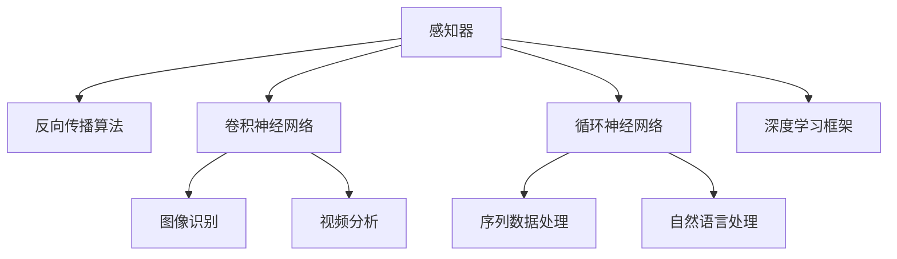

                 

# 深度学习基础：从感知器到深层网络

> 关键词：深度学习,神经网络,感知器,反向传播算法,卷积神经网络(CNN),循环神经网络(RNN),深度学习框架,PyTorch

## 1. 背景介绍

深度学习是当前最热门的AI技术之一，广泛应用于图像识别、自然语言处理、语音识别等领域。其核心思想是构建多层神经网络，模拟人脑的抽象逻辑和复杂决策能力，实现高精度的模式识别和智能推断。本文将从感知器说起，详细讲解深度学习的基本原理与演进，并通过具体的代码实现和应用实例，帮助读者深入理解深度学习技术。

## 2. 核心概念与联系

### 2.1 核心概念概述

为更好地理解深度学习的演进路径，本文将介绍几个核心概念：

- **感知器(Perceptron)**：深度学习的起源，由Rosenblatt于1958年提出，是一种最简单的前馈神经网络，用于二分类任务。
- **反向传播算法(Backpropagation)**：深度学习模型的核心算法，用于计算损失函数对模型参数的梯度。
- **卷积神经网络(CNN)**：用于图像处理、视频分析等任务，通过卷积层和池化层提取局部特征，显著提升了模型性能。
- **循环神经网络(RNN)**：用于序列数据处理，通过循环结构实现对序列中时间信息的捕捉。
- **深度学习框架**：如TensorFlow、PyTorch等，提供了高效的工具库和自动微分引擎，方便模型构建和训练。

这些核心概念构成了深度学习的技术基础，通过不断演进和发展，逐步扩展为现代复杂的深度神经网络模型。

### 2.2 核心概念原理和架构的 Mermaid 流程图



## 3. 核心算法原理 & 具体操作步骤

### 3.1 算法原理概述

深度学习的基本原理是构建多层神经网络，通过一系列线性变换和非线性激活函数，实现对输入数据的复杂表示和特征提取。深度学习的训练过程，即通过反向传播算法，计算模型输出与真实标签之间的差异，不断更新模型参数，最小化损失函数。

### 3.2 算法步骤详解

深度学习的训练过程通常包括以下几个关键步骤：

**Step 1: 数据预处理**
- 收集和清洗训练数据，并将其标准化为模型可以接受的形式。
- 将数据分为训练集、验证集和测试集，以评估模型性能。

**Step 2: 构建模型**
- 选择合适的深度学习框架，如PyTorch、TensorFlow等。
- 定义模型的结构，包括输入层、隐藏层和输出层，并设置超参数。

**Step 3: 初始化模型参数**
- 使用随机初始化方法（如Xavier、He等）为模型参数赋初值。

**Step 4: 前向传播**
- 将训练数据输入模型，计算模型输出。

**Step 5: 计算损失函数**
- 计算模型输出与真实标签之间的差异，得到损失函数值。

**Step 6: 反向传播**
- 通过反向传播算法，计算损失函数对模型参数的梯度。

**Step 7: 更新模型参数**
- 使用梯度下降等优化算法，更新模型参数，最小化损失函数。

**Step 8: 验证和测试**
- 在验证集和测试集上评估模型性能，防止过拟合。
- 调整超参数，重新训练模型，直至满足要求。

### 3.3 算法优缺点

深度学习算法具有以下优点：

- **自动特征提取**：通过多层非线性变换，模型可以自动学习输入数据的高级特征，无需手动设计特征。
- **高效计算**：利用GPU等高性能设备，模型能够高效进行并行计算。
- **泛化能力强**：通过大量数据训练，模型能够泛化到未见过的数据，实现通用化应用。

同时，深度学习算法也存在一些缺点：

- **模型复杂度高**：深层网络参数量巨大，训练复杂度高，容易过拟合。
- **数据需求大**：需要大量标注数据，标注成本高。
- **训练时间长**：模型训练时间长，需要高性能设备和算力支持。
- **可解释性差**：深层网络结构复杂，难以解释其决策过程，缺乏透明性。

### 3.4 算法应用领域

深度学习算法在多个领域得到了广泛应用，例如：

- **计算机视觉**：如图像分类、目标检测、图像生成等。
- **自然语言处理**：如机器翻译、文本生成、情感分析等。
- **语音识别**：如语音转写、语音识别等。
- **自动驾驶**：如环境感知、行为预测等。
- **医疗影像分析**：如疾病诊断、病理分析等。
- **金融分析**：如风险评估、股票预测等。

## 4. 数学模型和公式 & 详细讲解 & 举例说明

### 4.1 数学模型构建

深度学习模型的数学模型通常包含输入层、隐藏层和输出层。以一个简单的多层感知器为例，其数学模型如下：

$$
y=f(W^T \cdot x+b)
$$

其中，$x$为输入向量，$W$为权重矩阵，$b$为偏置向量，$f$为激活函数，$y$为输出向量。激活函数常用的有sigmoid、ReLU、tanh等。

### 4.2 公式推导过程

以单层感知器为例，其反向传播算法的推导如下：

1. 前向传播：
$$
a=f(w^T \cdot x+b)
$$

2. 计算损失函数：
$$
L=||y-a||^2
$$

3. 反向传播计算梯度：
$$
\frac{\partial L}{\partial w}=\frac{\partial L}{\partial a} \cdot \frac{\partial a}{\partial w}
$$

4. 更新参数：
$$
w \leftarrow w-\eta \frac{\partial L}{\partial w}
$$

其中，$\eta$为学习率。

### 4.3 案例分析与讲解

以MNIST手写数字识别为例，讲解深度学习模型的训练过程。

1. 数据预处理：将MNIST数据集标准化为0到1之间的图像数据。
2. 构建模型：定义一个3层卷积神经网络，包括卷积层、池化层和全连接层。
3. 初始化模型参数：使用随机初始化方法为模型参数赋初值。
4. 前向传播：将训练数据输入模型，计算模型输出。
5. 计算损失函数：使用交叉熵损失函数计算模型输出与真实标签之间的差异。
6. 反向传播：通过反向传播算法计算损失函数对模型参数的梯度。
7. 更新模型参数：使用梯度下降算法更新模型参数。
8. 验证和测试：在验证集和测试集上评估模型性能，调整超参数，重新训练模型。

## 5. 项目实践：代码实例和详细解释说明

### 5.1 开发环境搭建

在进行深度学习开发前，需要准备以下开发环境：

1. 安装Python：从官网下载并安装Python。
2. 安装PyTorch：使用pip安装PyTorch深度学习库。
3. 安装TensorBoard：使用pip安装TensorBoard可视化工具。
4. 安装Jupyter Notebook：使用pip安装Jupyter Notebook交互式开发工具。

完成以上步骤后，即可在Python环境中进行深度学习开发。

### 5.2 源代码详细实现

以下是一个使用PyTorch实现的多层感知器代码示例：

```python
import torch
import torch.nn as nn
import torch.optim as optim

# 定义多层感知器模型
class MLP(nn.Module):
    def __init__(self):
        super(MLP, self).__init__()
        self.fc1 = nn.Linear(784, 256)
        self.fc2 = nn.Linear(256, 256)
        self.fc3 = nn.Linear(256, 10)
        
    def forward(self, x):
        x = torch.relu(self.fc1(x))
        x = torch.relu(self.fc2(x))
        x = self.fc3(x)
        return x

# 训练模型
model = MLP()
criterion = nn.CrossEntropyLoss()
optimizer = optim.SGD(model.parameters(), lr=0.01, momentum=0.9)

# 训练数据
train_data = ...
train_labels = ...

# 模型训练
for epoch in range(10):
    for i, (inputs, labels) in enumerate(train_loader):
        inputs = inputs.view(-1, 28 * 28)
        optimizer.zero_grad()
        outputs = model(inputs)
        loss = criterion(outputs, labels)
        loss.backward()
        optimizer.step()
        
    print('Epoch [{}/{}], Loss: {:.4f}'.format(epoch+1, 10, loss.item()))
```

### 5.3 代码解读与分析

以下是代码关键部分的详细解读：

**MLP类定义**：
- `__init__`方法：定义了多层感知器的结构，包括两个全连接层和输出层。
- `forward`方法：定义了模型前向传播的计算过程。

**模型训练**：
- `criterion`：定义交叉熵损失函数。
- `optimizer`：定义随机梯度下降优化器，学习率为0.01，动量为0.9。
- `train_data`和`train_labels`：定义训练数据和标签。
- 训练循环：对每个epoch内的数据进行前向传播、计算损失、反向传播和参数更新，输出当前epoch的平均损失。

**注意点**：
- 训练数据和标签需要经过预处理，如归一化、标准化、one-hot编码等。
- 模型训练时需要使用mini-batch策略，通过反向传播算法计算梯度，并使用优化器更新参数。
- 训练过程中需要记录和输出模型的损失和精度，以监控训练效果。

### 5.4 运行结果展示

在训练完成后，可以在测试集上评估模型的性能：

```python
test_data = ...
test_labels = ...

# 测试模型
with torch.no_grad():
    outputs = model(test_data)
    _, predicted = torch.max(outputs.data, 1)
    accuracy = (predicted == test_labels).sum().item() / len(test_labels)
    print('Test Accuracy: {:.2f}%'.format(accuracy * 100))
```

以上代码将输出模型在测试集上的准确率，评估模型的泛化能力。

## 6. 实际应用场景

深度学习在多个领域得到了广泛应用，以下是一些典型的实际应用场景：

### 6.1 计算机视觉

**图像分类**：如使用卷积神经网络对图像进行分类，如CIFAR-10、ImageNet等数据集。
**目标检测**：如使用Faster R-CNN、YOLO等模型，实现对目标的精确定位和识别。
**图像生成**：如使用GAN模型，生成高质量的图像和视频。

### 6.2 自然语言处理

**机器翻译**：如使用序列到序列模型，实现多语言翻译。
**文本生成**：如使用循环神经网络或Transformer模型，生成自然流畅的文本。
**情感分析**：如使用卷积神经网络和LSTM等模型，分析文本的情感倾向。

### 6.3 语音识别

**语音转写**：如使用CTC（Connectionist Temporal Classification）算法，将语音转换为文本。
**语音识别**：如使用深度神经网络，实现对语音的识别和分类。

### 6.4 未来应用展望

随着深度学习技术的不断发展，未来深度学习将在更多领域得到应用，例如：

- **自动驾驶**：如使用深度学习模型进行环境感知和行为预测。
- **医疗影像分析**：如使用卷积神经网络对医疗影像进行分析和诊断。
- **金融分析**：如使用深度学习模型进行风险评估和股票预测。
- **游戏AI**：如使用强化学习等技术，提升游戏AI的智能水平。

## 7. 工具和资源推荐

### 7.1 学习资源推荐

为帮助读者深入理解深度学习，以下是一些优质的学习资源：

1. **《深度学习》**：Ian Goodfellow等著，全面介绍了深度学习的原理、算法和应用。
2. **Coursera《深度学习专项课程》**：由斯坦福大学Andrew Ng教授主讲，系统讲解深度学习的基本概念和实践技巧。
3. **《动手学深度学习》**：李沐等著，介绍了深度学习的基本概念、框架和应用案例。
4. **《TensorFlow官方文档》**：TensorFlow的官方文档，提供了丰富的教程和示例代码。
5. **PyTorch官方文档**：PyTorch的官方文档，提供了详细的API文档和实践指南。

通过这些学习资源，相信读者能够系统掌握深度学习的原理和实践技巧，灵活应用于各种实际问题。

### 7.2 开发工具推荐

深度学习开发需要借助高效的工具支持，以下是几款常用的开发工具：

1. **PyTorch**：由Facebook开源的深度学习框架，提供了丰富的神经网络库和自动微分引擎。
2. **TensorFlow**：由Google开源的深度学习框架，支持分布式计算和多GPU训练。
3. **Keras**：高层次的深度学习框架，提供了简单易用的API，方便快速构建模型。
4. **TensorBoard**：TensorFlow的可视化工具，可以实时监控模型训练过程和输出结果。
5. **Jupyter Notebook**：交互式开发工具，支持Python代码编写、数据可视化、模型训练等功能。

合理利用这些工具，可以显著提升深度学习开发的效率和精度，快速迭代和优化模型。

### 7.3 相关论文推荐

深度学习技术的发展离不开学术界的持续研究，以下是一些经典的研究论文：

1. **《ImageNet Classification with Deep Convolutional Neural Networks》**：Alex Krizhevsky等著，首次展示了卷积神经网络在图像分类上的强大能力。
2. **《Sequence to Sequence Learning with Neural Networks》**：Ilya Sutskever等著，提出了序列到序列的神经网络模型，用于机器翻译、文本生成等任务。
3. **《Learning Phrase Representations using RNN Encoder Decoder for Statistical Machine Translation》**：Andrej Karpathy等著，提出了使用RNN进行机器翻译的思路。
4. **《Convolutional Neural Networks for Sentence Classification》**：Kim Y引入了卷积神经网络进行文本分类任务。
5. **《Attention is All You Need》**：Ashish Vaswani等著，提出了Transformer模型，实现了端到端的自然语言处理任务。

这些论文代表了大深度学习的核心技术，为深度学习的发展提供了坚实的理论基础。

## 8. 总结：未来发展趋势与挑战

### 8.1 研究成果总结

深度学习在多个领域取得了显著的进展，通过构建多层神经网络，实现了对复杂数据的高级表示和特征提取。未来深度学习将进一步拓展到更多领域，提升模型的性能和应用范围。

### 8.2 未来发展趋势

深度学习未来的发展趋势包括：

1. **更高效的结构设计**：如卷积神经网络、循环神经网络、Transformer等，将继续优化结构设计，提升模型的性能和效率。
2. **更强大的模型融合**：如集成学习、模型蒸馏、多模态学习等，将多种模型进行有效融合，提升模型的泛化能力和应用效果。
3. **更灵活的任务适应**：如可解释性、零样本学习、少样本学习等，将提高模型的灵活性和适应能力。
4. **更广泛的数据应用**：如无监督学习、半监督学习、自监督学习等，将充分利用数据的潜在价值，提升模型的训练效果。
5. **更高效的训练策略**：如梯度加速、量化压缩、分布式训练等，将提高模型的训练速度和资源利用率。

### 8.3 面临的挑战

深度学习在发展过程中仍面临诸多挑战，包括：

1. **过拟合问题**：深层网络容易过拟合，需要更多的数据和更复杂的网络结构进行优化。
2. **计算资源瓶颈**：深层网络的参数量巨大，训练和推理需要高性能设备和大量计算资源。
3. **模型复杂性**：深层网络的复杂性较高，难以解释其决策过程，缺乏透明性。
4. **数据质量问题**：深度学习对数据质量要求较高，需要大量的高质量标注数据，标注成本高。
5. **伦理和安全问题**：深度学习模型可能存在偏见和歧视，需要更多伦理和安全方面的研究和监管。

### 8.4 研究展望

未来深度学习研究需要在以下几个方面寻求新的突破：

1. **增强模型的泛化能力**：如使用更复杂的网络结构、更高效的数据增强策略等，提高模型的泛化能力和鲁棒性。
2. **提升模型的可解释性**：如使用可解释性模型、可视化工具等，提高模型的透明性和可解释性。
3. **降低训练成本**：如使用更高效的训练算法、更优化的模型结构等，降低训练成本和计算资源消耗。
4. **增强模型的适应性**：如使用少样本学习、零样本学习等技术，提高模型的适应能力和应用范围。
5. **提升模型的安全性**：如引入伦理和安全的监管机制、使用抗攻击模型等，提高模型的安全性和可靠性。

这些研究方向的探索，必将引领深度学习技术迈向更高的台阶，为构建安全、可靠、可解释、可控的智能系统铺平道路。总之，深度学习技术需要不断创新和优化，才能实现更广泛的应用和更深刻的智能演进。

## 9. 附录：常见问题与解答

**Q1：深度学习与传统机器学习有何区别？**

A: 深度学习与传统机器学习的最大区别在于模型结构的不同。传统机器学习通常采用浅层结构，如线性回归、逻辑回归等，难以处理复杂的数据分布和非线性关系。而深度学习采用多层非线性变换，能够自动学习输入数据的高级特征，实现更强的模型泛化能力。

**Q2：深度学习的超参数调整有哪些技巧？**

A: 深度学习的超参数调整需要一定的经验和技巧，以下是一些常用的方法：

1. **网格搜索法**：对超参数进行网格搜索，通过比较不同超参数组合的效果，选择最优的超参数。
2. **随机搜索法**：对超参数进行随机搜索，通过多次实验找到较好的超参数组合。
3. **贝叶斯优化**：使用贝叶斯优化算法，通过迭代优化找到最优的超参数组合。
4. **交叉验证法**：使用交叉验证法，评估模型在不同超参数下的泛化能力，选择较好的超参数。

**Q3：深度学习模型的调优有哪些技巧？**

A: 深度学习模型的调优需要综合考虑模型结构、数据质量、优化算法等因素，以下是一些常用的技巧：

1. **数据增强**：通过对数据进行随机变换、扩充等操作，增加数据的多样性，提升模型的泛化能力。
2. **正则化**：使用L1正则、L2正则、Dropout等方法，防止模型过拟合。
3. **学习率调整**：使用学习率调度策略，如学习率衰减、学习率预热等，调整学习率，提升模型性能。
4. **模型压缩**：使用模型压缩技术，如剪枝、量化等，减少模型参数量，提升模型效率。
5. **模型融合**：将多个模型进行融合，如集成学习、模型蒸馏等，提升模型的泛化能力和鲁棒性。

这些技巧需要根据具体的任务和数据特点进行灵活组合，才能得到较好的调优效果。

**Q4：如何评估深度学习模型的性能？**

A: 深度学习模型的性能评估需要结合具体的任务和指标，以下是一些常用的评估方法：

1. **准确率**：对于分类任务，使用准确率来评估模型预测的正确率。
2. **精确率、召回率和F1分数**：对于二分类任务，使用精确率、召回率和F1分数来评估模型的性能。
3. **AUC值**：对于二分类任务，使用AUC值来评估模型对不同类别样本的区分能力。
4. **均方误差**：对于回归任务，使用均方误差来评估模型的预测准确度。
5. **Top-k准确率**：对于多分类任务，使用Top-k准确率来评估模型在Top-k分类中的表现。

通过以上评估方法，可以全面衡量深度学习模型的性能，及时发现和改进模型的不足之处。

**Q5：深度学习模型在实际应用中需要注意哪些问题？**

A: 深度学习模型在实际应用中需要注意以下问题：

1. **模型泛化能力**：深度学习模型容易出现过拟合，需要在训练过程中进行正则化等优化策略，提升模型的泛化能力。
2. **数据质量问题**：深度学习模型对数据质量要求较高，需要确保数据标注准确、数据多样性高。
3. **计算资源消耗**：深度学习模型参数量大，计算资源消耗大，需要考虑算力、内存和存储等资源问题。
4. **模型可解释性**：深度学习模型复杂度高，难以解释其决策过程，需要引入可解释性模型和方法。
5. **模型安全性**：深度学习模型可能存在偏见和歧视，需要引入伦理和安全的监管机制，确保模型的公平性和可靠性。

合理利用深度学习模型，需要在模型设计、数据处理、模型训练、模型评估等方面进行全面考虑和优化，才能实现更好的应用效果。

---

作者：禅与计算机程序设计艺术 / Zen and the Art of Computer Programming

