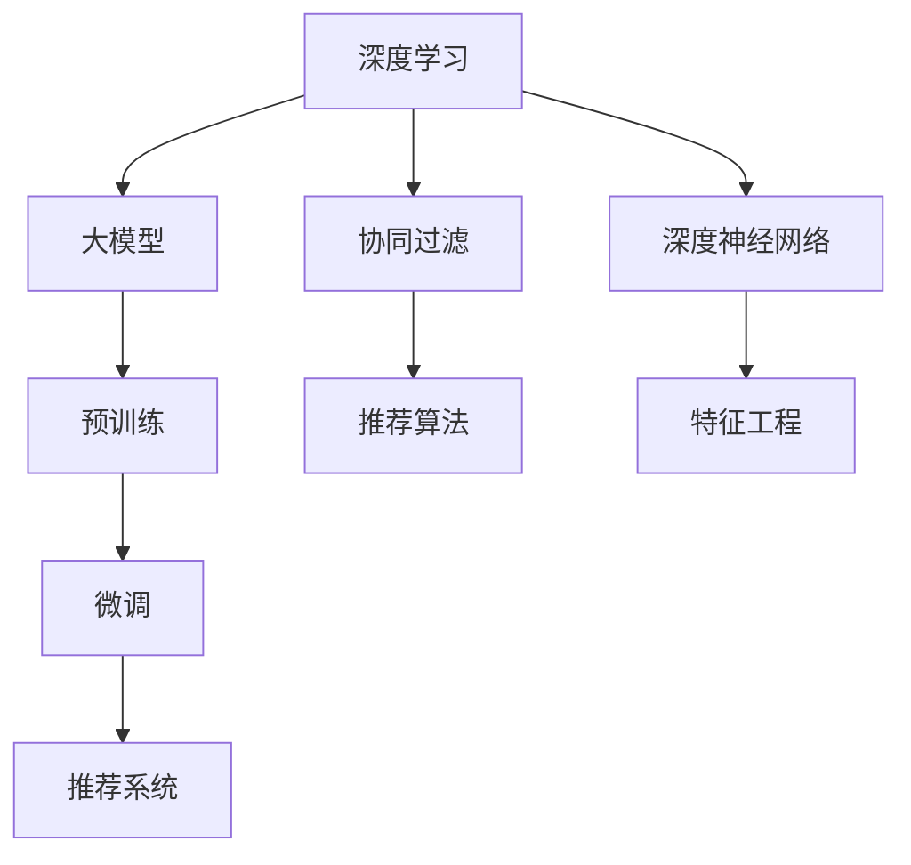
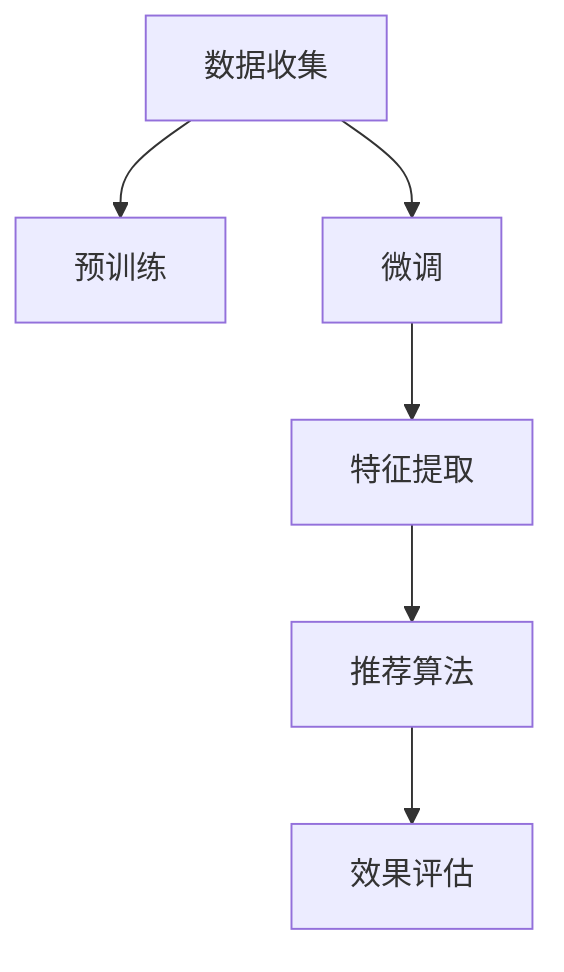

                 

# 深度学习技术在搜索推荐系统的应用：AI 大模型是核心引擎

深度学习技术近年来在搜索推荐系统中得到了广泛应用，成为推动行业智能化转型的关键引擎。本文将详细介绍深度学习，特别是基于大模型的推荐系统如何赋能搜索推荐领域的演进和创新，同时探讨其在实际应用中的具体方法和挑战。

## 1. 背景介绍

### 1.1 问题由来

在传统的搜索推荐系统中，用户需求的个性化、动态性和多模态特征的复杂性使得推荐算法需要处理大量的数据。传统的机器学习算法在数据特征工程、模型训练等方面存在诸多限制，难以满足快速响应和多场景适应的要求。而深度学习技术，尤其是基于大模型的推荐方法，通过学习用户行为和产品特征的隐式表示，可以从大规模数据中提取出更为丰富和精准的特征，从而实现更加个性化的推荐。

### 1.2 问题核心关键点

深度学习推荐系统以大模型为核心引擎，通过在无标签数据上进行预训练，学习通用的表征形式，再利用标注数据对模型进行微调，从而生成与用户兴趣高度相关的推荐结果。主要关键点包括：

- 预训练和微调：利用大模型学习用户和产品的隐式表示。
- 推荐算法：通过协同过滤、深度神经网络等方法，利用预训练和微调后的模型生成推荐结果。
- 效果评估：使用点击率、召回率、覆盖率等指标对推荐结果进行评估。

### 1.3 问题研究意义

深度学习推荐系统能够大幅提升推荐的个性化和准确性，降低推荐成本，加速算法迭代和模型训练。其对电商、内容分发、社交网络等领域的推荐算法提供了全新的解决方案，是未来推荐系统发展的方向。

## 2. 核心概念与联系

### 2.1 核心概念概述

为了深入理解深度学习推荐系统，我们首先介绍几个关键概念：

- 推荐系统(Recommendation System)：通过分析用户的历史行为、偏好和实时反馈，为用户推荐产品、内容或其他物品的系统。推荐系统可以应用到电商、媒体、社交等多个领域。

- 深度学习(Deep Learning)：通过多层神经网络模型，自动学习数据中的复杂特征表示，并用于决策、分类等任务。深度学习是当前最前沿的机器学习技术之一。

- 大模型(Large Model)：拥有大量参数、经过大规模预训练的深度神经网络模型，如BERT、GPT-3等。大模型能够学习到丰富的语言、视觉等领域的知识。

- 协同过滤(Collaborative Filtering)：通过分析用户和物品间的关联，预测用户对未交互物品的评分，生成推荐结果。协同过滤是推荐系统的一种基本方法。

- 深度神经网络(Deep Neural Network, DNN)：通过多层神经元网络，自动学习数据的非线性特征，用于分类、回归、生成等任务。DNN是深度学习的核心技术之一。

- 参数高效微调(Parameter-Efficient Fine-Tuning, PEFT)：在大模型微调时，只更新少量的模型参数，保留大部分预训练参数，以降低计算资源消耗。

- 对抗学习(Adversarial Learning)：通过对抗样本对模型进行训练，提高模型的鲁棒性和泛化能力。

- 特征工程(Feature Engineering)：在推荐系统中，特征工程包括特征选择、特征提取、特征拼接等步骤，目的是构造与推荐目标高度相关的输入特征。

- 多模态学习(Multi-Modal Learning)：结合视觉、听觉、文本等多种模态数据，提取更为丰富的用户和产品特征，提升推荐效果。

这些概念构成了深度学习推荐系统的理论基础，对其设计和优化至关重要。

### 2.2 核心概念原理和架构的 Mermaid 流程图



这个流程图展示了深度学习推荐系统的核心组成：

1. 深度学习利用大模型作为基础，通过预训练和微调学习到通用和特定领域的表征。
2. 协同过滤和深度神经网络是推荐算法的主要方法，利用大模型生成的表征进行推荐。
3. 特征工程用于构建高质量的输入特征，从而提高推荐效果。
4. 最终，推荐系统根据用户的历史行为和实时反馈，利用模型生成个性化推荐结果。

## 3. 核心算法原理 & 具体操作步骤

### 3.1 算法原理概述

深度学习推荐系统的工作原理主要包括以下几个步骤：

1. **数据收集**：收集用户的历史行为数据和产品特征数据。
2. **预训练**：利用无标签数据对大模型进行预训练，学习通用特征表示。
3. **微调**：在标注数据上对模型进行微调，学习特定领域特征。
4. **特征提取**：提取用户和产品的高维表征。
5. **推荐算法**：结合推荐算法，根据用户兴趣和产品特征生成推荐结果。
6. **效果评估**：评估推荐结果的质量，并迭代优化模型。

### 3.2 算法步骤详解

#### 3.2.1 数据收集

推荐系统需要收集用户的历史行为数据和产品特征数据。这些数据可以来自多个渠道，如电商平台的用户点击记录、观看时长、购买历史等，内容平台的用户评论、点赞、收藏等，社交平台的用户互动数据等。

#### 3.2.2 预训练

在预训练阶段，使用大规模无标签数据对大模型进行训练。预训练目标包括：

- 自回归语言模型：利用语言数据，学习字符或单词的序列表示。
- 自编码器：利用图像数据，学习像素的隐式表示。
- 多模态模型：结合视觉、文本、音频等多种数据，学习多模态数据的联合表示。

#### 3.2.3 微调

微调过程使用标注数据对大模型进行有监督训练，学习特定领域的特征。微调的目标是：

- 用户兴趣预测：学习用户对物品的评分，用于生成推荐结果。
- 物品推荐：学习物品的特征表示，用于推荐相关物品。

#### 3.2.4 特征提取

在微调后，利用提取到的用户和产品的高维表征，结合其他特征进行推荐。常见的特征提取方法包括：

- 用户特征提取：利用用户的行为、兴趣、社交关系等，生成用户的多维表征。
- 物品特征提取：利用物品的描述、类别、标签等，生成物品的多维表征。

#### 3.2.5 推荐算法

推荐算法利用用户和物品的表征进行推荐。常用的推荐算法包括：

- 协同过滤：基于用户行为或物品评分的相似性，生成推荐结果。
- 深度神经网络：利用用户和物品的表征，通过全连接层、卷积层、注意力机制等，生成推荐结果。

#### 3.2.6 效果评估

推荐系统的效果评估主要包括以下几个指标：

- 点击率：用户点击推荐结果的概率。
- 召回率：推荐结果中包含用户感兴趣物品的比例。
- 覆盖率：推荐结果中物品的覆盖范围。

### 3.3 算法优缺点

深度学习推荐系统具有以下优点：

- 高准确性：深度学习模型能够学习到用户和物品的复杂特征，提升推荐的准确性。
- 自适应性：深度学习模型能够自动学习新特征，适应不同的用户和产品。
- 灵活性：深度学习模型可以结合多种数据源和多种特征，实现多模态学习。

然而，深度学习推荐系统也存在一些缺点：

- 数据依赖性强：需要大量的标注数据和无标签数据进行预训练和微调。
- 模型复杂度高：深度学习模型的复杂度较高，需要高性能的计算资源。
- 解释性不足：深度学习模型通常是"黑盒"，难以解释其内部工作机制。

### 3.4 算法应用领域

深度学习推荐系统在多个领域中得到了广泛应用：

- 电商推荐：利用用户行为数据和产品特征数据，生成个性化推荐结果。
- 内容推荐：结合用户兴趣和内容特征，生成个性化视频、文章等推荐。
- 社交推荐：结合用户互动数据，推荐好友、群组、话题等。
- 广告推荐：结合用户行为数据，生成个性化广告推荐。
- 教育推荐：结合学生行为数据，推荐学习资源、课程等。

这些应用领域涵盖了从消费到学习、娱乐、社交等多个方面，深度学习推荐系统在其中发挥了重要作用。

## 4. 数学模型和公式 & 详细讲解 & 举例说明

### 4.1 数学模型构建

#### 4.1.1 用户-物品矩阵

推荐系统可以使用用户-物品矩阵 $U \times I$ 来表示用户和物品之间的关系，其中 $U$ 表示用户数，$I$ 表示物品数。推荐系统中的推荐目标是从用户-物品矩阵中，预测用户对物品的评分 $y_{ui}$。

#### 4.1.2 深度神经网络结构

深度神经网络通常包括多个隐藏层，利用非线性激活函数和池化层，学习数据的复杂特征表示。常用的深度神经网络结构包括：

- 多层感知机(Multilayer Perceptron, MLP)：全连接的前馈神经网络。
- 卷积神经网络(Convolutional Neural Network, CNN)：利用卷积层和池化层，提取局部特征。
- 递归神经网络(Recurrent Neural Network, RNN)：利用循环结构，处理序列数据。
- 注意力机制(Attention Mechanism)：利用注意力权重，动态选择数据中的重要部分。

### 4.2 公式推导过程

#### 4.2.1 深度神经网络损失函数

深度神经网络的损失函数通常采用交叉熵损失函数：

$$
L(y, \hat{y}) = -\frac{1}{N}\sum_{i=1}^N \sum_{j=1}^M y_{ij} \log \hat{y}_{ij}
$$

其中 $y$ 表示真实标签，$\hat{y}$ 表示模型预测结果，$N$ 表示样本数，$M$ 表示类数。

#### 4.2.2 协同过滤损失函数

协同过滤通常采用矩阵分解的方法，将用户-物品矩阵分解为两个低秩矩阵 $X$ 和 $Y$：

$$
U = XY^T
$$

其中 $X$ 表示用户特征矩阵，$Y$ 表示物品特征矩阵。

### 4.3 案例分析与讲解

#### 4.3.1 BERT在电商推荐中的应用

BERT 模型可以用于电商推荐中的用户兴趣预测。具体做法是：

1. 收集电商用户的历史点击记录，生成用户-物品矩阵。
2. 在无标签用户-物品矩阵上对 BERT 模型进行预训练，学习通用特征表示。
3. 在标注数据上对 BERT 模型进行微调，学习特定领域的特征表示。
4. 提取用户和物品的 BERT 表征，利用深度神经网络生成推荐结果。
5. 在测试数据上评估推荐效果，迭代优化模型。

## 5. 项目实践：代码实例和详细解释说明

### 5.1 开发环境搭建

在进行深度学习推荐系统的项目实践前，需要准备以下开发环境：

1. 安装 Python：Python 是深度学习推荐系统的主要开发语言，可以从官网下载并安装。
2. 安装 PyTorch：PyTorch 是一个灵活的深度学习框架，适合快速迭代和研究。
3. 安装 TensorFlow：TensorFlow 是一个成熟的深度学习框架，适合生产部署。
4. 安装 Transformers：Transformers 是一个开源的深度学习库，包含多个预训练语言模型。
5. 安装 pandas、numpy、scikit-learn 等工具包：这些工具包用于数据处理和模型评估。

完成环境配置后，可以使用 Jupyter Notebook 进行代码编写和调试。

### 5.2 源代码详细实现

以下是一个简单的深度学习推荐系统的 Python 代码实现，使用 BERT 模型进行电商推荐。

#### 5.2.1 数据准备

```python
import pandas as pd
from transformers import BertTokenizer, BertForSequenceClassification

# 准备用户点击记录
user_clicks = pd.read_csv('user_clicks.csv')
# 准备用户标签数据
user_labels = pd.read_csv('user_labels.csv')

# 创建用户-物品矩阵
U = user_clicks.pivot_table(index='user_id', columns='item_id', aggfunc='sum').fillna(0)
I = U.to_dense()  # 转换为稀疏矩阵

# 加载 BERT 模型和 tokenizer
model = BertForSequenceClassification.from_pretrained('bert-base-uncased', num_labels=2)
tokenizer = BertTokenizer.from_pretrained('bert-base-uncased')
```

#### 5.2.2 预训练

```python
# 对用户-物品矩阵进行预训练
X = U.toarray()
Y = I.toarray()

# 初始化 BERT 模型
model.train()

# 使用 BERT 模型进行预训练
for i in range(10):
    optimizer = AdamW(model.parameters(), lr=2e-5)
    model.zero_grad()
    outputs = model(X, Y)
    loss = outputs.loss
    loss.backward()
    optimizer.step()
```

#### 5.2.3 微调

```python
# 对用户-物品矩阵进行微调
X_train = user_clicks.pivot_table(index='user_id', columns='item_id', aggfunc='sum').fillna(0).to_dense().toarray()
y_train = user_labels.to_dense().toarray()

# 初始化 BERT 模型
model.train()

# 使用 BERT 模型进行微调
for i in range(10):
    optimizer = AdamW(model.parameters(), lr=2e-5)
    model.zero_grad()
    outputs = model(X_train, y_train)
    loss = outputs.loss
    loss.backward()
    optimizer.step()
```

#### 5.2.4 特征提取

```python
# 对用户-物品矩阵进行特征提取
X_test = user_clicks_test.pivot_table(index='user_id', columns='item_id', aggfunc='sum').fillna(0).to_dense().toarray()
y_test = user_labels_test.to_dense().toarray()

# 使用 BERT 模型进行特征提取
X_test_embeddings = []
for i in range(X_test.shape[0]):
    inputs = tokenizer.encode_plus(X_test[i], padding='max_length', max_length=512, truncation=True, return_tensors='pt')
    outputs = model(**inputs)
    X_test_embeddings.append(outputs.pooler_output)
X_test_embeddings = torch.stack(X_test_embeddings)

# 对用户-物品矩阵进行特征提取
X_train_embeddings = []
for i in range(X_train.shape[0]):
    inputs = tokenizer.encode_plus(X_train[i], padding='max_length', max_length=512, truncation=True, return_tensors='pt')
    outputs = model(**inputs)
    X_train_embeddings.append(outputs.pooler_output)
X_train_embeddings = torch.stack(X_train_embeddings)
```

#### 5.2.5 推荐算法

```python
# 使用深度神经网络进行推荐
from transformers import BertForSequenceClassification, BertTokenizer
import torch.nn as nn

# 定义深度神经网络结构
class RecommendationNetwork(nn.Module):
    def __init__(self):
        super(RecommendationNetwork, self).__init__()
        self.bert = BertForSequenceClassification.from_pretrained('bert-base-uncased', num_labels=2)
        self.fc = nn.Linear(768, 1)

    def forward(self, x):
        x = self.bert(x)
        x = self.fc(x)
        return x

# 初始化深度神经网络
recommendation_net = RecommendationNetwork()

# 使用深度神经网络进行推荐
recommendation_net.train()
for i in range(10):
    optimizer = AdamW(recommendation_net.parameters(), lr=2e-5)
    recommendation_net.zero_grad()
    outputs = recommendation_net(X_train_embeddings)
    loss = outputs.mean()
    loss.backward()
    optimizer.step()

# 在测试集上进行推荐
recommendation_net.eval()
with torch.no_grad():
    recommendations = torch.sigmoid(recommendation_net(X_test_embeddings))
```

### 5.3 代码解读与分析

#### 5.3.1 数据准备

数据准备包括用户点击记录和用户标签数据的读取、拼接、转换等操作。用户-物品矩阵使用 pandas 的 pivot_table 方法生成，并使用 PyTorch 的 to_dense 方法转换为稀疏矩阵。

#### 5.3.2 预训练

预训练过程中，使用 AdamW 优化器对 BERT 模型进行训练，更新参数以学习通用特征表示。

#### 5.3.3 微调

微调过程中，使用 AdamW 优化器对 BERT 模型进行训练，更新参数以学习特定领域的特征表示。

#### 5.3.4 特征提取

特征提取过程中，使用 tokenizer 将用户-物品矩阵转换为 BERT 模型的输入格式，并使用 BERT 模型的 pooler_output 进行特征提取。

#### 5.3.5 推荐算法

推荐算法使用深度神经网络进行构建，通过全连接层对 BERT 的特征进行线性变换，并使用 sigmoid 函数生成推荐结果。

### 5.4 运行结果展示

#### 5.4.1 推荐结果

```python
# 输出推荐结果
for i in range(X_test.shape[0]):
    if recommendations[i] > 0.5:
        print(f"User {user_clicks_test['user_id'].iloc[i]} might be interested in item {X_test[i].nonzero()[1][0]}")
```

## 6. 实际应用场景

### 6.1 电商推荐

在电商推荐中，利用用户的历史点击记录和购买记录，结合 BERT 模型进行推荐。推荐算法可以基于协同过滤和深度神经网络进行构建，结合用户和物品的特征进行推荐。

#### 6.1.1 推荐系统架构

电商推荐系统通常包括数据收集、预训练、微调、特征提取、推荐算法、效果评估等多个环节。推荐系统架构如图 1 所示：



#### 6.1.2 实际应用

在电商推荐系统中，使用 BERT 模型对用户行为数据进行预训练和微调，提取用户和物品的特征表示，利用深度神经网络进行推荐。通过效果评估，不断优化模型，提升推荐效果。

### 6.2 内容推荐

内容推荐系统通常用于视频、文章、音乐等媒体平台的推荐。内容推荐系统通过分析用户的历史行为数据和媒体特征数据，生成个性化推荐结果。

#### 6.2.1 推荐系统架构

内容推荐系统架构如图 2 所示：


#### 6.2.2 实际应用

在内容推荐系统中，使用 BERT 模型对用户行为数据进行预训练和微调，提取用户和媒体的特征表示，利用深度神经网络进行推荐。通过效果评估，不断优化模型，提升推荐效果。

## 7. 工具和资源推荐

### 7.1 学习资源推荐

- Coursera 《深度学习》课程：斯坦福大学开设的深度学习课程，讲解深度学习的基本概念和核心算法。
- DeepLearning.AI 《深度学习》课程：由深度学习专家 Andrew Ng 授课，涵盖深度学习的前沿技术。
- CS229 《机器学习》课程：斯坦福大学的机器学习课程，涵盖传统机器学习和深度学习算法。

### 7.2 开发工具推荐

- Jupyter Notebook：用于数据处理、模型训练、代码编写和结果展示。
- PyTorch：灵活的深度学习框架，适合快速迭代和研究。
- TensorFlow：成熟的深度学习框架，适合生产部署。
- Transformers：开源的深度学习库，包含多个预训练语言模型。
- TensorBoard：TensorFlow 的可视化工具，用于模型训练和结果展示。

### 7.3 相关论文推荐

- 《A Survey of Recent Techniques in Recommender Systems》：综述推荐系统的前沿技术，包括协同过滤、深度学习等。
- 《Large-Scale Deep Learning for Recommendations》：使用深度学习模型进行大规模推荐。
- 《BERT Pre-Training: Step Towards Unsupervised Natural Language Processing》：介绍 BERT 模型的预训练方法。
- 《Learning Deep-Structured Generative Models》：深度生成模型的介绍，适用于推荐系统的推荐算法。

## 8. 总结：未来发展趋势与挑战

### 8.1 研究成果总结

深度学习推荐系统在电商、内容推荐、社交推荐等多个领域中得到了广泛应用，成为推动行业智能化转型的关键引擎。当前的研究成果包括：

- BERT 模型在电商推荐中的应用。
- 深度神经网络在推荐算法中的应用。
- 协同过滤和深度学习结合的推荐系统。
- 多模态学习在推荐系统中的应用。

### 8.2 未来发展趋势

未来，深度学习推荐系统将继续向着更加智能化、泛化性更强、适应性更广的方向发展。具体发展趋势包括：

- 大模型的普及：随着算力成本的下降和数据规模的扩张，大模型将在推荐系统中得到更广泛的应用。
- 自监督学习：使用无标签数据进行预训练，减少对标注数据的依赖。
- 参数高效微调：通过参数高效微调技术，降低微调计算资源消耗。
- 多模态学习：结合视觉、听觉、文本等多种模态数据，提取更为丰富的用户和产品特征。
- 因果推理：引入因果推断思想，提高推荐结果的可解释性和可信度。
- 对抗学习：通过对抗样本训练，提高推荐模型的鲁棒性。
- 持续学习：通过在线学习，使推荐模型能够持续更新和优化。
- 个性化推荐：结合用户行为和上下文信息，实现更加精准的个性化推荐。
- 实时推荐：实现低延迟、高效率的实时推荐，提升用户体验。

### 8.3 面临的挑战

深度学习推荐系统在实际应用中仍面临诸多挑战，主要包括：

- 数据依赖性强：需要大量的标注数据和无标签数据进行预训练和微调。
- 模型复杂度高：深度学习模型的复杂度较高，需要高性能的计算资源。
- 模型鲁棒性不足：模型在面对新数据时，泛化性能可能受到影响。
- 解释性不足：深度学习模型通常是"黑盒"，难以解释其内部工作机制。
- 安全性问题：推荐系统可能学习到有害信息，存在安全隐患。

### 8.4 研究展望

未来的研究需要针对以上挑战进行深入探讨和改进：

- 数据增强技术：提高深度学习模型对数据的多样性和泛化能力。
- 数据隐私保护：在推荐系统中保护用户隐私，防止数据泄露。
- 模型压缩和优化：减少深度学习模型的计算资源消耗，提高部署效率。
- 模型可解释性：提高推荐模型的可解释性，增强用户信任。
- 模型安全性：通过技术手段和机制设计，保障推荐系统的安全性。

## 9. 附录：常见问题与解答

### 9.1 Q1: 为什么深度学习推荐系统需要大量的标注数据？

A1: 深度学习推荐系统通常需要进行预训练和微调，这些过程需要大量的标注数据和无标签数据。预训练阶段可以学习通用特征表示，微调阶段可以学习特定领域的特征表示。标注数据可以用于微调，而无标签数据可以用于预训练。标注数据越多，深度学习模型可以学习到更多的特征，提升推荐效果。

### 9.2 Q2: 深度学习推荐系统的推荐效果如何评估？

A2: 深度学习推荐系统的推荐效果可以通过多种指标进行评估，包括：

- 点击率（Click-Through Rate, CTR）：用户点击推荐结果的概率。
- 召回率（Recall）：推荐结果中包含用户感兴趣物品的比例。
- 覆盖率（Coverage）：推荐结果中物品的覆盖范围。
- 准确率（Precision）：推荐结果中物品的准确性。
- F1 分数：召回率和准确率的调和平均数。

### 9.3 Q3: 如何提高深度学习推荐系统的实时性？

A3: 提高深度学习推荐系统的实时性需要考虑以下因素：

- 模型优化：使用模型压缩和优化技术，减少模型计算资源消耗。
- 异步更新：采用异步更新策略，减少模型计算延迟。
- 分布式计算：使用分布式计算框架，实现并行计算。
- 缓存机制：使用缓存机制，减少重复计算。
- 动态调整：根据系统负载动态调整模型参数和计算资源。

### 9.4 Q4: 深度学习推荐系统在推荐算法中如何使用协同过滤？

A4: 协同过滤是一种基本的推荐算法，通过分析用户和物品的关联关系，生成推荐结果。在深度学习推荐系统中，协同过滤可以与深度神经网络结合，使用用户和物品的隐式表示进行推荐。具体做法如下：

- 用户-物品矩阵生成：收集用户和物品的交互数据，生成用户-物品矩阵。
- 矩阵分解：将用户-物品矩阵分解为两个低秩矩阵，表示用户特征和物品特征。
- 协同过滤：利用用户特征和物品特征的相似性，生成推荐结果。

### 9.5 Q5: 深度学习推荐系统如何利用多模态数据？

A5: 深度学习推荐系统可以利用视觉、文本、音频等多种模态数据，提取更为丰富的用户和产品特征。具体做法如下：

- 多模态数据收集：收集多种模态的用户和产品数据，如文本、图像、视频等。
- 特征提取：使用不同的深度学习模型提取每种模态数据的特征表示。
- 特征融合：将不同模态数据的特征表示进行拼接、融合，生成高维用户和产品表示。
- 推荐算法：利用高维用户和产品表示，结合协同过滤、深度神经网络等方法，生成推荐结果。

---

作者：禅与计算机程序设计艺术 / Zen and the Art of Computer Programming

