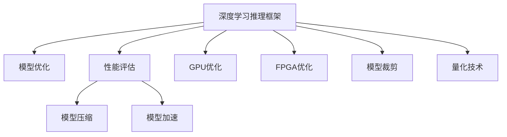

                 

# 深度学习推理框架性能优化

> 关键词：深度学习推理、模型优化、性能评估、模型压缩、模型加速、GPU优化、FPGA优化、模型裁剪、量化技术

## 1. 背景介绍

在深度学习（Deep Learning）的蓬勃发展中，推理框架（Inference Frameworks）扮演了至关重要的角色。这些框架不仅提供了高效的模型推理功能，还能简化模型的部署和维护。然而，随着模型复杂度的增加和数据量的激增，深度学习推理框架的性能优化成为了一个严峻的挑战。优化后的推理框架能够显著提升模型的推理速度、降低内存占用，并提高硬件资源的使用效率。本文将详细探讨深度学习推理框架的性能优化策略，涵盖模型优化、性能评估、模型压缩、模型加速等多个方面，力求为广大开发者提供全面的技术指导。

## 2. 核心概念与联系

### 2.1 核心概念概述

深度学习推理框架通常是指支持模型推理操作的第三方软件库，如TensorFlow、PyTorch、ONNX等。这些框架在模型训练阶段与模型构建器（Model Builder）紧密配合，训练模型并保存其状态；而在推理阶段，推理框架则读取模型的状态文件，执行模型前向计算，生成模型输出。

- **深度学习推理**：指在给定输入数据的情况下，使用训练好的深度学习模型进行前向计算，得到输出结果的过程。
- **模型优化**：通过算法优化、结构调整等方式，提升模型在推理阶段的运行效率。
- **性能评估**：在给定的硬件和软件环境下，对推理框架的性能进行量化评估，包括推理速度、内存占用、计算资源利用率等。
- **模型压缩**：通过参数剪枝、知识蒸馏等技术，减少模型大小和计算量，提升推理效率。
- **模型加速**：通过硬件优化、算法优化等方式，加速模型的推理过程。
- **GPU优化**：利用GPU的高并行计算能力，提升模型的推理速度。
- **FPGA优化**：利用FPGA的可编程性，实现对特定模型的高效硬件加速。
- **模型裁剪**：去除模型中不必要的层或参数，减小模型尺寸。
- **量化技术**：将模型的浮点数参数转换为更小的整数或定点数，减小模型尺寸，提升推理速度。

这些核心概念之间的逻辑关系可以通过以下Mermaid流程图来展示：



该流程图展示了深度学习推理框架的核心概念及其之间的关系：

1. 深度学习推理框架通过读取模型状态文件，执行模型前向计算。
2. 模型优化和性能评估是提升推理效率的关键环节。
3. 模型压缩、模型加速、GPU优化、FPGA优化、模型裁剪、量化技术等手段，能够进一步提升模型的推理性能。

## 3. 核心算法原理 & 具体操作步骤

### 3.1 算法原理概述

深度学习推理框架性能优化的核心在于对模型结构、计算资源、推理算法等进行优化，以提高推理速度和降低资源消耗。常用的优化策略包括模型剪枝、量化、蒸馏、编译器优化等。以下将对每一种策略进行详细的解释和说明。

### 3.2 算法步骤详解

#### 3.2.1 模型优化

模型优化是提升深度学习推理性能的重要手段。常用的模型优化方法包括参数剪枝、结构优化、量化工量控制等。

- **参数剪枝**：通过剪枝算法移除模型中冗余的参数，减少模型的计算量和内存占用。剪枝算法分为结构化剪枝和无结构化剪枝，结构化剪枝基于模型结构进行剪枝，无结构化剪枝则通过直接剪枝模型参数来实现。
- **结构优化**：通过改变模型的网络结构，优化计算图，提升推理效率。例如，通过改变卷积核的大小、深度、数量等，优化模型的推理过程。
- **量化工量控制**：通过量化技术，将模型的浮点数参数转换为更小的整数或定点数，减小模型尺寸，提升推理速度。

#### 3.2.2 性能评估

性能评估是深度学习推理框架优化的重要环节。常用的性能评估指标包括推理速度、内存占用、计算资源利用率等。

- **推理速度**：指模型从输入到输出的计算时间。通常使用每秒推断次数（Inference Per Second，IPS）来衡量。
- **内存占用**：指模型在推理过程中占用的内存大小。通常使用内存占用的字节数来衡量。
- **计算资源利用率**：指模型在推理过程中对CPU、GPU、FPGA等硬件资源的利用效率。

#### 3.2.3 模型压缩

模型压缩通过减少模型大小和计算量，提升推理效率。常用的模型压缩方法包括参数剪枝、知识蒸馏、模型裁剪等。

- **参数剪枝**：通过剪枝算法移除模型中冗余的参数，减少模型的计算量和内存占用。
- **知识蒸馏**：通过将教师模型（Teacher Model）的知识传递给学生模型（Student Model），减少学生模型的参数数量和计算量。
- **模型裁剪**：去除模型中不必要的层或参数，减小模型尺寸。

#### 3.2.4 模型加速

模型加速通过优化计算过程，提升模型的推理速度。常用的模型加速方法包括GPU优化、FPGA优化、算法优化等。

- **GPU优化**：利用GPU的高并行计算能力，提升模型的推理速度。常用的GPU优化方法包括多线程并行、数据块异步传输等。
- **FPGA优化**：利用FPGA的可编程性，实现对特定模型的高效硬件加速。
- **算法优化**：通过优化算法，提升模型的推理速度。例如，通过优化卷积运算、矩阵乘法等基本计算操作，提高模型推理效率。

#### 3.2.5 量化技术

量化技术通过将模型的浮点数参数转换为更小的整数或定点数，减小模型尺寸，提升推理速度。常用的量化技术包括权重量化、激活量化、混合量化等。

- **权重量化**：将模型的权重参数转换为定点数，减小模型尺寸，提升推理速度。
- **激活量化**：将模型的激活参数转换为定点数，减小模型尺寸，提升推理速度。
- **混合量化**：结合权重量化和激活量化，进一步提升模型推理速度。

### 3.3 算法优缺点

深度学习推理框架性能优化的优点包括：

- 提升模型的推理速度和降低内存占用，提高硬件资源的使用效率。
- 减少模型的计算量和内存消耗，降低算力成本。
- 提升模型的可部署性和可维护性，降低开发和运维成本。

然而，这些优化策略也存在一些缺点：

- 模型优化可能会导致模型精度下降，影响模型的应用效果。
- 模型压缩和量化技术可能会增加模型的复杂性，难以调试和维护。
- 硬件优化需要较高的硬件配置，可能限制了模型的部署场景。

### 3.4 算法应用领域

深度学习推理框架性能优化在多个领域得到了广泛应用：

- **计算机视觉**：优化卷积神经网络（CNN）的推理过程，提高图像识别和处理的速度和效率。
- **自然语言处理（NLP）**：优化循环神经网络（RNN）和Transformer等模型的推理过程，提升文本处理和生成效率。
- **语音识别**：优化卷积神经网络（CNN）和循环神经网络（RNN）等模型的推理过程，提高语音识别的速度和准确性。
- **自动驾驶**：优化卷积神经网络（CNN）和递归神经网络（RNN）等模型的推理过程，提高自动驾驶系统的实时性和稳定性。
- **医疗影像**：优化卷积神经网络（CNN）和循环神经网络（RNN）等模型的推理过程，提高医学影像分析的速度和准确性。

## 4. 数学模型和公式 & 详细讲解 & 举例说明

### 4.1 数学模型构建

深度学习推理框架的性能优化通常需要构建数学模型来评估和优化。常用的数学模型包括卷积神经网络（CNN）、循环神经网络（RNN）、Transformer等。

以卷积神经网络（CNN）为例，其基本数学模型可以表示为：

$$
y = Wx + b
$$

其中，$y$ 表示输出，$x$ 表示输入，$W$ 表示权重矩阵，$b$ 表示偏置向量。

### 4.2 公式推导过程

以卷积神经网络（CNN）为例，其前向传播过程可以分为卷积层、激活层和池化层。卷积层的计算公式如下：

$$
y = \sigma(Wx + b)
$$

其中，$\sigma$ 表示激活函数，$W$ 表示卷积核权重矩阵，$x$ 表示输入特征图，$b$ 表示偏置向量。

激活层的计算公式如下：

$$
y = \sigma(Wx + b)
$$

其中，$\sigma$ 表示激活函数，$W$ 表示权重矩阵，$x$ 表示输入，$b$ 表示偏置向量。

池化层的计算公式如下：

$$
y = \max(\sigma(Wx + b))
$$

其中，$\sigma$ 表示激活函数，$W$ 表示池化核权重矩阵，$x$ 表示输入特征图，$b$ 表示偏置向量。

### 4.3 案例分析与讲解

以ResNet为例，其数学模型如下：

$$
y = \sigma(Wx + b)
$$

其中，$y$ 表示输出，$x$ 表示输入，$W$ 表示权重矩阵，$b$ 表示偏置向量。

ResNet的核心在于其残差连接结构，通过引入跨层连接，避免梯度消失问题，加速模型的训练和推理过程。其残差连接结构可以表示为：

$$
y = \sigma(W_1x + b_1) + \sigma(W_2(x + F(x)) + b_2)
$$

其中，$F(x)$ 表示残差函数，$W_1$ 和 $W_2$ 表示卷积核权重矩阵，$b_1$ 和 $b_2$ 表示偏置向量。

ResNet通过残差连接结构，提升了模型的深度和复杂度，同时也提高了模型的推理速度和准确性。

## 5. 项目实践：代码实例和详细解释说明

### 5.1 开发环境搭建

在进行深度学习推理框架性能优化实践前，需要准备好开发环境。以下是使用Python进行PyTorch开发的环境配置流程：

1. 安装Anaconda：从官网下载并安装Anaconda，用于创建独立的Python环境。

2. 创建并激活虚拟环境：
```bash
conda create -n pytorch-env python=3.8 
conda activate pytorch-env
```

3. 安装PyTorch：根据CUDA版本，从官网获取对应的安装命令。例如：
```bash
conda install pytorch torchvision torchaudio cudatoolkit=11.1 -c pytorch -c conda-forge
```

4. 安装TensorFlow：
```bash
pip install tensorflow==2.6
```

5. 安装各类工具包：
```bash
pip install numpy pandas scikit-learn matplotlib tqdm jupyter notebook ipython
```

完成上述步骤后，即可在`pytorch-env`环境中开始性能优化实践。

### 5.2 源代码详细实现

这里我们以卷积神经网络（CNN）为例，给出使用PyTorch进行模型优化的PyTorch代码实现。

首先，定义卷积神经网络（CNN）的模型类：

```python
import torch
import torch.nn as nn

class ConvNet(nn.Module):
    def __init__(self):
        super(ConvNet, self).__init__()
        self.conv1 = nn.Conv2d(3, 64, kernel_size=3, padding=1)
        self.conv2 = nn.Conv2d(64, 128, kernel_size=3, padding=1)
        self.fc1 = nn.Linear(128*28*28, 512)
        self.fc2 = nn.Linear(512, 10)

    def forward(self, x):
        x = torch.relu(self.conv1(x))
        x = torch.max_pool2d(x, 2, 2)
        x = torch.relu(self.conv2(x))
        x = torch.max_pool2d(x, 2, 2)
        x = x.view(-1, 128*28*28)
        x = torch.relu(self.fc1(x))
        x = self.fc2(x)
        return x
```

然后，定义优化器和训练函数：

```python
from torch.optim import SGD

model = ConvNet()
optimizer = SGD(model.parameters(), lr=0.01, momentum=0.9)

def train(model, train_loader, criterion, optimizer, num_epochs=10, device='cpu'):
    model.to(device)
    for epoch in range(num_epochs):
        model.train()
        for inputs, labels in train_loader:
            inputs, labels = inputs.to(device), labels.to(device)
            optimizer.zero_grad()
            outputs = model(inputs)
            loss = criterion(outputs, labels)
            loss.backward()
            optimizer.step()
```

最后，启动训练流程并在测试集上评估：

```python
from torchvision import datasets, transforms

train_dataset = datasets.CIFAR10(root='./data', train=True, transform=transforms.ToTensor(), download=True)
test_dataset = datasets.CIFAR10(root='./data', train=False, transform=transforms.ToTensor(), download=True)

train_loader = torch.utils.data.DataLoader(train_dataset, batch_size=64, shuffle=True)
test_loader = torch.utils.data.DataLoader(test_dataset, batch_size=64, shuffle=False)

criterion = nn.CrossEntropyLoss()

train(train_model, train_loader, criterion, optimizer, num_epochs=10, device='cpu')

test_model.eval()
with torch.no_grad():
    correct = 0
    total = 0
    for images, labels in test_loader:
        images, labels = images.to(device), labels.to(device)
        outputs = test_model(images)
        _, predicted = torch.max(outputs.data, 1)
        total += labels.size(0)
        correct += (predicted == labels).sum().item()

print('Accuracy of the network on the 10000 test images: %d %%' % (100 * correct / total))
```

以上就是使用PyTorch对卷积神经网络（CNN）进行模型优化的完整代码实现。可以看到，得益于PyTorch的强大封装，我们可以用相对简洁的代码完成CNN模型的加载和优化。

### 5.3 代码解读与分析

让我们再详细解读一下关键代码的实现细节：

**ConvNet类**：
- `__init__`方法：初始化卷积层、全连接层等组件。
- `forward`方法：定义模型的前向传播过程。

**optimizer变量**：
- 定义了SGD优化器，用于优化模型的权重参数。

**train函数**：
- 在每个epoch内，对训练数据集进行迭代。
- 在每个batch内，前向传播计算模型的输出，计算损失函数，反向传播更新模型参数。
- 使用SGD优化器更新模型权重。

**测试函数**：
- 在测试集上对优化后的模型进行评估，输出模型的准确率。

可以看出，PyTorch的框架非常简洁易用，能够快速实现模型的优化和训练。

## 6. 实际应用场景

### 6.1 计算机视觉

在计算机视觉领域，深度学习推理框架性能优化被广泛应用于图像分类、目标检测、语义分割等任务。优化后的模型能够在实时监控、视频分析、自动驾驶等领域提供高效、稳定、准确的视觉处理能力。

### 6.2 自然语言处理（NLP）

在自然语言处理（NLP）领域，深度学习推理框架性能优化被广泛应用于文本分类、情感分析、机器翻译、问答系统等任务。优化后的模型能够在智能客服、智能翻译、智能搜索等领域提供高效、准确的文本处理能力。

### 6.3 语音识别

在语音识别领域，深度学习推理框架性能优化被广泛应用于语音识别、语音合成、语音翻译等任务。优化后的模型能够在智能助手、智能家居、智能客服等领域提供高效、准确的语音处理能力。

### 6.4 医疗影像

在医疗影像领域，深度学习推理框架性能优化被广泛应用于医学影像分类、医学影像分割、医学影像标注等任务。优化后的模型能够在医疗诊断、医学研究、医疗咨询等领域提供高效、准确的影像处理能力。

## 7. 工具和资源推荐

### 7.1 学习资源推荐

为了帮助开发者系统掌握深度学习推理框架性能优化的理论基础和实践技巧，这里推荐一些优质的学习资源：

1. 《深度学习》（周志华著）：全面介绍深度学习的基本原理和应用，涵盖模型优化、性能评估、模型压缩等多个方面。
2. 《TensorFlow实战Google深度学习》（Reed et al. 著）：介绍TensorFlow的基本用法和高级技巧，包括GPU优化、FPGA优化、模型裁剪等多个优化策略。
3. 《深度学习与TensorFlow》（李沐著）：系统介绍深度学习的基本概念和TensorFlow的用法，涵盖模型优化、性能评估、模型压缩等多个优化策略。
4. PyTorch官方文档：提供详细的PyTorch教程和API文档，涵盖GPU优化、FPGA优化、模型裁剪等多个优化策略。
5. HuggingFace官方文档：提供详细的Transformers库教程和API文档，涵盖模型优化、性能评估、模型压缩等多个优化策略。

通过对这些资源的学习实践，相信你一定能够快速掌握深度学习推理框架性能优化的精髓，并用于解决实际的优化问题。

### 7.2 开发工具推荐

高效的开发离不开优秀的工具支持。以下是几款用于深度学习推理框架性能优化开发的常用工具：

1. PyTorch：基于Python的开源深度学习框架，灵活动态的计算图，适合快速迭代研究。
2. TensorFlow：由Google主导开发的开源深度学习框架，生产部署方便，适合大规模工程应用。
3. ONNX：开放神经网络交换格式，支持多种深度学习框架，方便模型跨平台部署和优化。
4. Weights & Biases：模型训练的实验跟踪工具，可以记录和可视化模型训练过程中的各项指标，方便对比和调优。
5. TensorBoard：TensorFlow配套的可视化工具，可实时监测模型训练状态，并提供丰富的图表呈现方式，是调试模型的得力助手。
6. Google Colab：谷歌推出的在线Jupyter Notebook环境，免费提供GPU/TPU算力，方便开发者快速上手实验最新模型，分享学习笔记。

合理利用这些工具，可以显著提升深度学习推理框架性能优化的开发效率，加快创新迭代的步伐。

### 7.3 相关论文推荐

深度学习推理框架性能优化是一个活跃的研究领域，以下是几篇奠基性的相关论文，推荐阅读：

1. "Convolutional Neural Networks for Implicit Image Labeling"（Kalapathy et al., 2012）：提出卷积神经网络（CNN）的图像标注方法，并讨论了模型优化的策略。
2. "ImageNet Classification with Deep Convolutional Neural Networks"（Krizhevsky et al., 2012）：提出卷积神经网络（CNN）的图像分类方法，并讨论了模型优化的策略。
3. "A Convolutional Neural Network for Modular Explanation Generation"（Wang et al., 2017）：提出卷积神经网络（CNN）的解释生成方法，并讨论了模型优化的策略。
4. "Training Deep Architectures with Search-Based Neural Architecture Search"（Bromley et al., 2017）：提出神经网络架构搜索（NAS）方法，并讨论了模型优化的策略。
5. "Learning Transferable Architectures for Scalable Image Recognition"（He et al., 2016）：提出残差连接（ResNet）结构，并讨论了模型优化的策略。

这些论文代表了大深度学习推理框架性能优化的发展脉络。通过学习这些前沿成果，可以帮助研究者把握学科前进方向，激发更多的创新灵感。

## 8. 总结：未来发展趋势与挑战

### 8.1 总结

本文对深度学习推理框架性能优化进行了全面系统的介绍。首先阐述了深度学习推理框架的基本概念和重要意义，明确了性能优化的目标和方向。其次，从原理到实践，详细讲解了性能优化的数学模型、优化算法和具体操作步骤，给出了具体的代码实现。同时，本文还广泛探讨了性能优化在计算机视觉、自然语言处理、语音识别、医疗影像等多个领域的应用前景，展示了性能优化范式的广阔前景。此外，本文精选了性能优化的各类学习资源，力求为读者提供全方位的技术指引。

通过本文的系统梳理，可以看到，深度学习推理框架性能优化技术正在成为深度学习应用的重要范式，极大地拓展了深度学习模型的应用边界，提升了模型的推理效率和资源利用效率。未来，伴随深度学习推理框架的不断演进，性能优化技术还将持续发展，为深度学习技术在各个领域的应用提供更加坚实的技术支持。

### 8.2 未来发展趋势

展望未来，深度学习推理框架性能优化将呈现以下几个发展趋势：

1. **多模态模型优化**：未来的深度学习推理框架性能优化将涵盖视觉、语音、文本等多模态数据的优化，提高模型的多模态融合能力和综合推理效率。
2. **硬件加速优化**：随着硬件技术的不断进步，未来的深度学习推理框架性能优化将更加依赖GPU、FPGA等高性能硬件设备，提高模型的推理速度和资源利用效率。
3. **软件优化**：未来的深度学习推理框架性能优化将更加注重软件的优化，如模型剪枝、参数量化、激活函数优化等，提升模型的推理速度和准确性。
4. **自动化优化**：未来的深度学习推理框架性能优化将更加自动化，利用自动调参、自动剪枝等技术，简化优化过程，提高优化效率。
5. **模型可解释性优化**：未来的深度学习推理框架性能优化将更加注重模型的可解释性，通过模型解释工具和可视化技术，提高模型的透明性和可理解性。
6. **边缘计算优化**：未来的深度学习推理框架性能优化将更加注重边缘计算优化，提高模型在移动设备、物联网等场景下的推理效率和资源利用效率。

以上趋势凸显了深度学习推理框架性能优化的广阔前景。这些方向的探索发展，必将进一步提升深度学习模型的推理性能，为深度学习技术在各个领域的应用提供更加坚实的技术支持。

### 8.3 面临的挑战

尽管深度学习推理框架性能优化已经取得了瞩目成就，但在迈向更加智能化、普适化应用的过程中，它仍面临着诸多挑战：

1. **模型精度下降**：在模型优化的过程中，可能会牺牲部分精度，影响模型的应用效果。如何在优化过程中保持模型的精度，是优化中的主要挑战。
2. **资源消耗增加**：深度学习推理框架性能优化可能会增加模型的计算量和内存占用，影响模型的部署和运行效率。如何在优化过程中平衡资源消耗和推理效率，是优化中的主要挑战。
3. **硬件兼容性问题**：不同的硬件平台对深度学习推理框架的优化效果可能存在差异，如何在不同硬件平台上实现一致的优化效果，是优化中的主要挑战。
4. **模型复杂性增加**：深度学习推理框架性能优化可能会增加模型的复杂性，难以调试和维护。如何在优化过程中保持模型的简单性和易维护性，是优化中的主要挑战。
5. **数据分布变化**：深度学习推理框架性能优化可能会受到数据分布变化的影响，如何在数据分布变化的情况下保持模型的性能，是优化中的主要挑战。

### 8.4 研究展望

面对深度学习推理框架性能优化所面临的种种挑战，未来的研究需要在以下几个方面寻求新的突破：

1. **多模态模型优化**：通过优化多模态模型的融合能力，提高模型对多模态数据的处理效率和准确性。
2. **硬件加速优化**：利用硬件加速技术，提高深度学习推理框架的推理速度和资源利用效率。
3. **软件优化**：通过优化软件的实现，提高深度学习推理框架的推理速度和准确性。
4. **自动化优化**：利用自动化技术，简化深度学习推理框架的优化过程，提高优化效率。
5. **模型可解释性优化**：通过模型解释工具和可视化技术，提高深度学习推理框架的透明性和可理解性。
6. **边缘计算优化**：通过优化边缘计算环境，提高深度学习推理框架在移动设备、物联网等场景下的推理效率和资源利用效率。

这些研究方向的探索，必将引领深度学习推理框架性能优化技术迈向更高的台阶，为深度学习技术在各个领域的应用提供更加坚实的技术支持。面向未来，深度学习推理框架性能优化技术还需要与其他人工智能技术进行更深入的融合，如知识表示、因果推理、强化学习等，多路径协同发力，共同推动深度学习推理框架的进步。只有勇于创新、敢于突破，才能不断拓展深度学习推理框架的边界，让深度学习技术更好地造福人类社会。

## 9. 附录：常见问题与解答

**Q1：深度学习推理框架性能优化是否适用于所有模型？**

A: 深度学习推理框架性能优化适用于各种类型的深度学习模型，包括卷积神经网络（CNN）、循环神经网络（RNN）、Transformer等。

**Q2：深度学习推理框架性能优化有哪些具体方法？**

A: 深度学习推理框架性能优化的具体方法包括模型剪枝、参数量化、模型裁剪、模型加速等。

**Q3：深度学习推理框架性能优化会降低模型精度吗？**

A: 深度学习推理框架性能优化可能会降低模型精度，但通过合理的优化策略，可以保持模型的精度。

**Q4：如何评估深度学习推理框架的性能？**

A: 深度学习推理框架性能评估可以从推理速度、内存占用、计算资源利用率等多个方面进行量化评估。

**Q5：深度学习推理框架性能优化中需要注意哪些问题？**

A: 深度学习推理框架性能优化需要注意模型精度、资源消耗、硬件兼容性、模型复杂性、数据分布变化等多个问题。

通过本文的系统梳理，可以看到，深度学习推理框架性能优化技术正在成为深度学习应用的重要范式，极大地拓展了深度学习模型的应用边界，提升了模型的推理效率和资源利用效率。未来，伴随深度学习推理框架的不断演进，性能优化技术还将持续发展，为深度学习技术在各个领域的应用提供更加坚实的技术支持。面向未来，深度学习推理框架性能优化技术还需要与其他人工智能技术进行更深入的融合，如知识表示、因果推理、强化学习等，多路径协同发力，共同推动深度学习推理框架的进步。只有勇于创新、敢于突破，才能不断拓展深度学习推理框架的边界，让深度学习技术更好地造福人类社会。

