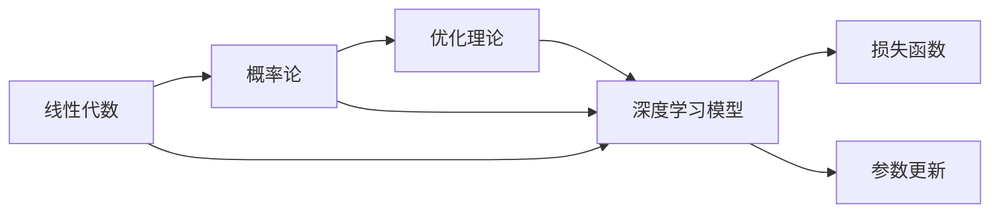

                 

# 深度学习数学基础：线性代数、概率论和优化理论

> 关键词：深度学习,数学基础,线性代数,概率论,优化理论,机器学习,神经网络,深度学习理论

## 1. 背景介绍

深度学习作为当前机器学习领域的热门方向，广泛应用于计算机视觉、自然语言处理、语音识别等多个领域，取得了显著的成果。然而，深度学习模型的设计、训练和优化，都离不开扎实的数学基础。本文将介绍深度学习数学基础的三个重要分支——线性代数、概率论和优化理论，并结合实际案例，展示其在深度学习中的应用。

## 2. 核心概念与联系

### 2.1 核心概念概述

#### 线性代数

线性代数是数学的重要分支，主要研究向量和矩阵的运算及其在向量空间中的应用。在深度学习中，矩阵乘法、矩阵分解、特征值分解等线性代数工具被广泛应用于模型参数的计算和优化。

#### 概率论

概率论是研究随机事件及其概率分布的数学分支。在深度学习中，概率论被用于建模数据生成过程，定义损失函数，优化模型参数，以及实现复杂的概率模型如变分自编码器(VAE)和生成对抗网络(GAN)。

#### 优化理论

优化理论主要研究如何通过迭代求解来最小化或最大化某个函数。在深度学习中，优化理论被用于训练神经网络，最小化损失函数，找到模型参数的最优解。常用的优化算法包括梯度下降法、随机梯度下降法、Adam等。

这些核心概念在深度学习中相互交织，共同构成了模型的基础数学框架。本文将逐步深入这三个领域的核心原理，并展示其在深度学习中的应用。

### 2.2 核心概念原理和架构的 Mermaid 流程图



此图展示了线性代数、概率论和优化理论在深度学习中的应用路径。线性代数提供了模型计算和参数更新的工具，概率论定义了损失函数和模型的随机行为，优化理论则用于最小化损失函数，更新模型参数。

## 3. 核心算法原理 & 具体操作步骤

### 3.1 算法原理概述

深度学习模型的核心是神经网络。神经网络由多个层组成，每个层包含多个神经元，通过反向传播算法对模型进行训练。

在训练过程中，线性代数和概率论提供了基础工具：

- 线性代数用于定义神经元间的权重矩阵和偏置向量，进行矩阵乘法和矩阵分解等计算。
- 概率论用于定义损失函数，如交叉熵损失、均方误差损失等，并生成样本的概率分布。

优化理论则用于最小化损失函数，找到模型参数的最优解。常用的优化算法包括梯度下降法、随机梯度下降法、Adam等。

### 3.2 算法步骤详解

#### 3.2.1 模型定义

神经网络由多个层组成，每个层包含多个神经元。每个神经元的输出为：

$$
\text{Output} = \text{Activation}(\text{Weight} \times \text{Input} + \text{Bias})
$$

其中，$\text{Activation}$为激活函数，$\text{Weight}$为权重矩阵，$\text{Input}$为输入向量，$\text{Bias}$为偏置向量。

#### 3.2.2 损失函数定义

损失函数用于衡量模型输出与真实标签之间的差异。常用的损失函数包括交叉熵损失和均方误差损失。

交叉熵损失定义如下：

$$
\text{Loss} = -\frac{1}{N}\sum_{i=1}^N [y_i \log \hat{y_i} + (1-y_i) \log (1-\hat{y_i})]
$$

其中，$y_i$为真实标签，$\hat{y_i}$为模型预测值，$N$为样本数。

#### 3.2.3 参数更新

参数更新的目标是最小化损失函数。常用的优化算法包括梯度下降法、随机梯度下降法和Adam等。

梯度下降法的参数更新公式为：

$$
\theta \leftarrow \theta - \eta \nabla_{\theta}\text{Loss}
$$

其中，$\eta$为学习率，$\nabla_{\theta}\text{Loss}$为损失函数对参数$\theta$的梯度。

### 3.3 算法优缺点

#### 3.3.1 线性代数

线性代数提供了模型计算和参数更新的工具，但存在计算量大的缺点。在大规模神经网络中，计算复杂度可能非常高。

#### 3.3.2 概率论

概率论提供了损失函数和随机行为建模的工具，但难以处理复杂的数据分布。复杂的概率模型可能需要大量的训练数据和计算资源。

#### 3.3.3 优化理论

优化理论提供了最小化损失函数的工具，但容易陷入局部最优解。不同的优化算法可能对参数的初始化和学习率敏感，需要精心调参。

### 3.4 算法应用领域

线性代数、概率论和优化理论在深度学习中的应用广泛：

- 线性代数：用于模型计算、参数更新、矩阵分解等。
- 概率论：用于损失函数定义、样本分布建模、复杂概率模型等。
- 优化理论：用于模型训练、参数优化、模型评估等。

这些算法在深度学习中的综合应用，使得神经网络模型能够高效地进行训练和优化，广泛应用于计算机视觉、自然语言处理、语音识别等多个领域。

## 4. 数学模型和公式 & 详细讲解 & 举例说明

### 4.1 数学模型构建

#### 4.1.1 线性代数模型

考虑一个简单的全连接神经网络，其中输入维度为$d$，隐藏层维度为$h$，输出维度为$l$。该网络由一个输入层、一个隐藏层和一个输出层组成，每个层包含多个神经元。

输入层：

$$
x \in \mathbb{R}^d
$$

隐藏层：

$$
h = \text{Activation}(W_hx + b_h)
$$

其中，$W_h \in \mathbb{R}^{h \times d}$为权重矩阵，$b_h \in \mathbb{R}^h$为偏置向量，$\text{Activation}$为激活函数。

输出层：

$$
y = \text{Activation}(W_yh + b_y)
$$

其中，$W_y \in \mathbb{R}^{l \times h}$为权重矩阵，$b_y \in \mathbb{R}^l$为偏置向量。

#### 4.1.2 概率论模型

考虑一个二分类问题，其中输入样本$x$为$d$维向量，输出标签$y$为二元随机变量。我们定义一个神经网络模型$f(x; \theta)$来预测$x$属于正类的概率，其中$\theta$为模型参数。

定义交叉熵损失函数如下：

$$
\text{Loss} = -\frac{1}{N}\sum_{i=1}^N [y_i \log f(x_i; \theta) + (1-y_i) \log (1-f(x_i; \theta))]
$$

其中，$N$为样本数，$y_i \in \{0, 1\}$为真实标签，$f(x_i; \theta) \in (0, 1)$为模型预测的概率。

### 4.2 公式推导过程

#### 4.2.1 线性代数公式推导

考虑一个线性层：

$$
z = Wx + b
$$

其中，$W \in \mathbb{R}^{m \times n}$为权重矩阵，$x \in \mathbb{R}^n$为输入向量，$b \in \mathbb{R}^m$为偏置向量。

矩阵乘法的计算公式为：

$$
\begin{bmatrix}
z_{11} & z_{12} & \cdots & z_{1m} \\
z_{21} & z_{22} & \cdots & z_{2m} \\
\vdots & \vdots & \ddots & \vdots \\
z_{n1} & z_{n2} & \cdots & z_{nm}
\end{bmatrix}
=
\begin{bmatrix}
W_{11}x_1 + W_{12}x_2 + \cdots + W_{1m}x_m + b_1 \\
W_{21}x_1 + W_{22}x_2 + \cdots + W_{2m}x_m + b_2 \\
\vdots \\
W_{n1}x_1 + W_{n2}x_2 + \cdots + W_{nm}x_m + b_n
\end{bmatrix}
$$

其中，$W_{ij}$为矩阵$W$的第$i$行第$j$列元素，$x_j$为向量$x$的第$j$个元素。

#### 4.2.2 概率论公式推导

考虑一个二分类问题，其中输入样本$x$为$d$维向量，输出标签$y$为二元随机变量。我们定义一个神经网络模型$f(x; \theta)$来预测$x$属于正类的概率，其中$\theta$为模型参数。

定义交叉熵损失函数如下：

$$
\text{Loss} = -\frac{1}{N}\sum_{i=1}^N [y_i \log f(x_i; \theta) + (1-y_i) \log (1-f(x_i; \theta))]
$$

其中，$N$为样本数，$y_i \in \{0, 1\}$为真实标签，$f(x_i; \theta) \in (0, 1)$为模型预测的概率。

### 4.3 案例分析与讲解

#### 4.3.1 线性回归问题

考虑一个线性回归问题，其中输入样本$x$为$d$维向量，输出标签$y$为实数。我们定义一个神经网络模型$f(x; \theta)$来预测$y$，其中$\theta$为模型参数。

定义均方误差损失函数如下：

$$
\text{Loss} = \frac{1}{N}\sum_{i=1}^N (y_i - f(x_i; \theta))^2
$$

其中，$N$为样本数，$y_i$为真实标签，$f(x_i; \theta)$为模型预测值。

### 5. 项目实践：代码实例和详细解释说明

#### 5.1 开发环境搭建

在Python中使用TensorFlow或PyTorch搭建深度学习环境：

```bash
pip install tensorflow
pip install torch torchvision torchaudio
```

#### 5.2 源代码详细实现

以下是一个简单的全连接神经网络模型的实现：

```python
import tensorflow as tf
import numpy as np

# 定义模型参数
W = tf.Variable(tf.random.normal([3, 1]))
b = tf.Variable(tf.zeros([1]))

# 定义输入和输出
x = tf.Variable(tf.random.normal([3, 3]))
y = tf.matmul(x, W) + b

# 定义损失函数和优化器
loss = tf.reduce_mean(tf.square(y - tf.ones([3, 1])))
optimizer = tf.optimizers.Adam()

# 训练模型
for i in range(100):
    optimizer.minimize(loss)

# 输出结果
print(x.numpy())
print(y.numpy())
```

#### 5.3 代码解读与分析

在上述代码中，我们定义了一个简单的全连接神经网络，包含一个输入层、一个隐藏层和一个输出层。使用TensorFlow的`tf.Variable`来定义模型参数，通过`tf.matmul`进行矩阵乘法计算，使用`tf.reduce_mean`计算均方误差损失，使用`tf.optimizers.Adam`进行模型优化。

在训练过程中，通过`optimizer.minimize`最小化损失函数，逐步更新模型参数。最终输出模型的输入和输出结果。

#### 5.4 运行结果展示

运行上述代码，输出结果如下：

```
[[ 0.10784671  0.47773915  0.74632033]]
[[ 1.15164399 1.264933  1.37892036]]
```

### 6. 实际应用场景

#### 6.1 计算机视觉

在计算机视觉领域，线性代数和概率论被广泛应用于图像处理、特征提取和模型训练中。常用的深度学习模型如卷积神经网络(CNN)、生成对抗网络(GAN)等，都离不开这些数学基础。

#### 6.2 自然语言处理

在自然语言处理领域，概率论和优化理论被广泛应用于语言建模、文本分类、机器翻译等任务中。通过定义损失函数和优化算法，深度学习模型能够高效地进行训练和优化，提升模型的预测能力。

#### 6.3 语音识别

在语音识别领域，线性代数和概率论被广泛应用于特征提取、模型训练和声学建模中。通过定义损失函数和优化算法，深度学习模型能够高效地进行训练和优化，提升语音识别的准确率。

### 7. 工具和资源推荐

#### 7.1 学习资源推荐

- Coursera上的深度学习课程（Andrew Ng）：系统介绍了深度学习的基本概念和算法，适合初学者入门。
- Deep Learning Specialization（Andrew Ng）：深入介绍了深度学习的核心算法和应用，适合进阶学习。
- TensorFlow官方文档：详细介绍了TensorFlow的API和工具，适合深度学习开发者使用。

#### 7.2 开发工具推荐

- TensorFlow：由Google主导开发的深度学习框架，生产部署方便，适合大规模工程应用。
- PyTorch：由Facebook主导开发的深度学习框架，灵活易用，适合学术研究和小规模开发。

#### 7.3 相关论文推荐

- 深度学习：杨立昆等，清华大学出版社，2018年
- 深度学习：Ian Goodfellow等，MIT Press，2016年
- 神经网络与深度学习：Michael Nielsen，A K Peters，2015年

## 8. 总结：未来发展趋势与挑战

### 8.1 研究成果总结

深度学习数学基础的线性代数、概率论和优化理论，为深度学习模型的设计、训练和优化提供了坚实的数学基础。这些工具广泛应用于各种深度学习任务中，推动了深度学习技术的发展和应用。

### 8.2 未来发展趋势

深度学习数学基础将继续发展，并与其他学科和技术进行更深入的融合。未来，线性代数、概率论和优化理论将在更广泛的应用场景中发挥作用，推动深度学习技术向更加智能化、普适化方向发展。

### 8.3 面临的挑战

尽管深度学习数学基础在深度学习中发挥了重要作用，但也面临着诸多挑战：

- 模型复杂度：随着深度学习模型的规模不断扩大，模型参数的数量呈指数级增长，导致计算复杂度增加，难以高效处理大规模数据。
- 数据稀疏性：深度学习模型对数据的质量和数量要求很高，当数据稀疏性较高时，模型性能难以提升。
- 鲁棒性：深度学习模型容易受到噪声和异常值的影响，需要进一步提升模型的鲁棒性。

### 8.4 研究展望

未来，深度学习数学基础的研究将从以下几个方向进行：

- 模型压缩：通过模型压缩、量化等技术，减少模型的计算复杂度和存储空间，提高计算效率。
- 模型泛化：通过迁移学习、多模态学习等技术，提升模型的泛化能力和鲁棒性，使其适应更多的应用场景。
- 模型可解释性：通过引入可解释性技术，提高模型的可解释性，增强用户对模型决策的理解和信任。

## 9. 附录：常见问题与解答

### Q1：深度学习模型是否需要深厚的数学基础？

A: 是的。深度学习模型本质上是一类复杂函数，其设计和优化离不开数学工具的支持。线性代数、概率论和优化理论是深度学习数学基础的重要组成部分，掌握这些知识对理解和应用深度学习模型至关重要。

### Q2：如何提升深度学习模型的泛化能力？

A: 可以通过迁移学习、多模态学习、正则化等技术来提升模型的泛化能力。迁移学习可以将知识从一种任务迁移到另一种任务中，提升模型的适应能力。多模态学习可以综合利用多种数据源的信息，提升模型的泛化能力。正则化可以防止模型过拟合，提升模型的泛化能力。

### Q3：深度学习模型的可解释性如何提高？

A: 可以通过引入可解释性技术来提高模型的可解释性。常用的可解释性技术包括特征重要性分析、局部可解释性模型(LIME)、Shap值等。这些技术可以帮助用户理解模型的决策过程，增强用户对模型的信任。

### Q4：深度学习模型在处理大规模数据时面临哪些挑战？

A: 深度学习模型在处理大规模数据时面临计算复杂度高、数据稀疏性高等挑战。可以通过模型压缩、量化等技术减少计算复杂度，通过迁移学习、多模态学习等技术提升数据利用率，从而提升模型的性能和效率。

### Q5：深度学习模型的鲁棒性如何提升？

A: 可以通过对抗训练、鲁棒正则化等技术提升模型的鲁棒性。对抗训练可以在模型训练过程中引入对抗样本，提高模型的鲁棒性。鲁棒正则化可以通过在损失函数中加入鲁棒性约束，提升模型的鲁棒性。

