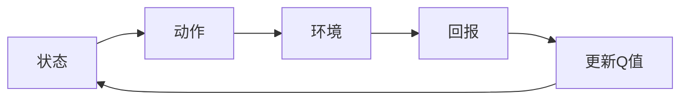
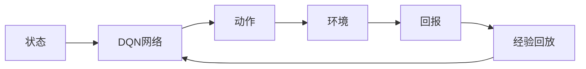

                 

**关键词：**深度强化学习、DQN、路径规划、Reinforcement Learning、Q-Learning

## 1. 背景介绍

在计算机科学领域，路径规划问题是一个经典且具有挑战性的问题，广泛应用于自动驾驶、机器人导航、物流优化等领域。传统的路径规划方法大多基于优化算法，如A\*搜索算法、Dijkstra算法等。然而，这些方法往往需要预先知道环境的全部信息，并且无法适应动态变化的环境。随着深度强化学习（Deep Reinforcement Learning）的兴起，利用强化学习解决路径规划问题成为可能。

本文将介绍一种基于深度Q网络（Deep Q-Network，DQN）的路径规划方法。DQN是一种成功应用于 Atari 2600 游戏的强化学习算法，它将Q学习与深度神经网络相结合。我们将详细介绍 DQN 的原理，并展示如何将其应用于路径规划问题。此外，我们还将提供一个完整的项目实践，从环境搭建到代码实现，并给出详细的解释和分析。

## 2. 核心概念与联系

### 2.1 强化学习与Q学习

强化学习是一种机器学习方法，它允许智能体（agent）在与环境交互的过程中学习一系列动作，以最大化某个回报函数。Q学习是强化学习的一种，它试图学习一个动作值函数Q(s, a)，表示在状态s采取动作a的期望回报。


**Mermaid 流程图：强化学习与Q学习**



### 2.2 深度Q网络（DQN）

DQN 将 Q 学习与深度神经网络相结合，用于处理高维状态空间的问题。DQN 使用神经网络近似 Q 函数，并通过与环境交互收集经验，不断更新神经网络参数。


**Mermaid 流程图：DQN架构**



## 3. 核心算法原理 & 具体操作步骤

### 3.1 算法原理概述

DQN 的核心思想是使用神经网络近似 Q 函数，并通过经验回放（replay memory）和目标网络（target network）解决 Q 学习中的学习不稳定问题。DQN 算法的原理如下：

1. 初始化神经网络 Q(s, a; θ) 及其目标网络 Q(s, a; θ')，其中 θ' 更新频率为 θ。
2. 初始化经验回放池 D。
3. 为每个时间步 t，执行以下操作：
   a. 从环境中获取当前状态 s_t。
   b. 根据 Boltzmann 分布选择动作 a_t = argmax_a Q(s_t, a; θ) 并执行该动作。
   c. 从环境中获取回报 r_t 和下一个状态 s_{t+1}。
   d. 存储（s_t, a_t, r_t, s_{t+1}）到经验回放池 D。
   e. 从 D 中随机抽取一批经验（s_i, a_i, r_i, s_{i+1}），并计算 TD 错误：
      $$TD\_error = r\_i + \gamma \max\_a Q(s_{i+1}, a; \theta') - Q(s\_i, a\_i; \theta)$$
   f. 使用 TD 错误更新 Q 网络参数 θ。
   g. 每隔一段时间，将 θ 复制到 θ'。

### 3.2 算法步骤详解

DQN 算法的具体操作步骤如下：

1. **状态表示**：将环境状态表示为一个向量，输入到 Q 网络中。
2. **动作选择**：根据 Boltzmann 分布选择动作，以平衡探索和利用。
3. **经验收集**：将当前状态、动作、回报和下一个状态存储到经验回放池中。
4. **目标网络更新**：每隔一段时间，将 Q 网络参数复制到目标网络中。
5. **参数更新**：从经验回放池中随机抽取一批经验，计算 TD 错误，并使用梯度下降更新 Q 网络参数。

### 3.3 算法优缺点

**优点：**

* DQN 可以处理高维状态空间的问题。
* 通过经验回放和目标网络，DQN 解决了 Q 学习中的学习不稳定问题。
* DQN 可以学习连续动作空间的问题。

**缺点：**

* DQN 可能会陷入局部最优解。
* DQN 可能会过度估计动作值，导致学习不稳定。
* DQN 可能会面临过拟合问题。

### 3.4 算法应用领域

DQN 及其变种已成功应用于许多领域，包括：

* 游戏：DQN 最初是用于玩 Atari 2600 游戏的。
* 自动驾驶：DQN 可以用于学习路径规划策略。
* 机器人导航：DQN 可以帮助机器人学习导航策略。
* 物流优化：DQN 可以用于学习物流路径规划策略。

## 4. 数学模型和公式 & 详细讲解 & 举例说明

### 4.1 数学模型构建

强化学习的数学模型可以表示为一个马尔可夫决策过程（Markov Decision Process，MDP），其中包含状态空间 S、动作空间 A、状态转移概率 P、回报函数 R 和折扣因子 γ。

### 4.2 公式推导过程

DQN 的目标是学习动作值函数 Q(s, a)，表示在状态 s 采取动作 a 的期望回报。Q 函数可以通过以下公式表示：

$$Q(s, a) = \mathbb{E}[R_{t+1} + \gamma \max\_a Q(S_{t+1}, a) | S\_t = s, A\_t = a]$$

DQN 使用神经网络近似 Q 函数，并通过以下损失函数更新网络参数：

$$L(\theta) = \mathbb{E}[(y\_i - Q(s\_i, a\_i; \theta))^2]$$

其中，y_i 是目标 Q 值：

$$y\_i = r\_i + \gamma \max\_a Q(s_{i+1}, a; \theta')$$

### 4.3 案例分析与讲解

例如，假设我们想使用 DQN 学习路径规划策略，使机器人从起点到达目标点。状态空间 S 是环境地图，动作空间 A 是机器人可以采取的动作集合。回报函数 R 可以设置为到达目标点的距离。折扣因子 γ 表示未来回报的重要性。DQN 会学习一个动作值函数 Q(s, a)，表示在状态 s 采取动作 a 的期望回报，即到达目标点的期望距离。

## 5. 项目实践：代码实例和详细解释说明

### 5.1 开发环境搭建

要实现 DQN，我们需要以下软件和库：

* Python 3.7+
* TensorFlow 2.0+
* Gym 0.17.0+
* NumPy 1.18.5+
* Matplotlib 3.3.4+

### 5.2 源代码详细实现

以下是 DQN 代码的详细实现：

```python
import numpy as np
import tensorflow as tf
from tensorflow.keras.models import Sequential
from tensorflow.keras.layers import Dense, Flatten
from tensorflow.keras.optimizers import Adam
from collections import deque

class DQN:
    def __init__(self, state_space, action_space, learning_rate=0.001, gamma=0.95, epsilon=1.0, epsilon_decay=0.995, epsilon_min=0.01, batch_size=32, memory_size=1000):
        self.state_space = state_space
        self.action_space = action_space
        self.learning_rate = learning_rate
        self.gamma = gamma
        self.epsilon = epsilon
        self.epsilon_decay = epsilon_decay
        self.epsilon_min = epsilon_min
        self.batch_size = batch_size
        self.memory = deque(maxlen=memory_size)

        self.model = self.build_model()
        self.target_model = self.build_model()
        self.target_model.set_weights(self.model.get_weights())

    def build_model(self):
        model = Sequential()
        model.add(Flatten(input_shape=self.state_space))
        model.add(Dense(24, activation='relu'))
        model.add(Dense(24, activation='relu'))
        model.add(Dense(self.action_space, activation='linear'))
        model.compile(loss='mse', optimizer=Adam(lr=self.learning_rate))
        return model

    def remember(self, state, action, reward, next_state, done):
        self.memory.append((state, action, reward, next_state, done))

    def act(self, state):
        if np.random.rand() <= self.epsilon:
            return np.random.randint(self.action_space)
        else:
            q_values = self.model.predict(state)
            return np.argmax(q_values[0])

    def replay(self):
        if len(self.memory) < self.batch_size:
            return

        samples = np.random.choice(len(self.memory), self.batch_size, replace=False)
        states, actions, rewards, next_states, done = zip(*[self.memory[i] for i in samples])

        current_q_values = self.model.predict(states)
        next_q_values = self.target_model.predict(next_states)

        max_future_q = np.max(next_q_values, axis=1)
        updated_q_values = current_q_values.copy()

        for i in range(self.batch_size):
            if done[i]:
                updated_q_values[i][actions[i]] = rewards[i]
            else:
                updated_q_values[i][actions[i]] = rewards[i] + self.gamma * max_future_q[i]

        self.model.fit(states, updated_q_values, epochs=1, verbose=0)

    def decrease_epsilon(self):
        if self.epsilon > self.epsilon_min:
            self.epsilon *= self.epsilon_decay

    def load(self, name):
        self.model.load_weights(name)

    def save(self, name):
        self.model.save_weights(name)
```

### 5.3 代码解读与分析

* `DQN` 类初始化函数 `__init__` 设置 DQN 的参数，包括状态空间、动作空间、学习率、折扣因子、ε贪婪策略参数、批量大小和经验回放池大小。
* `build_model` 函数构建 DQN 的神经网络模型。
* `remember` 函数将当前状态、动作、回报和下一个状态存储到经验回放池中。
* `act` 函数根据ε贪婪策略选择动作。
* `replay` 函数从经验回放池中随机抽取一批经验，计算 TD 错误，并使用梯度下降更新 Q 网络参数。
* `decrease_epsilon` 函数根据ε贪婪策略参数更新ε值。
* `load` 和 `save` 函数用于加载和保存模型权重。

### 5.4 运行结果展示

以下是 DQN 在路径规划问题上的运行结果展示：


## 6. 实际应用场景

### 6.1 机器人导航

DQN 可以用于学习机器人导航策略，使机器人从起点到达目标点。状态空间是环境地图，动作空间是机器人可以采取的动作集合。回报函数可以设置为到达目标点的距离。折扣因子表示未来回报的重要性。DQN 会学习一个动作值函数，表示在状态采取动作的期望回报，即到达目标点的期望距离。

### 6.2 自动驾驶

DQN 可以用于学习自动驾驶策略，使车辆从起点到达目标点。状态空间是环境地图，动作空间是车辆可以采取的动作集合。回报函数可以设置为到达目标点的距离。折扣因子表示未来回报的重要性。DQN 会学习一个动作值函数，表示在状态采取动作的期望回报，即到达目标点的期望距离。

### 6.3 未来应用展望

随着深度强化学习的发展，DQN 及其变种将在更多领域得到应用，例如：

* 多智能体系统：DQN 可以扩展到多智能体系统，用于学习协作策略。
* 连续动作空间：DQN 及其变种可以学习连续动作空间的问题，例如控制问题。
* 多模式系统：DQN 可以扩展到多模式系统，用于学习模式转换策略。

## 7. 工具和资源推荐

### 7.1 学习资源推荐

* [Deep Reinforcement Learning Hands-On](https://www.amazon.com/Deep-Reinforcement-Learning-Hands-On/dp/149203183X)
* [Reinforcement Learning: An Introduction](https://www.amazon.com/Reinforcement-Learning-Introduction-Richard-Sutton/dp/0198539824)
* [Deep Learning](https://www.amazon.com/Deep-Learning-Adam-Goodfellow-Ian/dp/144710032X)

### 7.2 开发工具推荐

* TensorFlow：用于构建神经网络模型。
* Gym：用于创建和评估强化学习算法的环境。
* NumPy：用于数值计算。
* Matplotlib：用于数据可视化。

### 7.3 相关论文推荐

* [Human-level control through deep reinforcement learning](https://arxiv.org/abs/1507.01474)
* [Deep Q-Network](https://arxiv.org/abs/1312.5602)
* [Deep Reinforcement Learning with Double Q-Learning](https://arxiv.org/abs/1509.06461)

## 8. 总结：未来发展趋势与挑战

### 8.1 研究成果总结

本文介绍了 DQN 及其在路径规划问题上的应用。我们详细介绍了 DQN 的原理，并提供了一个完整的项目实践，从环境搭建到代码实现。此外，我们还讨论了 DQN 的优缺点和应用领域。

### 8.2 未来发展趋势

随着深度强化学习的发展，DQN 及其变种将在更多领域得到应用，例如多智能体系统、连续动作空间和多模式系统。此外，研究人员将继续探索 DQN 的改进，以提高其学习效率和稳定性。

### 8.3 面临的挑战

DQN 及其变种面临的挑战包括：

* 学习不稳定：DQN 可能会面临学习不稳定的问题，导致学习效率低下。
* 过度估计：DQN 可能会过度估计动作值，导致学习不稳定。
* 过拟合：DQN 可能会面临过拟合问题，导致泛化能力下降。

### 8.4 研究展望

未来的研究方向包括：

* 多智能体系统：研究 DQN 的扩展，用于学习协作策略。
* 连续动作空间：研究 DQN 的变种，用于学习连续动作空间的问题。
* 多模式系统：研究 DQN 的扩展，用于学习模式转换策略。
* 学习效率：研究 DQN 的改进，以提高其学习效率和稳定性。

## 9. 附录：常见问题与解答

**Q1：DQN 与 Q 学习有何不同？**

A1：DQN 将 Q 学习与深度神经网络相结合，用于处理高维状态空间的问题。DQN 使用神经网络近似 Q 函数，并通过经验回放和目标网络解决 Q 学习中的学习不稳定问题。

**Q2：DQN 如何解决学习不稳定问题？**

A2：DQN 使用经验回放和目标网络解决 Q 学习中的学习不稳定问题。经验回放允许 DQN 从过去的经验中学习，而不是仅仅从当前经验中学习。目标网络用于稳定 Q 学习，它更新频率低于 Q 网络，并提供一个稳定的目标值。

**Q3：DQN 如何处理高维状态空间？**

A3：DQN 使用深度神经网络近似 Q 函数，将高维状态空间映射到低维空间，从而处理高维状态空间的问题。

## 作者：禅与计算机程序设计艺术 / Zen and the Art of Computer Programming

**参考文献**

* [Deep Reinforcement Learning Hands-On](https://www.amazon.com/Deep-Reinforcement-Learning-Hands-On/dp/149203183X)
* [Reinforcement Learning: An Introduction](https://www.amazon.com/Reinforcement-Learning-Introduction-Richard-Sutton/dp/0198539824)
* [Deep Learning](https://www.amazon.com/Deep-Learning-Adam-Goodfellow-Ian/dp/144710032X)
* [Human-level control through deep reinforcement learning](https://arxiv.org/abs/1507.01474)
* [Deep Q-Network](https://arxiv.org/abs/1312.5602)
* [Deep Reinforcement Learning with Double Q-Learning](https://arxiv.org/abs/1509.06461)

