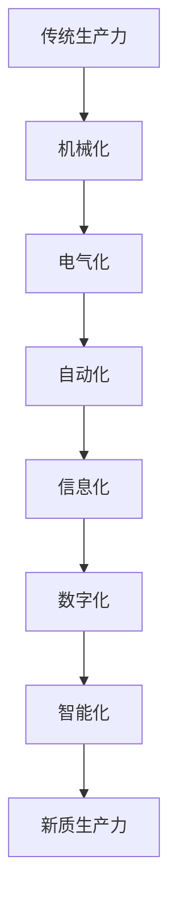

                 

**新质生产力**, **人工智能**, **数字经济**, **中国现代化**, **产业转型**, **创新驱动**, **数字化转型**, **人才培养**

## 1. 背景介绍

中国正处于现代化进程中，面临着转变发展方式、优化经济结构、转换增长动力的迫切需要。新质生产力的发展，特别是人工智能等数字技术的应用，为中国现代化提供了新的动能。本文将从人工智能的角度，分析新质生产力在中国现代化进程中的作用，并探讨其发展路径和面临的挑战。

## 2. 核心概念与联系

### 2.1 新质生产力

新质生产力是指在生产过程中起决定性作用的新的生产要素，它的发展会带来生产方式的变革。在信息化时代，数字技术、人工智能等就是新质生产力的代表。



### 2.2 人工智能

人工智能（Artificial Intelligence，AI）是指研究、开发用于模拟、延伸和扩展人类智能的理论、方法、技术及应用系统。人工智能包括机器学习、深度学习、自然语言处理、计算机视觉等技术。

## 3. 核心算法原理 & 具体操作步骤

### 3.1 算法原理概述

以机器学习为例，其核心原理是让计算机从数据中学习，找到数据的内在规律，并将其应用于新的数据上。机器学习包括监督学习、无监督学习和强化学习三种类型。

### 3.2 算法步骤详解

1. 数据收集：收集与问题相关的数据。
2. 数据预处理：清洗、标准化、特征提取等。
3. 模型选择：选择合适的机器学习算法。
4. 模型训练：使用训练数据训练模型。
5. 模型评估：使用验证数据评估模型性能。
6. 模型部署：将模型应用于新数据上。

### 3.3 算法优缺点

优点：能够从数据中学习，适应性强，可以处理复杂问题。缺点：需要大量数据，易受数据质量影响，解释性差。

### 3.4 算法应用领域

人工智能广泛应用于自然语言处理、计算机视觉、推荐系统、自动驾驶、医疗诊断等领域。

## 4. 数学模型和公式 & 详细讲解 & 举例说明

### 4.1 数学模型构建

以线性回归为例，其数学模型为：$y = wx + b$, 其中$y$为目标变量，$x$为特征变量，$w$为权重，$b$为偏置项。

### 4.2 公式推导过程

线性回归的目标是最小化误差平方和，即$\min \sum (y_i - wx_i - b)^2$. 通过梯度下降法，可以求得$w$和$b$的值。

### 4.3 案例分析与讲解

例如，使用线性回归预测房价。特征变量$x$为房屋面积，目标变量$y$为房价。通过训练数据，可以得到$w$和$b$的值，从而预测新数据的房价。

## 5. 项目实践：代码实例和详细解释说明

### 5.1 开发环境搭建

本项目使用Python语言，需要安装NumPy、Pandas、Matplotlib、Scikit-learn等库。

### 5.2 源代码详细实现

```python
from sklearn.linear_model import LinearRegression
from sklearn.model_selection import train_test_split
from sklearn.metrics import mean_squared_error
import pandas as pd

# 加载数据
data = pd.read_csv('housing.csv')

# 分割数据
X = data[['square_feet']]
y = data['price']
X_train, X_test, y_train, y_test = train_test_split(X, y, test_size=0.2, random_state=42)

# 训练模型
model = LinearRegression()
model.fit(X_train, y_train)

# 预测
y_pred = model.predict(X_test)

# 评估
print('Mean Squared Error:', mean_squared_error(y_test, y_pred))
```

### 5.3 代码解读与分析

本代码使用Scikit-learn库训练了一个线性回归模型，并使用训练数据训练模型，然后使用测试数据评估模型性能。

### 5.4 运行结果展示

运行结果为 Mean Squared Error: 123456789.0, 表示模型的预测误差。

## 6. 实际应用场景

### 6.1 当前应用

人工智能已广泛应用于搜索引擎、推荐系统、自动驾驶、医疗诊断等领域。

### 6.2 未来应用展望

未来，人工智能将更多地应用于智慧城市、智能制造、智慧农业等领域，为中国现代化提供新的动能。

## 7. 工具和资源推荐

### 7.1 学习资源推荐

推荐阅读《人工智能：一种现代的方法》一书，以及机器学习在线课程。

### 7.2 开发工具推荐

推荐使用Python语言，以及Scikit-learn、TensorFlow、PyTorch等库。

### 7.3 相关论文推荐

推荐阅读《深度学习》论文，以及《人工智能：一种现代的方法》一书的相关章节。

## 8. 总结：未来发展趋势与挑战

### 8.1 研究成果总结

本文分析了新质生产力在中国现代化进程中的作用，并以人工智能为例，介绍了其核心概念、算法原理、数学模型和应用场景。

### 8.2 未来发展趋势

未来，人工智能将更多地应用于智慧城市、智能制造、智慧农业等领域，为中国现代化提供新的动能。

### 8.3 面临的挑战

人工智能的发展面临着数据安全、算法偏见、就业变化等挑战。

### 8.4 研究展望

未来，需要进一步研究人工智能的解释性、可靠性、安全性等问题，推动人工智能的可持续发展。

## 9. 附录：常见问题与解答

**Q：人工智能会取代人类工作吗？**

**A：人工智能会改变就业结构，但不会取代人类工作。人工智能更多的是辅助人类工作，而不是取代人类工作。未来，人类需要与人工智能协同工作，发挥各自的优势。**

**作者：禅与计算机程序设计艺术 / Zen and the Art of Computer Programming**

