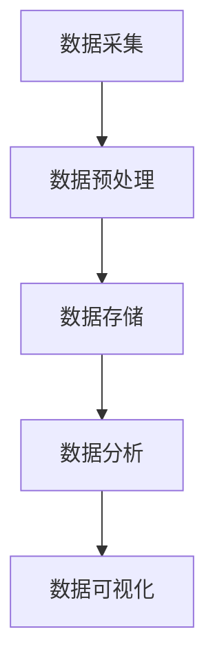

                 

## 1. 背景介绍

在人工智能（AI）创业的浪潮中，数据管理扮演着至关重要的角色。高质量、高效率的数据管理是构建成功AI应用的基础。本文将深入探讨人工智能创业数据管理的关键，包括核心概念、算法原理、数学模型、项目实践，以及未来发展趋势。

## 2. 核心概念与联系

### 2.1 数据管理的核心概念

- **数据采集（Data Collection）**：从各种来源收集数据。
- **数据预处理（Data Preprocessing）**：清洗、转换、归一化数据。
- **数据存储（Data Storage）**：选择合适的数据库或存储系统。
- **数据分析（Data Analysis）**：提取有用信息，发现模式和趋势。
- **数据可视化（Data Visualization）**：通过图表和可视化工具展示数据。

### 2.2 数据管理架构

## 3. 核心算法原理 & 具体操作步骤

### 3.1 算法原理概述

在数据管理中，常用的算法包括数据清洗、数据聚类、数据降维等。

### 3.2 算法步骤详解

- **数据清洗（Data Cleaning）**：去除缺失值、异常值，处理重复数据。
- **数据聚类（Clustering）**：将相似的数据点分组。
- **数据降维（Dimensionality Reduction）**：减少数据的维度，保留主要信息。

### 3.3 算法优缺点

- **数据清洗**：优点是提高数据质量，缺点是可能丢失有用信息。
- **数据聚类**：优点是发现数据模式，缺点是结果可能不唯一。
- **数据降维**：优点是简化数据结构，缺点是可能丢失部分信息。

### 3.4 算法应用领域

- **数据清洗**：广泛应用于数据库维护、数据挖掘等领域。
- **数据聚类**：应用于客户细分、文档分类等领域。
- **数据降维**：应用于可视化、特征选择等领域。

## 4. 数学模型和公式 & 详细讲解 & 举例说明

### 4.1 数学模型构建

- **数据清洗**：使用缺失值填充方法，如均值填充、中位数填充。
- **数据聚类**：使用K-均值算法，假设数据服从高斯分布。
- **数据降维**：使用主成分分析（PCA）方法，假设数据是线性无关的。

### 4.2 公式推导过程

- **数据清洗**：均值填充公式为：$x_{填充} = \frac{1}{n}\sum_{i=1}^{n}x_i$。
- **数据聚类**：K-均值算法的目标函数为：$J = \sum_{j=1}^{k}\sum_{x\in C_j}||x - \mu_j||^2$。
- **数据降维**：PCA的目标是最大化投影后数据的方差，公式为：$J = \arg\max_{w} \frac{w^TX^TXw}{w^TX^TXw}$。

### 4.3 案例分析与讲解

- **数据清洗**：假设有一个数据集，缺失值用'NaN'表示，使用均值填充方法填充缺失值。
- **数据聚类**：使用Iris数据集，设置K=3，使用K-均值算法进行聚类。
- **数据降维**：使用Iris数据集，使用PCA方法将数据降维到二维平面。

## 5. 项目实践：代码实例和详细解释说明

### 5.1 开发环境搭建

- 使用Python作为编程语言，安装必要的库，如NumPy、Pandas、Scikit-learn等。

### 5.2 源代码详细实现

- **数据清洗**：使用Pandas的fillna()方法进行均值填充。
- **数据聚类**：使用Scikit-learn的KMeans类进行聚类。
- **数据降维**：使用Scikit-learn的PCA类进行降维。

### 5.3 代码解读与分析

- **数据清洗**：代码使用Pandas的DataFrame结构存储数据，fillna()方法填充缺失值。
- **数据聚类**：代码使用Scikit-learn的KMeans类，设置K=3，fit()方法进行聚类。
- **数据降维**：代码使用Scikit-learn的PCA类，设置n_components=2，fit_transform()方法进行降维。

### 5.4 运行结果展示

- **数据清洗**：展示填充后的数据集。
- **数据聚类**：展示聚类结果，使用不同颜色表示不同类别。
- **数据降维**：展示降维后的数据，使用二维坐标表示。

## 6. 实际应用场景

### 6.1 当前应用

- **数据清洗**：广泛应用于金融、电商等领域的数据库维护。
- **数据聚类**：应用于客户细分、文档分类等领域。
- **数据降维**：应用于可视化、特征选择等领域。

### 6.2 未来应用展望

- **数据清洗**：随着数据量的增加，自动化数据清洗将变得越来越重要。
- **数据聚类**：随着深度学习的发展，无监督学习将变得越来越流行。
- **数据降维**：随着数据维度的增加，非线性降维方法将变得越来越重要。

## 7. 工具和资源推荐

### 7.1 学习资源推荐

- **书籍**："Python for Data Analysis" by Wes McKinney。
- **在线课程**：Coursera的"Data Science Specialization"。

### 7.2 开发工具推荐

- **编辑器**：Jupyter Notebook。
- **库**：NumPy、Pandas、Scikit-learn。

### 7.3 相关论文推荐

- "Handling Missing Data" by Little and Rubin。
- "K-Means" by MacQueen。
- "Principal Component Analysis" by Pearson。

## 8. 总结：未来发展趋势与挑战

### 8.1 研究成果总结

- 本文介绍了人工智能创业数据管理的关键，包括核心概念、算法原理、数学模型、项目实践。

### 8.2 未来发展趋势

- 数据管理将越来越自动化，人工智能将在数据管理中扮演越来越重要的角色。
- 数据管理将越来越跨领域，需要考虑数据的安全性、隐私性等问题。

### 8.3 面临的挑战

- 数据量的增加，数据质量的下降。
- 数据安全性、隐私性的保护。

### 8.4 研究展望

- 研究自动化数据清洗方法，提高数据清洗的效率和质量。
- 研究无监督学习方法，提高数据聚类的准确性。
- 研究非线性数据降维方法，提高数据降维的准确性。

## 9. 附录：常见问题与解答

- **Q：数据清洗的目的是什么？**
  - A：数据清洗的目的是提高数据质量，去除缺失值、异常值，处理重复数据。
- **Q：数据聚类的目的是什么？**
  - A：数据聚类的目的是发现数据模式，将相似的数据点分组。
- **Q：数据降维的目的是什么？**
  - A：数据降维的目的是减少数据的维度，保留主要信息。

**作者：禅与计算机程序设计艺术 / Zen and the Art of Computer Programming**

