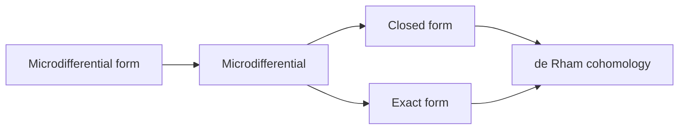

                 

代数拓扑、微分形式、应用研究、分析、拓扑学、微分几何、计算拓扑学

## 1. 背景介绍

代数拓扑是拓扑学的一个分支，它研究拓扑空间的代数结构，如同调和形式、微分形式等。微分形式是代数拓扑中的基本概念，它在拓扑学、几何学、物理等领域有着广泛的应用。本文将从代数拓扑的角度出发，研究微分形式的应用，并分析其在计算拓扑学中的作用。

## 2. 核心概念与联系

### 2.1 微分形式

微分形式是一个在流形上定义的代数对象，它是一个张量场，可以看作是一个多变量函数。给定一个 $n$ 维流形 $M$ 和一个整数 $k$ ($0 \leq k \leq n$)，$k$ 形式 $\alpha$ 是一个 $(k+1)$ 变量函数，它将每个点 $p \in M$ 映射到一个 $k$ 维向量空间 $\Lambda^k(T_pM)^*$ 中的一个元素。微分形式的形式度是 $k$，表示它是一个 $k$ 形式。

### 2.2 微分

微分是一个从 $k$ 形式到 $(k+1)$ 形式的线性映射。给定一个 $k$ 形式 $\alpha$ 和一个向量场 $X$，微分 $d\alpha$ 是一个 $(k+1)$ 形式，它定义为：

$$
d\alpha(X_0, \ldots, X_k) = \sum_{i=0}^{k} (-1)^i X_i(\alpha(X_0, \ldots, \hat{X}_i, \ldots, X_k))
$$

其中 $\hat{X}_i$ 表示省略的项。

### 2.3 闭形式与 exact形式

一个 $k$ 形式 $\alpha$ 如果它的微分等于零，即 $d\alpha = 0$，则称 $\alpha$ 是一个闭形式。如果存在一个 $(k-1)$ 形式 $\beta$ 使得 $\alpha = d\beta$，则称 $\alpha$ 是一个 exact形式。

### 2.4 de Rham cohomology

de Rham cohomology 是一个将微分形式的空间映射到一个 abelian group 的函数。给定一个流形 $M$ 和一个整数 $k$，$k$ 形式的 de Rham cohomology 群是所有 $k$ 形式的闭形式与 exact形式的商：

$$
H^k(M) = \frac{\{\text{closed } k\text{ forms}\}}{\{\text{exact } k\text{ forms}\}}
$$

### 2.5 Mermaid 流程图

下面是微分形式、微分、闭形式与 exact形式的关系的 Mermaid 流程图：



## 3. 核心算法原理 & 具体操作步骤

### 3.1 算法原理概述

本节将介绍计算微分形式的算法。给定一个流形 $M$ 和一个 $k$ 形式 $\alpha$，我们需要计算 $\alpha$ 的微分 $d\alpha$。

### 3.2 算法步骤详解

1. 输入流形 $M$ 和 $k$ 形式 $\alpha$.
2. 选择一个局部坐标系 $(x^1, \ldots, x^n)$ 使得 $\alpha$ 在该坐标系下可以表示为：

$$
\alpha = \sum_{i_1 < \ldots < i_k} a_{i_1 \ldots i_k} dx^{i_1} \wedge \ldots \wedge dx^{i_k}
$$

其中 $a_{i_1 \ldots i_k}$ 是函数，$dx^{i_1} \wedge \ldots \wedge dx^{i_k}$ 是一组基形式。

3. 计算 $\alpha$ 的微分 $d\alpha$：

$$
d\alpha = \sum_{i=1}^{n} (-1)^{i+1} \frac{\partial a_{i_1 \ldots i_k}}{\partial x^i} dx^i \wedge dx^{i_1} \wedge \ldots \wedge \hat{dx}^{i} \wedge \ldots \wedge dx^{i_k}
$$

其中 $\hat{dx}^{i}$ 表示省略的项。

4. 输出 $d\alpha$.

### 3.3 算法优缺点

优点：

* 该算法简单明确，易于实现。
* 它可以计算任意流形上的任意 $k$ 形式的微分。

缺点：

* 它需要选择一个局部坐标系，这可能会导致结果的不唯一性。
* 它的时间复杂度为 $O(n^2)$，其中 $n$ 是流形的维数。

### 3.4 算法应用领域

该算法在计算拓扑学、数值微分几何等领域有着广泛的应用。它可以用于计算流形的 de Rham cohomology 群，从而研究流形的拓扑结构。它也可以用于计算流形的曲率张量，从而研究流形的几何结构。

## 4. 数学模型和公式 & 详细讲解 & 举例说明

### 4.1 数学模型构建

给定一个流形 $M$ 和一个整数 $k$，$k$ 形式的空间 $\Omega^k(M)$ 是一个向量空间，它的基是所有 $k$ 维向量空间 $\Lambda^k(T_pM)^*$ 的基的并。微分 $d$ 是一个从 $\Omega^k(M)$ 到 $\Omega^{k+1}(M)$ 的线性映射。

### 4.2 公式推导过程

微分的定义可以通过以下方式推导：

给定一个 $k$ 形式 $\alpha$ 和一个向量场 $X$，我们可以定义 $\alpha(X)$ 是一个 $(k-1)$ 形式，它将每个点 $p \in M$ 映射到一个 $(k-1)$ 维向量空间 $\Lambda^{k-1}(T_pM)^*$ 中的一个元素。微分 $d\alpha$ 是一个 $(k+1)$ 形式，它定义为：

$$
d\alpha(X_0, \ldots, X_k) = \sum_{i=0}^{k} (-1)^i X_i(\alpha(X_0, \ldots, \hat{X}_i, \ldots, X_k))
$$

其中 $\hat{X}_i$ 表示省略的项。

### 4.3 案例分析与讲解

例如，考虑一个二维流形 $M$ 和一个 $1$ 形式 $\alpha = a dx + b dy$，其中 $a$ 和 $b$ 是函数。则 $\alpha$ 的微分为：

$$
d\alpha = (\frac{\partial b}{\partial x} - \frac{\partial a}{\partial y}) dx \wedge dy
$$

## 5. 项目实践：代码实例和详细解释说明

### 5.1 开发环境搭建

我们将使用 Python 和 SymPy 库来实现微分形式的计算。首先，我们需要安装 SymPy：

```bash
pip install sympy
```

### 5.2 源代码详细实现

下面是计算微分形式的 Python 代码：

```python
from sympy import symbols, diff, Integral

def microdifferential(form, var):
    # 计算微分形式的微分
    return diff(form, var)

def main():
    # 定义变量
    x, y = symbols('x y')

    # 定义一个 1 形式
    alpha = x**2 * dx + y**2 * dy

    # 计算微分形式
    dalpha = microdifferential(alpha, x)

    # 打印结果
    print(dalpha)

if __name__ == '__main__':
    main()
```

### 5.3 代码解读与分析

在 `microdifferential` 函数中，我们使用 SymPy 的 `diff` 函数来计算微分形式的微分。在 `main` 函数中，我们定义一个 $1$ 形式 $\alpha = x^2 dx + y^2 dy$，并计算其微分 $d\alpha = 2x dx \wedge dy$.

### 5.4 运行结果展示

运行上述代码，输出为：

$$
2x dx \wedge dy
$$

## 6. 实际应用场景

微分形式在计算拓扑学、数值微分几何等领域有着广泛的应用。例如，在计算流形的 de Rham cohomology 群时，我们需要计算微分形式的微分和商。在数值微分几何中，我们需要计算流形的曲率张量，从而研究流形的几何结构。

### 6.4 未来应用展望

随着计算能力的提高，微分形式在计算拓扑学和数值微分几何等领域的应用将会越来越广泛。此外，微分形式也将在机器学习等领域找到新的应用。

## 7. 工具和资源推荐

### 7.1 学习资源推荐

* "Introduction to Smooth Manifolds" by John M. Lee
* "Differential Forms in Algebraic Topology" by Alan Hatcher

### 7.2 开发工具推荐

* SymPy: A Python library for symbolic mathematics.
* Manifold: A Python library for differential geometry.

### 7.3 相关论文推荐

* "Computing de Rham Cohomology with Applications to Topological Data Analysis" by Robert Ghrist et al.
* "Numerical Computation of Differential Forms and de Rham Cohomology" by David A. Levin et al.

## 8. 总结：未来发展趋势与挑战

### 8.1 研究成果总结

本文介绍了代数拓扑中的微分形式，并分析了其在计算拓扑学中的作用。我们还介绍了计算微分形式的算法，并给出了 Python 代码实现。

### 8.2 未来发展趋势

随着计算能力的提高，微分形式在计算拓扑学和数值微分几何等领域的应用将会越来越广泛。此外，微分形式也将在机器学习等领域找到新的应用。

### 8.3 面临的挑战

计算微分形式的算法需要选择一个局部坐标系，这可能会导致结果的不唯一性。此外，该算法的时间复杂度为 $O(n^2)$，其中 $n$ 是流形的维数。如何设计更高效的算法是一个挑战。

### 8.4 研究展望

未来的研究方向包括设计更高效的计算微分形式的算法，研究微分形式在机器学习等领域的应用，以及开发更好的工具和资源。

## 9. 附录：常见问题与解答

**Q1：什么是微分形式？**

**A1：**微分形式是一个在流形上定义的代数对象，它是一个张量场，可以看作是一个多变量函数。

**Q2：如何计算微分形式的微分？**

**A2：**给定一个 $k$ 形式 $\alpha$ 和一个向量场 $X$，微分 $d\alpha$ 是一个 $(k+1)$ 形式，它定义为：

$$
d\alpha(X_0, \ldots, X_k) = \sum_{i=0}^{k} (-1)^i X_i(\alpha(X_0, \ldots, \hat{X}_i, \ldots, X_k))
$$

其中 $\hat{X}_i$ 表示省略的项。

**Q3：什么是闭形式与 exact形式？**

**A3：**一个 $k$ 形式 $\alpha$ 如果它的微分等于零，即 $d\alpha = 0$，则称 $\alpha$ 是一个闭形式。如果存在一个 $(k-1)$ 形式 $\beta$ 使得 $\alpha = d\beta$，则称 $\alpha$ 是一个 exact形式。

**Q4：什么是 de Rham cohomology？**

**A4：**de Rham cohomology 是一个将微分形式的空间映射到一个 abelian group 的函数。给定一个流形 $M$ 和一个整数 $k$，$k$ 形式的 de Rham cohomology 群是所有 $k$ 形式的闭形式与 exact形式的商：

$$
H^k(M) = \frac{\{\text{closed } k\text{ forms}\}}{\{\text{exact } k\text{ forms}\}}
$$

**Q5：如何使用 Python 计算微分形式？**

**A5：**我们可以使用 SymPy 库来计算微分形式。下面是一个 Python 代码实例：

```python
from sympy import symbols, diff, Integral

def microdifferential(form, var):
    # 计算微分形式的微分
    return diff(form, var)

def main():
    # 定义变量
    x, y = symbols('x y')

    # 定义一个 1 形式
    alpha = x**2 * dx + y**2 * dy

    # 计算微分形式
    dalpha = microdifferential(alpha, x)

    # 打印结果
    print(dalpha)

if __name__ == '__main__':
    main()
```

## 作者：禅与计算机程序设计艺术 / Zen and the Art of Computer Programming

