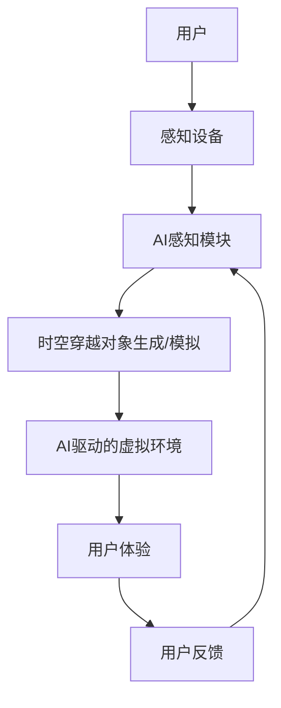

                 

**AI**, **时空穿越**, **体验**, **感知**, **记忆**, **神经网络**, **生成模型**, **虚拟现实**, **元宇宙**

## 1. 背景介绍

在当今的数字时代，人工智能（AI）正在改变我们的生活方式，扩展我们的感知能力，并重新定义我们的记忆。其中一个引人入胜的领域是时空穿越，通过AI创造的体验，我们可以跨越时空的界限，探索历史、幻想或未来的世界。本文将深入探讨AI驱动的时空穿越体验，从核心概念到具体算法，再到项目实践和实际应用场景。

## 2. 核心概念与联系

### 2.1 体验的跨时空性

体验的跨时空性是指通过技术手段超越时空限制，创造出的感官体验。这可以是回到过去的历史重现，前往未来的未知世界，或是探索虚构的幻想空间。

### 2.2 AI在时空穿越中的作用

AI在时空穿越体验中扮演着关键角色。它可以分析和生成逼真的视觉、听觉和触觉信息，创造出沉浸式的虚拟环境。此外，AI还可以分析和模拟时空穿越对象的行为，从而丰富体验的互动性。

### 2.3 核心架构

下图是AI驱动的时空穿越体验的核心架构：



## 3. 核心算法原理 & 具体操作步骤

### 3.1 算法原理概述

AI驱动的时空穿越体验主要依赖于生成模型和神经网络。生成模型（如变分自编码器、生成对抗网络）用于创造时空穿越对象或环境，神经网络（如卷积神经网络、递归神经网络）用于分析和模拟对象的行为。

### 3.2 算法步骤详解

1. **数据收集与预处理**：收集与时空穿越对象相关的数据，如图像、声音、文本等。预处理数据以便于模型学习。
2. **模型训练**：使用生成模型和神经网络对数据进行学习，生成时空穿越对象或模拟其行为。
3. **虚拟环境创建**：根据生成的对象和模拟的行为，创建逼真的虚拟环境。
4. **用户体验**：用户通过感知设备（如VR头盔、耳机等）进入虚拟环境，体验时空穿越。
5. **反馈与优化**：根据用户反馈，优化模型和虚拟环境，提高体验的真实感和互动性。

### 3.3 算法优缺点

**优点**：AI驱动的时空穿越体验可以创造出逼真的虚拟环境，提供丰富的互动体验。它还可以帮助我们探索历史、幻想或未来的世界，扩展我们的认知边界。

**缺点**：当前的AI技术还无法创造出完美无缺的时空穿越体验。模拟的对象和环境可能会有不真实的地方，用户体验可能会受到延迟和其他技术问题的影响。

### 3.4 算法应用领域

AI驱动的时空穿越体验有着广泛的应用领域，包括历史重现、虚构世界探索、教育和学习、娱乐和休闲等。

## 4. 数学模型和公式 & 详细讲解 & 举例说明

### 4.1 数学模型构建

在时空穿越体验中，我们通常需要构建生成模型和神经网络。生成模型可以表示为：

$$P_{\theta}(x) = \frac{1}{Z(\theta)}exp(-D_{\theta}(x))$$

其中，$x$是生成的时空穿越对象，$D_{\theta}(x)$是判别器的损失函数，$Z(\theta)$是标准化因子。

### 4.2 公式推导过程

生成模型的训练过程可以通过最大化对数似然估计来实现：

$$\theta^* = argmax_{\theta} \mathbb{E}_{x\sim P_{data}(x)}[logP_{\theta}(x)]$$

其中，$P_{data}(x)$是真实数据的分布。

### 4.3 案例分析与讲解

例如，在时空穿越体验中，我们可以使用生成对抗网络（GAN）来生成历史人物的面孔。GAN由生成器$G$和判别器$D$组成。生成器$G$学习如何生成逼真的历史人物面孔，判别器$D$学习如何区分真实的历史人物面孔和生成的面孔。通过对抗训练，生成器$G$可以生成高度逼真的历史人物面孔。

## 5. 项目实践：代码实例和详细解释说明

### 5.1 开发环境搭建

要实现AI驱动的时空穿越体验，我们需要搭建一个Python开发环境，并安装必要的库，如TensorFlow、PyTorch、Keras等。

### 5.2 源代码详细实现

以下是一个简单的时空穿越体验项目的源代码框架：

```python
import tensorflow as tf
from tensorflow.keras import layers

# 定义生成器
def make_generator_model():
    model = tf.keras.Sequential()
    # 这里添加生成器的层
    return model

# 定义判别器
def make_discriminator_model():
    model = tf.keras.Sequential()
    # 这里添加判别器的层
    return model

# 定义GAN
def make_gan_model(generator, discriminator):
    model = tf.keras.Sequential([generator, discriminator])
    return model

# 定义训练过程
def train_step(images):
    with tf.GradientTape() as gen_tape, tf.GradientTape() as disc_tape:
        generated_images = generator(images, training=True)

        real_output = discriminator(images, training=True)
        fake_output = discriminator(generated_images, training=True)

        gen_loss = generator_loss(fake_output)
        disc_loss = discriminator_loss(real_output, fake_output)

    gradients_of_generator = gen_tape.gradient(gen_loss, generator.trainable_variables)
    gradients_of_discriminator = disc_tape.gradient(disc_loss, discriminator.trainable_variables)

    generator_optimizer.apply_gradients(zip(gradients_of_generator, generator.trainable_variables))
    discriminator_optimizer.apply_gradients(zip(gradients_of_discriminator, discriminator.trainable_variables))
```

### 5.3 代码解读与分析

在上述代码中，我们首先定义了生成器、判别器和GAN模型。然后，我们定义了训练过程，其中包括计算生成器和判别器的梯度，并使用优化器更新模型参数。

### 5.4 运行结果展示

通过运行上述代码，我们可以训练一个GAN模型，生成逼真的时空穿越对象。这些对象可以用于创建虚拟环境，提供给用户体验。

## 6. 实际应用场景

### 6.1 历史重现

AI驱动的时空穿越体验可以帮助我们重现历史事件，提供身临其境的体验。例如，我们可以创造出逼真的古罗马竞技场，让用户体验古代的角斗士比赛。

### 6.2 虚构世界探索

通过时空穿越体验，我们可以探索虚构的世界，如幻想小说或电影中的场景。例如，我们可以创造出《指环王》中的中土世界，让用户体验其中的冒险。

### 6.3 教育和学习

时空穿越体验可以应用于教育领域，提供互动式的学习体验。例如，我们可以创造出逼真的古代文明场景，帮助学生理解历史文化。

### 6.4 未来应用展望

未来，AI驱动的时空穿越体验有望与元宇宙技术结合，创造出更丰富的虚拟世界。用户可以在元宇宙中穿越时空，探索各种各样的世界。

## 7. 工具和资源推荐

### 7.1 学习资源推荐

- "Generative Adversarial Networks"（Goodfellow et al., 2014）
- "Deep Learning"（Goodfellow et al., 2016）
- "Neural Networks and Deep Learning"（Michael Nielsen, 2015）

### 7.2 开发工具推荐

- TensorFlow
- PyTorch
- Keras
- Unity（用于创建虚拟环境）
- Unreal Engine（用于创建虚拟环境）

### 7.3 相关论文推荐

- "A Style-Based Generator Architecture for Generative Adversarial Networks"（Karras et al., 2019）
- "Progressive GAN"（Karras et al., 2018）
- "BigGAN: Large-Scale GAN Training for High Resolution Image Synthesis"（Brock et al., 2019）

## 8. 总结：未来发展趋势与挑战

### 8.1 研究成果总结

本文介绍了AI驱动的时空穿越体验的核心概念、算法原理、数学模型和实际应用场景。我们展示了如何使用生成模型和神经网络创造逼真的时空穿越对象，并提供了项目实践的代码示例。

### 8.2 未来发展趋势

未来，AI驱动的时空穿越体验有望与其他技术结合，创造出更丰富的虚拟世界。例如，它可以与虚拟现实（VR）和增强现实（AR）技术结合，提供更沉浸式的体验。此外，它还可以与元宇宙技术结合，创造出更大规模的虚拟世界。

### 8.3 面临的挑战

当前，AI驱动的时空穿越体验还面临着一些挑战。首先，创造出完美无缺的时空穿越体验是一项艰巨的任务。其次，时空穿越体验可能会受到延迟和其他技术问题的影响。最后，时空穿越体验可能会引发伦理和道德问题，需要进行深入的讨论和研究。

### 8.4 研究展望

未来的研究可以从以下几个方向展开：

- 研究更先进的生成模型和神经网络，创造出更逼真的时空穿越对象。
- 研究时空穿越体验的伦理和道德问题，提出相关的指导原则。
- 研究时空穿越体验与其他技术（如VR、AR、元宇宙）的结合，创造出更丰富的虚拟世界。

## 9. 附录：常见问题与解答

**Q1：AI驱动的时空穿越体验需要什么样的硬�件设备？**

**A1：**要实现AI驱动的时空穿越体验，我们需要一台具有足够计算能力的电脑，以及相应的感知设备（如VR头盔、耳机等）。此外，我们还需要安装必要的软件库和开发工具。

**Q2：AI驱动的时空穿越体验有哪些伦理和道德问题？**

**A2：**AI驱动的时空穿越体验可能会引发一些伦理和道德问题，如虚假信息、隐私保护、用户体验的真实感等。这些问题需要进行深入的讨论和研究，提出相关的指导原则。

**Q3：AI驱动的时空穿越体验有哪些实际应用场景？**

**A3：**AI驱动的时空穿越体验有着广泛的应用领域，包括历史重现、虚构世界探索、教育和学习、娱乐和休闲等。

## 作者：禅与计算机程序设计艺术 / Zen and the Art of Computer Programming

