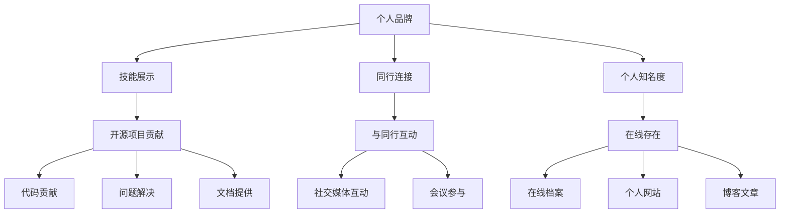

                 

**利用开源项目打造个人品牌**

**作者：禅与计算机程序设计艺术 / Zen and the Art of Computer Programming**

## 1. 背景介绍

在当今竞争激烈的技术行业，建立个人品牌至关重要。开源项目是展示技能、连接同行，并提高个人知名度的绝佳途径。本文将指导您如何利用开源项目打造个人品牌，从而提高您的职业发展和影响力。

## 2. 核心概念与联系

### 2.1 个人品牌的定义

个人品牌是您在技术行业中的名声和声誉的总和。它由您的技能、贡献、与同行的互动，以及您的在线存在组成。

### 2.2 开源项目的定义

开源项目是指任何人都可以访问、使用、修改和分发的软件。它们通常基于共享和协作的理念，由全球分布的开发者团队维护。

### 2.3 个人品牌与开源项目的联系

开源项目是展示技能、连接同行，并提高个人知名度的绝佳途径。通过贡献代码、解决问题、提供文档，您可以建立自己的个人品牌，并与同行建立联系。



## 3. 核心算法原理 & 具体操作步骤

### 3.1 算法原理概述

打造个人品牌的算法基于以下原理：

1. **选择正确的项目**：选择与您的技能和兴趣相关的项目。
2. **贡献代码**：提供高质量的代码，解决问题，并改进项目。
3. **与同行互动**：与项目成员互动，学习，并建立联系。
4. **建立在线存在**：维护个人档案，网站，博客，并分享您的见解。

### 3.2 算法步骤详解

1. **选择正确的项目**
   - 找到与您的技能和兴趣相关的项目。
   - 检查项目的活跃度、文档质量，以及维护者的反应速度。
   - 确保项目的许可证允许您贡献代码。

2. **贡献代码**
   -  Fork 项目，在本地创建分支。
   -  解决问题，改进项目，或添加新功能。
   -  编写单元测试，并确保您的更改没有引入 bug。
   -  创建 pull request，并等待维护者审查和合并。

3. **与同行互动**
   -  参加项目的会议和讨论。
   -  在项目的聊天频道或论坛上参与讨论。
   -  与其他贡献者合作，解决问题，或改进项目。

4. **建立在线存在**
   -  维护您的 GitHub、LinkedIn、Twitter 等在线档案。
   -  创建个人网站，展示您的项目，博客文章，和简历。
   -  定期分享技术文章，见解，或项目更新。

### 3.3 算法优缺点

**优点**：

- 提高个人知名度和影响力。
- 连接同行，并建立网络。
- 提高技能，并学习新技术。
- 为未来的就业机会做准备。

**缺点**：

- 需要大量时间和精力。
- 可能面临挫折，如 pull request 被拒绝。
- 需要与他人合作，可能会遇到不同的工作习惯和期望。

### 3.4 算法应用领域

- 编程语言：贡献代码，解决问题，或改进语言本身。
- 框架和库：改进框架，添加新功能，或解决 bug。
- 开源硬件：贡献设计，解决问题，或改进文档。
- 科学研究：贡献代码，解决问题，或改进项目。

## 4. 数学模型和公式 & 详细讲解 & 举例说明

### 4.1 数学模型构建

个人品牌的数学模型可以表示为：

$$P = f(S, C, I, N)$$

其中：

- $P$ 是个人品牌，
- $S$ 是技能展示，
- $C$ 是同行连接，
- $I$ 是个人知名度，
- $N$ 是在线存在。

### 4.2 公式推导过程

个人品牌 $P$ 是技能展示 $S$、同行连接 $C$、个人知名度 $I$、和在线存在 $N$ 的函数。每个因素都可以通过开源项目贡献、与同行互动、建立在线存在来提高。

### 4.3 案例分析与讲解

例如，假设您是一名 Python 开发者，想要提高个人品牌。您可以选择一个流行的 Python 项目，如 Django，并贡献代码来展示您的技能（$S$）。通过参加项目会议和讨论，您可以与同行建立联系（$C$）。通过分享技术文章和项目更新，您可以提高个人知名度（$I$）和在线存在（$N$）。通过这些努力，您的个人品牌 $P$ 将得到提高。

## 5. 项目实践：代码实例和详细解释说明

### 5.1 开发环境搭建

要开始贡献开源项目，您需要设置开发环境。这通常包括：

- Git：版本控制系统。
- 编辑器或 IDE：如 Visual Studio Code、PyCharm、或 Atom。
- 相关的语言和库：如 Python、JavaScript、或 C++。

### 5.2 源代码详细实现

以下是贡献开源项目的示例代码：

1. Fork 项目：
```bash
git clone https://github.com/user/project.git
cd project
git remote add upstream https://github.com/user/project.git
```

2. 创建分支：
```bash
git checkout -b new-feature
```

3. 编写代码：
```python
# 示例 Python 代码
def greet(name):
    return f"Hello, {name}!"
```

4. 提交更改：
```bash
git add.
git commit -m "Add new feature"
```

5. 创建 pull request：
```bash
git push origin new-feature
```

### 5.3 代码解读与分析

在上述示例中，我们 Fork 了项目，创建了新分支，编写了新代码，提交了更改，并创建了 pull request。维护者将审查您的更改，并决定是否合并到主项目中。

### 5.4 运行结果展示

如果您的 pull request 被接受，您的代码将合并到主项目中。您的贡献将永久记录在项目的提交历史中，并为项目的成功做出了贡献。

## 6. 实际应用场景

### 6.1 当前应用

开源项目已广泛应用于各种领域，从编程语言到操作系统，从框架和库到科学研究。它们是技术行业的基础设施，并为个人和组织提供了无数机会。

### 6.2 未来应用展望

未来，开源项目将继续扩展到新领域，如人工智能、物联网，和区块链。它们将继续为个人和组织提供机会，并推动技术的发展。

## 7. 工具和资源推荐

### 7.1 学习资源推荐

- **开源指南**：<https://opensource.guide/>
- **GitHub 文档**：<https://docs.github.com/en>
- **开源项目贡献指南**：<https://firstcontributions.github.io/>

### 7.2 开发工具推荐

- **Git**：<https://git-scm.com/>
- **Visual Studio Code**：<https://code.visualstudio.com/>
- **PyCharm**：<https://www.jetbrains.com/pycharm/>

### 7.3 相关论文推荐

- **Why Open Source Software / Why Open Source?**: <https://www.linuxjournal.com/article/4741>
- **The Cathedral and the Bazaar**: <https://www.catb.org/esr/writings/cathedral-bazaar/>

## 8. 总结：未来发展趋势与挑战

### 8.1 研究成果总结

本文介绍了如何利用开源项目打造个人品牌。我们讨论了核心概念、算法原理、数学模型，并提供了项目实践的示例。

### 8.2 未来发展趋势

开源项目将继续扩展到新领域，并为个人和组织提供机会。个人品牌将变得越来越重要，因为技术行业变得越来越竞争激烈。

### 8.3 面临的挑战

挑战包括需要大量时间和精力，可能面临挫折，以及需要与他人合作。然而，这些挑战可以通过坚持、学习，并与同行建立联系来克服。

### 8.4 研究展望

未来的研究可以关注开源项目的新领域，如人工智能和区块链。还可以研究个人品牌的新方法，如社交媒体和内容创作。

## 9. 附录：常见问题与解答

**Q：我应该选择哪个开源项目？**

**A：选择与您的技能和兴趣相关的项目。检查项目的活跃度、文档质量，以及维护者的反应速度。确保项目的许可证允许您贡献代码。**

**Q：我的 pull request 被拒绝了怎么办？**

**A：不要气馁。学习维护者的反馈，改进您的代码，并重新提交。与同行互动，学习，并建立联系。**

**Q：我该如何建立在线存在？**

**A：维护您的 GitHub、LinkedIn、Twitter 等在线档案。创建个人网站，展示您的项目，博客文章，和简历。定期分享技术文章，见解，或项目更新。**

## 结束语

利用开源项目打造个人品牌是技术行业中有效的策略。通过选择正确的项目，贡献代码，与同行互动，并建立在线存在，您可以提高个人知名度，连接同行，并提高技能。开始您的开源之旅吧！

**作者：禅与计算机程序设计艺术 / Zen and the Art of Computer Programming**

