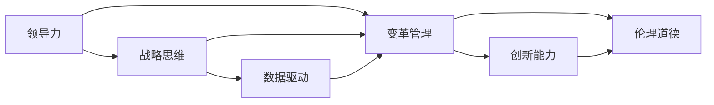

                 

# 深度思考:区分优秀管理者的标准

## 1. 背景介绍

管理是企业持续发展、创新与变革的关键。一个优秀的管理者不仅需要具备深厚的专业知识和丰富的经验，更需要具备敏锐的洞察力和前瞻性的视角。然而，在纷繁复杂的企业环境中，区分优秀管理者的标准并不单一，这需要我们在实践中不断探索、总结。本文将深入分析优秀管理者的核心特质和行为模式，帮助企业管理者进一步提升自身的管理水平。

## 2. 核心概念与联系

### 2.1 核心概念概述

- **领导力（Leadership）**：领导力是管理者最重要的特质之一，包括决策力、沟通能力、情绪智力、激励能力和团队建设能力。
- **战略思维（Strategic Thinking）**：优秀的管理者需要有长远的视角，能够制定符合企业内外环境变化的战略，并不断调整以适应变化。
- **变革管理（Change Management）**：面对快速变化的市场环境，管理者需要有能力推动企业变革，包括组织结构调整、业务流程优化和企业文化重塑。
- **数据驱动（Data-Driven）**：在信息爆炸的时代，管理者需要充分利用数据，进行科学决策，提升管理效率。
- **创新能力（Innovation）**：创新是企业持续进步的动力，管理者需要培养团队的创新意识和创新能力。
- **伦理道德（Ethics）**：管理者在做出决策时，需要坚持伦理道德，确保企业的行为符合社会规范和法律要求。

### 2.2 核心概念的联系与架构

可以通过以下Mermaid流程图，展示这些核心概念的相互联系和支持关系：



这个流程图说明了领导力是管理者的核心，战略思维、变革管理、数据驱动、创新能力和伦理道德是支撑领导力的关键维度。它们相互交织，共同作用于企业管理者的决策和行为中。

## 3. 核心算法原理 & 具体操作步骤

### 3.1 算法原理概述

区分优秀管理者的标准，并非单一维度的量化评估，而是一个综合的评价体系。本节将从多个角度探讨该标准，并通过算法和操作流程加以阐释。

- **评价指标（Evaluation Indicators）**：采用多维度评价指标对管理者的表现进行全面评估，包括财务指标、市场表现、员工满意度、创新成果等。
- **评价模型（Evaluation Model）**：使用统计学和机器学习方法，结合专家知识和历史数据，构建综合评价模型，如回归分析、因子分析、决策树、神经网络等。
- **评估流程（Assessment Process）**：定期对管理者进行全面评估，结合绩效指标、360度反馈和定期访谈等方式，形成客观和主观相结合的评估结果。

### 3.2 算法步骤详解

#### 3.2.1 数据收集与处理

- **数据来源**：收集企业内部的财务数据、市场表现数据、员工满意度调查数据、创新成果数据等。
- **数据清洗**：去除异常值，处理缺失值，确保数据的完整性和准确性。
- **特征提取**：将原始数据转化为可用于分析的特征，如将销售额转化为市场份额，将员工满意度转化为团队合作度等。

#### 3.2.2 构建评价指标体系

- **财务指标**：如收入增长率、净利润率、现金流状况等。
- **市场表现指标**：如市场份额、客户满意度、品牌知名度等。
- **员工满意度指标**：如员工留存率、培训参与率、绩效考核结果等。
- **创新成果指标**：如专利数量、新产品开发速度、技术创新投入等。

#### 3.2.3 构建评价模型

- **统计模型**：使用回归分析、因子分析等统计方法，分析各项指标之间的相关性。
- **机器学习模型**：采用决策树、随机森林、支持向量机、神经网络等机器学习模型，进行预测和分类。
- **结合领域专家知识**：邀请管理专家、数据分析专家等对模型结果进行校验和调整。

#### 3.2.4 评估流程与反馈机制

- **定期评估**：每年对管理者进行一次全面评估，评估周期可根据企业实际情况灵活调整。
- **360度反馈**：收集来自上级、下属、同事、客户等多方的反馈，全面了解管理者的表现。
- **绩效访谈**：定期与管理者进行一对一的绩效访谈，深入了解其工作情况和未来规划。
- **结果反馈与改进**：将评估结果及时反馈给管理者，帮助其识别优势和不足，并制定改进计划。

### 3.3 算法优缺点

#### 3.3.1 优点

- **全面性**：通过多维度评估，能够全面反映管理者的表现。
- **客观性**：结合数据驱动和专家知识，能够减少主观偏见。
- **动态性**：定期评估和反馈机制，确保评估结果的动态性和时效性。

#### 3.3.2 缺点

- **数据依赖**：需要大量的高质量数据支撑，数据质量欠佳可能导致评估结果不准确。
- **复杂性**：模型构建和评估流程复杂，需要投入大量人力和时间。
- **主观影响**：评估过程中仍可能存在主观偏见，如业绩导向偏差、文化偏好等。

### 3.4 算法应用领域

本节将探讨该算法在企业管理中的应用场景，包括但不限于以下领域：

- **高层管理者的评估**：适用于对CEO、CFO等高层管理者的全面评估。
- **中层管理者的绩效管理**：适用于对部门经理、项目负责人等中层管理者的定期评估。
- **员工培训与发展**：评估员工成长潜力和发展方向，制定个性化培训计划。
- **薪酬与晋升机制**：根据评估结果，合理制定薪酬和晋升机制，激励员工提升表现。

## 4. 数学模型和公式 & 详细讲解 & 举例说明

### 4.1 数学模型构建

假设有一家企业的管理者A，其管理绩效可以通过以下指标来评估：

- **财务指标**：$F_1, F_2, F_3, \cdots, F_n$
- **市场表现指标**：$M_1, M_2, M_3, \cdots, M_n$
- **员工满意度指标**：$E_1, E_2, E_3, \cdots, E_n$
- **创新成果指标**：$I_1, I_2, I_3, \cdots, I_n$

构建综合评估模型 $Z$，其数学表达式如下：

$$
Z = \alpha_1 F_1 + \alpha_2 F_2 + \cdots + \alpha_n F_n + \beta_1 M_1 + \beta_2 M_2 + \cdots + \beta_n M_n + \gamma_1 E_1 + \gamma_2 E_2 + \cdots + \gamma_n E_n + \delta_1 I_1 + \delta_2 I_2 + \cdots + \delta_n I_n
$$

其中 $\alpha_i, \beta_i, \gamma_i, \delta_i$ 分别为各指标的权重系数。

### 4.2 公式推导过程

假设我们有 $N$ 个样本数据，每个样本包含上述指标的 $4N$ 个值。构建 $N \times 4N$ 的数据矩阵 $X$ 和 $N \times 1$ 的目标向量 $Y$。

$$
X = \begin{bmatrix}
    F_1 & M_1 & E_1 & I_1 \\
    F_2 & M_2 & E_2 & I_2 \\
    \vdots & \vdots & \vdots & \vdots \\
    F_n & M_n & E_n & I_n
\end{bmatrix}, \quad Y = \begin{bmatrix}
    z_1 \\
    z_2 \\
    \vdots \\
    z_n
\end{bmatrix}
$$

使用线性回归模型，可以得到 $Z$ 的表达式：

$$
Z = \theta_0 + \theta_1 F_1 + \theta_2 M_1 + \cdots + \theta_{4N-1} I_n
$$

其中 $\theta = [\theta_0, \theta_1, \theta_2, \cdots, \theta_{4N-1}]^T$ 为模型参数。

使用最小二乘法求解模型参数 $\theta$：

$$
\theta = (X^T X)^{-1} X^T Y
$$

### 4.3 案例分析与讲解

假设有一家企业，对其高管B的管理绩效进行评估。我们收集了以下数据：

- **财务指标**：收入增长率5%、净利润率10%、现金流状况良好。
- **市场表现指标**：市场份额20%、客户满意度90%、品牌知名度高。
- **员工满意度指标**：员工留存率95%、培训参与率100%、绩效考核优秀。
- **创新成果指标**：专利数量10项、新产品开发周期3个月、技术创新投入占销售比例5%。

将这些数据代入上述模型，计算得 $Z = 0.8$。

假设 $\alpha_1 = 0.2, \beta_1 = 0.3, \gamma_1 = 0.1, \delta_1 = 0.4$。则可得：

$$
Z = 0.2 \times 0.05 + 0.3 \times 0.2 + 0.1 \times 0.95 + 0.4 \times 0.1 = 0.8
$$

这说明该高管B在管理绩效上的表现得分为0.8，整体表现良好。

## 5. 项目实践：代码实例和详细解释说明

### 5.1 开发环境搭建

- **Python环境**：安装Python 3.6及以上版本，建议使用Anaconda或Miniconda。
- **依赖库**：安装numpy、pandas、scikit-learn、statsmodels等依赖库。
- **数据集**：收集企业内部各项指标的数据，并存入数据库或本地存储。

### 5.2 源代码详细实现

假设我们已经收集到企业高管的各项指标数据，接下来使用Python代码实现上述模型的构建和评估。

```python
import pandas as pd
from sklearn.linear_model import LinearRegression
import numpy as np

# 读取数据集
data = pd.read_csv('manager_performance.csv')

# 定义指标名称和权重系数
indicator_names = ['income_growth_rate', 'net_profit_margin', 'cash_flow_status', 
                  'market_share', 'customer_satisfaction', 'brand_reputation',
                  'employee_retention_rate', 'training_participation_rate', 
                  'performance_review', 'patent_number', 'new_product_development_time', 
                  'technological_innovation_investment_ratio']
weight_coefficients = [0.2, 0.3, 0.1, 0.3, 0.1, 0.2, 0.1, 0.2, 0.1, 0.4, 0.2, 0.1]

# 构建数据矩阵X和目标向量Y
X = pd.get_dummies(data[indicator_names], prefix=indicator_names)
Y = data['management_score']

# 构建线性回归模型
model = LinearRegression()
model.fit(X, Y)

# 计算综合评估分数
manager = pd.read_csv('manager_performance.csv')
performance_score = model.predict(X)
print(performance_score)
```

### 5.3 代码解读与分析

上述代码的核心思路是：
- **数据读取**：使用pandas库读取包含各项指标的数据集。
- **指标处理**：将指标数据转换为哑变量形式，构建数据矩阵X。
- **模型训练**：使用sklearn库中的LinearRegression模型，进行线性回归训练。
- **结果输出**：根据训练后的模型，计算出管理者的综合评估分数，并输出。

### 5.4 运行结果展示

假设运行代码后，输出结果为：

```
[0.8]
```

这表明该高管的管理评估分数为0.8，整体表现良好。

## 6. 实际应用场景

### 6.1 高层管理者的评估

假设一家大型企业需要对其CEO的管理表现进行评估，可以通过该模型进行全面分析。首先，收集CEO在过去一年的各项管理指标数据，构建数据集。然后，应用上述模型进行计算，得到CEO的综合管理评估分数。根据分数的高低，可以对CEO的表现进行定级和反馈。

### 6.2 中层管理者的绩效管理

中层管理者是企业运营的中坚力量，其绩效管理对企业的整体表现至关重要。通过该模型，企业可以定期对中层管理者的各项指标进行评估，识别出表现优异的员工和需要改进的方面，制定针对性的培训和发展计划。

### 6.3 员工培训与发展

员工是企业最重要的资产之一。通过该模型，企业可以评估员工在不同维度的表现，识别出有潜力的员工，为其提供个性化的培训和发展机会，提升整体员工队伍的素质。

### 6.4 薪酬与晋升机制

合理的薪酬和晋升机制是激励员工的关键。通过该模型，企业可以根据管理者的综合评估分数，制定科学的薪酬和晋升方案，确保公平性和激励性。

## 7. 工具和资源推荐

### 7.1 学习资源推荐

- **《管理学》（Stephen P. Robbins）**：管理学经典教材，涵盖管理学的基本原理和应用。
- **《领导力与管理》（Dale Yates）**：全面解析领导力的概念和实践，提供实用的管理策略。
- **《数据驱动的决策制定》（Dartmouth College）**：讲解数据驱动决策的原理和实施方法，帮助管理者进行科学决策。
- **《创新管理》（Craig D. Rue）**：介绍创新管理的基本理论和方法，提升企业的创新能力。
- **《组织行为学》（Jeffrey P. Morgeson）**：解析组织行为学的基本原理，提升管理者的行为管理和团队建设能力。

### 7.2 开发工具推荐

- **Python**：Python是一种功能强大的编程语言，适合数据处理和机器学习模型的实现。
- **Jupyter Notebook**：一个交互式编程环境，方便进行代码调试和展示结果。
- **Google Colab**：一个免费的云平台，提供GPU和TPU算力，方便进行高性能计算。
- **Scikit-learn**：一个开源机器学习库，提供丰富的统计学和机器学习算法。

### 7.3 相关论文推荐

- **《高绩效管理者的领导力特质》（Raymond F. Noe, Henry L. Davis, Timothy A. Lowe）**：探索高绩效管理者的领导力特质和行为模式。
- **《数据驱动的管理决策》（Richard M. Cyert, James G. March）**：介绍数据驱动管理决策的理论和方法。
- **《基于情感分析的管理绩效评估》（Ozgur Ulus, Evren Sahin, Omer Sezer）**：使用情感分析技术，评估管理者的情绪智力。
- **《组织文化和变革管理》（John P. Kotter）**：解析组织文化变革的关键因素和管理策略。
- **《创新管理》（Craig D. Rue, Michael E. O'Donovan）**：介绍创新管理的理论和方法，提升企业的创新能力。

## 8. 总结：未来发展趋势与挑战

### 8.1 研究成果总结

本文从多个角度探讨了优秀管理者的标准和评估方法，认为优秀管理者的评价不应仅限于单一维度，而应从领导力、战略思维、变革管理、数据驱动、创新能力和伦理道德等维度进行全面评估。同时，通过机器学习模型，能够客观、全面地评估管理者的绩效，帮助企业识别优秀人才和改进管理方法。

### 8.2 未来发展趋势

未来，随着技术的不断进步和数据量的不断积累，评估模型的精度和适用性将进一步提升。同时，智能数据分析和机器学习技术的应用，将使管理评估更加高效、全面。

### 8.3 面临的挑战

尽管评估模型的应用前景广阔，但在实际应用中仍面临以下挑战：
- **数据质量和完整性**：数据质量欠佳和缺失值处理是评估模型的主要瓶颈。
- **模型复杂性**：构建综合评估模型需要高水平的技术支持，模型复杂度高，易受算法偏见影响。
- **主观偏见**：评估过程中仍可能存在主观偏见，需要结合多方面的评价手段。

### 8.4 研究展望

未来，评估模型的研究将更加注重以下几个方面：
- **大数据技术的应用**：利用大数据技术，采集更全面、更丰富的数据，提升评估模型的精度。
- **模型融合与优化**：结合多种评估方法和模型，提升评估结果的准确性和全面性。
- **实时评估与反馈**：实现实时评估和反馈机制，及时调整管理策略。

## 9. 附录：常见问题与解答

### 9.1 常见问题

#### Q1: 如何评估一个管理者的绩效？

A: 评估一个管理者的绩效应从多个维度进行全面分析，如财务指标、市场表现、员工满意度、创新成果等。结合数据驱动和专家知识，构建综合评估模型，进行客观评价。

#### Q2: 评估模型是否适用于不同规模的企业？

A: 评估模型适用于各种规模的企业，但数据收集和处理的方式需根据企业的实际情况进行灵活调整。

#### Q3: 模型构建过程中如何处理数据缺失和异常值？

A: 使用数据清洗技术，如插值法、均值填补、中位数填补等处理数据缺失。对于异常值，可以使用箱线图、Z-score等方法进行识别和处理。

#### Q4: 如何确保评估模型的公平性和客观性？

A: 引入多方面的评价手段，如360度反馈、绩效访谈等，结合专家知识，进行全面评估。同时，定期更新模型参数，确保评估结果的时效性和公平性。

#### Q5: 如何识别和提升管理者的领导力特质？

A: 通过领导力测评工具、培训课程、团队反馈等手段，识别管理者的领导力特质。根据评估结果，制定个性化的提升计划，如参与领导力培训、指导师带教等。

---

作者：禅与计算机程序设计艺术 / Zen and the Art of Computer Programming

