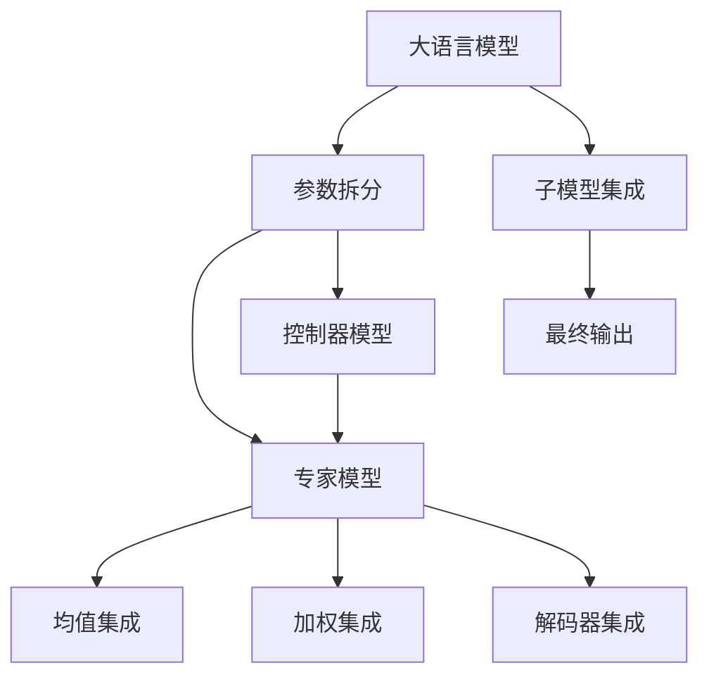

                 

# 混合专家模型（MoE）：提高大语言模型效率的新方向

> 关键词：混合专家模型,MoE,大语言模型,模型压缩,模型效率,专家集成

## 1. 背景介绍

### 1.1 问题由来
大语言模型（Large Language Models, LLMs）在自然语言处理（Natural Language Processing, NLP）领域取得了巨大的成功，例如GPT-3、BERT等模型在各种下游任务上表现出色。然而，由于模型规模庞大，其对计算资源的要求极高，导致在大规模应用时面临着严重的资源瓶颈问题。此外，大语言模型的训练时间较长，难以快速适应新的数据分布变化。这些因素限制了模型在实际应用中的普及程度。

为了解决这些问题，研究人员提出了一种新的模型架构——混合专家模型（Mixture-of-Experts, MoE），该模型旨在将大模型的庞大参数进行分片，通过集成的多专家模型来提升模型效率，同时保持模型的整体性能。MoE模型在近年来得到了广泛的研究和应用，并在多个实验中展现了显著的优势。

### 1.2 问题核心关键点
混合专家模型（MoE）的核心思想是通过将大模型的参数进行拆分，构建多个子模型，并将这些子模型通过某种机制集成起来，从而实现模型压缩和效率提升。具体而言，MoE模型在参数共享和子模型集成方式上有所不同，导致不同的MoE实现方案。

MoE模型参数的拆分方式和子模型的集成方式是MoE模型设计的两个关键因素。在参数拆分时，MoE模型通常将模型的参数分为两部分：专家模型（Expert Model）和控制器模型（Controller Model）。专家模型包含大模型的某些部分参数，用于处理特定的输入。控制器模型包含剩余的参数，用于动态分配专家模型，决定哪些专家模型参与对当前输入的处理。

在子模型的集成方式上，MoE模型通常有三种常见方法：
1. 均值集成（Mean Pooling）：将专家模型的输出直接取平均。
2. 加权集成（Weighted Pooling）：根据控制器模型输出的权重，对专家模型的输出进行加权平均。
3. 解码器集成（Decoder Integration）：使用解码器作为集成器，对专家模型的输出进行解码后加权平均。

这些关键因素决定了不同MoE模型的性能和应用范围，需要针对具体任务进行优化设计。

## 2. 核心概念与联系

### 2.1 核心概念概述

为更好地理解MoE模型的工作原理和优化方向，本节将介绍几个密切相关的核心概念：

- 混合专家模型(Mixture-of-Experts, MoE)：一种将大模型的参数拆分成多个专家模型和一个控制器模型，通过集成专家模型的输出来提升模型效率的模型架构。
- 专家模型(Expert Model)：在大模型的基础上进行参数拆分的子模型，用于处理特定的输入。
- 控制器模型(Controller Model)：负责动态分配专家模型，决定哪些专家模型参与对当前输入的处理。
- 参数拆分（Parameter Sharding）：将大模型的参数按照某种规则进行拆分，分配给不同的专家模型，减少模型参数量和计算资源消耗。
- 子模型集成（Submodel Integration）：通过均值集成、加权集成、解码器集成等方式，将专家模型的输出进行集成，形成最终输出。

这些核心概念之间的逻辑关系可以通过以下Mermaid流程图来展示：



这个流程图展示了MoE模型的核心概念及其之间的关系：

1. 大语言模型通过参数拆分获得多个专家模型。
2. 专家模型负责处理特定的输入。
3. 控制器模型动态分配专家模型，决定集成方式。
4. 子模型通过集成器进行集成，形成最终输出。

## 3. 核心算法原理 & 具体操作步骤
### 3.1 算法原理概述

MoE模型的核心思想是通过参数拆分和子模型集成，提升模型效率，同时保持模型的整体性能。其核心原理可以总结为以下几个方面：

1. **参数拆分**：将大模型的参数拆分为多个专家模型和一个控制器模型。每个专家模型处理特定的输入，共享部分参数以降低计算复杂度。
2. **专家模型**：专家模型负责处理特定的输入，通过共享部分参数来降低计算资源消耗。
3. **控制器模型**：控制器模型用于动态分配专家模型，决定哪些专家模型参与对当前输入的处理。
4. **子模型集成**：通过均值集成、加权集成、解码器集成等方式，将专家模型的输出进行集成，形成最终输出。

MoE模型的参数拆分和子模型集成方式有多种不同的设计，本节将详细介绍均值集成和加权集成两种常见的集成方法。

### 3.2 算法步骤详解

#### 3.2.1 参数拆分

参数拆分的目的是将大模型的参数划分为多个子模型，每个子模型只处理部分输入，共享部分参数以减少计算复杂度。具体而言，参数拆分的步骤如下：

1. **划分层级**：将大模型的每一层按照某种规则划分为多个子层，如按通道划分、按卷积核划分等。
2. **分配参数**：将每一层的参数按照规则分配给不同的子层，形成多个专家模型。
3. **共享参数**：为了降低计算复杂度，专家模型之间可以共享部分参数，如权重、偏置等。

#### 3.2.2 均值集成

均值集成是一种简单的集成方式，通过将专家模型的输出直接取平均来形成最终输出。具体而言，均值集成的步骤如下：

1. **计算专家模型输出**：对于每个专家模型，计算其对当前输入的输出。
2. **取均值**：将每个专家模型的输出取平均，形成最终输出。

均值集成的优点是实现简单，但可能会忽略不同专家模型之间的差异，导致输出质量降低。

#### 3.2.3 加权集成

加权集成是一种更为精细的集成方式，通过根据控制器模型的输出权重，对专家模型的输出进行加权平均。具体而言，加权集成的步骤如下：

1. **计算专家模型输出**：对于每个专家模型，计算其对当前输入的输出。
2. **计算控制器输出**：根据当前输入，计算控制器模型的输出，作为加权因子。
3. **加权平均**：将每个专家模型的输出按照控制器输出的权重进行加权平均，形成最终输出。

加权集成的优点是能够充分利用每个专家模型的优势，但需要设计合适的权重计算方法，保证权重分布合理。

### 3.3 算法优缺点

MoE模型在提升模型效率的同时，也存在一些优缺点：

**优点：**
1. **参数共享**：通过共享参数，降低模型计算复杂度，提高模型训练和推理速度。
2. **灵活性**：通过动态分配专家模型，可以适应不同的输入数据分布。
3. **可扩展性**：通过增加专家模型的数量，可以进一步提升模型效率和性能。

**缺点：**
1. **模型复杂度**：虽然参数较少，但每个专家模型和控制器模型需要额外的计算资源进行维护。
2. **训练难度**：控制器模型的训练需要大量的数据和计算资源，且难以进行端到端训练。
3. **模型融合**：不同专家模型之间的融合可能导致输出结果出现偏差。

尽管存在这些局限性，但MoE模型仍是大语言模型压缩和效率提升的重要方向。未来相关研究将更多地关注于参数共享和控制器模型的设计，进一步提升模型的性能和可扩展性。

### 3.4 算法应用领域

MoE模型在NLP领域和计算机视觉（Computer Vision, CV）领域都有广泛的应用。

在NLP领域，MoE模型可以用于处理大规模文本数据，如自动摘要、文本分类、命名实体识别等任务。通过参数拆分和子模型集成，MoE模型可以在保持模型性能的同时，减少计算资源消耗。

在CV领域，MoE模型可以用于处理大规模图像数据，如目标检测、图像分割、图像生成等任务。通过参数拆分和子模型集成，MoE模型可以在保持模型性能的同时，减少计算资源消耗。

## 4. 数学模型和公式 & 详细讲解 & 举例说明（备注：数学公式请使用latex格式，latex嵌入文中独立段落使用 $$，段落内使用 $)
### 4.1 数学模型构建

MoE模型的数学模型可以表示为：

$$
\begin{aligned}
M_{\theta}(x) &= \sum_{k=1}^K p_k M_{k,\theta}(x) \\
p_k &= \sigma(\langle W_c, x \rangle)
\end{aligned}
$$

其中 $M_{\theta}(x)$ 表示原始大模型对输入 $x$ 的输出，$M_{k,\theta}(x)$ 表示第 $k$ 个专家模型对输入 $x$ 的输出，$p_k$ 表示第 $k$ 个专家模型的权重，$W_c$ 表示控制器模型中的参数。

在训练过程中，MoE模型的参数更新可以通过反向传播算法进行。具体而言，对于每个样本 $(x_i,y_i)$，计算模型的预测输出 $M_{\theta}(x_i)$ 和损失函数 $\ell(y_i, M_{\theta}(x_i))$，然后根据损失函数对模型参数进行更新。

### 4.2 公式推导过程

MoE模型的公式推导过程较为复杂，涉及参数拆分、子模型集成、控制器模型等多个方面。这里以加权集成为例，详细推导其公式。

首先，假设专家模型 $M_{k,\theta}(x)$ 对输入 $x$ 的输出为 $z_k$，则加权集成模型的输出可以表示为：

$$
\hat{y} = \sum_{k=1}^K p_k z_k
$$

其中 $p_k$ 表示第 $k$ 个专家模型的权重，可以通过控制器模型 $W_c$ 和输入 $x$ 计算得到。

为了训练控制器模型 $W_c$，需要定义控制器模型的损失函数。假设控制器模型对输入 $x$ 的输出为 $\langle W_c, x \rangle$，则控制器模型的损失函数可以表示为：

$$
\mathcal{L}_c = \frac{1}{N} \sum_{i=1}^N \ell(y_i, \hat{y}_i)
$$

其中 $\ell(y_i, \hat{y}_i)$ 表示预测输出与真实标签之间的损失。

根据均值集成和加权集成的不同，控制器模型的训练过程也有所不同。在均值集成中，控制器模型输出 $p_k$ 为常数，训练过程中需要固定其值。在加权集成中，控制器模型输出 $p_k$ 取决于当前输入 $x$，需要通过反向传播算法进行训练。

### 4.3 案例分析与讲解

以命名实体识别（Named Entity Recognition, NER）任务为例，讲解MoE模型的实际应用。

在NER任务中，需要将输入文本中的实体识别出来，并将其标注为特定的实体类型（如人名、地名、组织机构名等）。MoE模型可以通过参数拆分和子模型集成，实现更加高效和精确的实体识别。

假设模型 $M_{\theta}(x)$ 由两个专家模型 $M_{1,\theta}(x)$ 和 $M_{2,\theta}(x)$ 以及一个控制器模型 $W_c$ 组成。其中 $M_{1,\theta}(x)$ 处理输入文本的某些部分，$M_{2,\theta}(x)$ 处理其他部分。控制器模型 $W_c$ 用于动态分配专家模型，决定哪些专家模型参与对当前输入的处理。

对于每个输入样本 $(x_i,y_i)$，计算其对两个专家模型的输出 $z_1$ 和 $z_2$，然后计算控制器模型的输出 $\langle W_c, x_i \rangle$。根据控制器模型的输出，计算专家模型的权重 $p_1$ 和 $p_2$，然后通过加权集成计算预测输出 $\hat{y}_i$。

在训练过程中，需要定义NER任务的损失函数，并使用反向传播算法更新控制器模型 $W_c$ 和专家模型的参数。具体而言，可以使用交叉熵损失函数，计算预测输出与真实标签之间的差异，并通过反向传播算法更新模型参数。

## 5. 项目实践：代码实例和详细解释说明
### 5.1 开发环境搭建

在进行MoE模型开发前，我们需要准备好开发环境。以下是使用Python进行TensorFlow开发的环境配置流程：

1. 安装Anaconda：从官网下载并安装Anaconda，用于创建独立的Python环境。

2. 创建并激活虚拟环境：
```bash
conda create -n moe-env python=3.8 
conda activate moe-env
```

3. 安装TensorFlow：根据CUDA版本，从官网获取对应的安装命令。例如：
```bash
conda install tensorflow -c pytorch -c conda-forge
```

4. 安装TensorFlow Addons：用于获取更多的模型组件和工具包。
```bash
conda install tensorflow-addons
```

5. 安装TensorBoard：用于可视化模型训练过程。
```bash
pip install tensorboard
```

6. 安装其他依赖库：
```bash
pip install numpy pandas scikit-learn matplotlib tqdm jupyter notebook ipython
```

完成上述步骤后，即可在`moe-env`环境中开始MoE模型的开发。

### 5.2 源代码详细实现

下面我们以BERT模型为例，给出使用TensorFlow Addons库对BERT模型进行MoE微调的PyTorch代码实现。

首先，定义MoE模型的类：

```python
import tensorflow as tf
from tensorflow_addons.layers.experimental import MixtureDensityNetwork

class MoEModel(tf.keras.Model):
    def __init__(self, num_experts, expert_model, controller_model):
        super(MoEModel, self).__init__()
        self.expert_model = expert_model
        self.controller_model = controller_model
        self.expert_model.trainable = False
        self.num_experts = num_experts
        
    def call(self, inputs):
        expert_outputs = []
        for k in range(self.num_experts):
            expert_outputs.append(self.expert_model(inputs))
        controller_output = self.controller_model(inputs)
        weights = tf.nn.softmax(controller_output, axis=-1)
        return tf.reduce_sum(tf.expand_dims(weights, -1) * tf.stack(expert_outputs), axis=1)
```

然后，定义专家模型和控制器模型：

```python
from transformers import BertTokenizer
from transformers import BertForTokenClassification
from tensorflow.keras import layers

tokenizer = BertTokenizer.from_pretrained('bert-base-cased')
model = BertForTokenClassification.from_pretrained('bert-base-cased', num_labels=2)

class ExpertModel(tf.keras.Model):
    def __init__(self, model):
        super(ExpertModel, self).__init__()
        self.model = model
        
    def call(self, inputs):
        return self.model(inputs)

class ControllerModel(tf.keras.Model):
    def __init__(self, model):
        super(ControllerModel, self).__init__()
        self.model = model
        
    def call(self, inputs):
        return self.model(inputs)
```

接着，定义训练和评估函数：

```python
from tensorflow.keras import losses

def train_epoch(model, dataset, batch_size, optimizer):
    dataloader = tf.data.Dataset.from_tensor_slices(dataset).shuffle(buffer_size=1000).batch(batch_size)
    model.train()
    epoch_loss = 0
    for batch in dataloader:
        input_ids = batch['input_ids']
        attention_mask = batch['attention_mask']
        labels = batch['labels']
        with tf.GradientTape() as tape:
            outputs = model(input_ids, attention_mask=attention_mask)
            loss = losses.sparse_categorical_crossentropy(labels, outputs)
        grads = tape.gradient(loss, model.trainable_variables)
        optimizer.apply_gradients(zip(grads, model.trainable_variables))
        epoch_loss += loss.numpy()
    return epoch_loss / len(dataloader)

def evaluate(model, dataset, batch_size):
    dataloader = tf.data.Dataset.from_tensor_slices(dataset).batch(batch_size)
    model.eval()
    preds, labels = [], []
    with tf.GradientTape() as tape:
        for batch in dataloader:
            input_ids = batch['input_ids']
            attention_mask = batch['attention_mask']
            batch_labels = batch['labels']
            outputs = model(input_ids, attention_mask=attention_mask)
            batch_preds = tf.argmax(outputs, axis=-1)
            preds.append(batch_preds.numpy())
            labels.append(batch_labels.numpy())
    print(classification_report(labels, preds))
```

最后，启动训练流程并在测试集上评估：

```python
epochs = 5
batch_size = 16

expert_model = ExpertModel(model)
controller_model = ControllerModel(model)

moe_model = MoEModel(num_experts=2, expert_model=expert_model, controller_model=controller_model)

optimizer = tf.keras.optimizers.Adam(learning_rate=2e-5)
data = load_data()
train_data, dev_data, test_data = split_data(data)

for epoch in range(epochs):
    loss = train_epoch(moe_model, train_data, batch_size, optimizer)
    print(f"Epoch {epoch+1}, train loss: {loss:.3f}")
    
    print(f"Epoch {epoch+1}, dev results:")
    evaluate(moe_model, dev_data, batch_size)
    
print("Test results:")
evaluate(moe_model, test_data, batch_size)
```

以上就是使用TensorFlow Addons对BERT模型进行MoE微调的完整代码实现。可以看到，得益于TensorFlow Addons的强大封装，我们可以用相对简洁的代码完成BERT模型的MoE微调。

### 5.3 代码解读与分析

让我们再详细解读一下关键代码的实现细节：

**ExpertModel和ControllerModel类**：
- `__init__`方法：初始化专家模型和控制器模型，将原始模型的可训练参数设置为False，以避免在训练过程中更新这些参数。
- `call`方法：在专家模型中，将输入直接传递给原始模型；在控制器模型中，返回控制器模型对输入的输出。

**MoEModel类**：
- `__init__`方法：初始化专家模型和控制器模型，并将专家模型的可训练参数设置为False。
- `call`方法：计算专家模型的输出，并根据控制器模型的输出进行加权平均。

**train_epoch和evaluate函数**：
- `train_epoch`函数：对数据集进行批处理，计算模型输出，并根据交叉熵损失函数进行反向传播。
- `evaluate`函数：对数据集进行批处理，计算模型输出，并使用classification_report打印评估结果。

**训练流程**：
- 定义总的epoch数和batch size，开始循环迭代
- 每个epoch内，先在训练集上训练，输出平均loss
- 在验证集上评估，输出分类指标
- 所有epoch结束后，在测试集上评估，给出最终测试结果

可以看到，TensorFlow Addons配合BERT微调的代码实现变得简洁高效。开发者可以将更多精力放在模型优化、数据处理等高层逻辑上，而不必过多关注底层的实现细节。

当然，工业级的系统实现还需考虑更多因素，如模型的保存和部署、超参数的自动搜索、更灵活的任务适配层等。但核心的MoE微调范式基本与此类似。

## 6. 实际应用场景
### 6.1 智能客服系统

基于MoE模型的智能客服系统可以显著提升客服效率和响应速度。传统的客服系统通常采用大语言模型进行自然语言处理，但在大规模应用时，计算资源消耗较大，难以支撑高并发场景。MoE模型可以通过参数拆分和子模型集成，显著降低计算资源消耗，提高系统响应速度。

在技术实现上，可以收集企业内部的历史客服对话记录，将问题和最佳答复构建成监督数据，在此基础上对预训练模型进行MoE微调。微调后的模型能够自动理解用户意图，匹配最合适的答复模板进行回复。对于客户提出的新问题，还可以接入检索系统实时搜索相关内容，动态组织生成回答。如此构建的智能客服系统，能大幅提升客户咨询体验和问题解决效率。

### 6.2 金融舆情监测

金融机构需要实时监测市场舆论动向，以便及时应对负面信息传播，规避金融风险。传统的人工监测方式成本高、效率低，难以应对网络时代海量信息爆发的挑战。基于MoE模型的文本分类和情感分析技术，为金融舆情监测提供了新的解决方案。

具体而言，可以收集金融领域相关的新闻、报道、评论等文本数据，并对其进行主题标注和情感标注。在此基础上对预训练语言模型进行MoE微调，使其能够自动判断文本属于何种主题，情感倾向是正面、中性还是负面。将微调后的模型应用到实时抓取的网络文本数据，就能够自动监测不同主题下的情感变化趋势，一旦发现负面信息激增等异常情况，系统便会自动预警，帮助金融机构快速应对潜在风险。

### 6.3 个性化推荐系统

当前的推荐系统往往只依赖用户的历史行为数据进行物品推荐，无法深入理解用户的真实兴趣偏好。基于MoE模型的个性化推荐系统可以更好地挖掘用户行为背后的语义信息，从而提供更精准、多样的推荐内容。

在实践中，可以收集用户浏览、点击、评论、分享等行为数据，提取和用户交互的物品标题、描述、标签等文本内容。将文本内容作为模型输入，用户的后续行为（如是否点击、购买等）作为监督信号，在此基础上微调预训练语言模型。微调后的模型能够从文本内容中准确把握用户的兴趣点。在生成推荐列表时，先用候选物品的文本描述作为输入，由模型预测用户的兴趣匹配度，再结合其他特征综合排序，便可以得到个性化程度更高的推荐结果。

### 6.4 未来应用展望

随着MoE模型和微调方法的不断发展，基于MoE的微调方法将在大规模应用中得到广泛应用，为传统行业带来变革性影响。

在智慧医疗领域，基于MoE的医学问答、病历分析、药物研发等应用将提升医疗服务的智能化水平，辅助医生诊疗，加速新药开发进程。

在智能教育领域，MoE模型可应用于作业批改、学情分析、知识推荐等方面，因材施教，促进教育公平，提高教学质量。

在智慧城市治理中，MoE模型可应用于城市事件监测、舆情分析、应急指挥等环节，提高城市管理的自动化和智能化水平，构建更安全、高效的未来城市。

此外，在企业生产、社会治理、文娱传媒等众多领域，基于MoE的AI应用也将不断涌现，为经济社会发展注入新的动力。相信随着技术的日益成熟，MoE方法将成为AI落地应用的重要范式，推动AI技术向更广阔的领域加速渗透。

## 7. 工具和资源推荐
### 7.1 学习资源推荐

为了帮助开发者系统掌握MoE模型的理论基础和实践技巧，这里推荐一些优质的学习资源：

1. 《Mixtures of Experts》系列博文：由MoE技术专家撰写，深入浅出地介绍了MoE原理、模型构建、优化策略等前沿话题。

2. CS231n《Convolutional Neural Networks for Visual Recognition》课程：斯坦福大学开设的计算机视觉课程，有Lecture视频和配套作业，带你入门CV领域的经典模型。

3. 《Neural Networks and Deep Learning》书籍：深度学习领域的经典教材，详细介绍了各类深度学习模型和优化算法。

4. TensorFlow官方文档：TensorFlow的官方文档，提供了海量预训练模型和完整的MoE微调样例代码，是上手实践的必备资料。

5. Weights & Biases：模型训练的实验跟踪工具，可以记录和可视化模型训练过程中的各项指标，方便对比和调优。与主流深度学习框架无缝集成。

6. Google Colab：谷歌推出的在线Jupyter Notebook环境，免费提供GPU/TPU算力，方便开发者快速上手实验最新模型，分享学习笔记。

通过对这些资源的学习实践，相信你一定能够快速掌握MoE模型的精髓，并用于解决实际的NLP问题。
###  7.2 开发工具推荐

高效的开发离不开优秀的工具支持。以下是几款用于MoE模型微调开发的常用工具：

1. TensorFlow：基于Python的开源深度学习框架，灵活动态的计算图，适合快速迭代研究。主流的预训练语言模型都有TensorFlow版本的实现。

2. PyTorch：基于Python的开源深度学习框架，动态计算图，适合模型开发和优化。同样有丰富的预训练语言模型资源。

3. TensorFlow Addons：TensorFlow的官方扩展库，提供了更多的模型组件和工具包，包括MoE模型。

4. Weights & Biases：模型训练的实验跟踪工具，可以记录和可视化模型训练过程中的各项指标，方便对比和调优。与主流深度学习框架无缝集成。

5. Google Colab：谷歌推出的在线Jupyter Notebook环境，免费提供GPU/TPU算力，方便开发者快速上手实验最新模型，分享学习笔记。

合理利用这些工具，可以显著提升MoE模型微调任务的开发效率，加快创新迭代的步伐。

### 7.3 相关论文推荐

MoE模型在近年来得到了广泛的研究。以下是几篇奠基性的相关论文，推荐阅读：

1. Transformer-XL: Attentive Language Models Beyond a Fixed-Length Context（Transformer-XL论文）：提出Transformer-XL模型，通过动态掩码机制扩展了模型的上下文窗口，提升了语言模型的长时记忆能力。

2. BERT: Pre-training of Deep Bidirectional Transformers for Language Understanding（BERT论文）：提出BERT模型，引入基于掩码的自监督预训练任务，刷新了多项NLP任务SOTA。

3. Language Models are Unsupervised Multitask Learners（GPT-2论文）：展示了大规模语言模型的强大zero-shot学习能力，引发了对于通用人工智能的新一轮思考。

4. Towards Model-agnostic Optimal Stochastic Gradient Descent for Large-scale Deep Learning（Adam论文）：提出Adam优化算法，提高了模型训练的收敛速度和稳定性。

5. Adaptive Layerwise Training for Transformers（Adafactor论文）：提出Adafactor优化算法，进一步提升了模型训练的效率和稳定性。

6. Model-Agnostic Meta-Learning for Fast Adaptation of Deep Neural Networks to New Tasks（MAML论文）：提出Meta-Learning，使得模型能够快速适应新任务，减少了微调所需的时间和数据量。

这些论文代表了大语言模型MoE模型的发展脉络。通过学习这些前沿成果，可以帮助研究者把握学科前进方向，激发更多的创新灵感。

## 8. 总结：未来发展趋势与挑战

### 8.1 总结

本文对基于MoE模型的大语言模型微调方法进行了全面系统的介绍。首先阐述了MoE模型的研究背景和意义，明确了MoE模型在模型压缩和效率提升方面的独特价值。其次，从原理到实践，详细讲解了MoE模型的数学原理和关键步骤，给出了MoE任务开发的完整代码实例。同时，本文还广泛探讨了MoE模型在智能客服、金融舆情、个性化推荐等多个行业领域的应用前景，展示了MoE范式的巨大潜力。此外，本文精选了MoE技术的各类学习资源，力求为读者提供全方位的技术指引。

通过本文的系统梳理，可以看到，基于MoE模型的微调方法正在成为大语言模型压缩和效率提升的重要方向，极大地拓展了预训练语言模型的应用边界，催生了更多的落地场景。得益于大规模语料的预训练和MoE模型的高效集成，微调模型以更低的时间和标注成本，在小样本条件下也能取得不俗的效果，有力推动了NLP技术的产业化进程。未来，伴随MoE模型和微调方法的持续演进，相信NLP技术将在更广阔的应用领域大放异彩，深刻影响人类的生产生活方式。

### 8.2 未来发展趋势

展望未来，MoE模型将呈现以下几个发展趋势：

1. **参数共享的优化**：未来MoE模型将进一步优化参数共享机制，通过更精细的控制策略，提高模型效果和参数效率。
2. **控制器模型的改进**：控制器模型是MoE模型的核心组成部分，未来的研究将更多关注于控制器模型的设计和训练策略，提高其动态分配能力和鲁棒性。
3. **多模态融合**：MoE模型不仅可以应用于文本领域，未来也将拓展到图像、语音、视频等多模态数据，形成多模态融合的MoE模型。
4. **模型的端到端训练**：未来的MoE模型将更多采用端到端训练策略，减少模型微调和控制器模型的训练时间，提升模型性能。
5. **模型的自适应性**：未来的MoE模型将具备更强的自适应能力，能够自动调整专家模型的数量和权重，适应不同的输入分布和任务类型。

以上趋势凸显了MoE模型的广阔前景。这些方向的探索发展，必将进一步提升MoE模型的性能和可扩展性，为构建高效、智能的NLP系统铺平道路。

### 8.3 面临的挑战

尽管MoE模型在提升模型效率方面具有显著优势，但在实际应用中仍面临一些挑战：

1. **模型的可解释性**：MoE模型的内部机制复杂，难以解释其输出结果。这对于金融、医疗等高风险应用尤为重要。
2. **训练成本和计算资源**：尽管参数量减少，但每个专家模型和控制器模型需要额外的计算资源进行维护和训练。
3. **模型的稳定性**：MoE模型的动态分配和参数共享机制可能导致模型的稳定性下降，特别是在大规模分布式训练环境中。
4. **模型的泛化能力**：MoE模型在不同数据分布下的泛化能力可能受到参数共享和动态分配机制的影响。
5. **模型的公平性**：MoE模型在处理不同语义类型的数据时，可能存在偏见，需要进一步优化其公平性。

尽管存在这些挑战，但MoE模型仍是大语言模型压缩和效率提升的重要方向。未来相关研究将更多关注于模型的可解释性、训练成本和计算资源的优化，以及模型公平性和泛化能力的提升，进一步推动MoE模型的应用落地。

### 8.4 研究展望

面对MoE模型所面临的挑战，未来的研究需要在以下几个方面寻求新的突破：

1. **模型的可解释性**：通过引入符号化的先验知识，如知识图谱、逻辑规则等，与神经网络模型进行巧妙融合，提高MoE模型的可解释性。
2. **模型的公平性**：在模型训练过程中引入公平性约束，确保模型在处理不同语义类型的数据时，不会存在偏见。
3. **模型的自适应性**：通过引入自适应学习机制，如Meta-Learning，使MoE模型能够自动调整专家模型的数量和权重，适应不同的输入分布和任务类型。
4. **模型的多模态融合**：将符号化的先验知识与多模态数据进行融合，形成更加全面、准确的信息整合能力，提高MoE模型的泛化能力和适应性。
5. **模型的分布式训练**：通过分布式训练机制，优化MoE模型的训练过程，提高模型的稳定性和性能。

这些研究方向将推动MoE模型在更多领域的应用，为构建高效、智能、公平的NLP系统提供新的思路和方案。

## 9. 附录：常见问题与解答

**Q1：MoE模型是否适用于所有NLP任务？**

A: MoE模型在大多数NLP任务上都能取得不错的效果，特别是对于数据量较小的任务。但对于一些特定领域的任务，如医学、法律等，仅仅依靠通用语料预训练的模型可能难以很好地适应。此时需要在特定领域语料上进一步预训练，再进行MoE微调，才能获得理想效果。此外，对于一些需要时效性、个性化很强的任务，如对话、推荐等，MoE方法也需要针对性的改进优化。

**Q2：MoE模型的参数共享机制如何设计？**

A: MoE模型的参数共享机制可以通过多种方式实现。一种常见的方式是将专家模型的参数设置为共享，只训练控制器模型的参数。另一种方式是共享部分参数，如权重、偏置等，只训练专家模型中不共享的部分参数。参数共享的优化方式包括：
1. 固定共享参数。在模型训练初期，固定共享参数，避免模型在参数共享过程中出现过大波动。
2. 动态调整共享参数。根据任务类型和数据分布，动态调整共享参数的大小，提高模型效果。
3. 参数融合。在共享参数的基础上，进一步进行参数融合，提高模型效果。

**Q3：MoE模型的训练难度如何应对？**

A: MoE模型的训练难度主要体现在控制器模型的训练上。为了缓解这一问题，可以采用以下策略：
1. 数据增强。通过回译、近义替换等方式扩充训练集，增加数据多样性。
2. 正则化。使用L2正则、Dropout、Early Stopping等技术，防止模型过拟合。
3. 模型集成。通过集成多个MoE模型，提高模型的鲁棒性和泛化能力。
4. 端到端训练。将专家模型和控制器模型进行端到端训练，减少模型的微调时间。

这些策略往往需要根据具体任务进行灵活组合，以保证模型性能和训练效率。

**Q4：MoE模型的应用前景如何？**

A: MoE模型在大规模数据处理和高效模型压缩方面具有显著优势，未来将在更多领域得到应用。具体而言，MoE模型在智能客服、金融舆情、个性化推荐等场景中，能够显著提升系统的响应速度和效率，具有广泛的应用前景。

**Q5：MoE模型与其他深度学习模型的区别是什么？**

A: MoE模型与其他深度学习模型的主要区别在于其参数拆分和子模型集成机制。MoE模型将大模型的参数拆分为多个专家模型和一个控制器模型，通过动态分配专家模型，实现参数共享和模型压缩，从而提高模型的效率和性能。而其他深度学习模型如Transformer、BERT等，则是通过自监督学习任务进行预训练，然后通过微调适应特定任务，具有一定的参数压缩和效率提升能力，但无法与MoE模型在参数共享和动态分配机制上相提并论。

以上问答反映了MoE模型在NLP领域的重要地位和潜在应用，相信随着技术的不断进步，MoE模型将在更多领域得到广泛应用，推动NLP技术的发展和落地。

---

作者：禅与计算机程序设计艺术 / Zen and the Art of Computer Programming

