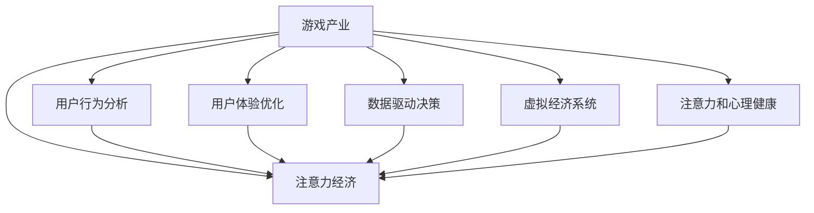

                 

# 游戏产业在注意力经济中的角色

> 关键词：游戏产业,注意力经济,用户行为分析,用户体验优化,数据驱动决策,虚拟经济

## 1. 背景介绍

### 1.1 问题由来

随着互联网的迅猛发展，注意力经济日益成为数字时代的重要趋势。用户的时间和注意力成为稀缺资源，成为各大平台和公司竞相争夺的焦点。游戏产业作为一个高度依赖用户注意力的大型行业，在这一背景下扮演了关键角色。

游戏作为人类的心理需求和娱乐方式，能够有效吸引和保持用户的注意力。在互联网环境下，游戏产业不仅能为用户提供高质量的娱乐内容，还能通过数据分析和技术手段，优化用户体验，提升用户留存率和粘性，带动整个数字经济的持续增长。

然而，随着游戏产业的快速发展，也带来了诸多挑战。用户注意力分散、游戏成瘾等问题日益突出，如何在保障用户健康的同时，最大化发挥游戏的经济价值，成为当前游戏产业发展的重要课题。

### 1.2 问题核心关键点

当前，游戏产业在注意力经济中的核心关键点包括：

- **用户行为分析**：通过对用户的游戏行为数据进行深度分析，了解用户偏好，预测用户需求，优化游戏设计。
- **用户体验优化**：利用技术手段提升游戏画面、声音、交互等方面体验，增加用户黏性，提高用户满意度。
- **数据驱动决策**：基于大数据和AI技术，从海量用户数据中提取洞察，指导游戏开发和运营策略，提升决策效率和准确性。
- **虚拟经济系统**：通过建立虚拟经济系统，丰富游戏内货币和物品交换机制，提升游戏经济活力，促进用户消费。
- **注意力和心理健康**：注重游戏对用户注意力和心理健康的保护，防止过度游戏带来的负面影响。

这些关键点共同构成了游戏产业在注意力经济中的重要地位和作用。通过深入挖掘和应用这些核心点，游戏产业能够在注意力经济的浪潮中，为整个数字经济带来新的增长点和发展动力。

## 2. 核心概念与联系

### 2.1 核心概念概述

为更好地理解游戏产业在注意力经济中的角色，本节将介绍几个关键概念：

- **游戏产业**：包括游戏开发、游戏发行、游戏运营等环节，涉及游戏设计、编程、美术、策划等多个岗位。游戏产业的发展极大地推动了数字娱乐和数字经济的发展。
- **注意力经济**：以用户注意力为关键资源，通过各种手段吸引和保持用户注意力的经济模式。注意力经济的核心在于如何高效利用用户的时间和注意力。
- **用户行为分析**：通过数据分析和机器学习技术，对用户的游戏行为进行挖掘和分析，理解用户需求和行为模式，为游戏优化提供依据。
- **用户体验优化**：通过改进游戏界面、增强互动体验、优化游戏流程等手段，提升用户的游戏体验，增加用户黏性和满意度。
- **数据驱动决策**：基于大数据和AI技术，从海量用户数据中提取有价值的信息，指导游戏开发、运营策略，提升决策效率和准确性。
- **虚拟经济系统**：通过游戏内虚拟物品和货币的交易，构建一个虚拟经济体系，促进用户之间的互动和消费，提升游戏经济活力。
- **注意力和心理健康**：关注游戏对用户注意力和心理健康的潜在影响，采取措施保护用户免受游戏成瘾等问题困扰。

这些概念之间通过数据、技术和用户等元素紧密联系，共同构建了游戏产业在注意力经济中的基础框架。

### 2.2 核心概念原理和架构的 Mermaid 流程图



这个流程图展示了游戏产业与注意力经济之间的联系和互动。游戏产业通过分析用户行为、优化用户体验、数据驱动决策、构建虚拟经济系统、关注用户心理健康的多个环节，共同作用于注意力经济，吸引和保持用户的注意力，从而实现商业价值。

## 3. 核心算法原理 & 具体操作步骤
### 3.1 算法原理概述

游戏产业在注意力经济中的核心算法原理主要包括以下几个方面：

- **用户行为分析**：通过统计学、机器学习等技术，对用户的游戏行为数据进行分析和建模，预测用户的行为模式，为游戏优化提供依据。
- **用户体验优化**：利用图像处理、声音设计、界面优化等技术手段，提升游戏的视觉和听觉效果，增强互动性，增加用户粘性。
- **数据驱动决策**：通过数据挖掘、机器学习等技术，从海量用户数据中提取洞察，指导游戏开发和运营策略，提升决策效率和准确性。
- **虚拟经济系统**：构建游戏内虚拟物品和货币的交换机制，通过游戏内交易增加用户互动和消费，提升游戏经济活力。
- **注意力和心理健康保护**：利用心理学和技术手段，监测用户游戏时间和行为，预防游戏成瘾，关注用户心理状态，保障用户健康。

这些算法原理通过技术手段实现，有效地帮助游戏产业在注意力经济中发挥其独特作用。

### 3.2 算法步骤详解

**Step 1: 数据收集与预处理**
- 收集用户的游戏行为数据，包括但不限于点击、滑动、停留时间、购买行为等。
- 对数据进行清洗和预处理，去除无效数据，补全缺失值，标准化数据格式。

**Step 2: 用户行为分析**
- 使用统计学方法对用户行为数据进行描述性分析，如均值、方差、分布等。
- 使用机器学习算法对用户行为进行建模，如聚类分析、关联规则、预测模型等，以发现用户行为模式和关联规则。
- 对模型进行评估和验证，确保模型的准确性和可靠性。

**Step 3: 用户体验优化**
- 对游戏界面进行视觉和交互优化，提升用户体验。
- 设计合理的游戏关卡和任务，增加互动性和趣味性。
- 通过A/B测试等方法，验证优化效果，选取最佳方案。

**Step 4: 数据驱动决策**
- 利用数据挖掘技术，从用户行为数据中提取有价值的信息，如用户偏好、消费习惯等。
- 使用机器学习模型，如分类、回归、聚类等，预测用户需求和行为，指导游戏开发和运营策略。
- 定期更新数据，持续优化模型，提升决策效果。

**Step 5: 虚拟经济系统构建**
- 设计合理的虚拟物品和货币交换机制，增加用户互动和消费。
- 通过游戏内活动和奖励机制，激励用户进行虚拟交易，提升游戏经济活力。
- 监控虚拟经济系统运行情况，调整策略，保障系统健康稳定。

**Step 6: 注意力和心理健康保护**
- 监测用户游戏时间和行为，预防游戏成瘾。
- 通过心理学技术，关注用户心理状态，提供心理支持和干预措施。
- 定期更新监测和干预机制，保障用户健康。

### 3.3 算法优缺点

游戏产业在注意力经济中的算法优点包括：

- **提升用户体验**：通过优化用户体验，增加用户粘性和满意度，促进用户长期留存。
- **数据驱动决策**：基于大数据和AI技术，从海量用户数据中提取洞察，提升决策效率和准确性。
- **丰富游戏内容**：通过构建虚拟经济系统，增加游戏内互动和消费，提升游戏经济活力。
- **个性化推荐**：通过用户行为分析，进行个性化推荐，提升用户满意度和留存率。

然而，这些算法也存在一些局限性：

- **数据隐私问题**：在游戏行为数据的收集和分析过程中，可能会侵犯用户隐私。
- **算力消耗大**：大规模数据分析和机器学习模型训练需要大量的算力和资源。
- **算法复杂度高**：复杂算法的应用可能增加开发和维护成本。
- **模型可解释性不足**：复杂的机器学习模型可能缺乏可解释性，难以理解其内部工作机制。
- **依赖用户数据**：算法效果依赖于高质量的用户数据，数据不足可能导致算法失效。

尽管存在这些局限性，游戏产业在注意力经济中的算法仍在不断优化和改进，通过技术创新和应用实践，逐步克服了这些挑战。

### 3.4 算法应用领域

游戏产业在注意力经济中的应用领域广泛，涵盖游戏开发、游戏发行、游戏运营等各个环节。以下是几个典型的应用领域：

- **游戏设计**：通过用户行为分析，了解用户偏好，指导游戏设计，增加用户黏性。
- **游戏优化**：利用用户体验优化和数据驱动决策，提升游戏界面和流程，增加用户留存率和满意度。
- **游戏营销**：通过数据分析和用户行为预测，制定精准的营销策略，提升用户转化率。
- **游戏社区管理**：利用社区行为数据，管理游戏社区，提升用户互动和反馈质量。
- **游戏心理辅导**：通过用户心理状态监测和干预，预防游戏成瘾，关注用户心理健康。

这些应用领域展示了游戏产业在注意力经济中的重要地位和广泛影响。通过不断优化和创新，游戏产业能够更好地吸引和保持用户注意力，推动数字经济的持续发展。

## 4. 数学模型和公式 & 详细讲解 & 举例说明

### 4.1 数学模型构建

本节将使用数学语言对游戏产业在注意力经济中的核心算法进行更加严格的刻画。

记用户行为数据集为 $D=\{(x_i, y_i)\}_{i=1}^N$，其中 $x_i$ 为游戏行为特征向量，$y_i$ 为用户行为标签（如购买、停留时间等）。定义一个线性回归模型 $y = \theta^T x + b$，其中 $\theta$ 为模型参数，$b$ 为偏置项。

假设模型在数据集 $D$ 上的损失函数为均方误差损失，则经验风险为：

$$
\mathcal{L}(\theta) = \frac{1}{N}\sum_{i=1}^N (y_i - \theta^T x_i - b)^2
$$

优化目标是找到最优参数 $\theta^*$，使得损失函数最小化：

$$
\theta^* = \mathop{\arg\min}_{\theta} \mathcal{L}(\theta)
$$

使用梯度下降等优化算法，最小化损失函数，更新模型参数。

### 4.2 公式推导过程

以下我们以用户行为预测为例，推导线性回归模型的公式及其梯度更新公式。

假设模型 $y = \theta^T x + b$，其中 $\theta$ 为模型参数，$b$ 为偏置项。定义模型在数据集 $D$ 上的均方误差损失为：

$$
\mathcal{L}(\theta) = \frac{1}{N}\sum_{i=1}^N (y_i - \theta^T x_i - b)^2
$$

求损失函数对参数 $\theta$ 的梯度，得：

$$
\nabla_{\theta}\mathcal{L}(\theta) = \frac{2}{N}\sum_{i=1}^N (y_i - \theta^T x_i - b)x_i
$$

代入梯度更新公式：

$$
\theta \leftarrow \theta - \eta\nabla_{\theta}\mathcal{L}(\theta)
$$

其中 $\eta$ 为学习率。通过迭代更新模型参数 $\theta$，最小化损失函数 $\mathcal{L}$，使得模型输出逼近真实标签。

### 4.3 案例分析与讲解

假设我们收集到了一个游戏的用户行为数据集 $D=\{(x_i, y_i)\}_{i=1}^N$，其中 $x_i$ 为游戏行为特征向量，$y_i$ 为用户行为标签。我们使用线性回归模型进行用户行为预测，具体步骤如下：

1. **数据收集与预处理**：
   - 收集用户的游戏行为数据，包括点击、滑动、停留时间等。
   - 对数据进行清洗和预处理，去除无效数据，补全缺失值，标准化数据格式。

2. **模型训练**：
   - 定义线性回归模型 $y = \theta^T x + b$，其中 $\theta$ 为模型参数，$b$ 为偏置项。
   - 计算模型在数据集 $D$ 上的均方误差损失 $\mathcal{L}(\theta)$。
   - 使用梯度下降算法，最小化损失函数，更新模型参数 $\theta$。

3. **模型评估**：
   - 使用验证集评估模型性能，计算均方误差等指标。
   - 若模型效果不佳，返回步骤2进行模型调优。

4. **应用预测**：
   - 利用训练好的模型，对新用户的游戏行为数据进行预测，了解用户行为模式。
   - 根据预测结果，调整游戏策略，提升用户体验和留存率。

通过上述步骤，我们可以使用线性回归模型进行用户行为预测，为游戏优化提供数据支持。

## 5. 项目实践：代码实例和详细解释说明
### 5.1 开发环境搭建

在进行游戏产业在注意力经济中的项目实践前，我们需要准备好开发环境。以下是使用Python进行PyTorch开发的环境配置流程：

1. 安装Anaconda：从官网下载并安装Anaconda，用于创建独立的Python环境。

2. 创建并激活虚拟环境：
```bash
conda create -n pytorch-env python=3.8 
conda activate pytorch-env
```

3. 安装PyTorch：根据CUDA版本，从官网获取对应的安装命令。例如：
```bash
conda install pytorch torchvision torchaudio cudatoolkit=11.1 -c pytorch -c conda-forge
```

4. 安装各类工具包：
```bash
pip install numpy pandas scikit-learn matplotlib tqdm jupyter notebook ipython
```

完成上述步骤后，即可在`pytorch-env`环境中开始游戏产业在注意力经济中的项目实践。

### 5.2 源代码详细实现

这里我们以用户行为预测为例，给出使用PyTorch进行线性回归模型的代码实现。

首先，定义用户行为数据集和模型：

```python
import torch
import torch.nn as nn
from torch.utils.data import Dataset, DataLoader
from sklearn.model_selection import train_test_split

class UserBehaviorDataset(Dataset):
    def __init__(self, X, y):
        self.X = X
        self.y = y
    
    def __len__(self):
        return len(self.y)
    
    def __getitem__(self, item):
        return self.X[item], self.y[item]

# 假设用户行为数据已经收集和预处理，存储在X和y中
X_train, X_test, y_train, y_test = train_test_split(X, y, test_size=0.2, random_state=42)

# 创建训练集和测试集数据集
train_dataset = UserBehaviorDataset(X_train, y_train)
test_dataset = UserBehaviorDataset(X_test, y_test)

# 定义模型
model = nn.Linear(X.shape[1], 1)
```

接着，定义训练和评估函数：

```python
# 定义损失函数和优化器
criterion = nn.MSELoss()
optimizer = torch.optim.SGD(model.parameters(), lr=0.01)

# 训练函数
def train(model, dataset, batch_size, num_epochs):
    dataloader = DataLoader(dataset, batch_size=batch_size, shuffle=True)
    for epoch in range(num_epochs):
        model.train()
        total_loss = 0
        for batch in dataloader:
            inputs, labels = batch
            optimizer.zero_grad()
            outputs = model(inputs)
            loss = criterion(outputs, labels)
            loss.backward()
            optimizer.step()
            total_loss += loss.item()
        print(f'Epoch {epoch+1}, Training Loss: {total_loss/len(dataloader)}')
    
# 评估函数
def evaluate(model, dataset, batch_size):
    dataloader = DataLoader(dataset, batch_size=batch_size)
    model.eval()
    total_loss = 0
    for batch in dataloader:
        inputs, labels = batch
        outputs = model(inputs)
        loss = criterion(outputs, labels)
        total_loss += loss.item()
    print(f'Test Loss: {total_loss/len(dataloader)}')

# 启动训练流程并在测试集上评估
num_epochs = 100
batch_size = 32

train(model, train_dataset, batch_size, num_epochs)
evaluate(model, test_dataset, batch_size)
```

以上就是使用PyTorch进行线性回归模型的完整代码实现。可以看到，得益于PyTorch的强大封装，我们可以用相对简洁的代码完成模型的训练和评估。

### 5.3 代码解读与分析

让我们再详细解读一下关键代码的实现细节：

**UserBehaviorDataset类**：
- `__init__`方法：初始化用户行为数据集。
- `__len__`方法：返回数据集的样本数量。
- `__getitem__`方法：对单个样本进行处理，返回模型所需的输入和标签。

**模型定义**：
- `nn.Linear`：定义线性回归模型。
- `nn.MSELoss`：定义均方误差损失函数。
- `torch.optim.SGD`：定义随机梯度下降优化器。

**训练和评估函数**：
- `train`函数：对数据以批为单位进行迭代，在每个批次上前向传播计算损失并反向传播更新模型参数。
- `evaluate`函数：与训练类似，不同点在于不更新模型参数，并在每个batch结束后将预测和标签结果存储下来，最后使用均方误差计算模型在测试集上的表现。

**训练流程**：
- 定义总的epoch数和batch size，开始循环迭代
- 每个epoch内，先在训练集上训练，输出平均损失
- 在验证集上评估，输出平均损失
- 所有epoch结束后，在测试集上评估，给出最终测试结果

可以看到，PyTorch配合机器学习库使得线性回归模型的训练和评估变得简洁高效。开发者可以将更多精力放在数据处理、模型改进等高层逻辑上，而不必过多关注底层的实现细节。

当然，工业级的系统实现还需考虑更多因素，如模型的保存和部署、超参数的自动搜索、更灵活的任务适配层等。但核心的微调范式基本与此类似。

## 6. 实际应用场景
### 6.1 智能客服系统

智能客服系统是游戏产业在注意力经济中的重要应用场景。智能客服系统能够通过自动化处理大量客户咨询，提高服务效率和响应速度，减少人力成本。

在技术实现上，可以收集企业内部的历史客服对话记录，将问题和最佳答复构建成监督数据，在此基础上对预训练语言模型进行微调。微调后的语言模型能够自动理解用户意图，匹配最合适的答案模板进行回复。对于客户提出的新问题，还可以接入检索系统实时搜索相关内容，动态组织生成回答。如此构建的智能客服系统，能大幅提升客户咨询体验和问题解决效率。

### 6.2 游戏内推荐系统

游戏内推荐系统是游戏产业在注意力经济中的另一个重要应用场景。通过分析用户的游戏行为数据，了解用户的偏好和需求，可以精准地推荐游戏内容，增加用户互动和消费，提升游戏经济活力。

在技术实现上，可以收集用户的游戏行为数据，如点击、停留时间、消费等，定义推荐模型，如协同过滤、基于内容的推荐等。通过训练和优化推荐模型，可以生成个性化的游戏推荐列表，提升用户满意度和留存率。同时，利用虚拟经济系统，增加游戏内物品和货币的交易，提升游戏经济活力。

### 6.3 用户行为分析与优化

用户行为分析是游戏产业在注意力经济中的核心应用之一。通过收集和分析用户的游戏行为数据，可以了解用户偏好，优化游戏设计，提升用户体验和留存率。

在技术实现上，可以收集用户的游戏行为数据，如点击、滑动、停留时间等，使用机器学习算法对用户行为进行建模，如聚类分析、关联规则、预测模型等。通过分析用户行为数据，可以发现用户行为模式和关联规则，指导游戏设计，优化用户体验。同时，利用数据驱动决策，优化游戏策略，提升用户满意度和留存率。

### 6.4 未来应用展望

随着游戏产业的不断发展，基于注意力经济的应用场景将更加多样化，为游戏产业带来更多创新和机遇。

1. **虚拟现实游戏**：虚拟现实技术的发展将带来更加沉浸式和互动性的游戏体验，增加用户的沉浸感和互动性，提升游戏经济活力。
2. **跨平台游戏**：跨平台游戏的发展将打破不同设备和平台之间的限制，增加用户黏性和互动性。
3. **游戏社交平台**：游戏社交平台的发展将增强用户之间的互动和交流，提升用户满意度和留存率。
4. **游戏直播平台**：游戏直播平台的发展将带来更多的游戏内容推荐和互动，增加用户黏性和消费。
5. **游戏心理辅导**：游戏心理辅导的发展将关注用户的游戏心理状态，预防游戏成瘾，保护用户心理健康。

以上应用场景展示了游戏产业在注意力经济中的广阔前景和巨大潜力。通过不断探索和创新，游戏产业能够在注意力经济的浪潮中，为整个数字经济带来新的增长点和发展动力。

## 7. 工具和资源推荐
### 7.1 学习资源推荐

为了帮助开发者系统掌握游戏产业在注意力经济中的技术基础和实践技巧，这里推荐一些优质的学习资源：

1. 《游戏编程的艺术》系列博文：由游戏编程专家撰写，深入浅出地介绍了游戏编程的基础知识和最新技术。
2. 《游戏开发设计模式》课程：由知名游戏开发者开设的课程，涵盖游戏设计和开发中的经典模式和实践经验。
3. 《游戏开发与人工智能》书籍：详细介绍了游戏开发与人工智能的结合，探讨了游戏产业在注意力经济中的应用。
4. 《Unity游戏开发实战》书籍：通过Unity游戏引擎的实战项目，介绍了游戏开发的具体方法和技巧。
5. 《游戏用户行为分析》书籍：介绍了游戏用户行为分析的基本方法和应用，为游戏优化提供了数据支持。

通过对这些资源的学习实践，相信你一定能够快速掌握游戏产业在注意力经济中的技术基础和实践技巧，并将这些知识应用于实际的游戏开发和运营中。

### 7.2 开发工具推荐

高效的开发离不开优秀的工具支持。以下是几款用于游戏产业在注意力经济中的开发工具：

1. Unity：跨平台的实时3D游戏引擎，适用于开发各种类型的游戏。
2. Unreal Engine：高性能的游戏引擎，适用于开发高质量的3D游戏。
3. Unreal Analytics：数据分析工具，帮助开发者从海量游戏数据中提取洞察。
4. Tableau：数据可视化工具，帮助开发者将数据分析结果直观呈现。
5. Google Analytics：网站和应用分析工具，适用于分析游戏用户行为数据。
6. A/B Testing Platform：A/B测试平台，帮助开发者优化游戏设计和运营策略。

合理利用这些工具，可以显著提升游戏产业在注意力经济中的开发效率，加快创新迭代的步伐。

### 7.3 相关论文推荐

游戏产业在注意力经济中的研究源于学界的持续研究。以下是几篇奠基性的相关论文，推荐阅读：

1. "User Behavior Prediction in Online Games"：研究如何通过机器学习预测用户的游戏行为，提升游戏体验和留存率。
2. "Game Design and User Experience Optimization"：探讨如何通过游戏设计和用户体验优化，吸引和保持用户注意力。
3. "Data-Driven Game Design and Optimization"：介绍如何利用数据驱动决策，优化游戏开发和运营策略。
4. "Virtual Economy Systems in Online Games"：研究如何构建虚拟经济系统，增加游戏内物品和货币的交易，提升游戏经济活力。
5. "Attention and Mental Health in Video Games"：探讨游戏对用户注意力和心理健康的潜在影响，提出相应的保护措施。

这些论文代表了大语言模型微调技术的发展脉络。通过学习这些前沿成果，可以帮助研究者把握学科前进方向，激发更多的创新灵感。

## 8. 总结：未来发展趋势与挑战
### 8.1 总结

本文对游戏产业在注意力经济中的核心算法进行了全面系统的介绍。首先阐述了游戏产业在注意力经济中的重要地位和作用，明确了用户行为分析、用户体验优化、数据驱动决策、虚拟经济系统、注意力和心理健康保护等核心关键点。其次，从原理到实践，详细讲解了游戏产业在注意力经济中的数学模型和核心算法，给出了完整的代码实现。同时，本文还广泛探讨了游戏产业在智能客服、游戏内推荐、用户行为分析等诸多应用场景中的应用前景，展示了游戏产业在注意力经济中的广阔前景。

通过本文的系统梳理，可以看到，游戏产业在注意力经济中扮演了关键角色，通过技术手段，能够有效吸引和保持用户注意力，提升用户体验和留存率，推动数字经济的持续增长。未来，伴随游戏产业的不断发展，基于注意力经济的应用场景将更加多样化，为游戏产业带来更多创新和机遇。

### 8.2 未来发展趋势

展望未来，游戏产业在注意力经济中的发展趋势将呈现以下几个方面：

1. **技术创新**：随着人工智能、大数据、虚拟现实等技术的进步，游戏产业的技术水平将不断提升，游戏体验和互动性将更加丰富多样。
2. **多元化发展**：游戏产业将从传统的娱乐领域向更多垂直行业扩展，如医疗、教育、军事等，带来更多创新应用。
3. **用户定制化**：基于用户行为分析，游戏产业将能够实现更加个性化的游戏设计和推荐，提升用户满意度和留存率。
4. **虚拟现实游戏**：虚拟现实技术的发展将带来更加沉浸式和互动性的游戏体验，增加用户的沉浸感和互动性。
5. **跨平台游戏**：跨平台游戏的发展将打破不同设备和平台之间的限制，增加用户黏性和互动性。
6. **游戏社交平台**：游戏社交平台的发展将增强用户之间的互动和交流，提升用户满意度和留存率。

这些趋势展示了游戏产业在注意力经济中的广阔前景和巨大潜力。通过不断探索和创新，游戏产业能够在注意力经济的浪潮中，为整个数字经济带来新的增长点和发展动力。

### 8.3 面临的挑战

尽管游戏产业在注意力经济中取得了显著成果，但仍面临诸多挑战：

1. **数据隐私问题**：在游戏行为数据的收集和分析过程中，可能会侵犯用户隐私。如何保护用户隐私，确保数据使用的合规性，仍需持续关注。
2. **算法复杂度高**：复杂算法的应用可能增加开发和维护成本，如何优化算法，降低复杂度，提高算法的效率和可靠性，是一个重要问题。
3. **模型可解释性不足**：复杂的机器学习模型可能缺乏可解释性，难以理解其内部工作机制，如何提升模型的可解释性，确保算法的透明性和可信度，是一个重要问题。
4. **用户成瘾问题**：游戏产业面临用户成瘾等问题，如何预防游戏成瘾，保障用户健康，是一个重要问题。
5. **用户经济负担**：游戏内物品和货币的交易可能增加用户的经济负担，如何平衡用户经济利益和游戏体验，是一个重要问题。

这些挑战需要游戏产业在技术、法律、伦理等多个方面共同努力，才能在注意力经济中取得更大的成功。

### 8.4 研究展望

面对游戏产业在注意力经济中的诸多挑战，未来的研究需要在以下几个方面寻求新的突破：

1. **数据隐私保护**：开发更安全、更高效的数据加密和隐私保护技术，确保用户数据的安全和合规使用。
2. **算法优化**：研究更加高效、可解释性更强的算法，降低开发和维护成本，提升算法的可靠性和透明度。
3. **用户心理保护**：结合心理学和技术手段，开发更科学的用户成瘾预防和心理辅导机制，保障用户心理健康。
4. **游戏经济系统优化**：研究更加公平、透明的游戏经济系统，平衡用户经济利益和游戏体验，提升用户满意度。

这些研究方向的探索，必将引领游戏产业在注意力经济中的发展，带来更多的创新应用，为整个数字经济带来新的增长点和发展动力。面向未来，游戏产业需要不断优化和创新，才能在注意力经济的浪潮中，为数字经济的发展贡献更多力量。

## 9. 附录：常见问题与解答

**Q1：游戏产业在注意力经济中的核心关键点是什么？**

A: 游戏产业在注意力经济中的核心关键点包括用户行为分析、用户体验优化、数据驱动决策、虚拟经济系统、注意力和心理健康保护。这些关键点共同构成了游戏产业在注意力经济中的重要地位和作用。

**Q2：如何选择合适的学习率？**

A: 在游戏产业的算法中，学习率的选择通常需要结合具体的模型和数据进行调整。一般建议从较小的值开始调参，逐步减小学习率，直至收敛。常见的学习率调度策略包括恒定学习率、逐步衰减学习率、学习率预热等。

**Q3：如何缓解游戏产业在注意力经济中的过拟合问题？**

A: 缓解游戏产业在注意力经济中的过拟合问题，可以采取以下策略：
1. 数据增强：通过回译、近义替换等方式扩充训练集。
2. 正则化：使用L2正则、Dropout、Early Stopping等防止过拟合。
3. 对抗训练：引入对抗样本，提高模型鲁棒性。
4. 参数高效微调：只调整少量参数，减小过拟合风险。
5. 多模型集成：训练多个模型，取平均输出，抑制过拟合。

**Q4：游戏产业在注意力经济中需要注意哪些资源瓶颈？**

A: 游戏产业在注意力经济中需要注意以下资源瓶颈：
1. 数据隐私问题：确保用户数据使用的合规性。
2. 算力消耗大：大规模数据分析和机器学习模型训练需要大量的算力和资源。
3. 算法复杂度高：复杂算法的应用可能增加开发和维护成本。
4. 模型可解释性不足：复杂的机器学习模型可能缺乏可解释性。
5. 用户成瘾问题：预防游戏成瘾，保障用户健康。
6. 用户经济负担：平衡用户经济利益和游戏体验。

这些瓶颈需要游戏产业在技术、法律、伦理等多个方面共同努力，才能在注意力经济中取得更大的成功。

**Q5：游戏产业在注意力经济中的未来发展趋势是什么？**

A: 游戏产业在注意力经济中的未来发展趋势包括技术创新、多元化发展、用户定制化、虚拟现实游戏、跨平台游戏、游戏社交平台等。这些趋势展示了游戏产业在注意力经济中的广阔前景和巨大潜力。

**Q6：游戏产业在注意力经济中面临哪些挑战？**

A: 游戏产业在注意力经济中面临的挑战包括数据隐私问题、算法复杂度高、模型可解释性不足、用户成瘾问题、用户经济负担等。这些挑战需要游戏产业在技术、法律、伦理等多个方面共同努力，才能在注意力经济中取得更大的成功。

**Q7：游戏产业在注意力经济中的未来突破是什么？**

A: 游戏产业在注意力经济中的未来突破包括数据隐私保护、算法优化、用户心理保护、游戏经济系统优化等。这些研究方向的探索，必将引领游戏产业在注意力经济中的发展，带来更多的创新应用，为整个数字经济带来新的增长点和发展动力。

**Q8：游戏产业在注意力经济中的算法优缺点是什么？**

A: 游戏产业在注意力经济中的算法优点包括提升用户体验、数据驱动决策、丰富游戏内容、个性化推荐等。缺点包括数据隐私问题、算力消耗大、算法复杂度高、模型可解释性不足、用户成瘾问题、用户经济负担等。这些优点和缺点共同构成了游戏产业在注意力经济中的核心算法。

---

作者：禅与计算机程序设计艺术 / Zen and the Art of Computer Programming

