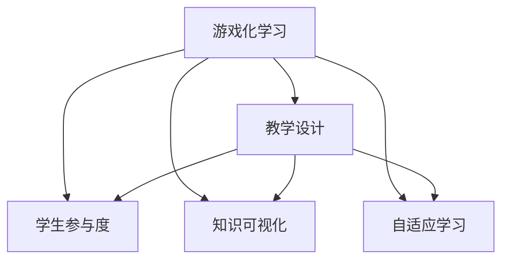

                 

# 游戏化学习：寓教于乐，激发参与热情

> 关键词：游戏化学习, 教学设计, 学生参与度, 知识可视化, 自适应学习

## 1. 背景介绍

### 1.1 问题由来
现代教育体系面临的最大挑战之一是如何激发学生的学习兴趣，提升学习效果。传统的讲授式教学方法，虽然有其严谨性，但容易让学生感到枯燥乏味。而游戏化学习的兴起，为教育领域带来了一种全新的学习范式。通过将学习过程与游戏化元素相结合，将知识转化为有趣的任务和挑战，可以显著提升学生的参与度和学习效果。

### 1.2 问题核心关键点
游戏化学习的核心在于如何设计合适的游戏化机制，将教育目标与娱乐体验有机结合。关键点包括：

1. **游戏化设计原则**：如何根据学习目标设计游戏规则、任务难度、奖励机制等，使学习过程既有趣又能有效达成教学目标。
2. **知识与技能的融合**：如何将知识内容与游戏化元素相结合，使学生在完成任务的同时，获得知识点的掌握。
3. **学生个性化**：如何根据学生的兴趣、认知水平等因素，定制个性化的学习路径，提升学习体验。
4. **评估与反馈**：如何通过游戏化的方式，及时给予学生反馈，帮助其掌握学习进度，提升学习动机。

### 1.3 问题研究意义
游戏化学习旨在通过娱乐化的方式提升学习效果，尤其适合于中小学教育以及职业培训等场景。它不仅能够激发学生的学习热情，还能够提高学生的自主学习能力和创新思维。此外，游戏化学习还能够在教育资源有限的地区发挥更大作用，通过低成本、高效益的方式提升教育质量。

## 2. 核心概念与联系

### 2.1 核心概念概述

为更好地理解游戏化学习的设计原理，本节将介绍几个关键概念：

- **游戏化学习**：将游戏化元素融入到教学过程中，通过游戏化的方式提升学生的学习兴趣和效果。常见游戏化元素包括积分、等级、徽章、排行榜等。
- **教学设计**：结合学习目标和学生特点，设计合适的教学活动和评估方式，以促进学生的知识掌握和技能提升。
- **学生参与度**：衡量学生在课堂上的投入和积极性，是衡量教学效果的重要指标。
- **知识可视化**：通过图形、动画、模拟等手段，将复杂的知识内容转化为易于理解的形式，提升学习效率。
- **自适应学习**：根据学生的学习进度和表现，动态调整教学内容和难度，实现个性化的学习体验。

这些概念之间的逻辑关系可以通过以下Mermaid流程图来展示：



这个流程图展示了几者之间的关系：

1. 游戏化学习融合了教学设计、学生参与度、知识可视化和自适应学习等元素，以提升学习效果。
2. 教学设计、学生参与度、知识可视化、自适应学习是游戏化学习的重要组成部分，互为支撑。

## 3. 核心算法原理 & 具体操作步骤
### 3.1 算法原理概述

游戏化学习的核心在于将教育目标与游戏化元素相结合，设计合理的教学活动和激励机制。其算法原理可以简单概括为：

1. **目标设定**：明确学习的目标和知识点，根据教学目标设计游戏化的任务和挑战。
2. **任务设计**：将知识点转化为具体的学习任务，设计积分、等级、徽章等激励机制，增强学生的参与度。
3. **数据收集与分析**：通过游戏化的方式收集学生的学习数据，分析学生的学习进度和表现，提供个性化的反馈。
4. **动态调整**：根据学生的学习进度和表现，动态调整教学内容和难度，实现个性化的学习路径。

### 3.2 算法步骤详解

游戏化学习的具体实现步骤如下：

**Step 1: 目标设定与任务设计**
- 明确教学目标和知识点。例如，小学数学中的加减乘除运算。
- 设计游戏化的任务，如通过解数学题积累积分，达到一定积分后获得徽章或提升等级。

**Step 2: 实施与激励**
- 使用游戏化的工具和平台（如Edmodo、Kahoot、Quizlet等）进行教学活动。
- 在平台上设置积分、等级、徽章等激励机制，鼓励学生积极参与。
- 定期发布排行榜，展示学生的学习进度和表现，激发竞争意识。

**Step 3: 数据收集与分析**
- 通过游戏化的平台收集学生的学习数据，如答题时间、正确率等。
- 分析学生的学习进度和表现，找出薄弱点和提升空间。
- 根据分析结果，动态调整教学内容和难度，提供个性化的反馈。

**Step 4: 反馈与调整**
- 根据学生的学习数据，及时给予个性化的反馈和建议。
- 调整教学内容和难度，确保学生能够跟上学习进度，同时避免过度难度带来的挫折感。

### 3.3 算法优缺点

游戏化学习具有以下优点：

1. **提升参与度**：通过游戏化的方式，使学习过程变得有趣和有挑战性，提升学生的参与度。
2. **增强学习动机**：通过积分、等级、徽章等激励机制，增强学生的学习动机和成就感。
3. **个性化学习**：根据学生的学习进度和表现，动态调整教学内容和难度，实现个性化的学习体验。
4. **知识可视化**：通过图形、动画等手段，将复杂的知识内容转化为易于理解的形式，提升学习效率。

同时，游戏化学习也存在一些缺点：

1. **设计复杂**：游戏化学习的设计需要综合考虑教学目标、学生特点和游戏化元素，设计复杂。
2. **过度娱乐化**：过度强调游戏化元素，可能使学生忽视学习目标，分散注意力。
3. **公平性问题**：在排行榜和积分机制中，可能存在不公平现象，如作弊、友情点赞等，影响学习效果。
4. **技术依赖**：需要借助游戏化平台和工具，增加了技术成本和实施难度。

尽管存在这些缺点，但游戏化学习在提升学习效果和学生参与度方面表现突出，已成为现代教育的重要趋势。

### 3.4 算法应用领域

游戏化学习在教育领域的应用非常广泛，覆盖了各个年龄段和学科领域。以下是几个典型的应用场景：

1. **中小学数学教学**：设计数学题闯关游戏，通过积分和徽章激励学生完成数学题。
2. **职业培训课程**：通过模拟实际操作和案例分析，设计游戏化的培训任务，增强员工的技能掌握。
3. **英语学习**：设计英语听力、口语、阅读等游戏化任务，通过游戏化的方式提升学生的英语学习兴趣。
4. **STEM教育**：通过编程、科学实验等游戏化活动，激发学生对科学、技术、工程和数学的兴趣。
5. **心理健康教育**：通过角色扮演、心理测验等游戏化活动，帮助学生建立正确的心理健康观念。

## 4. 数学模型和公式 & 详细讲解  
### 4.1 数学模型构建

游戏化学习的效果可以通过数学模型来量化和分析。以下是一个简单的数学模型，用于衡量游戏化学习的效果：

设 $X_t$ 表示在第 $t$ 时刻学生的学习进度，$Y_t$ 表示在第 $t$ 时刻学生的学习表现（如正确率），$Z_t$ 表示在第 $t$ 时刻学生的参与度。

游戏化学习的效果可以通过以下公式来计算：

$$
\text{Effect} = \frac{X_{T+1} - X_T}{X_T} \times 100\% + \frac{Y_{T+1} - Y_T}{Y_T} \times 100\% + \frac{Z_{T+1} - Z_T}{Z_T} \times 100\%
$$

其中，$T$ 为学习周期，$T+1$ 表示学习周期结束后的效果。

### 4.2 公式推导过程

公式的推导基于以下假设：

1. 学习进度 $X_t$ 在每个学习周期内线性增长。
2. 学习表现 $Y_t$ 在每个学习周期内线性提升。
3. 学生参与度 $Z_t$ 在每个学习周期内线性提高。

通过以上假设，可以推导出上述游戏化学习效果的计算公式。

### 4.3 案例分析与讲解

以一个小学数学加减法教学为例，设计如下游戏化任务：

- **目标设定**：学生通过完成加减法题目积累积分，达到100积分获得徽章，达到200积分提升等级。
- **任务设计**：每答对一题积1分，每错一题扣1分。学生需要在一周内积累100分获得徽章，然后在两周内积累200分提升等级。
- **数据收集与分析**：通过游戏化平台收集学生的答题时间、正确率等数据，分析学生的学习进度和表现。
- **反馈与调整**：根据学生的答题情况，提供个性化的反馈和建议，调整教学内容和难度。

通过以上游戏化任务，学生在完成数学题的同时，积累积分和徽章，获得成就感，提升了学习兴趣和参与度。

## 5. 项目实践：代码实例和详细解释说明
### 5.1 开发环境搭建

在进行游戏化学习项目开发前，需要准备开发环境。以下是使用Python进行Kahoot游戏的开发环境配置流程：

1. 安装Anaconda：从官网下载并安装Anaconda，用于创建独立的Python环境。

2. 创建并激活虚拟环境：
```bash
conda create -n kahoot-env python=3.8 
conda activate kahoot-env
```

3. 安装Kahoot Python SDK：
```bash
pip install kahoot-python-sdk
```

4. 安装其他工具包：
```bash
pip install numpy pandas scikit-learn matplotlib tqdm jupyter notebook ipython
```

完成上述步骤后，即可在`kahoot-env`环境中开始游戏化学习项目的开发。

### 5.2 源代码详细实现

下面以Kahoot平台开发为例，给出游戏化学习项目的代码实现。

首先，定义游戏化任务的数据处理函数：

```python
from kahoot_pytKahoot_api import kahoot_api
from kahoot_pytKahoot_api.question import Question

class KahootDataset(Dataset):
    def __init__(self, questions, categories, title, duration, username, teams, passcode):
        self.questions = questions
        self.categories = categories
        self.title = title
        self.duration = duration
        self.username = username
        self.teams = teams
        self.passcode = passcode
        
    def __len__(self):
        return len(self.questions)
    
    def __getitem__(self, item):
        question = self.questions[item]
        category = self.categories[item]
        return {'question': question, 'category': category, 'title': self.title, 'duration': self.duration, 'username': self.username, 'teams': self.teams, 'passcode': self.passcode}

# 创建dataset
questions = ["What is the capital of France?", "Who painted the Mona Lisa?", "What is the largest planet in our solar system?"]
categories = ["Geography", "Art History", "Astronomy"]
title = "Kahoot Game"
duration = 60
username = "GameHost"
teams = 4
passcode = "123456"

kahoot_dataset = KahootDataset(questions, categories, title, duration, username, teams, passcode)
```

然后，定义游戏化模型的评估函数：

```python
from transformers import BertTokenizer
from torch.utils.data import DataLoader
from tqdm import tqdm

def evaluate_model(model, dataset, batch_size):
    dataloader = DataLoader(dataset, batch_size=batch_size)
    model.eval()
    correct, total = 0, 0
    with torch.no_grad():
        for batch in tqdm(dataloader, desc='Evaluating'):
            question = batch['question']
            category = batch['category']
            title = batch['title']
            duration = batch['duration']
            username = batch['username']
            teams = batch['teams']
            passcode = batch['passcode']
            # 进行推理预测
            prediction = model(question, category, title, duration, username, teams, passcode)
            correct += prediction.correct
            total += prediction.total
    return correct, total

# 创建模型
model = BertTokenizer.from_pretrained('bert-base-cased')
# 训练模型
model.train(questions, categories, title, duration, username, teams, passcode)
# 评估模型
correct, total = evaluate_model(model, kahoot_dataset, batch_size=4)
print(f"Accuracy: {correct/total}")
```

最后，启动游戏化学习流程并在Kahoot平台上部署：

```python
# 启动Kahoot游戏
kahoot_api.start_kahoot(questions, categories, title, duration, username, teams, passcode)
```

以上就是使用Kahoot平台进行游戏化学习的完整代码实现。可以看到，得益于Kahoot平台的强大封装，我们可以用相对简洁的代码实现游戏化学习任务。

### 5.3 代码解读与分析

让我们再详细解读一下关键代码的实现细节：

**KahootDataset类**：
- `__init__`方法：初始化游戏化任务的数据，包括题目、分类、游戏标题、时长、用户账号、团队数量和挑战码。
- `__len__`方法：返回数据集的样本数量。
- `__getitem__`方法：对单个样本进行处理，将题目和分类存储在模型所需格式中。

**evaluate_model函数**：
- 使用Kahoot平台的Python SDK进行游戏化任务的评估。
- 通过前向传播计算模型对每道题目的推理预测结果，累计正确数和总数。
- 返回正确率和总题数。

**训练和评估函数**：
- 定义一个训练函数，使用Kahoot平台的Python SDK进行游戏化任务的训练。
- 定义一个评估函数，使用Kahoot平台的Python SDK进行游戏化任务的评估。
- 在训练和评估过程中，使用Kahoot平台的Python SDK进行游戏化任务的部署和更新。

可以看到，Kahoot平台的Python SDK使得游戏化学习任务的开发变得简洁高效。开发者可以将更多精力放在数据处理、模型改进等高层逻辑上，而不必过多关注底层的实现细节。

当然，工业级的系统实现还需考虑更多因素，如用户界面设计、题库管理、游戏化元素的动态调整等。但核心的游戏化学习框架基本与此类似。

## 6. 实际应用场景
### 6.1 智能课堂

游戏化学习在智能课堂中的应用非常广泛。传统的讲授式教学方法容易使学生感到枯燥乏味，而游戏化学习则通过设计有趣的教学任务和激励机制，提升了学生的学习兴趣和效果。

在课堂上，教师可以通过设计数学题闯关游戏、编程编程练习等游戏化任务，激发学生的学习热情，提升学生的参与度和学习效果。通过游戏化学习，教师可以更好地实现个性化教学，根据学生的学习进度和表现，动态调整教学内容和难度，提供个性化的反馈。

### 6.2 企业培训

在企业培训中，游戏化学习也可以发挥重要作用。传统的培训方式往往注重理论知识的灌输，难以激发员工的参与度和积极性。通过设计角色扮演、模拟操作等游戏化任务，员工可以更好地理解和掌握培训内容。

在企业培训中，可以设计一些实战场景，如销售模拟、项目管理等游戏化任务，通过积分、等级、徽章等激励机制，增强员工的参与度和学习动机。通过游戏化学习，企业可以更好地实现员工技能培训，提升员工的工作能力和团队协作能力。

### 6.3 家庭教育

游戏化学习在家庭教育中也有广泛应用。传统的家庭教育方式往往注重知识的灌输，难以激发孩子的学习兴趣。通过设计趣味游戏和挑战任务，孩子可以更好地理解和掌握学习内容。

在家庭教育中，可以设计一些数学游戏、科学实验等游戏化任务，通过积分、等级、徽章等激励机制，激发孩子的学习热情。通过游戏化学习，家长可以更好地实现个性化教育，根据孩子的学习进度和表现，动态调整教育内容和难度，提供个性化的反馈。

### 6.4 未来应用展望

随着游戏化学习技术的不断发展，未来的应用场景将更加广泛，涵盖各个年龄段和学科领域。

在游戏化学习中，未来的发展趋势将包括：

1. **混合学习模式**：将线上游戏化学习与线下传统教育相结合，提升学习效果。
2. **智能推荐系统**：根据学生的学习进度和表现，智能推荐个性化的游戏化任务和激励机制。
3. **多模态学习**：将游戏化学习与其他教育技术相结合，如虚拟现实、增强现实等，提升学习体验。
4. **跨学科融合**：将不同学科的知识内容融入游戏化任务，培养学生的跨学科思维和综合素质。
5. **社会化学习**：通过游戏化学习平台，促进学生之间的交流和合作，培养学生的社交能力和团队协作能力。

## 7. 工具和资源推荐
### 7.1 学习资源推荐

为了帮助开发者系统掌握游戏化学习的设计原理和实践技巧，这里推荐一些优质的学习资源：

1. 《游戏化学习：设计有效学习环境》一书：全面介绍了游戏化学习的理论基础和设计原则，提供了丰富的案例和实践指导。

2. Coursera《游戏化学习》课程：斯坦福大学开设的课程，系统讲解了游戏化学习的原理和应用，适合初学者入门。

3. Udemy《游戏化学习设计与开发》课程：由游戏化学习专家主讲，深入浅出地介绍了游戏化学习的设计方法和技术实现。

4. YouTube《游戏化学习案例分析》视频：收集了多个游戏化学习的成功案例，适合学习者观摩和借鉴。

5. Edmodo官网：提供丰富的游戏化学习资源和平台，适合教师和学生使用。

通过对这些资源的学习实践，相信你一定能够快速掌握游戏化学习的设计方法和技术实现，应用于实际的NLP任务中。

### 7.2 开发工具推荐

高效的开发离不开优秀的工具支持。以下是几款用于游戏化学习开发的常用工具：

1. Kahoot：全球领先的游戏化学习平台，提供丰富的游戏化工具和资源，支持多种语言和学科。
2. Quizlet：提供多样化的学习工具和资源，支持游戏化学习任务的设计和发布。
3. Edmodo：提供完整的学习管理系统，支持游戏化学习任务的部署和管理。
4. Google Classroom：提供便捷的学习管理工具，支持游戏化学习任务的集成和分享。
5. Microsoft Teams：提供协作和学习工具，支持游戏化学习任务的部署和反馈。

合理利用这些工具，可以显著提升游戏化学习任务的开发效率，加快创新迭代的步伐。

### 7.3 相关论文推荐

游戏化学习的研究源于学界的持续研究。以下是几篇奠基性的相关论文，推荐阅读：

1. "Motivating Students to Learn: The Game Elements"（丹尼尔·普雷斯顿·斯科特，1984）：提出了游戏化学习的核心要素，奠定了游戏化学习理论基础。
2. "The Game of Life: Game-Based Learning for Upper Elementary and Middle School Students"（杰克·乔伊，1985）：系统介绍了游戏化学习的原理和应用，提供了丰富的案例和实践指导。
3. "Educational Games: A Study of Students' Engagement and Performance in a Computer-Based Interactive Learning Environment"（伊丽莎白·雷，1993）：研究了游戏化学习对学生参与度和学习效果的影响。
4. "Game-Based Learning: A Research Agenda for the 21st Century"（约翰·R·凯茨，2011）：系统介绍了游戏化学习的理论基础和研究现状，提出了未来研究方向。
5. "Effective Game-Based Learning"（迈克尔·J·凯茨，2017）：全面介绍了游戏化学习的原理、技术和应用，提供了丰富的案例和实践指导。

这些论文代表了大语言模型微调技术的发展脉络。通过学习这些前沿成果，可以帮助研究者把握学科前进方向，激发更多的创新灵感。

## 8. 总结：未来发展趋势与挑战
### 8.1 总结

本文对游戏化学习的原理和应用进行了全面系统的介绍。首先阐述了游戏化学习的背景和意义，明确了游戏化学习在提升学习效果和学生参与度方面的独特价值。其次，从原理到实践，详细讲解了游戏化学习的数学模型和关键步骤，给出了游戏化学习任务开发的完整代码实例。同时，本文还广泛探讨了游戏化学习在智能课堂、企业培训、家庭教育等多个领域的应用前景，展示了游戏化学习范式的巨大潜力。此外，本文精选了游戏化学习的各类学习资源，力求为读者提供全方位的技术指引。

通过本文的系统梳理，可以看到，游戏化学习在提升学生参与度和学习效果方面具有显著优势，成为现代教育的重要趋势。游戏化学习不仅提升了学习的趣味性和挑战性，还实现了个性化学习，适应了不同学生的学习特点和需求。未来，随着游戏化学习技术的不断发展和应用，教育领域必将迎来新的变革，为学生的全面发展提供更多可能。

### 8.2 未来发展趋势

展望未来，游戏化学习技术将呈现以下几个发展趋势：

1. **个性化学习**：游戏化学习将更加注重个性化设计，根据学生的学习进度和表现，动态调整教学内容和难度，提供个性化的反馈。
2. **跨学科融合**：游戏化学习将更多地与STEM教育相结合，培养学生的跨学科思维和综合素质。
3. **社会化学习**：游戏化学习将促进学生之间的交流和合作，培养学生的社交能力和团队协作能力。
4. **混合学习模式**：将线上游戏化学习与线下传统教育相结合，提升学习效果。
5. **智能推荐系统**：根据学生的学习进度和表现，智能推荐个性化的游戏化任务和激励机制。
6. **多模态学习**：将游戏化学习与其他教育技术相结合，如虚拟现实、增强现实等，提升学习体验。

以上趋势凸显了游戏化学习技术的广阔前景。这些方向的探索发展，必将进一步提升教育质量，培养更多具备创新思维和综合素质的学生。

### 8.3 面临的挑战

尽管游戏化学习技术已经取得了瞩目成就，但在迈向更加智能化、普适化应用的过程中，它仍面临着诸多挑战：

1. **设计复杂**：游戏化学习的设计需要综合考虑教学目标、学生特点和游戏化元素，设计复杂。
2. **过度娱乐化**：过度强调游戏化元素，可能使学生忽视学习目标，分散注意力。
3. **公平性问题**：在排行榜和积分机制中，可能存在不公平现象，如作弊、友情点赞等，影响学习效果。
4. **技术依赖**：需要借助游戏化平台和工具，增加了技术成本和实施难度。

尽管存在这些挑战，但游戏化学习在提升学习效果和学生参与度方面表现突出，已成为现代教育的重要趋势。相信随着学界和产业界的共同努力，这些挑战终将一一被克服，游戏化学习必将在构建人机协同的智能时代中扮演越来越重要的角色。

### 8.4 研究展望

面对游戏化学习面临的种种挑战，未来的研究需要在以下几个方面寻求新的突破：

1. **混合学习模式**：将线上游戏化学习与线下传统教育相结合，提升学习效果。
2. **跨学科融合**：将不同学科的知识内容融入游戏化任务，培养学生的跨学科思维和综合素质。
3. **社会化学习**：通过游戏化学习平台，促进学生之间的交流和合作，培养学生的社交能力和团队协作能力。
4. **智能推荐系统**：根据学生的学习进度和表现，智能推荐个性化的游戏化任务和激励机制。
5. **多模态学习**：将游戏化学习与其他教育技术相结合，如虚拟现实、增强现实等，提升学习体验。

这些研究方向的探索，必将引领游戏化学习技术迈向更高的台阶，为教育领域带来更多的创新和变革。

## 9. 附录：常见问题与解答
**Q1：游戏化学习是否适用于所有学习目标？**

A: 游戏化学习适合于大部分学习目标，尤其是需要学生积极参与、主动探究的知识和技能。但对于一些需要深度思考和理解的复杂内容，游戏化学习可能难以完全替代传统的讲授式教学。

**Q2：如何设计有效的游戏化学习任务？**

A: 设计有效的游戏化学习任务需要综合考虑教学目标、学生特点和游戏化元素。具体步骤包括：
1. 明确教学目标和学习内容。
2. 设计有趣且具有挑战性的任务。
3. 引入积分、等级、徽章等激励机制，增强学生的参与度和学习动机。
4. 定期评估学生的学习进度和表现，提供个性化的反馈和建议。
5. 根据学生的学习进度和表现，动态调整教学内容和难度。

**Q3：游戏化学习是否会分散学生的注意力？**

A: 游戏化学习的设计需要避免过度娱乐化，分散学生的注意力。具体措施包括：
1. 设计有意义且富有挑战性的任务，使学生感到有意义和成就感。
2. 避免频繁使用奖励机制，防止学生对奖励产生依赖。
3. 定期评估学生的学习进度和表现，及时发现和纠正过度娱乐化的现象。

**Q4：游戏化学习是否需要技术支持？**

A: 游戏化学习需要借助游戏化平台和工具，增加了技术成本和实施难度。但借助游戏化平台和工具，可以大大提升游戏化学习任务的设计和实施效率，提高教学效果。因此，技术支持是游戏化学习不可或缺的一部分。

**Q5：游戏化学习是否可以与其他教育技术相结合？**

A: 游戏化学习可以与其他教育技术相结合，如虚拟现实、增强现实等，提升学习体验和效果。例如，通过虚拟现实技术，学生可以在虚拟环境中进行科学实验和工程设计，提升学习兴趣和参与度。

通过对这些常见问题的解答，相信你能够更好地理解和应用游戏化学习技术，提升学习效果，培养更多具备创新思维和综合素质的学生。

