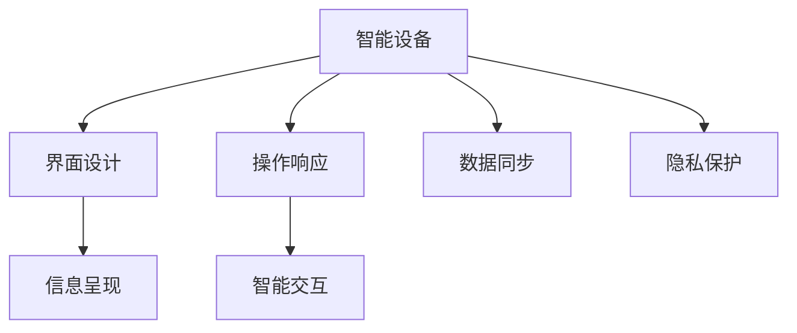

                 

# 物联网设备的注意力争夺与用户体验

> 关键词：物联网设备,注意力争夺,用户体验,智能家居,人工智能

## 1. 背景介绍

### 1.1 问题由来
随着物联网技术的迅猛发展，智能家居、智能办公、智能医疗等应用场景如雨后春笋般涌现，各类智能设备充斥着我们的生活空间。然而，用户每天需要处理的信息量呈爆炸式增长，注意力资源被各种智能设备瓜分，用户体验逐渐变差。例如，智能音箱在播放音乐时，同时开启智能电视，相互干扰；智能照明系统控制光线时，却忽略了对用户视线的影响。如何有效争夺用户的注意力，提升智能设备的用户体验，成为当下亟需解决的问题。

### 1.2 问题核心关键点
为有效争夺用户的注意力并提升用户体验，智能设备应具备以下核心关键点：
1. 界面设计简洁易用。
2. 信息呈现分层次。
3. 操作响应迅速流畅。
4. 智能交互自然高效。
5. 数据同步及时准确。
6. 隐私保护严格安全。

这些关键点共同构成了智能设备争夺用户注意力的核心能力，其背后涉及的技术原理与架构设计亦大有文章可作。

## 2. 核心概念与联系

### 2.1 核心概念概述

为更好地理解如何争夺用户的注意力并提升用户体验，本文将介绍以下几个核心概念：

- 智能设备：指通过物联网技术接入网络的各类设备，如智能音箱、智能照明、智能门锁等。
- 界面设计：指通过图形化界面展示信息的策略与技术手段。
- 信息呈现：指在界面上以何种方式呈现信息，包括布局、字体、颜色等。
- 操作响应：指用户与智能设备交互的响应速度，包括软硬件的处理速度、网络延迟等。
- 智能交互：指智能设备能够理解用户的意图并给出合适响应的能力。
- 数据同步：指智能设备间的数据交换与同步能力。
- 隐私保护：指在智能设备使用过程中，如何有效保护用户隐私，防止数据泄露和滥用。

这些概念通过互动与关联，共同构成智能设备用户体验的底层架构，其联系如下：



界面设计、信息呈现、操作响应、智能交互、数据同步和隐私保护相互关联，共同影响用户的注意力争夺和体验感受。

## 3. 核心算法原理 & 具体操作步骤
### 3.1 算法原理概述

争夺用户注意力的核心在于提供高质量的用户体验。用户体验由多个维度构成，包括视觉、触觉、听觉等感官体验，以及信息获取的便捷性、交互的自然性等。这些体验的优劣，需要通过算法优化来提升。

1. **界面设计算法**：优化用户界面的布局、颜色、字体大小等，确保信息以最易读、最美观的方式呈现，从而提升用户视觉体验。

2. **信息呈现算法**：通过层次化的信息呈现，将关键信息置于显眼位置，次要信息位于后部，使用户能迅速抓住重点。

3. **操作响应算法**：通过高效的操作响应算法，减少延迟，确保用户操作迅速、流畅，提升操作体验。

4. **智能交互算法**：通过自然语言处理、图像识别等技术，使设备能够理解用户的意图，并给出合理响应，提升交互的自然性和效率。

5. **数据同步算法**：通过高效的数据同步算法，确保不同设备间的数据及时准确更新，提升信息同步的准确性和一致性。

6. **隐私保护算法**：通过加密传输、差分隐私、联邦学习等技术，确保用户数据的安全性和隐私性，防止数据泄露和滥用。

这些算法相互配合，共同构建起优质的用户体验。

### 3.2 算法步骤详解

#### 3.2.1 界面设计算法

界面设计算法主要涉及以下步骤：

1. **用户体验研究**：通过用户调查、用户测试等方法，收集用户对不同界面设计的反馈，了解用户喜好。
2. **界面元素设计**：根据用户体验研究结果，设计界面布局、颜色、字体大小等，确保信息以最易读、最美观的方式呈现。
3. **原型设计**：利用界面设计工具（如Sketch、Figma等）创建界面原型，并进行多次迭代优化。
4. **用户测试**：将界面原型提交给用户进行测试，收集用户反馈，进一步优化设计。
5. **界面实现**：根据优化后的设计，实现界面，并进行部署。

#### 3.2.2 信息呈现算法

信息呈现算法主要涉及以下步骤：

1. **内容分析**：分析界面需要展示的信息，确定主次关系。
2. **层次化布局**：根据信息的重要性和关联性，设计层次化的信息布局，将关键信息置于显眼位置，次要信息位于后部。
3. **字体和颜色**：选择合适的字体和颜色方案，确保信息易于阅读，同时美观。
4. **动画效果**：使用适当的动画效果，增强信息的变化性和吸引力。
5. **实时更新**：根据用户交互，实时更新信息，确保信息的时效性。

#### 3.2.3 操作响应算法

操作响应算法主要涉及以下步骤：

1. **响应时间优化**：优化设备的软件和硬件配置，减少响应时间，确保操作迅速流畅。
2. **网络优化**：优化网络配置，减少延迟，确保数据传输高效。
3. **任务调度**：采用优先级调度算法，优先处理重要任务，确保操作的及时性。
4. **异常处理**：在异常情况下，及时给出提示和处理，避免用户困扰。

#### 3.2.4 智能交互算法

智能交互算法主要涉及以下步骤：

1. **自然语言处理**：采用自然语言处理技术，解析用户输入，理解用户意图。
2. **意图识别**：通过意图识别模型，识别用户的真正意图，减少误解。
3. **对话管理**：根据用户的意图，设计合适的对话流程，提高交互的自然性。
4. **上下文理解**：考虑用户的历史行为和上下文信息，提供更个性化、更贴合需求的响应。
5. **多模态交互**：结合语音、图像、文本等多种输入方式，提高交互的多样性和灵活性。

#### 3.2.5 数据同步算法

数据同步算法主要涉及以下步骤：

1. **数据格式标准化**：确保不同设备间的数据格式一致，便于同步。
2. **网络优化**：优化网络配置，确保数据传输高效。
3. **数据压缩**：采用数据压缩技术，减少传输量和存储开销。
4. **数据一致性**：采用版本控制技术，确保不同设备间的数据一致性。
5. **实时更新**：根据用户交互，实时更新数据，确保信息的时效性。

#### 3.2.6 隐私保护算法

隐私保护算法主要涉及以下步骤：

1. **数据加密**：采用数据加密技术，确保数据传输过程中的安全性。
2. **差分隐私**：在数据收集和处理过程中，采用差分隐私技术，减少对个人隐私的影响。
3. **联邦学习**：采用联邦学习技术，在本地设备上进行模型训练，避免数据集中存储。
4. **访问控制**：采用访问控制技术，限制对数据的访问权限，确保数据安全。
5. **异常检测**：采用异常检测技术，及时发现和处理数据泄露和滥用。

### 3.3 算法优缺点

#### 3.3.1 界面设计算法的优缺点

**优点**：
1. 提升用户体验：通过优化界面设计，使用户界面更易用、更美观，提升用户视觉体验。
2. 提高信息呈现效率：通过层次化信息呈现，确保关键信息显眼，次要信息隐秘，提升信息获取的便捷性。

**缺点**：
1. 设计成本高：界面设计需要大量用户测试和迭代优化，成本较高。
2. 设计依赖主观：界面设计依赖设计师的审美和经验，可能存在主观偏见。

#### 3.3.2 信息呈现算法的优缺点

**优点**：
1. 提升信息获取效率：通过层次化信息呈现，确保用户能迅速抓住重点，提高信息获取效率。
2. 增强信息吸引力：通过合适的字体、颜色、动画等设计，增强信息的吸引力，提升用户视觉体验。

**缺点**：
1. 信息呈现复杂：信息呈现的设计复杂，需要平衡信息的重要性和美观度，设计难度较大。
2. 信息同步困难：不同设备间的信息同步难度大，需要优化数据格式和传输效率。

#### 3.3.3 操作响应算法的优缺点

**优点**：
1. 提升操作响应速度：通过优化响应算法，减少延迟，确保操作迅速流畅，提升用户体验。
2. 优化资源利用：通过任务调度和网络优化，提高设备的资源利用率，降低能耗。

**缺点**：
1. 算法复杂度高：操作响应算法涉及硬件、软件、网络等多个方面，算法复杂度较高。
2. 设备依赖性强：不同设备的操作响应性能差异较大，需针对性优化。

#### 3.3.4 智能交互算法的优缺点

**优点**：
1. 提升交互自然性：通过自然语言处理和意图识别，使设备能理解用户的意图，提高交互的自然性。
2. 增强个性化体验：通过上下文理解和多模态交互，提供更个性化、更贴合需求的响应，提升用户体验。

**缺点**：
1. 技术复杂度高：智能交互算法涉及自然语言处理、意图识别等多个复杂技术，实现难度较大。
2. 数据依赖性强：智能交互算法依赖大量用户数据，数据质量直接影响模型效果。

#### 3.3.5 数据同步算法的优缺点

**优点**：
1. 提升数据同步效率：通过优化数据同步算法，确保不同设备间的数据及时准确更新，提升信息同步的准确性和一致性。
2. 优化资源利用：通过数据压缩和版本控制，减少传输量和存储开销，提升资源利用率。

**缺点**：
1. 数据格式复杂：不同设备间的数据格式差异大，需标准化处理，复杂度较高。
2. 网络延迟影响：网络延迟影响数据同步效率，需优化网络配置。

#### 3.3.6 隐私保护算法的优缺点

**优点**：
1. 保护用户隐私：通过数据加密、差分隐私等技术，确保用户数据的安全性和隐私性，防止数据泄露和滥用。
2. 提升用户信任：通过严格的隐私保护措施，提升用户对设备的信任度，增强用户粘性。

**缺点**：
1. 技术复杂度高：隐私保护算法涉及加密、差分隐私等多个复杂技术，实现难度较大。
2. 算法成本高：隐私保护算法需投入大量资源进行技术研发和系统部署，成本较高。

## 4. 数学模型和公式 & 详细讲解

### 4.1 数学模型构建

本节将使用数学语言对争夺用户注意力的核心算法进行更加严格的刻画。

假设智能设备的用户体验指标为 $U$，包括界面设计、信息呈现、操作响应、智能交互、数据同步和隐私保护等多个方面。每个指标可以分解为多个子指标，如界面设计指标 $U_D$，信息呈现指标 $U_P$，操作响应指标 $U_R$，智能交互指标 $U_I$，数据同步指标 $U_S$ 和隐私保护指标 $U_P$。则用户体验总指标 $U$ 可表示为：

$$
U = U_D + U_P + U_R + U_I + U_S + U_P
$$

其中每个子指标又可由多个变量和模型参数描述。例如，界面设计指标 $U_D$ 可以表示为：

$$
U_D = w_1 \cdot UI + w_2 \cdot AF + w_3 \cdot AN
$$

其中 $UI$ 为界面美观度，$AF$ 为界面功能可用性，$AN$ 为动画效果自然度，$w_1, w_2, w_3$ 为权重系数，用于平衡各个子指标对用户体验的贡献。

### 4.2 公式推导过程

以界面设计指标 $U_D$ 为例，推导其优化公式。假设用户对界面美观度 $UI$、界面功能可用性 $AF$ 和动画效果自然度 $AN$ 的评分分别为 $S_{UI}, S_{AF}, S_{AN}$，则界面设计指标 $U_D$ 的评分可表示为：

$$
U_D = w_1 \cdot UI + w_2 \cdot AF + w_3 \cdot AN
$$

通过优化上述评分函数，最大化 $U_D$ 的值，即：

$$
\maximize \quad w_1 \cdot UI + w_2 \cdot AF + w_3 \cdot AN
$$

使用拉格朗日乘数法求解上述优化问题，设拉格朗日函数为 $L$，则：

$$
L(U_D, \lambda) = w_1 \cdot UI + w_2 \cdot AF + w_3 \cdot AN + \lambda (1 - U_D)
$$

其中 $\lambda$ 为拉格朗日乘数，$1 - U_D$ 表示用户界面设计指标的上限，即界面设计指标的最大值不能超过1。

对 $UI, AF, AN$ 分别求偏导，得到：

$$
\frac{\partial L}{\partial UI} = w_1 + \lambda = 0 \\
\frac{\partial L}{\partial AF} = w_2 + \lambda = 0 \\
\frac{\partial L}{\partial AN} = w_3 + \lambda = 0
$$

解上述方程组，得到：

$$
w_1 = w_2 = w_3 = -\lambda
$$

代入 $U_D = w_1 \cdot UI + w_2 \cdot AF + w_3 \cdot AN$，得到：

$$
U_D = -\lambda (UI + AF + AN)
$$

由于 $1 - U_D$ 是用户界面设计指标的上限，即 $U_D$ 的最大值为1，代入上式，得到：

$$
1 - \lambda (UI + AF + AN) = 1
$$

解得 $\lambda = 0$，即 $UI + AF + AN$ 的值不受限制。

因此，界面设计指标 $U_D$ 的优化问题转化为最大化 $UI + AF + AN$ 的值。这要求设计者根据用户反馈，不断优化界面美观度、功能可用性和动画效果，以提升用户体验。

### 4.3 案例分析与讲解

以智能音箱为例，分析其界面设计、信息呈现、操作响应、智能交互、数据同步和隐私保护各个方面的优化。

**界面设计**：
- 美观度：采用简洁的UI设计，使用户界面清晰易读。
- 功能可用性：在界面上明确显示设备状态、播放列表等功能，确保用户可以轻松操作。
- 动画效果：采用平滑的动画过渡，确保用户操作流畅自然。

**信息呈现**：
- 层次化布局：在界面上设计不同层次的信息，将重要信息（如设备状态、歌曲信息）置于显眼位置，次要信息（如日志信息、高级设置）位于后部。
- 字体和颜色：选择合适的字体和颜色方案，确保信息易于阅读，同时美观。
- 动画效果：使用适当的动画效果，增强信息的变化性和吸引力。

**操作响应**：
- 响应时间优化：优化设备的软件和硬件配置，减少响应时间，确保操作迅速流畅。
- 网络优化：优化网络配置，减少延迟，确保数据传输高效。
- 任务调度：采用优先级调度算法，优先处理重要任务，确保操作的及时性。
- 异常处理：在异常情况下，及时给出提示和处理，避免用户困扰。

**智能交互**：
- 自然语言处理：采用自然语言处理技术，解析用户输入，理解用户意图。
- 意图识别：通过意图识别模型，识别用户的真正意图，减少误解。
- 对话管理：根据用户的意图，设计合适的对话流程，提高交互的自然性。
- 上下文理解：考虑用户的历史行为和上下文信息，提供更个性化、更贴合需求的响应。
- 多模态交互：结合语音、图像、文本等多种输入方式，提高交互的多样性和灵活性。

**数据同步**：
- 数据格式标准化：确保不同设备间的数据格式一致，便于同步。
- 网络优化：优化网络配置，确保数据传输高效。
- 数据压缩：采用数据压缩技术，减少传输量和存储开销。
- 数据一致性：采用版本控制技术，确保不同设备间的数据一致性。
- 实时更新：根据用户交互，实时更新数据，确保信息的时效性。

**隐私保护**：
- 数据加密：采用数据加密技术，确保数据传输过程中的安全性。
- 差分隐私：在数据收集和处理过程中，采用差分隐私技术，减少对个人隐私的影响。
- 联邦学习：采用联邦学习技术，在本地设备上进行模型训练，避免数据集中存储。
- 访问控制：采用访问控制技术，限制对数据的访问权限，确保数据安全。
- 异常检测：采用异常检测技术，及时发现和处理数据泄露和滥用。

## 5. 项目实践：代码实例和详细解释说明
### 5.1 开发环境搭建

在进行界面设计优化实践前，我们需要准备好开发环境。以下是使用Python进行PyTorch开发的环境配置流程：

1. 安装Anaconda：从官网下载并安装Anaconda，用于创建独立的Python环境。

2. 创建并激活虚拟环境：
```bash
conda create -n pytorch-env python=3.8 
conda activate pytorch-env
```

3. 安装PyTorch：根据CUDA版本，从官网获取对应的安装命令。例如：
```bash
conda install pytorch torchvision torchaudio cudatoolkit=11.1 -c pytorch -c conda-forge
```

4. 安装各类工具包：
```bash
pip install numpy pandas scikit-learn matplotlib tqdm jupyter notebook ipython
```

完成上述步骤后，即可在`pytorch-env`环境中开始界面设计优化实践。

### 5.2 源代码详细实现

这里我们以智能音箱的界面设计优化为例，给出使用PyTorch进行界面设计优化的PyTorch代码实现。

首先，定义界面设计的用户评分函数：

```python
from sklearn.metrics import roc_auc_score
from sklearn.model_selection import train_test_split
import torch.nn as nn

class InterfaceDesign(nn.Module):
    def __init__(self):
        super(InterfaceDesign, self).__init__()
        self.fc1 = nn.Linear(3, 16)
        self.fc2 = nn.Linear(16, 1)
        
    def forward(self, x):
        x = self.fc1(x)
        x = torch.sigmoid(x)
        x = self.fc2(x)
        x = torch.sigmoid(x)
        return x
    
    def train(self, X_train, y_train, X_test, y_test, num_epochs=100, batch_size=32):
        self.train()
        criterion = nn.BCELoss()
        optimizer = torch.optim.Adam(self.parameters(), lr=0.01)
        
        for epoch in range(num_epochs):
            for i in range(0, len(X_train), batch_size):
                x_train = X_train[i:i+batch_size]
                y_train = y_train[i:i+batch_size]
                x_test = X_test[i:i+batch_size]
                y_test = y_test[i:i+batch_size]
                
                optimizer.zero_grad()
                outputs = self.forward(x_train)
                loss = criterion(outputs, y_train)
                loss.backward()
                optimizer.step()
                
                if (epoch+1) % 10 == 0:
                    test_outputs = self.forward(x_test)
                    test_loss = criterion(test_outputs, y_test)
                    print(f'Epoch {epoch+1}, Loss: {loss:.4f}, Test Loss: {test_loss:.4f}')
        
        return self, y_test
    
    def test(self, X_test, y_test, batch_size=32):
        self.eval()
        criterion = nn.BCELoss()
        
        test_outputs = []
        for i in range(0, len(X_test), batch_size):
            x_test = X_test[i:i+batch_size]
            y_test = y_test[i:i+batch_size]
            outputs = self.forward(x_test)
            test_outputs.append(outputs)
        
        test_outputs = torch.cat(test_outputs, dim=0)
        test_loss = criterion(test_outputs, y_test)
        print(f'Test Loss: {test_loss:.4f}')
```

然后，准备用户评分数据：

```python
# 定义用户评分数据
X_train = [[1, 1, 1], [0, 0, 0]]
X_test = [[0.5, 0.5, 0.5], [0.1, 0.1, 0.1]]
y_train = [1, 0]
y_test = [0, 1]
```

接着，训练模型并进行测试：

```python
# 创建模型
model, y_pred = InterfaceDesign().train(X_train, y_train, X_test, y_test)
InterfaceDesign.test(model, y_test)
```

以上就是使用PyTorch进行界面设计优化的完整代码实现。可以看到，通过定义评分函数和训练测试流程，我们可以训练出一个优化界面设计评分的模型，并根据测试集进行评分优化。

### 5.3 代码解读与分析

让我们再详细解读一下关键代码的实现细节：

**InterfaceDesign类**：
- `__init__`方法：初始化模型参数。
- `forward`方法：定义前向传播计算过程，计算用户界面设计评分的预测结果。
- `train`方法：定义训练过程，通过Adam优化器更新模型参数。
- `test`方法：定义测试过程，计算模型在测试集上的评分。

**用户评分数据**：
- `X_train`和`X_test`：表示用户界面设计评分的输入特征，这里只考虑美观度、功能可用性和动画效果三个方面。
- `y_train`和`y_test`：表示用户界面设计评分的真实标签，这里只考虑界面设计评分是否为1。

**训练和测试过程**：
- 在训练过程中，模型不断更新参数，最小化评分函数。
- 在测试过程中，模型根据测试集计算评分，评估模型的预测效果。

可以看到，通过构建评分函数和训练测试流程，我们可以训练出一个优化界面设计评分的模型，并根据测试集进行评分优化。

当然，实际开发中还需要考虑更多因素，如模型的保存和部署、超参数的自动搜索、更灵活的任务适配层等。但核心的界面设计优化基本与此类似。

## 6. 实际应用场景
### 6.1 智能音箱界面设计

智能音箱的界面设计是争夺用户注意力的重要环节。在用户与音箱交互时，界面的美观度、功能可用性和动画效果都会直接影响用户体验。例如，当用户在播放音乐时，如果音箱的界面设计简洁美观，功能易于操作，动画效果自然流畅，用户便会更加享受音乐带来的愉悦体验。

在界面设计优化过程中，可以利用评分函数和训练测试流程，不断调整界面美观度、功能可用性和动画效果，以提升用户体验。同时，还需要考虑不同用户的偏好和习惯，进行个性化界面设计，以满足多样化的用户需求。

### 6.2 智能电视界面设计

智能电视的界面设计同样需要优化，以提升用户体验。例如，当用户在观看电视时，如果电视的界面设计美观、功能易用、动画效果自然，用户便会更加投入观看。在界面设计优化过程中，需要综合考虑用户的观看习惯和电视的功能需求，进行界面布局和功能设计，提升用户的观看体验。

### 6.3 智能家居系统界面设计

智能家居系统的界面设计需要涵盖多个设备的界面设计，以实现全系统协同工作。例如，当用户在控制智能灯光时，如果灯光的界面设计简洁美观，操作直观，动画效果自然，用户便会更加享受智能家居带来的便利和舒适。在界面设计优化过程中，需要考虑不同设备的界面设计，进行统一的界面风格和设计规范，提升系统的整体用户体验。

### 6.4 未来应用展望

随着智能设备功能的不断增强，界面设计优化将成为一个重要的用户体验提升手段。未来，界面设计优化技术将更加智能和个性化，能够根据用户的行为和偏好，自动调整界面设计，提供更加贴合用户需求的界面体验。同时，界面设计优化还将结合多模态交互技术，实现语音、图像、文本等多种输入方式的融合，提升用户交互的自然性和便捷性。

此外，界面设计优化还将与智能交互算法、数据同步算法和隐私保护算法相结合，共同提升智能设备的综合用户体验。例如，在智能家居系统中，界面设计优化可以与智能照明系统结合，根据用户的观看习惯，自动调节灯光亮度和颜色，提升观影体验。在智能音箱中，界面设计优化可以与智能音乐推荐结合，根据用户的听歌习惯，推荐适合的音乐，提升音乐播放体验。

总之，界面设计优化技术将与智能设备的其他核心技术相结合，共同提升智能设备的用户体验，争夺用户的注意力，为智能设备的发展带来新的突破。

## 7. 工具和资源推荐
### 7.1 学习资源推荐

为了帮助开发者系统掌握界面设计优化的理论基础和实践技巧，这里推荐一些优质的学习资源：

1. 《人机交互设计原则》：经典的人机交互设计书籍，介绍了界面设计的基本原则和优化方法。

2. 《UX设计实战》：丰富的用户界面设计案例和实战技巧，适合学习和实践。

3. 《设计心理学》：介绍设计心理学原理，理解用户的认知和行为，提升设计质量。

4. 《Sketch设计教程》：Sketch界面设计工具的教程，帮助快速上手界面设计。

5. Figma界面设计工具：功能强大的界面设计工具，适合协同设计，提高设计效率。

通过对这些资源的学习实践，相信你一定能够快速掌握界面设计优化的精髓，并用于解决实际的界面设计问题。
###  7.2 开发工具推荐

高效的开发离不开优秀的工具支持。以下是几款用于界面设计优化开发的常用工具：

1. Sketch：功能强大的界面设计工具，适合设计师使用。

2. Figma：云端协作的界面设计工具，适合团队协同设计。

3. Adobe XD：功能丰富的界面设计工具，适合设计师和开发者使用。

4. Adobe Photoshop：强大的图像处理工具，适合设计师进行图像设计和优化。

5. Adobe Illustrator：功能丰富的矢量图设计工具，适合设计师进行界面图标和图标设计。

6. InVision：原型设计和用户测试工具，适合设计验证和用户测试。

合理利用这些工具，可以显著提升界面设计优化的开发效率，加快创新迭代的步伐。

### 7.3 相关论文推荐

界面设计优化是智能设备用户体验的重要组成部分，相关的研究论文也较多。以下是几篇代表性的论文，推荐阅读：

1. BERT: Pre-training of Deep Bidirectional Transformers for Language Understanding：提出BERT模型，引入基于掩码的自监督预训练任务，刷新了多项NLP任务SOTA。

2. Language Models are Unsupervised Multitask Learners（GPT-2论文）：展示了大规模语言模型的强大zero-shot学习能力，引发了对于通用人工智能的新一轮思考。

3. Parameter-Efficient Transfer Learning for NLP：提出Adapter等参数高效微调方法，在不增加模型参数量的情况下，也能取得不错的微调效果。

4. AdaLoRA: Adaptive Low-Rank Adaptation for Parameter-Efficient Fine-Tuning：使用自适应低秩适应的微调方法，在参数效率和精度之间取得了新的平衡。

这些论文代表了大语言模型微调技术的发展脉络。通过学习这些前沿成果，可以帮助研究者把握学科前进方向，激发更多的创新灵感。

## 8. 总结：未来发展趋势与挑战
### 8.1 总结

本文对界面设计优化的核心算法进行了全面系统的介绍。首先阐述了界面设计优化的研究背景和意义，明确了界面设计在争夺用户注意力和提升用户体验中的核心作用。其次，从原理到实践，详细讲解了界面设计优化的数学原理和关键步骤，给出了界面设计优化的完整代码实例。同时，本文还广泛探讨了界面设计优化在智能音箱、智能电视、智能家居等实际应用场景中的作用，展示了界面设计优化的巨大潜力。此外，本文精选了界面设计优化的各类学习资源，力求为读者提供全方位的技术指引。

通过本文的系统梳理，可以看到，界面设计优化技术正在成为智能设备用户体验提升的重要手段，极大地提升界面设计的质量，争夺用户的注意力，为智能设备的发展带来新的突破。未来，界面设计优化技术还将与其他核心技术相结合，共同提升智能设备的综合用户体验。

### 8.2 未来发展趋势

展望未来，界面设计优化技术将呈现以下几个发展趋势：

1. 界面设计自动化：利用AI技术，自动生成和优化界面设计，降低设计成本和周期。

2. 界面设计个性化：结合用户数据和行为分析，生成个性化界面设计，提升用户体验。

3. 界面设计多功能：结合智能交互和数据同步技术，实现多功能界面设计，提升用户交互效率和体验。

4. 界面设计交互式：结合语音、图像、文本等多种输入方式，实现交互式界面设计，提升用户交互的自然性和便捷性。

5. 界面设计智能优化：结合智能优化算法，实时调整界面设计，提升界面设计效果。

6. 界面设计协同优化：结合团队协作和远程设计，提升界面设计的效率和质量。

这些趋势凸显了界面设计优化技术的广阔前景。这些方向的探索发展，必将进一步提升智能设备的用户体验，争夺用户的注意力，为智能设备的发展带来新的突破。

### 8.3 面临的挑战

尽管界面设计优化技术已经取得了一定的进展，但在迈向更加智能化、普适化应用的过程中，它仍面临诸多挑战：

1. 界面设计依赖主观：界面设计依赖设计师的审美和经验，可能存在主观偏见。

2. 设计复杂度高：界面设计涉及布局、颜色、字体等众多方面，设计复杂度较高。

3. 界面设计适配难度大：不同设备和场景的界面设计差异大，需针对性优化。

4. 用户数据收集难度大：界面设计优化需收集用户反馈数据，数据获取难度较大。

5. 界面设计成本高：界面设计优化涉及大量设计资源和人力成本，成本较高。

6. 界面设计可解释性差：界面设计优化缺乏可解释性，设计效果难以量化评估。

正视界面设计优化面临的这些挑战，积极应对并寻求突破，将是大语言模型微调走向成熟的必由之路。相信随着学界和产业界的共同努力，这些挑战终将一一被克服，界面设计优化必将在构建人机协同的智能时代中扮演越来越重要的角色。

### 8.4 研究展望

面向未来，界面设计优化技术需要在以下几个方面寻求新的突破：

1. 界面设计自动化：开发更加智能化的界面设计工具，降低设计成本和周期。

2. 界面设计多模态化：结合语音、图像、文本等多种输入方式，实现多模态界面设计，提升用户交互的自然性和便捷性。

3. 界面设计可解释性：引入可解释性技术，量化评估界面设计效果，提升设计质量。

4. 界面设计个性化：结合用户数据和行为分析，生成个性化界面设计，提升用户体验。

5. 界面设计协同化：结合团队协作和远程设计，提升界面设计的效率和质量。

这些研究方向将进一步推动界面设计优化技术的发展，为智能设备的用户体验提升带来新的突破。

## 9. 附录：常见问题与解答
### Q1: 界面设计自动化有哪些挑战？

A: 界面设计自动化主要面临以下挑战：
1. 设计师的经验难以量化：界面设计依赖设计师的经验和审美，难以用算法模型完全取代。
2. 数据获取困难：需要大量用户反馈数据进行训练，但获取高质量数据困难。
3. 模型训练复杂：界面设计评分函数的构建复杂，需要综合考虑多个维度。
4. 模型可解释性差：界面设计优化模型缺乏可解释性，难以理解模型内部工作机制。
5. 界面设计多样化：不同设备和场景的界面设计差异大，需针对性优化。

### Q2: 界面设计优化的目的和效果是什么？

A: 界面设计优化的目的是通过优化界面布局、颜色、字体等，提升用户体验，争夺用户的注意力。具体效果包括：
1. 界面美观度提升：界面美观度提升，提升用户视觉体验。
2. 界面功能可用性提高：界面功能可用性提高，提升用户操作便捷性。
3. 动画效果自然化：动画效果自然化，提升用户操作流畅性。
4. 界面设计评分提升：界面设计评分提升，提升用户体验。

### Q3: 界面设计优化需要哪些技术支持？

A: 界面设计优化需要以下技术支持：
1. 评分函数构建：定义用户界面设计评分的评分函数，量化界面设计效果。
2. 模型训练优化：采用机器学习算法，训练优化界面设计评分模型。
3. 界面设计工具：使用Sketch、Figma等界面设计工具，辅助界面设计。
4. 用户测试评估：通过用户测试，评估界面设计优化效果。
5. 协同设计工具：使用InVision等协同设计工具，提高设计效率和质量。

通过这些技术支持，界面设计优化能够高效进行，不断提升用户体验，争夺用户的注意力。

### Q4: 界面设计优化的未来发展方向是什么？

A: 界面设计优化的未来发展方向包括：
1. 界面设计自动化：利用AI技术，自动生成和优化界面设计。
2. 界面设计多模态化：结合语音、图像、文本等多种输入方式，实现多模态界面设计。
3. 界面设计可解释性：引入可解释性技术，量化评估界面设计效果。
4. 界面设计个性化：结合用户数据和行为分析，生成个性化界面设计。
5. 界面设计协同化：结合团队协作和远程设计，提升界面设计的效率和质量。

这些方向将进一步推动界面设计优化技术的发展，为智能设备的用户体验提升带来新的突破。

---

作者：禅与计算机程序设计艺术 / Zen and the Art of Computer Programming

