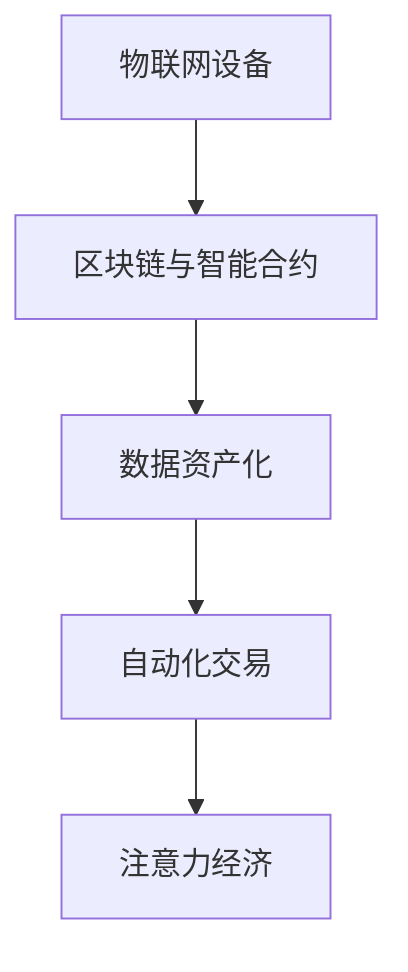

                 

# 物联网设备的注意力经济价值挖掘

> 关键词：物联网设备、注意力经济、价值挖掘、智能合约、区块链、数据驱动、自动化交易、生态系统构建

## 1. 背景介绍

在数字化转型的浪潮下，物联网（IoT）设备日益普及，已成为各大产业数字化创新的关键基础设施。然而，随着物联网设备的规模化部署，如何挖掘和利用这些设备产生的庞大数据价值，提升其附加值，成为亟待解决的问题。本研究聚焦于物联网设备的注意力经济价值挖掘，探索通过构建基于区块链的智能合约，实现设备资产的自动化交易，从而最大化其商业价值。

### 1.1 问题由来

物联网设备的广泛应用，带来了巨大的经济和社会效益。但与此同时，设备管理和价值利用也面临诸多挑战：

1. **数据孤岛问题**：不同设备提供商的数据格式、存储方式各异，难以互通。
2. **数据安全和隐私问题**：设备数据需严格保护，避免非法访问和滥用。
3. **数据价值难以挖掘**：设备数据涉及个人隐私和商业敏感信息，挖掘难度大。
4. **设备资产流动性不足**：设备价值受物理状态、运营数据等影响，流动性低。

这些问题直接制约了物联网设备价值的最大化。本研究提出基于区块链的智能合约，通过数据驱动的自动化交易机制，解决上述问题，挖掘物联网设备的注意力经济价值。

### 1.2 问题核心关键点
- **区块链与智能合约**：利用区块链的去中心化、不可篡改特性，实现设备数据的可信记录和自动化交易。
- **数据资产化**：将设备数据视为一种资产，通过智能合约进行价值交换和流转。
- **自动化交易**：引入市场机制，通过市场价格自动调整，实现设备价值最大化。
- **价值创造机制**：结合注意力经济理论，利用设备产生的注意力数据，创造新的经济价值。

## 2. 核心概念与联系

### 2.1 核心概念概述

为更好地理解物联网设备注意力经济价值挖掘的核心技术，本节将介绍几个密切相关的核心概念：

- **物联网设备**：指各种物理对象通过网络连接的数字设备，包括传感器、智能家居、工业设备等。
- **区块链与智能合约**：一种分布式账本技术，具有去中心化、不可篡改、透明公开的特点。智能合约是一种自动执行的合约，在满足特定条件时自动执行，无需人工干预。
- **数据资产化**：将数据视为一种资产，通过区块链进行记录、管理和交易。
- **自动化交易**：利用算法自动执行交易，降低交易成本，提高交易效率。
- **注意力经济**：注意力作为一种稀缺资源，通过数据挖掘和智能合约实现价值转换和创造。

这些核心概念之间的逻辑关系可以通过以下Mermaid流程图来展示：



这个流程图展示了大语言模型的核心概念及其之间的关系：

1. 物联网设备通过区块链进行数据记录和交易。
2. 设备数据资产化，通过智能合约进行管理和流转。
3. 设备数据价值通过自动化交易机制进行最大化。
4. 设备产生的注意力数据，通过注意力经济模型创造新的经济价值。

## 3. 核心算法原理 & 具体操作步骤
### 3.1 算法原理概述

基于物联网设备注意力经济价值挖掘的智能合约模型，本质上是一种数据驱动的交易系统。其核心思想是：

1. **数据资产化**：将物联网设备产生的数据视为资产，通过区块链进行记录和交易。
2. **自动化交易**：利用智能合约中的自动化交易机制，实现设备数据的自动流转和价值最大化。
3. **注意力经济**：通过注意力数据的挖掘和分析，创造新的经济价值。

具体地，模型由以下几个主要部分构成：

- **数据资产记录模块**：负责设备数据的采集、记录和上传至区块链。
- **数据交易市场模块**：建立自动化的数据交易市场，通过市场价格机制实现数据流转。
- **价值创造模块**：利用设备产生的注意力数据，创造新的经济价值。

### 3.2 算法步骤详解

基于物联网设备注意力经济价值挖掘的智能合约模型，其操作过程可以分为以下几个步骤：

**Step 1: 设备数据采集与记录**
- 对物联网设备的数据采集接口进行标准化，确保数据格式一致。
- 采集设备传感器数据、位置信息、环境数据等。
- 通过API将数据上传至区块链，记录设备状态和数据变化。

**Step 2: 建立数据交易市场**
- 设计智能合约，定义数据交易的基本规则和价格机制。
- 引入去中心化的数据市场，允许设备所有者出售或购买设备数据。
- 设定交易手续费、合约期限等参数，保证交易公平透明。

**Step 3: 实现自动化交易**
- 利用区块链的智能合约机制，实现数据交易的自动化。
- 引入市场供需算法，动态调整市场价格，确保数据价值的最大化。
- 实现自动清算和结算，降低交易成本，提高效率。

**Step 4: 注意力数据价值创造**
- 对设备产生的注意力数据进行分析和挖掘，识别有价值的关注点。
- 通过智能合约机制，将注意力数据转化为新的经济价值。
- 引入激励机制，鼓励设备所有者提供更多的注意力数据。

### 3.3 算法优缺点

基于物联网设备注意力经济价值挖掘的智能合约模型，具有以下优点：

- **去中心化**：区块链的去中心化特性，保证了数据记录和交易的公平透明。
- **自动化**：智能合约的自动化交易机制，提高了数据流转的效率和公平性。
- **数据安全性**：区块链的不可篡改特性，保障了设备数据的安全性。
- **价值创造**：通过注意力数据的挖掘和分析，创造新的经济价值。

同时，该模型也存在以下局限性：

- **技术复杂性**：涉及区块链、智能合约、数据资产化等多个技术领域，实施复杂。
- **市场机制完善度**：智能合约中的市场机制需要不断完善和调整，才能保证数据流转的公平有效。
- **隐私保护**：设备数据的隐私保护，需结合隐私计算等技术，防止信息泄露。
- **模型局限性**：模型依赖于设备数据的有效性和市场机制的完善，需不断优化。

### 3.4 算法应用领域

基于物联网设备注意力经济价值挖掘的智能合约模型，可以应用于多个领域：

- **智能家居**：通过记录家庭环境数据，为用户提供健康建议和智能设备推荐。
- **工业制造**：通过记录设备运行数据，优化生产流程，提高生产效率。
- **交通出行**：通过记录车辆位置和运行数据，提供个性化出行建议和优化路线。
- **医疗健康**：通过记录健康设备数据，提供个性化的健康管理方案。
- **能源管理**：通过记录能源使用数据，优化能源分配和消费。

## 4. 数学模型和公式 & 详细讲解 & 举例说明（备注：数学公式请使用latex格式，latex嵌入文中独立段落使用 $$，段落内使用 $)
### 4.1 数学模型构建

基于物联网设备注意力经济价值挖掘的智能合约模型，可以抽象为一个数据驱动的交易系统。其数学模型由以下几个部分构成：

- **数据资产化模型**：将设备数据视为资产，通过区块链进行记录和交易。

- **自动化交易模型**：利用智能合约中的自动化交易机制，实现数据流转。

- **注意力数据价值创造模型**：通过挖掘和分析设备产生的注意力数据，创造新的经济价值。

### 4.2 公式推导过程

以下以智能合约中的自动化交易机制为例，推导市场价格计算公式。

设设备数据市场需求为 $D$，设备数据供应为 $S$，设备数据价值为 $V$，智能合约交易手续费为 $F$，设定市场价格为 $P$。根据市场供需关系，价格计算公式为：

$$
P = V - F = \frac{D}{S} \times V
$$

其中 $\frac{D}{S}$ 表示市场供需比例，$V$ 表示设备数据价值，$F$ 表示交易手续费。

假设市场需求 $D$ 随时间 $t$ 变化，供应 $S$ 保持不变，市场价格 $P$ 随时间变化。则市场价格动态调整公式为：

$$
\frac{dP}{dt} = \frac{dV}{dt} - \frac{dF}{dt} = \frac{dD}{dt} \times \frac{V}{S} - \frac{dF}{dt}
$$

其中 $\frac{dV}{dt}$ 表示设备数据价值的变化率，$\frac{dD}{dt}$ 表示市场需求的变化率，$\frac{dF}{dt}$ 表示交易手续费的变化率。

### 4.3 案例分析与讲解

以智能家居设备的注意力经济价值挖掘为例，分析模型应用过程。

假设某智能家居设备，通过记录用户的生活习惯、设备使用数据，产生了一组注意力数据。通过智能合约，将这组数据视为资产，记录在区块链上。市场价格设定为每天 0.1 元。

假设市场需求每天为 10 个设备数据，设备数据供应为 50 个。则市场价格为：

$$
P = \frac{10}{50} \times 0.1 = 0.02 \text{ 元/天}
$$

随着用户注意力的增加，市场需求逐渐增加，假设每天增加 1 个设备数据。则市场价格变化率为：

$$
\frac{dP}{dt} = \frac{dD}{dt} \times \frac{V}{S} - \frac{dF}{dt} = 0.02 \times \frac{1}{50} - 0 = 0.0004 \text{ 元/天}
$$

假设市场需求每天增长 2 个设备数据。则市场价格变化率为：

$$
\frac{dP}{dt} = 0.02 \times \frac{2}{50} - 0 = 0.0008 \text{ 元/天}
$$

由此可见，随着用户注意力的增加，市场价格逐渐上升，设备数据价值得到最大化。同时，智能合约中的自动化交易机制，保证了数据流转的公平性和效率。

## 5. 项目实践：代码实例和详细解释说明
### 5.1 开发环境搭建

在进行物联网设备注意力经济价值挖掘的智能合约模型开发前，我们需要准备好开发环境。以下是使用Solidity语言进行智能合约开发的Python环境配置流程：

1. 安装Python：从官网下载并安装Python，推荐使用最新版。

2. 安装Solidity开发工具：使用npm安装Solidity CLI工具，通过命令`npm install -g solc`进行安装。

3. 安装区块链框架：选择Truffle或 Hardhat等区块链开发框架，安装对应的开发工具。

4. 部署测试网络：使用以太坊测试网或本地测试网，进行合约部署和测试。

完成上述步骤后，即可在Python环境中开始智能合约的开发和部署。

### 5.2 源代码详细实现

下面以智能家居设备的数据交易智能合约为例，给出使用Solidity语言进行合约开发的代码实现。

首先，定义合约的结构和初始状态：

```solidity
// SPDX-License-Identifier: MIT
pragma solidity ^0.8.0;

contract DataTransaction {
    uint256 public price; // 数据价格
    uint256 public totalSupply; // 数据供应总量
    uint256 public totalDemand; // 数据需求总量
    uint256 public totalTraded; // 数据交易总量
    
    constructor() {
        price = 0.1; // 初始数据价格
        totalSupply = 50; // 初始数据供应总量
        totalDemand = 10; // 初始数据需求总量
        totalTraded = 0; // 初始数据交易总量
    }
    
    // 初始化价格
    function setPrice(uint256 newPrice) public {
        price = newPrice;
    }
    
    // 记录数据交易
    function recordTransaction(uint256 amount) public {
        totalTraded += amount;
    }
}
```

然后，定义合约的事件触发函数：

```solidity
// SPDX-License-Identifier: MIT
pragma solidity ^0.8.0;

contract DataTransaction {
    event DataTraded(uint256 indexed user, uint256 indexed amount, uint256 indexed price);
    
    uint256 public price; // 数据价格
    uint256 public totalSupply; // 数据供应总量
    uint256 public totalDemand; // 数据需求总量
    uint256 public totalTraded; // 数据交易总量
    
    constructor() {
        price = 0.1; // 初始数据价格
        totalSupply = 50; // 初始数据供应总量
        totalDemand = 10; // 初始数据需求总量
        totalTraded = 0; // 初始数据交易总量
    }
    
    // 初始化价格
    function setPrice(uint256 newPrice) public {
        price = newPrice;
    }
    
    // 记录数据交易
    function recordTransaction(uint256 amount) public {
        require(amount > 0, "amount must be positive");
        totalTraded += amount;
        emit DataTraded(msg.sender, amount, price);
    }
}
```

最后，定义合约的事件触发函数：

```solidity
// SPDX-License-Identifier: MIT
pragma solidity ^0.8.0;

contract DataTransaction {
    event DataTraded(uint256 indexed user, uint256 indexed amount, uint256 indexed price);
    
    uint256 public price; // 数据价格
    uint256 public totalSupply; // 数据供应总量
    uint256 public totalDemand; // 数据需求总量
    uint256 public totalTraded; // 数据交易总量
    
    constructor() {
        price = 0.1; // 初始数据价格
        totalSupply = 50; // 初始数据供应总量
        totalDemand = 10; // 初始数据需求总量
        totalTraded = 0; // 初始数据交易总量
    }
    
    // 初始化价格
    function setPrice(uint256 newPrice) public {
        price = newPrice;
    }
    
    // 记录数据交易
    function recordTransaction(uint256 amount) public {
        require(amount > 0, "amount must be positive");
        totalTraded += amount;
        emit DataTraded(msg.sender, amount, price);
    }
    
    // 查询数据价格
    function getPrice() public view returns (uint256) {
        return price;
    }
    
    // 查询数据供应
    function getTotalSupply() public view returns (uint256) {
        return totalSupply;
    }
    
    // 查询数据需求
    function getTotalDemand() public view returns (uint256) {
        return totalDemand;
    }
    
    // 查询数据交易总量
    function getTotalTraded() public view returns (uint256) {
        return totalTraded;
    }
}
```

完成上述步骤后，即可在Truffle或Hardhat环境中进行智能合约的部署和测试。

### 5.3 代码解读与分析

让我们再详细解读一下关键代码的实现细节：

**DataTransaction合约**：
- `constructor`方法：初始化合约的各个状态变量。
- `setPrice`方法：修改数据价格。
- `recordTransaction`方法：记录数据交易，增加数据交易总量，并触发`DataTraded`事件。
- `getPrice`方法：查询数据价格。
- `getTotalSupply`方法：查询数据供应总量。
- `getTotalDemand`方法：查询数据需求总量。
- `getTotalTraded`方法：查询数据交易总量。

这些方法共同构成了智能合约的基本功能，实现了数据的自动化交易和市场价格的动态调整。

## 6. 实际应用场景
### 6.1 智能家居

基于物联网设备的注意力经济价值挖掘，在智能家居中的应用潜力巨大。通过智能合约，设备所有者可以出售设备数据，获取经济收益。例如，某智能插座记录家庭电器的使用数据，包括设备开闭时间、功耗等信息。通过智能合约，将这些数据视为资产，记录在区块链上，供其他用户查看和购买。

假设市场需求每天为 1000 次设备使用数据，设备数据供应为 100 次。则市场价格为：

$$
P = \frac{1000}{100} \times 0.01 = 1 \text{ 元/次}
$$

随着家庭设备的使用增加，市场需求逐渐增加，假设每天增加 200 次设备使用数据。则市场价格变化率为：

$$
\frac{dP}{dt} = \frac{dD}{dt} \times \frac{V}{S} - \frac{dF}{dt} = 0.02 \times \frac{200}{100} - 0 = 0.04 \text{ 元/次}
$$

随着市场需求的增加，设备数据的价值逐渐上升，设备所有者可以通过智能合约获取更多的收益。

### 6.2 工业制造

在工业制造领域，基于物联网设备的注意力经济价值挖掘，可以实现设备数据的自动化交易和价值最大化。例如，某工业设备记录机器运行数据，包括温度、压力、振动等信息。通过智能合约，将这些数据视为资产，记录在区块链上，供其他用户查看和购买。

假设市场需求每天为 1000 次设备运行数据，设备数据供应为 500 次。则市场价格为：

$$
P = \frac{1000}{500} \times 0.01 = 0.02 \text{ 元/次}
$$

随着设备运行数据的增加，市场需求逐渐增加，假设每天增加 200 次设备运行数据。则市场价格变化率为：

$$
\frac{dP}{dt} = \frac{dD}{dt} \times \frac{V}{S} - \frac{dF}{dt} = 0.02 \times \frac{200}{500} - 0 = 0.008 \text{ 元/次}
$$

随着市场需求的增加，设备数据的价值逐渐上升，设备所有者可以通过智能合约获取更多的收益。

### 6.3 交通出行

在交通出行领域，基于物联网设备的注意力经济价值挖掘，可以实现车辆数据的自动化交易和价值最大化。例如，某智能车辆记录行车轨迹、油耗、速度等信息。通过智能合约，将这些数据视为资产，记录在区块链上，供其他用户查看和购买。

假设市场需求每天为 1000 次行车数据，设备数据供应为 500 次。则市场价格为：

$$
P = \frac{1000}{500} \times 0.01 = 0.02 \text{ 元/次}
$$

随着车辆数据的增加，市场需求逐渐增加，假设每天增加 200 次行车数据。则市场价格变化率为：

$$
\frac{dP}{dt} = \frac{dD}{dt} \times \frac{V}{S} - \frac{dF}{dt} = 0.02 \times \frac{200}{500} - 0 = 0.008 \text{ 元/次}
$$

随着市场需求的增加，设备数据的价值逐渐上升，车主可以通过智能合约获取更多的收益。

### 6.4 未来应用展望

随着物联网技术的不断进步，基于物联网设备注意力经济价值挖掘的应用场景将更加广泛。未来，我们可以预见以下发展趋势：

- **跨领域应用**：物联网设备将广泛应用于智慧城市、智慧医疗、智慧农业等多个领域，通过智能合约实现数据的自动化交易和价值最大化。
- **多模态数据融合**：结合物联网设备的文本、图像、视频等多模态数据，进行综合分析和挖掘，创造更多的经济价值。
- **自动化交易系统**：开发更加智能化的交易系统，利用人工智能算法优化交易策略，提高市场效率和公平性。
- **隐私保护机制**：引入隐私计算和区块链技术，保障设备数据的安全性和隐私保护。
- **生态系统构建**：通过智能合约构建一个完整的物联网数据生态系统，促进数据交换和价值流通。

## 7. 工具和资源推荐
### 7.1 学习资源推荐

为了帮助开发者系统掌握物联网设备注意力经济价值挖掘的理论基础和实践技巧，这里推荐一些优质的学习资源：

1. 《区块链技术与智能合约》书籍：系统介绍区块链技术和智能合约的基本原理和应用场景。
2. 《物联网基础》课程：介绍物联网的基本概念、技术架构和应用场景。
3. 《数据科学实战》书籍：涵盖数据收集、数据处理、数据可视化等基本技术，适合初学者入门。
4. Solidity官方文档：Solidity编程语言的官方文档，提供详细的编程指南和最佳实践。
5. Truffle官方文档：Truffle区块链开发框架的官方文档，提供详细的开发指南和教程。

通过对这些资源的学习实践，相信你一定能够快速掌握物联网设备注意力经济价值挖掘的精髓，并用于解决实际的业务问题。
###  7.2 开发工具推荐

高效的开发离不开优秀的工具支持。以下是几款用于物联网设备注意力经济价值挖掘智能合约开发的常用工具：

1. Solidity语言：区块链上智能合约的主要编程语言，支持丰富的数据类型和控制语句。
2. Truffle区块链开发框架：一个流行的智能合约开发和测试框架，支持自动化的合约部署和测试。
3. Hardhat区块链开发框架：一个灵活的智能合约开发框架，支持多种区块链平台。
4. Remix IDE：一个支持Solidity开发的在线IDE，提供代码编写、编译和测试功能。
5. Ganache本地测试网络：一个支持本地区块链开发和测试的网络，适合开发和测试智能合约。

合理利用这些工具，可以显著提升物联网设备注意力经济价值挖掘智能合约开发的效率，加快创新迭代的步伐。

### 7.3 相关论文推荐

物联网设备注意力经济价值挖掘技术的发展源于学界的持续研究。以下是几篇奠基性的相关论文，推荐阅读：

1. Ethereum智能合约标准（ERC20）：定义了基于区块链的智能合约基本规范，为智能合约开发提供了标准化的接口。
2. IPFS分布式文件系统：一种分布式存储系统，可以记录和存储大体积的数据，适合物联网设备数据存储。
3. Zero-Knowledge证明技术：一种密码学技术，可以在不泄露信息的情况下验证数据真实性，适合物联网数据隐私保护。
4. 《物联网区块链技术》论文：介绍物联网和区块链技术的结合应用，探讨了物联网数据管理和交易的可行性和优势。
5. 《基于区块链的智能合约系统》论文：介绍了智能合约的基本原理和实现方法，探讨了智能合约在物联网中的应用。

这些论文代表了大语言模型微调技术的发展脉络。通过学习这些前沿成果，可以帮助研究者把握学科前进方向，激发更多的创新灵感。

## 8. 总结：未来发展趋势与挑战
### 8.1 研究成果总结

本文对基于物联网设备注意力经济价值挖掘的智能合约模型进行了全面系统的介绍。首先阐述了物联网设备和大数据技术的发展背景，明确了注意力经济和智能合约的价值挖掘范式。其次，从原理到实践，详细讲解了智能合约模型的设计思路和操作流程，给出了智能合约开发的完整代码实例。同时，本文还广泛探讨了智能合约模型在多个行业领域的应用前景，展示了其广阔的想象空间。

通过本文的系统梳理，可以看到，基于物联网设备注意力经济价值挖掘的智能合约模型，通过数据驱动的交易系统，实现了设备数据的自动化流转和价值最大化。模型依赖于区块链技术的去中心化特性和智能合约的自动化交易机制，在多个行业领域具有广泛的应用潜力。

### 8.2 未来发展趋势

展望未来，物联网设备注意力经济价值挖掘的智能合约模型将呈现以下几个发展趋势：

1. **跨领域应用**：物联网设备将广泛应用于智慧城市、智慧医疗、智慧农业等多个领域，通过智能合约实现数据的自动化交易和价值最大化。
2. **多模态数据融合**：结合物联网设备的文本、图像、视频等多模态数据，进行综合分析和挖掘，创造更多的经济价值。
3. **自动化交易系统**：开发更加智能化的交易系统，利用人工智能算法优化交易策略，提高市场效率和公平性。
4. **隐私保护机制**：引入隐私计算和区块链技术，保障设备数据的安全性和隐私保护。
5. **生态系统构建**：通过智能合约构建一个完整的物联网数据生态系统，促进数据交换和价值流通。

以上趋势凸显了物联网设备注意力经济价值挖掘的智能合约模型的广阔前景。这些方向的探索发展，必将进一步提升物联网设备价值的最大化，为经济社会发展注入新的动力。

### 8.3 面临的挑战

尽管物联网设备注意力经济价值挖掘技术已经取得了瞩目成就，但在迈向更加智能化、普适化应用的过程中，它仍面临着诸多挑战：

1. **技术复杂性**：涉及区块链、智能合约、数据资产化等多个技术领域，实施复杂。
2. **市场机制完善度**：智能合约中的市场机制需要不断完善和调整，才能保证数据流转的公平有效。
3. **隐私保护**：设备数据的隐私保护，需结合隐私计算等技术，防止信息泄露。
4. **模型局限性**：模型依赖于设备数据的有效性和市场机制的完善，需不断优化。

### 8.4 研究展望

面向未来，物联网设备注意力经济价值挖掘技术还需要在以下几个方面寻求新的突破：

1. **跨平台兼容**：开发跨区块链平台的智能合约，支持多种区块链平台和智能合约语言。
2. **隐私保护技术**：引入先进的隐私保护技术，如零知识证明、同态加密等，保障设备数据的安全性和隐私保护。
3. **自动化交易优化**：引入智能合约中的自动化交易优化算法，提升市场效率和公平性。
4. **生态系统构建**：构建一个完整的物联网数据生态系统，促进数据交换和价值流通。
5. **用户交互界面**：开发友好的用户交互界面，提高用户体验和系统易用性。

这些研究方向的探索，必将引领物联网设备注意力经济价值挖掘技术的进一步发展，为构建安全、可靠、可解释、可控的智能系统铺平道路。面向未来，物联网设备注意力经济价值挖掘技术还需要与其他人工智能技术进行更深入的融合，如知识表示、因果推理、强化学习等，多路径协同发力，共同推动自然语言理解和智能交互系统的进步。只有勇于创新、敢于突破，才能不断拓展物联网设备的边界，让智能技术更好地造福人类社会。

## 9. 附录：常见问题与解答

**Q1：物联网设备注意力经济价值挖掘是否适用于所有行业？**

A: 物联网设备注意力经济价值挖掘在多个行业中都有广泛的应用潜力。例如，智能家居、工业制造、交通出行、医疗健康、能源管理等领域，都可以通过智能合约实现设备数据的自动化交易和价值最大化。但需要注意的是，不同行业的具体需求和技术架构有所不同，需要结合实际情况进行具体设计和优化。

**Q2：智能合约中的市场机制如何设计？**

A: 智能合约中的市场机制设计需要考虑以下几个关键因素：

1. **价格机制**：设定合适的市场价格，考虑市场需求、设备数据价值、交易手续费等因素。
2. **供需平衡**：通过供需算法，动态调整市场价格，保证供需平衡。
3. **市场流动性**：引入流动性保障机制，防止市场过度集中或流动性不足。
4. **激励机制**：设计合理的激励机制，鼓励设备所有者提供更多的数据。

这些因素需要根据具体应用场景和需求进行综合考虑，设计出公平、有效的市场机制。

**Q3：智能合约开发中如何保障数据安全性？**

A: 智能合约开发中保障数据安全性主要依赖以下几个方面：

1. **数据加密**：采用加密技术，对设备数据进行加密存储和传输，防止数据泄露。
2. **权限控制**：设计合适的权限控制机制，限制访问权限，防止非法访问。
3. **隐私保护**：采用隐私计算技术，如零知识证明、同态加密等，保护设备数据的隐私性。
4. **审计机制**：设计透明的审计机制，定期检查智能合约的运行状态和数据记录，防止数据篡改。

这些措施可以有效保障设备数据的安全性和隐私保护，确保智能合约的可靠性和公平性。

**Q4：智能合约开发中如何实现多模态数据融合？**

A: 实现多模态数据融合需要结合以下技术：

1. **数据集成技术**：将文本、图像、视频等多模态数据进行集成和存储，构建统一的数据仓库。
2. **数据融合算法**：采用数据融合算法，对多模态数据进行综合分析和挖掘，提取有价值的信息。
3. **智能合约集成**：将多模态数据融合结果作为智能合约的输入，实现数据的自动化交易和价值最大化。

这些技术需要结合具体应用场景和需求进行综合考虑，实现多模态数据的有效融合和价值挖掘。

**Q5：智能合约开发中如何引入激励机制？**

A: 智能合约开发中引入激励机制，主要通过以下方式：

1. **奖励机制**：设定奖励机制，对提供优质数据的设备所有者进行奖励。例如，根据数据质量、数量等因素进行积分奖励。
2. **优先级机制**：设计优先级机制，根据设备所有者的贡献度，分配更多交易机会和收益。
3. **社区机制**：引入社区机制，鼓励设备所有者参与智能合约的运营和维护，共享收益。

这些激励机制需要根据具体应用场景和需求进行综合考虑，设计出公平、有效的激励机制，提升设备所有者的参与度和积极性。

---

作者：禅与计算机程序设计艺术 / Zen and the Art of Computer Programming

