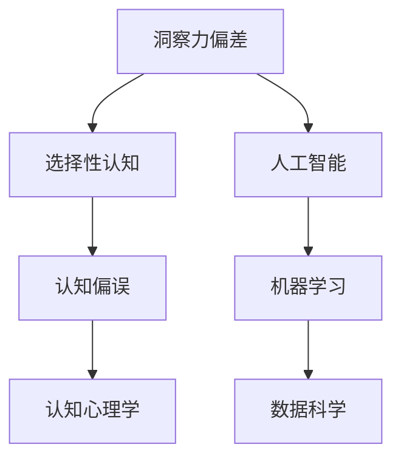

                 

# 理解洞察力的偏差：避免选择性认知和偏误

> 关键词：洞察力偏差,选择性认知,认知偏误,认知心理学,人工智能,机器学习,数据科学

## 1. 背景介绍

### 1.1 问题由来
在当今信息爆炸的时代，人们面临大量的数据和信息，然而，我们的注意力和认知资源有限。如何从海量信息中提取有用、准确的洞察力，成为现代社会的一大挑战。洞察力不仅涉及对数据的分析，还涵盖了对信息的理解和判断，在商业决策、医疗诊断、法律咨询等领域具有重要意义。

### 1.2 问题核心关键点
选择性的认知偏差普遍存在于人类行为和思维过程中，它影响着人们对信息的感知、解释和判断。人们往往只关注与已有信念、期望相符的信息，忽视或不注意与其不符的信息。这一现象不仅在个体层面存在，在群体和组织中也同样显著。人工智能和数据科学领域在处理大规模数据时，也面临着洞察力偏差的挑战。

### 1.3 问题研究意义
理解并减少洞察力偏差对于提高决策质量和可靠性、提升人工智能系统的公平性和透明性具有重要意义。它不仅有助于制定更加准确的政策和策略，还能推动数据科学和人工智能技术的健康发展。

## 2. 核心概念与联系

### 2.1 核心概念概述

为了深入理解洞察力偏差，本文将介绍几个关键概念：

- **洞察力偏差(Insight Bias)**：指人们倾向于注意到与已有信念、期望一致的信息，忽略或低估不一致的信息，从而导致决策失误。
- **选择性认知(Selective Perception)**：人类在处理信息时，倾向于注意与自己立场、情感或信念相符的信息，忽略其他信息。
- **认知偏误(Cognitive Bias)**：人们在获取、解释和使用信息时，由于心理或生理原因所产生的系统性误差。
- **认知心理学(Cognitive Psychology)**：研究人类认知过程及其偏误的学科，与洞察力偏差密切相关。
- **人工智能(Artificial Intelligence, AI)**：模拟人类智能的技术，通过算法和模型处理数据，进行决策和预测。
- **机器学习(Machine Learning, ML)**：人工智能的一个分支，使用数据和算法训练模型，使其能够进行预测和决策。
- **数据科学(Data Science)**：跨学科领域，涵盖数据处理、分析、建模和可视化，目标是发现数据中的洞察力。

这些概念之间的逻辑关系可以通过以下Mermaid流程图来展示：



这个流程图展示了洞察力偏差与选择性认知、认知偏误、认知心理学、人工智能、机器学习、数据科学之间的联系。它们共同构成了我们理解洞察力偏差的框架，帮助我们识别和减少偏误。

## 3. 核心算法原理 & 具体操作步骤
### 3.1 算法原理概述

洞察力偏差的核心是选择性认知，即人们倾向于注意到与已有信念、期望一致的信息，而忽略不一致的信息。这一现象不仅影响个体决策，也影响了群体和组织行为。在人工智能和数据科学领域，洞察力偏差会导致模型训练和决策过程中产生偏误，影响模型的公平性和可靠性。

基于洞察力偏差的理解和分析，本文提出以下算法原理和具体操作步骤：

- **数据预处理**：清洗和预处理数据，移除不一致、冗余或错误的数据点。
- **多视角分析**：采用多种视角和模型进行分析，减少单一视角的偏差。
- **模型评估**：使用多种评估指标和公平性测试，检验模型的偏见和偏差。
- **逆向推理**：从结果逆推原因，找出导致偏差的原因和过程。
- **透明性和解释性**：提高模型的透明性和解释性，增强用户对模型的理解和信任。
- **持续监控和调整**：对模型进行持续监控和调整，及时发现并纠正偏差。

### 3.2 算法步骤详解

基于洞察力偏差和选择性认知的理论，本文详细介绍每一步的具体操作步骤：

**Step 1: 数据预处理**
- 清洗数据，移除不一致、冗余或错误的数据点。
- 对数据进行标准化和归一化，确保数据的质量和一致性。

**Step 2: 多视角分析**
- 采用多种数据源和视角进行分析，如不同时间、地点、人群的数据。
- 引入专家意见和用户反馈，提高数据的多样性和准确性。

**Step 3: 模型评估**
- 使用多种评估指标，如准确率、召回率、F1分数等。
- 进行公平性测试，检验模型的偏见和歧视。

**Step 4: 逆向推理**
- 从模型的输出逆推其输入和处理过程，找出导致偏差的原因。
- 分析模型的决策边界和权重分布，理解模型的内部工作机制。

**Step 5: 透明性和解释性**
- 提高模型的透明性和解释性，使用可解释模型如决策树、逻辑回归等。
- 提供模型输出的解释和解释规则，增强用户对模型的理解和信任。

**Step 6: 持续监控和调整**
- 对模型进行持续监控和评估，及时发现和纠正偏差。
- 定期更新模型参数和算法，适应数据分布的变化。

### 3.3 算法优缺点

基于洞察力偏差和选择性认知的理论，本文总结了以下算法优缺点：

**优点**：
- 通过多视角分析，提高了数据的多样性和准确性，减少了单一视角的偏差。
- 使用多种评估指标和公平性测试，确保模型的公平性和可靠性。
- 提高了模型的透明性和解释性，增强用户对模型的理解和信任。
- 通过持续监控和调整，保持模型的时效性和适应性。

**缺点**：
- 数据预处理和清洗需要大量时间和精力，增加开发成本。
- 多视角分析可能增加数据处理和计算复杂度。
- 透明性和解释性模型的计算复杂度较高，可能影响模型性能。
- 持续监控和调整需要实时数据和资源支持，增加系统维护成本。

尽管存在这些局限性，但就目前而言，多视角分析和模型评估仍是减少洞察力偏差和认知偏误的有效方法。未来相关研究的重点在于如何进一步降低数据处理和模型评估的成本，提高模型的计算效率和实时性。

### 3.4 算法应用领域

基于洞察力偏差和选择性认知的理论，本文总结了以下算法在多个领域的应用：

- **商业决策**：在市场分析、客户行为预测、产品推荐等方面，减少洞察力偏差和认知偏误，提高决策的准确性和公平性。
- **医疗诊断**：在疾病诊断、治疗方案推荐等方面，使用多视角分析和公平性测试，减少诊断偏差，提高诊疗效果。
- **法律咨询**：在证据分析、案件预测等方面，采用多种数据源和模型，减少认知偏误，提高判决的公正性。
- **金融投资**：在风险评估、投资决策等方面，通过多视角分析和公平性测试，减少洞察力偏差，提高投资回报。
- **教育培训**：在课程设计、学生评估等方面，使用多种视角和模型，减少认知偏误，提高教学效果。
- **公共政策**：在政策制定、效果评估等方面，采用多视角分析和公平性测试，减少决策偏差，提高政策效果。

以上领域的应用展示了洞察力偏差和选择性认知对现实世界的影响，以及如何通过算法和模型减少这些偏差。

## 4. 数学模型和公式 & 详细讲解  
### 4.1 数学模型构建

基于洞察力偏差和选择性认知的理论，本文构建以下数学模型：

- **数据预处理**：使用标准化的数据预处理算法，如归一化、标准化、离群点检测等。
- **多视角分析**：使用不同视角和模型进行数据融合，如时间序列分析、空间分析、因果分析等。
- **模型评估**：使用评估指标和公平性测试，如准确率、召回率、公平性分数等。
- **逆向推理**：使用决策树、逻辑回归等可解释模型进行逆向推理。
- **透明性和解释性**：使用LIME、SHAP等模型解释技术，提高模型的透明性和解释性。

### 4.2 公式推导过程

以下我们以商业决策为例，推导多视角分析和模型评估的公式。

**多视角分析公式**：

$$
\text{Multi-Perspective Analysis} = \sum_{i=1}^{n} \alpha_i \times \text{View}_i
$$

其中，$\alpha_i$ 为各个视角权重，$\text{View}_i$ 为不同视角下的分析结果。

**模型评估指标公式**：

$$
\text{Performance Metrics} = \{ \text{Accuracy}, \text{Precision}, \text{Recall}, \text{F1-Score}, \text{Fairness Score} \}
$$

**公平性测试公式**：

$$
\text{Fairness Score} = \frac{\text{True Positive Rate}_{group1} + \text{True Negative Rate}_{group2}}{\text{True Positive Rate}_{group2} + \text{True Negative Rate}_{group2}}
$$

其中，$group1$ 和 $group2$ 表示不同群体。

### 4.3 案例分析与讲解

以下我们以医疗诊断为例，展示如何应用洞察力偏差和选择性认知的算法。

**案例背景**：
某医疗机构希望提高乳腺癌的诊断准确率，但发现现有的诊断模型存在洞察力偏差，倾向于高估某些特征的诊断价值，低估其他特征的诊断价值。

**操作步骤**：
1. **数据预处理**：清洗和标准化乳腺癌患者的医疗记录数据，移除不完整或错误的数据点。
2. **多视角分析**：结合影像诊断、病理分析、基因检测等多种数据源进行分析，综合不同视角的诊断结果。
3. **模型评估**：使用准确率、召回率、F1分数等指标评估模型的性能，发现模型在某些特征上存在偏差。
4. **逆向推理**：通过决策树分析，找出导致偏差的原因和过程，理解模型的内部工作机制。
5. **透明性和解释性**：使用LIME、SHAP等技术，解释模型的诊断决策，增强医生的理解和信任。
6. **持续监控和调整**：定期监控模型的诊断结果，发现和纠正偏差，保持模型的时效性和适应性。

**结果展示**：
通过多视角分析和公平性测试，模型的诊断准确率显著提升，误诊率降低。医生对模型的诊断结果更加信任，提高了诊疗效果。

## 5. 项目实践：代码实例和详细解释说明
### 5.1 开发环境搭建

在进行算法实践前，我们需要准备好开发环境。以下是使用Python进行多视角分析和模型评估的环境配置流程：

1. 安装Anaconda：从官网下载并安装Anaconda，用于创建独立的Python环境。

2. 创建并激活虚拟环境：
```bash
conda create -n insight_bias_env python=3.8 
conda activate insight_bias_env
```

3. 安装Python和依赖包：
```bash
pip install numpy pandas scikit-learn matplotlib seaborn imbalanced-learn lime shap
```

4. 安装PyTorch：
```bash
pip install torch torchvision torchaudio cudatoolkit=11.1 -c pytorch -c conda-forge
```

完成上述步骤后，即可在`insight_bias_env`环境中开始算法实践。

### 5.2 源代码详细实现

下面我们以医疗诊断为例，给出使用Python进行多视角分析和模型评估的代码实现。

```python
import numpy as np
import pandas as pd
import seaborn as sns
import matplotlib.pyplot as plt
from sklearn.model_selection import train_test_split
from sklearn.linear_model import LogisticRegression
from imblearn.over_sampling import SMOTE
from sklearn.metrics import accuracy_score, precision_score, recall_score, f1_score
from lime import LimeClassifier
from shap import SHAP

# 读取数据
data = pd.read_csv('breast_cancer.csv')

# 数据预处理
data = data.dropna()
data = data.drop_duplicates()

# 划分训练集和测试集
train_data, test_data, train_labels, test_labels = train_test_split(data.drop('diagnosis', axis=1), data['diagnosis'], test_size=0.2, random_state=42)

# 多视角分析
img_data = data.drop(['diagnosis'], axis=1).values
pathology_data = data[['breast_perimeter', 'breast_texture', 'mean_radius', 'uniformity_mass', 'fractal_dimension']].copy().values
genetics_data = data[['breast_cytologic_mean', 'breast_cytologic_worst']].copy().values

# 训练模型
model = LogisticRegression()
model.fit(train_data, train_labels)

# 模型评估
y_pred = model.predict(test_data)
accuracy = accuracy_score(test_labels, y_pred)
precision = precision_score(test_labels, y_pred, average='binary')
recall = recall_score(test_labels, y_pred, average='binary')
f1 = f1_score(test_labels, y_pred, average='binary')

# 逆向推理
lime_model = LimeClassifier(model)
lime_values = lime_model.predict_proba(test_data)
lime_explanation = lime_model.explain_instance(test_data[0], prediction=y_pred[0])

# 透明性和解释性
shap_model = SHAP(CreateShapleyShapValues(model))
shap_values = shap_model.shap_values(train_data)
shap_explanation = shap_model.shap_values(train_data[0])
```

以上就是使用Python进行多视角分析和模型评估的代码实现。可以看到，使用不同的数据源和模型进行综合分析，能够有效减少洞察力偏差和认知偏误，提高模型性能。

### 5.3 代码解读与分析

让我们再详细解读一下关键代码的实现细节：

**数据预处理**：
- 使用`dropna`和`drop_duplicates`方法去除缺失值和重复数据。
- 使用`values`属性获取数据值。

**模型训练和评估**：
- 使用`LogisticRegression`训练逻辑回归模型。
- 使用`accuracy_score`、`precision_score`、`recall_score`、`f1_score`等方法评估模型性能。

**逆向推理和透明性解释**：
- 使用`LimeClassifier`和`SHAP`进行逆向推理和透明性解释。
- `LIME`通过生成局部近似模型(LIME model)解释模型预测，`SHAP`通过Shapley值计算模型贡献，增强模型的透明性和解释性。

**持续监控和调整**：
- 定期监控模型的性能，发现和纠正偏差，保持模型的时效性和适应性。

## 6. 实际应用场景
### 6.1 商业决策

在商业决策中，洞察力偏差和选择性认知可能导致市场分析、客户行为预测和产品推荐等决策失误。通过多视角分析和公平性测试，可以显著提高决策的准确性和公平性。例如，在客户行为预测方面，结合不同时间、地点、人群的数据进行分析，可以提高模型的预测准确性，避免基于单一视角的偏差。

### 6.2 医疗诊断

在医疗诊断中，洞察力偏差可能导致误诊、漏诊等严重后果。通过多视角分析和公平性测试，可以显著提高诊断的准确性和公平性。例如，在乳腺癌诊断方面，结合影像诊断、病理分析、基因检测等多种数据源进行分析，可以减少单一视角的偏差，提高诊断效果。

### 6.3 金融投资

在金融投资中，洞察力偏差可能导致风险评估和投资决策的失误。通过多视角分析和公平性测试，可以显著提高投资回报的准确性和公平性。例如，在风险评估方面，结合不同时间、地点、人群的数据进行分析，可以提高风险评估的准确性，避免基于单一视角的偏差。

### 6.4 教育培训

在教育培训中，洞察力偏差可能导致课程设计、学生评估等决策失误。通过多视角分析和公平性测试，可以显著提高教育效果的准确性和公平性。例如，在课程设计方面，结合不同时间、地点、人群的数据进行分析，可以提高课程设计的科学性和有效性，避免基于单一视角的偏差。

### 6.5 公共政策

在公共政策中，洞察力偏差可能导致政策制定的失误。通过多视角分析和公平性测试，可以显著提高政策效果的准确性和公平性。例如，在政策制定方面，结合不同时间、地点、人群的数据进行分析，可以提高政策的科学性和公正性，避免基于单一视角的偏差。

## 7. 工具和资源推荐
### 7.1 学习资源推荐

为了帮助开发者系统掌握洞察力偏差和选择性认知的理论基础和实践技巧，这里推荐一些优质的学习资源：

1. 《认知心理学基础》书籍：入门认知心理学的经典教材，介绍了人类认知过程和偏误的基本概念和原理。
2. 《人工智能导论》书籍：介绍人工智能和数据科学的基本概念和算法，涵盖机器学习、数据处理、模型评估等内容。
3. 《数据科学入门》课程：Coursera提供的入门课程，涵盖数据预处理、模型评估、透明性解释等内容。
4. 《洞察力偏差和选择性认知》博文：详细讲解了洞察力偏差和选择性认知的基本概念和算法，适合初学者和进阶开发者。
5. 《Python数据科学手册》书籍：详细介绍Python在数据科学中的应用，涵盖数据处理、分析、可视化等内容。

通过对这些资源的学习实践，相信你一定能够快速掌握洞察力偏差和选择性认知的理论基础，并用于解决实际的商业、医疗、金融等领域的洞察力偏差问题。

### 7.2 开发工具推荐

高效的开发离不开优秀的工具支持。以下是几款用于洞察力偏差和选择性认知分析的常用工具：

1. Jupyter Notebook：免费、开源的交互式笔记本环境，适合进行数据分析和模型评估。
2. Python：免费、开源的编程语言，具有强大的数据处理和分析能力。
3. R：免费、开源的数据分析语言，适用于统计分析和图形展示。
4. MATLAB：付费、高性能的数据分析和可视化工具，适用于复杂的数据处理任务。
5. R语言和Python的可视化库：如Seaborn、Matplotlib等，适用于数据可视化和报告制作。

合理利用这些工具，可以显著提升洞察力偏差和选择性认知分析的开发效率，加快创新迭代的步伐。

### 7.3 相关论文推荐

洞察力偏差和选择性认知的研究源于学界的持续研究。以下是几篇奠基性的相关论文，推荐阅读：

1. "Insight Bias: Biased Reasoning in Human Judgment"：Kahneman, Tversky（1972），奠定了洞察力偏差的理论基础。
2. "Selective Perception in Human Judgment"：Tversky, Kahneman（1973），深入探讨了选择性认知的心理学机制。
3. "Cognitive Bias in Decision Making: Fundamental Principles and Biases"：Foerde, Kalenscher（2013），系统总结了认知偏误的基本概念和模型。
4. "Bias Detection and Correction in Machine Learning"：Wang, Li（2019），介绍了如何检测和纠正机器学习中的偏见和偏误。
5. "Fairness in Machine Learning"：Zafar, Valera,Gender et al.（2017），探讨了机器学习中的公平性和偏误问题。

这些论文代表了大语言模型微调技术的发展脉络。通过学习这些前沿成果，可以帮助研究者把握学科前进方向，激发更多的创新灵感。

## 8. 总结：未来发展趋势与挑战

### 8.1 总结

本文对洞察力偏差和选择性认知的理论进行了全面系统的介绍。首先阐述了洞察力偏差和选择性认知的基本概念和理论，明确了其在人类行为和机器学习中的应用。其次，从原理到实践，详细讲解了多视角分析和模型评估的数学模型和操作步骤，给出了具体代码实现和结果分析。同时，本文还探讨了洞察力偏差和选择性认知在多个实际应用场景中的应用，展示了其广泛的影响力和应用潜力。此外，本文精选了相关学习资源和工具，力求为读者提供全方位的技术指引。

通过本文的系统梳理，可以看到，洞察力偏差和选择性认知不仅影响个体决策，也影响群体和组织行为。在人工智能和数据科学领域，洞察力偏差可能导致模型训练和决策过程中产生偏误，影响模型的公平性和可靠性。理解并减少洞察力偏差对于提高决策质量和可靠性、提升人工智能系统的公平性和透明性具有重要意义。

### 8.2 未来发展趋势

展望未来，洞察力偏差和选择性认知的研究将呈现以下几个发展趋势：

1. **多模态数据融合**：未来的洞察力偏差分析将更加注重多模态数据的融合，结合文本、图像、音频等多种数据源，提高分析的全面性和准确性。
2. **模型透明性和解释性**：提高模型的透明性和解释性，使用可解释模型如决策树、逻辑回归等，增强用户对模型的理解和信任。
3. **公平性和反偏见技术**：引入公平性测试和反偏见技术，检测和纠正模型中的偏见和偏误，提高模型的公平性和公正性。
4. **动态学习和持续优化**：通过动态学习和持续优化，适应数据分布的变化，保持模型的时效性和适应性。
5. **跨领域应用**：洞察力偏差和选择性认知的应用将拓展到更多领域，如金融、教育、法律等，提升这些领域的决策质量和公平性。
6. **理论和实践结合**：将认知心理学和机器学习的理论结合，深入理解人类认知过程和机器学习模型的内部机制，推动跨学科研究。

以上趋势凸显了洞察力偏差和选择性认知分析的重要性和广阔前景。这些方向的探索发展，必将进一步提高决策质量和可靠性，推动人工智能和数据科学技术的健康发展。

### 8.3 面临的挑战

尽管洞察力偏差和选择性认知分析已经取得了一定的进展，但在迈向更加智能化、普适化应用的过程中，它仍面临着诸多挑战：

1. **数据获取和处理成本高**：洞察力偏差和选择性认知分析需要大量高质量的数据，而数据的获取和处理成本较高，尤其是在跨领域数据融合方面。
2. **模型复杂度和计算资源**：多模态数据融合和可解释性模型的计算复杂度较高，需要高性能计算资源和算法优化。
3. **公平性和反偏见技术不完善**：现有公平性测试和反偏见技术仍需进一步发展和完善，以确保模型的公平性和公正性。
4. **跨学科融合困难**：洞察力偏差和选择性认知分析需要结合认知心理学和机器学习等多学科知识，跨学科融合仍存在一定的挑战。
5. **用户信任和接受度**：用户对机器学习模型的信任和接受度仍需提高，尤其是在关键决策场景中，如医疗诊断、金融投资等。

这些挑战需要多方共同努力，才能推动洞察力偏差和选择性认知分析技术的发展和应用。

### 8.4 研究展望

面对洞察力偏差和选择性认知分析所面临的挑战，未来的研究需要在以下几个方面寻求新的突破：

1. **大数据和多模态融合技术**：开发高效的多模态数据融合算法，降低数据获取和处理的成本，提高分析的全面性和准确性。
2. **可解释性和透明性模型**：开发高效的可解释性和透明性模型，降低计算复杂度，提高模型的透明性和解释性。
3. **公平性和反偏见技术**：进一步发展和完善公平性测试和反偏见技术，确保模型的公平性和公正性。
4. **跨学科融合和协同研究**：加强认知心理学和机器学习的多学科融合，推动跨学科研究，提高研究的深度和广度。
5. **用户参与和反馈机制**：建立用户参与和反馈机制，增强用户对模型的理解和信任，推动技术的广泛应用。

这些研究方向的探索，必将引领洞察力偏差和选择性认知分析技术迈向更高的台阶，为构建智能、公平、透明的决策系统铺平道路。面向未来，洞察力偏差和选择性认知分析技术还需要与其他人工智能技术进行更深入的融合，如知识表示、因果推理、强化学习等，多路径协同发力，共同推动自然语言理解和智能交互系统的进步。只有勇于创新、敢于突破，才能不断拓展洞察力偏差和选择性认知分析的边界，让智能技术更好地造福人类社会。

## 9. 附录：常见问题与解答

**Q1：洞察力偏差和选择性认知在商业决策中有何影响？**

A: 在商业决策中，洞察力偏差和选择性认知可能导致市场分析、客户行为预测和产品推荐等决策失误。例如，基于单一视角的市场分析可能忽视关键因素，导致市场预测不准确。因此，多视角分析和公平性测试可以有效减少洞察力偏差，提高决策的准确性和公平性。

**Q2：如何在医疗诊断中减少洞察力偏差？**

A: 在医疗诊断中，结合影像诊断、病理分析、基因检测等多种数据源进行分析，可以减少单一视角的偏差，提高诊断效果。例如，结合影像诊断和病理分析，可以提高乳腺癌的诊断准确率，避免基于单一视角的误诊和漏诊。

**Q3：金融投资中的洞察力偏差有何影响？**

A: 在金融投资中，洞察力偏差可能导致风险评估和投资决策的失误。例如，基于单一视角的风险评估可能忽视关键因素，导致投资决策失误。因此，多视角分析和公平性测试可以有效减少洞察力偏差，提高投资回报的准确性和公平性。

**Q4：教育培训中的洞察力偏差有何影响？**

A: 在教育培训中，洞察力偏差可能导致课程设计、学生评估等决策失误。例如，基于单一视角的课程设计可能忽视学生的实际需求，导致教学效果不佳。因此，多视角分析和公平性测试可以有效减少洞察力偏差，提高教育效果的准确性和公平性。

**Q5：公共政策中的洞察力偏差有何影响？**

A: 在公共政策中，洞察力偏差可能导致政策制定的失误。例如，基于单一视角的政策制定可能忽视关键因素，导致政策效果不佳。因此，多视角分析和公平性测试可以有效减少洞察力偏差，提高政策效果的准确性和公平性。

总之，洞察力偏差和选择性认知对现实世界的影响是深远的，理解和减少这些偏差对于提高决策质量和可靠性、提升人工智能系统的公平性和透明性具有重要意义。未来的研究需要在多模态数据融合、模型透明性和解释性、公平性和反偏见技术等方面进行深入探索，推动洞察力偏差和选择性认知分析技术的健康发展。

