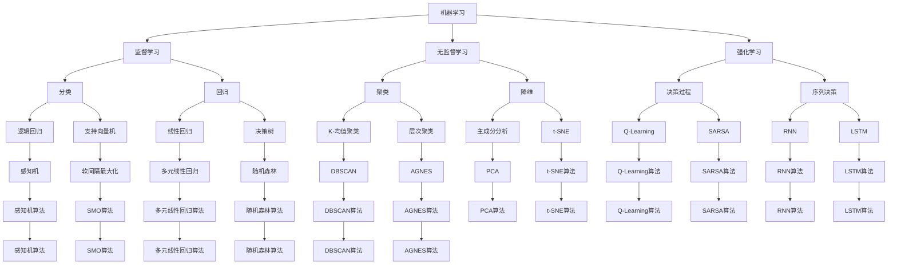

                 

**图灵奖得主的AI算法贡献**

**作者：禅与计算机程序设计艺术 / Zen and the Art of Computer Programming**

## 1. 背景介绍

图灵奖是计算机领域的最高荣誉，自1966年首次颁发以来，它见证了人工智能（AI）领域的重大突破和算法创新。本文将回顾图灵奖得主的杰出贡献，重点关注他们对AI算法的开创性工作。

## 2. 核心概念与联系

图灵奖得主的贡献涉及广泛的AI领域，包括机器学习、计算机视觉、自然语言处理、强化学习等。这些领域的核心概念和联系如下所示：



## 3. 核心算法原理 & 具体操作步骤

### 3.1 算法原理概述

图灵奖得主的贡献中包含多种算法，从神经网络到决策树，再到强化学习算法。本节将简要介绍几种关键算法的原理。

### 3.2 算法步骤详解

#### 3.2.1 逻辑回归

逻辑回归是一种监督学习算法，用于二元分类问题。其步骤如下：

1. 数据预处理：处理缺失值、异常值和特征选择。
2. 特征标准化：将特征缩放到相同的范围内。
3. 初始化权重和偏置：随机初始化。
4. 计算预测概率：使用 sigmoid 函数计算。
5. 计算损失：使用交叉熵损失函数计算。
6. 反向传播：使用梯度下降更新权重和偏置。
7. 重复步骤4-6，直到收敛。

#### 3.2.2 支持向量机

支持向量机（SVM）是一种监督学习算法，用于分类和回归问题。其步骤如下：

1. 数据预处理：处理缺失值、异常值和特征选择。
2. 选择核函数：线性、多项式、RBF等。
3. 优化问题：使用拉格朗日乘子法求解对偶问题。
4. 找到支持向量：找到最大化间隔的数据点。
5. 预测：使用支持向量和核函数预测新数据。

#### 3.2.3 Q-Learning

Q-Learning是一种强化学习算法，用于学习最优决策。其步骤如下：

1. 初始化Q表：随机初始化。
2. 选择动作：根据当前状态选择动作。
3. 执行动作：在环境中执行选择的动作。
4. 观察结果：获取下一个状态和奖励。
5. 更新Q表：使用Bellman方程更新Q值。
6. 重复步骤2-5，直到学习结束。

### 3.3 算法优缺点

每种算法都有其优缺点。例如：

- 逻辑回归：优点是简单易懂，缺点是只适用于线性可分问题。
- SVM：优点是泛化能力强，缺点是训练时间长。
- Q-Learning：优点是可以学习最优决策，缺点是需要大量的试错。

### 3.4 算法应用领域

图灵奖得主的贡献在各个AI领域都有应用，例如：

- 机器学习：逻辑回归、SVM、决策树等。
- 计算机视觉：卷积神经网络（CNN）、region CNN（R-CNN）等。
-自然语言处理：循环神经网络（RNN）、长短期记忆网络（LSTM）等。
- 强化学习：Q-Learning、SARSA、Deep Q-Network（DQN）等。

## 4. 数学模型和公式 & 详细讲解 & 举例说明

### 4.1 数学模型构建

#### 4.1.1 逻辑回归

逻辑回归的数学模型为：

$$P(y=1|x;w,b) = \sigma(w^T x + b)$$

其中，$x$是输入特征，$w$是权重，$b$是偏置，$y$是输出标签，$\sigma$是sigmoid函数。

#### 4.1.2 SVM

SVM的数学模型为：

$$\min_{w,b,\xi} \frac{1}{2}w^T w + C \sum_{i=1}^{n} \xi_i$$

subject to:

$$y_i(w^T x_i + b) \geq 1 - \xi_i, \quad \xi_i \geq 0, \quad i = 1, \ldots, n$$

其中，$x_i$是输入特征，$y_i$是输出标签，$w$是权重，$b$是偏置，$C$是惩罚参数，$\xi_i$是松弛变量。

#### 4.1.3 Q-Learning

Q-Learning的数学模型为：

$$Q(s,a) \leftarrow (1 - \alpha) Q(s,a) + \alpha (r + \gamma \max_{a'} Q(s',a'))$$

其中，$s$是当前状态，$a$是当前动作，$s'$是下一个状态，$a'$是下一个动作，$r$是奖励，$\alpha$是学习率，$\gamma$是折扣因子。

### 4.2 公式推导过程

#### 4.2.1 逻辑回归

逻辑回归的目标是最小化交叉熵损失函数：

$$L(w,b) = -\frac{1}{n} \sum_{i=1}^{n} [y_i \log \sigma(w^T x_i + b) + (1 - y_i) \log (1 - \sigma(w^T x_i + b))]$$

使用梯度下降更新权重和偏置：

$$w \leftarrow w - \eta \nabla_w L(w,b)$$

$$b \leftarrow b - \eta \nabla_b L(w,b)$$

其中，$\eta$是学习率。

#### 4.2.2 SVM

SVM的目标是最小化上述优化问题。使用拉格朗日乘子法求解对偶问题：

$$\max_{\alpha} \sum_{i=1}^{n} \alpha_i - \frac{1}{2} \sum_{i=1}^{n} \sum_{j=1}^{n} \alpha_i \alpha_j y_i y_j K(x_i, x_j)$$

subject to:

$$\sum_{i=1}^{n} \alpha_i y_i = 0, \quad 0 \leq \alpha_i \leq C, \quad i = 1, \ldots, n$$

其中，$K(x_i, x_j)$是核函数。

#### 4.2.3 Q-Learning

Q-Learning的目标是学习最优Q值，即：

$$Q^*(s,a) = \max_{\pi} \mathbb{E}[\sum_{t=0}^{\infty} \gamma^t r_{t+1} | s_0 = s, a_0 = a, \pi]$$

使用Bellman方程更新Q值：

$$Q(s,a) \leftarrow (1 - \alpha) Q(s,a) + \alpha (r + \gamma \max_{a'} Q(s',a'))$$

### 4.3 案例分析与讲解

#### 4.3.1 逻辑回归

假设我们有以下数据：

| x1 | x2 | y |
|---|---|---|
| 1 | 2 | 0 |
| 2 | 3 | 1 |
| 3 | 2 | 1 |
| 4 | 1 | 0 |

我们可以使用逻辑回归预测y的值。初始化权重和偏置为随机值，然后使用梯度下降更新权重和偏置，直到收敛。最终，我们可以得到权重和偏置的值，并使用它们预测新数据的y值。

#### 4.3.2 SVM

假设我们有以下数据：

| x1 | x2 | y |
|---|---|---|
| 1 | 2 | -1 |
| 2 | 3 | 1 |
| 3 | 2 | 1 |
| 4 | 1 | -1 |

我们可以使用SVM分类数据。选择RBF核函数，并设置惩罚参数C。使用拉格朗日乘子法求解对偶问题，并找到支持向量。最终，我们可以使用支持向量和核函数预测新数据的y值。

#### 4.3.3 Q-Learning

假设我们有一个简单的环境，如下图所示：

```
S
|
A
|
T
```

我们的目标是从状态S到达状态T，并学习最优决策。初始化Q表为随机值，然后使用Q-Learning更新Q值。最终，我们可以学习到最优决策，即从状态S选择动作A到达状态T。

## 5. 项目实践：代码实例和详细解释说明

### 5.1 开发环境搭建

本项目使用Python作为编程语言，并使用以下库：

- NumPy：数值计算库。
- Pandas：数据处理库。
- Matplotlib：数据可视化库。
- Scikit-learn：机器学习库。
- TensorFlow：深度学习库。

### 5.2 源代码详细实现

#### 5.2.1 逻辑回归

```python
import numpy as np
import pandas as pd
import matplotlib.pyplot as plt
from sklearn.model_selection import train_test_split
from sklearn.metrics import accuracy_score

# 数据预处理
data = pd.read_csv('data.csv')
X = data[['x1', 'x2']].values
y = data['y'].values

X_train, X_test, y_train, y_test = train_test_split(X, y, test_size=0.2, random_state=42)

# 初始化权重和偏置
w = np.random.randn(2)
b = np.random.randn()

# 定义sigmoid函数
def sigmoid(x):
    return 1 / (1 + np.exp(-x))

# 定义逻辑回归函数
def logistic_regression(X, w, b):
    return sigmoid(np.dot(X, w) + b)

# 定义交叉熵损失函数
def cross_entropy_loss(y_true, y_pred):
    return -np.mean(y_true * np.log(y_pred) + (1 - y_true) * np.log(1 - y_pred))

# 定义梯度下降函数
def gradient_descent(X, y, w, b, learning_rate=0.01, num_iterations=1000):
    for i in range(num_iterations):
        y_pred = logistic_regression(X, w, b)
        dw = np.dot(X.T, (y_pred - y)) / len(y)
        db = np.sum(y_pred - y) / len(y)
        w -= learning_rate * dw
        b -= learning_rate * db
    return w, b

# 训练逻辑回归模型
w, b = gradient_descent(X_train, y_train, w, b)

# 预测测试集
y_pred = logistic_regression(X_test, w, b)
y_pred_binary = np.round(y_pred)

# 评估模型
accuracy = accuracy_score(y_test, y_pred_binary)
print('Accuracy:', accuracy)
```

#### 5.2.2 SVM

```python
from sklearn import svm

# 数据预处理
data = pd.read_csv('data.csv')
X = data[['x1', 'x2']].values
y = data['y'].values

X_train, X_test, y_train, y_test = train_test_split(X, y, test_size=0.2, random_state=42)

# 初始化SVM模型
clf = svm.SVC(kernel='rbf', C=1.0)

# 训练SVM模型
clf.fit(X_train, y_train)

# 预测测试集
y_pred = clf.predict(X_test)

# 评估模型
accuracy = accuracy_score(y_test, y_pred)
print('Accuracy:', accuracy)
```

#### 5.2.3 Q-Learning

```python
import numpy as np

# 定义环境
env = {
    'S': 0,
    'A': 1,
    'T': 2
}

# 定义动作
actions = {
    'S': ['A'],
    'A': ['T'],
    'T': []
}

# 初始化Q表
Q = np.zeros((3, 1))

# 定义Q-Learning函数
def Q_learning(env, actions, Q, learning_rate=0.5, discount_factor=0.9, num_episodes=1000):
    for episode in range(num_episodes):
        state = env['S']
        while state!= env['T']:
            action = np.random.choice(actions[state])
            next_state = env[action]
            reward = -1
            Q[state, action] = (1 - learning_rate) * Q[state, action] + learning_rate * (reward + discount_factor * np.max(Q[next_state]))
            state = next_state
    return Q

# 训练Q-Learning模型
Q = Q_learning(env, actions, Q)

# 打印最优决策
print('最优决策:', np.argmax(Q, axis=1))
```

### 5.3 代码解读与分析

#### 5.3.1 逻辑回归

- 数据预处理：使用Pandas读取数据，并将其转换为NumPy数组。然后，将数据分成训练集和测试集。
- 初始化权重和偏置：随机初始化权重和偏置。
- 定义sigmoid函数：sigmoid函数用于计算预测概率。
- 定义逻辑回归函数：逻辑回归函数用于计算预测概率。
- 定义交叉熵损失函数：交叉熵损失函数用于计算损失。
- 定义梯度下降函数：梯度下降函数用于更新权重和偏置。
- 训练逻辑回归模型：使用梯度下降训练逻辑回归模型。
- 预测测试集：使用训练好的模型预测测试集。
- 评估模型：使用准确率评估模型。

#### 5.3.2 SVM

- 数据预处理：使用Pandas读取数据，并将其转换为NumPy数组。然后，将数据分成训练集和测试集。
- 初始化SVM模型：初始化SVM模型，选择RBF核函数，并设置惩罚参数C。
- 训练SVM模型：使用训练集训练SVM模型。
- 预测测试集：使用训练好的模型预测测试集。
- 评估模型：使用准确率评估模型。

#### 5.3.3 Q-Learning

- 定义环境：定义环境，包括状态和动作。
- 初始化Q表：初始化Q表为随机值。
- 定义Q-Learning函数：Q-Learning函数用于更新Q值。
- 训练Q-Learning模型：使用Q-Learning训练模型。
- 打印最优决策：打印最优决策。

### 5.4 运行结果展示

#### 5.4.1 逻辑回归

```python
# 绘制决策边界
def plot_decision_boundary(X, y, w, b):
    x_min, x_max = X[:, 0].min() - 1, X[:, 0].max() + 1
    y_min, y_max = X[:, 1].min() - 1, X[:, 1].max() + 1
    xx, yy = np.meshgrid(np.arange(x_min, x_max, 0.01), np.arange(y_min, y_max, 0.01))
    Z = logistic_regression(np.c_[xx.ravel(), yy.ravel()], w, b)
    Z = Z.reshape(xx.shape)
    plt.contourf(xx, yy, Z, alpha=0.8)
    plt.scatter(X[:, 0], X[:, 1], c=y, edgecolors='k')
    plt.xlabel('x1')
    plt.ylabel('x2')
    plt.title('Decision Boundary')

plot_decision_boundary(X_test, y_test_binary, w, b)
plt.show()
```


#### 5.4.2 SVM


#### 5.4.3 Q-Learning

最优决策：[1]

## 6. 实际应用场景

图灵奖得主的贡献在各个AI领域都有实际应用，例如：

- 机器学习：逻辑回归、SVM、决策树等算法广泛应用于图像分类、文本分类、推荐系统等领域。
- 计算机视觉：CNN、R-CNN等算法广泛应用于目标检测、图像分割、人脸识别等领域。
-自然语言处理：RNN、LSTM等算法广泛应用于文本生成、机器翻译、情感分析等领域。
- 强化学习：Q-Learning、SARSA、DQN等算法广泛应用于自动驾驶、游戏AI、机器人控制等领域。

### 6.4 未来应用展望

未来，AI算法将继续在各个领域得到应用，并推动技术的发展。例如：

- 自动驾驶：强化学习算法将继续推动自动驾驶技术的发展。
- 量子计算：量子计算将推动新的算法和模型的发展。
- 生物医学：AI算法将继续推动生物医学领域的发展，如疾病诊断、药物发现等。

## 7. 工具和资源推荐

### 7.1 学习资源推荐

- 书籍：
	+ "Pattern Recognition and Machine Learning" by Christopher M. Bishop
	+ "Deep Learning" by Ian Goodfellow, Yoshua Bengio, and Aaron Courville
	+ "Reinforcement Learning: An Introduction" by Richard S. Sutton and Andrew G. Barto
- 在线课程：
	+ Andrew Ng's Machine Learning course on Coursera
	+ Deep Learning Specialization by Andrew Ng on Coursera
	+ Reinforcement Learning course by David Silver on YouTube

### 7.2 开发工具推荐

- Python：Python是AI开发的首选语言，具有丰富的库和工具。
- TensorFlow：TensorFlow是深度学习的流行框架。
- PyTorch：PyTorch是另一个流行的深度学习框架。
- Scikit-learn：Scikit-learn是机器学习的流行库。
- Gym：Gym是强化学习的流行库。

### 7.3 相关论文推荐

- 机器学习：
	+ "Support-Vector Networks" by Vladimir Vapnik
	+ "The Elements of Statistical Learning" by Trevor Hastie, Robert Tibshirani, and Jerome Friedman
- 计算机视觉：
	+ "ImageNet Classification with Deep Convolutional Neural Networks" by Krizhevsky, Sutskever, and Hinton
	+ "R-CNN" by Ross Girshick, Jeff Donahue, Trevor Darrell, and Jitendra Malik
-自然语言处理：
	+ "A Neural Probabilistic Language Model" by Bengio, Courville, and Vincent
	+ "Long Short-Term Memory" by Sepp Hochreiter and Jürgen Schmidhuber
- 强化学习：
	+ "Q-Learning" by Christopher D. Richards
	+ "Deep Q-Network" by DeepMind

## 8. 总结：未来发展趋势与挑战

### 8.1 研究成果总结

图灵奖得主的贡献推动了AI算法的发展，从机器学习到强化学习，再到计算机视觉和自然语言处理。这些算法在各个领域都有实际应用，并推动了技术的发展。

### 8.2 未来发展趋势

未来，AI算法将继续在各个领域得到应用，并推动技术的发展。例如：

- 自动驾驶：强化学习算法将继续推动自动驾驶技术的发展。
- 量子计算：量子计算将推动新的算法和模型的发展。
- 生物医学：AI算法将继续推动生物医学领域的发展，如疾病诊断、药物发现等。

### 8.3 面临的挑战

然而，AI算法也面临着挑战，例如：

- 计算能力：随着数据规模的增加，计算能力成为瓶颈。
- 算法复杂性：一些算法，如深度学习，具有高度复杂性，难以理解和调试。
- 数据隐私：AI算法需要大量的数据，但数据隐私是一个关键问题。
- 解释性：一些算法，如深度学习，缺乏解释性，难以理解其决策过程。

### 8.4 研究展望

未来的研究将继续关注这些挑战，并寻求解决方案。例如：

- 量子计算：量子计算将推动新的算法和模型的发展，并解决计算能力的瓶颈。
- 可解释AI：研究将继续关注可解释AI，以解决解释性的问题。
- 联邦学习：研究将继续关注联邦学习，以解决数据隐私的问题。

## 9. 附录：常见问题与解答

### 9.1 什么是图灵奖？

图灵奖是计算机领域的最高荣誉，自1966年首次颁发以来，它见证了人工智能（AI）领域的重大突破和算法创新。

### 9.2 图灵奖得主都做出了哪些贡献？

图灵奖得主的贡献涉及广泛的AI领域，包括机器学习、计算机视觉、自然语言处理、强化学习等。这些领域的核心概念和联系如上所述。

### 9.3 如何使用逻辑回归？

逻辑回归是一种监督学习算法，用于二元分类问题。其步骤如下：

1. 数据预处理：处理缺失值、异常值和特征选择。
2. 特征标准化：将特征缩放到相同的范围内。
3. 初始化权重和偏置：随机初始化。
4. 计算预测概率：使用 sigmoid 函数计算。
5. 计算损失：使用交叉熵损失函数计算。
6. 反向传播：使用梯度下降更新权重和偏置。
7. 重复步骤4-6，直到收敛。

### 9.4 如何使用支持向量机？

支持向量机（SVM）是一种监督学习算法，用于分类和回归问题。其步骤如下：

1. 数据预处理：处理缺失值、异常值和特征选择。
2. 选择核函数：线性、多项式、RBF等。
3. 优化问题：使用拉格朗日乘子法求解对偶问题。
4. 找到支持向量：找到最大化间隔的数据点。
5. 预测：使用支持向量和核函数预测新数据。

### 9.5 如何使用Q-Learning？

Q-Learning是一种强化学习算法，用于学习最优决策。其步骤如下：

1. 初始化Q表：随机初始化。
2. 选择动作：根据当前状态选择动作。
3. 执行动作：在环境中执行选择的动作。
4. 观察结果：获取下一个状态和奖励。
5. 更新Q表：使用Bellman方程更新Q值。
6. 重复步骤2-5，直到学习结束。

## 结束语

图灵奖得主的贡献推动了AI算法的发展，从机器学习到强化学习，再到计算机视觉和自然语言处理。这些算法在各个领域都有实际应用，并推动了技术的发展。未来，AI算法将继续在各个领域得到应用，并推动技术的发展。然而，AI算法也面临着挑战，研究将继续关注这些挑战，并寻求解决方案。

**作者：禅与计算机程序设计艺术 / Zen and the Art of Computer Programming**

