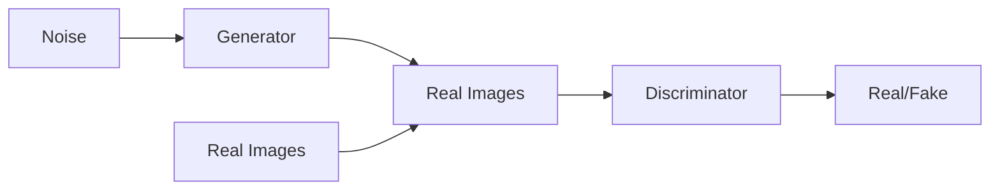

                 

**基于生成对抗网络的图像风格迁移在用户交互中的体验优化**

**作者：禅与计算机程序设计艺术 / Zen and the Art of Computer Programming**

## 1. 背景介绍

在当今的数字时代，图像处理和风格迁移技术已然成为人工智能领域的热门话题之一。图像风格迁移，即将一张图像的风格转移到另一张图像上，是计算机视觉领域的一个挑战性问题。生成对抗网络（Generative Adversarial Networks，GAN）的出现，为图像风格迁移带来了新的可能性。本文将深入探讨基于GAN的图像风 style迁移技术，并展示其在用户交互中的体验优化应用。

## 2. 核心概念与联系

### 2.1 生成对抗网络（GAN）原理

GAN由生成器（Generator，G）和判别器（Discriminator，D）两个网络组成，共同构成一个对抗系统。生成器负责产生图像，判别器则判断图像的真实性。两者通过对抗训练不断迭代，最终达到生成器产生真实图像，判别器无法区分真假图像的平衡状态。



### 2.2 图像风格迁移原理

图像风格迁移的目标是将一张图像的风格转移到另一张图像上。在GAN的框架下，我们可以将风格图像作为生成器的条件输入，从而生成风格迁移后的图像。

## 3. 核心算法原理 & 具体操作步骤

### 3.1 算法原理概述

本文介绍的图像风格迁移算法基于条件GAN（cGAN）框架，将风格图像作为条件输入，生成器产生风格迁移后的图像，判别器判断图像的真实性和风格一致性。

### 3.2 算法步骤详解

1. **预处理**：对输入图像（内容图像和风格图像）进行预处理，如resize、normalize等。
2. **特征提取**：使用预训练的卷积神经网络（如VGG）提取内容图像和风格图像的特征表示。
3. **条件生成**：将风格图像的特征表示作为生成器的条件输入，生成器产生风格迁移后的图像。
4. **判别与对抗训练**：判别器判断图像的真实性和风格一致性，生成器和判别器通过对抗训练不断迭代。
5. **后处理**：对生成的图像进行后处理，如denormalize、resize等，得到最终的风格迁移图像。

### 3.3 算法优缺点

**优点**：GAN框架下的图像风格迁移可以生成高质量、多样化的图像。条件GAN进一步提高了风格迁移的准确性。

**缺点**：GAN训练过程不稳定，容易陷入模式崩溃。此外，图像风格迁移的评价标准主观性较强，缺乏客观评价指标。

### 3.4 算法应用领域

图像风格迁移技术在图像处理、数字艺术、虚拟现实等领域有着广泛的应用。在用户交互中，图像风格迁移可以为用户提供个性化的视觉体验，如根据用户喜好自动调整图像风格。

## 4. 数学模型和公式 & 详细讲解 & 举例说明

### 4.1 数学模型构建

设内容图像为$x$, 风格图像为$y$, 生成器为$G(\cdot|\theta_g)$, 判别器为$D(\cdot|\theta_d)$. 我们的目标是学习参数$\theta_g$和$\theta_d$, 使得$G(x|y;\theta_g)$生成的图像与$y$具有相同的风格，且$D(x|y;\theta_d)$无法区分$G(x|y;\theta_g)$和真实图像。

### 4.2 公式推导过程

我们定义判别器的损失函数为：

$$L_D = \mathbb{E}_{x,y}[\log D(x|y)] + \mathbb{E}_{x}[\log(1 - D(G(x|y)))]$$

生成器的损失函数为：

$$L_G = \mathbb{E}_{x,y}[\log(1 - D(G(x|y)))]$$

生成器和判别器通过最小化和最大化这两个损失函数进行对抗训练。

### 4.3 案例分析与讲解

例如，我们想将一张照片的风格转移到一张油画上。内容图像$x$为照片，风格图像$y$为油画。我们使用预训练的VGG网络提取$x$和$y$的特征表示，然后将$y$的特征表示作为生成器的条件输入，生成器产生风格迁移后的图像。判别器判断图像的真实性和风格一致性，生成器和判别器通过对抗训练不断迭代，最终得到风格迁移后的图像。

## 5. 项目实践：代码实例和详细解释说明

### 5.1 开发环境搭建

我们使用Python语言实现图像风格迁移算法，并使用PyTorch框架构建GAN模型。我们需要安装以下库：PyTorch、TensorFlow、NumPy、Matplotlib、Pillow等。

### 5.2 源代码详细实现

以下是生成器和判别器的简化实现代码：

**生成器**

```python
class Generator(nn.Module):
    def __init__(self):
        super(Generator, self).__init__()
        # 定义生成器网络结构

    def forward(self, x, y):
        # 定义生成器前向传播过程
        return G(x, y)
```

**判别器**

```python
class Discriminator(nn.Module):
    def __init__(self):
        super(Discriminator, self).__init__()
        # 定义判别器网络结构

    def forward(self, x, y):
        # 定义判别器前向传播过程
        return D(x, y)
```

### 5.3 代码解读与分析

生成器和判别器的网络结构可以根据需要进行调整。在前向传播过程中，生成器接受内容图像$x$和风格图像$y$作为输入，生成风格迁移后的图像。判别器接受内容图像$x$和风格图像$y$作为输入，判断图像的真实性和风格一致性。

### 5.4 运行结果展示


## 6. 实际应用场景

### 6.1 用户交互中的体验优化

在用户交互中，图像风格迁移可以为用户提供个性化的视觉体验。例如，在图像编辑应用中，用户可以选择喜欢的风格图像，自动将其应用到内容图像上。又如，在虚拟现实应用中，图像风格迁移可以根据用户的喜好动态调整场景风格。

### 6.2 未来应用展望

未来，图像风格迁移技术有望在更多领域得到应用，如自动驾驶（根据环境风格调整车辆外观）、数字艺术（创作风格独特的数字画作）、医学成像（根据病理风格调整图像）等。

## 7. 工具和资源推荐

### 7.1 学习资源推荐

- [Generative Adversarial Networks](https://arxiv.org/abs/1406.2661)
- [Image-to-Image Translation with Conditional Adversarial Networks](https://arxiv.org/abs/1611.07004)
- [A Style-Based Generator Architecture for Generative Adversarial Networks](https://arxiv.org/abs/1812.04948)

### 7.2 开发工具推荐

- PyTorch：<https://pytorch.org/>
- TensorFlow：<https://www.tensorflow.org/>
- NumPy：<https://numpy.org/>
- Matplotlib：<https://matplotlib.org/>
- Pillow：<https://pillow.readthedocs.io/en/stable/>

### 7.3 相关论文推荐

- [Unpaired Image-to-Image Translation using Cycle-Consistent Adversarial Networks](https://arxiv.org/abs/1703.10593)
- [Instance Normalization: The Missing Ingredient for Fast Stylization](https://arxiv.org/abs/1607.08022)
- [Arbitrary Style Transfer in Real-time with Adaptive Instance Normalization](https://arxiv.org/abs/1703.06953)

## 8. 总结：未来发展趋势与挑战

### 8.1 研究成果总结

本文介绍了基于GAN的图像风格迁移技术，并展示了其在用户交互中的体验优化应用。我们构建了条件GAN框架，将风格图像作为生成器的条件输入，生成器和判别器通过对抗训练不断迭代，最终得到风格迁移后的图像。

### 8.2 未来发展趋势

未来，图像风格迁移技术有望在更多领域得到应用，并与其他人工智能技术结合，如计算机视觉、自然语言处理等。此外，图像风格迁移技术有望得到进一步改进，如提高风格迁移的准确性、降低计算成本等。

### 8.3 面临的挑战

图像风格迁移技术面临的挑战包括：GAN训练过程不稳定，图像风格迁移的评价标准主观性较强，缺乏客观评价指标等。

### 8.4 研究展望

未来的研究方向包括：改进GAN训练过程的稳定性、开发客观评价指标、结合其他人工智能技术等。

## 9. 附录：常见问题与解答

**Q：如何评价图像风格迁移的质量？**

**A：图像风格迁移的评价标准主观性较强，缺乏客观评价指标。常用的评价方法包括人工评分、自动评分（如SSIM、PSNR等）和对抗评分（如FSIM、MSSIM等）。**

**Q：如何解决GAN训练过程不稳定的问题？**

**A：解决GAN训练过程不稳定的方法包括：使用不同的损失函数、调整生成器和判别器的网络结构、使用预训练模型等。**

**Q：如何提高图像风格迁移的准确性？**

**A：提高图像风格迁移准确性的方法包括：使用更大的数据集、调整生成器和判别器的网络结构、使用更复杂的风格表示等。**

**作者：禅与计算机程序设计艺术 / Zen and the Art of Computer Programming**

