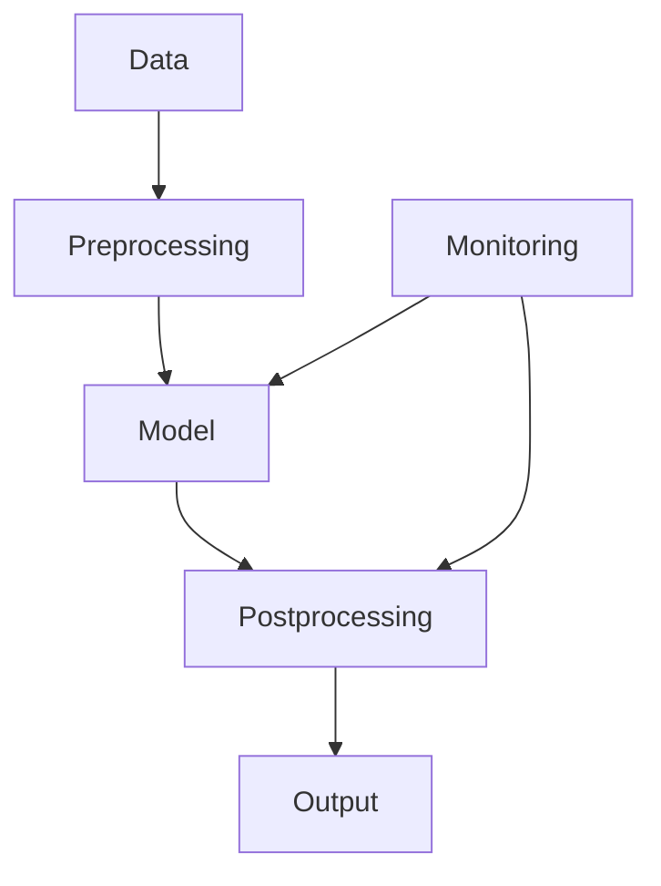

                 

## 1. 背景介绍

在当今的数字化世界中，人工智能（AI）和机器学习（ML）模型已经渗透到我们的日常生活中，从搜索引擎到自动驾驶汽车，再到医疗诊断。然而，构建一个有用的模型只是故事的开始。要实现模型的价值，我们需要将其部署到生产环境中，并考虑到其社会影响。本文将深入探讨基础模型的部署和其对社会的影响。

## 2. 核心概念与联系

### 2.1 部署的定义

模型部署是指将训练好的模型集成到生产环境中的过程。这包括将模型转换为可执行的代码，并将其集成到应用程序中，以便它可以处理实时数据并提供预测结果。

### 2.2 部署的类型

模型部署可以分为两种主要类型：在线部署和离线部署。

- **在线部署（Online Deployment）**：在线部署是指模型在运行时加载并用于处理实时数据。这适用于需要实时预测的应用程序，例如自动驾驶汽车或实时推荐系统。
- **离线部署（Batch Deployment）**：离线部署是指模型在运行时不加载，而是用于处理预先收集的数据。这适用于需要处理大量数据的应用程序，例如图像分类或文本分类。

### 2.3 部署的生命周期

模型部署的生命周期包括以下步骤：

1. **模型训练（Model Training）**：使用标记数据训练模型。
2. **模型评估（Model Evaluation）**：评估模型的性能，并对其进行调优。
3. **模型转换（Model Conversion）**：将模型转换为可执行的代码。
4. **模型部署（Model Deployment）**：将模型集成到应用程序中。
5. **模型监控（Model Monitoring）**：监控模型的性能，并对其进行维护和更新。

### 2.4 部署架构

模型部署架构可以使用不同的组件，如下图所示：



## 3. 核心算法原理 & 具体操作步骤

### 3.1 算法原理概述

模型部署的核心是将模型转换为可执行的代码。这通常涉及到将模型序列化为一种可以存储和加载的格式，并将其集成到应用程序中。

### 3.2 算法步骤详解

1. **模型序列化（Model Serialization）**：将模型转换为一种可以存储和加载的格式。常用的序列化格式包括JSON、Pickle和ONNX。
2. **模型加载（Model Loading）**：加载序列化的模型，并将其集成到应用程序中。
3. **预测（Prediction）**：使用加载的模型对新数据进行预测。

### 3.3 算法优缺点

**优点**：

- 可以将模型集成到应用程序中，从而实现其价值。
- 可以处理实时数据，并提供实时预测结果。

**缺点**：

- 部署过程复杂，需要考虑的因素很多。
- 需要对模型进行维护和更新，以保持其性能。

### 3.4 算法应用领域

模型部署应用于各种领域，包括但不限于：

- **自动驾驶**：模型需要实时加载并用于处理传感器数据。
- **推荐系统**：模型需要实时加载并用于处理用户数据。
- **医疗诊断**：模型需要离线加载并用于处理患者数据。

## 4. 数学模型和公式 & 详细讲解 & 举例说明

### 4.1 数学模型构建

模型部署的数学模型可以表示为：

$$M = f(D, P, E)$$

其中，$M$表示模型，$D$表示数据，$P$表示参数，$E$表示环境。

### 4.2 公式推导过程

模型部署的目标是最小化模型在环境$E$中的误差：

$$\min_{P} L(M(D, P), E)$$

其中，$L$表示损失函数。

### 4.3 案例分析与讲解

例如，在自动驾驶汽车中，模型$M$需要处理传感器数据$D$，并使用参数$P$进行预测。环境$E$包括道路条件、天气条件等。模型部署的目标是最小化模型在环境$E$中的误差，即最小化汽车与道路之间的距离。

## 5. 项目实践：代码实例和详细解释说明

### 5.1 开发环境搭建

要部署模型，我们需要一个开发环境。我们将使用Python和TensorFlow作为示例。

### 5.2 源代码详细实现

以下是一个简单的模型部署示例：

```python
import tensorflow as tf

# 训练模型
model = tf.keras.models.Sequential([
    tf.keras.layers.Dense(64, activation='relu', input_shape=(784,)),
    tf.keras.layers.Dense(10, activation='softmax')
])
model.compile(optimizer='adam', loss='sparse_categorical_crossentropy', metrics=['accuracy'])
model.fit(x_train, y_train, epochs=5)

# 序列化模型
model.save('model.h5')

# 加载模型
loaded_model = tf.keras.models.load_model('model.h5')

# 使用模型进行预测
predictions = loaded_model.predict(x_test)
```

### 5.3 代码解读与分析

在上述代码中，我们首先使用TensorFlow训练一个简单的模型。然后，我们使用`model.save()`方法序列化模型，并使用`tf.keras.models.load_model()`方法加载模型。最后，我们使用加载的模型对新数据进行预测。

### 5.4 运行结果展示

运行上述代码后，我们可以看到模型的准确性，并可以使用加载的模型对新数据进行预测。

## 6. 实际应用场景

### 6.1 当前应用

模型部署已经在各种领域得到广泛应用，从自动驾驶到医疗诊断。

### 6.2 未来应用展望

随着AI和ML技术的发展，模型部署将变得更加简单和高效。我们可以期待模型部署在更多领域的应用，例如空间探索和人工智能驱动的城市规划。

## 7. 工具和资源推荐

### 7.1 学习资源推荐

- **Books**：《Machine Learning with Python》和《Deep Learning with Python》都是很好的学习资源。
- **Online Courses**：Coursera和Udacity提供了许多有关模型部署的在线课程。

### 7.2 开发工具推荐

- **TensorFlow Extended（TFX）**：TFX是一个端到端的机器学习平台，可以简化模型部署过程。
- **Kubeflow Pipelines**：Kubeflow Pipelines是一个开源平台，可以帮助构建和部署机器学习工作流。

### 7.3 相关论文推荐

- **Paper**：《Large-Scale Online Prediction with TensorFlow》和《Model Serving at Google》都是有关模型部署的优秀论文。

## 8. 总结：未来发展趋势与挑战

### 8.1 研究成果总结

本文介绍了模型部署的概念、类型、生命周期和架构。我们还讨论了模型部署的数学模型和公式，并提供了一个简单的代码示例。

### 8.2 未来发展趋势

未来，模型部署将变得更加自动化和智能化。我们可以期待模型部署在更多领域的应用，并看到模型部署过程的改进。

### 8.3 面临的挑战

模型部署面临的挑战包括模型的可解释性、模型的安全性和模型的可靠性。

### 8.4 研究展望

未来的研究将关注模型部署的自动化、模型的可解释性和模型的安全性。

## 9. 附录：常见问题与解答

**Q：模型部署需要多长时间？**

**A：模型部署的时间取决于模型的大小和复杂性，以及部署环境的复杂性。通常，模型部署需要几个小时到几天的时间。**

**Q：模型部署需要多少成本？**

**A：模型部署的成本取决于部署环境的成本和模型的复杂性。通常，模型部署需要数千美元到数百万美元的成本。**

**Q：模型部署需要什么样的技能？**

**A：模型部署需要机器学习工程师和软件工程师的技能。这些技能包括模型训练、模型评估、模型转换和模型集成。**

## 作者：禅与计算机程序设计艺术 / Zen and the Art of Computer Programming

