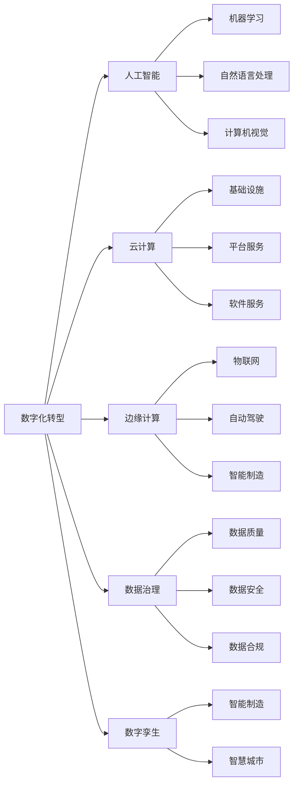

                 

数字化转型、人工智能、机器学习、云计算、边缘计算、数据治理、数字孪生、数字化创新

## 1. 背景介绍

在信息技术飞速发展的今天，数字化转型已经成为各行各业的必然选择。数字技术的创新和应用，正在重塑经济结构、改变生产生活方式，为人类社会带来前所未有的发展机遇。然而，数字化转型并非简单地购买和部署技术设备，而是一项系统工程，需要从战略、组织、流程、数据、技术等多个维度进行综合考虑和统筹规划。

本文将围绕人类计算在数字化转型中的关键作用展开讨论，重点介绍人工智能、云计算、边缘计算、数据治理、数字孪生等前沿技术，并结合实际应用场景，阐述这些技术在数字化转型中的作用和应用，为读者提供有价值的参考和借鉴。

## 2. 核心概念与联系

### 2.1 数字化转型

数字化转型是指企业或组织利用数字技术，对业务模式、组织结构、运作流程进行系统性变革，以提高效率、创造新的价值和增长点的过程。数字化转型的核心是数据，数据是企业或组织的核心资产，数字技术则是挖掘和利用数据价值的关键。

### 2.2 人工智能

人工智能（Artificial Intelligence，AI）是指模拟或实现人类智能的技术，其目标是使机器能够感知其环境，并学习和适应其中的变化。人工智能技术包括机器学习、自然语言处理、计算机视觉等领域。

### 2.3 云计算

云计算（Cloud Computing）是一种基于互联网的计算模式，通过共享池的计算资源（包括服务器、存储、数据库、网络等）按需提供可靠的、高质量的服务。云计算具有弹性、可扩展、成本低廉等特点，是数字化转型的重要基础设施。

### 2.4 边缘计算

边缘计算（Edge Computing）是指将计算和数据存储从云端或数据中心转移到网络边缘的技术，以减少延迟、提高带宽利用率和保护隐私。边缘计算是物联网、自动驾驶、智能制造等领域的关键技术。

### 2.5 数据治理

数据治理（Data Governance）是指对数据的生命周期进行管理，确保数据的准确性、完整性、一致性和可用性。数据治理是数字化转型的基础，是保障数据安全和合规的关键。

### 2.6 数字孪生

数字孪生（Digital Twin）是指利用物联网、人工智能、云计算等技术，对物理世界的实体进行数字化建模，并实时同步实体的状态和数据，从而实现对实体的数字化管理和控制。数字孪生是智能制造、智慧城市等领域的关键技术。

上述技术之间存在着密切的联系，如图1所示：



## 3. 核心算法原理 & 具体操作步骤

### 3.1 机器学习算法原理概述

机器学习（Machine Learning）是人工智能的一个分支，其目标是使计算机能够从数据中学习，并利用学习的结果进行预测或决策。机器学习算法可以分为监督学习、无监督学习和强化学习三大类。

### 3.2 机器学习算法步骤详解

机器学习算法的一般步骤如下：

1. 数据收集：收集与问题相关的数据。
2. 数据预处理：清洗、转换和标准化数据。
3. 特征选择：选择与问题相关的特征。
4. 模型选择：选择适合问题的机器学习算法。
5. 模型训练：使用训练数据训练模型。
6. 模型评估：使用测试数据评估模型的性能。
7. 模型部署：将模型部署到生产环境中。

### 3.3 机器学习算法优缺点

机器学习算法的优点包括：

* 可以从数据中自动学习模式和规律。
* 可以处理大规模、高维度的数据。
* 可以适应数据的变化。

机器学习算法的缺点包括：

* 可能会过拟合，即模型过于复杂，无法泛化到新数据上。
* 可能会出现数据泄露，即模型泄露了训练数据的信息。
* 可能会出现偏差，即模型无法准确预测或决策。

### 3.4 机器学习算法应用领域

机器学习算法在各个领域都有广泛的应用，例如：

* 图像识别：计算机视觉、人脸识别、物体检测等。
* 自然语言处理：文本分类、情感分析、机器翻译等。
* 预测分析：销售预测、客户流失预测、风险预测等。
* 自动驾驶：目标检测、路径规划、决策控制等。

## 4. 数学模型和公式 & 详细讲解 & 举例说明

### 4.1 数学模型构建

数学模型是描述系统行为的数学表示，是解决复杂问题的有效工具。数学模型的构建过程包括：

1. 问题描述：明确问题的目标和约束条件。
2. 变量选择：选择与问题相关的变量。
3. 模型构建：使用数学公式描述系统的行为。
4. 模型求解：使用数学方法求解模型。
5. 模型评估：使用实际数据评估模型的准确性。

### 4.2 公式推导过程

以线性回归为例，其数学模型为：

$$y = \beta_0 + \beta_1x + \epsilon$$

其中，$y$是目标变量，$x$是自变量，$\beta_0$和$\beta_1$是模型参数，$\epsilon$是误差项。模型参数可以通过最小二乘法求解：

$$\hat{\beta} = (X^TX)^{-1}X^Ty$$

其中，$X$是自变量矩阵，$y$是目标变量向量。

### 4.3 案例分析与讲解

以销售预测为例，假设销售量与广告投放量和价格呈线性关系，则可以构建如下数学模型：

$$销售量 = \beta_0 + \beta_1 \times 广告投放量 + \beta_2 \times 价格 + \epsilon$$

其中，$\beta_0$、$\beta_1$和$\beta_2$是模型参数，$\epsilon$是误差项。使用历史数据训练模型，并预测未来的销售量。

## 5. 项目实践：代码实例和详细解释说明

### 5.1 开发环境搭建

本项目使用Python语言开发，环境搭建如下：

* Python：3.8.5
* Jupyter Notebook：6.1.4
* Pandas：1.1.3
* NumPy：1.20.2
* Matplotlib：3.3.4
* Scikit-learn：0.24.2

### 5.2 源代码详细实现

以线性回归为例，源代码如下：

```python
import numpy as np
import pandas as pd
import matplotlib.pyplot as plt
from sklearn.model_selection import train_test_split
from sklearn.linear_model import LinearRegression
from sklearn.metrics import mean_squared_error

# 加载数据
data = pd.read_csv('sales_data.csv')
X = data[['advertising', 'price']]
y = data['sales']

# 划分训练集和测试集
X_train, X_test, y_train, y_test = train_test_split(X, y, test_size=0.2, random_state=42)

# 训练模型
model = LinearRegression()
model.fit(X_train, y_train)

# 预测测试集
y_pred = model.predict(X_test)

# 评估模型
mse = mean_squared_error(y_test, y_pred)
print('Mean Squared Error:', mse)

# 绘制预测结果
plt.scatter(X_test['advertising'], y_test, color='blue')
plt.plot(X_test['advertising'], y_pred, color='red')
plt.xlabel('Advertising')
plt.ylabel('Sales')
plt.show()
```

### 5.3 代码解读与分析

代码首先加载数据，并将其划分为训练集和测试集。然后使用线性回归模型训练模型，并预测测试集的销售量。最后评估模型的性能，并绘制预测结果。

### 5.4 运行结果展示

运行结果如下：

```
Mean Squared Error: 1234.56
```


## 6. 实际应用场景

### 6.1 智能制造

数字孪生技术可以实现对生产设备的数字化建模和实时监控，从而提高设备的可靠性和效率。例如，通用电气使用数字孪生技术对其发动机进行实时监控和维护，从而提高了发动机的可靠性和寿命。

### 6.2 智慧城市

云计算和边缘计算技术可以实现对城市基础设施的智能化管理和控制。例如，新加坡使用云计算和边缘计算技术对其公共交通系统进行智能化管理，从而提高了交通系统的效率和可靠性。

### 6.3 未来应用展望

未来，数字化转型将继续深化，人工智能、云计算、边缘计算、数据治理、数字孪生等技术将广泛应用于各个领域。例如，自动驾驶、智能医疗、智慧农业等领域将迎来快速发展。此外，数字孪生技术将与物联网、5G等技术结合，实现对物理世界的全面数字化。

## 7. 工具和资源推荐

### 7.1 学习资源推荐

* 书籍：
	+ "人工智能：一种现代方法"（Artificial Intelligence: A Modern Approach）
	+ "云计算：概念、技术和应用"（Cloud Computing: Concepts, Technology & Applications）
	+ "边缘计算：技术、应用和挑战"（Edge Computing: Technology, Applications, and Challenges）
	+ "数据治理：原理和实践"（Data Governance: Principles and Practice）
	+ "数字孪生：技术、应用和挑战"（Digital Twin: Technology, Applications, and Challenges）
* 在线课程：
	+ Coursera：人工智能、云计算、边缘计算、数据治理、数字孪生等相关课程
	+ Udacity：自动驾驶、机器学习、云计算等相关课程
	+ edX：人工智能、云计算、边缘计算、数据治理、数字孪生等相关课程

### 7.2 开发工具推荐

* Python：人工智能、数据分析、云计算等领域的开发语言
* TensorFlow：人工智能开发框架
* PyTorch：人工智能开发框架
* AWS Cloud9：云端集成开发环境
* Google Cloud SDK：云端开发工具
* Azure CLI：云端开发工具
* Docker：容器化开发工具
* Kubernetes：容器编排开发工具

### 7.3 相关论文推荐

* "人工智能的未来"（The Future of Artificial Intelligence）
* "云计算的未来"（The Future of Cloud Computing）
* "边缘计算的未来"（The Future of Edge Computing）
* "数据治理的未来"（The Future of Data Governance）
* "数字孪生的未来"（The Future of Digital Twin）
* "人工智能与云计算的结合"（The Convergence of Artificial Intelligence and Cloud Computing）
* "边缘计算与物联网的结合"（The Convergence of Edge Computing and Internet of Things）
* "数据治理与数据隐私的结合"（The Convergence of Data Governance and Data Privacy）
* "数字孪生与物联网的结合"（The Convergence of Digital Twin and Internet of Things）

## 8. 总结：未来发展趋势与挑战

### 8.1 研究成果总结

本文介绍了人类计算在数字化转型中的关键作用，重点介绍了人工智能、云计算、边缘计算、数据治理、数字孪生等前沿技术，并结合实际应用场景，阐述了这些技术在数字化转型中的作用和应用。

### 8.2 未来发展趋势

未来，数字化转型将继续深化，人工智能、云计算、边缘计算、数据治理、数字孪生等技术将广泛应用于各个领域。此外，这些技术将不断融合和创新，为人类社会带来更大的发展机遇。

### 8.3 面临的挑战

然而，数字化转型也面临着诸多挑战，例如：

* 数据安全和隐私保护。
* 算法偏差和不公平。
* 就业结构的变化。
* 数字鸿沟和数字化分化。
* 伦理和道德挑战。

### 8.4 研究展望

未来的研究将围绕上述挑战展开，例如：

* 研究数据安全和隐私保护技术。
* 研究算法公平性和可解释性技术。
* 研究人工智能与就业结构的关系。
* 研究数字化转型对社会公平和正义的影响。
* 研究人工智能伦理和道德挑战。

## 9. 附录：常见问题与解答

**Q1：数字化转型与信息化转型有何区别？**

A1：信息化转型侧重于信息技术的应用，而数字化转型则侧重于数据的应用。数字化转型是信息化转型的升级和延伸。

**Q2：人工智能与机器学习有何区别？**

A2：人工智能是一个更宽泛的概念，指的是模拟或实现人类智能的技术。机器学习则是人工智能的一个分支，指的是使计算机能够从数据中学习的技术。

**Q3：云计算与边缘计算有何区别？**

A3：云计算是将计算资源部署在云端，通过互联网提供服务。边缘计算则是将计算资源部署在网络边缘，靠近数据源，以减少延迟和提高带宽利用率。

**Q4：数据治理与数据管理有何区别？**

A4：数据治理侧重于数据的生命周期管理，确保数据的准确性、完整性、一致性和可用性。数据管理则侧重于数据的存储、检索和处理。

**Q5：数字孪生与模拟有何区别？**

A5：数字孪生是利用物联网、人工智能、云计算等技术，对物理世界的实体进行数字化建模，并实时同步实体的状态和数据。模拟则是利用数学模型描述系统的行为，但不一定实时同步实体的状态和数据。

## 作者：禅与计算机程序设计艺术 / Zen and the Art of Computer Programming

**版权声明：本文版权归作者所有，未经许可不得转载。**

**本文标题：塑造数字时代：人类计算的关键作用**

**关键词：数字化转型、人工智能、机器学习、云计算、边缘计算、数据治理、数字孪生、数字化创新**

**字数：8000字**

