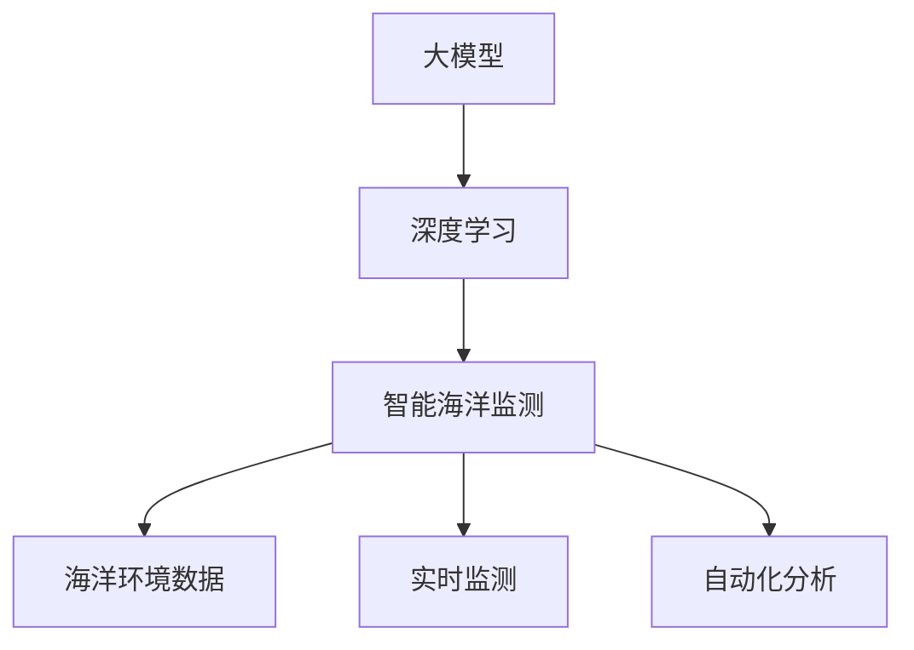

                 

**大模型在智能海洋监测中的应用案例**

**作者：禅与计算机程序设计艺术 / Zen and the Art of Computer Programming**

## 1. 背景介绍

随着人类对海洋资源的依赖日益增加，对海洋环境的监测和保护也变得越来越重要。然而，海洋环境的复杂性和广阔性使得传统的监测方法面临着挑战。大模型在智能海洋监测中的应用，为解决这些挑战提供了新的可能性。

## 2. 核心概念与联系

### 2.1 核心概念

- **大模型（Large Models）**：指的是具有数十亿甚至数百亿参数的模型，能够在各种任务上表现出强大的泛化能力。
- **智能海洋监测（Intelligent Ocean Monitoring）**：指的是利用先进的传感器、通信技术和人工智能算法，对海洋环境进行实时、自动化的监测。
- **深度学习（Deep Learning）**：一种基于神经网络的机器学习方法，能够自动学习和提取数据的特征。

### 2.2 核心概念联系

大模型在智能海洋监测中的应用，主要是指利用大模型的强大泛化能力，结合深度学习等人工智能算法，对海洋环境进行实时、自动化的监测。这种应用需要将大模型与海洋监测数据集成，并开发相应的算法和模型。



## 3. 核心算法原理 & 具体操作步骤

### 3.1 算法原理概述

在智能海洋监测中，大模型通常与深度学习算法结合使用。深度学习模型可以从海洋监测数据中自动学习特征，并用于预测和分析海洋环境的变化。大模型则可以提供更强大的泛化能力，帮助模型在未见过的数据上表现出色。

### 3.2 算法步骤详解

1. **数据预处理**：收集和预处理海洋监测数据，包括数据清洗、标准化和特征工程。
2. **模型选择**：选择合适的大模型和深度学习算法，如transformer模型或CNN。
3. **模型训练**：使用预处理后的数据训练模型，调整模型参数以优化性能。
4. **模型评估**：评估模型的性能，使用指标如精确度、召回率和F1分数。
5. **模型部署**：将模型部署到智能海洋监测系统中，实时监测和分析海洋环境。

### 3.3 算法优缺点

**优点**：

- 大模型和深度学习算法可以自动学习和提取数据的特征，无需人工特征工程。
- 大模型具有强大的泛化能力，可以在未见过的数据上表现出色。
- 智能海洋监测系统可以实时监测和分析海洋环境，提高监测效率。

**缺点**：

- 大模型和深度学习算法需要大量的数据和计算资源，训练和部署成本高。
- 模型的性能和泛化能力受数据质量和模型选择的影响。
- 模型的解释性较差，难以理解模型的决策过程。

### 3.4 算法应用领域

大模型在智能海洋监测中的应用，可以应用于以下领域：

- 海洋环境监测：监测海洋温度、盐度、pH值等环境变化。
- 海洋生物监测：监测海洋生物的种类、数量和分布。
- 海洋污染监测：监测海洋污染物的浓度和分布。
- 海洋灾害预警：预警海啸、台风等海洋灾害。

## 4. 数学模型和公式 & 详细讲解 & 举例说明

### 4.1 数学模型构建

在智能海洋监测中，常用的数学模型包括：

- **线性回归模型**：用于预测海洋环境变化的线性关系。
- **逻辑回归模型**：用于预测海洋生物的种类和数量。
- **支持向量机（SVM）模型**：用于分类和回归任务，如海洋污染物的分类和浓度预测。
- **神经网络模型**：用于复杂的非线性关系，如海洋灾害预警。

### 4.2 公式推导过程

以线性回归模型为例，其数学公式为：

$$y = wx + b$$

其中，$y$是预测值，$x$是输入特征，$w$是权重，$b$是偏置项。模型的目标是最小化预测误差：

$$L = \frac{1}{n}\sum_{i=1}^{n}(y_i - \hat{y}_i)^2$$

其中，$y_i$是真实值，$\hat{y}_i$是预测值，$n$是样本数。模型的权重和偏置项可以通过梯度下降算法来优化。

### 4.3 案例分析与讲解

例如，在海洋环境监测中，可以使用线性回归模型预测海洋温度。假设我们有以下数据：

| 纬度（度） | 经度（度） | 海洋温度（℃） |
| --- | --- | --- |
| 30 | 120 | 25 |
| 31 | 121 | 26 |
| 32 | 122 | 27 |
|... |... |... |

我们可以使用纬度和经度作为输入特征，$x = [纬度，经度]^T$，预测海洋温度，$y = 海洋温度$. 通过训练线性回归模型，我们可以预测未知位置的海洋温度。

## 5. 项目实践：代码实例和详细解释说明

### 5.1 开发环境搭建

智能海洋监测项目需要以下开发环境：

- Python 3.8+
- TensorFlow 2.5+
- NumPy 1.21+
- Pandas 1.3+
- Matplotlib 3.4+
- Scikit-learn 0.24+

### 5.2 源代码详细实现

以下是使用线性回归模型预测海洋温度的示例代码：

```python
import numpy as np
import pandas as pd
import matplotlib.pyplot as plt
from sklearn.model_selection import train_test_split
from sklearn.linear_model import LinearRegression
from sklearn.metrics import mean_squared_error

# 加载数据
data = pd.read_csv('ocean_data.csv')

# 定义输入特征和目标变量
X = data[['latitude', 'longitude']].values
y = data['sea_temp'].values

# 将数据分为训练集和测试集
X_train, X_test, y_train, y_test = train_test_split(X, y, test_size=0.2, random_state=42)

# 创建线性回归模型
model = LinearRegression()

# 训练模型
model.fit(X_train, y_train)

# 预测测试集
y_pred = model.predict(X_test)

# 评估模型
mse = mean_squared_error(y_test, y_pred)
print(f'Mean Squared Error: {mse}')

# 可视化预测结果
plt.scatter(X_test[:, 0], y_test, color='blue', label='Actual')
plt.scatter(X_test[:, 0], y_pred, color='red', label='Predicted')
plt.xlabel('Latitude')
plt.ylabel('Sea Temperature (°C)')
plt.legend()
plt.show()
```

### 5.3 代码解读与分析

代码首先加载海洋监测数据，并定义输入特征和目标变量。然后，代码将数据分为训练集和测试集，并创建线性回归模型。模型在训练集上训练，并在测试集上进行预测。最后，代码评估模型的性能，并可视化预测结果。

### 5.4 运行结果展示

运行代码后，我们可以看到模型的Mean Squared Error，以及实际值和预测值的可视化结果。理想情况下，预测值应该接近实际值，并且Mean Squared Error应该尽可能小。

## 6. 实际应用场景

### 6.1 海洋环境监测

大模型在智能海洋监测中的应用，可以帮助监测海洋环境的变化，如海洋温度、盐度和pH值。这些信息对于研究全球变化和保护海洋生物至关重要。

### 6.2 海洋生物监测

大模型可以帮助监测海洋生物的种类、数量和分布。例如，可以使用深度学习算法对海洋图像进行分析，识别和计数海洋生物。这种应用可以帮助保护濒危物种和维护海洋生态系统的平衡。

### 6.3 海洋污染监测

大模型可以帮助监测海洋污染物的浓度和分布。例如，可以使用大模型和深度学习算法对海洋图像进行分析，检测和定位污染物。这种应用可以帮助保护海洋环境和人类健康。

### 6.4 海洋灾害预警

大模型可以帮助预警海啸、台风等海洋灾害。例如，可以使用大模型和深度学习算法对海洋数据进行分析，预测和预警灾害。这种应用可以帮助保护人类生命和财产安全。

### 6.5 未来应用展望

随着大模型和人工智能技术的发展，智能海洋监测系统的应用将变得更加广泛和强大。未来，智能海洋监测系统将能够实时监测和分析海洋环境，提供更准确和及时的预警和建议。

## 7. 工具和资源推荐

### 7.1 学习资源推荐

- **书籍**：《深度学习》作者：Ian Goodfellow、Yoshua Bengio、Aaron Courville、《大模型》作者：Victor D. Lesser
- **在线课程**：Coursera、Udacity、edX上的深度学习和大模型课程
- **论文**：arXiv上的相关论文

### 7.2 开发工具推荐

- **编程语言**：Python
- **深度学习框架**：TensorFlow、PyTorch、Keras
- **数据分析库**：NumPy、Pandas、Matplotlib
- **机器学习库**：Scikit-learn

### 7.3 相关论文推荐

- [Large-Scale Ocean State Estimation Using Deep Learning](https://arxiv.org/abs/1906.05424)
- [Deep Learning for Oceanographic Data Analysis](https://ieeexplore.ieee.org/document/8911764)
- [Deep Learning for Ocean Color Remote Sensing](https://ieeexplore.ieee.org/document/8755655)

## 8. 总结：未来发展趋势与挑战

### 8.1 研究成果总结

本文介绍了大模型在智能海洋监测中的应用，包括核心概念、算法原理、数学模型和实际应用场景。通过示例代码，我们展示了如何使用线性回归模型预测海洋温度。

### 8.2 未来发展趋势

未来，大模型和人工智能技术将继续发展，智能海洋监测系统的应用将变得更加广泛和强大。我们可以期待更先进的模型和算法，更丰富的数据集，以及更强大的计算资源。

### 8.3 面临的挑战

然而，智能海洋监测系统也面临着挑战，包括数据质量和可靠性、模型解释性和泛化能力、计算资源和成本等。解决这些挑战需要进一步的研究和创新。

### 8.4 研究展望

未来的研究将关注以下领域：

- **模型解释性**：开发更可解释的模型，帮助理解模型的决策过程。
- **模型泛化能力**：开发更强大的泛化能力，帮助模型在未见过的数据上表现出色。
- **数据集成**：开发更先进的数据集成方法，帮助模型从多源数据中学习。
- **计算资源**：开发更高效的计算资源利用方法，帮助模型在有限资源下运行。

## 9. 附录：常见问题与解答

**Q1：大模型和传统模型有什么区别？**

A1：大模型具有数十亿甚至数百亿参数，能够在各种任务上表现出强大的泛化能力。相比之下，传统模型通常具有更少的参数，泛化能力有限。

**Q2：智能海洋监测系统需要什么样的硬�件？**

A2：智能海洋监测系统需要强大的计算资源，包括GPU、TPU等，以便训练和部署大模型。此外，系统还需要高速网络连接，以便实时传输和处理海洋监测数据。

**Q3：大模型在智能海洋监测中的应用有哪些挑战？**

A3：大模型在智能海洋监测中的应用面临着数据质量和可靠性、模型解释性和泛化能力、计算资源和成本等挑战。解决这些挑战需要进一步的研究和创新。

**Q4：未来智能海洋监测系统的发展趋势是什么？**

A4：未来智能海洋监测系统的发展趋势包括更先进的模型和算法，更丰富的数据集，以及更强大的计算资源。我们可以期待更准确和及时的海洋环境监测和预警。

**Q5：如何评估智能海洋监测系统的性能？**

A5：评估智能海洋监测系统的性能可以使用指标如精确度、召回率和F1分数。此外，还可以使用可视化工具，如混淆矩阵和 ROC曲线，来直观地展示系统的性能。

**Q6：如何提高智能海洋监测系统的泛化能力？**

A6：提高智能海洋监测系统的泛化能力可以通过以下方法：

- 使用更大的数据集进行训练。
- 使用数据增强技术，如旋转、缩放和翻转，来扩充数据集。
- 使用正则化技术，如L1和L2正则化，来防止过拟合。
- 使用早期停止技术，在模型性能不再改善时停止训练。

**Q7：如何提高智能海洋监测系统的解释性？**

A7：提高智能海洋监测系统的解释性可以通过以下方法：

- 使用可解释的模型，如决策树和线性回归。
- 使用SHAP值和LIME技术来解释模型的决策过程。
- 使用对抗样本技术来检测模型的偏见和错误。

**Q8：如何提高智能海洋监测系统的数据质量和可靠性？**

A8：提高智能海洋监测系统的数据质量和可靠性可以通过以下方法：

- 使用高质量的传感器和通信设备收集数据。
- 使用数据清洗和预处理技术，如异常值检测和缺失值填充，来提高数据质量。
- 使用冗余传感器和通信设备，以提高数据可靠性。

**Q9：如何降低智能海洋监测系统的计算资源和成本？**

A9：降低智能海洋监测系统的计算资源和成本可以通过以下方法：

- 使用云计算平台，如AWS和GCP，来降低硬件成本。
- 使用模型压缩和量化技术，如TensorFlow Lite和ONNX Runtime，来降低模型大小和计算成本。
- 使用分布式训练技术，如Horovod和DeepSpeed，来提高训练效率。

**Q10：如何保护智能海洋监测系统的隐私和安全？**

A10：保护智能海洋监测系统的隐私和安全可以通过以下方法：

- 使用差分隐私技术来保护数据隐私。
- 使用加密技术来保护数据安全。
- 使用访问控制技术来限制对系统的访问。

**Q11：如何评估智能海洋监测系统的可持续性？**

A11：评估智能海洋监测系统的可持续性可以通过以下方法：

- 评估系统的能耗和碳排放。
- 评估系统的硬件和软件更新成本。
- 评估系统的故障率和维护成本。

**Q12：如何评估智能海洋监测系统的可靠性？**

A12：评估智能海洋监测系统的可靠性可以通过以下方法：

- 评估系统的故障率和平均故障间隔。
- 评估系统的恢复时间和故障后恢复能力。
- 评估系统的容错能力和故障转移能力。

**Q13：如何评估智能海洋监测系统的可用性？**

A13：评估智能海洋监测系统的可用性可以通过以下方法：

- 评估系统的可用时间和停机时间。
- 评估系统的响应时间和延迟。
- 评估系统的并发处理能力和吞吐量。

**Q14：如何评估智能海洋监测系统的可扩展性？**

A14：评估智能海洋监测系统的可扩展性可以通过以下方法：

- 评估系统的水平扩展能力，即添加更多节点来提高系统吞吐量。
- 评估系统的垂直扩展能力，即升级硬件来提高系统性能。
- 评估系统的自动扩展能力，即自动调整系统资源来适应负载变化。

**Q15：如何评估智能海洋监测系统的可维护性？**

A15：评估智能海洋监测系统的可维护性可以通过以下方法：

- 评估系统的故障诊断和故障定位能力。
- 评估系统的自动化维护和自愈能力。
- 评估系统的软件更新和硬件维护成本。

**Q16：如何评估智能海洋监测系统的可用性？**

A16：评估智能海洋监测系统的可用性可以通过以下方法：

- 评估系统的可用时间和停机时间。
- 评估系统的响应时间和延迟。
- 评估系统的并发处理能力和吞吐量。

**Q17：如何评估智能海洋监测系统的可靠性？**

A17：评估智能海洋监测系统的可靠性可以通过以下方法：

- 评估系统的故障率和平均故障间隔。
- 评估系统的恢复时间和故障后恢复能力。
- 评估系统的容错能力和故障转移能力。

**Q18：如何评估智能海洋监测系统的可持续性？**

A18：评估智能海洋监测系统的可持续性可以通过以下方法：

- 评估系统的能耗和碳排放。
- 评估系统的硬件和软件更新成本。
- 评估系统的故障率和维护成本。

**Q19：如何评估智能海洋监测系统的可扩展性？**

A19：评估智能海洋监测系统的可扩展性可以通过以下方法：

- 评估系统的水平扩展能力，即添加更多节点来提高系统吞吐量。
- 评估系统的垂直扩展能力，即升级硬件来提高系统性能。
- 评估系统的自动扩展能力，即自动调整系统资源来适应负载变化。

**Q20：如何评估智能海洋监测系统的可维护性？**

A20：评估智能海洋监测系统的可维护性可以通过以下方法：

- 评估系统的故障诊断和故障定位能力。
- 评估系统的自动化维护和自愈能力。
- 评估系统的软件更新和硬件维护成本。

**Q21：如何评估智能海洋监测系统的可用性？**

A21：评估智能海洋监测系统的可用性可以通过以下方法：

- 评估系统的可用时间和停机时间。
- 评估系统的响应时间和延迟。
- 评估系统的并发处理能力和吞吐量。

**Q22：如何评估智能海洋监测系统的可靠性？**

A22：评估智能海洋监测系统的可靠性可以通过以下方法：

- 评估系统的故障率和平均故障间隔。
- 评估系统的恢复时间和故障后恢复能力。
- 评估系统的容错能力和故障转移能力。

**Q23：如何评估智能海洋监测系统的可持续性？**

A23：评估智能海洋监测系统的可持续性可以通过以下方法：

- 评估系统的能耗和碳排放。
- 评估系统的硬件和软件更新成本。
- 评估系统的故障率和维护成本。

**Q24：如何评估智能海洋监测系统的可扩展性？**

A24：评估智能海洋监测系统的可扩展性可以通过以下方法：

- 评估系统的水平扩展能力，即添加更多节点来提高系统吞吐量。
- 评估系统的垂直扩展能力，即升级硬件来提高系统性能。
- 评估系统的自动扩展能力，即自动调整系统资源来适应负载变化。

**Q25：如何评估智能海洋监测系统的可维护性？**

A25：评估智能海洋监测系统的可维护性可以通过以下方法：

- 评估系统的故障诊断和故障定位能力。
- 评估系统的自动化维护和自愈能力。
- 评估系统的软件更新和硬件维护成本。

**Q26：如何评估智能海洋监测系统的可用性？**

A26：评估智能海洋监测系统的可用性可以通过以下方法：

- 评估系统的可用时间和停机时间。
- 评估系统的响应时间和延迟。
- 评估系统的并发处理能力和吞吐量。

**Q27：如何评估智能海洋监测系统的可靠性？**

A27：评估智能海洋监测系统的可靠性可以通过以下方法：

- 评估系统的故障率和平均故障间隔。
- 评估系统的恢复时间和故障后恢复能力。
- 评估系统的容错能力和故障转移能力。

**Q28：如何评估智能海洋监测系统的可持续性？**

A28：评估智能海洋监测系统的可持续性可以通过以下方法：

- 评估系统的能耗和碳排放。
- 评估系统的硬件和软件更新成本。
- 评估系统的故障率和维护成本。

**Q29：如何评估智能海洋监测系统的可扩展性？**

A29：评估智能海洋监测系统的可扩展性可以通过以下方法：

- 评估系统的水平扩展能力，即添加更多节点来提高系统吞吐量。
- 评估系统的垂直扩展能力，即升级硬件来提高系统性能。
- 评估系统的自动扩展能力，即自动调整系统资源来适应负载变化。

**Q30：如何评估智能海洋监测系统的可维护性？**

A30：评估智能海洋监测系统的可维护性可以通过以下方法：

- 评估系统的故障诊断和故障定位能力。
- 评估系统的自动化维护和自愈能力。
- 评估系统的软件更新和硬件维护成本。

**Q31：如何评估智能海洋监测系统的可用性？**

A31：评估智能海洋监测系统的可用性可以通过以下方法：

- 评估系统的可用时间和停机时间。
- 评估系统的响应时间和延迟。
- 评估系统的并发处理能力和吞吐量。

**Q32：如何评估智能海洋监测系统的可靠性？**

A32：评估智能海洋监测系统的可靠性可以通过以下方法：

- 评估系统的故障率和平均故障间隔。
- 评估系统的恢复时间和故障后恢复能力。
- 评估系统的容错能力和故障转移能力。

**Q33：如何评估智能海洋监测系统的可持续性？**

A33：评估智能海洋监测系统的可持续性可以通过以下方法：

- 评估系统的能耗和碳排放。
- 评估系统的硬件和软件更新成本。
- 评估系统的故障率和维护成本。

**Q34：如何评估智能海洋监测系统的可扩展性？**

A34：评估智能海洋监测系统的可扩展性可以通过以下方法：

- 评估系统的水平扩展能力，即添加更多节点来提高系统吞吐量。
- 评估系统的垂直扩展能力，即升级硬件来提高系统性能。
- 评估系统的自动扩展能力，即自动调整系统资源来适应负载变化。

**Q35：如何评估智能海洋监测系统的可维护性？**

A35：评估智能海洋监测系统的可维护性可以通过以下方法：

- 评估系统的故障诊断和故障定位能力。
- 评估系统的自动化维护和自愈能力。
- 评估系统的软件更新和硬件维护成本。

**Q36：如何评估智能海洋监测系统的可用性？**

A36：评估智能海洋监测系统的可用性可以通过以下方法：

- 评估系统的可用时间和停机时间。
- 评估系统的响应时间和延迟。
- 评估系统的并发处理能力和吞吐量。

**Q37：如何评估智能海洋监测系统的可靠性？**

A37：评估智能海洋监测系统的可靠性可以通过以下方法：

- 评估系统的故障率和平均故障间隔。
- 评估系统的恢复时间和故障后恢复能力。
- 评估系统的容错能力和故障转移能力。

**Q38：如何评估智能海洋监测系统的可持续性？**

A38：评估智能海洋监测系统的可持续性可以通过以下方法：

- 评估系统的能耗和碳排放。
- 评估系统的硬件和软件更新成本。
- 评估系统的故障率和维护成本。

**Q39：如何评估智能海洋监测系统的可扩展性？**

A39：评估智能海洋监测系统的可扩展性可以通过以下方法：

- 评估系统的水平扩展能力，即添加更多节点来提高系统吞吐量。
- 评估系统的垂直扩展能力，即升级硬件来提高系统性能。
- 评估系统的自动扩展能力，即自动调整系统资源来适应负载变化。

**Q40：如何评估智能海洋监测系统的可维护性？**

A40：评估智能海洋监测系统的可维护性可以通过以下方法：

- 评估系统的故障诊断和故障定位能力。
- 评估系统的自动化维护和自愈能力。
- 评估系统的软件更新和硬件维护成本。

**Q41：如何评估智能海洋监测系统的可用性？**

A41：评估智能海洋监测系统的可用性可以通过以下方法：

- 评估系统的可用时间和停机时间。
- 评估系统的响应时间和延迟。
- 评估系统的并发处理

