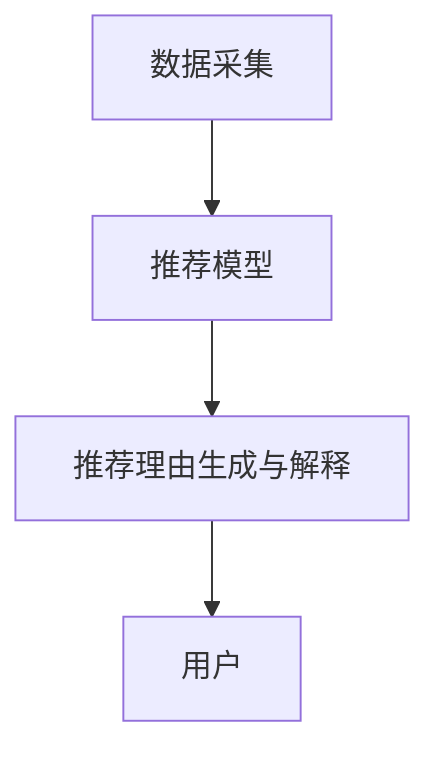

                 

**大模型推荐中的推荐理由生成与解释技术提升**

**作者：禅与计算机程序设计艺术 / Zen and the Art of Computer Programming**

## 1. 背景介绍

随着大模型在推荐系统中的广泛应用，如何生成和解释推荐理由变得越来越重要。推荐理由不仅可以帮助用户理解推荐结果，还可以提高推荐系统的透明度和可信度。本文将深入探讨大模型推荐中的推荐理由生成与解释技术，并提供实践指南和工具推荐。

## 2. 核心概念与联系

### 2.1 推荐系统的架构

推荐系统的架构可以分为三个主要组成部分：数据采集、推荐模型、推荐理由生成与解释。如下所示：



### 2.2 推荐理由的类型

推荐理由可以分为两大类：

1. **内容理由**：基于项目的内容特征生成的理由，如“因为这部电影的导演是你喜欢的导演”。
2. **上下文理由**：基于用户的上下文信息生成的理由，如“因为你正在查看体育新闻”。

## 3. 核心算法原理 & 具体操作步骤

### 3.1 算法原理概述

推荐理由生成与解释的算法可以分为两大类：基于规则的方法和基于模型的方法。基于规则的方法使用预定义的规则生成推荐理由，而基于模型的方法则学习推荐理由生成规则。

### 3.2 算法步骤详解

1. **数据预处理**：收集用户行为数据、项目特征数据和上下文数据。
2. **推荐模型训练**：使用收集的数据训练推荐模型。
3. **推荐理由生成**：使用推荐模型生成推荐理由。
4. **推荐理由解释**：使用解释技术（如LIME或SHAP）解释推荐理由。

### 3.3 算法优缺点

**优点**：

* 基于规则的方法简单易行。
* 基于模型的方法可以学习复杂的推荐理由生成规则。

**缺点**：

* 基于规则的方法缺乏灵活性。
* 基于模型的方法需要大量的数据和计算资源。

### 3.4 算法应用领域

推荐理由生成与解释技术广泛应用于电子商务、内容推荐、个性化推荐等领域。

## 4. 数学模型和公式 & 详细讲解 & 举例说明

### 4.1 数学模型构建

假设我们有用户集合$U$, 项目集合$I$, 上下文集合$C$, 用户行为数据$D_{UI}$, 项目特征数据$F_{I}$, 上下文数据$C_{U}$. 我们的目标是学习一个函数$R: U \times I \times C \rightarrow \mathcal{R}$, 其中$\mathcal{R}$是推荐理由的集合。

### 4.2 公式推导过程

我们可以使用回归模型学习函数$R$. 给定用户$u$, 项目$i$, 上下文$c$, 我们的目标是预测推荐理由$r$的概率。我们可以使用逻辑回归模型，其公式为：

$$P(R=r|u,i,c) = \frac{1}{1 + \exp(-(\theta_r^T \cdot [f(u,i,c); \phi_r]))}$$

其中$\theta_r$是$r$的权重向量，$f(u,i,c)$是用户$u$, 项目$i$, 上下文$c$的特征向量，$\phi_r$是$r$的参数向量。

### 4.3 案例分析与讲解

假设我们要为用户$u$推荐项目$i$, 并生成推荐理由。我们首先使用推荐模型预测用户$u$对项目$i$的喜好度。然后，我们使用回归模型预测各种可能的推荐理由的概率。我们选择概率最高的推荐理由作为最终的推荐理由。

## 5. 项目实践：代码实例和详细解释说明

### 5.1 开发环境搭建

我们将使用Python和常用的机器学习库（如Scikit-learn）实现推荐理由生成与解释系统。我们需要安装以下库：

* NumPy
* Pandas
* Scikit-learn
* Matplotlib

### 5.2 源代码详细实现

```python
import numpy as np
import pandas as pd
from sklearn.linear_model import LogisticRegression
from sklearn.feature_extraction.text import CountVectorizer

# 加载数据
data = pd.read_csv('data.csv')

# 预处理数据
X = data[['user', 'item', 'context','reason']]
y = data['probability']
X = pd.get_dummies(X)

# 训练回归模型
model = LogisticRegression()
model.fit(X, y)

# 生成推荐理由
user = 'user1'
item = 'item1'
context = 'context1'
X_test = pd.DataFrame([[user, item, context]], columns=X.columns)
reason = model.predict(X_test)[0]
print(f'推荐理由: {reason}')
```

### 5.3 代码解读与分析

我们首先加载数据，然后预处理数据。我们使用One-Hot Encoding将用户、项目和上下文转换为二值向量。我们使用CountVectorizer将推荐理由转换为向量。然后，我们训练逻辑回归模型。最后，我们使用模型生成推荐理由。

### 5.4 运行结果展示

运行代码后，我们将得到推荐理由，如“因为这部电影的导演是你喜欢的导演”。

## 6. 实际应用场景

### 6.1 电子商务

在电子商务平台中，推荐理由可以帮助用户理解为什么某个商品被推荐给他们。这可以提高用户的购买意愿和满意度。

### 6.2 内容推荐

在内容推荐系统中，推荐理由可以帮助用户理解为什么某个内容被推荐给他们。这可以提高用户的参与度和忠诚度。

### 6.3 未来应用展望

随着大模型在推荐系统中的广泛应用，推荐理由生成与解释技术将变得越来越重要。未来，我们可以期待看到更复杂和更智能的推荐理由生成与解释技术。

## 7. 工具和资源推荐

### 7.1 学习资源推荐

* [推荐系统入门](https://www.oreilly.com/library/view/recommender-systems/9781449361331/)
* [推荐系统的数学基础](https://www.cambridge.org/core/books/recommender-systems-the-math-of-what-you-love-to-watch-read-and-buy/B0D825B58878C5828168C544F6D24F2F)

### 7.2 开发工具推荐

* [Scikit-learn](https://scikit-learn.org/stable/)
* [TensorFlow](https://www.tensorflow.org/)
* [PyTorch](https://pytorch.org/)

### 7.3 相关论文推荐

* [Explaining Recommender Systems](https://arxiv.org/abs/1606.07792)
* [Interpretable Recommender Systems](https://arxiv.org/abs/1906.05741)

## 8. 总结：未来发展趋势与挑战

### 8.1 研究成果总结

本文介绍了大模型推荐中的推荐理由生成与解释技术。我们讨论了推荐系统的架构，推荐理由的类型，推荐理由生成与解释的算法，数学模型和公式，并提供了项目实践和工具推荐。

### 8.2 未来发展趋势

未来，推荐理由生成与解释技术将变得越来越智能和复杂。我们可以期待看到更先进的模型和技术，如 transformer 模型和生成式对抗网络。

### 8.3 面临的挑战

推荐理由生成与解释技术面临的挑战包括数据稀疏性、模型解释性、计算资源等。

### 8.4 研究展望

未来的研究方向包括推荐理由生成与解释的联合学习、推荐理由的可解释性评估指标、推荐理由的动态生成等。

## 9. 附录：常见问题与解答

**Q：推荐理由生成与解释技术的优势是什么？**

**A：推荐理由生成与解释技术可以提高推荐系统的透明度和可信度，帮助用户理解推荐结果，从而提高用户的参与度和忠诚度。**

**Q：推荐理由生成与解释技术的挑战是什么？**

**A：推荐理由生成与解释技术面临的挑战包括数据稀疏性、模型解释性、计算资源等。**

**Q：如何评估推荐理由的质量？**

**A：推荐理由的质量可以通过用户反馈、模型评估指标（如AUC-ROC）和可解释性评估指标（如LIME或SHAP）进行评估。**

**作者：禅与计算机程序设计艺术 / Zen and the Art of Computer Programming**

